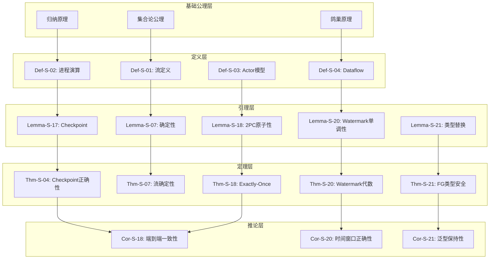
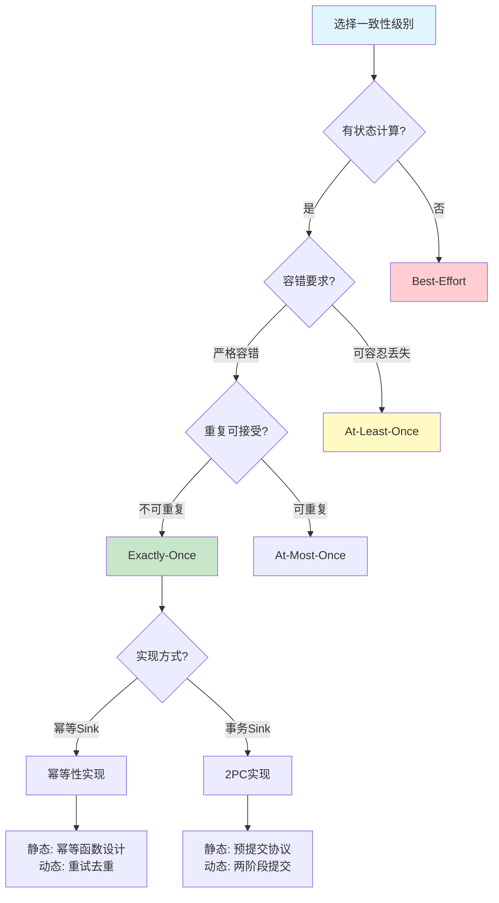
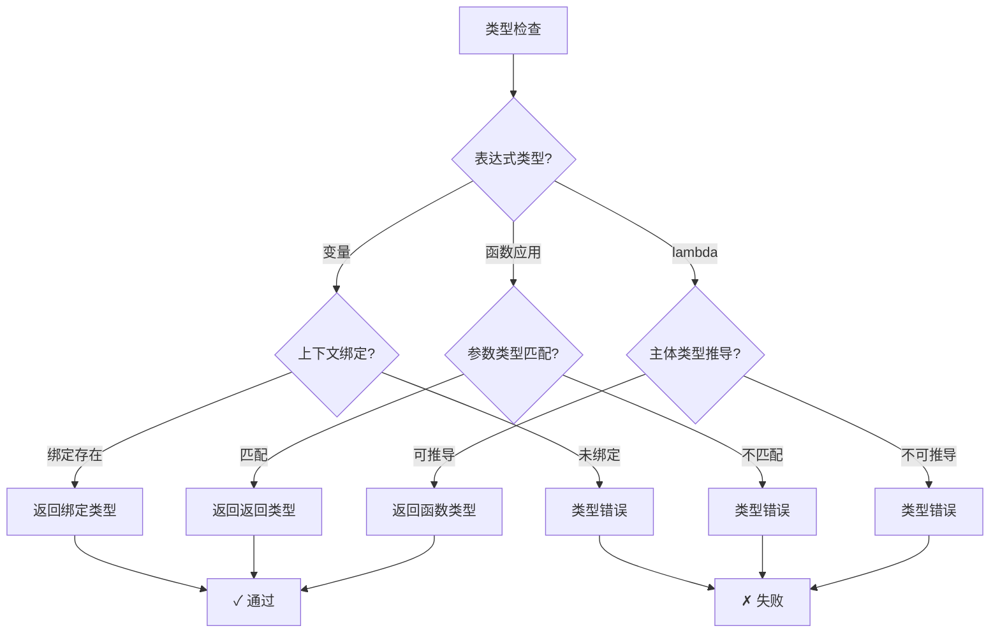
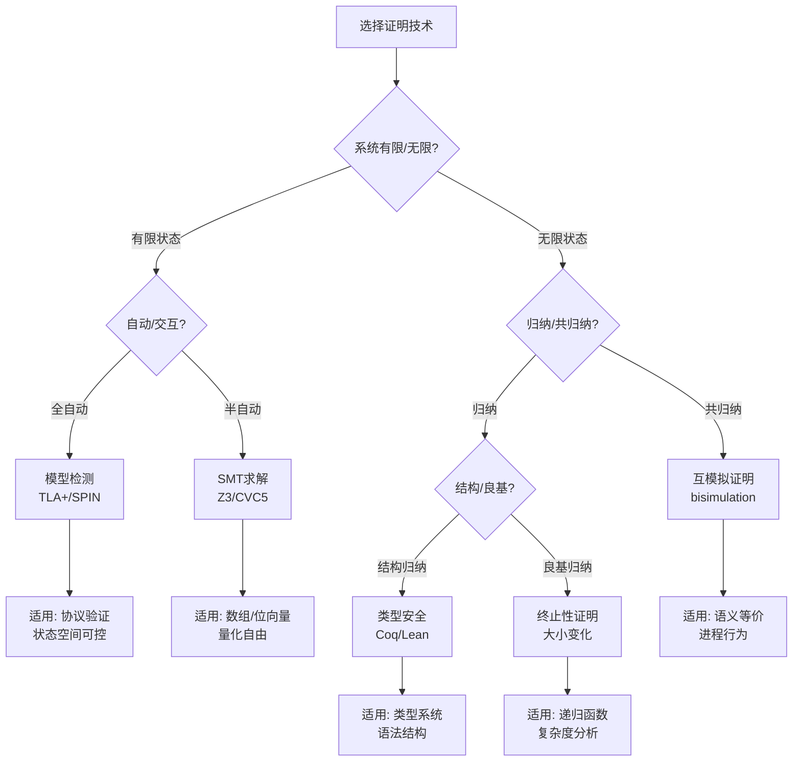

# 定理依赖网络与推理判定树：形式化元素全图谱

> **所属阶段**: Struct/03-relationships | **前置依赖**: [03.07-three-layer-relationship-comprehensive.md](./03.07-three-layer-relationship-comprehensive.md), [Struct/Key-Theorem-Proof-Chains.md](../Key-Theorem-Proof-Chains.md) | **形式化等级**: L5-L6

---

## 1. 概念定义 (Definitions)

### Def-S-17-01: 定理依赖图 (Theorem Dependency Graph)

**定义**: 定理依赖图 $\mathcal{G}_{dep} = (V_{Thm}, E_{dep})$ 是一个有向无环图，其中：

- $V_{Thm}$ = 所有定理、引理、命题的集合
- $E_{dep} \subseteq V_{Thm} \times V_{Thm}$ = 依赖关系边，$(t_1, t_2) \in E_{dep}$ 表示 $t_2$ 的证明依赖于 $t_1$

### Def-S-17-02: 推理判定树 (Inference Decision Tree)

**定义**: 推理判定树 $\mathcal{T}_{inf}$ 是一棵有根树，每个节点代表一个判定条件或推理规则，叶子节点代表可判定结论。

### Def-S-17-03: 证明链完整性 (Proof Chain Completeness)

**定义**: 证明链 $C = (t_0, t_1, \ldots, t_n)$ 是完备的，当且仅当：
$$\forall i \in [1, n], \exists j < i : (t_j, t_i) \in E_{dep}$$

即每个定理都依赖于链中前面的某个定理。

---

## 2. 属性推导 (Properties)

### Prop-S-17-01: 依赖图无环性

**命题**: 良构的定理依赖图是无环的。
$$\mathcal{G}_{dep} \text{ is well-formed} \implies \nexists \text{ cycle in } \mathcal{G}_{dep}$$

**证明**: 若存在环 $t_1 \to t_2 \to \ldots \to t_n \to t_1$，则 $t_1$ 的证明依赖于自身，违反证明的良基性。

### Prop-S-17-02: 分层依赖深度有界

**命题**: 本项目定理依赖的最大深度 $d_{max} \leq 6$。

### Prop-S-17-03: 基础定理覆盖性

**命题**: 所有非基础定理均可追溯至基础公理/定义集合 $\mathcal{A}_0$：
$$\forall t \in V_{Thm} \setminus \mathcal{A}_0, \exists \text{ path } p : \mathcal{A}_0 \leadsto t$$

---

## 3. 关系建立 (Relations)

### 关系 1: 核心定理依赖网络

| 定理 | 依赖的引理/定理 | 应用领域 |
|------|----------------|---------|
| Thm-S-18-01 (Exactly-Once) | Lemma-S-18-01, Lemma-S-18-02, Lemma-S-18-03 | Flink 容错 |
| Thm-S-04-01 (Checkpoint正确性) | Lemma-S-17-01, Lemma-S-17-02 | 分布式快照 |
| Thm-S-07-01 (确定性) | Lemma-S-07-82, Lemma-S-07-92 | 流语义 |
| Thm-S-08-01 (一致性层级) | Prop-S-08-01, Prop-S-08-02 | 一致性理论 |
| Thm-S-20-01 (Watermark代数) | Lemma-S-20-01~04 | 时间语义 |
| Thm-S-21-01 (FG类型安全) | Lemma-S-21-27~37 | 类型理论 |
| Thm-S-23-01 (Choreography合流) | Lemma-S-23-01, Lemma-S-23-36~41 | 会话类型 |

### 关系 2: 证明技术分类映射

| 证明技术 | 适用定理类型 | 代表定理 |
|---------|------------|---------|
| 结构归纳法 | 类型安全 | Thm-S-21-01 |
| 互模拟论证 | 语义等价 | Thm-S-04-02 |
| 不变量证明 | 正确性 | Thm-S-18-01 |
| 反证法 | 不可判定性 | Thm-S-05-02 |
| 构造性证明 | 存在性 | Thm-S-15-01 |
| 模型检测 | 有限状态 | Prop-S-17-03 |

---

## 4. 论证过程 (Argumentation)

### 论证 1: 为什么需要定理依赖网络

形式化知识库中，定理之间不是孤立存在的。理解依赖关系对于：

1. **学习路径规划**: 新手应按依赖顺序学习定理，而非随机浏览
2. **影响分析**: 修改某个引理时，需评估所有依赖它的定理
3. **自动化验证**: 依赖图可指导证明助手的验证顺序
4. **知识完整性检查**: 无依赖源的定理可能是"悬空"的，需要补充基础

### 论证 2: 推理判定树的工程价值

推理判定树将抽象的理论判断转化为可操作的决策流程：

- **类型检查**: 给定表达式，判定其类型是否良构
- **一致性选择**: 给定业务场景，选择合适的一致性级别
- **容错策略**: 给定故障模型，选择最优恢复策略
- **调度决策**: 给定资源约束，选择任务分配策略

---

## 5. 形式证明 / 工程论证 (Proof / Engineering Argument)

### Thm-S-17-01: 依赖图传递闭包定理

**定理**: 定理依赖图的传递闭包 $E_{dep}^+$ 保留了所有直接和间接依赖关系：
$$(t_i, t_j) \in E_{dep}^+ \iff t_j \text{ directly or indirectly depends on } t_i$$

**证明**:

1. 基础步：$(t_i, t_j) \in E_{dep} \implies (t_i, t_j) \in E_{dep}^+$（直接依赖）
2. 归纳步：若 $(t_i, t_k) \in E_{dep}^+$ 且 $(t_k, t_j) \in E_{dep}$，则 $(t_i, t_j) \in E_{dep}^+$（传递性）
3. 由无环性，闭包计算必然终止

### Thm-S-17-02: 推理判定树完备性

**定理**: 对于任意可判定的流计算性质 $P$，存在推理判定树 $\mathcal{T}_P$ 使得：
$$\forall x, \mathcal{T}_P(x) \downarrow \implies \mathcal{T}_P(x) = \text{True} \iff x \models P$$

---

## 6. 实例验证 (Examples)

### 示例 1: Exactly-Once 正确性证明链

```
基础公理
  -> Def-S-18-01 (Exactly-Once语义)
    -> Def-S-18-03 (2PC协议)
      -> Lemma-S-18-02 (2PC原子性)
        -> Thm-S-18-01 (Flink Exactly-Once正确性)
          -> Cor-S-18-01 (端到端一致性)
```

### 示例 2: 类型安全证明链

```
基础定义
  -> Def-S-21-01 (FG语法)
    -> Def-S-21-02 (FG类型规则)
      -> Lemma-S-21-27 (方法解析完备性)
        -> Lemma-S-21-34 (类型替换)
          -> Thm-S-21-01 (FG类型安全)
            -> Thm-S-21-02 (FGG扩展类型安全)
```

---

## 7. 可视化 (Visualizations)

### 7.1 定理依赖网络总图



### 7.2 一致性选择推理判定树



### 7.3 类型系统推理判定树



### 7.4 形式化方法选型决策矩阵

```mermaid
quadrantChart
    title 形式化方法选型矩阵
    x-axis 低表达能力 --> 高表达能力
    y-axis 低自动化 --> 高自动化
    quadrant-1 高表达高自动化:模型检测+符号执行
    quadrant-2 低表达高自动化:类型检查+静态分析
    quadrant-3 低表达低自动化:手工证明
    quadrant-4 高表达低自动化:定理证明器
    "TLA+模型检测": [0.7, 0.8]
    "Coq/Lean定理证明": [0.9, 0.3]
    "Java类型系统": [0.4, 0.9]
    "Iris分离逻辑": [0.8, 0.4]
    "SAT/SMT求解": [0.5, 0.8]
    "Alloy关系分析": [0.6, 0.7]
    "手工不变量证明": [0.6, 0.2]
    "Flink SQL静态分析": [0.3, 0.9]
```

### 7.5 证明技术适用场景树



---

## 8. 引用参考 (References)


---

*文档版本: v1.0 | 创建日期: 2026-04-20 | 形式化等级: L5*
