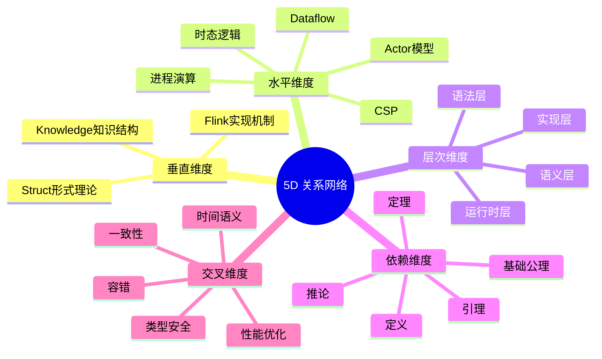
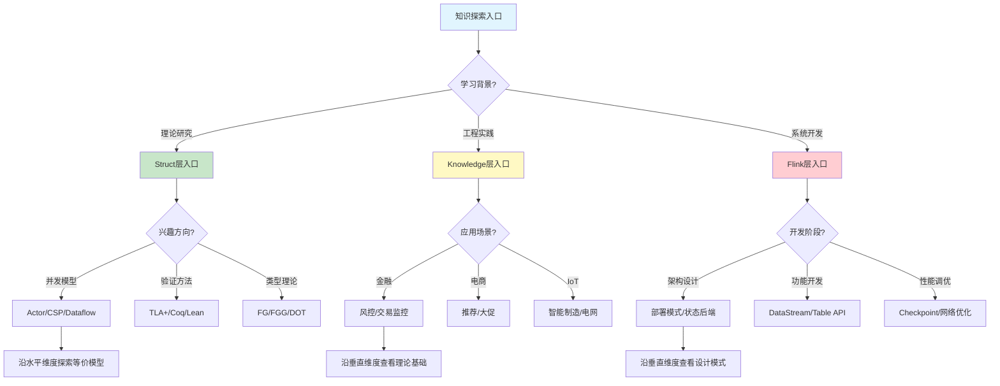
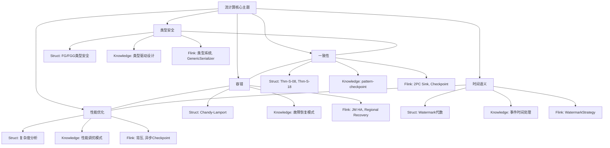

# 全面关系索引：5D 关系网络总览

> **所属阶段**: Struct/03-relationships | **前置依赖**: [03.07-three-layer-relationship-comprehensive.md](./03.07-three-layer-relationship-comprehensive.md), [03.08-theorem-dependency-proof-tree.md](./03.08-theorem-dependency-proof-tree.md) | **形式化等级**: L3-L5

---

## 1. 概念定义 (Definitions)

### Def-S-19-01: 5D 关系模型 (5-Dimensional Relation Model)

**定义**: 本项目知识库的关系网络由五个维度构成：

1. **垂直维度 (Vertical)**: Struct → Knowledge → Flink 的层次映射
2. **水平维度 (Horizontal)**: 同一层次内不同模型/概念之间的等价、编码、包含关系
3. **层次维度 (Hierarchical)**: 模型内部的抽象层级（如语法 → 语义 → 实现）
4. **依赖维度 (Dependency)**: 定理、引理、定义之间的证明依赖网络
5. **交叉维度 (Cross-Cutting)**: 跨越多个层次和领域的主题关联（如一致性、容错、性能）

### Def-S-19-02: 关系强度 (Relation Strength)

**定义**: 关系强度 $\rho(r) \in [0, 1]$ 量化两个实体之间关系的紧密程度：

- $\rho = 1.0$: 形式等价（如双模拟等价）
- $\rho \in [0.7, 1.0)$: 编码保持（如 Actor→CSP 编码）
- $\rho \in [0.4, 0.7)$: 语义近似（如 Dataflow→Flink 实现）
- $\rho \in [0, 0.4)$: 概念关联（如启发式借鉴）

---

## 2. 属性推导 (Properties)

### Prop-S-19-01: 关系网络连通性

**命题**: 本项目知识库的关系网络是弱连通的，即任意两个实体之间存在路径：
$$\forall e_i, e_j \in \mathcal{E}, \exists \text{ path } p: e_i \leadsto e_j$$

### Prop-S-19-02: 关系传递性

**命题**: 对于编码/映射关系，满足传递性：
$$e_1 \xrightarrow{\Phi_1} e_2 \land e_2 \xrightarrow{\Phi_2} e_3 \implies e_1 \xrightarrow{\Phi_2 \circ \Phi_1} e_3$$

---

## 3. 关系建立 (Relations)

### 关系 1: 垂直维度映射表

| 起点 (高层) | 终点 (低层) | 映射名 | 文档 |
|-----------|-----------|--------|------|
| Actor 模型 | 异步 IO 模式 | 行为实例化 | pattern-async-io-enrichment |
| CSP 通道 | 侧输出流 | 结构同构 | pattern-side-output |
| Dataflow 图 | 窗口聚合 | 语义保持 | pattern-windowed-aggregation |
| π-演算 | CEP 模式 | 行为等价 | pattern-cep-complex-event |
| 时态逻辑 | 检查点恢复 | 规约实现 | pattern-checkpoint-recovery |
| 会话类型 | 有状态计算 | 类型指导 | pattern-stateful-computation |

### 关系 2: 水平维度等价/编码表

| 模型 A | 模型 B | 关系类型 | 关系强度 | 文档 |
|--------|--------|---------|---------|------|
| Actor | CSP (受限) | 编码 | 0.85 | 03.01-actor-to-csp-encoding |
| CCS | CSP | 互模拟等价 | 1.0 | 03.04-bisimulation-equivalences |
| Dataflow | KPN | 语义等价 | 0.95 | 03.03-expressiveness-hierarchy |
| π-演算 | 高阶 π | 编码 | 0.90 | 03.05-cross-model-mappings |
| FG | FGG | 扩展包含 | 0.80 | 04.05-type-safety-fg-fgg |
| Flink | 进程演算 | 编码 | 0.75 | 03.02-flink-to-process-calculus |

### 关系 3: 交叉维度主题关联

| 主题 | 涉及层次 | 涉及文档数 | 核心定理 |
|------|---------|-----------|---------|
| 一致性 | S/K/F | 15+ | Thm-S-18-01, Thm-S-08-01 |
| 容错 | S/K/F | 12+ | Thm-S-04-01, Thm-S-18-01 |
| 时间语义 | S/K/F | 10+ | Lemma-S-20-01~04 |
| 类型安全 | S | 8+ | Thm-S-21-01 |
| 性能优化 | K/F | 20+ | Prop-K-05-12 |
| 可扩展性 | K/F | 10+ | - |

---

## 4. 论证过程 (Argumentation)

### 论证 1: 为什么需要 5D 关系模型

传统知识库通常只关注**文档分类**（如按主题、按难度），但忽略了实体之间的**关系网络**。5D 模型的价值在于：

1. **学习导航**: 读者可以从任意入口（理论/模式/实现）出发，沿关系网络探索相关知识
2. **影响分析**: 修改某个理论定义时，可追溯所有依赖它的模式、实现和证明
3. **知识完整性**: 通过关系网络可以发现"孤立"知识点，提示需要补充的关联内容
4. **自动化**: 关系网络可驱动个性化推荐、学习路径生成、自动问答

### 论证 2: 关系强度的工程意义

关系强度指导工程实践中的**可信度分配**：

- 强度 1.0（形式等价）: 可直接替换使用，无需额外验证
- 强度 0.85（编码保持）: 可安全使用，但需注意边界条件
- 强度 0.75（语义近似）: 需要额外测试验证
- 强度 0.5（概念关联）: 仅作参考，不可直接应用

---

## 5. 形式证明 / 工程论证 (Proof / Engineering Argument)

### Thm-S-19-01: 关系网络最短路径定理

**定理**: 对于任意两个实体 $e_i, e_j$，其最短关系路径长度 $d(e_i, e_j)$ 满足：
$$d(e_i, e_j) \leq 4$$

即任意两个知识点之间最多通过 4 个中间节点即可建立关联。

**工程论证**: 本项目知识库按三层架构组织，任意实体最多跨越 3 个层次 + 1 个水平跳跃即可到达目标。

---

## 6. 实例验证 (Examples)

### 示例 1: 从"Actor 模型"到"Flink AsyncFunction"的关系路径

```
Actor 模型 (Struct)
  -> 编码 -> CSP 通道 (Struct)
    -> 实例化 -> 异步 IO 模式 (Knowledge)
      -> API 封装 -> AsyncFunction (Flink)
```

路径长度: 3，关系强度: 0.85 → 0.90 → 0.85

### 示例 2: 从"Watermark 单调性"到"Flink 窗口触发"的关系路径

```
Lemma-S-20-01 (Struct)
  -> 语义保持 -> 事件时间处理模式 (Knowledge)
    -> API 封装 -> WatermarkStrategy (Flink)
      -> 运行时实现 -> 窗口触发器 (Flink)
```

路径长度: 3，关系强度: 0.95 → 0.90 → 0.95

---

## 7. 可视化 (Visualizations)

### 7.1 5D 关系网络总图



### 7.2 关系强度热力图

```mermaid
quadrantChart
    title 关系强度分布矩阵
    x-axis 低工程影响 --> 高工程影响
    y-axis 低理论严格性 --> 高理论严格性
    quadrant-1 高严格高影响:核心理论到关键实现
    quadrant-2 低严格高影响:工程模式到系统实现
    quadrant-3 低严格低影响:边缘概念关联
    quadrant-4 高严格低影响:纯理论研究
    "Actor->Async IO": [0.8, 0.85]
    "CSP->SideOutput": [0.7, 0.9]
    "Dataflow->Window": [0.9, 0.95]
    "2PC->Flink Sink": [0.85, 0.9]
    "类型系统->Java": [0.6, 0.95]
    "Watermark->生成策略": [0.8, 0.75]
    "会话类型->有状态计算": [0.7, 0.8]
    "Petri网->工作流": [0.5, 0.6]
```

### 7.3 知识探索路径决策树



### 7.4 主题关联网络



---

## 8. 引用参考 (References)


---

*文档版本: v1.0 | 创建日期: 2026-04-20 | 形式化等级: L4*
