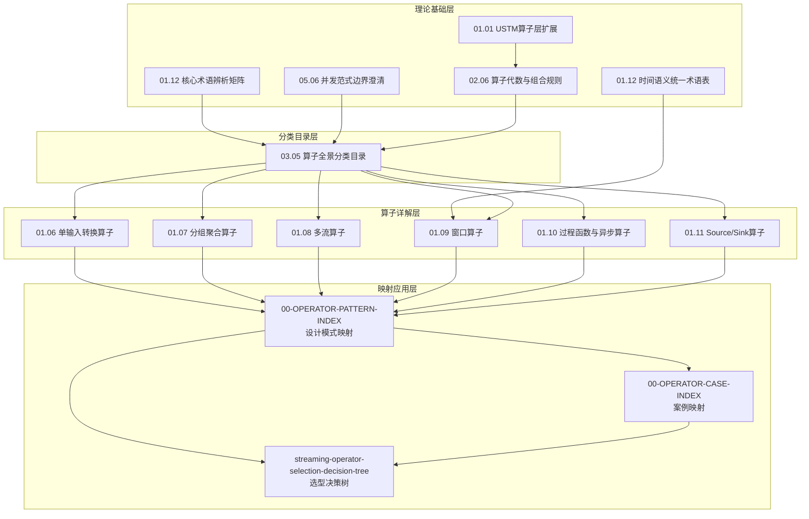

# 流处理算子体系总索引

> **所属阶段**: Struct/03-relationships/operator-mappings | **前置依赖**: 全部算子体系文档 | **形式化等级**: L3
> **文档定位**: 算子体系重构计划的中央索引，提供从任意入口点到任意算子文档的导航
> **版本**: v7.1 | **创建日期**: 2026-04-30

---

## 1. 算子体系全景图

本索引覆盖 **v7.1 算子体系重构计划** 的全部产出，建立流处理领域最完整的算子分类、代数、映射与决策体系。

### 1.1 文档架构总览

### 1.2 文档统计

| 路线 | 文档数 | 总大小 | 形式化元素 | Mermaid图 |
|------|--------|--------|-----------|----------|
| O路线 (算子体系) | 8篇 | ~180 KB | Def: 40+, Lemma: 15+, Prop: 10+, Thm: 8+ | 20+ |
| T路线 (理论澄清) | 4篇 | ~120 KB | Def: 40+, Lemma: 15+, Prop: 8+, Thm: 8+ | 15+ |
| M路线 (映射应用) | 3篇 | ~80 KB | Def: 10+, Lemma: 5+, Prop: 3+, Thm: 2+ | 10+ |
| **总计** | **15篇** | **~380 KB** | **Def: 90+, Lemma: 35+, Prop: 21+, Thm: 18+** | **45+** |

---

## 2. 快速导航

### 2.1 按角色导航

**我是架构师，需要理解理论边界**:
→ [T1: 核心术语辨析矩阵](../../01-foundation/01.12-core-terminology-disambiguation.md) → [T2: 并发范式边界澄清](../../05-comparative-analysis/05.06-concurrency-paradigm-boundaries.md) → [T4: USTM算子层扩展](../../01-foundation/01.01-unified-streaming-theory.md)

**我是算法工程师，需要形式化算子语义**:
→ [O2: 算子代数与组合规则](../../02-properties/02.06-stream-operator-algebra.md) → [O1: 算子全景分类目录](../03.05-stream-operator-taxonomy.md)

**我是开发工程师，需要查具体算子用法**:
→ [O1: 算子分类目录](../03.05-stream-operator-taxonomy.md) → [O3-O8: 算子详解层](../../../Knowledge/01-concept-atlas/operator-deep-dive/)

**我是数据工程师，需要设计流处理作业**:
→ [M3: 算子选型决策树](../../../Knowledge/04-technology-selection/operator-decision-tools/streaming-operator-selection-decision-tree.md)

**我是运维工程师，需要诊断问题**:
→ [O8: Source/Sink算子](../../../Knowledge/01-concept-atlas/operator-deep-dive/01.11-io-operators.md) → [T3: 时间语义术语表](../../../Knowledge/01-concept-atlas/operator-deep-dive/01.12-time-semantics-glossary.md)

### 2.2 按算子导航

| 算子类别 | 入口文档 |
|---------|---------|
| Source (Kafka/文件/数据库) | [O8: Source/Sink](../../../Knowledge/01-concept-atlas/operator-deep-dive/01.11-io-operators.md) |
| map / filter / flatMap | [O3: 单输入转换](../../../Knowledge/01-concept-atlas/operator-deep-dive/01.06-single-input-operators.md) |
| keyBy / reduce / aggregate | [O4: 分组聚合](../../../Knowledge/01-concept-atlas/operator-deep-dive/01.07-grouped-aggregation-operators.md) |
| union / connect / join | [O5: 多流算子](../../../Knowledge/01-concept-atlas/operator-deep-dive/01.08-multi-stream-operators.md) |
| window (tumbling/sliding/session) | [O6: 窗口算子](../../../Knowledge/01-concept-atlas/operator-deep-dive/01.09-window-operators.md) |
| ProcessFunction / asyncWait / CEP | [O7: 过程函数与异步](../../../Knowledge/01-concept-atlas/operator-deep-dive/01.10-process-and-async-operators.md) |
| Sink (Kafka/ES/JDBC/Redis) | [O8: Source/Sink](../../../Knowledge/01-concept-atlas/operator-deep-dive/01.11-io-operators.md) |

### 2.3 按问题导航

| 问题 | 推荐路径 |
|------|---------|
| "流计算和流处理有什么区别？" | [T1: 术语辨析](../../01-foundation/01.12-core-terminology-disambiguation.md) §1.1 |
| "Actor和Dataflow该选哪个？" | [T2: 范式边界](../../05-comparative-analysis/05.06-concurrency-paradigm-boundaries.md) §7 决策树 |
| "map和filter能交换顺序吗？" | [O2: 算子代数](../../02-properties/02.06-stream-operator-algebra.md) §2.1 交换律 |
| "我有两个流要关联，选什么算子？" | [M3: 决策树](../../../Knowledge/04-technology-selection/operator-decision-tools/streaming-operator-selection-decision-tree.md) §7.2 |
| "Window Join和Interval Join有什么不同？" | [O5: 多流算子](../../../Knowledge/01-concept-atlas/operator-deep-dive/01.08-multi-stream-operators.md) §1.1 |
| "Event Time和Processing Time怎么选？" | [T3: 时间语义](../../../Knowledge/01-concept-atlas/operator-deep-dive/01.12-time-semantics-glossary.md) §7.2 决策树 |
| "Exactly-Once端到端怎么保证？" | [O8: Source/Sink](../../../Knowledge/01-concept-atlas/operator-deep-dive/01.11-io-operators.md) §5.1 |
| "这个设计模式用了哪些算子？" | [M1: 设计模式映射](../../../Knowledge/02-design-patterns/operator-pattern-mappings/00-OPERATOR-PATTERN-INDEX.md) |

---

## 3. 关键定理速查

| 定理编号 | 内容 | 位置 |
|---------|------|------|
| Thm-O-01-01 | 算子分类完备性 | [O1](../03.05-stream-operator-taxonomy.md) |
| Thm-O-02-01 | 算子代数的幺半范畴结构 | [O2](../../02-properties/02.06-stream-operator-algebra.md) |
| Thm-O-02-02 | Filter-Pushdown优化正确性 | [O2](../../02-properties/02.06-stream-operator-algebra.md) |
| Thm-O-04-01 | 分布式归约正确性（Monoid结合律） | [O4](../../../Knowledge/01-concept-atlas/operator-deep-dive/01.07-grouped-aggregation-operators.md) |
| Thm-O-08-01 | 端到端Exactly-Once条件 | [O8](../../../Knowledge/01-concept-atlas/operator-deep-dive/01.11-io-operators.md) |
| Thm-T-01-01 | 术语一致性层次 | [T1](../../01-foundation/01.12-core-terminology-disambiguation.md) |
| Thm-T-01-02 | 四大范式表达能力分层 | [T2](../../05-comparative-analysis/05.06-concurrency-paradigm-boundaries.md) |

---

## 4. 思维表征工具箱

本算子体系包含以下多种思维表征：

| 表征类型 | 用途 | 出现文档 |
|---------|------|---------|
| **思维导图** (graph TB) | 算子全景分类、概念依赖 | O1, T1, T2 |
| **层次图** (graph TD) | 系统架构、算子层级 | O1, O8, T4 |
| **流程图** (flowchart) | 决策树、执行流程 | M3, T1, T3 |
| **时序图** (sequenceDiagram) | 事件时间线、事务流程 | O8, O7 |
| **对比矩阵** (quadrantChart) | 多维度选型对比 | T1, T2, T3, M3 |
| **概念矩阵** (graph LR) | 术语×维度映射 | T1, T2, M1 |
| **推理树** (flowchart TD) | 定理证明路径、边界判定 | O2, T2 |
| **状态图** (stateDiagram-v2) | 状态机、生命周期 | O7 |
| **雷达图** (radarChart) | 多属性综合评估 | T1 |
| **DAG执行图** (graph LR/TB) | 算子数据流拓扑 | O3-O8, M1, M2 |

---

## 5. 与现有文档的整合

### 5.1 新增文档清单

| 路径 | 大小 | 状态 |
|------|------|------|
| `Struct/01-foundation/01.12-core-terminology-disambiguation.md` | ~38 KB | ✅ 已交付 |
| `Struct/01-foundation/01.01-unified-streaming-theory.md` (更新) | ~+15 KB | ⏳ 更新中 |
| `Struct/02-properties/02.06-stream-operator-algebra.md` | ~35 KB | ✅ 已交付 |
| `Struct/03-relationships/03.05-stream-operator-taxonomy.md` | ~49 KB | ✅ 已交付 |
| `Struct/05-comparative-analysis/05.06-concurrency-paradigm-boundaries.md` | ~30 KB | ⏳ 撰写中 |
| `Knowledge/01-concept-atlas/operator-deep-dive/01.06-single-input-operators.md` | ~25 KB | ✅ 已交付 |
| `Knowledge/01-concept-atlas/operator-deep-dive/01.07-grouped-aggregation-operators.md` | ~24 KB | ✅ 已交付 |
| `Knowledge/01-concept-atlas/operator-deep-dive/01.08-multi-stream-operators.md` | ~28 KB | ⏳ 撰写中 |
| `Knowledge/01-concept-atlas/operator-deep-dive/01.09-window-operators.md` | ~28 KB | ⏳ 撰写中 |
| `Knowledge/01-concept-atlas/operator-deep-dive/01.10-process-and-async-operators.md` | ~30 KB | ⏳ 撰写中 |
| `Knowledge/01-concept-atlas/operator-deep-dive/01.11-io-operators.md` | ~17 KB | ✅ 已交付 |
| `Knowledge/01-concept-atlas/operator-deep-dive/01.12-time-semantics-glossary.md` | ~19 KB | ✅ 已交付 |
| `Knowledge/02-design-patterns/operator-pattern-mappings/00-OPERATOR-PATTERN-INDEX.md` | ~25 KB | ⏳ 撰写中 |
| `Knowledge/04-technology-selection/operator-decision-tools/streaming-operator-selection-decision-tree.md` | ~16 KB | ✅ 已交付 |

### 5.2 交叉引用网络

所有新文档之间建立密集交叉引用：

- 算子分类目录 (O1) → 每个算子条目链接到O3-O8的详解
- 算子详解 (O3-O8) → 每个算子链接到M1中的设计模式、M2中的案例
- 术语辨析 (T1) → 每个术语链接到现有文档中的使用位置
- 决策树 (M3) → 每个叶节点链接到对应的设计模式文档和案例
- USTM扩展 (T4) → 算子层定义链接到O2的代数体系

---

## 6. 后续扩展计划

| 扩展方向 | 说明 | 优先级 |
|---------|------|--------|
| SQL算子层 | Table API / SQL 算子与 DataStream 算子的对应 | P1 |
| Beam PTransform层 | Apache Beam PTransform 与 Flink 算子的跨引擎映射 | P1 |
| 自定义算子开发指南 | 如何实现自定义 ProcessFunction / Source / Sink | P2 |
| 算子性能基准 | 各算子的延迟/吞吐/状态大小基准数据 | P2 |
| 案例指纹库扩展 | 更多行业案例的算子使用模式 | P2 |

---

*本索引最后更新: 2026-04-30 | 算子体系重构 v7.1 进行中*
