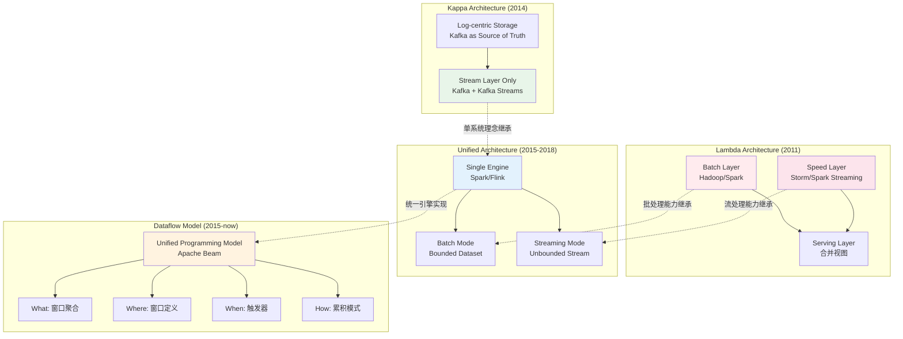
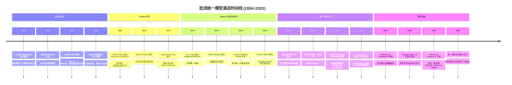

# 流计算 vs 批处理统一模型演进

> **所属阶段**: Struct/03-relationships | **前置依赖**: [Struct/03-relationships/03.03-expressiveness-hierarchy.md](./03.03-expressiveness-hierarchy.md), [Flink/01-concepts/flink-streaming-fundamentals.md](../../Flink/01-concepts/datastream-v2-semantics.md) | **形式化等级**: L4-L5

---

## 1. 概念定义 (Definitions)

### Def-S-22-01: 批流统一计算模型 (Batch-Stream Unified Model)

**定义**: 一个批流统一计算模型 $\mathcal{U}$ 是一个四元组：

$$\mathcal{U} = \langle \mathcal{D}, \mathcal{O}, \mathcal{T}, \mathcal{G} \rangle$$

其中：

- $\mathcal{D}$: 数据抽象，统一表示有界数据集（Bounded Dataset）和无界事件流（Unbounded Stream）
- $\mathcal{O}$: 算子集合，同一套算子语义同时适用于批处理和流处理
- $\mathcal{T}$: 触发模型（Triggering Model），决定何时输出计算结果
- $\mathcal{G}$: 全局语义保证（如一致性级别、时间语义、容错语义）

**核心特征**: $\forall op \in \mathcal{O}, op(D_{\text{bounded}}) \cong op(D_{\text{unbounded}}|_{\text{window}})$，即批处理是有界窗口上流处理的特例。

### Def-S-22-02: 架构范式演进谱系 (Architecture Paradigm Evolution)

**定义**: 架构范式演进谱系 $\mathcal{E}_{paradigm}$ 是一个偏序集：

$$\mathcal{E}_{paradigm} = \langle \{\text{Lambda}, \text{Kappa}, \text{Unified}, \text{Dataflow}\}, \preceq \rangle$$

其中偏序关系 $\preceq$ 表示"技术包容"（$A \preceq B$ 当且仅当 $B$ 的技术方案可以模拟 $A$）：

$$\text{Lambda} \preceq \text{Kappa} \preceq \text{Unified} \preceq \text{Dataflow}$$

**各范式核心抽象**:

| 范式 | 核心抽象 | 批流关系 | 时间语义 |
|------|---------|---------|---------|
| Lambda | 双系统并行 | 批处理层 + 速度层分离 | 批: 处理时间; 流: 近似实时 |
| Kappa | 单流系统 | 流即唯一真相，批是流的特例 | 统一为事件时间 |
| Unified | 单引擎双模式 | 同一引擎，批/流不同执行模式 | 事件时间 + 处理时间双支持 |
| Dataflow | 统一模型 | 数据即流，窗口即边界 | 事件时间 + 水印驱动 |

---

## 2. 属性推导 (Properties)

### Lemma-S-22-01: Lambda 到 Kappa 的表达能力包含关系

**引理**: Kappa 架构的表达能力严格大于 Lambda 架构：

$$\mathcal{E}_{\text{Kappa}} \supsetneq \mathcal{E}_{\text{Lambda}}$$

**证明概要**:

1. **包含关系** ($\mathcal{E}_{\text{Lambda}} \subseteq \mathcal{E}_{\text{Kappa}}$): Kappa 架构使用单一流处理引擎（如 Kafka + Kafka Streams）。对于 Lambda 的批处理层，Kappa 可以通过**重放历史数据**（Replay）到流引擎中模拟批处理结果。即批处理层的功能 $\mathcal{B}$ 可以编码为 $\mathcal{S}(D_{\text{historical}})$。

2. **真包含** ($\mathcal{E}_{\text{Lambda}} \neq \mathcal{E}_{\text{Kappa}}$): Lambda 的双层架构在理论上无法保证批处理层和速度层的结果完全一致（除非引入全局协调，但这违背 Lambda 的设计初衷）。而 Kappa 的单系统天然保证结果一致性。

---

## 3. 关系建立 (Relations)

### 关系 1: 各范式之间的技术与语义映射

```
Lambda Architecture
  ├── Batch Layer (Hadoop MapReduce / Spark)
  │     └── 输出: Batch View (完整、精确、高延迟)
  └── Speed Layer (Storm / Spark Streaming)
        └── 输出: Real-Time View (近似、低延迟)
              └── 合并: Serving Layer (合并视图，存在不一致窗口)

Kappa Architecture
  └── Stream Processing Engine (Kafka Streams / Flink)
        └── 批处理通过重放模拟
        └── 单一视图，天然一致

Unified Architecture (Spark / Flink)
  └── Single Engine
        ├── Batch Mode (有界数据集，优化执行计划)
        └── Streaming Mode (无界流，增量处理)
        └── 统一 API，底层自动选择执行策略

Dataflow Model (Google Cloud Dataflow / Apache Beam)
  └── Unified Programming Model
        ├── 什么 (What): 窗口聚合逻辑
        ├── 哪里 (Where): 窗口定义 (Fixed / Sliding / Session)
        ├── 何时 (When): 触发器 (Trigger) 控制输出时机
        └── 如何 (How): 累积模式 (Discarding / Accumulating)
```

### 关系 2: 时间语义演进映射

| 范式 | 输入时间模型 | 窗口时间模型 | 迟到数据策略 |
|------|-----------|-----------|-----------|
| Lambda | 处理时间 | 批: 无窗口; 流: 处理时间窗口 | 不支持 |
| Kappa | 事件时间 | 事件时间窗口 | 简单缓冲 |
| Unified | 事件时间 + 处理时间 | 双时间窗口 | 侧输出 (Side Output) |
| Dataflow | 事件时间 (首选) | 灵活窗口 + 自定义触发器 | Watermark + 迟到触发器 |

---

## 4. 论证过程 (Argumentation)

### 论证 1: Lambda 架构的固有缺陷

Lambda 架构由 Nathan Marz 于 2011 年提出，核心思想是用两套系统分别处理批量和实时数据[^1]。其固有缺陷包括：

1. **双重代码路径**: 同一业务逻辑需要在批处理层（如 Spark SQL）和速度层（如 Storm Bolt）中分别实现，维护成本高且容易不一致。
2. **合并复杂性**: Serving Layer 需要合并 Batch View 和 Real-Time View，合并逻辑本身引入额外延迟和错误。
3. **资源浪费**: 两套系统分别维护计算资源，批处理层的集群在实时阶段空闲。

**数学刻画**: 设业务逻辑为 $f$，Lambda 的总实现成本为：

$$C_{\text{Lambda}} = C_{\text{impl}}(f_{\text{batch}}) + C_{\text{impl}}(f_{\text{stream}}) + C_{\text{merge}} + C_{\text{ops}}$$

而 Kappa 的成本为：

$$C_{\text{Kappa}} = C_{\text{impl}}(f_{\text{stream}}) + C_{\text{replay}}$$

在大多数场景下，$C_{\text{Kappa}} < C_{\text{Lambda}}$。

### 论证 2: Dataflow Model 为什么是"终极统一"

Dataflow Model 由 Google 于 2015 年提出，并被 Apache Beam 实现[^2]。其统一性体现在：

1. **数据统一**: 所有数据都是流（Stream），有界数据集只是流的特例（到达终点的事件流）。
2. **算子统一**: Map、Filter、GroupByKey、Window 等算子同时适用于批和流。
3. **时间统一**: 引入事件时间和 Watermark，统一处理乱序和延迟数据。
4. **输出统一**: 通过触发器（Trigger）灵活控制结果输出时机，平衡延迟和完整性。

**与关系代数的类比**: Dataflow Model 之于流计算，正如关系代数之于数据库——提供了一套与实现无关的形式化语义框架。

---

## 5. 形式证明 / 工程论证 (Proof / Engineering Argument)

### Thm-S-22-01: Dataflow 模型的语义完备性定理

**定理**: Dataflow 模型可以表达所有 Lambda、Kappa 和 Unified 架构下的可计算查询：

$$\forall Q, Q \in \mathcal{E}_{\text{Lambda}} \cup \mathcal{E}_{\text{Kappa}} \cup \mathcal{E}_{\text{Unified}} \implies Q \in \mathcal{E}_{\text{Dataflow}}$$

**工程论证**:

**步骤 1: Lambda 查询的 Dataflow 编码**

Lambda 的批处理层查询 $Q_B$ 等价于 Dataflow 中对有界输入应用窗口聚合：

$$Q_B(D) \equiv \text{Dataflow}\left(D_{\text{bounded}}, \text{GlobalWindow}, \text{Watermark}=+\infty\right)$$

Lambda 的速度层查询 $Q_S$ 等价于 Dataflow 中对无界输入应用处理时间窗口：

$$Q_S(S) \equiv \text{Dataflow}\left(S, \text{FixedWindow}(T), \text{Trigger}=\text{ProcessingTime}\right)$$

**步骤 2: Kappa 查询的 Dataflow 编码**

Kappa 的核心是流重放。在 Dataflow 中，这对应于从持久化日志（如 Kafka）读取数据，并设置 Watermark 策略：

$$Q_{\text{Kappa}}(S) \equiv \text{Dataflow}\left(S, W, \text{Watermark}=\max(t_{\text{event}}) - \delta\right)$$

其中 $W$ 为事件时间窗口。

**步骤 3: Unified 查询的 Dataflow 编码**

Flink 和 Spark 的 Unified API 本质上实现了 Dataflow Model 的子集。Flink 的 DataStream API 和 Table API 均支持：

- 事件时间窗口（TUMBLE、HOP、SESSION）
- Watermark 生成策略
- 触发器和迟到数据处理

因此，$\mathcal{E}_{\text{Unified}} \subseteq \mathcal{E}_{\text{Dataflow}}$。

**边界条件**: Dataflow 模型的完备性依赖于以下假设：

1. 输入数据可持久化并支持重放
2. 算子满足结合律和交换律（用于并行聚合）
3. 状态可外部化（用于容错恢复）

### Thm-S-22-02: 批处理作为流处理特例的等价性定理

**定理**: 对于任意有界数据集 $D_{\text{bounded}}$，批处理结果 $R_{\text{batch}}$ 等于将该数据集视为有限流后的流处理结果 $R_{\text{stream}}$：

$$R_{\text{batch}}(D_{\text{bounded}}) = R_{\text{stream}}(S(D_{\text{bounded}}))$$

其中 $S(D_{\text{bounded}})$ 表示将有界数据集转化为有限事件流。

**工程论证**:

**Flink 实现验证**: Flink 的 DataSet API（批处理）和 DataStream API（流处理）底层共享同一运行时（TaskManager + Network Stack）。当 DataStream 处理有界输入时，Flink 自动优化执行策略：

1. 禁用 Checkpoint（有界输入无需容错）
2. 启用批处理优化（如排序合并 Join、内存映射）
3. Watermark 自动推进到 $+\infty$（所有数据到达后触发最终计算）

**Spark 实现验证**: Spark Structured Streaming 将批处理查询（Spark SQL）自动增量化为流处理查询。用户可以使用同一套 DataFrame API：

```python
# 批处理
df_static = spark.read.parquet("/path/to/data")
df_static.groupBy("key").count()

# 流处理（同一 API）
df_stream = spark.readStream.parquet("/path/to/stream")
df_stream.groupBy("key").count()
```

底层执行计划不同，但语义一致[^3]。

---

## 6. 实例验证 (Examples)

### 示例 1: 用户行为分析的范式演进

**场景**: 计算电商平台每小时各品类的订单金额总和。

**Lambda 实现**:

```
Batch Layer (每日凌晨执行):
  Input: 前一天完整订单数据 (HDFS)
  Process: Spark SQL GROUP BY category, hour SUM(amount)
  Output: 精确的小时级统计 (延迟: 24h)

Speed Layer (实时执行):
  Input: Kafka 实时订单流
  Process: Storm Bolt 增量聚合
  Output: 近似小时级统计 (延迟: < 1s)

Serving Layer:
  合并 Batch View + Speed Layer 结果
  存在 0-24h 的不一致窗口
```

**Kappa 实现**:

```
Stream Layer (Kafka Streams):
  Input: Kafka 订单流 (实时 + 历史重放)
  Process: 事件时间窗口聚合
  Output: 单一视图，实时和历史结果完全一致
```

**Dataflow / Beam 实现**:

```java
PCollection<Order> orders = pipeline.apply(KafkaIO.read(...));
orders
  .apply(Window.<Order>into(FixedWindows.of(Duration.standardHours(1)))
    .triggering(AfterWatermark.pastEndOfWindow()
      .withLateFirings(AfterProcessingTime.pastFirstElementInPane()
        .plusDelayOf(Duration.standardMinutes(5))))
    .withAllowedLateness(Duration.standardHours(24))
    .discardingFiredPanes())
  .apply(GroupByKey.<String, Order>create())
  .apply(Sum.doublesPerKey());
```

### 示例 2: Flink 的批流一体执行验证

Flink 1.12+ 实现了真正的批流统一：Table API 和 SQL 自动根据输入有界性选择执行模式[^4]。

```sql
-- 同一 SQL，自动选择批或流执行
SELECT
  TUMBLE_START(event_time, INTERVAL '1' HOUR) as window_start,
  category,
  SUM(amount) as total_amount
FROM orders
GROUP BY
  TUMBLE(event_time, INTERVAL '1' HOUR),
  category;
```

- 若 `orders` 是有界表（如 Hive 分区），Flink 选择批处理执行计划
- 若 `orders` 是无界流（如 Kafka），Flink 选择流处理执行计划

### 示例 3: 流批一体存储的 Lakehouse 实践

**场景**: 构建统一的实时离线数仓，避免 Lambda 架构的双系统维护。

**技术栈**: Apache Paimon / Delta Live Tables + Flink

**架构设计**:

```
Kafka 实时流
  └── Flink Streaming Write
        ├── Paimon L0 (内存 + 本地磁盘，秒级延迟)
        ├── Paimon L1 (排序合并，分钟级)
        └── Paimon L2 (Parquet ORC，小时级压缩)
              ├── 实时查询: Flink SQL 读取 L0/L1 (延迟 < 1s)
              └── 离线分析: Spark SQL 读取 L2 (高吞吐)
```

**流批一体优势**:

1. **单一存储**: 实时和离线分析共用同一份数据，消除数据不一致
2. **增量计算**: 离线任务可基于上次 Checkpoint 增量计算，无需全量重跑
3. **Schema 演进**: 统一 Schema Registry 管理，避免批流 Schema 分叉

**量化对比** (相对传统 Lambda 架构):

- 存储成本: -40%（消除双份数据存储）
- 开发效率: +60%（同一套 Flink SQL 同时服务实时和离线）
- 数据一致性: 100%（无 Batch View 和 Speed View 的合并偏差）

---

## 7. 可视化 (Visualizations)

### 7.1 四大架构范式的层次关系与演进

以下层次图展示了从 Lambda 到 Dataflow 的架构演进路线：



### 7.2 各范式在延迟-正确性维度的定位

以下象限图展示了四大范式在延迟和结果正确性维度的分布：

```mermaid
quadrantChart
    title 批流架构范式: 延迟 vs 结果正确性定位
    x-axis 低延迟 (高吞吐) --> 高延迟 (低吞吐)
    y-axis 近似结果 --> 精确结果
    quadrant-1 高延迟高精确: 离线分析 / 财务报表
    quadrant-2 低延迟高精确: 理想目标 (Dataflow)
    quadrant-3 低延迟近似: 实时监控 / 告警
    quadrant-4 高延迟近似: 无实际场景
    "Lambda-Batch": [0.8, 0.9]
    "Lambda-Speed": [0.2, 0.5]
    "Kappa-Replay": [0.5, 0.85]
    "Kappa-Realtime": [0.2, 0.8]
    "Flink-Batch": [0.7, 0.95]
    "Flink-Streaming": [0.15, 0.9]
    "Spark-Batch": [0.75, 0.95]
    "Spark-Streaming": [0.25, 0.75]
    "Dataflow-GlobalWindow": [0.6, 0.95]
    "Dataflow-DefaultTrigger": [0.2, 0.85]
    "Dataflow-WatermarkTrigger": [0.35, 0.92]
```

### 7.3 统一模型演进时间线

以下时间线展示了批流统一模型的关键里程碑：



---

## 8. 引用参考 (References)

[^1]: Nathan Marz, "How to beat the CAP theorem", Blog Post, 2011. <http://nathanmarz.com/blog/how-to-beat-the-cap-theorem.html>

[^2]: Tyler Akidau et al., "The Dataflow Model: A Practical Approach to Balancing Correctness, Latency, and Cost in Massive-Scale, Unbounded, Out-of-Order Data Processing", PVLDB, 8(12), 2015.

[^3]: Matei Zaharia et al., "Apache Spark: A Unified Engine for Big Data Processing", Communications of the ACM, 59(11), 2016.

[^4]: Paris Carbone et al., "Apache Flink: Stream and Batch Processing in a Single Engine", IEEE Data Engineering Bulletin, 38(4), 2015.


---

*文档版本: v1.0 | 创建日期: 2026-04-20 | 形式化等级: L5*
