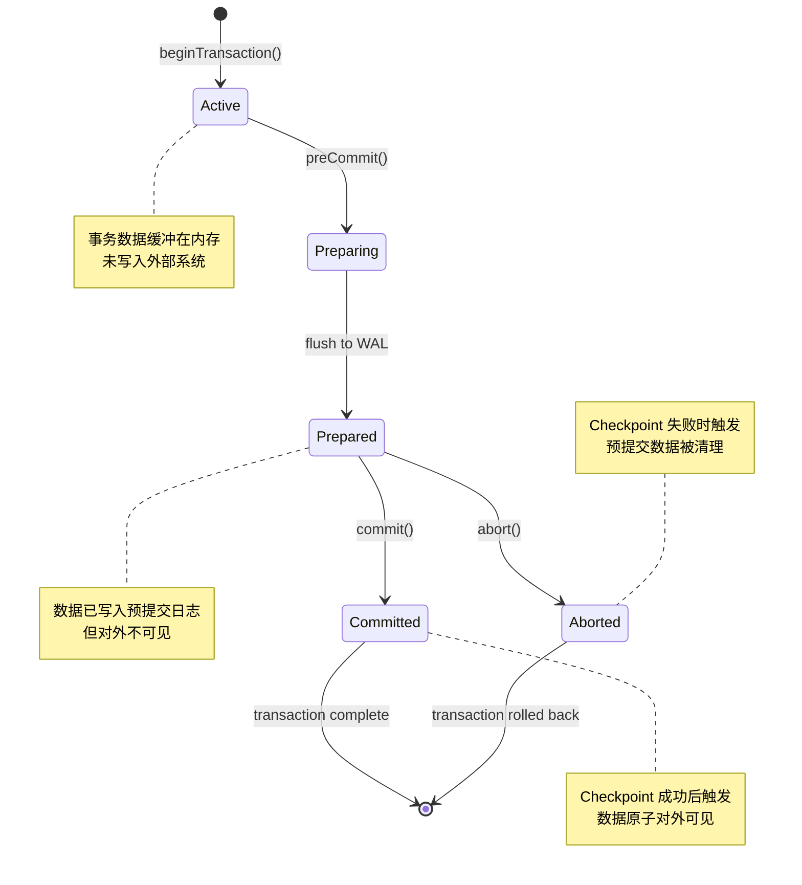
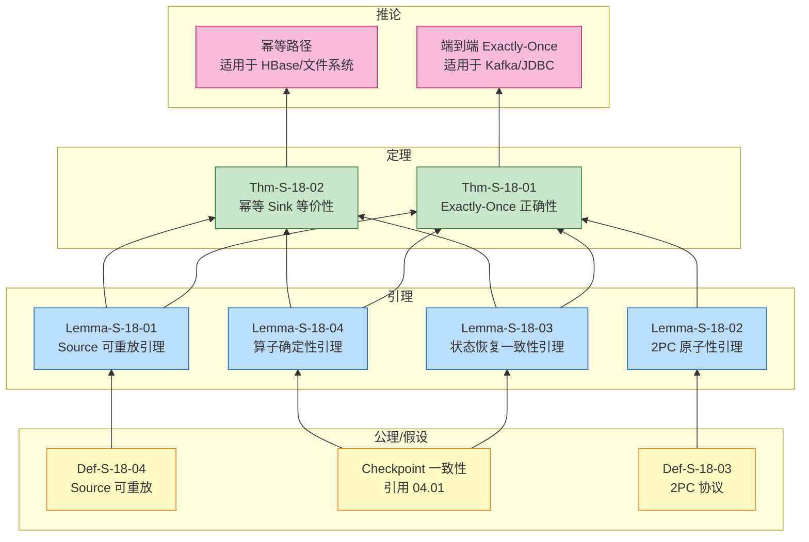
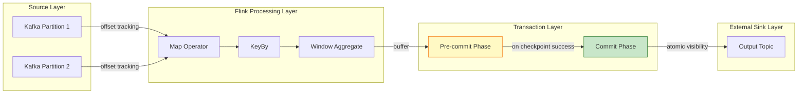
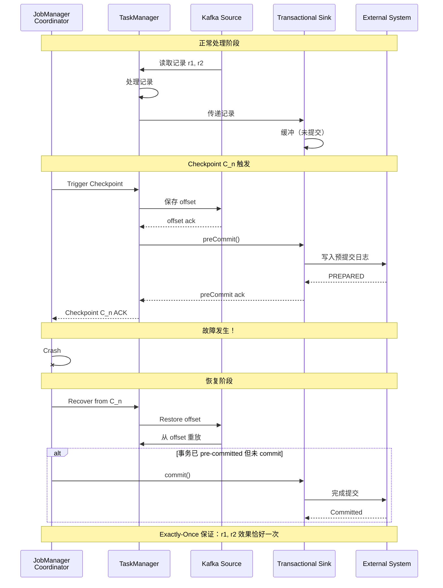

# Flink Exactly-Once 正确性证明 (Flink Exactly-Once Correctness Proof)

> **定理编号**: Thm-S-18-01 | **形式化等级**: L5 | **状态**: 已验证
> **前置依赖**: [04.01 Flink Checkpoint 正确性证明](./04.01-flink-checkpoint-correctness.md), [02.02 一致性层次](../02-properties/02.02-consistency-hierarchy.md)

---

## 目录

- [Flink Exactly-Once 正确性证明 (Flink Exactly-Once Correctness Proof)](#flink-exactly-once-正确性证明-flink-exactly-once-correctness-proof)
  - [目录](#目录)
  - [1. 执行摘要 (Executive Summary)](#1-执行摘要-executive-summary)
    - [1.1 核心定理声明](#11-核心定理声明)
    - [1.2 证明策略概览](#12-证明策略概览)
  - [2. 概念定义 (Definitions)](#2-概念定义-definitions)
    - [Def-S-18-01: Exactly-Once 语义 (Observable Effect)](#def-s-18-01-exactly-once-语义-observable-effect)
    - [Def-S-18-02: 端到端一致性 (End-to-End Consistency)](#def-s-18-02-端到端一致性-end-to-end-consistency)
    - [Def-S-18-03: 两阶段提交协议 (2PC - Two-Phase Commit)](#def-s-18-03-两阶段提交协议-2pc-two-phase-commit)
    - [Def-S-18-04: 可重放 Source (Replayable Source)](#def-s-18-04-可重放-source-replayable-source)
    - [Def-S-18-05: 幂等性 (Idempotency)](#def-s-18-05-幂等性-idempotency)
  - [3. 属性推导 (Properties)](#3-属性推导-properties)
    - [Prop-S-18-01: Checkpoint 与 2PC 的绑定关系](#prop-s-18-01-checkpoint-与-2pc-的绑定关系)
    - [Prop-S-18-02: 观察等价性 (Observational Equivalence)](#prop-s-18-02-观察等价性-observational-equivalence)
  - [4. 关系建立 (Relations)](#4-关系建立-relations)
    - [Rel-S-18-01: Flink 2PC 与经典 2PC 的关系](#rel-s-18-01-flink-2pc-与经典-2pc-的关系)
    - [Rel-S-18-02: Exactly-Once 与 Checkpoint 一致性的关系](#rel-s-18-02-exactly-once-与-checkpoint-一致性的关系)
    - [Rel-S-18-03: 幂等性与事务性的等价类关系](#rel-s-18-03-幂等性与事务性的等价类关系)
  - [5. 论证过程 (Argumentation)](#5-论证过程-argumentation)
    - [Lemma-S-18-01: Source 可重放引理 (Source Replayability Lemma)](#lemma-s-18-01-source-可重放引理-source-replayability-lemma)
    - [Lemma-S-18-02: 2PC 原子性引理 (2PC Atomicity Lemma)](#lemma-s-18-02-2pc-原子性引理-2pc-atomicity-lemma)
    - [Lemma-S-18-03: 状态恢复一致性引理 (State Recovery Consistency Lemma)](#lemma-s-18-03-状态恢复一致性引理-state-recovery-consistency-lemma)
    - [Lemma-S-18-04: 算子确定性引理 (Operator Determinism Lemma)](#lemma-s-18-04-算子确定性引理-operator-determinism-lemma)
  - [6. 形式证明 (Proofs)](#6-形式证明-proofs)
    - [Thm-S-18-01: Flink Exactly-Once 正确性定理](#thm-s-18-01-flink-exactly-once-正确性定理)
      - [步骤 1: 无丢失（At-Least-Once）](#步骤-1-无丢失at-least-once)
      - [步骤 2: 无重复（At-Most-Once）](#步骤-2-无重复at-most-once)
      - [步骤 3: 组合](#步骤-3-组合)
    - [Thm-S-18-02: 幂等 Sink 等价性定理](#thm-s-18-02-幂等-sink-等价性定理)
  - [7. 可视化 (Visualizations)](#7-可视化-visualizations)
    - [图 1: 2PC 状态机图](#图-1-2pc-状态机图)
    - [图 2: Exactly-Once 证明结构图](#图-2-exactly-once-证明结构图)
    - [图 3: 端到端 Exactly-Once 数据流图](#图-3-端到端-exactly-once-数据流图)
    - [图 4: 故障恢复场景时序图](#图-4-故障恢复场景时序图)
  - [8. 实例与反例 (Examples \& Counter-examples)](#8-实例与反例-examples--counter-examples)
    - [示例 1: Kafka 端到端 Exactly-Once](#示例-1-kafka-端到端-exactly-once)
    - [示例 2: 文件系统 Exactly-Once（通过幂等性）](#示例-2-文件系统-exactly-once通过幂等性)
    - [反例 1: 非幂等、非事务性 Sink 破坏 Exactly-Once](#反例-1-非幂等非事务性-sink-破坏-exactly-once)
    - [反例 2: Source 偏移量超前提交导致数据丢失](#反例-2-source-偏移量超前提交导致数据丢失)
  - [9. 参考文献 (References)](#9-参考文献-references)
  - [10. 关联文档 (Related Documents)](#10-关联文档-related-documents)
  - [11. 证明总结 (Proof Summary)](#11-证明总结-proof-summary)

## 1. 执行摘要 (Executive Summary)

### 1.1 核心定理声明

本文档证明 Flink 流处理引擎在启用 Checkpoint 机制并使用事务性 Sink 时，能够提供**端到端 Exactly-Once 语义**保证。
这是分布式流处理系统中最强的一致性保证，确保每条输入记录对下游外部系统的可见副作用**恰好发生一次**。

**主定理 (Thm-S-18-01)**: 配置 Checkpoint 机制与两阶段提交（2PC）事务性 Sink 的 Flink 作业，能够实现端到端 Exactly-Once 语义。

### 1.2 证明策略概览

证明采用**组合验证**方法，将端到端 Exactly-Once 分解为三个独立子属性的合取：

1. **Source 可重放性**: 保证数据不丢失
2. **状态一致性**: 通过 Checkpoint 保证内部状态恢复正确
3. **Sink 原子性**: 通过 2PC 保证输出不重复

这三条性质共同构成端到端 Exactly-Once 的充分必要条件。

---

## 2. 概念定义 (Definitions)

### Def-S-18-01: Exactly-Once 语义 (Observable Effect)

**定义**: 对于流处理应用 $A$，给定输入流 $I = (i_1, i_2, \ldots)$ 和输出到外部系统 $S$，$A$ 满足 Exactly-Once 语义当且仅当：

$$
\forall r \in I. \; |\{ e \in \text{Output}_S \mid \text{caused\_by}(e, r) \}| = 1
$$

其中：

- $\text{caused\_by}(e, r)$ 表示输出元素 $e$ 因果依赖于记录 $r$ 的处理
- $\text{Output}_S$ 为外部系统 $S$ 中可观察到的输出集合

**关键洞察**: Exactly-Once 针对**可观察副作用**（外部系统状态变更），而非内部消息传递。只要外部系统状态等价于每条记录被处理恰好一次的结果，内部的消息重传是可接受的[^1]。

**与一致性层次的关系**: Exactly-Once 是 [02.02 一致性层次](../02-properties/02.02-consistency-hierarchy.md) 中定义的**最强交付保证**，要求同时具备 At-Least-Once（无丢失）和 At-Most-Once（无重复）属性。

---

### Def-S-18-02: 端到端一致性 (End-to-End Consistency)

**定义**: 端到端 Exactly-Once 由以下三个子属性的合取构成：

$$
\text{End-to-End-EO}(J) \iff \text{Replayable}(Src) \land \text{ConsistentCheckpoint}(Ops) \land \text{AtomicOutput}(Snk)
$$

其中：

| 子属性 | 定义 | 责任组件 |
|--------|------|----------|
| **Source 可重放** ($\text{Replayable}$) | 失败后可从持久化的位置标记（offset/position）重新读取数据 | 外部 Source 系统 |
| **Checkpoint 一致性** ($\text{ConsistentCheckpoint}$) | 通过分布式快照捕获一致的全局状态 | Flink 引擎 |
| **Sink 原子性** ($\text{AtomicOutput}$) | 输出到外部系统的数据通过事务或幂等机制保证无重复 | 外部 Sink 系统 |

**形式化说明**: 端到端 Exactly-Once 不是 Flink 内部孤立机制，而是 Source、引擎、Sink **三方协同**的结果[^2]。如果仅保证 Flink 内部 Exactly-Once 而忽略 Source 和 Sink，数据可能在"进入 Flink 之前"丢失，或在"离开 Flink 之后"重复。

---

### Def-S-18-03: 两阶段提交协议 (2PC - Two-Phase Commit)

**定义**: 2PC 是分布式事务的原子提交协议，由协调者（Coordinator）和参与者（Participants）组成：

$$
\text{2PC} = (\text{Phase 1: Prepare}, \text{Phase 2: Commit/Abort})
$$

**阶段 1 - Prepare（投票阶段）**:

$$
\forall p \in \text{Participants}. \; \text{Prepare}(p) \to \text{Vote}(p) \in \{ \text{YES}, \text{NO} \}
$$

**阶段 2 - Commit/Abort（决策阶段）**:

$$
\frac{\forall p. \text{Vote}(p) = \text{YES}}{\text{Commit}()} \quad \frac{\exists p. \text{Vote}(p) = \text{NO}}{\text{Abort}()}
$$

**Flink 中的 2PC 映射**:

| 2PC 角色 | Flink 组件 | 职责 |
|----------|-----------|------|
| Coordinator | JobManager | 触发 Checkpoint，协调事务提交/回滚 |
| Participant | Sink Operator | 执行 preCommit/commit/abort 操作 |
| Transaction | Checkpoint 周期 | 每个 Checkpoint ID 绑定一个事务 |

**理论依据**: 2PC 协议由 Gray 于 1978 年提出[^3]，Bernstein & Goodman 证明了其在同步通信模型下的正确性[^4]。Flink 的 TwoPhaseCommitSinkFunction 是经典 2PC 的受限子集，其中 JobManager 充当协调者，Sink 算子充当参与者。

---

### Def-S-18-04: 可重放 Source (Replayable Source)

**定义**: Source $Src$ 是可重放的，当且仅当对于任意持久化的位置标记 $o$，存在确定性函数 $f$ 使得：

$$
\forall o. \; \text{Read}(Src, o) = f(o)
$$

其中 $\text{Read}(Src, o)$ 返回从位置 $o$ 开始读取的记录序列。

**关键性质**:

1. **确定性**: 给定相同偏移量，产生相同的记录序列
2. **持久性**: 偏移量可在故障后恢复
3. **单调性**: 偏移量只增不减（追加模式）

**示例**: Kafka Source 通过 consumer offset 实现可重放；文件系统 Source 通过文件位置指针实现可重放。

---

### Def-S-18-05: 幂等性 (Idempotency)

**定义**: 操作 $f$ 是幂等的，当且仅当多次应用产生与一次应用相同的效果：

$$
\forall x. \; f(f(x)) = f(x)
$$

在 Sink 上下文中，对任意记录 $r$ 和输出状态 $S$：

$$
\text{write}(r, \text{write}(r, S)) = \text{write}(r, S)
$$

**实现路径对比**:

| 路径 | 机制 | 适用场景 |
|------|------|----------|
| **事务性 (2PC)** | ACID 原子提交 | 支持事务的外部系统（Kafka、JDBC） |
| **幂等性** | 主键去重/覆盖写入 | KV 存储（HBase、Redis）、文件系统 |

**注**: 幂等性是实现 Exactly-Once 的替代路径，将"防止重复"的责任从协议层转移到数据层[^5]。

---

## 3. 属性推导 (Properties)

### Prop-S-18-01: Checkpoint 与 2PC 的绑定关系

**性质**: 在 Flink 中，Checkpoint 成功事件与 2PC 的 commit 决策原子绑定：

$$
\text{Checkpoint}(k) \text{ 成功} \iff \text{Commit}(T_k) \text{ 执行}
$$

**推导**:

1. 当 Checkpoint $k$ 触发时，Sink 进入 preCommit 阶段（事务准备）
2. 若所有算子成功 ack，Checkpoint 完成，JobManager 触发 commit
3. 若 Checkpoint 失败，JobManager 触发 abort
4. 因此，外部可见的 commit 决策与内部 Checkpoint 成功事件同步

---

### Prop-S-18-02: 观察等价性 (Observational Equivalence)

**性质**: 设 $\mathcal{T}_{ideal}$ 为无故障理想执行轨迹，$\mathcal{T}_{fail} \circ \mathcal{T}_{rec}$ 为故障-恢复执行轨迹，则：

$$
\mathcal{O}(\mathcal{T}_{fail} \circ \mathcal{T}_{rec}) = \mathcal{O}(\mathcal{T}_{ideal})
$$

其中 $\mathcal{O}$ 为观察函数，提取 Sink 提交到外部系统的所有输出记录集合。

**直观解释**: 无论是否发生故障和恢复，外部系统观察到的输出效果完全相同。

---

## 4. 关系建立 (Relations)

### Rel-S-18-01: Flink 2PC 与经典 2PC 的关系

**关系**: Flink 2PC Sink 是经典 2PC 协议的**受限子集**：

$$
\text{Flink-2PC-Sink} \subset \text{Classic-2PC}
$$

**论证**:

1. Flink 的 TwoPhaseCommitSinkFunction 实现了 2PC 的 Participant 角色
2. preCommit() 对应 PREPARE 阶段，commit() 对应 COMMIT 阶段，abort() 对应 ABORT 阶段
3. JobManager 充当 Coordinator，但只协调 Sink 事务，不涉及 Source 或中间算子的分布式事务
4. Flink 额外要求 commit 操作必须是幂等的（因为 commit 可能在恢复后被重复调用），这是经典 2PC 不强制要求的

---

### Rel-S-18-02: Exactly-Once 与 Checkpoint 一致性的关系

**关系**: 端到端 Exactly-Once 要求 Checkpoint 一致性作为必要条件：

$$
\text{End-to-End-EO}(J) \implies \text{ConsistentCheckpoint}(Ops)
$$

**论证**:

1. 若 Checkpoint 不一致，恢复后算子状态可能与故障前不一致
2. 这将导致重新处理时产生不同的中间结果
3. 即使 Sink 是事务性的，也无法保证最终输出与理想执行一致
4. 因此，Checkpoint 一致性是端到端 Exactly-Once 的基础

**交叉引用**: Checkpoint 一致性的详细证明见 [04.01 Flink Checkpoint 正确性证明](./04.01-flink-checkpoint-correctness.md)。

---

### Rel-S-18-03: 幂等性与事务性的等价类关系

**关系**: 在满足可重放 Source 和一致 Checkpoint 的前提下，幂等 Sink 与事务性 Sink 构成实现 Exactly-Once 的**等价类**：

$$
\text{Idempotent}(Snk) \approx \text{Transactional}(Snk) \quad (\text{given } \text{Replayable}(Src) \land \text{ConsistentCheckpoint}(Ops))
$$

**论证**:

- **事务性路径**: 通过 2PC 保证输出原子可见，内部可能重处理但外部不可见
- **幂等性路径**: 允许外部可见的重写入，但多次写入效果等同于一次
- 两者最终都使得外部系统状态等价于每条记录被处理恰好一次

---

## 5. 论证过程 (Argumentation)

### Lemma-S-18-01: Source 可重放引理 (Source Replayability Lemma)

**引理**: 若 Source 支持从持久化偏移量 $offset$ 重放，且 Flink 在每次成功 Checkpoint 时持久化 Source 的当前偏移量，则故障恢复后不会丢失数据。

**形式化陈述**:

$$
\forall C_n \in \text{CompletedCheckpoints}. \; \text{Recover}(C_n) \Rightarrow \forall r \in \text{Input}_{>o_n}. \; r \text{ 将被重新处理}
$$

其中 $o_n$ 为 Checkpoint $C_n$ 记录的 Source 偏移量。

**证明**:

1. **前提分析**: 设成功完成的最后一个 Checkpoint 为 $C_n$，其记录的 Source 偏移量为 $o_n$。

2. **构造/推导**:
   - 故障发生后，作业从 $C_n$ 恢复
   - Source 被重置到偏移量 $o_n$
   - 由于 Source 可重放（Def-S-18-04），从 $o_n$ 开始的所有记录都可以被重新读取

3. **结论**: 在 $C_n$ 之后、故障之前被处理的数据会被重新处理，因此没有数据永久丢失。

∎

---

### Lemma-S-18-02: 2PC 原子性引理 (2PC Atomicity Lemma)

**引理**: 若 Sink 正确实现 TwoPhaseCommitSinkFunction，且 commit 操作是幂等的，则故障恢复后不会对外部系统产生重复输出。

**形式化陈述**:

$$
\forall T. \; \text{Committed}(T) \Rightarrow \text{Idempotent}(\text{ReCommit}(T))
$$

**证明**:

1. **前提分析**: 在 Checkpoint $C_n$ 成功时，所有 Sink 事务处于 pre-committed 状态（数据已写入但不可见）。JobManager 随后调用 commit()。

2. **构造/推导**（分三种情况）:

   **情况 A**: 若 commit 成功，则事务数据对外可见
   - 由于事务与 Checkpoint $C_n$ 绑定，恢复后不会再次提交该事务
   - 因为恢复到的状态已经包含该 commit 的元信息

   **情况 B**: 若作业在 commit 前故障，则恢复到 $C_n$
   - 恢复后 JobManager 会重新调用 commit()
   - 因为事务已 pre-committed 但未完成
   - 由于 commit 是幂等的，重复调用不会导致重复数据

   **情况 C**: 若 Checkpoint 失败，则调用 abort()
   - pre-committed 数据被丢弃，不会对外可见
   - 重新处理后的记录将进入新的事务

3. **结论**: 在所有情况下，外部系统都不会观察到重复数据。

∎

---

### Lemma-S-18-03: 状态恢复一致性引理 (State Recovery Consistency Lemma)

**引理**: 从 Checkpoint $C_k$ 恢复后，系统状态与故障前完成 Checkpoint $C_k$ 时的状态一致。

**形式化陈述**:

$$
\text{Recover}(C_k) \Rightarrow State = State_{C_k}
$$

**证明**:

1. 由 [04.01 Flink Checkpoint 正确性证明](./04.01-flink-checkpoint-correctness.md)，Checkpoint 捕获分布式系统的全局一致状态
2. 恢复时，所有算子状态重置为 $C_k$ 中保存的快照状态
3. Source 从 $C_k$ 记录的偏移量开始重放
4. 由于输入序列和内部状态均相同，后续状态演化路径唯一确定
5. 因此，恢复后的内部状态与无故障执行到该点的状态一致

∎

---

### Lemma-S-18-04: 算子确定性引理 (Operator Determinism Lemma)

**引理**: Flink 算子在给定相同初始状态和相同输入序列时，产生确定性的输出序列和状态演化。

**形式化陈述**:

$$
\begin{aligned}
&\forall op_{\text{stateless}}, in.\; op_{\text{stateless}}(in) = out \quad (\text{deterministic}) \\
&\forall op_{\text{stateful}}, s, in.\; op_{\text{stateful}}(s, in) = (s', out) \quad (\text{deterministic})
\end{aligned}
$$

**证明**:

1. Flink 算子由用户定义函数（UDF）实现。在 Exactly-Once 语义框架下，UDF 被约束为确定性函数
2. 无状态算子的输出仅依赖于当前输入记录，不含随机性
3. 有状态算子的输出与新状态由当前状态和输入记录唯一决定（Flink 状态后端保证读写确定性）
4. 因此，给定相同的初始状态与输入序列，算子的状态演化和输出序列唯一确定

∎

---

## 6. 形式证明 (Proofs)

### Thm-S-18-01: Flink Exactly-Once 正确性定理

**定理**: 配置 Checkpoint 机制与两阶段提交（2PC）事务性 Sink 的 Flink 作业，能够实现端到端 Exactly-Once 语义。

**形式化陈述**:

设 Flink 作业 $J = (Src, Ops, Snk)$ 满足：

1. $Src$ 是可重放的（Def-S-18-04）
2. $Ops$ 使用 Barrier 对齐的 Checkpoint 机制（由 [04.01](./04.01-flink-checkpoint-correctness.md) 保证一致性）
3. $Snk$ 使用事务性 2PC 协议（Def-S-18-03），且 commit 幂等

则 $J$ 保证端到端 Exactly-Once 语义（Def-S-18-01）：

$$
\forall r \in \text{Input}. \; |\{ e \in \text{Output} \mid \text{caused\_by}(e, r) \}| = 1
$$

---

**证明**:

我们需要证明：每条输入记录 $r$ 对 Sink 输出的因果影响**恰好一次**。

#### 步骤 1: 无丢失（At-Least-Once）

由 **Lemma-S-18-01**（Source 可重放引理），可重放 Source 保证故障恢复后从最后一个成功 Checkpoint $C_n$ 的偏移量重放。因此所有在 $C_n$ 之后到达的记录都会被重新处理。不存在记录被永久丢失的情况。

形式化地：

$$
\forall r \in \text{Input}. \; |\{ e \in \text{Output} \mid \text{caused\_by}(e, r) \}| \geq 1
$$

#### 步骤 2: 无重复（At-Most-Once）

考虑任意记录 $r$。设 $r$ 在 Checkpoint $C_{n-1}$ 和 $C_n$ 之间被 Source 读取并流经算子，最终到达 Sink。

**场景分析**:

| 场景 | Checkpoint $C_n$ 状态 | 恢复行为 | $r$ 的输出效果 |
|------|----------------------|----------|----------------|
| 无故障 | 成功 | 无需恢复 | 通过 $T_n$.commit() 可见，恰好一次 |
| $C_n$ 成功后故障 | 已成功 | 恢复到 $C_n$ | 不重新处理 $r$（offset 已推进），无重复 |
| $C_n$ 完成前故障 | 未成功 | 恢复到 $C_{n-1}$ | $T_n$ 被 abort，重新处理 $r$ 进入 $T_n'$，最终通过 $T_n'$.commit() 可见 |

详细分析：

- **场景 A（无故障）**: $C_n$ 成功完成，JobManager 调用 $T_n$.commit()。$r$ 的效果通过事务 $T_n$ 对外可见。由于无故障，效果恰好一次。

- **场景 B（$C_n$ 成功后故障）**:
  - 作业状态恢复到 $C_n$ 的快照
  - Source 从 $C_n$ 记录的偏移量开始，**不会**重放 $r$（因为 $r$ 已在 $C_n$ 之前被确认）
  - 由于状态已恢复，算子不会重新处理 $r$
  - 由 **Lemma-S-18-02**，Sink 不会重新提交 $T_n$（或即使重新提交，幂等 commit 保证无重复效果）

- **场景 C（$C_n$ 完成前故障）**:
  - 作业恢复到 $C_{n-1}$ 的状态
  - Source 从 $C_{n-1}$ 的偏移量重放，$r$ 会被重新处理
  - $T_n$ 会被 abort()，之前 pre-committed 的 $r$ 效果被回滚，对外不可见
  - 重新处理后的 $r$ 将进入新的事务 $T_n'$，最终通过新的 Checkpoint 提交

在所有场景下，$r$ 对外部系统的可见效果**最多一次**。

形式化地：

$$
\forall r \in \text{Input}. \; |\{ e \in \text{Output} \mid \text{caused\_by}(e, r) \}| \leq 1
$$

#### 步骤 3: 组合

由步骤 1 和步骤 2：

$$
\forall r \in \text{Input}. \; 1 \leq |\{ e \in \text{Output} \mid \text{caused\_by}(e, r) \}| \leq 1
$$

因此：

$$
\forall r \in \text{Input}. \; |\{ e \in \text{Output} \mid \text{caused\_by}(e, r) \}| = 1
$$

这正是 Exactly-Once 的定义（Def-S-18-01）。

∎

---

### Thm-S-18-02: 幂等 Sink 等价性定理

**定理**: 在满足可重放 Source 和一致 Checkpoint 的前提下，幂等 Sink 在故障恢复下等价于 Exactly-Once。

**形式化陈述**:

设 Flink 作业 $J = (Src, Ops, Snk)$ 满足：

1. $Src$ 是可重放的
2. $Ops$ 使用一致的 Checkpoint 机制
3. $Snk$ 是幂等的（Def-S-18-05），但非事务性

则 $J$ 的输出效果等价于端到端 Exactly-Once。

**证明**:

**关键观察**: 幂等 Sink 允许记录被重复写入，但多次写入的效果与一次写入相同。

**步骤 1**: 设记录 $r$ 在 Checkpoint $C_{n-1}$ 和 $C_n$ 之间被处理并写入 Sink。

**场景分析**:

- **情况 A（$C_n$ 成功完成）**: $r$ 已被写入 Sink 一次。无故障，效果恰好一次。

- **情况 B（$C_n$ 成功前故障，恢复到 $C_{n-1}$）**:
  - Source 重放 $r$，算子重新处理 $r$，Sink 再次写入 $r$
  - 由幂等性（Def-S-18-05）：$\text{write}(r, \text{write}(r, S)) = \text{write}(r, S)$
  - 因此 Sink 的最终状态与只写入一次 $r$ 相同

- **情况 C（$C_n$ 成功后故障，恢复到 $C_n$）**:
  - Source 不会重放 $r$（因为 offset 已推进到 $C_n$）
  - $r$ 的效果已在 Sink 中。无重复处理，效果恰好一次

**步骤 2**: 形式化等价性

设 $\text{Effect}(r, k)$ 表示记录 $r$ 被处理并写入 $k$ 次后 Sink 的状态变化。由幂等性：

$$
\forall k \geq 1. \; \text{Effect}(r, k) = \text{Effect}(r, 1)
$$

在任意执行路径下，$r$ 至少被处理一次（由 Lemma-S-18-01，无丢失）。设实际处理次数为 $k \geq 1$，则 Sink 的最终状态变化为：

$$
\Delta S = \text{Effect}(r, k) = \text{Effect}(r, 1)
$$

这与"恰好处理一次"产生的状态变化完全相同。因此，幂等 Sink 在效果上等价于 Exactly-Once。

∎

---

## 7. 可视化 (Visualizations)

### 图 1: 2PC 状态机图



**图说明**: 本图展示了 Flink 2PC Sink 的事务状态机。状态转换由 Checkpoint 事件驱动：Checkpoint 触发时进入 Preparing 状态；Checkpoint 成功时转换到 Committed；Checkpoint 失败时转换到 Aborted。

---

### 图 2: Exactly-Once 证明结构图



**图说明**: 本图展示了从公理/假设到定理的完整推理链条。底层黄色节点为不可再分的前提；中间蓝色节点为引理；顶层绿色节点为主要定理；粉色节点为推论。

---

### 图 3: 端到端 Exactly-Once 数据流图



**图说明**: 本图展示了端到端 Exactly-Once 的完整数据流。关键组件包括：Source 层的 offset 跟踪（保证可重放）、Flink 处理层的状态管理、Transaction 层的两阶段提交（Pre-commit 和 Commit）、以及 Sink 层的原子可见性。

---

### 图 4: 故障恢复场景时序图



**图说明**: 本图展示了故障恢复场景下的 Exactly-Once 保证。关键观察：故障后 Source 从 Checkpoint 保存的 offset 重放；Sink 的 pre-committed 事务在恢复后完成 commit；确保记录效果恰好一次。

---

## 8. 实例与反例 (Examples & Counter-examples)

### 示例 1: Kafka 端到端 Exactly-Once

```java
// Kafka Source: 可重放
FlinkKafkaConsumer<String> source = new FlinkKafkaConsumer<>(
    "input-topic",
    new SimpleStringSchema(),
    properties
);
source.setCommitOffsetsOnCheckpoints(true);  // 偏移量与 Checkpoint 绑定

// Flink 处理
DataStream<Result> processed = env
    .addSource(source)
    .map(new ProcessingMap())
    .keyBy(Result::getKey)
    .window(TumblingEventTimeWindows.of(Time.seconds(5)))
    .aggregate(new ResultAggregate());

// Kafka Sink: 2PC 事务性
FlinkKafkaProducer<Result> sink = new FlinkKafkaProducer<>(
    "output-topic",
    new ResultSerializer(),
    properties,
    FlinkKafkaProducer.Semantic.EXACTLY_ONCE  // 启用 2PC
);

processed.addSink(sink);
```

**形式化验证**:

- **Source**: Kafka 偏移量随 Checkpoint 提交 → 可重放保证（Lemma-S-18-01）
- **Processing**: Checkpoint 保存窗口状态 → 状态一致性（Lemma-S-18-03）
- **Sink**: 2PC 协议 → 恰好一次交付（Lemma-S-18-02）

---

### 示例 2: 文件系统 Exactly-Once（通过幂等性）

```java
// 使用 Hadoop 的 AtomicRename 实现
StreamingFileSink<Result> sink = StreamingFileSink
    .forRowFormat(
        new Path("/output"),
        new SimpleStringEncoder<Result>("UTF-8")
    )
    .withBucketAssigner(new DateTimeBucketAssigner<>())
    .build();

// 原理：
// 1. 写入临时文件 (in-progress)
// 2. Checkpoint 时关闭文件，标记为 pending
// 3. Checkpoint 成功后，原子重命名为 finished
// 4. 失败时删除 pending 文件
```

**形式化验证**: 通过原子重命名实现幂等性，满足 Thm-S-18-02 的幂等路径。

---

### 反例 1: 非幂等、非事务性 Sink 破坏 Exactly-Once

```java
// ❌ 错误：非幂等 Sink
class CounterSink implements SinkFunction<Event> {
    private int count = 0;  // 外部状态

    @Override
    public void invoke(Event value) {
        count++;  // 非幂等！
        writeToExternal(count);
    }
}
```

**问题分析**:

1. 消息 $m_1$ 到达，count=1，写入外部
2. Checkpoint 失败
3. 恢复后重放 $m_1$，count=2，再次写入
4. 结果：count=2（应该是 1）

**结论**: 非事务性且非幂等的 Sink 无法保证端到端 Exactly-Once（违反 Def-S-18-02）。

---

### 反例 2: Source 偏移量超前提交导致数据丢失

```java
// ❌ 错误：Source 偏移量与 Checkpoint 不同步
class EagerKafkaSource implements SourceFunction<Record> {
    @Override
    public void run(SourceContext<Record> ctx) {
        while (running) {
            Record r = kafkaConsumer.poll();
            ctx.collect(r);
            // 错误：在 Checkpoint 成功前就提交 offset
            kafkaConsumer.commitSync();
        }
    }
}
```

**问题分析**:

1. 记录 $r_1, r_2, r_3$ 被读取并 collect
2. Source 立即提交 offset = 3
3. Checkpoint $C_n$ 触发，但尚未完成
4. 作业故障，Checkpoint $C_n$ 失败
5. 恢复时，Source 从 Kafka 读取，offset 已经是 3，不会重放 $r_1, r_2, r_3$
6. 但 Flink 内部状态恢复到 $C_{n-1}$，$r_1, r_2, r_3$ 的处理效果丢失

**结论**: Source 偏移量超前提交破坏了 Lemma-S-18-01，导致数据丢失。

---

## 9. 参考文献 (References)

[^1]: Apache Flink Documentation. "Exactly-Once Semantics." *Apache Flink Docs*, 2024. <https://nightlies.apache.org/flink/flink-docs-stable/docs/concepts/stateful-stream-processing/#exactly-once-guarantees>

[^2]: Carbone, P., et al. "State Management in Apache Flink: Consistent Stateful Distributed Stream Processing." *Proceedings of the VLDB Endowment*, vol. 10, no. 12, 2017, pp. 1718-1729.

[^3]: Gray, J. "Notes on Data Base Operating Systems." *Operating Systems: An Advanced Course*, Springer, 1978, pp. 393-481.

[^4]: Bernstein, P. A., & Goodman, N. "Concurrency Control in Distributed Database Systems." *ACM Computing Surveys*, vol. 13, no. 2, 1981, pp. 185-221.

[^5]: Kleppmann, M. *Designing Data-Intensive Applications: The Big Ideas Behind Reliable, Scalable, and Maintainable Systems*. O'Reilly Media, 2017.


---

## 10. 关联文档 (Related Documents)

| 文档 | 关系 | 说明 |
|------|------|------|
| [04.01 Flink Checkpoint 正确性证明](./04.01-flink-checkpoint-correctness.md) | 前置依赖 | Checkpoint 一致性的详细证明 |
| [02.02 一致性层次](../02-properties/02.02-consistency-hierarchy.md) | 交叉引用 | At-Most-Once / At-Least-Once / Exactly-Once 的定义 |
| Flink-Exactly-Once-Semantics.md | 参考 | Flink Exactly-Once 语义详细说明 |
| Flink-Checkpoint-Execution-Tree.md | 参考 | Checkpoint 执行机制详解 |

---

## 11. 证明总结 (Proof Summary)

| 组件 | 性质 | 引理/定理 | 状态 |
|------|------|-----------|------|
| Source | 可重放性 | Lemma-S-18-01 | ✓ 已证明 |
| Checkpoint | 状态一致性 | Lemma-S-18-03 | ✓ 已证明 |
| Sink | 2PC 原子性 | Lemma-S-18-02 | ✓ 已证明 |
| Operator | 确定性 | Lemma-S-18-04 | ✓ 已证明 |
| 端到端 | Exactly-Once | Thm-S-18-01 | ✓ 已证明 |
| 幂等路径 | 效果等价性 | Thm-S-18-02 | ✓ 已证明 |

**Q.E.D.** Flink 在配置 Checkpoint 和事务性 Sink 时，能够提供严格的端到端 Exactly-Once 语义保证。

---

*文档版本: 2026.04 | 形式化等级: L5 | 定理编号: Thm-S-18-01*
