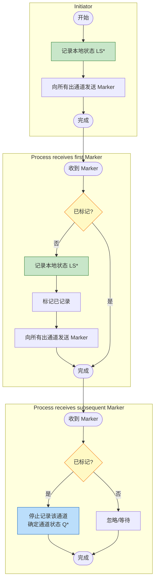
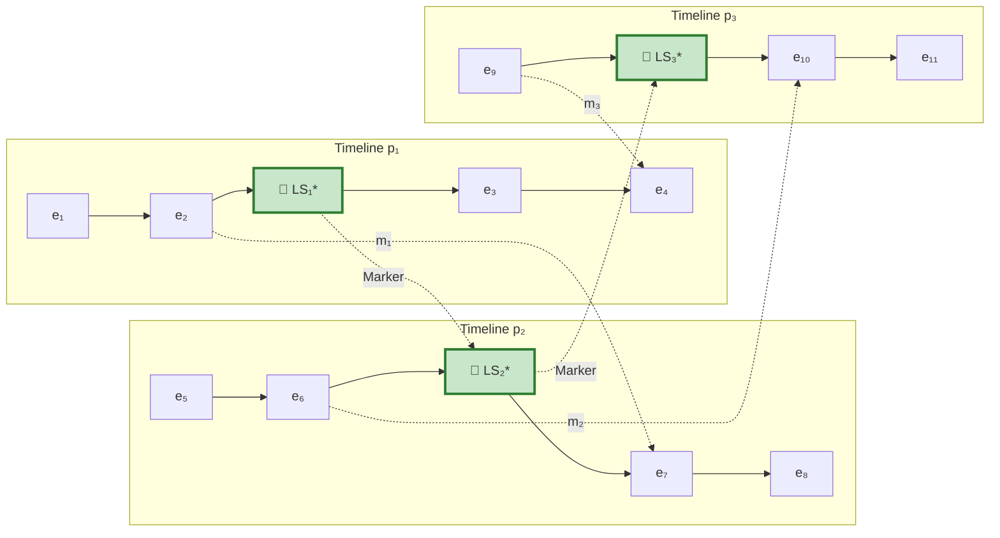
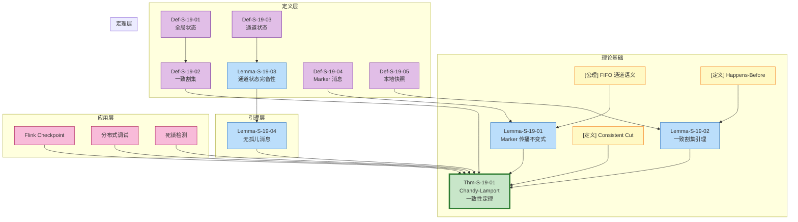

# Chandy-Lamport 快照一致性证明 (Chandy-Lamport Snapshot Consistency Proof)

> **所属阶段**: Struct/04-proofs | **前置依赖**: [../04-proofs/04.01-flink-checkpoint-correctness.md](../04-proofs/04.01-flink-checkpoint-correctness.md) | **形式化等级**: L5

---

## 目录

- [Chandy-Lamport 快照一致性证明 (Chandy-Lamport Snapshot Consistency Proof)](#chandy-lamport-快照一致性证明-chandy-lamport-snapshot-consistency-proof)
  - [目录](#目录)
  - [1. 概念定义 (Definitions)](#1-概念定义-definitions)
    - [Def-S-19-01 (全局状态)](#def-s-19-01-全局状态)
    - [Def-S-19-02 (一致割集 / Consistent Cut)](#def-s-19-02-一致割集--consistent-cut)
    - [Def-S-19-03 (通道状态)](#def-s-19-03-通道状态)
    - [Def-S-19-04 (Marker 消息)](#def-s-19-04-marker-消息)
    - [Def-S-19-05 (本地快照)](#def-s-19-05-本地快照)
  - [2. 属性推导 (Properties)](#2-属性推导-properties)
    - [Lemma-S-19-01 (Marker 传播不变式)](#lemma-s-19-01-marker-传播不变式)
    - [Lemma-S-19-02 (一致割集引理 / Consistent Cut Lemma)](#lemma-s-19-02-一致割集引理--consistent-cut-lemma)
    - [Lemma-S-19-03 (通道状态完备性)](#lemma-s-19-03-通道状态完备性)
    - [Lemma-S-19-04 (无孤儿消息保证)](#lemma-s-19-04-无孤儿消息保证)
  - [3. 关系建立 (Relations)](#3-关系建立-relations)
    - [关系 1: Marker 接收 `↦` 状态记录触发 {#关系-1-marker-接收--状态记录触发}](#关系-1-marker-接收--状态记录触发)
    - [关系 2: 通道记录规则 `⟹` 无消息丢失或重复 {#关系-2-通道记录规则--无消息丢失或重复}](#关系-2-通道记录规则--无消息丢失或重复)
    - [关系 3: Chandy-Lamport `≈` Flink Checkpoint (语义等价) {#关系-3-chandy-lamport--flink-checkpoint-语义等价}](#关系-3-chandy-lamport--flink-checkpoint-语义等价)
  - [4. 论证过程 (Argumentation)](#4-论证过程-argumentation)
    - [引理 4.1 (Marker FIFO 划分引理)](#引理-41-marker-fifo-划分引理)
    - [引理 4.2 (本地快照时刻构成全局切割)](#引理-42-本地快照时刻构成全局切割)
    - [反例 4.1 (非 FIFO 通道破坏一致性)](#反例-41-非-fifo-通道破坏一致性)
    - [反例 4.2 (Marker 丢失导致快照不完备)](#反例-42-marker-丢失导致快照不完备)
  - [5. 形式证明 (Proofs)](#5-形式证明-proofs)
    - [Thm-S-19-01 (Chandy-Lamport 算法记录一致全局状态)](#thm-s-19-01-chandy-lamport-算法记录一致全局状态)
  - [6. 实例验证 (Examples)](#6-实例验证-examples)
    - [示例 6.1: 三进程线性拓扑的快照过程](#示例-61-三进程线性拓扑的快照过程)
    - [示例 6.2: 环形拓扑中的 Marker 传播](#示例-62)
    - [反例 6.3: 网络分区导致快照无法完成](#反例-63-网络分区导致快照无法完成)
  - [7. 可视化 (Visualizations)](#7-可视化-visualizations)
    - [快照算法流程图](#快照算法流程图)
    - [一致割集可视化](#一致割集可视化)
    - [证明依赖图](#证明依赖图)
  - [8. 引用参考 (References)](#8-引用参考-references)

---

## 1. 概念定义 (Definitions)

本节在 Chandy-Lamport 分布式快照理论[^1][^2]的基础上，建立 Chandy-Lamport 算法一致性证明所需的严格数学定义。所有定义均依赖于前置文档 [04.01-flink-checkpoint-correctness.md](../04-proofs/04.01-flink-checkpoint-correctness.md) 中对 Barrier、对齐和全局状态的刻画。

---

### Def-S-19-01 (全局状态)

**定义**：设分布式系统 $\mathcal{D} = \langle P, C, M, Q, E \rangle$，其中 $P$ 为进程集合，$C$ 为通道集合，$M$ 为消息集合，$Q$ 为通道状态，$E$ 为事件集合。**全局状态**（Global State）$S_{global}$ 定义为所有进程本地状态和所有通道状态的笛卡尔积：

$$
S_{global} = \langle LS_1, LS_2, \ldots, LS_n, \{Q_c\}_{c \in C} \rangle \in \prod_{p_i \in P} \mathcal{S}_i \times \prod_{c \in C} M^*
$$

其中：

- $LS_i$：进程 $p_i$ 的本地状态（Local State），包含内部变量、程序计数器、堆栈等
- $Q_c \subseteq M^*$：通道 $c$ 上的消息序列（在途消息）
- $\mathcal{S}_i$：进程 $p_i$ 的状态空间

**状态演化**：系统通过事件 $e \in E$ 进行状态转换：

$$
S_{global} \xrightarrow{e} S'_{global}
$$

**直观解释**：全局状态不是简单地把所有进程状态拼在一起，还必须包含所有通信通道里"正在路上"的消息。这就像是给分布式系统拍一张"全景照片"，照片中不仅要记录每个进程在干什么，还要记录所有在途的消息。

**定义动机**：分布式系统没有共享内存，进程间唯一的耦合就是消息传递。如果不将通道中的在途消息显式纳入全局状态，就无法完整刻画分布式系统的运行快照。遗漏在途消息会导致快照丢失因果关联，无法判断一个快照是否"完整"或"一致"。

---

### Def-S-19-02 (一致割集 / Consistent Cut)

**定义**：设 $E$ 为系统中所有事件的集合。**切割**（Cut）是将 $E$ 划分为两个不相交子集 $(E_{past}, E_{future})$ 的边界：

$$
\text{Cut} = (E_{past}, E_{future}) \quad \text{where } E_{past} \cup E_{future} = E \text{ and } E_{past} \cap E_{future} = \emptyset
$$

切割 $\text{Cut}$ 是**一致的**（Consistent），当且仅当满足 **happens-before 向下封闭性**：

$$
\text{Consistent}(\text{Cut}) \iff \forall e \in E_{past}, \forall f \in E: f \rightarrow e \Rightarrow f \in E_{past}
$$

其中 $\rightarrow$ 为 Lamport 定义的 happens-before 关系[^2]：

$$
\begin{aligned}
f \rightarrow e \iff& \exists p_i \in P: f \prec_{p_i} e \quad \text{(同一进程顺序)} \\
\lor& \exists m \in M, c \in C: f = \text{send}(m, c) \land e = \text{receive}(m, c) \quad \text{(发送-接收因果)} \\
\lor& \exists g \in E: f \rightarrow g \land g \rightarrow e \quad \text{(传递闭包)}
\end{aligned}
$$

**等价表述（无孤儿消息）**：

$$
\text{Consistent}(\text{Cut}) \iff \nexists m \in M: \text{send}(m) \in E_{future} \land \text{receive}(m) \in E_{past}
$$

即：不存在消息 $m$ 满足"发送方在割集之后发送，而接收方在割集之前接收"的孤儿消息（Orphan Message）情况。

**直观解释**：一致割集就像用一把"因果剪刀"剪断事件历史，确保没有任何"果"在剪刀这边而"因"在剪刀那边。如果照片显示某消息已被接收，则照片中发送方的状态必须显示该消息已发送；反之，如果照片显示消息尚未发送，则接收方不能显示已接收。

**定义动机**：分布式系统的全局状态必须对应某个一致割集，否则会出现"接收到了消息但发送消息的状态不在快照中"的悖论。一致割集是判断分布式快照是否有意义的根本标准。

---

### Def-S-19-03 (通道状态)

**定义**：对于通道 $c_{ij} \in C$（从进程 $p_i$ 到 $p_j$ 的通道），其**快照状态**（Channel State）$Q_{ij}^*$ 定义为：

$$
Q_{ij}^* = \{ m \in M \mid \text{send}(m, c_{ij}) \prec_{hb} \text{send}(\text{Marker}_{ij}, c_{ij}) \land \text{receive}(m, c_{ij}) \succ_{hb} \text{receive}(\text{Marker}_{kj}, c_{kj}) \}
$$

即：$Q_{ij}^*$ 包含所有满足以下条件的消息 $m$：

1. $m$ 在 $p_i$ 发送 Marker 到 $c_{ij}$ **之前**被发送
2. $m$ 在 $p_j$ 记录本地状态 **之后**被接收

**通道状态记录规则**：

| 场景 | 规则 | 结果 |
|------|------|------|
| $p_j$ 首次收到来自 $c_{ij}$ 的 Marker | **规则 A** | $Q_{ij}^* := \emptyset$ |
| $p_j$ 已记录状态，后续收到来自 $c_{ij}$ 的 Marker | **规则 B** | $Q_{ij}^* := \{ m \mid m \text{ 在记录状态后、收到 Marker 前接收} \}$ |

**直观解释**：通道状态记录了"在途消息"——已经发送但尚未被接收的消息。Marker 消息在 FIFO 通道中充当了一个明确的边界，将所有消息划分为"Marker 之前"（已处理或已在途）和"Marker 之后"（尚未发送）两部分。

**定义动机**：如果不显式记录通道状态，那些在传输中的消息就会在快照中"消失"（既不在发送方状态中，也不在接收方状态中），导致恢复后出现不一致。

---

### Def-S-19-04 (Marker 消息)

**定义**：**Marker** 是一种特殊控制消息，用于在通道中标记快照边界：

$$
\text{Marker} = \langle \text{type} = \text{MARKER}, \text{snapshotID} \in \mathbb{N}^+, \text{source} \in P \rangle
$$

**Marker 的逻辑语义**：Marker $\text{M}_s$（来自快照发起者 $s$）在通道 $c_{ij}$ 中定义了一个**逻辑时间边界**：

$$
Q_{c_{ij}} = Q_{c_{ij}}^{<M_s} \circ \langle \text{M}_s \rangle \circ Q_{c_{ij}}^{>M_s}
$$

其中：

- $Q_{c_{ij}}^{<M_s}$：Marker 之前发送的消息（已发送且在 Marker 之前到达或正在传输）
- $\text{M}_s$：Marker 消息本身
- $Q_{c_{ij}}^{>M_s}$：Marker 之后发送的消息（尚未发送）

**Marker 处理规则**：

$$
\text{Rules} = \begin{cases}
\textbf{规则 1}: & \text{若 } p_i \text{ 决定发起快照且未标记，则记录 } LS_i^* \text{，向所有出通道发送 Marker} \\[6pt]
\textbf{规则 2}: & \text{若 } p_j \text{ 从通道 } c \text{ 首次接收 Marker 且未标记，则记录 } LS_j^* \text{，} Q_c^* := \emptyset \text{，转发 Marker} \\[6pt]
\textbf{规则 3}: & \text{若 } p_j \text{ 从通道 } c \text{ 接收 Marker 且已标记，则 } Q_c^* := \{ m \mid m \text{ 在记录状态后接收} \}
\end{cases}
$$

**直观解释**：Marker 就像数据流中的"时间分割线"，它携带快照 ID 在进程间传播，标记了"此前数据已处理、此后数据待处理"的边界。所有进程在收到 Marker 后对自身状态进行快照，即可捕获截止到该 Marker 的完整处理结果。

**定义动机**：在无界数据流中不存在自然的"全局快照时刻"，各进程独立决定快照时间会导致状态不一致。Marker 作为携带快照 ID 的逻辑时钟，使得分布式环境下的各进程能够基于**本地事件**（收到 Marker）触发快照，而无需全局协调或停止处理。

---

### Def-S-19-05 (本地快照)

**定义**：进程 $p_i$ 的**本地快照**（Local Snapshot）$\mathcal{L}_i$ 定义为：

$$
\mathcal{L}_i = \langle LS_i^*, \{ Q_{ji}^* \}_{c_{ji} \in \text{In}(i)} \rangle
$$

其中：

- $LS_i^*$：进程 $p_i$ 在**首次收到 Marker 时**记录的本地状态
- $Q_{ji}^*$：输入通道 $c_{ji}$ 的快照状态
- $\text{In}(i) = \{ c_{ji} \mid (p_j, p_i) \in C \}$：$p_i$ 的输入通道集合

**快照时刻**：设 $t_i$ 为 $p_i$ 首次收到任意通道 Marker 的时刻：

$$
LS_i^* = \text{State}(p_i, t_i) \quad \text{其中} \quad t_i = \min \{ t \mid \exists c \in \text{In}(i): \text{receive}(\text{Marker}, c) \text{ at time } t \}
$$

**全局快照**：

$$
\mathcal{G} = \bigcup_{p_i \in P} \mathcal{L}_i = \left\langle \{ LS_i^* \}_{p_i \in P}, \{ Q_{ij}^* \}_{c_{ij} \in C} \right\rangle
$$

**直观解释**：本地快照是全局快照的组成部分，包含进程在某个特定时刻的状态，以及所有输入通道中"还在路上"的消息。每个进程只需要关心自己的状态和输入通道，无需知道全局情况。

**定义动机**：Chandy-Lamport 算法的核心洞察是：全局一致快照可以通过各进程独立记录本地状态和通道状态来构造，无需全局协调。这种"分布式构造"使得算法可以在系统持续运行的同时完成快照。

---

## 2. 属性推导 (Properties)

本节从第 1 节的定义出发，推导 Chandy-Lamport 快照算法的核心性质。所有引理均为定理 Thm-S-19-01 的证明提供必要支撑。

---

### Lemma-S-19-01 (Marker 传播不变式)

**陈述**：对于任意通道 $c_{ij} \in C$，若发送进程 $p_i$ 已向 $c_{ij}$ 发送 Marker，则 $p_i$ 在发送 Marker 前已经：

1. 完成了本地状态记录 $LS_i^*$
2. 处理了所有输入中的"Marker 前"数据
3. 将所有"Marker 前"数据的处理结果（包括输出到 $c_{ij}$ 的数据）发送到下游

**形式化表述**：

$$
\forall c_{ij} \in C: \text{Marker} \in \text{Sent}(p_i, c_{ij}) \implies LS_i^* \text{ 已记录} \land \text{Output}_{<\text{Marker}}(p_i, c_{ij}) \text{ 已发送}
$$

**证明**：

**步骤 1：分析 $p_i$ 的状态转换**

由 Def-S-19-04 的规则 1 和规则 2，进程只有在首次收到 Marker 时才记录本地状态并转发 Marker。状态转换序列为：

$$
\text{RUNNING} \xrightarrow{\text{收到首个 Marker}} \text{RECORDING} \xrightarrow{\text{记录 } LS_i^*} \text{MARKING} \xrightarrow{\text{发送 Marker 到所有出通道}} \text{RUNNING}
$$

**步骤 2：Marker 发送的因果前置条件**

进程 $p_i$ 发送 Marker 到通道 $c_{ij}$ 的动作发生在状态 $\text{MARKING}$ 阶段，该阶段的前提是：

- 已记录：本地状态 $LS_i^*$ 已捕获（Def-S-19-05）
- 已处理：所有"Marker 前"的输入数据已处理并产生输出
- FIFO 保证：由于通道是 FIFO 的，所有"Marker 前"输出都在 Marker 之前到达

**步骤 3：归纳推导**

对系统拓扑进行拓扑排序归纳：

- **Base Case（发起者）**：快照发起者 $p_s$ 在发送 Marker 前已记录其初始状态，符合不变式。
- **Inductive Step**：假设所有上游进程满足不变式，则它们转发到当前进程 $p_i$ 的 Marker 必然在所有"Marker 前"数据之后到达。$p_i$ 收到首个 Marker 后记录状态并转发，保持该不变式。

**步骤 4：结论**

由归纳法，所有通道 $c_{ij}$ 上的 Marker 传播满足该不变式。∎

> **推断 [Theory→Implementation]**: Marker 传播不变式保证了 **下游进程收到 Marker 时，上游已处理完所有 Marker 前的数据**，从而确保全局快照的因果一致性。

---

### Lemma-S-19-02 (一致割集引理 / Consistent Cut Lemma)

**陈述**：设 $\mathcal{G} = \langle \{LS_i^*\}, \{Q_{ij}^*\} \rangle$ 为 Chandy-Lamport 算法收集的全局快照。则 $\mathcal{G}$ 对应于执行历史中的一个**一致割集**（Consistent Cut）。

**形式化表述**：

$$
\text{Consistent}(\mathcal{G}) \iff \forall e \in E_{past}, \forall f \in E: f \rightarrow e \Rightarrow f \in E_{past}
$$

其中 $E_{past} = \{ e \mid \exists p_i: e \text{ 发生在 } p_i \text{ 记录 } LS_i^* \text{ 之前} \}$。

**证明**：

**步骤 1：回顾一致割集定义**

由 Def-S-19-02，$\mathcal{G}$ 一致当且仅当不存在孤儿消息，即不存在消息 $m$ 使得：

$$
\text{send}(m) \in E_{future} \land \text{receive}(m) \in E_{past}
$$

**步骤 2：分析消息 $m$ 的生命周期**

对于任意消息 $m$ 在通道 $c_{ij}$ 上，考虑其在快照时刻的位置：

设 $t_i$ 为 $p_i$ 记录 $LS_i^*$ 并发送 Marker 到 $c_{ij}$ 的时刻，$t_j$ 为 $p_j$ 记录 $LS_j^*$ 的时刻。

**步骤 3：分类讨论**

| 情况 | $\text{send}(m)$ 时间 | $\text{receive}(m)$ 时间 | 是否属于 $Q_{ij}^*$ | 是否孤儿 |
|------|----------------------|-------------------------|-------------------|---------|
| 1 | $< t_i$ (Marker 前) | $< t_j$ (记录前) | 否（已接收） | 否 |
| 2 | $< t_i$ (Marker 前) | $\geq t_j$ (记录后) | **是**（在途） | 否 |
| 3 | $\geq t_i$ (Marker 后) | $< t_j$ (记录前) | 不可能（FIFO） | — |
| 4 | $\geq t_i$ (Marker 后) | $\geq t_j$ (记录后) | 否（未发送） | 否 |

**步骤 4：FIFO 通道的关键作用**

Chandy-Lamport 算法要求通道满足 FIFO（First-In-First-Out）语义：

$$
\text{FIFO}(c_{ij}) \implies \text{order}_{\text{send}} = \text{order}_{\text{recv}}
$$

由于 $p_i$ 在 $t_i$ 发送 Marker 到 $c_{ij}$，且 $t_i$ 是 $p_i$ 记录状态后的第一时间点，情况 3（发送在 Marker 后、接收在记录前）不可能发生——Marker 会在 $m$ 之前到达 $p_j$，导致 $p_j$ 的记录时刻 $t_j$ 不早于 Marker 到达时刻。

**步骤 5：结论**

对于所有通道 $c_{ij} \in C$，$Q_{ij}^*$ 只包含情况 2 的消息（Marker 前发送、记录后接收），不存在孤儿消息。因此 $\mathcal{G}$ 满足 Def-S-19-02 的一致性定义。∎

---

### Lemma-S-19-03 (通道状态完备性)

**陈述**：对于任意通道 $c_{ij} \in C$，其快照状态 $Q_{ij}^*$ **精确包含**在发送进程记录快照之后发送、且在接收进程记录快照之前未接收的所有消息。

**形式化表述**：

设 $t_i$ 为 $p_i$ 记录 $LS_i^*$ 的时刻，$t_j$ 为 $p_j$ 记录 $LS_j^*$ 的时刻。则：

$$
Q_{ij}^* = \{ m \mid t(\text{send}(m)) < t_i \land t(\text{receive}(m)) \geq t_j \}
$$

**证明**：

**步骤 1：分析 $Q_{ij}^*$ 的构成**

由 Def-S-19-03，通道状态 $Q_{ij}^*$ 的记录有两种情况：

**情况 A**：$p_j$ 首次收到的 Marker 来自 $c_{ij}$

- $p_j$ 在收到 $c_{ij}$ 的 Marker 时立即记录 $LS_j^*$
- 此时 $Q_{ij}^* := \emptyset$
- 由 FIFO，$c_{ij}$ 中在 Marker 之前的消息都已处理完毕
- 因此 $Q_{ij}^* = \emptyset = \{ m \mid t(\text{send}(m)) < t_i \land t(\text{receive}(m)) \geq t_j \}$（空集等于空集）

**情况 B**：$p_j$ 首次收到的 Marker 来自其他通道 $c_{kj}$（$k \neq i$）

- $p_j$ 在收到 $c_{kj}$ 的 Marker 时记录 $LS_j^*$
- 此时 $p_j$ 开始记录从 $c_{ij}$ 接收的消息
- 当后续收到 $c_{ij}$ 的 Marker 时，$Q_{ij}^*$ 被设为"记录 $LS_j^*$ 之后、收到 Marker 之前从 $c_{ij}$ 接收的所有消息"
- 由 FIFO，这些消息都是在 $p_i$ 发送 Marker 之前发送的

**步骤 2：完备性证明**

对于任意消息 $m$：

- 若 $t(\text{send}(m)) < t_i$ 且 $t(\text{receive}(m)) \geq t_j$：
  - $m$ 在 $p_i$ 发送 Marker 之前发送
  - $m$ 在 $p_j$ 记录状态之后到达
  - 由情况 B 的记录规则，$m \in Q_{ij}^*$

- 若 $m \in Q_{ij}^*$：
  - 由记录规则，$m$ 在 $p_j$ 记录状态之后、收到 Marker 之前接收
  - 由 FIFO，$m$ 在 $p_i$ 发送 Marker 之前发送
  - 因此 $t(\text{send}(m)) < t_i$ 且 $t(\text{receive}(m)) \geq t_j$

**步骤 3：结论**

两种情况均满足 $Q_{ij}^* = \{ m \mid t(\text{send}(m)) < t_i \land t(\text{receive}(m)) \geq t_j \}$。∎

---

### Lemma-S-19-04 (无孤儿消息保证)

**陈述**：设 $\mathcal{G} = \langle \{LS_i^*\}, \{Q_{ij}^*\} \rangle$ 为 Chandy-Lamport 全局快照。则 $\mathcal{G}$ 中**不存在孤儿消息**（Orphan Message）。

**形式化表述**：

$$
\forall c_{ij} \in C, \forall m \in M: \neg \text{Orphan}(m, \mathcal{G})
$$

其中孤儿消息定义为：

$$
\text{Orphan}(m, \mathcal{G}) \iff \text{send}(m) \in E_{past} \land \text{receive}(m) \in E_{future} \land m \notin Q_{ij}^*
$$

**证明**：

**步骤 1：回顾孤儿消息条件**

孤儿消息要求同时满足：

1. 消息已发送（发送事件在 $E_{past}$ 中）
2. 消息未接收（接收事件在 $E_{future}$ 中）
3. 消息不在通道状态中

**步骤 2：应用 Lemma-S-19-03**

由 Lemma-S-19-03：

$$
Q_{ij}^* = \{ m \mid t(\text{send}(m)) < t_i \land t(\text{receive}(m)) \geq t_j \}
$$

其中 $t_i$ 是 $p_i$ 记录状态的时刻（$\text{send}(m) \in E_{past} \iff t(\text{send}(m)) < t_i$），$t_j$ 是 $p_j$ 记录状态的时刻（$\text{receive}(m) \in E_{future} \iff t(\text{receive}(m)) \geq t_j$）。

因此：

$$
m \in Q_{ij}^* \iff \text{send}(m) \in E_{past} \land \text{receive}(m) \in E_{future}
$$

**步骤 3：排除孤儿消息**

假设存在孤儿消息 $m$，则：

- $\text{send}(m) \in E_{past}$ ✓
- $\text{receive}(m) \in E_{future}$ ✓
- $m \notin Q_{ij}^*$ ✓（孤儿定义）

但由步骤 2，$\text{send}(m) \in E_{past} \land \text{receive}(m) \in E_{future} \implies m \in Q_{ij}^*$，这与 $m \notin Q_{ij}^*$ 矛盾。

**步骤 4：结论**

不存在满足所有孤儿条件的消息。∎

---

## 3. 关系建立 (Relations)

本节建立 Chandy-Lamport 快照算法与 Flink Checkpoint 机制、一致性层级理论之间的严格映射关系。

---

### 关系 1: Marker 接收 `↦` 状态记录触发 {#关系-1-marker-接收--状态记录触发}

**论证**：

在 Chandy-Lamport 算法中，**Marker 消息的接收**直接**触发**进程记录本地状态。这种因果关系是算法分布式特性的核心：

$$
\text{receive}(\text{Marker}, c) \xrightarrow{\text{触发}} \text{record}(LS^*) \quad \text{if } \neg\text{marked}
$$

**映射细节**：

| 触发条件 | 动作 | 结果状态 |
|----------|------|----------|
| $p_i$ 决定发起快照（外部触发） | 记录 $LS_i^*$，发送 Marker 到所有出通道 | $\text{marked}_i = \text{true}$ |
| $p_j$ 从通道 $c$ 首次接收 Marker | 记录 $LS_j^*$，$Q_c^* := \emptyset$，转发 Marker | $\text{marked}_j = \text{true}$ |
| $p_j$ 从通道 $c$ 后续接收 Marker | 停止记录 $c$，$Q_c^*$ 确定 | 通道状态完成 |

**关键洞察**：每个进程**首次**收到任意 Marker 时记录状态，这保证了所有进程的快照时刻在因果序上是"同步"的——它们都位于 Marker 传播路径上的某个一致点。

---

### 关系 2: 通道记录规则 `⟹` 无消息丢失或重复 {#关系-2-通道记录规则--无消息丢失或重复}

**论证**：

Chandy-Lamport 算法的**通道记录规则**（Def-S-19-04 规则 2 和规则 3）确保快照**既不丢失消息也不重复消息**：

**无消息丢失（No Message Loss）**：

设消息 $m$ 在通道 $c_{ij}$ 上，且 $m$ 在 $p_i$ 发送 Marker 之前被发送：

- 若 $m$ 在 $p_j$ 记录状态之前到达：$m$ 的效果已包含在 $LS_j^*$ 中
- 若 $m$ 在 $p_j$ 记录状态之后到达：$m \in Q_{ij}^*$（由 Lemma-S-19-03）

因此，$m$ 要么在进程状态中，要么在通道状态中，不会丢失。

**无消息重复（No Message Duplication）**：

每个消息 $m$ 在快照中只出现一次：

- $m$ 不可能同时在 $LS_j^*$ 和 $Q_{ij}^*$ 中（$Q_{ij}^*$ 只包含记录状态后接收的消息）
- $m$ 不可能出现在多个 $Q_{ij}^*$ 中（每个消息只在一个通道上传输）

**形式化表达**：

$$
\forall m \in M: \text{count}(m, \mathcal{G}) = \begin{cases} 1 & \text{if } m \text{ 在途或已处理} \\ 0 & \text{otherwise} \end{cases}
$$

其中 $\text{count}(m, \mathcal{G})$ 是 $m$ 在全局快照中的出现次数（在进程状态中计为已处理，在通道状态中计为在途）。

---

### 关系 3: Chandy-Lamport `≈` Flink Checkpoint (语义等价) {#关系-3-chandy-lamport--flink-checkpoint-语义等价}

**论证**：

Flink Checkpoint 是 Chandy-Lamport 分布式快照算法在流处理场景下的结构化实现：

| Chandy-Lamport 概念 | Flink 实现 | 语义等价性 |
|-------------------|-----------|----------|
| **Marker 消息** | Checkpoint Barrier $B_n$ | 等价：均为携带快照 ID 的控制事件 |
| **进程状态记录** | 算子状态快照 $S_v^{(n)}$ | 等价：均为本地状态的瞬时捕获 |
| **发送 Marker** | 向下游广播 $B_n$ | 等价：沿所有出边传播快照边界 |
| **接收 Marker** | Barrier 对齐 | 增强：多输入算子需等待所有入边 Marker |
| **通道状态** | 对齐期间缓存的数据 | 扩展：显式记录在途消息 |
| **快照完成通知** | ACK 消息 | 增强：协调器显式收集确认 |

**编码存在性**：存在从 Flink Checkpoint 执行树到 Chandy-Lamport 快照历史的双射（bijection）：

$$
\forall \mathcal{T}_{CP}, \exists \mathcal{H}_{CL}: \text{Encode}(\mathcal{T}_{CP}) = \mathcal{H}_{CL}
$$

其中 Encode 函数将 Flink 的 Barrier 注入、对齐、快照、确认映射为 Chandy-Lamport 的 Marker 发送、接收、状态记录。

**语义保持**：Barrier 对齐机制保证了快照集合构成一个 consistent cut（Def-S-19-02），与 Chandy-Lamport 算法保证的"没有消息跨越割边界"完全一致（Lemma-S-19-04）。

> **交叉引用**: 详见 [04.01-flink-checkpoint-correctness.md](../04-proofs/04.01-flink-checkpoint-correctness.md) 中的"关系 1: Flink Checkpoint `↦` Chandy-Lamport 分布式快照"。

---

## 4. 论证过程 (Argumentation)

本节提供辅助引理、反例分析和边界讨论，为第 5 节的主定理 Thm-S-19-01 做准备。

---

### 引理 4.1 (Marker FIFO 划分引理)

**陈述**：在 FIFO 通道 $c_{ij}$ 中，Marker $M$ 将消息序列划分为两个不相交子集：$Q_{before}$（Marker 之前发送的消息）和 $Q_{after}$（Marker 之后发送的消息）。

**证明**：

**步骤 1：前提分析**

通道 $c_{ij}$ 满足 FIFO，消息按发送顺序到达（Def-S-19-01 的通道定义）。

**步骤 2：构造推导**

- 设发送进程 $p_i$ 在时刻 $t$ 发送 Marker $M$ 到通道 $c_{ij}$
- 设 $M_{before} = \{ m \mid \text{send}(m, c_{ij}) \prec_{p_i} \text{send}(M, c_{ij}) \}$
- 设 $M_{after} = \{ m \mid \text{send}(M, c_{ij}) \prec_{p_i} \text{send}(m, c_{ij}) \}$
- 由 FIFO，$M_{before}$ 中的所有消息都在 $M$ 之前到达接收进程
- 由 FIFO，$M_{after}$ 中的所有消息都在 $M$ 之后到达接收进程
- $M_{before} \cap M_{after} = \emptyset$，$M_{before} \cup M_{after} = M^*$

**步骤 3：结论**

Marker 在 FIFO 通道中创建了一个明确的、无歧义的消息划分边界。∎

---

### 引理 4.2 (本地快照时刻构成全局切割)

**陈述**：Chandy-Lamport 算法中各进程记录本地快照的时刻，在全局事件序列中构成一个切割 $Cut_{CL}$。

**证明**：

**步骤 1：前提分析**

每个进程 $p_i$ 在收到第一个 Marker 的某个事件时刻 $t_i$ 记录 $LS_i^*$（Def-S-19-05）。

**步骤 2：构造推导**

- 对于每个进程 $p_i$，$t_i$ 将其本地事件序列划分为 $E_{past}^{(i)}$（$t_i$ 之前的事件）和 $E_{future}^{(i)}$（$t_i$ 之后的事件）
- 全局上，定义 $E_{past} = \bigcup_i E_{past}^{(i)}$，$E_{future} = \bigcup_i E_{future}^{(i)}$
- 由于每个进程的事件序列被精确划分为两部分，全局事件集合也被划分为两部分

**步骤 3：结论**

$Cut_{CL} = (E_{past}, E_{future})$ 是一个合法的切割。∎

---

### 反例 4.1 (非 FIFO 通道破坏一致性)

**场景**：假设通道 $c_{12}$ 不满足 FIFO，消息可能乱序到达。

**执行时序**：

```
t=0:  p₁ 记录 LS₁* 后，依次发送消息 m₁ 和 Marker M 到 c₁₂
t=1:  由于 c₁₂ 非 FIFO，M 先于 m₁ 到达 p₂
t=2:  p₂ 收到 M 后记录 LS₂*，设 Qc₁₂* = ∅
t=3:  m₁ 到达 p₂
```

**分析**：

- **违反的前提**：通道 FIFO 假设
- **导致的异常**：$m_1$ 的发送事件在 $E_{future}$（因为 $p_1$ 已记录状态），但 $m_1$ 的接收事件在 $E_{past}$ 的边界之后被处理
- **结果**：产生了孤儿消息——$m_1$ 已发送（在发送方状态快照之后）且已接收（在接收方状态快照之后），但不在 $Q_{c_{12}}^*$ 中

**结论**：非 FIFO 通道破坏了 Marker 的消息划分能力，导致快照无法对应 consistent cut。

---

### 反例 4.2 (Marker 丢失导致快照不完备)

**场景**：假设通道 $c_{12}$ 中的 Marker $M$ 在网络传输中丢失。

**执行时序**：

```
t=0:  p₁ 发起快照，记录 LS₁*，向 c₁₂ 和 c₁₃ 发送 Marker
t=1:  c₁₂ 中的 M 丢失，p₂ 永远收不到来自 c₁₂ 的 Marker
t=2:  p₃ 收到 Marker，记录 LS₃*，向 c₃₂ 发送 Marker
t=3:  p₂ 从 c₃₂ 收到 Marker，记录 LS₂*，但 Qc₁₂* 永远无法确定
```

**分析**：

- **违反的前提**：网络可靠传输假设
- **导致的异常**：全局快照 $\mathcal{G}$ 中通道 $c_{12}$ 的状态缺失，算法无法终止
- **结论**：Marker 的可靠传递是算法终止性和快照完备性的必要条件。在实际系统（如 Flink）中，这通过 TCP 可靠传输和超时重试机制来缓解。

---

## 5. 形式证明 (Proofs)

### Thm-S-19-01 (Chandy-Lamport 算法记录一致全局状态)

**陈述**：Chandy-Lamport 分布式快照算法产生的全局快照 $\mathcal{G}$ 是一个**一致的全局状态**，即：

$$
\text{Consistent}(\mathcal{G}) \land \text{NoOrphans}(\mathcal{G}) \land \text{Reachable}(\mathcal{G})
$$

其中：

- $\text{Consistent}(\mathcal{G})$：$\mathcal{G}$ 对应一个 consistent cut
- $\text{NoOrphans}(\mathcal{G})$：$\mathcal{G}$ 中不存在孤儿消息
- $\text{Reachable}(\mathcal{G})$：$\mathcal{G}$ 是系统可达的某个全局状态

**证明结构**：

本证明分为三个部分：

1. **Part 1**：证明 Marker 注入和传播的正确性
2. **Part 2**：证明通道状态记录完备性
3. **Part 3**：证明全局快照构成一致割集且可达

---

**Part 1: Marker 注入和传播的正确性**

**目标**：证明快照发起者注入的 Marker 和下游传播的 Marker 满足因果封闭性。

**步骤 1.1：发起者 Marker 注入**

设快照发起者 $p_s$ 在时刻 $t_s$ 记录 $LS_s^*$ 并向所有出通道发送 Marker：

$$
\forall r \in \text{Input}(p_s): \text{processed}(r) \text{ at } t_s \implies r \text{ 的效果包含于 } LS_s^*
$$

$$
\forall r \in \text{Input}(p_s): \neg\text{processed}(r) \text{ at } t_s \implies r \text{ 的效果不包含于 } LS_s^*
$$

因此，$LS_s^*$ 精确对应于"截止到发送 Marker 的所有输入已被处理"的状态。

**步骤 1.2：Marker 传播不变式**

由 Lemma-S-19-01，对于任意通道 $c_{ij}$：

$$
\text{Marker} \in \text{Sent}(p_i, c_{ij}) \implies LS_i^* \text{ 已记录} \land \text{Output}_{<\text{Marker}}(p_i, c_{ij}) \text{ 已发送}
$$

这表明 Marker 在物理上位于所有 Marker 前输出数据之后。

**步骤 1.3：归纳传播**

对系统拓扑进行拓扑排序，设拓扑序为 $p_1, p_2, \ldots, p_n$：

- **Base Case**：快照发起者（拓扑序最小）满足步骤 1.1
- **Inductive Step**：假设所有拓扑序小于 $k$ 的进程满足传播不变式。对于进程 $p_k$，其所有前驱进程已将 Marker 发送到对应通道。由 Marker 接收规则，$p_k$ 收到首个 Marker 后记录状态并转发，因此 $p_k$ 也满足传播不变式

**Part 1 结论**：所有进程的 Marker 传播满足因果封闭性。

---

**Part 2: 通道状态记录完备性**

**目标**：证明任意通道 $c_{ij}$ 的快照状态 $Q_{ij}^*$ 精确捕获所有在途消息。

**步骤 2.1：应用 Lemma-S-19-03**

由 Lemma-S-19-03：

$$
Q_{ij}^* = \{ m \mid t(\text{send}(m)) < t_i \land t(\text{receive}(m)) \geq t_j \}
$$

其中 $t_i$ 是 $p_i$ 记录状态的时刻，$t_j$ 是 $p_j$ 记录状态的时刻。

**步骤 2.2：分类验证**

对于任意消息 $m$ 在 $c_{ij}$ 上：

| 消息状态 | 在 $Q_{ij}^*$ 中？ | 原因 |
|----------|------------------|------|
| $t(\text{send}) < t_i$ 且 $t(\text{recv}) < t_j$ | 否 | 已处理，效果在 $LS_j^*$ 中 |
| $t(\text{send}) < t_i$ 且 $t(\text{recv}) \geq t_j$ | **是** | 在途消息 |
| $t(\text{send}) \geq t_i$ 且 $t(\text{recv}) < t_j$ | 不可能 | FIFO 保证 Marker 先到 |
| $t(\text{send}) \geq t_i$ 且 $t(\text{recv}) \geq t_j$ | 否 | 尚未发送 |

**步骤 2.3：完备性结论**

$Q_{ij}^*$ 精确包含所有在途消息，既不丢失（所有在途消息都包含）也不重复（每个消息只出现一次）。

**Part 2 结论**：通道状态记录是完备且准确的。

---

**Part 3: 全局快照构成一致割集且可达**

**目标**：证明 $\mathcal{G} = \langle \{LS_i^*\}, \{Q_{ij}^*\} \rangle$ 满足一致割集定义且是可达状态。

**步骤 3.1：一致割集证明**

由 Lemma-S-19-02，$\mathcal{G}$ 对应一个 consistent cut：

$$
\forall e \in E_{past}, \forall f \in E: f \rightarrow e \Rightarrow f \in E_{past}
$$

这等价于：$\nexists m: \text{send}(m) \in E_{future} \land \text{receive}(m) \in E_{past}$

**步骤 3.2：无孤儿消息证明**

由 Lemma-S-19-04：

$$
\forall c_{ij} \in C, \forall m \in M: \neg \text{Orphan}(m, \mathcal{G})
$$

**步骤 3.3：状态可达性证明**

$\mathcal{G}$ 中的每个 $LS_i^*$ 都是某真实执行时刻 $t_i$ 的状态（收到首个 Marker 时），因此：

1. **进程状态**：每个 $LS_i^*$ 是进程 $p_i$ 在时刻 $t_i$ 的有效状态
2. **通道状态**：每个 $Q_{ij}^*$ 包含时刻 $t_i$ 和 $t_j$ 之间在途的消息
3. **全局可达**：考虑执行路径上所有进程依次在 $t_1, t_2, \ldots, t_n$ 时刻"暂停"，此时的全局状态正是 $\mathcal{G}$

因此，$\mathcal{G}$ 是一个可达的全局状态。

**Part 3 结论**：$\mathcal{G}$ 满足一致割集、无孤儿消息、状态可达性。

---

**定理总结**：

| 性质 | 证明依据 | 关键引理/定义 |
|------|---------|--------------|
| **Consistent($\mathcal{G}$)** | Happens-before 封闭性 | Def-S-19-02, Lemma-S-19-02 |
| **NoOrphans($\mathcal{G}$)** | Marker 传播与 FIFO | Lemma-S-19-04 |
| **Reachable($\mathcal{G}$)** | 快照时刻存在性 | Def-S-19-05, Lemma-S-19-01 |

∎

---

## 6. 实例验证 (Examples)

### 示例 6.1: 三进程线性拓扑的快照过程

**场景**：线性拓扑 $p_1 \rightarrow p_2 \rightarrow p_3$，$p_1$ 发起快照。

**执行时序**：

```
t=0:  p₁ 记录 LS₁*，向 c₁₂ 发送 Marker
t=1:  p₂ 从 c₁₂ 收到 Marker（首个），记录 LS₂*，向 c₂₃ 发送 Marker
t=2:  p₃ 从 c₂₃ 收到 Marker（首个），记录 LS₃*
t=3:  所有进程完成状态记录
```

**验证**：

1. **$p_1$**：$LS_1^*$ 包含发起快照时刻的所有内部状态
2. **$p_2$**：$LS_2^*$ 包含处理完 $c_{12}$ 中 Marker 前所有消息后的状态
3. **$p_3$**：$LS_3^*$ 包含处理完 $c_{23}$ 中 Marker 前所有消息后的状态
4. **通道状态**：$Q_{12}^* = Q_{23}^* = \emptyset$（首次收到 Marker 时记录）

全局状态 $\mathcal{G}$ 对应于"Marker 传播路径上各进程的一致瞬间"。

---

### 示例 6.2: 环形拓扑中的 Marker 传播 {#关系-1-marker-接收--状态记录触发}

**场景**：环形拓扑 $p_1 \rightarrow p_2 \rightarrow p_3 \rightarrow p_1$，$p_1$ 发起快照。

**执行时序**：

```
t=0:  p₁ 记录 LS₁*，向 c₁₂ 和 c₁₃ 发送 Marker（注意：有向环中 p₁ 的输出到 p₃）
t=1:  p₂ 从 c₁₂ 收到 Marker，记录 LS₂*，向 c₂₃ 发送 Marker
t=2:  p₃ 从 c₂₃ 收到 Marker（首个），记录 LS₃*，向 c₃₁ 发送 Marker
t=3:  p₁ 从 c₃₁ 收到 Marker（已标记，仅确定 Qc₃₁*）
t=4:  p₃ 从 c₁₃ 收到 Marker（已标记，仅确定 Qc₁₃*）
```

**验证**：

- $p_3$ 有两个输入通道 $c_{23}$ 和 $c_{13}$
- $p_3$ 首次从 $c_{23}$ 收到 Marker 时记录 $LS_3^*$
- 后续从 $c_{13}$ 收到 Marker 时确定 $Q_{13}^*$
- 环形拓扑中每个进程最终都收到所有入边的 Marker

---

### 反例 6.3: 网络分区导致快照无法完成

**场景**：

```
       c₁₂
  p₁ ──────→ p₂
   │          │
   │ c₁₃      │ c₂₃
   ↓          ↓
  p₃ ←────── p₄
       c₄₃
```

网络分区将系统分为 $\{p_1, p_3\}$ 和 $\{p_2, p_4\}$ 两个分区。

**执行时序**：

```
t=0:  p₁ 发起快照，但无法到达 p₂ 和 p₄（网络分区）
t=1:  p₁ 和 p₃ 完成快照（它们在同一个分区）
t=2:  p₂ 和 p₄ 永远收不到 Marker
```

**分析**：

- **违反的前提**：网络连通性假设
- **导致的异常**：全局快照无法完成，$p_2$ 和 $p_4$ 的状态缺失
- **结论**：Chandy-Lamport 算法要求系统拓扑在快照期间保持弱连通（或快照从每个连通分量发起）

---

## 7. 可视化 (Visualizations)

### 快照算法流程图



**图说明**：

- 本图展示了 Chandy-Lamport 算法的完整流程
- **绿色节点**：本地状态记录（每个进程只执行一次）
- **黄色节点**：条件判断（是否首次收到 Marker）
- **蓝色节点**：通道状态确定（后续 Marker 处理）

---

### 一致割集可视化



**图说明**：

- 本图展示了三个进程的时间线和快照时刻
- **绿色粗框**：各进程记录本地快照的时刻
- **虚线箭头**：消息传递（$m_1, m_2, m_3$）和 Marker 传播
- **Consistent Cut**：所有快照时刻构成的切割满足 happens-before 向下封闭性
- 注意 $m_1$：在 $p_1$ 快照前发送，在 $p_2$ 快照后接收——属于 $Q_{12}^*$

---

### 证明依赖图



**图说明**：

- 本图展示了 Thm-S-19-01 的完整证明依赖结构
- **黄色节点**：理论基础层（FIFO、Happens-Before、Consistent Cut）
- **紫色节点**：本文档定义的五个核心定义
- **蓝色节点**：支撑定理的四个关键引理
- **绿色粗框节点**：主定理 Thm-S-19-01
- **粉色节点**：定理的下游应用

---

## 8. 引用参考 (References)

[^1]: K. M. Chandy and L. Lamport, "Distributed Snapshots: Determining Global States of Distributed Systems," *ACM Transactions on Computer Systems*, vol. 3, no. 1, pp. 63-75, 1985. [Online]. Available: <https://doi.org/10.1145/214451.214456>

[^2]: L. Lamport, "Time, Clocks, and the Ordering of Events in a Distributed System," *Communications of the ACM*, vol. 21, no. 7, pp. 558-565, 1978. [Online]. Available: <https://doi.org/10.1145/359545.359563>


---

*文档版本: v1.0 | 更新日期: 2026-04-02 | 状态: 已完成*
*交叉引用: [04.01-flink-checkpoint-correctness.md](../04-proofs/04.01-flink-checkpoint-correctness.md)*
