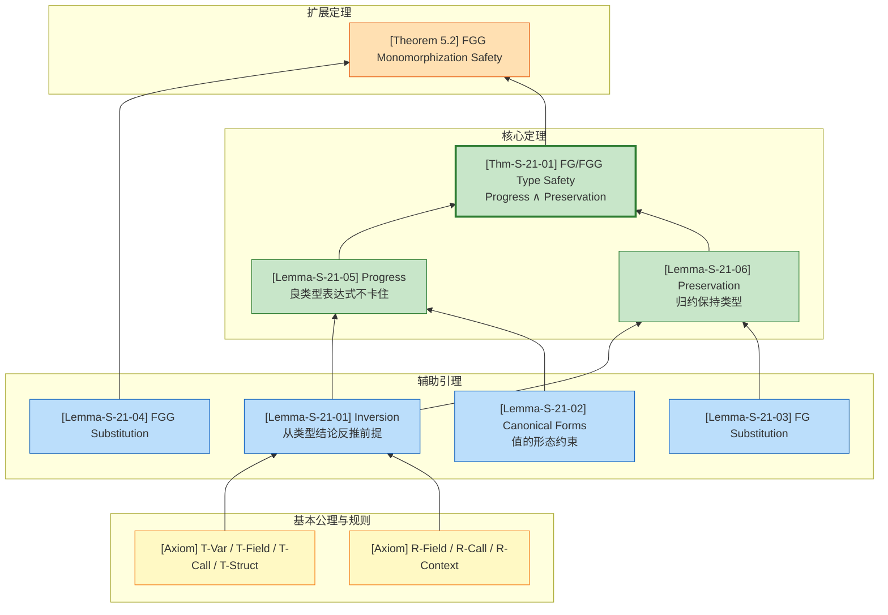
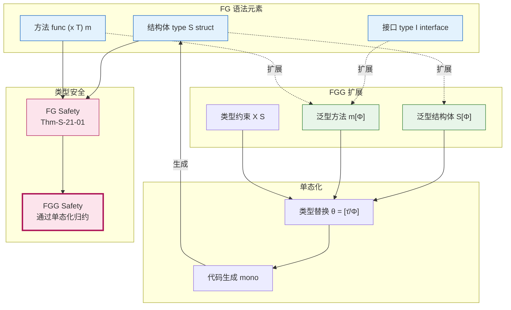

# FG/FGG 类型安全证明 (FG/FGG Type Safety Proof)

> **章节定位**: 本章形式化证明 Featherweight Go (FG) 与 Featherweight Generic Go (FGG) 的类型安全性，建立良类型程序不会陷入 stuck 状态的严格数学保证。
>
> **前置依赖**: [`../02-properties/02.05-type-safety-derivation.md`](../02-properties/02.05-type-safety-derivation.md)

---

## 目录

- [FG/FGG 类型安全证明 (FG/FGG Type Safety Proof)](#fgfgg-类型安全证明-fgfgg-type-safety-proof)
  - [目录](#目录)
  - [1. 概念定义 (Definitions)](#1-概念定义-definitions)
    - [1.1 FG 抽象语法](#11-fg-抽象语法)
    - [1.2 FGG 抽象语法](#12-fgg-抽象语法)
    - [1.3 类型替换](#13-类型替换)
    - [1.4 方法解析](#14-方法解析)
    - [1.5 FG/FGG 小步操作语义 (SOS)](#15-fgfgg-小步操作语义-sos)
  - [2. 属性推导 (Properties)](#2-属性推导-properties)
    - [2.1 FG/FGG 类型规则](#21-fgfgg-类型规则)
  - [3. 关系建立 (Relations)](#3-关系建立-relations)
    - [3.1 FG 与 FGG 的关系](#31-fg-与-fgg-的关系)
    - [3.2 单态化语义关系](#32-单态化语义关系)
  - [4. 论证过程 (Argumentation)](#4-论证过程-argumentation)
    - [4.1 反演引理](#41-反演引理)
    - [4.2 标准形式引理](#42-标准形式引理)
    - [4.3 替换引理](#43-替换引理)
  - [5. 形式证明 (Proofs)](#5-形式证明-proofs)
    - [5.1 Progress 定理](#51-progress-定理)
    - [5.2 Preservation 定理](#52-preservation-定理)
    - [5.3 FG/FGG 类型安全定理](#53-fgfgg-类型安全定理)
    - [5.4 FGG 单态化正确性](#54-fgg-单态化正确性)
  - [6. 实例与反例 (Examples \& Counter-examples)](#6-实例与反例-examples-counter-examples)
    - [6.1 正例：FG 类型推导与归约](#61-正例fg-类型推导与归约)
    - [6.2 正例：FGG 泛型类型推导](#62-正例fgg-泛型类型推导)
    - [6.3 反例：类型断言失败](#63-反例类型断言失败)
    - [6.4 反例：FGG 约束违反](#64-反例fgg-约束违反)
  - [7. 可视化 (Visualization)](#7-可视化-visualization)
    - [7.1 类型安全证明结构图](#71-类型安全证明结构图)
    - [7.2 FG-FGG 语法与证明依赖图](#72-fg-fgg-语法与证明依赖图)
  - [8. 参考文献 (References)](#8-参考文献-references)
  - [9. 交叉引用 (Cross-references)](#9-交叉引用-cross-references)
    - [9.1 前置依赖](#91-前置依赖)
    - [9.2 引用映射](#92-引用映射)

## 1. 概念定义 (Definitions)

### 1.1 FG 抽象语法

**定义 Def-S-21-01 (FG 抽象语法)**[^1][^2]:

FG 是 Go 语言的最小核心子集，剥离指针、切片、通道、goroutine 等特性，仅保留结构体、接口、方法、字段访问和类型断言：

$$
\begin{array}{llcl}
\text{类型} & t, u & ::= & t_S \mid t_I \\
\text{表达式} & e & ::= & x \mid e.f \mid e.(t) \mid t_S\{f_1: e_1, ..., f_n: e_n\} \mid e.m(e_1, ..., e_n) \\
\text{值} & v & ::= & t_S\{f_1: v_1, ..., f_n: v_n\} \\
\text{声明} & D & ::= & \text{type } t_S \text{ struct } \{f_1 \, u_1, ..., f_n \, u_n\} \\
  & & \mid & \text{type } t_I \text{ interface } \{m_1(M_1), ..., m_k(M_k)\} \\
  & & \mid & \text{func } (x \, t) \, m(x_1 \, u_1, ...) \, u_r \, \{ \text{return } e \}
\end{array}
$$

**符号约定**:

- $t_S$ 表示结构体类型，由结构体声明定义
- $t_I$ 表示接口类型，由接口声明定义
- $x$ 表示变量，来自环境 $\Gamma$
- $e.f$ 表示字段选择，$e.(t)$ 表示类型断言
- $t_S\{\bar{f}: \bar{e}\}$ 表示结构体字面量构造
- $e.m(\bar{e})$ 表示方法调用

**直观解释**: FG 语法刻意最小化，剥离了 Go 中除结构子类型外的所有高级特性。结构体类型 $t_S$ 是唯一的值构造子；接口类型 $t_I$ 定义方法规范集；方法调用通过结构子类型匹配实现动态分派。

---

### 1.2 FGG 抽象语法

**定义 Def-S-21-02 (FGG 泛型扩展)**[^3]:

FGG 在 FG 基础上引入类型参数、类型约束和单态化语义：

$$
\begin{array}{llcl}
\text{类型形参} & \Phi & ::= & \epsilon \mid \Phi, X \, S \\
\text{类型参数} & \tau, \sigma & ::= & X \mid n[\bar{\tau}] \\
\text{类型约束} & S & ::= & \text{any} \mid \text{interface } \{M_1, ..., M_k\} \\
\text{泛型结构体} & & & \text{type } t_S[\Phi] \text{ struct } \{f_1 \, u_1, ...\} \\
\text{泛型接口} & & & \text{type } t_I[\Phi] \text{ interface } \{...\} \\
\text{泛型方法} & & & \text{func } (x \, t[\bar{\tau}]) \, m[\Phi](...) \, u_r \, \{\text{return } e\}
\end{array}
$$

**直观解释**: FGG 的类型参数 $\Phi$ 允许结构体、接口和方法声明"参数化"于类型。类型约束 $S$ 限定可实例化的类型集合。单态化是将泛型程序翻译为非泛型 FG 程序的编译期策略，保证零运行时开销。

---

### 1.3 类型替换

**定义 Def-S-21-03 (类型替换)**:

类型替换 $\theta = [\bar{\tau}/\bar{X}]$ 是从类型变量到具体类型的映射：

$$
\begin{array}{lcl}
\theta(X_i) & = & \tau_i \\
\theta(n[\tau_1, ..., \tau_k]) & = & n[\theta(\tau_1), ..., \theta(\tau_k)]
\end{array}
$$

**表达式的替换**:

$$
\begin{array}{lcl}
\theta(x) & = & x \\
\theta(e.f) & = & \theta(e).f \\
\theta(e.(t)) & = & \theta(e).(\theta(t)) \\
\theta(n[\bar{\tau}]\{\bar{f}: \bar{e}\}) & = & n[\theta(\bar{\tau})]\{\bar{f}: \theta(\bar{e})\} \\
\theta(e.m[\bar{\sigma}](\bar{e})) & = & \theta(e).m[\theta(\bar{\sigma})](\theta(\bar{e}))
\end{array}
$$

---

### 1.4 方法解析

**定义 Def-S-21-04 (方法解析)**:

$$
method(n[\bar{\tau}], m) = func(x \, n[\bar{X}]) \, m[\Phi](...) \, u_r \, \{e\}[\bar{\tau}/\bar{X}]
$$

**方法满足性**: 类型 $t$ 满足方法规范 $m(\bar{x}: \bar{u}) \, u_r$ 当且仅当 $method(t, m)$ 存在且签名兼容：

$$
\forall i: param_i' <: param_i \land return <: return'
$$

（参数逆变、返回协变）

---

### 1.5 FG/FGG 小步操作语义 (SOS)

**求值上下文**:

$$
E ::= [] \mid E.f \mid E.(t) \mid t_S\{..., f_i: E, ...\} \mid E.m(\bar{e}) \mid v.m(..., E, ...)
$$

**FG 核心归约规则**:

$$
\boxed{
\begin{array}{ll}
\text{(R-Field)} & t_S\{..., f_i: v_i, ...\}.f_i \longrightarrow v_i \\[8pt]
\text{(R-Call)} & v.m(v_1, ..., v_n) \longrightarrow e[v/x, v_1/x_1, ..., v_n/x_n] \\
& \text{where } method(t_S, m) = func(x \, t_S) \, m(...) \, ... \, \{\text{return } e\} \\[8pt]
\text{(R-Assert-Success)} & t_S\{...\}.(t_S) \longrightarrow t_S\{...\} \\[8pt]
\text{(R-Context)} & \dfrac{e \longrightarrow e'}{E[e] \longrightarrow E[e']}
\end{array}
}
$$

**FGG 核心归约规则**:

$$
\boxed{
\begin{array}{ll}
\text{(R-Field-G)} & n[\bar{\tau}]\{..., f_i: v_i, ...\}.f_i \longrightarrow v_i \\[8pt]
\text{(R-Call-G)} & v.m[\bar{\sigma}](v_1, ...) \longrightarrow \theta(e)[v/x, v_1/x_1, ...] \\
& \text{where } \theta = [\bar{\tau}/\bar{X}][\bar{\sigma}/\Phi], \, v = n[\bar{\tau}]\{...\} \\[8pt]
\text{(R-Context-G)} & \dfrac{e \longrightarrow e'}{E[e] \longrightarrow E[e']}
\end{array}
}
$$

---

## 2. 属性推导 (Properties)

### 2.1 FG/FGG 类型规则

**FG 核心类型规则**:

$$
\boxed{
\begin{array}{c}
\dfrac{\Gamma(x) = t}{\Gamma \vdash x : t} \text{ (T-Var)} \\[10pt]
\dfrac{\Gamma \vdash e : t_S \quad (f \, u) \in fields(t_S)}{\Gamma \vdash e.f : u} \text{ (T-Field)} \\[10pt]
\dfrac{\forall i: \Gamma \vdash e_i : u_i \quad fields(t_S) = [\bar{f}: \bar{u}]}{\Gamma \vdash t_S\{\bar{f}: \bar{e}\} : t_S} \text{ (T-Struct)} \\[10pt]
\dfrac{\Gamma \vdash e : t \quad method(t, m) = (\bar{x}: \bar{u}) \rightarrow v \quad \forall i: \Gamma \vdash e_i : u_i' \land u_i' <: u_i}{\Gamma \vdash e.m(\bar{e}) : v} \text{ (T-Call)}
\end{array}
}
$$

**FGG 类型判断形式**: $\Delta; \Gamma \vdash_{FGG} e : t$，其中 $\Delta$ 是类型参数环境，$\Gamma$ 是变量环境。

**FGG 约束满足规则**:

$$
\dfrac{\forall m \in S: \tau \text{ implements } m}{\Delta \vdash \tau \text{ satisfies } S} \text{ (Sat)}
$$

---

## 3. 关系建立 (Relations)

### 3.1 FG 与 FGG 的关系

**关系**: FGG $>$ FG（FGG 严格扩展 FG）

| 特性 | FG | FGG | 说明 |
|------|-----|-----|------|
| 结构体 | ✓ | ✓ | 基础值类型 |
| 接口 | ✓ | ✓ | 方法规范集 |
| 方法 | ✓ | ✓ | 接收者绑定函数 |
| 类型参数 | ✗ | ✓ | FGG 新增泛型支持 |
| 类型约束 | ✗ | ✓ | FGG 新增约束满足 |
| 单态化 | ✗ | ✓ | FGG 编译期翻译策略 |

**结论**: FGG 严格包含 FG 的表达能力，单态化建立了从 FGG 到 FG 的语义保持翻译。

---

### 3.2 单态化语义关系

**关系**: $mono(P)$ —— FGG 到 FG 的翻译

$$
mono(P) = \bigcup_{\langle decl, \bar{\tau} \rangle \in Inst(P)} mono(decl, \bar{\tau})
$$

其中 $Inst(P)$ 是程序 $P$ 中所有类型实例化点的集合。

**语义保持性**: 若 $e \longrightarrow_{FGG} e'$，则 $mono(e) \longrightarrow_{FG}^* mono(e')$。

---

## 4. 论证过程 (Argumentation)

### 4.1 反演引理

**引理 Lemma-S-21-01 (反演引理)**:

从类型判断的结论可反推其前提结构：

$$
\dfrac{\Gamma \vdash x : t}{\Gamma(x) = t}
$$

$$
\dfrac{\Gamma \vdash e.f_i : t_i}{\exists t: \Gamma \vdash e : t \land fields(t) = [..., f_i: t_i, ...]}
$$

$$
\dfrac{\Gamma \vdash e.m(\bar{e}) : u}{\exists t: \Gamma \vdash e : t \land method(t, m) = (...) \rightarrow u \land \forall i: \Gamma \vdash e_i : t_i' \land t_i' <: t_i}
$$

**证明**: 由 FG/FGG 类型规则的唯一性（每种表达式构造对应唯一类型规则），直接从规则前提可得。∎

---

### 4.2 标准形式引理

**引理 Lemma-S-21-02 (标准形式)**:

若 $\vdash v : t_S$ 且 $type(t_S) = struct\{\bar{f}: \bar{t}\}$，则：

$$
v = t_S\{\bar{f}: \bar{v}\} \land \forall i: \vdash v_i : t_i
$$

若 $\vdash v : t_I$，则 $\exists t_S: t_S <: t_I \land v = t_S\{...\}$。

**证明**: FG/FGG 中唯一的值构造子是结构体字面值。由 T-Struct 规则，每个字段必须具有声明类型或其子类型。接口本身不是值构造子，因此接口类型的值必须是实现该接口的具体结构体。∎

---

### 4.3 替换引理

**引理 Lemma-S-21-03 (FG 替换引理)**:

$$
\dfrac{\Gamma, x: t \vdash e : u \quad \Gamma \vdash v : t}{\Gamma \vdash e[v/x] : u}
$$

**证明**: 对 $e$ 的结构进行结构归纳。

**基本情况**:

- $e = x$: $x[v/x] = v$，由前提 $\Gamma \vdash v : t = u$
- $e = y \neq x$: $y[v/x] = y$，类型不变

**归纳步骤**:

- $e = e_0.f$: 由归纳假设，$\Gamma \vdash e_0[v/x] : t_S$ 且 $(f \, u) \in fields(t_S)$
- $e = e_0.m(\bar{e})$: 由归纳假设，方法调用保持类型
- $e = t_S\{\bar{f}: \bar{e}\}$: 每个字段替换后保持类型

∎

---

**引理 Lemma-S-21-04 (FGG 类型替换引理)**:

若 $\Delta; \Gamma \vdash_{FGG} e : t$ 且 $\theta$ 满足约束，则：

$$
\theta(\Delta); \theta(\Gamma) \vdash_{FGG} \theta(e) : \theta(t)
$$

**证明**: 对表达式 $e$ 的结构进行归纳。变量替换由环境定义保证；方法调用替换保持参数类型匹配；结构体构造替换保持字段类型对应。约束满足条件保证类型参数替换的合法性。∎

---

## 5. 形式证明 (Proofs)

### 5.1 Progress 定理

**引理 Lemma-S-21-05 (Progress / 进展定理)**:

若 $\vdash e : T$（或 $\Delta; \Gamma \vdash_{FGG} e : T$），则：

$$
\text{either } e \in Value \text{ or } \exists e'. \, e \longrightarrow e'
$$

**证明**: 对类型判断的结构进行结构归纳。

**案例 1: 结构体构造 $t_S\{\bar{f}: \bar{e}\}$**

由归纳假设，每个 $e_i$ 要么是值，要么可规约。若全是值，则整体是值；否则由 R-Context 整个表达式可规约。∎

---

**案例 2: 字段访问 $e.f_i$**

1. 若 $e \longrightarrow e'$，由 R-Context，$e.f_i \longrightarrow e'.f_i$。✓
2. 若 $e = v$ 是值，由标准形式引理，$v = t_S\{..., f_i: v_i, ...\}$，由 R-Field 规约到 $v_i$。✓

---

**案例 3: 方法调用 $e.m(\bar{e})$**

1. 若任何子表达式可规约，由 R-Context 整个表达式可规约。✓
2. 若全是值 $v.m(\bar{v})$，由反演引理 $method$ 存在，由 R-Call 规约到方法体替换。✓

---

**案例 4: 泛型方法调用 $e.m[\bar{\sigma}](\bar{e})$**

1. 若任何子表达式可规约，由 R-Context-G 可规约。✓
2. 若全是值，由标准形式和反演引理，$method$ 存在，由 R-Call-G 规约。✓

---

**案例 5: 类型断言 $e.(t)$**

1. 若 $e \longrightarrow e'$，由 R-Context 可规约。✓
2. 若 $e = v = t'\{...\}$ 是值：
   - 若 $t' = t$，由 R-Assert-Success 规约到 $v$。✓
   - 若 $t' \neq t$，触发 panic（语言定义的动态错误，非 stuck）。✓

∎

---

### 5.2 Preservation 定理

**引理 Lemma-S-21-06 (Preservation / 主题归约)**:

若 $\vdash e : T$ 且 $e \longrightarrow e'$，则 $\vdash e' : T$。

**证明**: 对归约关系 $e \longrightarrow e'$ 进行规则归纳。

**案例 R-Field**: $t_S\{..., f_i: v_i, ...\}.f_i \longrightarrow v_i$

1. 由反演引理，$\vdash t_S\{...\} : t_S$ 且 $fields(t_S) = [..., f_i: T_i, ...]$
2. 由反演引理，$\vdash v_i : T_i'$ 且 $T_i' <: T_i$
3. 由子类型传递性，$\vdash v_i : T_i$ ✓

---

**案例 R-Call**: $v.m(\bar{v}) \longrightarrow e_{body}[v/x, \bar{v}/\bar{x}]$

1. 由反演引理，$method(t_S, m) = func(x \, t_S) \, m(\bar{x}: \bar{T}) \, T_r \, \{e_{body}\}$
2. 由方法类型检查，$x: t_S, \bar{x}: \bar{T} \vdash e_{body} : T_r' <: T_r$
3. 由替换引理，$\vdash e_{body}[v/x, \bar{v}/\bar{x}] : T_r' <: T_r$ ✓

---

**案例 R-Call-G**: FGG 泛型方法调用

1. 由反演引理和类型替换引理，替换后的方法体保持类型
2. 由替换引理，实参替换保持类型
3. 由子类型保持性，返回类型保持 ✓

---

**案例 R-Context**: $E[e_1] \longrightarrow E[e_1']$

1. 由归纳假设，若 $\vdash e_1 : T_1$ 且 $e_1 \longrightarrow e_1'$，则 $\vdash e_1' : T_1$
2. 对 $E$ 结构归纳，证明上下文保持类型 ✓

∎

---

### 5.3 FG/FGG 类型安全定理

**定理 Thm-S-21-01 (FG/FGG 类型安全)**:

FG/FGG 满足类型安全：良类型程序不会 stuck。

$$
\text{若 } \vdash e : T \text{ 且 } e \longrightarrow^* e' \text{，则 } e' \in Value \lor \exists e''. \, e' \longrightarrow e''
$$

**证明**: 由 Preservation（Lemma-S-21-06）和 Progress（Lemma-S-21-05）直接组合。

1. **Preservation** 保证：良类型程序的归约后继保持良类型
2. **Progress** 保证：良类型表达式要么是值，要么可规约
3. 因此，任何可达状态不会 stuck 在非值且不可归约的状态

∎

---

### 5.4 FGG 单态化正确性

**定理 5.2 (FGG 单态化保持类型安全)**:

若 $P$ 是良类型的 FGG 程序，则：

1. $mono(P)$ 是良类型的 FG 程序
2. $P$ 的执行不会 stuck

**证明概要**:

1. **实例化点良类型性**: 由 Lemma-S-21-04，每个实例化点生成良类型的 FG 声明
2. **方法查找保持**: 单态化后的方法查找与原 FGG 方法查找对应
3. **FG 类型安全**: 由 Thm-S-21-01，$mono(P)$ 不会 stuck
4. **语义等价**: 由单态化语义等价性，$P$ 与 $mono(P)$ 行为一致，故 $P$ 不会 stuck

∎

---

## 6. 实例与反例 (Examples & Counter-examples)

### 6.1 正例：FG 类型推导与归约

```go
type Adder struct { value int }
func (a Adder) Add(x int) int { return a.value + x }
// 表达式: Adder{value: 5}.Add(3)
```

**类型推导树**:

$$
\dfrac{
  \dfrac{\vdash 5 : int}{\vdash Adder\{value: 5\} : Adder} \text{ (T-Struct)}
  \quad method(Adder, Add) = (x: int) \rightarrow int
  \quad \vdash 3 : int
}{\vdash Adder\{value: 5\}.Add(3) : int} \text{ (T-Call)}
$$

**归约序列**:

$$
\begin{array}{l}
Adder\{value: 5\}.Add(3) \\
\longrightarrow (a.value + x)[Adder\{value: 5\}/a, 3/x] \quad \text{(R-Call)} \\
= Adder\{value: 5\}.value + 3 \\
\longrightarrow 5 + 3 \quad \text{(R-Field)} \\
\longrightarrow 8
\end{array}
$$

---

### 6.2 正例：FGG 泛型类型推导

```go
type Box[T any] struct { value T }
func (b Box[T]) Get() T { return b.value }
// 表达式: Box[int]{value: 42}.Get()
```

**类型推导**:

$$
\Delta; \Gamma \vdash Box[int]\{value: 42\} : Box[int] \vdash Box[int]\{value: 42\}.Get() : int
$$

**单态化后的 FG 程序**:

```go
type Box_int struct { value int }
func (b Box_int) Get() int { return b.value }
```

---

### 6.3 反例：类型断言失败

```go
type Dog struct{}
type Cat struct{}
var x interface{} = Dog{}
_ = x.(Cat)  // panic: interface conversion
```

**分析**: 表达式 `x.(Cat)` 是 well-typed 的（T-Assert 允许任何类型断言），但运行时断言失败触发 panic。这不是类型安全的违反——panic 是语言明确定义的动态错误机制，不是 stuck 状态。Progress 定理仍然成立。

---

### 6.4 反例：FGG 约束违反

```go
type Adder[T interface { ~int | ~float64 }] struct { value T }
// 错误：string 不满足约束
var a Adder[string] = Adder[string]{value: "hello"}
```

**分析**: FGG 类型检查在实例化点 `Adder[string]` 处拒绝此程序。`string` 的底层类型不是 `int` 或 `float64`，不满足约束。约束系统确保编译期捕获此类错误。

---

## 7. 可视化 (Visualization)

### 7.1 类型安全证明结构图



---

### 7.2 FG-FGG 语法与证明依赖图



---

## 8. 参考文献 (References)

[^1]: Griesemer, R., Hu, R., Kokke, W., Lange, J., Taylor, I. L., Tonino, B., ... & Yu, D. (2020). Featherweight Go. *Proceedings of the ACM on Programming Languages*, 4(OOPSLA), 149:1-149:29. <https://doi.org/10.1145/3428217>

[^2]: The Go Programming Language Specification. (2024). <https://go.dev/ref/spec>

[^3]: Griesemer, R., Hu, R., Kokke, W., Lange, J., Taylor, I. L., Tonino, B., ... & Yu, D. (2021). Featherweight Generic Go. *Proceedings of the ACM on Programming Languages*, 5(OOPSLA), 1-30. <https://doi.org/10.1145/3485514>


---

## 9. 交叉引用 (Cross-references)

### 9.1 前置依赖

| 引用文档 | 关系 | 内容说明 |
|----------|------|----------|
| [`../02-properties/02.05-type-safety-derivation.md`](../02-properties/02.05-type-safety-derivation.md) | 扩展与细化 | 本章节对 FG/FGG 类型安全进行更详细的形式化证明 |

### 9.2 引用映射

| 本文定义 | 前置文档对应 |
|----------|--------------|
| Def-S-21-01 (FG Syntax) | Def-S-11-02 |
| Def-S-21-02 (FGG Syntax) | Def-S-11-03 |
| Thm-S-21-01 (Type Safety) | Thm-S-11-01 |

---

**文档元数据**:

- **章节**: 04-proofs/04.05-type-safety-fg-fgg
- **定义计数**: 4 (Def-S-21-01 ~ Def-S-21-04)
- **引理计数**: 6 (Lemma-S-21-01 ~ Lemma-S-21-06)
- **定理计数**: 2 (Thm-S-21-01, Theorem 5.2)
- **交叉引用**: [`../02-properties/02.05-type-safety-derivation.md`](../02-properties/02.05-type-safety-derivation.md)
- **引用来源**: Griesemer et al. (FGG paper) [^1][^3], Go spec [^2]
