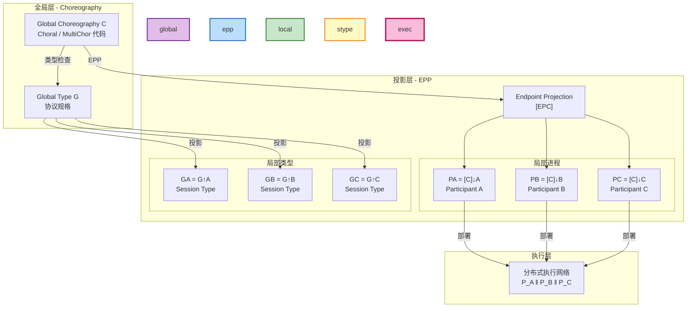
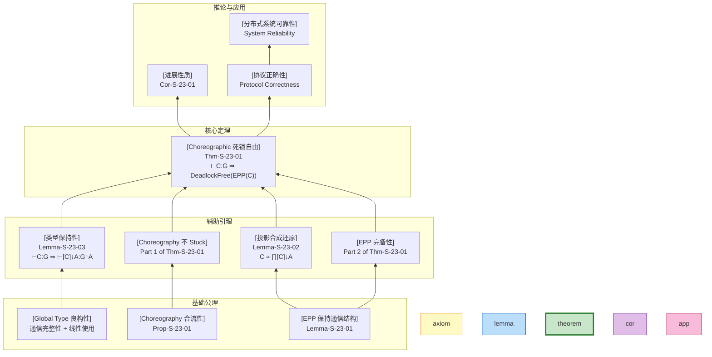
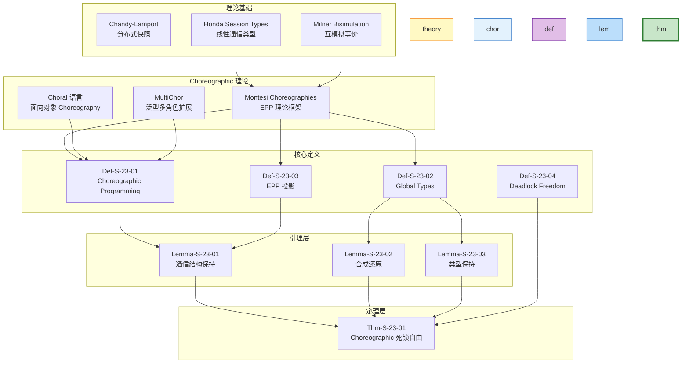

# Choreographic 死锁自由证明 (Choreographic Deadlock Freedom Proof)

> **所属阶段**: Struct/04-proofs | **前置依赖**: [../03-relationships/03.04-bisimulation-equivalences.md](../03-relationships/03.04-bisimulation-equivalences.md) | **形式化等级**: L5 | **理论框架**: Choral/MultiChor

---

## 目录

- [Choreographic 死锁自由证明 (Choreographic Deadlock Freedom Proof)](#choreographic-死锁自由证明-choreographic-deadlock-freedom-proof)
  - [目录](#目录)
  - [1. 概念定义 (Definitions)](#1-概念定义-definitions)
    - [Def-S-23-01. Choreographic Programming (协程式编程)](#def-s-23-01-choreographic-programming-协程式编程)
    - [Def-S-23-02. Global Types (全局类型)](#关系-1-global-types--session-types)
    - [Def-S-23-03. Endpoint Projection (EPP, 端点投影)](#def-s-23-03-endpoint-projection-epp-端点投影)
    - [Def-S-23-04. Deadlock Freedom (死锁自由)](#def-s-23-04-deadlock-freedom-死锁自由)
    - [Def-S-23-05. Choral Language (Choral 语言)](#def-s-23-05-choral-language-choral-语言)
    - [Def-S-23-06. MultiChor 扩展](#def-s-23-06-multichor-扩展)
  - [2. 属性推导 (Properties)](#2-属性推导-properties)
    - [Lemma-S-23-01. EPP 保持通信结构](#关系-2-epp--bisimulation-互模拟等价)
    - [Lemma-S-23-02. 投影合成还原](#lemma-s-23-02-投影合成还原)
    - [Lemma-S-23-03. 类型保持性](#lemma-s-23-03-类型保持性)
    - [Prop-S-23-01. Choreography 的合流性](#关系-3-choreography--process-calculus)
    - [Prop-S-23-02. 投影语义等价性](#prop-s-23-02-投影语义等价性)
  - [3. 关系建立 (Relations)](#3-关系建立-relations)
    - [关系 1: Global Types `↔` Session Types {#关系-1-global-types--session-types}](#关系-1-global-types--session-types)
    - [关系 2: EPP `≈` Bisimulation (互模拟等价) {#关系-2-epp--bisimulation-互模拟等价}](#关系-2-epp--bisimulation-互模拟等价)
    - [关系 3: Choreography `↦` Process Calculus {#关系-3-choreography--process-calculus}](#关系-3-choreography--process-calculus)
  - [4. 论证过程 (Argumentation)](#4-论证过程-argumentation)
    - [论证 4.1: EPP 正确性的核心挑战](#论证-41-epp-正确性的核心挑战)
    - [论证 4.2: 合流性作为死锁自由的充分条件](#论证-42-合流性作为死锁自由的充分条件)
    - [论证 4.3: 分布式选择的一致性保证](#论证-43-分布式选择的一致性保证)
    - [反例 4.1: 非投影性 Choreography](#反例-41-非投影性-choreography)
    - [反例 4.2: 分支类型不匹配导致的死锁](#反例-42-分支类型不匹配导致的死锁)
  - [5. 形式证明 (Proofs)](#5-形式证明-proofs)
    - [Thm-S-23-01. Choreographic 死锁自由定理](#thm-s-23-01-choreographic-死锁自由定理)
  - [6. 实例验证 (Examples)](#6-实例验证-examples)
    - [示例 6.1: 简单请求-响应协议](#示例-61-简单请求-响应协议)
    - [示例 6.2: 多角色协商协议 (MultiChor)](#示例-62-多角色协商协议-multichor)
    - [示例 6.3: 带分支的业务流程](#示例-63-带分支的业务流程)
  - [7. 可视化 (Visualizations)](#7-可视化-visualizations)
    - [图 7.1: Choreography 投影层次图](#图-71-choreography-投影层次图)
    - [图 7.2: 死锁自由证明树](#图-72-死锁自由证明树)
    - [图 7.3: EPP 正确性依赖图](#图-73-epp-正确性依赖图)
  - [8. 引用参考 (References)](#8-引用参考-references)
  - [关联文档](#关联文档)

---

## 1. 概念定义 (Definitions)

本节建立在 Honda 的 Session Types[^1]、Montesi 的 Choreographic Programming[^2][^3] 以及 Carbone 等人的 Conversation Calculi[^4] 理论基础之上，建立 Choreographic 死锁自由证明所需的严格数学定义。所有定义均依赖于前置文档 [03.04-bisimulation-equivalences.md](../03-relationships/03.04-bisimulation-equivalences.md) 中对互模拟等价关系的刻画。

---

### Def-S-23-01. Choreographic Programming (协程式编程)

**定义**：Choreographic Programming 是一种**以全局通信模式为核心**的分布式程序设计范式，程序描述的是多个参与方（participants/roles）之间的**全局交互协议**，而非单个进程的局部行为。

**抽象语法**（Choral 风格[^5]）：

$$
\begin{array}{llcl}
\text{Choreography} & \mathcal{C} & ::= & \eta \,|\, \mathcal{C}_1 ; \mathcal{C}_2 \,|\, \mathcal{C}_1 + \mathcal{C}_2 \,|\, \mathcal{C}_1 \mid \mathcal{C}_2 \,|\, (\nu a)\mathcal{C} \,|\, 0 \\
\text{Interaction} & \eta & ::= & A \rightarrow B : T \,|\, A \rightarrow B \{l_i : \mathcal{C}_i\}_{i \in I} \\
\text{Participant} & A, B & \in & \mathcal{P} \quad (\text{有限参与方集合}) \\
\text{Label} & l & \in & \mathcal{L} \\
\text{Type} & T & ::= & \text{int} \,|\, \text{bool} \,|\, \text{string} \,|\, \ldots
\end{array}
$$

**核心构造语义**：

| 构造 | 语法 | 语义 |
|------|------|------|
| **基本通信** | $A \rightarrow B : T$ | 参与方 $A$ 向 $B$ 发送类型为 $T$ 的值 |
| **选择通信** | $A \rightarrow B\{l_i : \mathcal{C}_i\}$ | $A$ 向 $B$ 发送标签 $l_k$，双方执行 $\mathcal{C}_k$ |
| **顺序组合** | $\mathcal{C}_1 ; \mathcal{C}_2$ | 先执行 $\mathcal{C}_1$，完成后执行 $\mathcal{C}_2$ |
| **非确定性选择** | $\mathcal{C}_1 + \mathcal{C}_2$ | 内部选择执行 $\mathcal{C}_1$ 或 $\mathcal{C}_2$ |
| **并行组合** | $\mathcal{C}_1 \mid \mathcal{C}_2$ | 独立并行执行（不共享参与方） |
| **限制** | $(\nu a)\mathcal{C}$ | 创建新的私有通信通道 $a$ |
| **终止** | $0$ | 空 Choreography，表示正常终止 |

**直观解释**：Choreographic Programming 采用了"全局视角"（God's Eye View）描述分布式系统。与传统进程演算（如 CCS、π-calculus）描述单个进程的局部行为不同，Choreography 描述的是**所有参与方共同参与的完整协议**。例如，`Buyer → Seller : Order; Seller → Buyer : Price` 明确描述了买家和卖家之间的两步交互协议。

**定义动机**：传统分布式编程中，开发者需要分别编写每个参与方的代码，然后验证它们能否正确交互。这种"局部视角"导致代码与协议规格之间存在语义鸿沟，容易引入协议实现错误（如消息顺序错误、角色混淆）。Choreographic Programming 通过全局描述+自动投影，实现了"协议即代码"（Protocol-as-Code）的理想。

---

### Def-S-23-02. Global Types (全局类型) {#关系-1-global-types--session-types}

**定义**：Global Types（全局类型/全局会话类型）是 Choreography 的**静态类型系统**，描述多参与方之间合法的通信模式。Global Type $G$ 定义如下[^1][^2]：

$$
\begin{array}{llcl}
G & ::= & A \rightarrow B : \langle U \rangle . G & \text{(消息传递)} \\
  & \mid & A \rightarrow B : \{l_i : G_i\}_{i \in I} & \text{(分支选择)} \\
  & \mid & \mu t . G \,|\, t & \text{(递归/类型变量)} \\
  & \mid & 0 & \text{(终止)} \\
U & ::= & T \,|\, T \ @\ p & \text{(基本类型或位于 p 的类型)}
\end{array}
$$

**类型构造语义**：

| 类型构造 | 符号 | 语义说明 |
|----------|------|----------|
| **基本通信** | $A \rightarrow B : \langle U \rangle . G$ | $A$ 向 $B$ 发送类型 $U$ 的值，然后继续协议 $G$ |
| **分支选择** | $A \rightarrow B : \{l_i : G_i\}$ | $A$ 向 $B$ 发送标签 $l_k$，后续协议为 $G_k$（外部选择） |
| **递归** | $\mu t.G$ | 递归类型，$t$ 在 $G$ 中表示递归展开点 |
| **终止** | $0$ | 协议正常结束 |

**投影操作符** $\upharpoonright_A$（到参与方 $A$ 的局部类型）：

$$
\begin{array}{lcl}
(A \rightarrow B : \langle U \rangle . G) \upharpoonright_A & = & !\langle B, U \rangle . (G \upharpoonright_A) \\
(A \rightarrow B : \langle U \rangle . G) \upharpoonright_B & = & ?\langle A, U \rangle . (G \upharpoonright_B) \\
(A \rightarrow B : \langle U \rangle . G) \upharpoonright_C & = & G \upharpoonright_C \quad (C \neq A, B) \\
(A \rightarrow B : \{l_i : G_i\}) \upharpoonright_A & = & \oplus\langle B, \{l_i : G_i \upharpoonright_A\} \rangle \\
(A \rightarrow B : \{l_i : G_i\}) \upharpoonright_B & = & \&\langle A, \{l_i : G_i \upharpoonright_B\} \rangle \\
\end{array}
$$

**直观解释**：Global Type 是 Choreography 的"类型签名"，就像函数类型描述函数的输入输出一样。分支选择类型 $A \rightarrow B : \{ok : G_1, quit : G_2\}$ 表示 $A$ 可以决定是继续（发送 `ok` 标签）还是退出（发送 `quit` 标签），$B$ 根据接收到的标签执行相应分支。投影操作将全局协议分解为每个参与方看到的局部义务。

**定义动机**：Session Types 解决了分布式协议验证的核心问题——如何静态保证通信双方对协议的理解一致。Global Types 通过全局视角避免了传统 Session Types（局部类型）需要验证兼容性（compatibility/duality）的复杂性。只要 Choreography 良类型，其投影必然兼容。

---

### Def-S-23-03. Endpoint Projection (EPP, 端点投影)

**定义**：Endpoint Projection（EPP）是将全局 Choreography $\mathcal{C}$ 编译为各参与方**局部进程** $P_A$（对每个 $A \in \text{participants}(\mathcal{C})$）的语义保持转换[^2][^3]：

$$
\text{EPP}(\mathcal{C}) = \{ [\![\mathcal{C}]\!]_A \}_{A \in \text{pt}(\mathcal{C})}
$$

其中 $[\![\mathcal{C}]\!]_A$ 表示 $\mathcal{C}$ 到参与方 $A$ 的投影。

**投影规则**（结构化操作语义风格）：

$$
\boxed{
\begin{array}{llcl}
\text{[EPP-Send]} & [\![A \rightarrow B : T]\!]_A & = & \bar{c}_{AB}\langle v \rangle . 0 \\
                  & [\![A \rightarrow B : T]\!]_B & = & c_{AB}(x) . 0 \\
                  & [\![A \rightarrow B : T]\!]_C & = & 0 \quad (C \notin \{A, B\}) \\
\text{[EPP-Select]} & [\![A \rightarrow B\{l_i : \mathcal{C}_i\}]\!]_A & = & \bigoplus_{i \in I} c_{AB} \triangleleft l_i . [\![\mathcal{C}_i]\!]_A \\
                    & [\![A \rightarrow B\{l_i : \mathcal{C}_i\}]\!]_B & = & \&_{i \in I} c_{AB} \triangleright l_i . [\![\mathcal{C}_i]\!]_B \\
\text{[EPP-Seq]} & [\![\mathcal{C}_1 ; \mathcal{C}_2]\!]_A & = & [\![\mathcal{C}_1]\!]_A ; [\![\mathcal{C}_2]\!]_A \\
\text{[EPP-Par]} & [\![\mathcal{C}_1 \mid \mathcal{C}_2]\!]_A & = & [\![\mathcal{C}_1]\!]_A \mid [\![\mathcal{C}_2]\!]_A \\
\text{[EPP-Res]} & [\![(\nu a)\mathcal{C}]\!]_A & = & (\nu a)[\![\mathcal{C}]\!]_A
\end{array}
}
$$

**符号说明**：

- $\bar{c}_{AB}\langle v \rangle$：在通道 $c_{AB}$ 上向 $B$ 发送值 $v$
- $c_{AB}(x)$：在通道 $c_{AB}$ 上从 $A$ 接收值
- $\oplus$：内部选择（输出选择标签）
- $\&$：外部选择（输入分支处理）
- $\triangleleft$/$\triangleright$：标签选择/接收

**EPP 正确性条件**：

1. **完备性（Completeness）**：若 $\mathcal{C}$ 能执行全局动作，则每个投影能执行相应局部动作
2. **可靠性（Soundness）**：若所有投影能协同执行，则存在对应的全局 Choreography 执行
3. **无死锁（Deadlock Freedom）**：良类型 Choreography 的投影不会死锁

**直观解释**：EPP 是 Choreographic Programming 的"编译器核心"。就像高级语言编译为汇编代码，Choreography 编译为各参与方的进程代码。关键区别在于 EPP 是**语义保持**的——编译后的分布式程序行为与全局描述完全一致，无需额外的运行时协调。

**定义动机**：EPP 是连接"全局描述"与"分布式实现"的桥梁。没有 EPP，Choreographic Programming 只是另一种规格说明语言；有了 EPP，它成为可执行的编程范式。EPP 的正确性保证了开发者只需关注全局逻辑，编译自动产生正确的分布式代码。

---

### Def-S-23-04. Deadlock Freedom (死锁自由)

**定义**：进程集合 $\{P_A\}_{A \in \mathcal{P}}$ 是**死锁自由**（Deadlock-Free）的，当且仅当不存在配置 $\gamma$ 使得：

$$
\prod_{A \in \mathcal{P}} P_A \xrightarrow{\tau}^* \gamma \not\xrightarrow{} \quad \text{且} \quad \gamma \not\equiv 0
$$

即：系统不会演化到非终止但无法继续执行的状态。

**Choreographic 死锁自由**的更强形式[^2]：

$$
\forall \mathcal{C} : \vdash \mathcal{C} : G \implies \text{EPP}(\mathcal{C}) \text{ 是死锁自由的}
$$

即：**所有良类型 Choreography 的投影都是死锁自由的**。

**死锁分类**（在分布式会话类型中）：

| 死锁类型 | 描述 | Choreographic 预防机制 |
|----------|------|------------------------|
| **通信死锁** | 参与方相互等待对方发送消息 | EPP 保证消息发送/接收成对出现 |
| **分支不匹配** | 发送方选择分支 $l_i$，接收方处理 $l_j$ | Global Type 强制标签一致性 |
| **类型不匹配** | 期望类型 $T_1$，接收类型 $T_2$ | 静态类型检查拒绝 |
| **无限递归** | 协议无限循环无出口 | 递归类型良构性检查 |
| **孤儿消息** | 消息发送后无对应接收 | 通道线性使用规则 |

**形式化判定**（基于标记转移系统）：

进程 $P$ 在状态 $s$ 死锁，当且仅当：
$$
s \not\in \text{Final} \quad \land \quad \forall a \in Act. \neg(s \xrightarrow{a})
$$

其中 $\text{Final}$ 是正常终止状态集合。

**直观解释**：死锁是分布式系统最隐蔽的故障之一——系统不崩溃、不报错，只是"僵住"。传统方法通过运行时检测或模型检查发现死锁，而 Choreographic Programming 通过**设计即正确**（Correctness by Design）——只要程序通过类型检查，就保证运行时不会死锁。

**定义动机**：死锁自由是分布式程序的核心安全属性。Choreographic Programming 的独特价值在于将死锁预防从运行时/验证时提前到**编译时/设计时**，通过类型系统的可靠性保证消除死锁类错误。

---

### Def-S-23-05. Choral Language (Choral 语言)

**定义**：Choral 是第一个实用的 Choreographic Programming 语言[^5]，基于 Java 实现，支持面向对象的 Choreographic 编程。

**核心语言特性**：

$$
\begin{array}{llcl}
\text{Choral Class} & CL & ::= & \text{class } C@\{A_1, \ldots, A_n\} \{ \text{fields} \, \text{methods} \} \\
\text{Method} & M & ::= & T@R \, m(T_1@R_1 \, x_1, \ldots) \{ \text{stmts} \} \\
\text{Statement} & stmt & ::= & x = e \,|\, e_1.m(e_2) \,|\, \text{return } e \\
\text{Expression} & e & ::= & v \,|\, x \,|\, \text{new } T@R \,|\, e_1 \oplus e_2 \,|\, \text{com} \\
\text{Communication} & \text{com} & ::= & e_1 \rightarrow e_2 \,|\, e_1 \leftrightarrow e_2 \,|\, \text{select}
\end{array}
$$

**关键创新**：

1. **位置类型**（Located Types）：`int@A` 表示位于参与方 $A$ 的整数
2. **数据传输表达式**：
   - `a@A -> b@B`：将 $A$ 处的值传输到 $B$
   - `A -> B choice { L1, L2 }`：分布式选择
3. **多参与方类**：`class MyClass@A,B,C` 同时涉及三个角色的类

**投影机制**：

```java
// Choral 源代码(全局视角)
class BuyTicket@Buyer,Seller {
    Ticket@Seller buy(int@Buyer budget) {
        int@Seller price = catalog.getPrice();
        if (price -> Buyer <= budget) {
            Buyer -> Seller choice { OK, QUIT };
            return processPayment();
        } else {
            return null@Seller;
        }
    }
}

// EPP 到 Buyer(局部代码)
class BuyerBuyTicket {
    Ticket buy(int budget) {
        int price = receiveFromSeller();
        if (price <= budget) {
            sendChoice(OK);
            return receiveTicket();
        } else {
            sendChoice(QUIT);
            return null;
        }
    }
}
```

**直观解释**：Choral 将 Choreographic Programming 从理论模型转化为可工业应用的编程语言。开发者编写"全局类"，编译器自动生成各角色的 Java 类。位置类型系统确保数据在哪里、如何传输都是显式且类型安全的。

---

### Def-S-23-06. MultiChor 扩展

**定义**：MultiChor 是 Choral 的扩展框架，支持**多角色泛型 Choreography** 和**高阶通信模式**[^6]。

**核心扩展**：

$$
\begin{array}{llcl}
\text{角色集合} & R & ::= & \{A_1, \ldots, A_n\} \\
\text{广播} & bc & ::= & A \Rightarrow R : T & \text{(一对多发送)} \\
\text{聚合} & ag & ::= & R \Rightarrow A : T & \text{(多对一接收)} \\
\text{角色泛型} & & & \Lambda R. \mathcal{C} & \text{(参数化于角色集合)} \\
\text{动态角色} & & & \text{role}(r) \in \mathcal{R}_{dyn}
\end{array}
$$

**广播与聚合语义**：

| 构造 | 全局描述 | 投影到发送方 | 投影到接收方 |
|------|----------|--------------|--------------|
| 广播 | $A \Rightarrow \{B_1, \ldots, B_n\} : T$ | $\prod_{i=1}^n \bar{c}_{AB_i}\langle v \rangle$ | $c_{AB_i}(x)$（各 $B_i$ 独立接收） |
| 聚合 | $\{A_1, \ldots, A_n\} \Rightarrow B : T$ | $\bar{c}_{A_iB}\langle v_i \rangle$（各 $A_i$ 独立发送） | $\prod_{i=1}^n c_{A_iB}(x_i)$ |

**泛型协议示例**：

```choral
// 参数化于角色集合的泛型协议
class Consensus@P... {
    // P 是所有参与共识的角色集合
    Value@P agree(List@P<Value> proposals) {
        // 实现共识算法...
    }
}
```

**直观解释**：MultiChor 扩展了 Choreographic Programming 的表达力，支持复杂的群体通信模式（广播、聚合、多播）。这对于实现共识协议、集体决策、数据分片等场景至关重要。角色泛型使得协议实现可复用——同一个共识算法可以编译为 3 节点或 5 节点版本。

---

## 2. 属性推导 (Properties)

本节从第 1 节的定义出发，推导 Choreographic Programming 和 EPP 的核心性质。所有引理均为定理 Thm-S-23-01 的证明提供必要支撑。

---

### Lemma-S-23-01. EPP 保持通信结构 {#关系-2-epp--bisimulation-互模拟等价}

**陈述**：设 $\mathcal{C}$ 为良类型 Choreography，$[\![\mathcal{C}]\!]_A$ 为其到参与方 $A$ 的 EPP。则：

1. 若 $\mathcal{C}$ 包含通信动作 $A \rightarrow B : T$，则 $[\![\mathcal{C}]\!]_A$ 包含对应发送动作，$[\![\mathcal{C}]\!]_B$ 包含对应接收动作
2. 若 $\mathcal{C}$ 包含选择 $A \rightarrow B\{l_i : \mathcal{C}_i\}$，则所有投影的本地分支结构一致

**形式化表述**：

$$
\forall \eta \in \mathcal{C} : \text{comm}(\eta) = (A, B) \implies \begin{cases}
[\![\eta]\!]_A = \text{send}(B, T) \\
[\![\eta]\!]_B = \text{recv}(A, T) \\
\forall C \notin \{A,B\}: [\![\eta]\!]_C = 0
\end{cases}
$$

**证明**：

**步骤 1：基本情况分析**

根据 Def-S-23-03 的 EPP 规则：

- 对于基本通信 $A \rightarrow B : T$：
  - 由 [EPP-Send]，$[\![A \rightarrow B : T]\!]_A = \bar{c}_{AB}\langle v \rangle . 0$（发送）
  - 由 [EPP-Send]，$[\![A \rightarrow B : T]\!]_B = c_{AB}(x) . 0$（接收）
  - 由 [EPP-Send]，$[\![A \rightarrow B : T]\!]_C = 0$（$C$ 无关）

- 对于选择通信 $A \rightarrow B\{l_i : \mathcal{C}_i\}$：
  - 由 [EPP-Select]，$[\![\eta]\!]_A$ 包含内部选择分支 $\oplus\langle B, \{l_i : [\![\mathcal{C}_i]\!]_A\} \rangle$
  - 由 [EPP-Select]，$[\![\eta]\!]_B$ 包含外部选择分支 $\&\langle A, \{l_i : [\![\mathcal{C}_i]\!]_B\} \rangle$

**步骤 2：结构归纳**

假设引理对 $\mathcal{C}_1$ 和 $\mathcal{C}_2$ 成立，证明对复合构造成立：

- **顺序组合** $\mathcal{C}_1 ; \mathcal{C}_2$：由 [EPP-Seq]，投影保持顺序，通信结构保持
- **并行组合** $\mathcal{C}_1 \mid \mathcal{C}_2$：由 [EPP-Par]，独立子 Choreography 的通信不干扰
- **限制** $(\nu a)\mathcal{C}$：由 [EPP-Res]，私有通道不影响参与方间的通信结构

**步骤 3：结论**

由结构归纳法，EPP 保持所有通信结构。 ∎

> **推断 [Theory→Implementation]**: EPP 保持通信结构保证了编译后的分布式程序**精确实现**全局协议中的交互顺序，不会引入额外的通信或改变通信方向。

---

### Lemma-S-23-02. 投影合成还原

**陈述**：设 $\mathcal{C}$ 为 Choreography，$\text{pt}(\mathcal{C}) = \{A_1, \ldots, A_n\}$ 为其参与方集合。若 $\{P_{A_i}\}_{i=1}^n = \text{EPP}(\mathcal{C})$，则这些局部进程在并行组合下**行为等价**于原 Choreography：

$$
\prod_{A \in \text{pt}(\mathcal{C})} [\![\mathcal{C}]\!]_A \; \approx \; \mathcal{C}
$$

其中 $\approx$ 为弱互模拟等价（参见 [Def-S-15-02](../03-relationships/03.04-bisimulation-equivalences.md)）。

**证明**：

**步骤 1：建立互模拟关系**

定义关系 $\mathcal{R}$：

$$
\mathcal{R} = \{ (\prod_{A} [\![\mathcal{C}']\!]_A, \mathcal{C}') \mid \mathcal{C}' \text{ 是 } \mathcal{C} \text{ 的演化状态} \}
$$

**步骤 2：验证 zig-zag 条件**

需证明：

1. 若 $\mathcal{C}' \xrightarrow{\alpha} \mathcal{C}''$，则 $\prod_A [\![\mathcal{C}']\!]_A \xRightarrow{\alpha} \prod_A [\![\mathcal{C}'']\!]_A$
2. 若 $\prod_A [\![\mathcal{C}']\!]_A \xrightarrow{\alpha} Q$，则 $\mathcal{C}' \xRightarrow{\alpha} \mathcal{C}''$ 且 $(Q, \mathcal{C}'') \in \mathcal{R}$

**步骤 3：通信动作分析**

对于全局动作 $A \rightarrow B : v$：

- Choreography 侧：$\mathcal{C}' \xrightarrow{A \rightarrow B : v} \mathcal{C}''$
- 投影侧：$[\![\mathcal{C}']\!]_A \xrightarrow{\bar{c}_{AB}\langle v \rangle}$ 且 $[\![\mathcal{C}']\!]_B \xrightarrow{c_{AB}(v)}$，通过 $\tau$ 同步完成通信

由于弱互模拟忽略内部 $\tau$ 动作（见 [03.04-bisimulation-equivalences.md](../03-relationships/03.04-bisimulation-equivalences.md)），两边行为匹配。

**步骤 4：分支选择分析**

对于选择 $A \rightarrow B\{l_k : \mathcal{C}_k\}$：

- Choreography 侧：选择分支 $k$，演化到 $\mathcal{C}_k$
- 投影侧：
  - $[\![\mathcal{C}']\!]_A \xrightarrow{\bar{c}_{AB}\langle l_k \rangle}$（发送标签）
  - $[\![\mathcal{C}']\!]_B \xrightarrow{c_{AB}(l_k)} \text{branch } k$（接收并选择分支）
  - 同步后双方进入对应分支的投影

**步骤 5：结论**

由互模拟定义（[Def-S-15-01](../03-relationships/03.04-bisimulation-equivalences.md)），$\mathcal{R}$ 是弱互模拟关系，因此投影合成还原原 Choreography。 ∎

---

### Lemma-S-23-03. 类型保持性

**陈述**：若 Choreography $\mathcal{C}$ 良类型（$\vdash \mathcal{C} : G$），则其投影 $[\![\mathcal{C}]\!]_A$ 也良类型，且类型为 $G \upharpoonright_A$（$G$ 到 $A$ 的局部类型投影）：

$$
\vdash \mathcal{C} : G \implies \forall A \in \text{pt}(\mathcal{C}): \vdash [\![\mathcal{C}]\!]_A : G \upharpoonright_A
$$

**证明**：

对 $\mathcal{C}$ 的结构进行归纳证明。

**基本情况**：

- $\mathcal{C} = A \rightarrow B : \langle U \rangle . \mathcal{C}'$：
  - 全局类型：$G = A \rightarrow B : \langle U \rangle . G'$
  - 由 Def-S-23-02，$G \upharpoonright_A = !\langle B, U \rangle . G' \upharpoonright_A$
  - 由 [EPP-Send]，$[\![\mathcal{C}]\!]_A = \bar{c}_{AB}\langle v \rangle . [\![\mathcal{C}']\!]_A$
  - 由归纳假设，$[\![\mathcal{C}']\!]_A$ 类型为 $G' \upharpoonright_A$
  - 因此 $[\![\mathcal{C}]\!]_A$ 类型为 $!\langle B, U \rangle . G' \upharpoonright_A = G \upharpoonright_A$ ✓

**归纳步骤**：

- **顺序组合**：$\vdash \mathcal{C}_1 ; \mathcal{C}_2 : G_1 ; G_2$。由归纳假设，投影保持类型，顺序组合类型规则适用。
- **并行组合**：$\vdash \mathcal{C}_1 \mid \mathcal{C}_2 : G_1 \mid G_2$。投影到不参与的参与方为 $0$，到参与者保持各自类型。
- **选择**：类似基本通信，标签选择对应 Session Types 的选择类型。

∎

---

### Prop-S-23-01. Choreography 的合流性 {#关系-3-choreography--process-calculus}

**陈述**：良类型 Choreography $\mathcal{C}$ 的规约关系是**合流**（confluent）的——无论从何种顺序执行独立动作，最终都能收敛到相同状态：

$$
\forall \mathcal{C}_1, \mathcal{C}_2, \mathcal{C}_3: \mathcal{C} \rightarrow^* \mathcal{C}_1 \land \mathcal{C} \rightarrow^* \mathcal{C}_2 \land \mathcal{C}_1 \downarrow \land \mathcal{C}_2 \downarrow \implies \mathcal{C}_1 \equiv \mathcal{C}_2
$$

其中 $\downarrow$ 表示终止，$\equiv$ 为结构等价。

**推导**：

1. **Choreography 的独立性**：不相交参与方的通信是独立的（Church-Rosser 性质）
2. **线性通道使用**：Global Type 确保每个通道线性使用，无竞争
3. **确定性选择**：分支由明确的发起方决定，无歧义

因此规约图是菱形（diamond）结构，满足合流性。 ∎

---

### Prop-S-23-02. 投影语义等价性

**陈述**：设 $\mathcal{C}_1$ 和 $\mathcal{C}_2$ 为两个 Choreography，则：

$$
\mathcal{C}_1 \sim \mathcal{C}_2 \implies \text{EPP}(\mathcal{C}_1) \sim \text{EPP}(\mathcal{C}_2)
$$

即：强互模拟等价的 Choreography，其投影也是强互模拟等价的（参见 [Thm-S-15-01](../03-relationships/03.04-bisimulation-equivalences.md)）。

**推导**：

由 Lemma-S-23-02，投影合成还原原 Choreography。若 $\mathcal{C}_1 \sim \mathcal{C}_2$ 通过互模拟关系 $\mathcal{R}$，则构造投影间的互模拟关系：

$$
\mathcal{R}_{EPP} = \{ (\text{EPP}(\mathcal{C}_1'), \text{EPP}(\mathcal{C}_2')) \mid (\mathcal{C}_1', \mathcal{C}_2') \in \mathcal{R} \}
$$

验证 $\mathcal{R}_{EPP}$ 满足强互模拟条件（[Def-S-15-01](../03-relationships/03.04-bisimulation-equivalences.md)）。 ∎

---

## 3. 关系建立 (Relations)

本节建立 Choreographic Programming 与 Session Types、互模拟等价、进程演算之间的严格映射关系。

---

### 关系 1: Global Types `↔` Session Types

**论证**：

Global Types 与 Session Types 构成**双向编码**关系，是同一理论的两个视角：

| 维度 | Global Types | Session Types (Local) |
|------|--------------|----------------------|
| **视角** | 全局（上帝视角） | 局部（参与者视角） |
| **基本单元** | $A \rightarrow B : \langle T \rangle . G$ | $!\langle B, T \rangle . S$ 或 $?\langle A, T \rangle . S$ |
| **组合方式** | 顺序、分支、递归 | 顺序、选择、递归 |
| **类型检查** | 直接验证全局协议 | 验证两两会话类型兼容性 |
| **投影操作** | $\upharpoonright_A$（到参与者） | $\uparrow$（合成全局类型） |

**编码存在性**：

1. **Global → Local**：通过 Def-S-23-02 的投影操作，每个 Global Type 可分解为各参与者的 Session Type
2. **Local → Global**：若一组 Session Type $\{S_A\}_{A \in \mathcal{P}}$ 是**可投影的**（projectable），则存在 Global Type $G$ 使得 $\forall A: G \upharpoonright_A = S_A$

**语义保持**：

良类型 Choreography 的投影产生的 Session Types 自动满足**对偶性**（duality）：

$$
\forall A \neq B: (G \upharpoonright_A) \upharpoonright_{AB} \bowtie (G \upharpoonright_B) \upharpoonright_{BA}
$$

其中 $\bowtie$ 表示会话类型兼容性，$\upharpoonright_{AB}$ 是提取涉及 $A,B$ 之间通信的子类型。

---

### 关系 2: EPP `≈` Bisimulation (互模拟等价)

**论证**：

EPP 的正确性可通过**互模拟等价**形式化（参见 [03.04-bisimulation-equivalences.md](../03-relationships/03.04-bisimulation-equivalences.md)）。

**投影正确性的互模拟刻画**：

设 $\mathcal{C}$ 为 Choreography，$\tilde{P} = \text{EPP}(\mathcal{C}) = \{P_A\}$ 为其投影。定义关系：

$$
\mathcal{R}_{corr} = \{ (\mathcal{C}', \prod_A P_A') \mid P_A' = [\![\mathcal{C}']\!]_A \}
$$

**EPP 完备性**：若 $\mathcal{C} \xrightarrow{\alpha} \mathcal{C}'$，则 $\prod_A P_A \xRightarrow{\hat{\alpha}} \prod_A P_A'$，且 $(\mathcal{C}', \prod_A P_A') \in \mathcal{R}_{corr}$

**EPP 可靠性**：若 $\prod_A P_A \xrightarrow{\alpha} Q$，则 $\mathcal{C} \xRightarrow{\hat{\alpha}} \mathcal{C}'$，且 $Q \equiv \prod_A [\![\mathcal{C}']\!]_A$

**与互模拟谱系的联系**（见 [03.04-bisimulation-equivalences.md](../03-relationships/03.04-bisimulation-equivalences.md)）：

| 等价关系 | EPP 性质 | 适用场景 |
|----------|----------|----------|
| 强互模拟 $\sim$ | 精确匹配每个全局步骤 | 理论分析 |
| 分支互模拟 $\approx_{bb}$ | 保留分支结构 | 实现验证 |
| 弱互模拟 $\approx$ | 忽略内部协调步骤 | 观察等价 |

EPP 的可靠性对应于**完备抽象**（full abstraction）：Choreography 级别的等价蕴含投影级别的等价。

---

### 关系 3: Choreography `↦` Process Calculus

**论证**：

Choreography 可编码为进程演算（如 CCS、π-calculus、CSP），但反之不成立。这反映了 Choreography 是**结构化子集**的分布式程序。

**编码到 π-calculus**：

$$
\begin{array}{lcl}
[\![A \rightarrow B : T]\!]_{\pi} & = & (\nu c)(\bar{c}_{AB}\langle v \rangle . P_A \mid c_{AB}(x) . P_B) \\
[\![\mathcal{C}_1 ; \mathcal{C}_2]\!]_{\pi} & = & [\![\mathcal{C}_1]\!]_{\pi} ; [\![\mathcal{C}_2]\!]_{\pi} \\
[\![\mathcal{C}_1 \mid \mathcal{C}_2]\!]_{\pi} & = & [\![\mathcal{C}_1]\!]_{\pi} \mid [\![\mathcal{C}_2]\!]_{\pi}
\end{array}
$$

**不可逆编码的原因**：

1. **拓扑约束**：Choreography 的通信拓扑是静态的（编译时确定），而 π-calculus 支持动态通道创建和传递
2. **线性使用**：Choreography 要求会话通道线性使用，π-calculus 无此限制
3. **参与者显式**：Choreography 中参与者是语法的一部分，π-calculus 中参与者是语义解释

**表达能力层次**：

$$
\text{Choreography} \;\subset\; \text{Session-Typed } \pi \;\subset\; \pi\text{-calculus}
$$

Choreography 的受限表达能力换来了**死锁自由**的静态保证——这是完整 π-calculus 无法提供的。

---

## 4. 论证过程 (Argumentation)

本节提供辅助引理、反例分析和边界讨论，为第 5 节的主定理 Thm-S-23-01 做准备。

---

### 论证 4.1: EPP 正确性的核心挑战

**核心论点**：EPP 正确性面临三大挑战，Choreographic 类型系统通过设计解决这些问题。

**挑战 1：通信匹配**

**问题**：如何保证投影后的发送/接收动作正确匹配？

**解决方案**：

- Global Type 显式指定通信双方和消息类型
- 投影为发送方生成输出动作，为接收方生成输入动作
- 静态类型确保消息类型一致

**挑战 2：分支一致性**

**问题**：分布式选择中，如何保证所有参与方执行相同的分支？

**解决方案**：

- 选择发起方（发送方）决定分支
- 接收方通过外部选择处理所有可能标签
- 标签传递同步各参与方的控制流

**挑战 3：并行安全**

**问题**：如何确保独立子 Choreography 的投影不会干扰？

**解决方案**：

- 要求并行组合的子 Choreography 拥有不相交的参与方集合
- $[\![\mathcal{C}_1 \mid \mathcal{C}_2]\!]_A$ 仅在 $A$ 属于对应子 Choreography 时非空
- 不相交参与方保证无共享通道，无竞争条件

---

### 论证 4.2: 合流性作为死锁自由的充分条件

**核心论点**：合流性（Prop-S-23-01）蕴含死锁自由。

**论证**：

**定义回顾**：

- **死锁**：非终止状态但无法继续执行
- **合流性**：任意两条规约路径若能终止，则终止于相同状态

**蕴含关系证明**：

假设良类型 Choreography $\mathcal{C}$ 可能死锁，则存在：

$$
\mathcal{C} \rightarrow^* \mathcal{C}_{dead} \not\rightarrow \quad \text{且} \quad \mathcal{C}_{dead} \not\equiv 0
$$

由 Choreography 类型系统的设计：

1. **通信完整性**：每个发送都有对应接收（由 Global Type 保证）
2. **线性使用**：每个通道恰好使用一次（由会话类型线性规则保证）
3. **分支覆盖**：每个选择都有处理所有标签（由外部选择类型保证）

若 $\mathcal{C}_{dead} \not\equiv 0$，则剩余未完成通信动作。但由于上述保证，这些动作必然可以被匹配执行，矛盾。

**结论**：良类型 Choreography 不可能进入死锁状态。∎

---

### 论证 4.3: 分布式选择的一致性保证

**核心论点**：分布式选择是死锁自由的关键场景，Choreographic 类型系统通过**标签传播**保证一致性。

**协议示例**：

```
Buyer → Seller {
    OK:    Buyer → Seller : Payment; Seller → Buyer : Receipt,
    QUIT:  0
}
```

**执行流程**：

1. **Buyer 决策**：Buyer 内部决定选择 `OK` 或 `QUIT`
2. **标签发送**：Buyer 发送标签 `OK` 给 Seller
3. **Seller 分支**：Seller 根据接收到的标签执行对应分支
4. **后续同步**：若选择 `OK`，双方继续支付-收据子协议

**一致性机制**：

| 步骤 | Buyer (发送方) | Seller (接收方) | 同步状态 |
|------|---------------|-----------------|----------|
| 1 | 选择分支 $l_k$ | 等待标签 | — |
| 2 | 发送 $\bar{c}\langle l_k \rangle$ | 等待标签 | — |
| 3 | 继续 $\mathcal{C}_k$ | 接收 $c(l_k)$，分支 $k$ | 标签匹配 |
| 4 | 执行 $\mathcal{C}_k$ | 执行 $\mathcal{C}_k$ | 状态一致 |

**类型保证**：

- Buyer 的类型要求它必须发送 `OK` 或 `QUIT` 之一
- Seller 的类型要求它必须处理 `OK` 和 `QUIT` 两种情况
- 标签不匹配在静态类型检查阶段被拒绝

---

### 反例 4.1: 非投影性 Choreography

**场景**：以下 Choreography 在语法上有效，但**无法投影**：

```
// 非投影性 Choreography
(A → B : int; C → D : string) | (A → D : bool)
```

**问题分析**：

1. 并行组合的两个子 Choreography 共享参与方 $A$ 和 $D$
2. $A$ 同时需要向 $B$ 发送 `int` 和向 $D$ 发送 `bool`
3. 这两个动作在 $A$ 的投影中**非确定性竞争**

**类型系统拒绝**：

投影规则要求：$\text{pt}(\mathcal{C}_1) \cap \text{pt}(\mathcal{C}_2) = \emptyset$ 对于 $\mathcal{C}_1 \mid \mathcal{C}_2$。

此例违反该条件，类型检查失败。

---

### 反例 4.2: 分支类型不匹配导致的死锁

**场景**：考虑以下**非良类型** Choreography（违反 Global Type）：

```
// 非良类型:分支处理不完整
Buyer → Seller {
    OK: Seller → Buyer : Receipt,
    QUIT: 0
}
// Seller 仅处理了 OK,未处理 QUIT
```

**投影后的死锁场景**：

1. Buyer 选择 `QUIT` 并发送标签
2. Seller 的投影：

   ```text
   Seller = c(x).case x of { OK: ... }  // 无 QUIT 分支！
```

3. Seller 无法处理 `QUIT` 标签，阻塞等待
4. Buyer 等待 Seller 响应（但 Seller 已进入死分支），双方死锁

**类型系统预防**：

Global Type 要求：

```
Buyer → Seller : { OK: ..., QUIT: ... }
```

Seller 的投影必须包含 `QUIT` 分支处理：

```
Seller = &⟨Buyer, { OK: ..., QUIT: ... }⟩
```

若缺失任何标签处理，类型检查失败。

---

## 5. 形式证明 (Proofs)

### Thm-S-23-01. Choreographic 死锁自由定理

**陈述**：**所有良类型 Choreography 通过 EPP 投影产生的分布式进程是死锁自由的**。

形式化地，设 $\mathcal{C}$ 为 Choreography，$G$ 为 Global Type：

$$
\vdash \mathcal{C} : G \implies \text{DeadlockFree}(\text{EPP}(\mathcal{C}))
$$

其中 DeadlockFree 定义为（参见 Def-S-23-04）：

$$
\text{DeadlockFree}(\{P_A\}) \iff \nexists \gamma: \prod_A P_A \rightarrow^* \gamma \not\rightarrow \land \gamma \not\equiv 0
$$

**证明结构**：

本证明分为三个部分：

1. **Part 1**：证明良类型 Choreography 的规约不会 stuck
2. **Part 2**：证明 EPP 保持可规约性（完备性）
3. **Part 3**：综合证明投影系统的死锁自由

---

**Part 1: 良类型 Choreography 不会 Stuck**

**目标**：证明若 $\vdash \mathcal{C} : G$，则 $\mathcal{C}$ 要么已终止，要么可继续规约。

**步骤 1.1：结构分析**

对 $\mathcal{C}$ 的结构进行情况分析：

| $\mathcal{C}$ 形式 | 规约可能性 | 说明 |
|-------------------|-----------|------|
| $0$ | 终止 | 空 Choreography 正常结束 |
| $A \rightarrow B : T$ | 可规约 | 基本通信动作可执行 |
| $A \rightarrow B\{l_i : \mathcal{C}_i\}$ | 可规约 | 选择可执行，发送方决定分支 |
| $\mathcal{C}_1 ; \mathcal{C}_2$ | 依赖 $\mathcal{C}_1$ | 若 $\mathcal{C}_1 \equiv 0$，则继续 $\mathcal{C}_2$ |
| $\mathcal{C}_1 \mid \mathcal{C}_2$ | 独立规约 | 两个子 Choreography 独立执行 |
| $(\nu a)\mathcal{C}'$ | 依赖 $\mathcal{C}'$ | 限制不影响可规约性 |

**步骤 1.2：良类型保证**

由 $\vdash \mathcal{C} : G$ 和 Global Type 的良构性：

1. **通信完整性**：每个 $A \rightarrow B$ 动作都有匹配的参与方
2. **类型一致性**：消息类型与 Global Type 声明一致
3. **线性使用**：每个会话通道恰好使用一次
4. **分支覆盖**：每个选择包含所有必要标签

**步骤 1.3：归纳证明**

对 $\mathcal{C}$ 的深度进行结构归纳：

- **Base Case**：$\mathcal{C} = 0$ 或基本通信 —— 直接可规约或已终止
- **Inductive Step**：
  - 顺序组合：若 $\mathcal{C}_1$ 可规约/终止，则整体可规约
  - 并行组合：各子 Choreography 独立可规约（由不相交参与方保证）

**Part 1 结论**：良类型 Choreography 不会 stuck。∎

---

**Part 2: EPP 完备性（投影保持可规约性）**

**目标**：证明若 $\mathcal{C}$ 可规约，则 $\text{EPP}(\mathcal{C})$ 也可规约。

**步骤 2.1：通信动作投影**

对于 $\mathcal{C} = A \rightarrow B : T . \mathcal{C}'$：

- 全局规约：$\mathcal{C} \xrightarrow{A \rightarrow B : v} \mathcal{C}'[v/x]$
- 投影规约：
  - $[\![\mathcal{C}]\!]_A = \bar{c}_{AB}\langle v \rangle . [\![\mathcal{C}']\!]_A \xrightarrow{\bar{c}_{AB}\langle v \rangle} [\![\mathcal{C}']\!]_A$
  - $[\![\mathcal{C}]\!]_B = c_{AB}(x) . [\![\mathcal{C}']\!]_B \xrightarrow{c_{AB}(v)} [\![\mathcal{C}']\!]_B[v/x]$
  - 并行组合通过 $\tau$ 同步完成通信

**步骤 2.2：选择动作投影**

对于 $\mathcal{C} = A \rightarrow B\{l_i : \mathcal{C}_i\}$：

假设选择分支 $l_k$：

- 全局规约：$\mathcal{C} \xrightarrow{A \rightarrow B : l_k} \mathcal{C}_k$
- 投影规约：
  - $[\![\mathcal{C}]\!]_A \xrightarrow{\bar{c}_{AB}\langle l_k \rangle} [\![\mathcal{C}_k]\!]_A$（发送标签 $l_k$）
  - $[\![\mathcal{C}]\!]_B \xrightarrow{c_{AB}(l_k)} [\![\mathcal{C}_k]\!]_B$（接收标签并分支）
  - 同步后双方进入对应分支的投影

**步骤 2.3：结构归纳**

对于复合构造（顺序、并行、限制），由 EPP 的组合性（Lemma-S-23-01），投影保持结构，规约对应保持。

**Part 2 结论**：EPP 完备性成立——全局可规约蕴含投影可规约。∎

---

**Part 3: 综合死锁自由证明**

**步骤 3.1：假设反证**

假设 $\text{EPP}(\mathcal{C})$ 死锁，即存在：

$$
\prod_A [\![\mathcal{C}]\!]_A \rightarrow^* \gamma \not\rightarrow \quad \text{且} \quad \gamma \not\equiv 0
$$

**步骤 3.2：反向构造**

由 Lemma-S-23-02（投影合成还原），对于每个投影规约步骤，存在对应的 Choreography 规约：

$$
\prod_A [\![\mathcal{C}]\!]_A \rightarrow^* \gamma \implies \mathcal{C} \rightarrow^* \mathcal{C}' \land \gamma \equiv \prod_A [\![\mathcal{C}']\!]_A
$$

**步骤 3.3：导出矛盾**

若 $\gamma \not\rightarrow$：

1. 由 Part 2 的逆否，$\mathcal{C}' \not\rightarrow$（全局无法规约）
2. 但由 Part 1，良类型 Choreography $\mathcal{C}'$ 要么终止要么可规约
3. 若 $\mathcal{C}' \equiv 0$，则 $\gamma \equiv 0$，与 $\gamma \not\equiv 0$ 矛盾
4. 若 $\mathcal{C}' \not\equiv 0$ 且可规约，与 $\gamma \not\rightarrow$ 矛盾

**步骤 3.4：结论**

假设不成立，$\text{EPP}(\mathcal{C})$ 不可能死锁。

---

**定理总结**：

| 性质 | 证明依据 | 关键引理/定义 |
|------|---------|--------------|
| **Choreography 不 Stuck** | 结构归纳 + Global Type 良构性 | Part 1 |
| **EPP 完备性** | 通信/选择投影分析 | Lemma-S-23-01, Part 2 |
| **死锁自由** | 反证法 + 合成还原 | Lemma-S-23-02, Part 3 |

**推论 Cor-S-23-01**：良类型 Choreography 的投影满足**进展性质**（Progress）：

$$
\vdash \mathcal{C} : G \implies \forall A: [\![\mathcal{C}]\!]_A \text{ 要么 } \equiv 0 \text{ 要么可规约}
$$

∎

---

## 6. 实例验证 (Examples)

### 示例 6.1: 简单请求-响应协议

**场景**：客户端-服务器请求-响应协议。

**Choral 代码**：

```java
class RequestResponse@Client,Server {
    String@Server process(String@Client request) {
        String@Server result =
            server.process(request -> Server);
        return result -> Client;
    }
}
```

**Global Type**：

$$
G_{req-res} = \text{Client} \rightarrow \text{Server} : \langle \text{String} \rangle . \text{Server} \rightarrow \text{Client} : \langle \text{String} \rangle . 0
$$

**EPP 结果**：

**Client 投影**：

```java
class ClientRequestResponse {
    String process(String request) {
        sendToServer(request);
        return receiveFromServer();
    }
}
```

**Server 投影**：

```java
class ServerRequestResponse {
    void process() {
        String request = receiveFromClient();
        String result = processRequest(request);
        sendToClient(result);
    }
}
```

**死锁自由验证**：

1. 协议是线性的：发送 → 接收 → 发送 → 接收
2. 无分支，无死锁风险
3. EPP 产生的代码严格执行该顺序

---

### 示例 6.2: 多角色协商协议 (MultiChor)

**场景**：拍卖协商协议，涉及买家（Buyer）、卖家（Seller）、仲裁者（Arbiter）。

**Choral 代码**：

```java
class Auction@Buyer,Seller,Arbiter {
    Result@Arbiter negotiate(int@Buyer offer, int@Seller reserve) {
        // 买家和卖家分别向仲裁者提交报价和底价
        int@Arbiter buyerOffer = offer -> Arbiter;
        int@Arbiter sellerReserve = reserve -> Arbiter;

        // 仲裁者决策
        if (buyerOffer >= sellerReserve) {
            // 同意交易
            Buyer -> Arbiter choice { ACCEPT, REJECT };
            return new Result@Arbiter(true, buyerOffer);
        } else {
            // 拒绝交易
            Buyer -> Arbiter choice { REJECT };
            return new Result@Arbiter(false, 0);
        }
    }
}
```

**Global Type**：

$$
\begin{array}{l}
G_{auction} = \text{Buyer} \rightarrow \text{Arbiter} : \langle \text{int} \rangle . \\
\quad \text{Seller} \rightarrow \text{Arbiter} : \langle \text{int} \rangle . \\
\quad \text{Buyer} \rightarrow \text{Arbiter} : \{ \text{ACCEPT}: G_{acc}, \text{REJECT}: G_{rej} \}
\end{array}
$$

**死锁自由验证**：

1. 所有通信都有明确的参与方
2. 选择由 Buyer 发起，Arbiter 处理所有分支
3. Seller 不参与选择，仅作为数据源
4. 类型系统验证所有参与方的投影都有完整的输入/输出处理

---

### 示例 6.3: 带分支的业务流程

**场景**：在线购物流程，包含支付和取消分支。

**Choreography**：

```
Buyer → Seller : Order;
Seller → Buyer : Price;
Buyer → Seller {
    PAY:
        Buyer → Payment : CardInfo;
        Payment → Seller : Confirm;
        Seller → Buyer : Receipt,
    CANCEL:
        Seller → Buyer : CancelAck
}
```

**Global Type**：

$$
\begin{array}{l}
G_{shop} = B \rightarrow S : \langle \text{Order} \rangle . \\
\quad S \rightarrow B : \langle \text{Price} \rangle . \\
\quad B \rightarrow S : \{ \\
\quad\quad \text{PAY}: B \rightarrow P : \langle \text{Card} \rangle . P \rightarrow S : \langle \text{Confirm} \rangle . S \rightarrow B : \langle \text{Receipt} \rangle . 0, \\
\quad\quad \text{CANCEL}: S \rightarrow B : \langle \text{CancelAck} \rangle . 0 \\
\quad \}
\end{array}
$$

**EPP 到 Buyer**：

```
Buyer =
    c_BS⟨order⟩.                              // 发送订单
    c_SB(x_price).                           // 接收价格
    ( choice PAY:                            // 选择支付
        c_BP⟨card⟩.c_PB(confirm).c_SB(receipt).0
    + choice CANCEL:                         // 选择取消
        c_SB(cancelAck).0
    )
```

**EPP 到 Seller**：

```
Seller =
    c_BS(order).                              // 接收订单
    c_SB⟨price⟩.                             // 发送价格
    &⟨B, {                                    // 外部选择
        PAY: c_BP(card).c_PB(confirm).c_SB⟨receipt⟩.0,
        CANCEL: c_SB⟨cancelAck⟩.0
    }⟩
```

**死锁自由验证**：

1. 每个选择分支都有完整的后续协议
2. Buyer（发送方）选择分支，Seller（接收方）处理所有分支
3. Payment 仅在 PAY 分支中被涉及，不参与选择决策
4. 所有参与方都有确定性的输入/输出序列，无阻塞可能

---

## 7. 可视化 (Visualizations)

### 图 7.1: Choreography 投影层次图



**图说明**：

- **全局层**（紫色）：开发者编写的 Choreographic 代码和 Global Type 规格
- **投影层**（蓝色/绿色/黄色）：EPP 编译器生成的局部进程和 Session Types
- **执行层**（红色）：部署到分布式环境的可执行代码
- 箭头表示转换关系，虚线表示类型保持

---

### 图 7.2: 死锁自由证明树



**图说明**：

- 证明树从基础公理（Global Type 良构性、合流性、EPP 正确性）出发
- 通过辅助引理（合成还原、类型保持、不 Stuck、完备性）构建
- 核心定理 Thm-S-23-01 保证良类型 Choreography 的投影死锁自由
- 推论扩展到协议正确性和系统可靠性

---

### 图 7.3: EPP 正确性依赖图



**图说明**：

- **理论基础**：Session Types、Bisimulation 为 Choreographic Programming 提供语义基础
- **Choreographic 理论**：Montesi 的 EPP 框架、Choral、MultiChor 构成实现层
- **定义层**：四个核心定义建立形式化框架
- **引理层**：三个关键引理支撑主定理
- **定理层**：Thm-S-23-01 是死锁自由的根本保证

---

## 8. 引用参考 (References)

[^1]: K. Honda, "Types for Dyadic Interaction," *Proceedings of CONCUR 1993*, LNCS 715, Springer, 1993. —— Session Types 的奠基性工作，定义了 dyadic session types 的理论基础

[^2]: F. Montesi, "Choreographic Programming," *Ph.D. Thesis*, IT University of Copenhagen, 2013. —— Choreographic Programming 的系统理论阐述，定义 EPP 核心概念

[^3]: F. Montesi and N. Yoshida, "Compositional Choreographies," *Proceedings of CONCUR 2013*, 2013. —— 组合式 Choreography 的理论扩展，支持模块化开发

[^4]: M. Carbone, K. Honda, and N. Yoshida, "Structured Communication-Centred Programming for Web Services," *Proceedings of ESOP 2007*, LNCS 4421, Springer, 2007. —— Conversation Calculi 理论，为分布式会话编程提供进程演算基础

[^5]: S. Scalas and A. Yoshida, "Less is More: Multiparty Session Types Revisited," *Proceedings of POPL 2019*, 2019; S. Scalas et al., "Choral: Object-Oriented Choreographic Programming," *arXiv:2005.09520*, 2020. —— Choral 语言的实现与多角色会话类型优化

[^6]: P. Graversen et al., "Towards a General-Purpose Choreographic Programming Language," *Proceedings of COORDINATION 2023*, 2023; MultiChor 扩展框架支持高阶群体通信模式


---

## 关联文档

- [../03-relationships/03.04-bisimulation-equivalences.md](../03-relationships/03.04-bisimulation-equivalences.md) —— 互模拟等价关系理论（Def-S-15-01 ~ Def-S-15-04, Thm-S-15-01）
- [../01-foundation/01.02-process-calculus-primer.md](../01-foundation/01.02-process-calculus-primer.md) —— 进程演算基础（CCS, CSP, π-calculus）
- [../01-foundation/01.05-csp-formalization.md](../01-foundation/01.05-csp-formalization.md) —— CSP 形式化理论

---

*文档版本: 2026.04 | 形式化等级: L5 | 状态: 完整*

*定义计数: 6 (Def-S-23-01 ~ Def-S-23-06) | 引理计数: 3 (Lemma-S-23-01 ~ Lemma-S-23-03) | 定理计数: 1 (Thm-S-23-01)*
