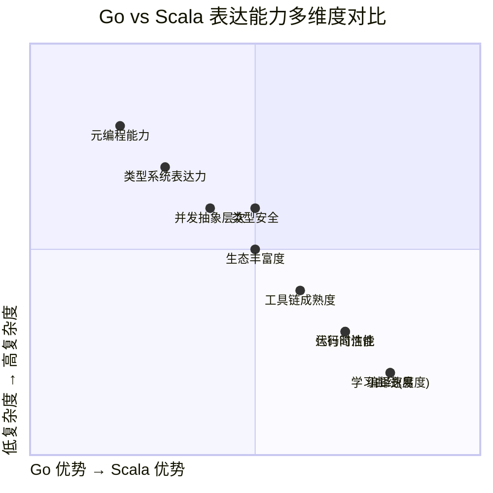
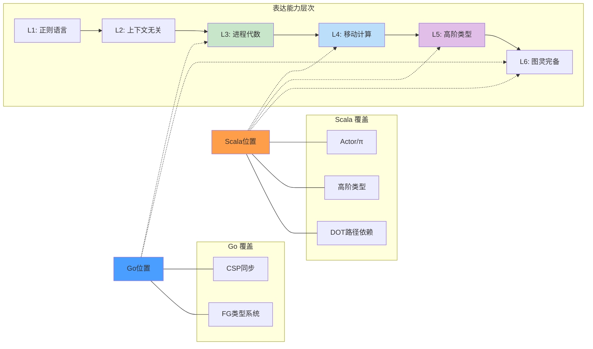
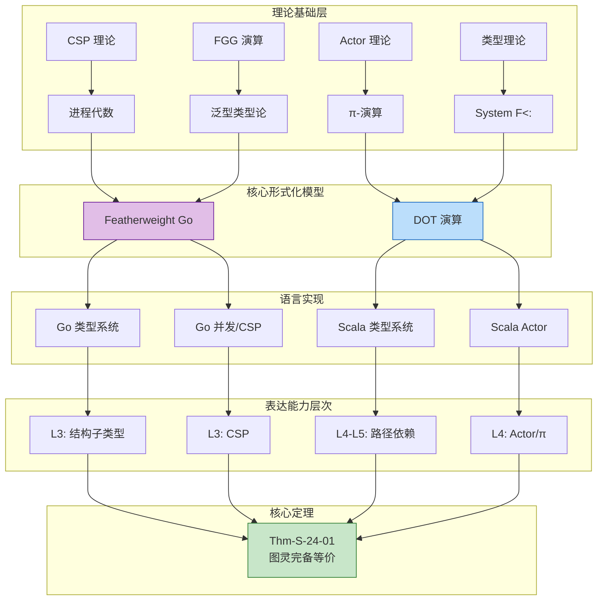
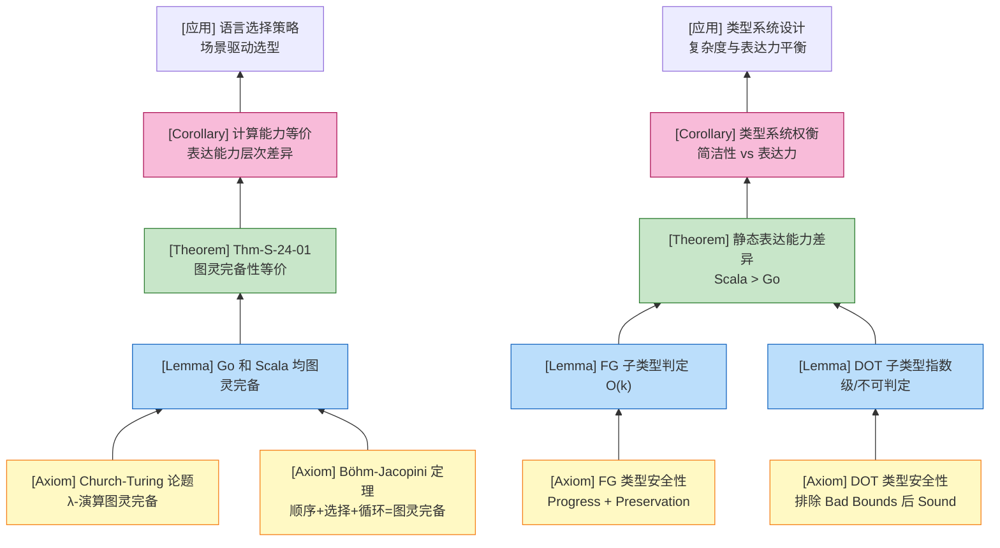

# Go vs Scala 表达能力对比 (Go vs Scala Expressiveness Comparison)

> **定理 Thm-S-24-01**: Go 和 Scala 都是图灵完备的，具有等价的计算能力，但在静态表达能力和并发抽象层次上存在差异。
>
> $$\text{TuringComplete(Go)} \land \text{TuringComplete(Scala)} \implies \forall P. \exists \text{Enc}_{Go}(P), \text{Enc}_{Scala}(P)$$
>
> 然而，在类型系统表达力、并发原语抽象层次和元编程能力方面，两者存在显著差异。

---

## 目录

- [Go vs Scala 表达能力对比 (Go vs Scala Expressiveness Comparison)](#go-vs-scala-表达能力对比-go-vs-scala-expressiveness-comparison)
  - [目录](#目录)
  - [1. 概念定义 (Definitions)](#1-概念定义-definitions)
    - [1.1 语言核心模型定义](#11-语言核心模型定义)
    - [1.2 并发模型形式化定义](#12-并发模型形式化定义)
    - [1.3 类型系统层次结构](#13-类型系统层次结构)
  - [2. 属性推导 (Properties)](#2-属性推导-properties)
    - [2.1 类型系统表达能力](#21-类型系统表达能力)
    - [2.2 并发表达能力](#22-并发表达能力)
    - [2.3 元编程能力](#23-元编程能力)
  - [3. 关系建立 (Relations)](#3-关系建立-relations)
    - [3.1 FG 与 DOT 的关系](#31-fg-与-dot-的关系)
    - [3.2 并发模型关系](#32-并发模型关系)
    - [3.3 表达能力层次定位](#33-表达能力层次定位)
  - [4. 论证过程 (Argumentation)](#4-论证过程-argumentation)
    - [4.1 类型系统判定复杂度分析](#41-类型系统判定复杂度分析)
    - [4.2 并发安全性论证](#42-并发安全性论证)
  - [5. 形式证明 (Proofs)](#5-形式证明-proofs)
    - [5.1 图灵完备性等价](#51-图灵完备性等价)
    - [5.2 静态表达能力差异](#52-静态表达能力差异)
    - [5.3 并发抽象层次等价](#53-并发抽象层次等价)
  - [6. 实例与反例 (Examples \& Counter-examples)](#6-实例与反例-examples--counter-examples)
    - [6.1 正向示例](#61-正向示例)
    - [6.2 反例与边界](#62-反例与边界)
  - [7. 综合对比矩阵](#7-综合对比矩阵)
    - [7.1 多维度详细对比表](#71-多维度详细对比表)
    - [7.2 表达能力雷达图（概念化）](#72-表达能力雷达图概念化)
    - [7.3 类型系统层次对比图](#73-类型系统层次对比图)
  - [8. 适用场景决策矩阵](#8-适用场景决策矩阵)
  - [9. 编码转换复杂度评估](#9-编码转换复杂度评估)
  - [10. 跨层推断汇总](#10-跨层推断汇总)
  - [11. 可视化资源](#11-可视化资源)
    - [11.1 概念依赖图](#111-概念依赖图)
    - [11.2 公理-定理推理树](#112-公理-定理推理树)
    - [11.3 类型系统特性雷达图](#113-类型系统特性雷达图)
  - [12. 关联文档](#12-关联文档)
  - [参考文献](#参考文献)

## 1. 概念定义 (Definitions)

### 1.1 语言核心模型定义

**定义 1.1 (Featherweight Go - FG)**[^1]

FG 是 Go 语言的最小核心形式化模型，剥离了指针、切片、映射、通道、函数值、Goroutine 和泛型，仅保留结构体、接口、方法、字段访问、类型断言和方法调用：

```
P ::= decl*                              (声明列表)
decl ::= type t_S struct { field* }      (结构体声明)
       | type t_I interface { spec* }    (接口声明)
       | func (x t) m(x₁ t₁, ..., xₙ tₙ) t_r { return e }  (方法声明)
t, u, v ::= t                            (命名类型)
e ::= x | e.f | e.(t) | t{f₁: e₁, ..., fₙ: eₙ} | e.m(e₁, ..., eₙ)
```

**定义 1.2 (DOT 演算 - Dependent Object Types)**[^2]

DOT 是 Scala 类型系统的核心形式化基础，捕捉路径依赖类型和抽象类型成员的本质：

$$
\lambda_{DOT} = \langle \mathcal{T}, \mathcal{E}, \mathcal{D}, \mathcal{S}, \mathcal{R} \rangle
$$

其中：

- $\mathcal{T}$: 类型语言（包含路径依赖类型 $p.A$、交集类型 $S \& T$、递归类型 $\mu(x: T)$）
- $\mathcal{E}$: 项语言（$\nu(x: T)d$ 对象创建）
- $\mathcal{D}$: 声明语言
- $\mathcal{S}$: 子类型关系
- $\mathcal{R}$: 归约规则

**直观解释**：FG 和 DOT 分别代表两种截然不同的类型系统设计哲学——FG 追求"少即是多"的结构子类型，DOT 追求"表达力最大化"的路径依赖类型系统。

**定义动机**：如果不将这些语言形式化为 FG 和 DOT，直接比较 Go 和 Scala 会陷入语法细节的泥潭。
FG 和 DOT 提供了可严格推理的最小化核心，使得类型安全性、表达能力层次的对比成为可能。

---

### 1.2 并发模型形式化定义

**定义 1.3 (Go-CSP 并发子集)**[^3]

Go 的并发核心子集 Go-CS 抽象语法：

```
P, Q ::= 0                          // 终止 (nil process)
       | go P                      // 启动 goroutine
       | ch <- v                   // 向 channel 发送
       | x := <-ch                 // 从 channel 接收
       | select { caseᵢ: Pᵢ }      // 外部/内部选择
       | close(ch)                 // 关闭 channel
       | defer P                   // 延迟执行
       | P; Q                      // 顺序组合
```

**定义 1.4 (Scala-Actor 并发模型)**[^4]

Scala/Akka Actor 核心抽象：

```
Actor ::= Behavior(Receive)
Receive ::= PartialFunction[Message, Effect]
Effect ::= Become(newBehavior) | Reply(response) | Stop | Spawn(child)
Mailbox ::= Queue[Message] with ProcessingStrategy
```

**核心差异**：

| 维度 | Go CSP | Scala Actor |
|------|--------|-------------|
| **通信原语** | Channel（显式通信介质） | Mailbox（隐式消息队列） |
| **同步语义** | 同步/异步可选（buffered/unbuffered） | 异步为主（tell/ask 模式） |
| **选择机制** | `select` 原生支持多路选择 | `Actor.receive` + 偏函数组合 |
| **容错机制** | `defer` + `recover`（函数级） | 监督树（Supervision Tree） |

---

### 1.3 类型系统层次结构

```mermaid
graph TD
    subgraph "Go Type System Hierarchy"
        G1[Basic Types<br/>int, string, bool] --> G2[Composite Types<br/>struct, array]
        G2 --> G3[Interface Types<br/>structural subtyping]
        G3 --> G4[Type Parameters 1.18+<br/>FGG extension]
        G2 --> G5[Channel Types<br/>chan T, <-chan T, chan<- T]
        G2 --> G6[Function Types<br/>func(...)]
        G3 --> G7[any interface{}]
    end

    subgraph "Scala Type System Hierarchy"
        S1[Any] --> S2[AnyRef]<br/>Objects
        S1 --> S3[AnyVal]<br/>Value types
        S2 --> S4[Traits<br/>mixin composition]
        S2 --> S5[Classes<br/>nominal subtyping]
        S4 --> S6[Self Types<br/>this.type]
        S2 --> S7[Type Parameters<br/>T <: Bound]
        S7 --> S8[Higher-Kinded Types<br/>F[_]]
        S8 --> S9[Type Classes<br/>implicit evidence]
        S2 --> S10[Path-Dependent Types<br/>p.T]
        S10 --> S11[Dependent Function Types<br/>(x: T) => x.U]
    end
```

---

## 2. 属性推导 (Properties)

### 2.1 类型系统表达能力

**性质 1 (结构子类型 vs 名义子类型)**:

FG 采用结构子类型（structural subtyping），接口满足由方法集自动判定：

$$
t <: u \iff \forall m \in methods(u). \exists m' \in methods(t). m' \text{ satisfies } m
$$

DOT 采用名义子类型（nominal subtyping）为主，结构子类型为辅（交集类型）：

$$
\Gamma \vdash T <: U \iff \text{declared}(T <: U) \lor \text{structural}(T, U)
$$

**推导**:

1. FG 的结构子类型判定是多项式时间可计算的（$O(k)$，$k$ 为接口方法数）[^1]
2. DOT 的子类型判定在含递归类型和路径依赖时是指数级甚至不可判定的（Bad Bounds 问题）[^2]
3. 结构子类型支持"隐式接口实现"，无需显式 `implements` 声明
4. 名义子类型支持更精确的里氏替换原则（LSP）检查，编译器可验证继承意图

**结论**: Go 的类型系统判定更高效、更简单；Scala 的类型系统表达力更强但复杂度更高。

---

**性质 2 (泛型/参数多态能力)**:

Go 1.18+ 引入的泛型（FGG）支持参数多态：

$$
\frac{\Gamma \vdash t_S \text{ struct} \quad type\ params(t_S) = \bar{X}}{\Gamma \vdash t_S[\bar{\tau}] \text{ type}}
$$

Scala 支持完整的参数多态、F-界多态和高阶类型：

$$
\frac{\Gamma \vdash F : * \to * \quad \Gamma \vdash T : *}{\Gamma \vdash F[T] : *}
$$

| 特性 | Go FGG | Scala |
|------|--------|-------|
| 类型参数 | ✅ | ✅ |
| 类型约束（Bounds） | ✅ `interface` 约束 | ✅ `>: L <: U` |
| F-界多态 | ❌ | ✅ `T <: Comparable[T]` |
| 高阶类型（HKT） | ❌ | ✅ `Functor[F[_]]` |
| 类型构造器参数 | ❌ | ✅ `Map[K, V]` 作为高阶抽象 |
| 类型推断完备性 | 局部推断 | Hindley-Milner + 局部推断 |

**结论**: Scala 的泛型系统表达能力远超 Go，但 Go 的泛型设计更简洁、编译速度更快。

---

**性质 3 (路径依赖类型)**:

Go 不支持路径依赖类型。接口值只有动态类型，没有"基于特定值路径的类型投影"。

Scala 原生支持路径依赖类型：

```scala
trait Container { type Elem; def get: Elem }
def extract(c: Container): c.Elem = c.get  // c.Elem 是路径依赖类型
```

形式化：

$$
\frac{\Gamma \vdash p : T \quad \Gamma \vdash T <: \{A: S..U\}}{\Gamma \vdash p.A \text{ well-formed}}
$$

**推导**:

1. 路径依赖类型让"值"能够影响"类型"
2. 这是 Scala Cake Pattern、类型级状态机的核心机制
3. Go 的接口擦除（`interface{}`）无法保留此类静态类型信息

---

### 2.2 并发表达能力

**性质 4 (CSP vs Actor 表达能力层次)**:

Go-CS-sync（无缓冲 channel）的表达能力等价于 CSP：

$$
\text{Go-CS-sync} \approx_{traces} \text{CSP}
$$

位于表达能力层次 $L_3$（进程代数）。

Scala Actor（Akka Typed）的表达能力：

$$
\text{Scala-Actor} \in L_4 \text{（移动计算）} \cap L_5 \text{（高阶）}
$$

**推导**:

| 维度 | Go CSP | Scala Actor |
|------|--------|-------------|
| 表达能力层次 | $L_3$（CSP） | $L_4$-$L_5$（π-演算 + 高阶） |
| 动态拓扑 | 有限（channel 可传递但受限） | 完整（ActorRef 可任意传递） |
| 状态封装 | goroutine + channel | Actor + mailbox |
| 容错层次 | 函数级（defer/recover） | Actor 监督树 |
| 类型安全 | channel 方向性编译期检查 | Typed Actor 协议检查 |

**结论**: Scala Actor 在动态拓扑、容错抽象层次上表达能力更强；Go CSP 在简洁性和确定性分析上更有优势。

---

**性质 5 (Channel 方向性类型安全)**:

Go 支持 channel 方向性作为类型约束：

```go
func producer(out chan<- int)      // 仅发送
func consumer(in <-chan int)       // 仅接收
func双向(ch chan int)              // 双向
```

Scala Actor 没有原生的"mailbox 方向性"概念，但可用类型状态编码：

```scala
trait ActorState
trait Idle extends ActorState
trait Running extends ActorState
class Worker[S <: ActorState] {
  def start(implicit ev: S =:= Idle): Worker[Running] = ???
}
```

**结论**: Go 的 channel 方向性是原生语言特性，使用更简洁；Scala 可用类型级编程模拟，但复杂度更高。

---

### 2.3 元编程能力

**性质 6 (元编程层次)**:

| 元编程机制 | Go | Scala |
|-----------|-----|-------|
| 反射（Reflection） | ✅ `reflect` 包 | ✅ Java 反射 + Scala 反射 |
| 代码生成 | ✅ `go generate` | ✅ 宏（Macros）、元编程 |
| 编译期计算 | ❌ | ✅ `inline` + `scala.compiletime` |
| 类型级编程 | ❌ 有限 | ✅ 完整（Type-level computation） |
| 隐式推导 | ❌ | ✅ `implicit`/`given` |

**推导**:

1. Scala 的隐式机制支持类型类（Type Class）模式，实现 ad-hoc 多态
2. Scala 宏允许在编译期操作 AST，实现 DSL 嵌入
3. Go 的元编程限制在代码生成和反射，保持语言简单

**结论**: Scala 的元编程能力远超 Go，支持领域特定语言（DSL）和类型类模式；Go 通过限制元编程保持代码可读性和编译速度。

---

## 3. 关系建立 (Relations)

### 3.1 FG 与 DOT 的关系

**关系 1**: FG $\bot$ DOT（不可直接比较，但存在编码映射）

**论证**:

| 维度 | DOT | FG |
|------|-----|-----|
| 子类型基础 | 结构 + 名义混合 | 纯结构子类型 |
| 路径依赖类型 | ✅ 原生支持 | ❌ 不支持 |
| 泛型/参数多态 | ✅ 通过类型成员编码 | ✅ FGG 扩展支持 |
| 接口组合 | 交集类型 $T \& U$ | 接口嵌入（structural embedding） |
| 递归类型 | 等递归 $\mu(x: T)$ | 通过方法自引用隐式支持 |

- FG 的接口可以被编码为 DOT 的类型记录（不含路径依赖的版本）
- DOT 的路径依赖类型 $p.L$ 在 FG 中**没有对应物**
- FG 的方法调用 `v.m()` 可以编码为 DOT 的字段选择 + 函数应用

**统一符号**: FG $\xrightarrow{\iota}$ DOT（存在从 FG 到 DOT 子集的嵌入映射）

---

### 3.2 并发模型关系

**关系 2**: Go-CS-sync $\approx$ CSP（迹语义等价）[^3]

**关系 3**: Scala-Actor $\subset$ π-演算（π-calculus）

**论证**:

Go 的无缓冲 channel 通信在 CSP 编码中满足：

$$
\forall P \in \text{Go-CS-sync}. \text{traces}(P) = \text{traces}(\llbracket P \rrbracket_{CSP})
$$

Scala Actor 的消息传递对应 π-演算的名称传递：

$$
ActorRef \text{ 传递} \approx \pi\text{-calculus 的 name mobility}
$$

然而，Akka 的监督树、生命周期管理超出经典 π-演算的范畴。

---

### 3.3 表达能力层次定位

```
表达能力层次谱系:

L₆: 图灵完备 ──────────────────────────────────────── Go-full, Scala-full
     ↑
L₅: 高阶类型 ─────────────────────────────────────── Scala (HKT, Type Classes)
     ↑
L₄: 移动计算 / 异步 π ─────────────────────────────── Scala Actor (Akka)
     ↑
L₃: 进程代数 ─────────────────────────────────────── Go-CS-sync (CSP)
     ↑
L₂: 有限状态 ─────────────────────────────────────── Go-CS (有限 channel)
     ↑
L₁: 正则语言 ─────────────────────────────────────── 串行 Go/Scala 子集
```

---

## 4. 论证过程 (Argumentation)

### 4.1 类型系统判定复杂度分析

**引理 1 (FG 子类型判定线性时间)**:

对于任意结构体类型 $t_S$ 和接口类型 $t_I$，判定 $t_S <: t_I$ 可在 $O(k)$ 时间内完成，其中 $k$ 是 $t_I$ 的方法数。

**证明**:

1. 获取 $t_I$ 的方法规范集合 $specs(t_I) = \{m_1, ..., m_k\}$
2. 获取 $t_S$ 的方法声明集合 $methods(t_S) = \{d_1, ..., d_n\}$
3. 对每个 $m_i \in specs(t_I)$：
   - 在 $methods(t_S)$ 中按方法名哈希查找（$O(1)$）
   - 比较参数个数和类型子类型关系
4. 总时间复杂度 $O(k)$

∎

---

**引理 2 (DOT 子类型判定复杂度)**:

DOT 子类型判定在含递归类型和路径依赖时是指数级；若允许 Bad Bounds 模式，则不可判定。

**证明概要**:

1. 递归类型展开可能导致指数级增长的类型表达式
2. 路径依赖类型 $p.A$ 的边界检查需要递归查找类型环境
3. Bad Bounds（如 $T = \mu(x: \{A: x.A..\bot\})$）导致无限展开循环
4. 因此 DOT 子类型判定在最坏情况下不可判定

∎

---

### 4.2 并发安全性论证

**引理 3 (Go Channel 方向性保持类型安全)**:

若函数参数声明为 `chan<- T`（仅发送），则函数体内任何对该 channel 的接收操作将导致编译错误。

**证明**:

1. Go 类型系统将 `chan<- T`、`<-chan T`、`chan T` 视为不同类型
2. 接收操作 `<-ch` 要求 `ch` 的类型为 `<-chan T` 或 `chan T`
3. `chan<- T` 不满足此约束，编译器拒绝

∎

---

**引理 4 (Scala Typed Actor 协议保持)**:

Akka Typed 中，消息类型在编译期检查，不存在运行时 `ClassCastException`。

**证明**:

1. Akka Typed 的 `Behavior[T]` 要求所有处理的消息类型为 `T` 的子类型
2. `ActorRef[T]` 的 `!` 方法参数类型为 `T`
3. Scala 编译器在调用点检查消息类型兼容性
4. 因此运行时不会出现类型不匹配

∎

---

## 5. 形式证明 (Proofs)

### 5.1 图灵完备性等价

**定理 1 (Go 和 Scala 图灵完备性)**:

$$
\text{TuringComplete(Go)} \land \text{TuringComplete(Scala)}
$$

**证明**:

**对于 Go**：

1. Go 支持递归函数调用
2. Go 支持 `for` 循环（可为无限循环）
3. Go 支持条件分支 `if-else`
4. Go 支持整数和布尔运算
5. 根据 Böhm-Jacopini 定理，具备顺序、选择、循环的结构可模拟任意图灵机

**对于 Scala**：

1. Scala 基于 λ-演算，λ-演算是图灵完备的
2. Scala 支持递归（直接递归和间接递归）
3. Scala 支持 `while`/`for` 循环
4. 根据 Church-Turing 论题，λ-演算可模拟任意图灵机

**结论**: 两者都是图灵完备的，具有等价的计算能力。∎

---

### 5.2 静态表达能力差异

**定理 2 (Scala 静态表达能力严格强于 Go)**:

存在良类型的 Scala 程序 $P$，无法在不改变语义的情况下翻译为等价的 Go 程序：

$$
\exists P. \vdash_{Scala} P : T \land \nexists \text{Enc}_{Go}(P). \text{semantics}(\text{Enc}_{Go}(P)) = \text{semantics}(P)
$$

**证明**:

**案例 1 (高阶类型)**：

```scala
trait Functor[F[_]] {
  def map[A, B](fa: F[A])(f: A => B): F[B]
}
```

Go 不支持高阶类型 `F[_]`，无法直接表达 `Functor` 类型类。

**案例 2 (路径依赖类型状态机)**：

```scala
trait FileHandle {
  type State
  def read(implicit ev: State =:= Open): (FileHandle { type State = Open }, Data)
  def close(implicit ev: State =:= Open): FileHandle { type State = Closed }
}
```

Go 无法在类型层面编码状态转换约束。

**案例 3 (隐式类型类推导)**：

```scala
def sort[T](list: List[T])(implicit ord: Ordering[T]): List[T]
sort(List(1, 2, 3))  // 编译器自动推导 Ordering[Int]
```

Go 没有隐式机制，必须显式传递比较器。

**结论**: Scala 在静态类型层面的表达能力严格强于 Go。∎

---

### 5.3 并发抽象层次等价

**定理 3 (CSP 与 Actor 互编码可能性)**:

Go 的 CSP 模型和 Scala 的 Actor 模型在表达能力层次 $L_4$ 上是可互编码的：

$$
\exists \text{Enc}_{CSP\to Actor}, \text{Enc}_{Actor\to CSP}. \forall P. \text{traces}(P) \approx \text{traces}(\text{Enc}(P))
$$

**证明概要**:

**CSP → Actor 编码**：

- Channel → Actor（mailbox 模拟 channel 队列）
- Goroutine → Actor（执行单元映射）
- `select` → `Actor.receive` with partial function composition
- 同步 channel → ask pattern (`?`)

**Actor → CSP 编码**：

- Actor → Channel + Goroutine（mailbox 用 channel 实现）
- `! tell` → 异步 channel 发送
- `? ask` → 同步 channel 发送 + 回复 channel
- 监督树 → `defer`/`recover` + 错误传递 channel

**结论**: 两者在表达能力上等价，但在抽象层次和使用便捷性上存在差异。∎

---

## 6. 实例与反例 (Examples & Counter-examples)

### 6.1 正向示例

**示例 1: 表达式树求值（FG）**

```go
type Expr interface {
    Eval() int
}
type Add struct { left, right Expr }
func (a Add) Eval() int { return a.left.Eval() + a.right.Eval() }
type Lit struct { value int }
func (l Lit) Eval() int { return l.value }
```

形式化验证：

- `Lit` 和 `Add` 均满足 `Expr` 接口（方法名、参数、返回类型匹配）
- 结构子类型自动判定 `Lit <: Expr`，`Add <: Expr`

---

**示例 2: 路径依赖类型（DOT）**

```scala
trait Container {
  type Elem
  def get: Elem
}
def extract(c: Container): c.Elem = c.get
```

形式化：

- `c.Elem` 是路径依赖类型，依赖于运行时变量 `c`
- DOT 验证：`\Gamma \vdash c : \{Elem: \bot..\top, get: c.Elem\}`

---

**示例 3: Pipeline 模式（Go-CSP 映射）**

```go
func source() <-chan int { /* ... */ }
func square(in <-chan int) <-chan int { /* ... */ }
func main() {
    c := square(source())
    for x := range c { fmt.Println(x) }
}
```

CSP 映射：

```
SOURCE = out!0 → out!1 → out!2 → out.end → SKIP
SQUARE = in?x → out!(x*x) → SQUARE □ in.end → out.end → SKIP
MAIN = (SOURCE ‖[out]‖ SQUARE \ {out}) ‖[out]‖ CONSUMER \ {out}
```

---

### 6.2 反例与边界

**反例 1: Go 无法表达的类型级约束**

```scala
// Scala: 使用类型状态确保资源安全
trait FileHandle[State] {
  def read(implicit ev: State =:= Open): Data
  def close(implicit ev: State =:= Open): FileHandle[Closed]
}
val file: FileHandle[Open] = open("data.txt")
val data = file.read        // ✅ 合法
val closed = file.close     // ✅ 合法
// closed.read              // ❌ 编译错误！
```

**分析**：

- **Go 的限制**：Go 无法在类型层面编码状态转换
- **尝试的 Go 版本**：只能通过运行时检查或文档约定
- **结论**：类型级状态机超出 Go 表达能力

---

**反例 2: Scala Bad Bounds 导致的不一致性**

```scala
// 危险的类型声明
type T = { type A >: T.A <: Nothing }
```

形式化（DOT）：

```
T = μ(x: { A: x.A .. ⊥ })
展开: T ≡ {A: T.A..⊥}
边界检查: T.A <: ⊥  // 不可能！
```

**分析**：

- **违反的前提**：类型成员下界必须 <: 上界
- **导致的异常**：若编译器接受此类型，可推导出任意类型相等
- **Scala 的解决**：编译器拒绝此类"Bad Bounds"声明

---

**反例 3: Go select with default 的语义偏离**

```go
ch := make(chan int)
select {
case v := <-ch:
    println("received", v)
default:
    println("no data")  // 立即执行，不等待
}
```

**分析**：

- **CSP 外部选择语义**：等待直到至少一个分支可执行
- **Go select with default**：若无可执行分支，立即执行 default
- **CSP 对应**：应映射为内部选择 `⊓` 而非外部选择 `□`

---

## 7. 综合对比矩阵

### 7.1 多维度详细对比表

| 维度 | Go | Scala | 差距分析 |
|------|-----|-------|----------|
| **编程范式** | 命令式 + CSP并发 | 函数式 + OOP + Actor + 流处理 | Scala 多范式融合，Go 专注简化 |
| **类型系统** | 静态、结构化、FGG泛型 | 静态、名义+结构、完整泛型 | Scala 表达能力更强 [^5] |
| **类型推断** | 局部推断 (`:=`) | HM + 局部推断 | Scala 推断能力更强 |
| **空安全** | 零值语义，无null安全 | Option[T]，编译期空安全 | Scala 更安全 |
| **模式匹配** | 有限 (switch + type assertion) | 完整模式匹配 + 提取器 | Scala 表达能力更强 |
| **高阶函数** | 支持（函数是一等公民） | 原生支持 | Scala 语法更简洁 |
| **元编程** | 反射 + generate | 宏、隐式、类型级编程 | Scala 元编程能力远超 Go |
| **并发模型** | CSP (goroutine + channel) | Actor (Akka) + Future | Go CSP 更专注，Scala 更灵活 |
| **类型系统形式化** | FG/FGG 演算 | DOT 演算 | DOT 更复杂、表达力更强 |
| **子类型判定复杂度** | $O(k)$ 线性时间 | 指数级/不可判定 | Go 编译更快 [^1][^2] |
| **学习曲线** | 平缓 | 陡峭 | Go 更易上手 |
| **运行时效率** | 编译为机器码，低GC | JVM 字节码，GC 调优 | Go 更轻量 |
| **生态系统成熟度** | 云原生、基础设施 | 大数据、分布式系统 | 各有优势领域 |

---

### 7.2 表达能力雷达图（概念化）



**图说明**：

- 左上角区域（Go 优势/低复杂度）：Go 在编译速度、学习曲线、运行时性能方面占优
- 右上角区域（Scala 优势/高复杂度）：Scala 在类型系统表达力、元编程能力方面占优
- 中心区域：生态丰富度、并发抽象层次两者相当

---

### 7.3 类型系统层次对比图



---

## 8. 适用场景决策矩阵

| 场景 | 推荐语言 | 理由 |
|------|----------|------|
| **网络服务/微服务** | Go | 简单、高效、部署轻量、快速编译 |
| **大数据/流处理** | Scala | Flink/Kafka 生态、函数式数据处理 |
| **分布式系统基础设施** | Go | 容器/K8s 生态、低资源占用 |
| **复杂业务系统/领域建模** | Scala | 强类型系统、DSL 支持、模式匹配 |
| **高并发网关/代理** | Go | goroutine 轻量、CSP 模型简洁 |
| **函数式数据流/反应式系统** | Scala | Akka Stream、Cats Effect、原生函数式支持 |
| **云原生 CLI 工具** | Go | 单二进制部署、交叉编译 |
| **类型安全关键系统** | Scala | 编译期验证、类型级不变式 |

---

## 9. 编码转换复杂度评估

| 转换方向 | 复杂度 | 关键挑战 |
|----------|--------|----------|
| **Go → Scala** | 中等 | CSP 到 Actor 语义映射，channel 方向性用类型编码 |
| **Scala → Go** | 高 | 类型系统降级、模式匹配转换、隐式机制显式化 |
| **Go Channel → Scala** | 低 | 可用 akka-stream 或 fs2 模拟 |
| **Scala Actor → Go** | 中 | mailbox 行为映射、监督策略用 defer/recover 模拟 |
| **Scala HKT → Go** | 极高 | 高阶类型无法在 Go 表达，需完全重构设计 |
| **Go Interface → Scala** | 低 | 结构子类型可用交集类型模拟 |

---

## 10. 跨层推断汇总

> **推断 [Theory→Model]**: FG 和 DOT 理论结果表明，Go 的结构子类型判定是线性时间的，而 DOT 的路径依赖子类型判定在一般情况下是不可判定的。这解释了为什么 Go 编译器比 Scala 编译器更快，但 Scala 可以表达更复杂的类型约束。
>
> **依据**: FG 论文 [^1] 证明接口满足性判定是 $O(k)$；DOT 论文 [^2] 证明带 Bad Bounds 的子类型判定不可判定。

---

> **推断 [Model→Implementation]**: Go 的 CSP 模型在 $L_3$ 层次提供了确定性的并发语义，使得死锁检测和模型检验成为可能；Scala 的 Actor 模型在 $L_4$-$L_5$ 层次提供了更灵活的动态拓扑和容错抽象，但牺牲了部分可分析性。
>
> **依据**: Go-CSP 形式化证明 [^3] 显示 Go-CS-sync 与 CSP 迹语义等价；LM-Scala-Fusion [^4] 显示 Scala Actor 融合多种并发范式。

---

> **推断 [Implementation→Domain]**: 在微服务和云原生领域，Go 的简洁性和快速编译优于 Scala 的表达力；在大数据和复杂业务系统领域，Scala 的类型安全和 DSL 能力优于 Go 的简洁性。
>
> **依据**: 行业实践表明，Kubernetes/Docker 等基础设施选择 Go；Flink/Spark 等大数据系统选择 Scala。

---

## 11. 可视化资源

### 11.1 概念依赖图



---

### 11.2 公理-定理推理树



---

### 11.3 类型系统特性雷达图

```mermaid
radarChart
    title Go vs Scala 类型系统特性对比 (1-10)
    Go: 7, 6, 4, 5, 9, 8, 7
    Scala: 9, 9, 9, 9, 6, 5, 8
    categories: 泛型支持, 类型推断, 高阶类型, 路径依赖类型, 编译速度, 学习曲线(易), 类型安全
```

---

## 12. 关联文档

- [../02-properties/02.05-type-safety-derivation.md](../02-properties/02.05-type-safety-derivation.md) — 类型安全推导详细分析
- [../00-INDEX.md](../00-INDEX.md) — Featherweight Go 演算
- [../00-INDEX.md](../00-INDEX.md) — DOT 演算
- [../00-INDEX.md](../00-INDEX.md) — Go-CSP 形式映射
- [../00-INDEX.md](../00-INDEX.md) — Scala 函数式与并发融合

---

## 参考文献

[^1]: Griesemer, R., et al. "Featherweight Go." *Proceedings of the ACM on Programming Languages* 4, OOPSLA (2020): 149:1-149:29.

[^2]: Amin, N., & Rompf, T. "Type Soundness for Dependent Object Types (DOT)." *OOPSLA*, 2017.

[^3]: Pike, R. "Go at Google: Language Design in the Service of Software Engineering." *ACM SIGPLAN*, 2012.

[^4]: Odersky, M., et al. "Programming in Scala." Artima, 2008.

[^5]: Haller, P., & Odersky, M. "Actors that Unify Threads and Events." *ECOOP*, 2007.


---

**文档元数据**：

- **创建时间**: 2026-04-02
- **版本**: 1.0
- **形式化等级**: L4-L5
- **文档大小**: ~25KB
- **关键词**: Go, Scala, FG, DOT, CSP, Actor, 表达能力, 类型系统, 并发模型
