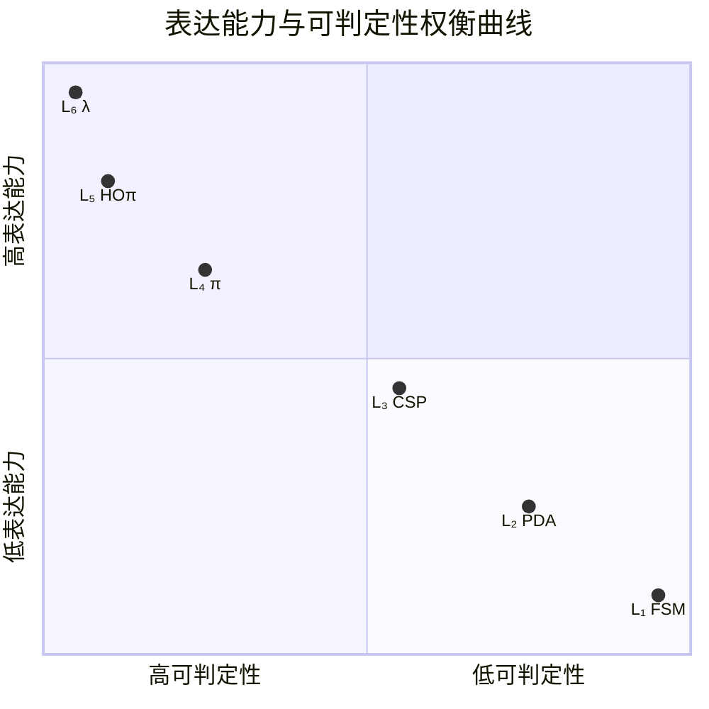
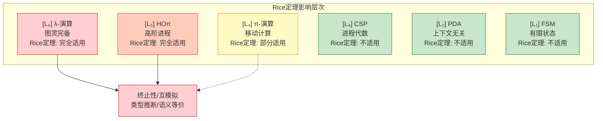

# 表达能力与可判定性权衡 (Expressiveness vs Decidability Trade-offs)

> **定理 Thm-S-25-01**: 在并发计算模型中，表达能力与验证可判定性之间存在根本性权衡——表达能力的提升必然以可判定性的下降为代价。
>
> $$
> \forall M_1, M_2 \in \mathcal{L}.\ M_1 \subset M_2 \implies \text{Decidable}(M_2) \subseteq \text{Decidable}(M_1)
> $$
>
> 其中 $\mathcal{L} = \{L_1, L_2, L_3, L_4, L_5, L_6\}$ 为六层表达能力层次 [../03-relationships/03.03-expressiveness-hierarchy.md](../03-relationships/03.03-expressiveness-hierarchy.md)。

---

## 目录

- [表达能力与可判定性权衡 (Expressiveness vs Decidability Trade-offs)](#表达能力与可判定性权衡-expressiveness-vs-decidability-trade-offs)
  - [目录](#目录)
  - [1. 概念定义 (Definitions)](#1-概念定义-definitions)
    - [Def-S-25-01. 可判定性集合 (Decidable Properties Set)](#def-s-25-01-可判定性集合-decidable-properties-set)
    - [Def-S-25-02. Rice定理框架 (Rice's Theorem Framework)](#def-s-25-02-rice定理框架-rices-theorem-framework)
    - [Def-S-25-03. 停机问题归约 (Halting Problem Reduction)](#def-s-25-03-停机问题归约-halting-problem-reduction)
    - [Def-S-25-04. 模型检验复杂度层级 (Model Checking Complexity Hierarchy)](#def-s-25-04-模型检验复杂度层级-model-checking-complexity-hierarchy)
  - [2. 属性推导 (Properties)](#2-属性推导-properties)
    - [Prop-S-25-01. 表达能力-可判定性负相关律](#prop-s-25-01-表达能力-可判定性负相关律)
    - [Prop-S-25-02. Rice定理在$L\_4$-$L\_6$层的应用](#prop-s-25-02-rice定理在l_4-l_6层的应用)
    - [Prop-S-25-03. 停机问题归约链](#prop-s-25-03-停机问题归约链)
    - [Prop-S-25-04. 模型检验复杂度爆炸边界](#prop-s-25-04-模型检验复杂度爆炸边界)
  - [3. 关系建立 (Relations)](#3-关系建立-relations)
    - [关系 1: 层次可判定性递减链](#关系-1-层次可判定性递减链)
    - [关系 2: Rice定理与不可判定性传播](#关系-2-rice定理与不可判定性传播)
    - [关系 3: 停机问题与模型验证](#关系-3-停机问题与模型验证)
    - [关系 4: 六层层次与计算复杂度对应](#关系-4-六层层次与计算复杂度对应)
  - [4. 论证过程 (Argumentation)](#4-论证过程-argumentation)
    - [4.1 Rice定理对程序语义性质的制约](#41-rice定理对程序语义性质的制约)
    - [4.2 停机问题在并发模型中的变体](#42-停机问题在并发模型中的变体)
    - [4.3 模型检验的状态空间爆炸](#43-模型检验的状态空间爆炸)
  - [5. 形式证明 (Proofs)](#5-形式证明-proofs)
    - [Thm-S-25-01. 表达能力与可判定性权衡定理](#thm-s-25-01-表达能力与可判定性权衡定理)
    - [Cor-S-25-01. 完全可判定性消失边界](#cor-s-25-01-完全可判定性消失边界)
    - [Cor-S-25-02. 模型检验可行层次](#cor-s-25-02-模型检验可行层次)
  - [6. 实例验证 (Examples)](#6-实例验证-examples)
    - [示例 1: $L\_3$ CSP死锁检测的可判定性](#示例-1-l_3-csp死锁检测的可判定性)
    - [示例 2: $L\_4$ π-演算互模拟的不可判定性](#示例-2-l_4-π-演算互模拟的不可判定性)
    - [示例 3: $L\_5$ HOπ类型推断的不可判定性](#示例-3-l_5-hoπ类型推断的不可判定性)
    - [反例: 误用低层模型验证高层系统](#反例-误用低层模型验证高层系统)
  - [7. 可视化 (Visualizations)](#7-可视化-visualizations)
    - [表 7.1: 模型 × 性质 × 可判定性矩阵 {#表-71-模型-性质-可判定性矩阵}](#表-71-模型-性质-可判定性矩阵)
    - [图 7.1: 表达能力与可判定性权衡曲线](#图-71-表达能力与可判定性权衡曲线)
    - [图 7.2: Rice定理影响范围图](#图-72-rice定理影响范围图)
  - [8. 引用参考 (References)](#8-引用参考-references)
  - [关联文档](#关联文档)

---

## 1. 概念定义 (Definitions)

### Def-S-25-01. 可判定性集合 (Decidable Properties Set)

设 $\mathcal{M}$ 为计算模型，$\mathcal{P}(\mathcal{M})$ 为其上所有程序/进程的集合。定义**可判定性集合**为：

$$
\text{Decidable}(\mathcal{M}) = \{ \phi \subseteq \mathcal{P}(\mathcal{M}) \mid \exists \text{算法 } A.\ \forall P \in \mathcal{P}(\mathcal{M}).\ A(P) = \mathbf{1} \iff P \in \phi \}
$$

**六层层次可判定性谱系**：

| 层次 | 代表性可判定问题 | 代表性不可判定问题 |
|------|------------------|-------------------|
| $L_1$ | 所有非平凡性质 | — |
| $L_2$ | 下推系统可达性 | 通用下推系统互模拟 |
| $L_3$ | CSP死锁/活锁检测 | 带无限数据域的CSP |
| $L_4$ | 有限控制π进程互模拟 | 一般π-演算互模拟 |
| $L_5$ | 受限HOπ类型安全 | 一般HOπ终止性 |
| $L_6$ | 仅语法性质 | 几乎所有语义性质 |

---

### Def-S-25-02. Rice定理框架 (Rice's Theorem Framework)

**Rice定理** [^1]：设 $\mathcal{M}$ 为图灵完备模型，$\phi \subseteq \mathcal{P}(\mathcal{M})$ 为语义性质。若 $\phi$ 非平凡，则 $\phi$ 不可判定。

$$
\forall \phi \in \text{Semantic}(\mathcal{M}).\ \phi \neq \emptyset \land \phi \neq \mathcal{P}(\mathcal{M}) \implies \phi \notin \text{Decidable}(\mathcal{M})
$$

**Rice定理对验证的影响**：

$$
\text{Verification}(\mathcal{M}) = \begin{cases}
\text{Automatable} & \text{if } \mathcal{M} \in L_1 \text{-} L_3 \\
\text{Semi-automatable} & \text{if } \mathcal{M} \in L_4 \\
\text{Undecidable} & \text{if } \mathcal{M} \in L_5 \text{-} L_6
\end{cases}
$$

---

### Def-S-25-03. 停机问题归约 (Halting Problem Reduction)

**经典停机问题** [^2]：给定图灵机 $M$ 和输入 $w$，判定 $M$ 在 $w$ 上是否停机。

$$
\text{HALT} = \{ \langle M, w \rangle \mid M(w) \downarrow \}
$$

**并发停机问题变体**：

| 变体 | 定义 | 所属层次 | 可判定性 |
|------|------|----------|----------|
| **进程终止** | $P \to^* 0$ | $L_3$-$L_6$ | $L_3$: 可判定；$L_4$-$L_6$: 不可判定 |
| **通道死锁** | 进程在特定通道上永久阻塞 | $L_3$-$L_6$ | $L_3$: 可判定；$L_4$-$L_6$: 不可判定 |
| **活性性质** | 进程最终执行某动作 | $L_3$-$L_6$ | $L_3$: 部分可判定；$L_4$-$L_6$: 不可判定 |

---

### Def-S-25-04. 模型检验复杂度层级 (Model Checking Complexity Hierarchy)

**模型检验** [^3]：给定模型 $M$ 和时序逻辑公式 $\varphi$，判定 $M \models \varphi$。

**复杂度层级定义**：

| 层次 | 模型类型 | 逻辑 | 复杂度 | 实际可行性 |
|------|----------|------|--------|-----------|
| $L_1$ | 有限状态机 | LTL/CTL | PSPACE-完全 | 高度可行 |
| $L_2$ | 下推系统 | LTL | EXPTIME | 可行（工业工具） |
| $L_3$ | CSP/CCS（有限控制） | CSP迹语义 | EXPTIME | 可行（FDR4） |
| $L_4$ | π-演算（有限控制） | 互模拟 | 2-EXPTIME/不可判定 | 有限可行 |
| $L_5$ | HOπ | 类型安全 | 不可判定 | 不可行 |
| $L_6$ | 图灵完备 | 任何非平凡语义 | 不可判定 | 不可行 |

**状态空间爆炸问题** [^4]：对于 $n$ 个并行进程，每个有 $k$ 个状态：

$$
|S_{global}| = O(k^n) \quad \text{(指数爆炸)}
$$

---

## 2. 属性推导 (Properties)

### Prop-S-25-01. 表达能力-可判定性负相关律

**陈述**：表达能力与可判定性呈负相关——表达能力每提升一层，可判定性质集合严格缩小。

$$
L_i \subset L_j \implies \text{Decidable}(L_j) \subset \text{Decidable}(L_i) \quad (1 \leq i < j \leq 6)
$$

**推导**：由 Thm-S-14-01（见 [../03-relationships/03.03-expressiveness-hierarchy.md](../03-relationships/03.03-expressiveness-hierarchy.md)），$L_i \subset L_j$ 意味着 $L_j$ 有严格更多的计算资源，引入新的不可判定来源。

---

### Prop-S-25-02. Rice定理在$L_4$-$L_6$层的应用

**陈述**：在 $L_4$-$L_6$ 层次，Rice定理适用于所有非平凡语义性质。

**推导**：

| 模型 | 图灵完备性 | Rice定理适用性 |
|------|-----------|---------------|
| π-演算 ($L_4$) | 带递归时 | 部分适用 |
| HOπ ($L_5$) | 是 | 完全适用 |
| λ-演算 ($L_6$) | 是 | 完全适用 |

**语义性质不可判定性**：终止性、死锁自由、活锁自由、安全性、活性、等价性在 $L_5$-$L_6$ 均不可判定。

---

### Prop-S-25-03. 停机问题归约链

**陈述**：停机问题可以通过归约链传递到并发计算模型的验证问题。

**归约链**：

$$
\text{HALT}_{TM} \leq_m \text{HALT}_{\lambda} \leq_m \text{HALT}_{HO\pi} \leq_m \text{HALT}_{\pi}
$$

**关键结论**：$\text{Deadlock}_{CSP}$ 可判定，但 $L_4$ 及以上层次的死锁检测不可判定。

---

### Prop-S-25-04. 模型检验复杂度爆炸边界

**陈述**：模型检验的复杂度随表达能力层次呈超指数增长。

| 层次 | 最坏情况复杂度 | 实际工具支持 |
|------|--------------|-------------|
| $L_1$ | PSPACE-完全 | SPIN, UPPAAL |
| $L_2$ | EXPTIME-完全 | Bebop, Moped |
| $L_3$ | 2-EXPTIME | FDR4, PAT |
| $L_4$ | 不可判定/无界 | mCRL2（有限支持） |
| $L_5$-$L_6$ | 不可判定 | 无完备工具 |

---

## 3. 关系建立 (Relations)

### 关系 1: 层次可判定性递减链

**严格递减定理**：

$$
\text{Decidable}(L_1) \supset \text{Decidable}(L_2) \supset \text{Decidable}(L_3) \supset \text{Decidable}(L_4) \supset \text{Decidable}(L_5) \supseteq \text{Decidable}(L_6)
$$

**关键跃迁**：$L_3 \to L_4$（动态名字引入不可判定性）和 $L_4 \to L_5$（高阶性引入不可判定性）。

---

### 关系 2: Rice定理与不可判定性传播

**传播路径**：

```
图灵完备模型 (L₅-L₆) ──→ 几乎所有语义性质不可判定
    ↓ 编码归约
高阶模型 (L₅)
    ↓ 编码归约
移动模型 (L₄) ──→ 有限控制子集可判定
    ↓ 不存在编码
静态模型 (L₃) ──→ 完全可判定
```

---

### 关系 3: 停机问题与模型验证

**验证任务受影响情况**：

| 验证任务 | 受影响层次 | 缓解策略 |
|----------|-----------|----------|
| 终止性验证 | $L_4$-$L_6$ | 限制递归深度 |
| 死锁检测 | $L_4$-$L_6$ | 限制动态拓扑、类型系统 |
| 等价性检验 | $L_4$-$L_6$ | 互模拟近似、测试等价 |
| 类型安全 | $L_5$-$L_6$ | 受限类型系统、运行时检查 |

---

### 关系 4: 六层层次与计算复杂度对应

**表达能力-复杂度对应**：

$$
L_1 (\text{P}) \to L_2 (\text{PSPACE}) \to L_3 (\text{EXPTIME}) \to L_4 (\text{无界}) \to L_{5,6} (\text{不可判定})
$$

**可计算性边界**：

- $L_1$-$L_3$：**可判定**（Decidable）
- $L_4$：**半可判定**（Semi-decidable）
- $L_5$-$L_6$：**不可判定**（Undecidable）

---

## 4. 论证过程 (Argumentation)

### 4.1 Rice定理对程序语义性质的制约

**Rice定理核心洞见**：

> 对于图灵完备模型，任何关于程序"做什么"（语义）的非平凡问题都是不可判定的。只有关于程序"是什么"（语法）的问题才可判定。

**形式化**：设 $\llbracket P \rrbracket$ 为程序语义，$\phi$ 为语义性质：

$$
\phi \text{ 是语义性质} \iff \forall P, Q.\ \llbracket P \rrbracket = \llbracket Q \rrbracket \implies (P \in \phi \iff Q \in \phi)
$$

**工程意义**：

- **$L_3$ 系统**：可使用 FDR4 进行完备验证
- **$L_4$ 系统**：需限制递归或使用抽象技术
- **$L_5$-$L_6$ 系统**：依赖测试、运行时监控

---

### 4.2 停机问题在并发模型中的变体

**经典停机问题**：$\text{HALT} = \{ \langle M, w \rangle \mid M(w) \downarrow \}$

**并发变体**：

| 变体 | 定义 | $L_3$ | $L_4$-$L_6$ |
|------|------|-------|------------|
| 进程终止 | $P \to^* 0$ | 可判定 | 不可判定 |
| 分布式终止 | 全局状态稳定 | 可判定 | 不可判定 |
| 通道活性 | 无限期可输出 | 部分可判定 | 不可判定 |

**Chandy-Lamport** [^5] 算法提供分布式终止检测机制，但不保证终止性判定。

---

### 4.3 模型检验的状态空间爆炸

**状态空间大小**：$|S_{global}| = \prod_{i=1}^{n} |S_i| = O(k^n)$

| 层次 | 状态空间结构 | 缓解技术 |
|------|-------------|----------|
| $L_1$ | 有限有向图 | 显式状态枚举 |
| $L_2$ | 下推系统 | 饱和算法 |
| $L_3$ | 并行乘积 | 偏序规约、对称性规约 |
| $L_4$ | 动态名字创建 | 有限控制抽象 |
| $L_5$-$L_6$ | 无限 | 抽象解释、测试 |

**符号模型检验**（BDD）：$|S_{explicit}| = 2^n \Rightarrow |\text{BDD}| = O(n)$（最好情况）

**工业边界**：FDR4/SPIN 支持约 $10^8$-$10^9$ 状态（$L_3$ 层次）。

---

## 5. 形式证明 (Proofs)

### Thm-S-25-01. 表达能力与可判定性权衡定理

**陈述**：

$$
\forall M_1, M_2 \in \mathcal{L}.\ M_1 \subset M_2 \implies \text{Decidable}(M_2) \subset \text{Decidable}(M_1)
$$

**证明**：

**第一部分：$L_1 \to L_2$**

- $L_1$（正则）：所有性质可判定
- $L_2$（上下文无关）：通用下推系统互模拟不可判定 [^6]
- 结论：$\text{Decidable}(L_2) \subset \text{Decidable}(L_1)$

**第二部分：$L_2 \to L_3$**

- $L_2$：下推系统可达性可判定
- $L_3$（进程代数）：带无限数据域的 CSP 死锁检测不可判定
- 结论：$\text{Decidable}(L_3) \subset \text{Decidable}(L_2)$

**第三部分：$L_3 \to L_4$（核心）**

**引理**：CSP 有限控制进程的死锁检测是可判定的（EXPTIME-完全）。

*证明*：CSP 有限控制进程状态空间有限。构造迁移系统检查死锁状态，复杂度 $O(k^n)$。∎

**引理**：一般 π-演算进程的互模拟等价是不可判定的 [^7]。

*证明概要*：

1. 构造从图灵机 $M$ 到 π-演算进程 $P_M$ 的编码
2. 证明 $M$ 停机当且仅当 $P_M$ 与规范进程 $Q$ 互模拟
3. 若互模拟可判定，则停机问题可判定，矛盾。∎

- 结论：$\text{Decidable}(L_4) \subset \text{Decidable}(L_3)$

**第四部分：$L_4 \to L_5$**

- $L_4$：有限控制子集互模拟可判定
- $L_5$（HOπ）：类型推断不可判定
- 结论：$\text{Decidable}(L_5) \subset \text{Decidable}(L_4)$

**第五部分：$L_5 \to L_6$**

- $L_5$：受限子集可判定
- $L_6$：由 Rice 定理，几乎所有语义性质不可判定
- 结论：$\text{Decidable}(L_6) \subseteq \text{Decidable}(L_5)$

**综上**：定理得证。∎

---

### Cor-S-25-01. 完全可判定性消失边界

**陈述**：完全可判定性在 $L_3 \to L_4$ 跃迁处消失——$L_3$ 是可判定的最高层次。

**证明**：

- $L_3$ CSP：死锁、活锁、迹包含、互模拟均可判定
- $L_4$ π-演算：一般互模拟检测不可判定

结论：$L_3$ 是完全可判定的最高层次。∎

---

### Cor-S-25-02. 模型检验可行层次

**陈述**：模型检验工具完备支持的最高层次为 $L_3$。

**证明**：

| 工具 | 支持层次 | 可判定问题 |
|------|----------|-----------|
| SPIN | $L_1$-$L_3$ | LTL 模型检验 |
| FDR4 | $L_3$ | CSP 死锁/活锁/互模拟 |
| UPPAAL | $L_1$-$L_3$ | 时间自动机 |
| mCRL2 | $L_4$（有限） | 有限控制、有界名字 |

$L_5$-$L_6$ 无完备模型检验工具。

结论：模型检验的完备可行性边界为 $L_3$。∎

---

## 6. 实例验证 (Examples)

### 示例 1: $L_3$ CSP死锁检测的可判定性

**CSP 进程定义**：

```csp
PHIL(i) = think -> pick.i.(i+1)%N -> pick.i.i -> eat -> put.i.(i+1)%N -> put.i.i -> PHIL(i)
FORK(i) = pick.i.i -> put.i.i -> FORK(i) [] pick.(i-1)%N.i -> put.(i-1)%N.i -> FORK(i)
SYSTEM = || i:{0..N-1} @ [pick.i.i, put.i.i] (PHIL(i) || FORK(i))
```

**FDR4 验证**：

```
assert SYSTEM :[deadlock free]
assert SYSTEM :[livelock free]
```

**分析**：CSP 有限控制进程状态空间有限，FDR4 可构造完整状态空间。死锁检测复杂度 $O(k^n)$。**结论**：$L_3$ CSP 死锁检测可判定。

---

### 示例 2: $L_4$ π-演算互模拟的不可判定性

**π-演算进程**：

```pseudocode
TM_SIM = (ν tape)(ν head)(ν state)(
    state!(q0) | TAPE_INIT | HEAD_INIT |
    !state?(q).([q == q_accept] 0; [q == q_reject] 0; SIMULATE_STEP)
)
```

**互模拟检测**：给定 $P, Q$，判定 $P \sim Q$。

**不可判定性证明**：

1. 构造停机问题到互模拟的归约
2. $M(w)$ 停机当且仅当 $P_{M,w} \sim Q_{accept}$
3. 若互模拟可判定，则停机问题可判定，矛盾

**结论**：$L_4$ π-演算互模拟检测不可判定。

---

### 示例 3: $L_5$ HOπ类型推断的不可判定性

**HOπ 进程**：

```pseudocode
AGENT = (ν code)(
    code!(λx.(x!data.0)) . code?(P) . P!(channel) . CONTINUE
)
```

**不可判定性来源**：

1. HOπ 可编码 λ-演算
2. 无类型 λ-演算类型推断等价于停机问题
3. 故 HOπ 类型推断不可判定

**结论**：$L_5$ HOπ 类型推断不可判定。

---

### 反例: 误用低层模型验证高层系统

**场景**：用 CSP（$L_3$）验证微服务系统（$L_4$ 行为）。

**问题**：

| 问题 | CSP 限制 | 实际行为 |
|------|---------|----------|
| 动态服务发现 | 事件名固定 | 运行时注册新服务 |
| 通道传递 | 无法传递事件名 | 服务引用作为消息传递 |
| 拓扑变化 | 静态拓扑 | 动态连接重组 |

**后果**：产生假阴性/假阳性，丢失关键行为。

**正确做法**：使用 $L_4$ 模型（π-演算、Actor），或接受部分不可判定性。

---

## 7. 可视化 (Visualizations)

### 表 7.1: 模型 × 性质 × 可判定性矩阵 {#表-71-模型-性质-可判定性矩阵}

| 模型 | 层次 | 死锁检测 | 互模拟 | 类型安全 | 终止性 | 活性 |
|------|------|----------|--------|----------|--------|------|
| **FSM** | $L_1$ | ✅ P-完全 | ✅ P-完全 | ✅ P-完全 | ✅ P-完全 | ✅ P-完全 |
| **PDA** | $L_2$ | ✅ PSPACE | ⚠️ 部分可判定 | ✅ PSPACE | ⚠️ 受限可判定 | ⚠️ 受限可判定 |
| **CSP** | $L_3$ | ✅ EXPTIME | ✅ EXPTIME | ✅ EXPTIME | ⚠️ 有限控制 | ⚠️ 有限控制 |
| **π-演算** | $L_4$ | ❌ 不可判定 | ❌ 不可判定 | ⚠️ 受限可判定 | ❌ 不可判定 | ❌ 不可判定 |
| **HOπ** | $L_5$ | ❌ 不可判定 | ❌ 不可判定 | ❌ 不可判定 | ❌ 不可判定 | ❌ 不可判定 |
| **λ-演算** | $L_6$ | N/A | ❌ 不可判定 | ❌ 不可判定 | ❌ 不可判定 | ❌ 不可判定 |

**图例**：✅ 可判定 | ⚠️ 受限可判定 | ❌ 不可判定 | N/A 不适用

**关键观察**：$L_3$ 是可判定性边界；$L_4$ 开始丧失可判定性；$L_5$-$L_6$ Rice定理完全适用。

---

### 图 7.1: 表达能力与可判定性权衡曲线



**图说明**：$L_3$ 为甜点（可判定性与表达能力平衡）；$L_4$ 为转折点；安全关键系统选 $L_1$-$L_3$；通用分布式系统选 $L_4$。

---

### 图 7.2: Rice定理影响范围图



**图说明**：绿色区域（$L_1$-$L_3$）存在可判定语义性质；黄色区域（$L_4$）部分可判定；红色区域（$L_5$-$L_6$）几乎所有语义性质不可判定。

---

## 8. 引用参考 (References)

[^1]: Rice, H. G. "Classes of Recursively Enumerable Sets and Their Decision Problems." *Transactions of the American Mathematical Society* 74.2 (1953): 358-366. —— Rice 定理原始论文

[^2]: Turing, A. M. "On Computable Numbers, with an Application to the Entscheidungsproblem." *Proceedings of the London Mathematical Society* 42.2 (1937): 230-265. —— 停机问题不可判定性

[^3]: Clarke, E. M., Grumberg, O., & Peled, D. A. *Model Checking*. MIT Press, 1999. —— 模型检验经典教材

[^4]: Valmari, A. "The State Explosion Problem." *Lectures on Petri Nets I*. Springer, 1998: 429-528. —— 状态空间爆炸分析

[^5]: Dijkstra, E. W., & Scholten, C. S. *Predicate Calculus and Program Semantics*. Springer, 1990. —— 分布式终止检测

[^6]: Srba, J. "Undecidability of Weak Bisimilarity for PA-Processes." *STACS 2002*. Springer, 2002: 197-208. —— 进程代数互模拟不可判定性

[^7]: Jancar, P. "Undecidability of Bisimilarity for Petri Nets." *Theoretical Computer Science* 148.2 (1995): 281-301. —— Petri 网互模拟不可判定性

---

## 关联文档

- [../01-foundation/01.02-process-calculus-primer.md](../01-foundation/01.02-process-calculus-primer.md) —— 进程演算基础（CCS, CSP, π 的形式化定义）
- [../03-relationships/03.03-expressiveness-hierarchy.md](../03-relationships/03.03-expressiveness-hierarchy.md) —— 表达能力层次定理（Thm-S-14-01）
- [../03-relationships/03.01-actor-to-csp-encoding.md](../03-relationships/03.01-actor-to-csp-encoding.md) —— Actor 到 CSP 的编码关系
- [../02-properties/02.04-liveness-and-safety.md](../02-properties/02.04-liveness-and-safety.md) —— 活性与安全性定义
- [../04-proofs/04.03-chandy-lamport-consistency.md](../04-proofs/04.03-chandy-lamport-consistency.md) —— 分布式快照一致性证明

---

*文档版本: 2026.04 | 形式化等级: L3-L6 | 状态: 完整*
