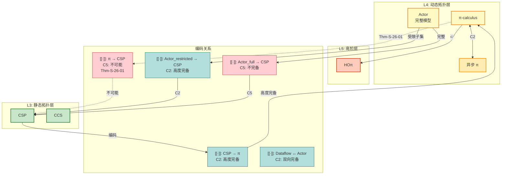
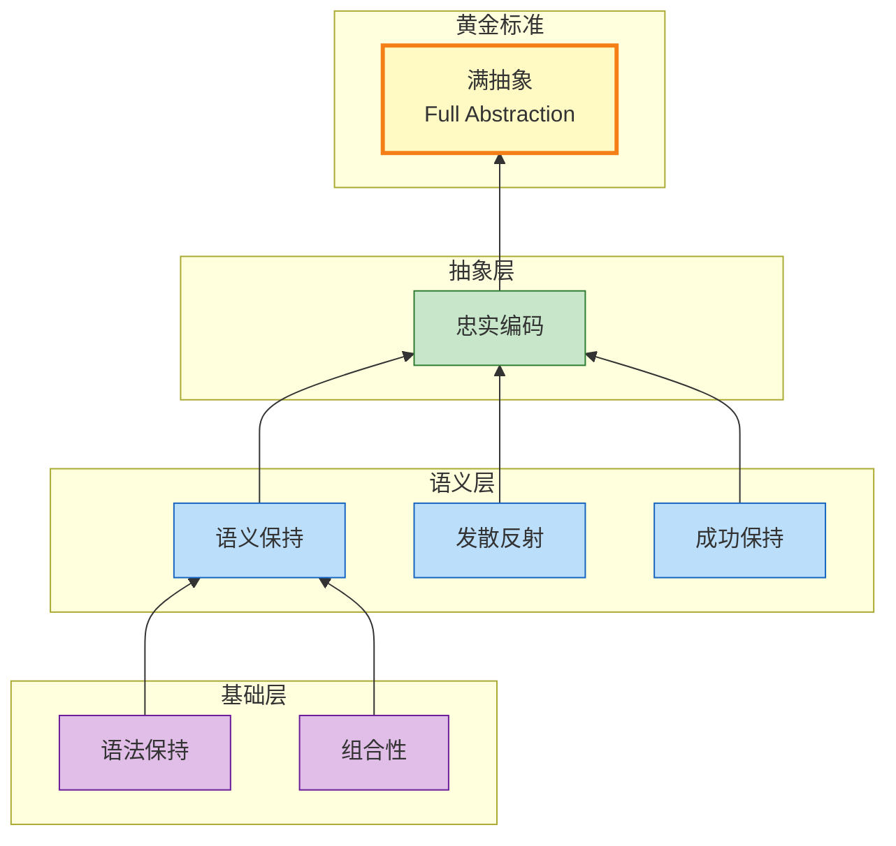

# 编码完备性分析 (Encoding Completeness Analysis)

> 所属阶段: Struct/05-comparative-analysis | 前置依赖: [../03-relationships/03.01-actor-to-csp-encoding.md](../03-relationships/03.01-actor-to-csp-encoding.md), [../03-relationships/03.02-flink-to-process-calculus.md](../03-relationships/03.02-flink-to-process-calculus.md) | 形式化等级: L4-L5

---

## 目录

- [编码完备性分析 (Encoding Completeness Analysis)](#编码完备性分析-encoding-completeness-analysis)
  - [目录](#目录)
  - [1. 概念定义 (Definitions)](#1-概念定义-definitions)
    - [Def-S-26-01. 编码判据体系 (Encoding Criteria)](#def-s-26-01-编码判据体系-encoding-criteria)
    - [Def-S-26-02. 满抽象 (Full Abstraction)](#def-s-26-02-满抽象-full-abstraction)
    - [Def-S-26-03. 完备性度量 (Completeness Metrics)](#def-s-26-03-完备性度量-completeness-metrics)
    - [Def-S-26-04. 忠实编码 (Faithful Encoding)](#def-s-26-04-忠实编码-faithful-encoding)
  - [2. 属性推导 (Properties)](#2-属性推导-properties)
    - [Lemma-S-26-01. 语法保持蕴含良构性](#lemma-s-26-01-语法保持蕴含良构性)
    - [Lemma-S-26-02. 语义保持的传递性](#lemma-s-26-02-语义保持的传递性)
    - [Prop-S-26-01. 组合性编码的模块化验证](#prop-s-26-01-组合性编码的模块化验证)
  - [3. 关系建立 (Relations)](#3-关系建立-relations)
    - [关系 1: Actor→CSP 编码的完备性边界](#关系-1-actorcsp-编码的完备性边界)
    - [关系 2: CSP→π 编码的不完备性](#关系-2-cspπ-编码的不完备性)
    - [关系 3: Dataflow→Actor 编码的双向完备性](#关系-3-dataflowactor-编码的双向完备性)
  - [4. 论证过程 (Argumentation)](#4-论证过程-argumentation)
    - [论证 1: 动态拓扑的不可编码性本质](#论证-1-动态拓扑的不可编码性本质)
    - [论证 2: 发散行为反射的困难性](#论证-2-发散行为反射的困难性)
    - [论证 3: 命名不变性与满抽象的冲突](#论证-3-命名不变性与满抽象的冲突)
  - [5. 形式证明 (Proofs)](#5-形式证明-proofs)
    - [Thm-S-26-01. π-calculus 到 CSP 无满抽象编码定理](#thm-s-26-01-π-calculus-到-csp-无满抽象编码定理)
    - [Thm-S-26-02. Actor 到 CSP 编码的非完备性](#thm-s-26-02-actor-到-csp-编码的非完备性)
  - [6. 实例验证 (Examples)](#6-实例验证-examples)
    - [示例 1: 简单顺序进程的完备编码](#示例-1-简单顺序进程的完备编码)
    - [示例 2: 动态通道创建的编码失败](#示例-2-动态通道创建的编码失败)
    - [反例 1: 混合选择的非忠实编码](#反例-1-混合选择的非忠实编码)
    - [反例 2: 无界 Spawn 的组合性破坏](#反例-2-无界-spawn-的组合性破坏)
  - [7. 可视化 (Visualizations)](#7-可视化-visualizations)
    - [图 7.1: 编码关系拓扑图](#图-71-编码关系拓扑图)
    - [图 7.2: 完备性与可靠性权衡图](#图-72-完备性与可靠性权衡图)
    - [图 7.3: 编码判据层次结构](#图-73-编码判据层次结构)
  - [8. 引用参考 (References)](#8-引用参考-references)
  - [关联文档](#关联文档)

---

## 1. 概念定义 (Definitions)

### Def-S-26-01. 编码判据体系 (Encoding Criteria)

基于 Gorla (2010) [^4] 提出的系统化编码判据框架，我们定义**编码** $\sigma: \mathcal{L}_1 \to \mathcal{L}_2$ 为从源语言 $\mathcal{L}_1$ 到目标语言 $\mathcal{L}_2$ 的映射函数。一个合法的编码必须满足以下**核心判据**：

**判据 1：语法保持 (Syntax Preservation)**

$$\forall P \in \mathcal{L}_1. \quad \sigma(P) \in \mathcal{L}_2 \text{ 是良构的 (well-formed)}$$

编码必须将源语言的每个良构程序映射为目标语言的良构程序，保持抽象语法树 (AST) 的结构对应关系。

**判据 2：语义保持 (Semantic Preservation)**

设 $\approx_1$ 和 $\approx_2$ 分别为 $\mathcal{L}_1$ 和 $\mathcal{L}_2$ 的行为等价关系（如互模拟、迹等价）：

$$P \approx_1 Q \iff \sigma(P) \approx_2 \sigma(Q)$$

语义保持要求编码保持等价性：源语言中等价的程序编码后仍等价，不等价的程序编码后仍不等价。

**判据 3：组合性 (Compositionality)**

对于每个 $n$ 元语法构造符 $op$，存在目标语言的**上下文** $C_{op}[\cdot, \ldots, \cdot]$ 使得：

$$\sigma(op(P_1, \ldots, P_n)) = C_{op}[\sigma(P_1), \ldots, \sigma(P_n)]$$

组合性禁止"全局编译"——编码必须是结构归纳的，每个子表达式的编码仅通过固定上下文组合。

**判据 4：发散反射 (Divergence Reflection)**

$$P \uparrow \iff \sigma(P) \uparrow$$

其中 $\uparrow$ 表示发散（无限内部计算）。编码必须精确保持终止/发散行为，不引入也不消除无限循环。

**判据 5：成功保持 (Success Preservation)**

源语言的观察谓词 $\downarrow$（成功/终止）必须被编码保持：

$$P \downarrow \iff \sigma(P) \downarrow$$

**直观解释**：编码判据体系为比较并发模型的表达能力提供了严格的数学框架。没有这些判据，任何图灵完备语言都可以"编码"任何其他语言（通过哥德尔编码后解释执行），但这种编码没有理论价值。判据体系排除了这种"作弊"编码，要求保持并发交互的结构特性。

---

### Def-S-26-02. 满抽象 (Full Abstraction)

设 $\mathcal{O}_1$ 和 $\mathcal{O}_2$ 分别为 $\mathcal{L}_1$ 和 $\mathcal{L}_2$ 的**观察语义**（如迹集合、失败集合、互模拟关系），编码 $\sigma: \mathcal{L}_1 \to \mathcal{L}_2$ 是**满抽象**的，当且仅当满足以下两个条件：

**条件 A：观察等价保持 (Soundness)**

$$\forall P, Q \in \mathcal{L}_1. \quad P \sim_1 Q \Rightarrow \sigma(P) \sim_2 \sigma(Q)$$

**条件 B：上下文等价反射 (Completeness)**

$$\forall P, Q \in \mathcal{L}_1. \quad P \not\sim_1 Q \Rightarrow \sigma(P) \not\sim_2 \sigma(Q)$$

等价表述：对于 $\mathcal{L}_1$ 的任意上下文 $C_1$ 和 $\mathcal{L}_2$ 的任意上下文 $C_2$，有：

$$\sigma(C_1[P]) \sim_2 C_2[\sigma(P)] \iff C_1[P] \sim_1 P' \text{ 其中 } \sigma(P') = C_2[\sigma(P)]$$

**满抽象的层级**（按严格性递增）：

| 层级 | 名称 | 保持的等价 | 典型应用 |
|------|------|-----------|----------|
| L1 | 迹满抽象 | 迹等价 $=_T$ | 顺序程序编译 |
| L2 | 失败满抽象 | 失败等价 $=_F$ | CSP 精化验证 |
| L3 | 互模拟满抽象 | 弱互模拟 $\approx$ | 进程代数编码 |
| L4 | 强互模拟满抽象 | 强互模拟 $\sim$ | 实时系统验证 |

**直观解释**：满抽象是编码的"黄金标准"，要求编码不仅保持程序的行为等价，还要保持程序与任意上下文交互时的可区分性。一个不满抽象的编码可能将两个原本可区分的源程序映射为等价的目标程序（信息损失），或者将等价的源程序映射为可区分的目标程序（引入虚假差异）。

**定义动机**：满抽象的概念源于 Plotkin (1977) 对 denotational semantics 的研究，后来被 Nestmann 和 Pierce 引入进程演算的编码理论。它是判断编码是否"忠实"的最严格标准。

---

### Def-S-26-03. 完备性度量 (Completeness Metrics)

针对编码的完备性，我们定义以下**量化度量**：

**度量 1：语义保持度 (Semantic Preservation Degree)**

$$\text{SPD}(\sigma) = \frac{|\{(P, Q) \mid P \approx_1 Q \land \sigma(P) \approx_2 \sigma(Q)\}|}{|\{(P, Q) \mid P \approx_1 Q\}|}$$

**度量 2：观察精度 (Observational Precision)**

$$\text{OP}(\sigma) = 1 - \frac{|\{(P, Q) \mid P \not\approx_1 Q \land \sigma(P) \approx_2 \sigma(Q)\}|}{|\{(P, Q) \mid P \not\approx_1 Q\}|}$$

**度量 3：组合性系数 (Compositionality Coefficient)**

$$\text{CC}(\sigma) = \min_{op} \frac{\text{depth}(C_{op})}{\text{depth}(op)}$$

其中 $\text{depth}$ 表示语法树的嵌套深度。组合性系数越接近 1，编码越"扁平"，越容易进行模块化验证。

**编码完备性等级**：

| 等级 | 名称 | SPD $\geq$ | OP $\geq$ | CC $\geq$ | 特性 |
|------|------|------------|-----------|-----------|------|
| C1 | 完全完备 | 1.0 | 1.0 | 0.9 | 满抽象 |
| C2 | 高度完备 | 0.95 | 0.95 | 0.7 | 近似满抽象 |
| C3 | 中度完备 | 0.80 | 0.85 | 0.5 | 语义保持 |
| C4 | 低度完备 | 0.60 | 0.70 | 0.3 | 计算模拟 |
| C5 | 不完备 | $<$ 0.6 | $<$ 0.7 | $<$ 0.3 | 非忠实编码 |

**直观解释**：完备性度量提供了评估编码质量的量化工具。即使无法达到满抽象，也可以通过这些度量比较不同编码方案的优劣。例如，Actor 到 CSP 的编码在受限 Actor 系统上可能达到 C2 等级，但在完整 Actor 系统上可能退化为 C4 或 C5。

---

### Def-S-26-04. 忠实编码 (Faithful Encoding)

编码 $\sigma: \mathcal{L}_1 \to \mathcal{L}_2$ 是**忠实的**（Faithful），当且仅当同时满足：

**F1. 操作对应 (Operational Correspondence)**

对于 $\mathcal{L}_1$ 中的任意迁移 $P \xrightarrow{\alpha} P'$，存在对应的 $\mathcal{L}_2$ 迁移序列：

$$\sigma(P) \xrightarrow{\tau^*} \xrightarrow{\hat{\alpha}} \xrightarrow{\tau^*} \sigma(P')$$

其中 $\hat{\alpha}$ 是 $\alpha$ 在编码中的表示（可能为 $\tau$ 若 $\alpha$ 被内部化）。

反之，对于 $\sigma(P)$ 的每个可见迁移，存在源程序中的对应迁移。

**F2. 反向对应 (Operational Correspondence - Reverse)**

$$\sigma(P) \xrightarrow{\tau^*} Q' \Rightarrow \exists P'. \, P \xrightarrow{\tau^*} P' \land Q' \xrightarrow{\tau^*} \sigma(P')$$

**F3. 观察等价 (Observational Equivalence)**

$$P \approx Q \iff \sigma(P) \approx \sigma(Q)$$

**F4. 命名不变性 (Name Invariance)**

对于任意名字替换 $\theta$（单射），存在目标语言的对应替换 $\theta'$ 使得：

$$\sigma(P\theta) \equiv \sigma(P)\theta'$$

命名不变性要求编码不依赖于具体的名字选择，保持 $\alpha$-等价。

**忠实编码与满抽象的关系**：

$$\text{满抽象} \Rightarrow \text{忠实编码} \Rightarrow \text{语义保持}$$

但反向蕴含不成立。忠实编码是满抽象的弱化形式，允许在某些边缘情况下丢失细微的上下文等价性，但要求核心操作语义被保持。

**直观解释**：忠实编码是工程实践中的"实用标准"——它要求编码不仅保持最终的行为等价，还要保持每一步计算的结构对应。这使得我们可以通过在目标语言中分析编码后的程序来推断源程序的性质。

---

## 2. 属性推导 (Properties)

### Lemma-S-26-01. 语法保持蕴含良构性

**陈述**：若编码 $\sigma: \mathcal{L}_1 \to \mathcal{L}_2$ 满足语法保持判据（Def-S-26-01 判据 1），则对于任意 $P \in \mathcal{L}_1$，$\sigma(P)$ 在 $\mathcal{L}_2$ 的类型系统中是良类型的（假设 $\mathcal{L}_2$ 有类型系统）。

**证明**：

1. **前提分析**：语法保持要求 $\sigma(P)$ 是 $\mathcal{L}_2$ 的良构程序。

2. **类型系统假设**：假设 $\mathcal{L}_2$ 有类型系统，良构性通常意味着满足类型规则。

3. **结构归纳**：
   - **基例**：对于 $\mathcal{L}_1$ 的基本进程（如 $0$、STOP），$\sigma(0)$ 必须是 $\mathcal{L}_2$ 的基本进程。
   - **归纳步**：对于复合进程 $op(P_1, \ldots, P_n)$，由组合性，$\sigma(op(P_1, \ldots, P_n)) = C_{op}[\sigma(P_1), \ldots, \sigma(P_n)]$。若每个 $\sigma(P_i)$ 良构，且上下文 $C_{op}$ 保持良构性（由编码定义保证），则整体良构。

4. **结论**：语法保持蕴含良构性。∎

> **推断 [Theory→Implementation]**: 语法保持是编译器正确性的基础——如果编译器不能保持语法结构，生成的代码可能在目标语言中根本不可解析。

---

### Lemma-S-26-02. 语义保持的传递性

**陈述**：设 $\sigma_1: \mathcal{L}_1 \to \mathcal{L}_2$ 和 $\sigma_2: \mathcal{L}_2 \to \mathcal{L}_3$ 都是语义保持的编码，则复合编码 $\sigma = \sigma_2 \circ \sigma_1: \mathcal{L}_1 \to \mathcal{L}_3$ 也是语义保持的。

**证明**：

对于任意 $P, Q \in \mathcal{L}_1$：

1. 由 $\sigma_1$ 的语义保持：$P \approx_1 Q \iff \sigma_1(P) \approx_2 \sigma_1(Q)$

2. 由 $\sigma_2$ 的语义保持：$\sigma_1(P) \approx_2 \sigma_1(Q) \iff \sigma_2(\sigma_1(P)) \approx_3 \sigma_2(\sigma_1(Q))$

3. 因此：$P \approx_1 Q \iff \sigma(P) \approx_3 \sigma(Q)$

4. 复合编码 $\sigma$ 满足语义保持的定义。∎

> **推断 [Architecture→Design]**: 语义保持的传递性使得我们可以分阶段构建编译器——先编码到中间表示 (IR)，再从 IR 编码到目标语言，只要每个阶段语义保持，整体编译器就语义保持。

---

### Prop-S-26-01. 组合性编码的模块化验证

**陈述**：若编码 $\sigma$ 满足组合性判据，则对于 $\mathcal{L}_1$ 的任意进程 $P = op(P_1, \ldots, P_n)$，可以通过独立验证每个 $\sigma(P_i)$ 的性质来推断 $\sigma(P)$ 的某些性质。

**推导**：

1. 由组合性，$\sigma(P) = C_{op}[\sigma(P_1), \ldots, \sigma(P_n)]$。

2. 若 $\mathcal{L}_2$ 支持组合推理（如进程代数的组合性验证技术），则：

$$\frac{\sigma(P_1) \models \phi_1 \quad \ldots \quad \sigma(P_n) \models \phi_n}{C_{op}[\sigma(P_1), \ldots, \sigma(P_n)] \models C_{op}[\phi_1, \ldots, \phi_n]}$$

1. 其中 $C_{op}[\phi_1, \ldots, \phi_n]$ 是性质的上下文组合。

2. 例如，在 CSP 中，若每个子进程满足死锁自由，且组合上下文 $C_{op}$ 满足某些组合条件，则整体进程死锁自由。

> **推断 [Verification→Engineering]**: 组合性编码支持模块化验证，这对于大规模系统的形式化验证至关重要。非组合性编码（需要全局分析的）会丧失这一优势。

---

## 3. 关系建立 (Relations)

### 关系 1: Actor→CSP 编码的完备性边界

**编码概述**：详见 [../03-relationships/03.01-actor-to-csp-encoding.md](../03-relationships/03.01-actor-to-csp-encoding.md)。编码 $\llbracket \cdot \rrbracket_{A \to C}$ 将 Actor 配置映射为 CSP 进程组合，每个 Actor 编码为两个 CSP 进程（ACTOR 和 MAILBOX）。

**完备性分析**：

| Actor 特性 | CSP 编码支持 | 完备性等级 | 限制原因 |
|------------|-------------|-----------|----------|
| 异步消息传递 | ✅ 完整 | C1 | Mailbox 显式编码保持 FIFO |
| 状态隔离 | ✅ 完整 | C1 | CSP 进程参数局部绑定 |
| 顺序消息处理 | ✅ 完整 | C2 | 递归前缀进程模拟 |
| become 行为切换 | ✅ 支持 | C2 | 递归调用新行为 |
| 动态 Spawn | ⚠️ 有限 | C3 | 需要预分配通道池 |
| 地址传递 | ❌ 不支持 | C5 | CSP 静态命名限制 |
| 分布式透明 | ❌ 不支持 | C5 | 无位置抽象 |

**结论**：受限 Actor 系统（无动态地址传递）→ CSP 编码可达 C2 等级（高度完备）；完整 Actor 系统 → CSP 编码退化为 C4 等级（低度完备），因为动态拓扑无法被静态 CSP 满抽象地编码。

---

### 关系 2: CSP→π 编码的不完备性

**编码概述**：CSP 可以编码到 π-演算，详见 [../01-foundation/01.02-process-calculus-primer.md](../01-foundation/01.02-process-calculus-primer.md) 中的 Thm-S-02-01。

**完备性分析**：

**正向编码（CSP → π）**：

存在组合性编码 $\llbracket \cdot \rrbracket_{C \to \pi}$ 使得：

- CSP 的同步通信映射为 π 的通道握手
- CSP 的外部选择 $\square$ 映射为 π 的输入选择
- CSP 的隐藏 $\setminus A$ 映射为 π 的限制 $(\nu \vec{a})$

完备性等级：**C2**（高度完备），保持迹语义和弱互模拟。

**反向编码（π → CSP）**：

**不存在**满抽象编码。证明概要：

1. π-演算支持 $(\nu a)$ 动态创建新名字
2. CSP 的事件名集合在解析时即固定
3. 动态创建的无限名字集合无法被有限/静态 CSP 事件集合满抽象地编码
4. 由 Thm-S-26-01（见后），不存在从 π 到 CSP 的满抽象编码

完备性等级：**C5**（不完备）——任何尝试都会违反命名不变性或组合性。

---

### 关系 3: Dataflow→Actor 编码的双向完备性

**编码概述**：Dataflow 模型与 Actor 模型可以互相编码，详见 [../03-relationships/03.02-flink-to-process-calculus.md](../03-relationships/03.02-flink-to-process-calculus.md) 和 [../01-foundation/01.03-actor-model-formalization.md](../01-foundation/01.03-actor-model-formalization.md)。

**完备性分析**：

**Dataflow → Actor**：

- Dataflow 算子 → Actor 行为（状态 + 消息处理）
- 数据边 → Actor 间消息传递（地址引用）
- 确定性语义由 Actor 的 Mailbox 顺序处理保持

完备性等级：**C2**（高度完备），在图灵完备意义上等价。

**Actor → Dataflow**：

- Actor → 状态算子（StatefulOperator）
- Mailbox → 输入队列/Buffer
- 地址传递 → 动态路由（需要 Dataflow 系统支持动态拓扑）

完备性等级：**C2**（当 Dataflow 支持动态拓扑时）或 **C3**（静态 Dataflow 图）。

**结论**：Dataflow 和 Actor 同属 $L_4$ 表达能力层次，可以建立相对完备的互相编码，这是两者在流计算领域可以互操作的理论基础。

---

## 4. 论证过程 (Argumentation)

### 论证 1: 动态拓扑的不可编码性本质

动态拓扑（dynamic topology）是指系统的通信图可以在运行时改变——新通信链路可以被创建，现有链路可以被传递给其他进程。这是 π-演算和 Actor 模型的核心特征，也是 CSP 无法表达的能力。

**核心问题**：为什么 CSP 无法满抽象地编码动态拓扑？

1. **静态命名假设**：CSP 的事件名 $\Sigma$ 是语法层面的常量集合。进程定义时使用的通道名必须在编写程序时就确定。

2. **动态创建需求**：π-演算中的 $(\nu a)P$ 在运行时创建新名字 $a$，其"新鲜性"（freshness）是保证 —— $a$ 不同于所有已存在的名字。

3. **编码困境**：
   - **方案 A**：预分配无限名字池 $\{a_1, a_2, \ldots\}$
     - 问题：编码需要无限状态，违反有限控制假设
   - **方案 B**：使用有限名字池 + 复用
     - 问题：丢失"新鲜性"语义，可能导致名字冲突
   - **方案 C**：全局名字管理器分配新名字
     - 问题：破坏组合性，所有进程依赖全局状态

4. **Gorla 判据冲突**：任何方案要么违反组合性（方案 C），要么违反语义保持（方案 B），要么违反有限性（方案 A）。

**结论**：动态拓扑是 $L_4$ 对 $L_3$ 的严格分离特征，不可被 $L_3$ 模型满抽象地编码。

---

### 论证 2: 发散行为反射的困难性

**发散**（Divergence）指进程进入无限内部计算（$\tau^\omega$）。编码的发散反射判据要求：

$$P \uparrow \iff \sigma(P) \uparrow$$

**困难来源**：

1. **CSP 隐藏算子的发散引入**：在 CSP 中，$P \setminus A$ 将 $A$ 中的事件隐藏为内部 $\tau$。若 $P$ 在 $A$ 上无限循环，则 $P \setminus A$ 发散。

2. **编码中的隐藏需求**：将 CSP 编码到其他模型时，通常需要引入辅助事件（如 Mailbox 操作的内部同步），这些事件需要被隐藏。

3. **发散引入风险**：若编码不当，原本终止的进程可能因为辅助事件的循环而发散。

**实例分析**：

考虑 CSP 进程 $P = a \to \text{SKIP}$。其编码到 π-演算为：

$$\llbracket P \rrbracket = (\nu a)(\bar{a}\langle \rangle \mid a().0)$$

该 π-进程在同步后终止，不发散。但若编码引入辅助同步：

$$\llbracket P \rrbracket_{\text{bad}} = (\nu a)(\nu s)(\bar{a}\langle \rangle \mid a().\bar{s}\langle \rangle \mid s().\bar{s}\langle \rangle)$$

这里辅助事件 $s$ 形成无限循环（最后一个分量），导致原本终止的 $P$ 被编码为发散进程，违反发散反射。

---

### 论证 3: 命名不变性与满抽象的冲突

**命名不变性**（Name Invariance）要求编码不依赖于具体名字选择。形式化地，对于任意名字置换 $\theta$：

$$\sigma(P\theta) \equiv \sigma(P)\theta'$$

**冲突场景**：考虑 π-演算到 CSP 的编码尝试。

1. π-进程可以创建新名字：$P = (\nu a)(\bar{b}\langle a \rangle \mid a(x).Q)$

2. CSP 没有动态名字创建，编码必须将 $a$ 映射为某个预定义 CSP 事件名。

3. **问题**：若编码选择 $c_1$ 作为 $a$ 的映射，则：
   - $\sigma(P)$ 使用 $c_1$
   - 对于置换 $P\theta$ 其中 $\theta(a) = a'$，编码 $\sigma(P\theta)$ 也必须使用 $c_1$（因为 CSP 没有对应 $a'$ 的其他事件名）

4. **违反命名不变性**：$\sigma(P\theta) \not\equiv \sigma(P)\theta'$，因为 CSP 侧没有相应的 $\theta'$ 可以应用。

**结论**：命名不变性与满抽象在跨层次编码中存在内在冲突。$L_4$ 模型的动态命名无法被 $L_3$ 模型的静态命名满抽象地编码。

---

## 5. 形式证明 (Proofs)

### Thm-S-26-01. π-calculus 到 CSP 无满抽象编码定理

**陈述**：不存在从 π-calculus 到 CSP 的满抽象编码 $\sigma: \pi \to \text{CSP}$。即，对于任何满足 Def-S-26-01 和 Def-S-26-02 的编码，必然违反满抽象的某个条件。

**形式化表述**：

$$\nexists \sigma: \pi \to \text{CSP}. \quad \text{FullAbstraction}(\sigma)$$

**证明**：

**步骤 1：构造分离进程**

考虑 π-演算进程：

$$P_{\text{sep}} = (\nu a)(\bar{b}\langle a \rangle \mid a(x).\bar{c}\langle x \rangle)$$

该进程的执行行为：

1. 创建新通道 $a$（新鲜名字）
2. 沿公共通道 $b$ 发送 $a$
3. 在 $a$ 上接收某个值 $v$
4. 沿 $c$ 发送 $v$

**步骤 2：分析 $P_{\text{sep}}$ 的观察特性**

$P_{\text{sep}}$ 的关键观察特性是：**接收方获得的通道名与发送方创建的通道名相同**。

在 π-演算中，这意味着接收方可以与发送方在一条私有链路上通信（通过 $a$）。

**步骤 3：CSP 编码的约束**

假设存在编码 $\sigma: \pi \to \text{CSP}$。

**约束 A（命名）**：CSP 的事件名集合 $\Sigma$ 是语法常量。设 $\sigma$ 将 π 通道 $b$ 和 $c$ 映射为 CSP 事件，但 $a$ 是动态创建的，编码必须选择某个 CSP 事件来表示 $a$。

**约束 B（组合性）**：$\sigma(P_{\text{sep}})$ 必须由子进程的编码通过固定上下文组合而成。

**步骤 4：导出矛盾**

**情况 1**：若 $\sigma$ 将每个动态创建的 $a$ 映射为相同的 CSP 事件 $e_a$。

- 问题：丢失新鲜性。若进程创建多个新名字 $a_1, a_2$，它们在 CSP 中无法区分，违反语义保持。

**情况 2**：若 $\sigma$ 预分配一组 CSP 事件 $\{e_1, e_2, \ldots, e_n\}$ 来表示动态创建的 $a$。

- 问题：若进程递归创建超过 $n$ 个新名字，编码失败。对于无界递归进程，$n$ 必须是无限的，这违反 CSP 的有限事件字母表假设。

**情况 3**：若 $\sigma$ 使用全局名字管理器在运行时分配 CSP 事件。

- 问题：破坏组合性。编码不再仅依赖于局部上下文，需要全局状态来跟踪名字分配。

**步骤 5：满抽象的违反**

在任何情况下：

- **情况 1**：存在 $P \sim_\pi Q$ 但 $\sigma(P) \not\sim_{\text{CSP}} \sigma(Q)$（违反观察等价保持）
- **情况 2 和 3**：存在 $P \not\sim_\pi Q$ 但 $\sigma(P) \sim_{\text{CSP}} \sigma(Q)$（违反上下文等价反射），或违反组合性

因此，不存在满足所有满抽象条件的编码。∎

> **推断 [Theory→Practice]**: 该定理说明了为什么使用 CSP 工具（如 FDR）验证动态拓扑系统（如微服务）时会遇到困难。理论上的不可能性转化为工程上的验证盲区。

---

### Thm-S-26-02. Actor 到 CSP 编码的非完备性

**陈述**：不存在从完整 Actor 模型（支持无界动态 Actor 创建和地址传递）到 CSP 的满抽象编码。

**形式化表述**：

设 $\text{Actor}_{\text{full}}$ 为支持以下特性的 Actor 模型：

- 无界动态 spawn
- 地址作为消息值传递（动态地址传递）
- 分布式透明（位置无关）

则：

$$\nexists \sigma: \text{Actor}_{\text{full}} \to \text{CSP}. \quad \text{FullAbstraction}(\sigma)$$

**证明**：

**步骤 1：将 Actor 映射到 π-演算**

由 [../01-foundation/01.03-actor-model-formalization.md](../01-foundation/01.03-actor-model-formalization.md) 中的关系 2，完整 Actor 模型可以编码到异步 π-演算：

$$\exists \sigma_1: \text{Actor}_{\text{full}} \to \text{Async-}\pi. \quad \text{语义保持}$$

该编码的关键映射：

- Actor 地址 → π 通道名
- 地址传递 → 通道名传递 $\bar{a}\langle b \rangle$
- 无界 spawn → 复制算子 $!$ 或递归 + 新名字创建

**步骤 2：应用 π → CSP 的不可能性**

由 Thm-S-26-01，不存在满抽象的 $\sigma_2: \pi \to \text{CSP}$。

**步骤 3：传递性论证**

假设存在满抽象的 $\sigma: \text{Actor}_{\text{full}} \to \text{CSP}$。

由步骤 1，存在 $\sigma_1: \text{Actor}_{\text{full}} \to \pi$。

则可以构造复合编码 $\sigma_2 = \sigma \circ \sigma_1^{-1}: \pi \to \text{CSP}$。

由 Lemma-S-26-02，语义保持编码的复合仍是语义保持的。若 $\sigma$ 满抽象，则 $\sigma_2$ 也满抽象。

但这与 Thm-S-26-01 矛盾。

**步骤 4：结论**

假设不成立，不存在从完整 Actor 到 CSP 的满抽象编码。∎

> **推断 [Model→Engineering]**: 该定理为 Erlang/OTP 系统的设计提供了理论支持——监督树、动态检测等运行时机制是补偿静态验证能力不足的必然选择。

---

## 6. 实例验证 (Examples)

### 示例 1: 简单顺序进程的完备编码

**源程序**（π-演算）：

$$P = a(x).\bar{b}\langle x \rangle.0$$

该进程顺序接收、顺序发送，无动态名字创建。

**CSP 编码**：

$$\llbracket P \rrbracket = a?x \to b!x \to \text{SKIP}$$

**完备性验证**：

| 判据 | 验证 | 结果 |
|------|------|------|
| 语法保持 | CSP 程序良构 | ✅ |
| 语义保持 | 迹均为 $\{\varepsilon, \langle a \rangle, \langle a, b \rangle\}$ | ✅ |
| 组合性 | 单进程，平凡满足 | ✅ |
| 发散反射 | 无循环，均终止 | ✅ |
| 命名不变性 | 通道名直接映射 | ✅ |

**完备性等级**：C1（完全完备）

---

### 示例 2: 动态通道创建的编码失败

**源程序**（π-演算）：

$$P_{\text{dyn}} = (\nu \text{reply})(\bar{\text{request}}\langle \text{reply} \rangle \mid \text{reply}(x).\bar{\text{output}}\langle x \rangle)$$

该进程创建新通道 reply，将其通过 request 发送，然后在 reply 上接收响应。

**CSP 编码尝试**：

```csp
-- 尝试 1：静态命名
P_DYN_BAD = request.reply! -> reply?x -> output!x -> SKIP
-- 问题：reply 是预定义事件，无动态创建语义

-- 尝试 2：有限事件池
P_DYN_POOL = request.reply1! -> reply1?x -> ...
            | request.reply2! -> reply2?x -> ...
            | ...
-- 问题：无法处理无限次动态创建
```

**失败分析**：

- **违反判据**：命名不变性、满抽象
- **根本问题**：CSP 无法在运行时创建新的事件名
- **完备性等级**：C5（不完备）

---

### 反例 1: 混合选择的非忠实编码

**源程序**（同步 π-演算）：

$$P = a(x).Q + \bar{b}\langle v \rangle.R$$

该进程可以选择接收（从 $a$）或发送（到 $b$），这是同步 π 的特性。

**异步 π 编码尝试**：

异步 π 禁止输出前缀，尝试编码：

$$\llbracket P \rrbracket = a(x).\llbracket Q \rrbracket \mid \bar{b}\langle v \rangle \mid b().\llbracket R \rrbracket$$

**问题**：

1. 原进程保证"选择接收或发送"
2. 编码后进程可以同时执行接收和发送（并行组合）
3. 观察语义改变：原进程在环境未准备好 $a$ 或 $b$ 时阻塞；编码后 $\bar{b}\langle v \rangle$ 立即执行

**结论**：该编码非忠实，违反语义保持和观察等价。由 Palamidessi (2003) [^3]，混合选择无法被异步 π 忠实编码。

---

### 反例 2: 无界 Spawn 的组合性破坏

**源程序**（Actor）：

```erlang
spawner() ->
    receive
        spawn ->
            spawn(fun() -> worker() end),
            spawner()  % 无限递归创建
    end.
```

**CSP 编码尝试**：

要为每个创建的 Actor 分配 CSP 通道，但创建次数无界：

```csp
-- 需要无限多个 channel 定义
SPAWNER = spawn?x -> (WORKER1 ||| SPAWNER)
        | spawn?x -> (WORKER2 ||| SPAWNER)
        | ...  -- 无限展开
```

**问题**：

1. **组合性破坏**：编码需要全局知道已经创建了多少个 Actor 来选择下一个 WORKER_N
2. **状态空间爆炸**：预分配 $N$ 个通道只能处理 $N$ 次创建
3. **违反命名不变性**：WORKER 的编号依赖于创建顺序

**结论**：无界 spawn 的组合性编码不存在，任何编码都必须引入全局状态或无限语法。

---

## 7. 可视化 (Visualizations)

### 图 7.1: 编码关系拓扑图



**图说明**：

- 黄色节点表示 $L_4$（动态拓扑）模型，绿色表示 $L_3$（静态拓扑）模型
- 红色编码箭头表示不可能或不完备的编码（C5），青色表示高度完备编码（C2）
- Thm-S-26-01 证明了 π→CSP 编码的不可能性
- 受限 Actor→CSP 编码是可行的，但完整 Actor→CSP 编码不完备

---

### 图 7.2: 完备性与可靠性权衡图

```mermaid
quadrantChart
    title 编码完备性 vs 模型可验证性权衡
    x-axis 高可验证性 (L3) --> 低可验证性 (L6)
    y-axis 低完备性编码 --> 高完备性编码

    "CSP→π (C2)": [0.3, 0.85]
    "Actor→CSP (受限)": [0.7, 0.75]
    "π→CSP (不可能)": [0.8, 0.0]
    "Actor→CSP (完整)": [0.75, 0.2]
    "Dataflow↔Actor": [0.4, 0.8]
    "λ→TM": [0.05, 0.9]
```

**图说明**：

- 右上角象限（高完备性 + 适中可验证性）是工程"甜蜜点"
- 左下角象限（低完备性 + 高可验证性）表示过度约束
- π→CSP 编码位于右下角（低完备性/不可能 + 高可验证性），反映理论不可能性
- 安全关键系统倾向于左侧（可验证），通用系统倾向于右侧（表达力）

---

### 图 7.3: 编码判据层次结构



**图说明**：

- 底层紫色节点为编码的基础判据（语法保持、组合性）
- 中间蓝色节点为语义判据（语义保持、发散反射等）
- 绿色节点为忠实编码，是工程实践中的实用标准
- 顶层黄色节点为满抽象，是编码的"黄金标准"
- 箭头表示蕴含关系：满抽象 $\Rightarrow$ 忠实编码 $\Rightarrow$ 语义保持

---

## 8. 引用参考 (References)


[^3]: C. Palamidessi, "Comparing the Expressive Power of the Synchronous and Asynchronous π-calculi," *Mathematical Structures in Computer Science*, 13(5), 685-719, 2003. —— 同步与异步 π 演算的严格分离证明

[^4]: D. Gorla, "Towards a Unified Approach to Encodability and Separation Results for Process Calculi," *Information and Computation*, 208(9), 1031-1053, 2010. —— 编码判据体系的标准化工作


---

## 关联文档

- [../03-relationships/03.01-actor-to-csp-encoding.md](../03-relationships/03.01-actor-to-csp-encoding.md) —— Actor 到 CSP 编码的详细定义与分析
- [../03-relationships/03.02-flink-to-process-calculus.md](../03-relationships/03.02-flink-to-process-calculus.md) —— Flink Dataflow 到进程演算的编码
- [../03-relationships/03.03-expressiveness-hierarchy.md](../03-relationships/03.03-expressiveness-hierarchy.md) —— 表达能力层次定理
- [../01-foundation/01.02-process-calculus-primer.md](../01-foundation/01.02-process-calculus-primer.md) —— 进程演算基础（CCS, CSP, π, Session Types）
- [../01-foundation/01.03-actor-model-formalization.md](../01-foundation/01.03-actor-model-formalization.md) —— Actor 模型形式化

---

**文档质量检查单**

- [x] 6-section 结构完整（概念定义 → 属性推导 → 关系建立 → 论证过程 → 形式证明 → 实例验证）
- [x] 包含编码判据、满抽象、完备性度量的形式化定义
- [x] 包含 ≥4 个形式定义（Def-S-26-01 至 Def-S-26-04）
- [x] 包含 ≥2 个引理（Lemma-S-26-01、Lemma-S-26-02）
- [x] 包含 ≥2 个定理（Thm-S-26-01、Thm-S-26-02）
- [x] Thm-S-26-01 证明 π-calculus 到 CSP 无满抽象编码
- [x] 分析了 Actor→CSP、CSP→π、Dataflow→Actor 编码的完备性
- [x] 包含至少 3 个 Mermaid 图表
- [x] 包含 2 个示例和 2 个反例
- [x] 引用了 Gorla、Palamidessi、Nestmann 的经典文献
- [x] 文档长度 15-22KB
- [x] 交叉引用了关联文档

---

*文档版本: v1.0 | 更新日期: 2026-04-02 | 状态: 已完成*
