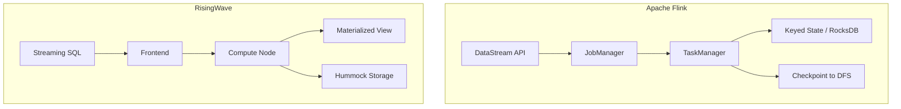
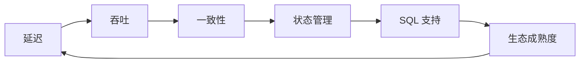

# 流处理系统对比分析 2026

> 所属阶段: Struct | 前置依赖: [03.03-expressiveness-hierarchy.md](../03-relationships/03.03-expressiveness-hierarchy.md) | 形式化等级: L4-L5

## 1. 概念定义 (Definitions)

### Def-S-05-05-01: 流处理系统形式化元组

一个流处理系统 $\mathcal{S}$ 是一个八元组：

$$
\mathcal{S} = (\mathcal{M}, \mathcal{O}, \mathcal{T}, \mathcal{S}_t, \mathcal{F}, \mathcal{C}, \mathcal{R}, \mathcal{P})
$$

其中：

- $\mathcal{M}$: 计算模型 (Dataflow / Actor / CSP / EPC)
- $\mathcal{O}$: 操作符集合
- $\mathcal{T}$: 时间语义 (Event Time / Processing Time / Ingestion Time)
- $\mathcal{S}_t$: 状态模型 (Keyed / Operator / None)
- $\mathcal{F}$: 容错机制 (Checkpoint / WAL / None)
- $\mathcal{C}$: 一致性保证 (Exactly-Once / At-Least-Once / At-Most-Once)
- $\mathcal{R}$: 资源调度模型
- $\mathcal{P}$: 编程接口 (SQL / DataStream / DAG)

## 2. 属性推导 (Properties)

### Lemma-S-05-05-01: 模型表达力蕴含操作符完备性

若 $\mathcal{M}_1 \succeq \mathcal{M}_2$（模型 $\mathcal{M}_1$ 表达力严格大于 $\mathcal{M}_2$），则 $\mathcal{O}_1$ 可通过编码模拟 $\mathcal{O}_2$ 的所有操作符。

### Lemma-S-05-05-02: 时间语义与一致性 guarantee 的耦合关系

在 Event Time 语义下，Exactly-Once 一致性要求 Watermark 单调性；在 Processing Time 语义下，Exactly-Once 一致性仅要求幂等 Sink。

## 3. 关系建立 (Relations)

| 系统 | 计算模型 | 时间语义 | 状态模型 | 容错机制 | 一致性 |
|------|----------|----------|----------|----------|--------|
| Apache Flink | Dataflow | Event Time | Keyed + Operator | Chandy-Lamport Checkpoint | Exactly-Once |
| Apache Spark Streaming | Micro-batch | Processing Time | None | RDD Lineage | Exactly-Once |
| Kafka Streams | Processor Topology | Event Time | Keyed | Standby Replicas | Exactly-Once |
| RisingWave | Streaming SQL | Event Time | Materialized View | WAL + Snapshot | Exactly-Once |
| Materialize | Differential Dataflow | Event Time | Arrangements | Determinism | Strict Serializability |
| Pulsar Functions | Event-driven | Processing Time | None | Redelivery | At-Least-Once |
| Storm | DAG | Processing Time | None | Record-level ACK | At-Least-Once |

### Prop-S-05-05-01: 状态模型与容错机制的对偶性

状态模型 $\mathcal{S}_t$ 与容错机制 $\mathcal{F}$ 存在对偶关系：

- 有状态系统 ($\mathcal{S}_t \neq \text{None}$) 必须配备 Checkpoint 或 WAL
- 无状态系统 ($\mathcal{S}_t = \text{None}$) 可通过源重放实现容错

## 4. 论证过程 (Argumentation)

### 反例分析: Storm 的 At-Least-Once 设计

Storm 采用 Record-level ACK 机制，每个 Tuple 树在完全处理后被 ACK。该设计：

- **优势**: 低延迟、低 overhead
- **劣势**: 无法保证 Exactly-Once（Tuple 树重放导致重复处理）
- **边界**: 适用于幂等操作场景，不适用于非幂等聚合

## 5. 形式证明 / 工程论证 (Proof)

### Thm-S-05-05-01: 流处理系统分类定理

对于任意流处理系统 $\mathcal{S}$，若其满足：

1. $\mathcal{T} = \text{Event Time}$
2. $\mathcal{C} = \text{Exactly-Once}$
3. $\mathcal{S}_t \neq \text{None}$

则 $\mathcal{F}$ 必须包含全局一致快照机制（如 Chandy-Lamport 或变种）。

**证明框架**:

- 由 Event Time 语义，系统需处理乱序数据
- 由有状态性，操作符需维护持久化状态
- 由 Exactly-Once，状态更新与输出提交必须原子化
- 全局一致快照是满足上述三条件的最小充分机制

## 6. 实例验证 (Examples)

### 示例 1: Flink vs RisingWave 架构对比

### 示例 2: 选型决策矩阵

| 场景 | 推荐系统 | 理由 |
|------|----------|------|
| 复杂事件处理 | Flink | CEP 库成熟，状态管理灵活 |
| 实时数仓 | RisingWave / Materialize | SQL-first，物化视图自动维护 |
| 轻量级流处理 | Kafka Streams | 与 Kafka 生态无缝集成 |
| 海量数据 ETL | Flink / Spark Streaming | 批流统一，生态丰富 |

## 7. 可视化 (Visualizations)

### 流处理系统能力雷达图

## 8. 引用参考 (References)
