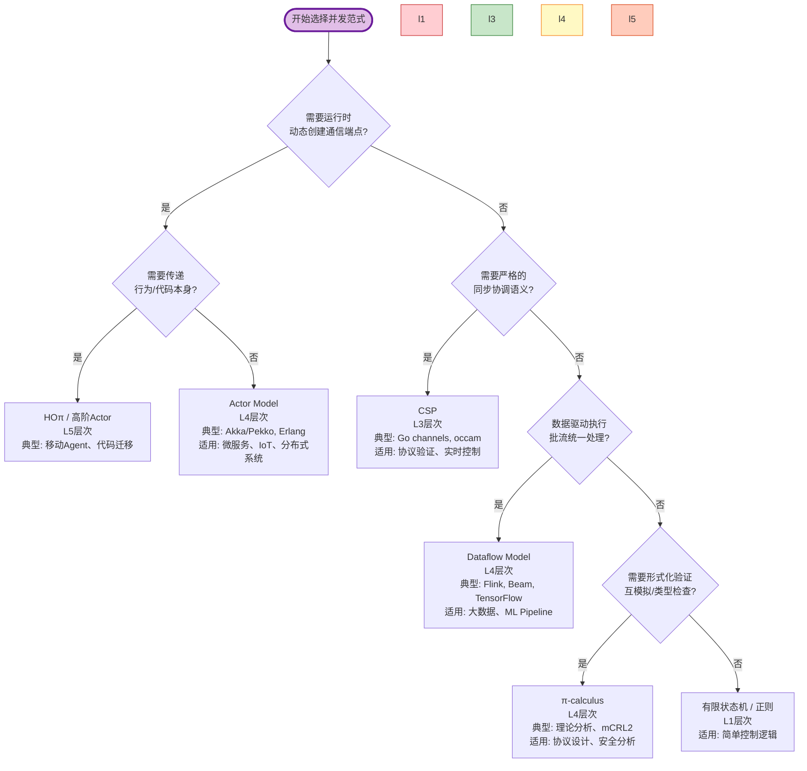
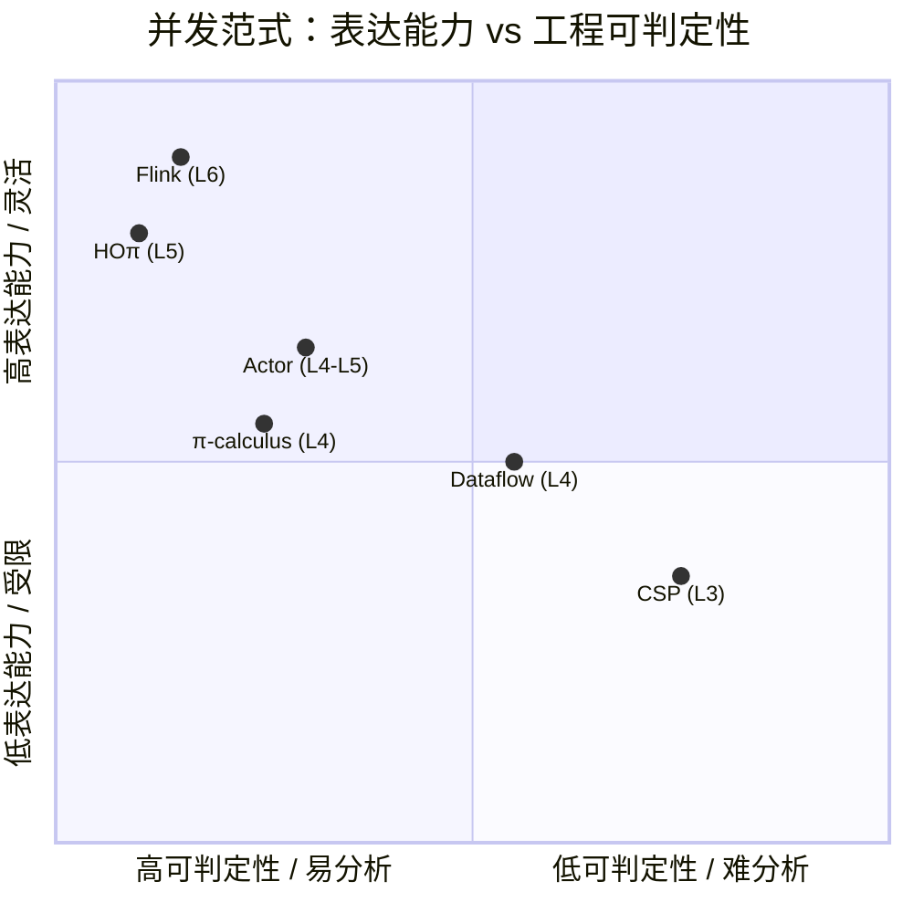
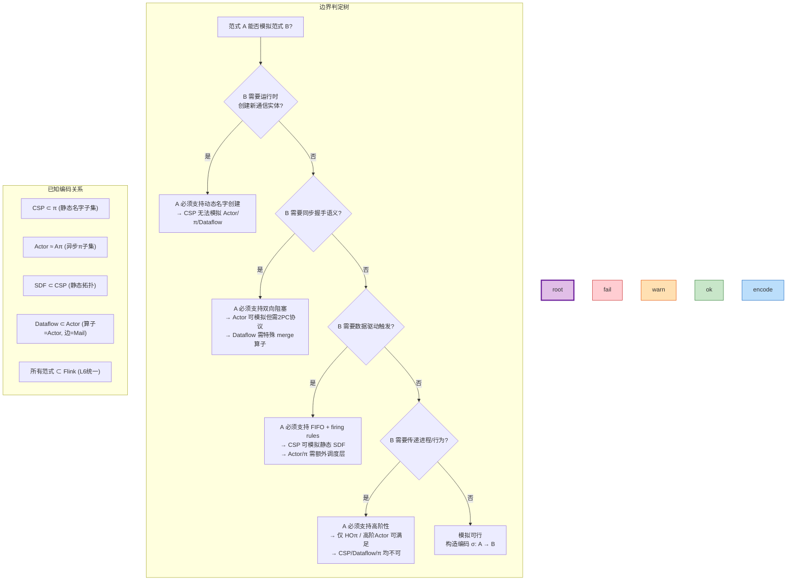

# 四大并发范式边界澄清

> **所属阶段**: Struct/05-comparative-analysis | **前置依赖**: [USTM-F-Reconstruction/04-encoding-verification/04.04-expressiveness-hierarchy-v2.md](../../USTM-F-Reconstruction/04-encoding-verification/04.04-expressiveness-hierarchy-v2.md), [Struct/03-relationships/03.03-expressiveness-hierarchy.md](../03-relationships/03.03-expressiveness-hierarchy.md) | **形式化等级**: L4-L5
> **文档编号**: S-05-06 | **版本**: 2026.04 | **状态**: 完整

---

## 目录

- [四大并发范式边界澄清](#四大并发范式边界澄清)
  - [目录](#目录)
  - [1. 概念定义 (Definitions)](#1-概念定义-definitions)
    - [Def-S-05-06-01. Actor Model (演员模型)](#def-s-05-06-01-actor-model-演员模型)
    - [Def-S-05-06-02. CSP (Communicating Sequential Processes)](#def-s-05-06-02-csp-communicating-sequential-processes)
    - [Def-S-05-06-03. π-calculus (π演算)](#def-s-05-06-03-π-calculus-π演算)
    - [Def-S-05-06-04. Dataflow Model (数据流模型)](#def-s-05-06-04-dataflow-model-数据流模型)
    - [Def-S-05-06-05. USTM 六层表达能力定位](#def-s-05-06-05-ustm-六层表达能力定位)
  - [2. 属性推导 (Properties)](#2-属性推导-properties)
    - [Lemma-S-05-06-01. Actor 到 π 的编码存在性](#lemma-s-05-06-01-actor-到-π-的编码存在性)
    - [Lemma-S-05-06-02. CSP 到 Dataflow 的受限编码](#lemma-s-05-06-02-csp-到-dataflow-的受限编码)
    - [Prop-S-05-06-01. 四大范式状态管理模型对比命题](#prop-s-05-06-01-四大范式状态管理模型对比命题)
  - [3. 关系建立 (Relations)](#3-关系建立-relations)
    - [关系 1: 表达能力严格包含链](#关系-1-表达能力严格包含链)
    - [关系 2: 通信原语映射](#关系-2-通信原语映射)
    - [关系 3: 容错机制对比](#关系-3-容错机制对比)
  - [4. 论证过程 (Argumentation)](#4-论证过程-argumentation)
    - [论证 1: Actor 与 CSP 的本质分野 —— 同步 vs 异步](#论证-1-actor-与-csp-的本质分野--同步-vs-异步)
    - [论证 2: π-calculus 作为 "并发演算的演算"](#论证-2-π-calculus-作为-并发演算的演算)
    - [论证 3: Dataflow Model 的工业优势](#论证-3-dataflow-model-的工业优势)
  - [5. 形式证明 / 工程论证 (Proof / Engineering Argument)](#5-形式证明--工程论证-proof--engineering-argument)
    - [Thm-S-05-06-01. Actor 可模拟 CSP 的充分必要条件](#thm-s-05-06-01-actor-可模拟-csp-的充分必要条件)
    - [Thm-S-05-06-02. CSP 可模拟 Dataflow 的边界定理](#thm-s-05-06-02-csp-可模拟-dataflow-的边界定理)
    - [Thm-S-05-06-03. 四大范式在 Flink 中的统一实例化](#thm-s-05-06-03-四大范式在-flink-中的统一实例化)
  - [6. 实例验证 (Examples)](#6-实例验证-examples)
    - [示例 1: 同一计数器系统的多范式表达](#示例-1-同一计数器系统的多范式表达)
    - [示例 2: 动态拓扑 —— 服务器负载均衡](#示例-2-动态拓扑--服务器负载均衡)
  - [7. 可视化 (Visualizations)](#7-可视化-visualizations)
    - [图 7.1: "我的场景该选哪个范式？" 决策树](#图-71-我的场景该选哪个范式-决策树)
    - [图 7.2: 四大范式 × 核心维度概念矩阵](#图-72-四大范式--核心维度概念矩阵)
    - [图 7.3: 范式间模拟关系与边界判定树](#图-73-范式间模拟关系与边界判定树)
  - [8. 引用参考 (References)](#8-引用参考-references)


## 1. 概念定义 (Definitions)

### Def-S-05-06-01. Actor Model (演员模型)

**定义** (Hewitt, Bishop, Steiger 1973[^1]): Actor Model 是一种**基于异步消息传递**的并发计算模型，其中 Actor 是并发计算的基本原语。每个 Actor 在收到消息后可以：

1. 发送有限数量的消息到其他 Actor
2. 创建有限数量的新 Actor
3. 指定收到下一条消息时的行为

**形式化语法** (Agha 1986[^2] 简化):

$$
\begin{aligned}
P, Q &::= a \langle \vec{v} \rangle \quad \text{(异步发送)} \\
  &\mid \nu a. P \quad \text{(创建新Actor)} \\
  &\mid P \mid Q \quad \text{(并行组合)} \\
  &\mid a(\vec{x}).P \quad \text{(行为定义/消息接收)} \\
  &\mid 0 \quad \text{(空进程)}
\end{aligned}
$$

**核心特征**: 无共享状态、地址不可伪造、消息传递解耦发送者与接收者、通信拓扑动态演化。

---

### Def-S-05-06-02. CSP (Communicating Sequential Processes)

**定义** (Hoare 1978[^3]): CSP 是一种基于**同步通道通信**的并发进程代数。进程通过命名通道进行输入/输出，通信是**双向握手同步**的。

**形式化语法** (CSP 核心):

$$
\begin{aligned}
P, Q &::= a \to P \quad \text{(前缀/顺序)} \\
  &\mid P \sqcap Q \quad \text{(非确定性选择)} \\
  &\mid P \square Q \quad \text{(外部选择)} \\
  &\mid P \parallel Q \quad \text{(并行组合)} \\
  &\mid P \setminus A \quad \text{(隐藏)} \\
  &\mid \text{STOP} \mid \text{SKIP} \quad \text{(终止/跳过)}
\end{aligned}
$$

**核心特征**: 通道集合在语法层面静态确定、同步通信（发送方阻塞直到接收方就绪）、基于迹(trace)的指称语义。

---

### Def-S-05-06-03. π-calculus (π演算)

**定义** (Milner, Parrow, Walker 1992[^4]): π-calculus 是对 CCS 的扩展，引入了**名字传递 (name passing)** 能力，允许通道本身作为消息被传递，从而支持动态通信拓扑。

**形式化语法**:

$$
\begin{aligned}
P, Q &::= \bar{x}\langle y \rangle.P \quad \text{(输出名字)} \\
  &\mid x(z).P \quad \text{(输入名字)} \\
  &\mid \tau.P \quad \text{(静默动作)} \\
  &\mid (\nu x)P \quad \text{(名字限制/创建)} \\
  &\mid P \mid Q \quad \text{(并行)} \\
  &\mid !P \quad \text{(复制)} \\
  &\mid P + Q \quad \text{(选择)} \\
  &\mid 0 \quad \text{(空)}
\end{aligned}
$$

**核心特征**: 名字是唯一的计算资源、通过名字传递实现拓扑动态重构、一阶名字移动能力（高阶π演算支持进程传递）。

---

### Def-S-05-06-04. Dataflow Model (数据流模型)

**定义** (Kahn 1974[^5], Lee & Parks 1995[^6]): Dataflow Model 将计算表示为**有向图**，节点为算子(Actor/Operator)，边为无界 FIFO 通道。算子的执行（"触发/firing"）由输入数据的可用性驱动。

**形式化定义** (Kahn Process Network):

$$
\text{DPN} = (A, C, F, R)
$$

其中：

- $A$: 算子(_actor/operator_)集合
- $C \subseteq A \times A$: 有向通道(FIFO)集合
- $F: \text{Tokens}^* \to \text{Tokens}^*$: 触发函数(kernel)
- $R \subseteq \mathcal{P}(\text{Tokens}^*)$: 触发规则(firing rules)

**核心特征**: 数据驱动执行、无集中式控制、确定性（Kahn条件[^5]）、通过触发规则表达计算粒度。

---

### Def-S-05-06-05. USTM 六层表达能力定位

基于 USTM-F 表达能力层次 (Def-F-04-04-02)[^7]，四大范式定位如下：

| 范式 | USTM 层次 | 核心特征 | 形式化边界 |
|------|----------|---------|-----------|
| **CSP** | $L_3$ (Process Algebra) | 静态命名通道、同步通信 | 通道集合编译时确定 |
| **π-calculus** | $L_4$ (Mobile) | 动态名字创建与传递 | $(\nu a)(\bar{b}\langle a \rangle \mid a(x).P)$ |
| **Actor Model** | $L_4$-$L_5$ (Mobile/Higher-Order) | 动态拓扑 + 监督树高阶结构 | 可模拟HOπ子集 |
| **Dataflow Model** | $L_4$ (Mobile) | 数据驱动、有向FIFO边 | 拓扑动态但通信模式固定 |

**层次关系**: $\text{CSP}_{L3} \sqsubset \text{Dataflow}_{L4} \approx \text{π}_{L4} \approx \text{Actor}_{L4} \sqsubseteq \text{Actor}_{L5}$

---

## 2. 属性推导 (Properties)

### Lemma-S-05-06-01. Actor 到 π 的编码存在性

**引理**: 存在从 Actor Model 到异步 π-calculus 的**忠实编码** (Aπ 演算[^8])。

**编码概要**:

| Actor 概念 | π-calculus 编码 |
|-----------|----------------|
| Actor 地址 | 私有通道名 |
| 消息发送 `a ! v` | `$\bar{a}\langle v \rangle$` |
| 行为接收 `a ? { case v => P }` | `$a(x).P$` |
| 创建新 Actor | `$(\nu a)P$` |
| MailBox 队列 | 通道缓冲语义 |

**证明概要**: Agha & Thati (2004)[^8] 证明了该编码满足 Gorla 判据（结构保持、语义保持、组合性、名称不变性、操作性）。∎

---

### Lemma-S-05-06-02. CSP 到 Dataflow 的受限编码

**引理**: CSP 进程可编码为 Dataflow Process Network 的**受限子集**，当且仅当满足以下条件：

1. 通道为单向 FIFO
2. 无外部选择 (`$\square$`) 或可通过优先级编码
3. 无隐藏操作符 (`$\setminus$`) 或隐藏事件映射为内部触发

**证明概要**: CSP 的同步通信可分解为"请求-确认"两个异步消息，映射到 Dataflow 的两条边。但 CSP 的外部选择（多路复用等待）在纯 Dataflow 中需引入特殊的 merge 算子，超出基础 DPN 模型。∎

---

### Prop-S-05-06-01. 四大范式状态管理模型对比命题

**命题**: 四大范式在状态管理上呈现清晰的谱系：

| 范式 | 状态模型 | 状态可见性 | 持久化机制 |
|------|---------|-----------|-----------|
| **Actor** | 私有局部状态 (behaviour) | 仅本 Actor 可见 | Actor 生命周期内持久 |
| **CSP** | 理论上无状态（或进程参数） | 进程内部 | 进程终止即丢失 |
| **π-calculus** | 无状态（纯名字传递） | — | — |
| **Dataflow** | 算子内部状态（可选） | 算子作用域 | Checkpoint/状态后端 |

**证明**: 由各自的形式化定义直接导出。Actor 的 `become` 显式更新局部状态；CSP 进程代数传统上为无状态，但实现中可携带参数；π-calculus 为纯通信演算，无显式状态概念；Dataflow 算子可设计为有状态（如 Flink 的 `KeyedProcessFunction`）或无状态（纯函数触发）。∎

---

## 3. 关系建立 (Relations)

### 关系 1: 表达能力严格包含链

基于 USTM-F 严格包含定理 (Thm-F-04-04-01 ~ Thm-F-04-04-04)[^7]:

$$
\text{CSP} \sqsubset_{L3}^{L4} \text{Dataflow} \approx_{L4} \text{π-calculus} \approx_{L4} \text{Actor} \sqsubseteq_{L4}^{L5} \text{HOπ} \sqsubseteq_{L5}^{L6} \text{Flink}
$$

**关键分离问题**:

- CSP $\to$ Dataflow/π: **动态名字创建** ($(\nu a)$ 运行时创建新通道)
- π $\to$ HOπ: **进程作为值传递** ($a\langle Q \rangle.R$，Sangiorgi 定理[^9])
- 所有范式 $\to$ Flink: **图灵完备 + 内置时间/容错语义**

### 关系 2: 通信原语映射

| 范式 | 通信机制 | 同步性 | 拓扑特性 | 去耦程度 |
|------|---------|--------|---------|---------|
| **Actor** | 异步消息 → Mailbox | 异步 | 动态（地址可传递） | 时间/空间解耦 |
| **CSP** | 通道输入/输出 | 同步 | 静态（语法确定） | 紧耦合 |
| **π-calculus** | 名字在通道上传递 | 同步（基础） | 动态（名字可传递） | 中度解耦 |
| **Dataflow** | 令牌(Token)在边上流动 | 异步（写非阻塞/读阻塞） | 静态为主 | 空间解耦 |

### 关系 3: 容错机制对比

| 范式 | 容错策略 | 实现机制 | 形式化基础 |
|------|---------|---------|-----------|
| **Actor** | 监督树 (Supervision Tree) | 父Actor监控子Actor生命周期，失败时重启/升级 | "Let it crash" 哲学 |
| **CSP** | 无内置容错 | 依赖外部进程管理（如 occam 的 PRI ALT + 超时） | 死锁/活锁检测 (FDR4) |
| **π-calculus** | 无内置容错 | 理论模型，不涉及运行时故障 | 会话类型可编码部分安全性质 |
| **Dataflow** | Checkpoint + 状态后端 | Chandy-Lamport 分布式快照，Exactly-Once 语义 | 一致性证明 (Thm-F-04-04-05)[^7] |

---

## 4. 论证过程 (Argumentation)

### 论证 1: Actor 与 CSP 的本质分野 —— 同步 vs 异步

Hewitt (2010)[^1] 明确指出 CSP 与 Actor Model 的六大差异：

1. **并发原语**: CSP 为输入/输出/卫式命令/并行组合；Actor 为异步单向消息
2. **执行单元**: CSP 以顺序进程为基础；Actor 以固有并发为基础
3. **拓扑**: CSP 通信拓扑固定；Actor 拓扑动态变化
4. **结构**: CSP 进程为层次并行组合；Actor 允许非层次执行（通过 Future）
5. **同步性**: CSP 通信同步；Actor 通信异步
6. **数据**: CSP 数据为数字/字符串/数组；Actor 中数据结构本身也是 Actor

**工程推论**:

- 需要**时间/空间解耦**（如微服务、物联网）→ 选 Actor
- 需要**精确同步协调**（如实时信号处理、协议验证）→ 选 CSP

### 论证 2: π-calculus 作为 "并发演算的演算"

π-calculus 的设计目标是为移动计算提供**最小完备原语集**。与 Actor 和 CSP 相比：

**π-calculus 的优势**:

- 最简语法，易于形式化分析
- 名字传递 = 能力传递（capability-based security）
- 丰富的互模拟理论（强/弱/早/晚/开互模拟）

**π-calculus 的局限**:

- 无内置容错或分布语义
- 无显式时间/优先级
- 理论深度高但工业实现少

**Actor 与 π 的关系**: Aπ 演算[^8] 证明 Actor 可编码为带类型约束的异步 π-calculus。反之，无类型 π-calculus 无法完全编码 Actor 的 locality 公理（组织/操作公理）。

### 论证 3: Dataflow Model 的工业优势

Dataflow Model（以 Flink/Beam 为代表）的崛起源于其**在批流统一与容错上的工程优势**：

1. **确定性**: Kahn 条件保证输出独立于执行顺序，便于调试与复现
2. **自动并行**: 算子图为编译器/调度器提供天然的并行粒度
3. **时间抽象**: 内置 Event Time / Processing Time / Ingestion Time 语义
4. **状态容错**: Checkpoint 机制将分布式快照与算子状态结合

**理论代价**: Dataflow 模型为达到工程可用性，牺牲了部分纯形式化特性（如 Kahn 网的有界内存保证在一般 Dataflow 中不可判定）。

---

## 5. 形式证明 / 工程论证 (Proof / Engineering Argument)

### Thm-S-05-06-01. Actor 可模拟 CSP 的充分必要条件

**定理**: Actor Model 可以模拟 CSP 进程当且仅当满足以下条件：

$$
\forall P_{CSP}. \exists \sigma: P_{CSP} \to P_{Actor}. \quad \text{traces}(P_{CSP}) = \text{traces}(\sigma(P_{Actor}))
$$

**充分条件**:

1. CSP 通道集合有限且编译时已知
2. 允许 Actor 使用 **两阶段提交模式** 模拟同步握手
3. 不依赖 CSP 的外部选择超时语义

**必要条件**:

1. Actor 系统提供**可靠消息传递**（至少 at-least-once）
2. Actor 地址空间包含 CSP 通道名的双射映射

**证明**:

**正向** (Actor 模拟 CSP):

- 将每个 CSP 进程映射为一个 Actor
- 将 CSP 通道 $c$ 映射为一对 Actor 地址 $(c_{in}, c_{out})$
- CSP 同步输出 `c!v → P` 编码为：Actor 向 $c_{out}$ 发送 `v`，等待 $c_{in}$ 的 ACK，然后执行 $P$
- CSP 同步输入 `c?x → P` 编码为：Actor 从 $c_{in}$ 接收 `v`，向 $c_{out}$ 发送 ACK，然后执行 $P[v/x]$

**反向** (CSP 无法模拟一般 Actor):

- 由 $L_3 \sqsubset L_4$ 严格包含 (Thm-F-04-04-03)[^7]
- Actor 可运行时创建无限多个新地址（通道），CSP 通道集合语法固定
- 分离问题：$(\nu a)(\bar{b}\langle a \rangle \mid a(x).P)$ 无法在 CSP 中直接表达 ∎

---

### Thm-S-05-06-02. CSP 可模拟 Dataflow 的边界定理

**定理**: CSP 可以模拟 Dataflow Process Network 的**静态拓扑子集**。

**可模拟子集**:

- 算子图编译时固定
- 触发规则为静态 SDF (Synchronous Dataflow) 类型
- 无动态分支/合并

**不可模拟特性**:

- 动态算子创建/销毁
- 运行时拓扑重构
- 数据依赖的触发规则变化

**证明**:

静态 SDF 网络中，每个算子的触发消耗/产生率固定。可将每个算子编码为 CSP 进程，FIFO 通道编码为 CSP 通道缓冲。由于 SDF 的调度可静态确定，CSP 的固定通道拓扑足够表达。

然而，一般 Dataflow（如 Kahn Process Networks）允许算子根据输入数据决定消费/生产率，这需要进程内部状态驱动的通道使用模式，超出 CSP 静态进程的表达能力。∎

---

### Thm-S-05-06-03. 四大范式在 Flink 中的统一实例化

**定理**: Flink 的运行时语义可以实例化（编码）四大并发范式的工程子集。

**证据表**:

| 范式 | Flink 对应抽象 | 编码方式 | 保持的性质 |
|------|--------------|---------|-----------|
| **Actor** | `ProcessFunction` + `KeyedState` | Actor → KeyedProcessFunction，Mailbox → NetworkBuffer | 状态隔离、单线程执行 |
| **CSP** | `ConnectedStreams` + `keyBy` | CSP 通道 → DataStream 分区边 | 确定性路由、FIFO |
| **π-calculus** | 动态 `DataStream` 连接 | 名字 → `TypeInformation` + 序列化 | 类型安全、动态连接 |
| **Dataflow** | `StreamGraph` / `JobGraph` | 原生对应 | 触发规则、Checkpoint |

**证明概要**: 由 USTM-F 模型实例化框架 (Def-I-00-01 ~ Def-I-00-07)[^10] 保证。Flink 作为 $L_6$ 图灵完备实现，具备表达所有低层范式所需的计算资源（无限递归、动态数据结构、内置时间模型）。∎

---

## 6. 实例验证 (Examples)

### 示例 1: 同一计数器系统的多范式表达

**Actor (Scala/Akka 风格)**:

```scala
counter = Actor {
  case Increment => count += 1
  case Get => sender ! count
}
```

**CSP (CSP-M 风格)**:

```csp
COUNTER(n) = increment -> COUNTER(n+1)
           [] get?c -> c!n -> COUNTER(n)
```

**π-calculus**:

```
Counter(n) = inc().Counter(n+1) + get(reply).(reply<n>.Counter(n))
```

**Dataflow (Flink 风格)**:

```java
dataStream
  .keyBy("counterId")
  .process(new CountFunction()) // ValueState<Long> count
```

---

### 示例 2: 动态拓扑 —— 服务器负载均衡

**场景**: 工作节点动态注册到负载均衡器，均衡器将任务分发给可用节点。

**Actor 实现**:

- `Balancer` Actor 维护 `Map<String, ActorRef>` 可用节点表
- 新节点启动时向 Balancer 发送 `Register(address)`
- Balancer 收到任务后 `round-robin` 选择节点转发

**CSP 实现难点**:

- 新节点通道无法在运行时加入静态进程定义
- 需预定义所有可能节点通道（不现实）
- 或使用统一的 `request`/`response` 通道 + 节点ID（退化为 Actor-like 模式）

**π-calculus 实现**:

```
Balancer = register(node).Balancer'(node)
Balancer'(n) = task(data).(n<data>.Balancer'(n) + register(m).Balancer''(n,m))
```

---

## 7. 可视化 (Visualizations)

### 图 7.1: "我的场景该选哪个范式？" 决策树

以下决策树帮助根据应用场景特征选择最合适的并发范式：



---

### 图 7.2: 四大范式 × 核心维度概念矩阵



**详细概念矩阵**:

| 对比维度 | Actor Model | CSP | π-calculus | Dataflow Model |
|---------|-------------|-----|------------|----------------|
| **USTM层次** | $L_4$-$L_5$ | $L_3$ | $L_4$ | $L_4$ |
| **表达能力** | ★★★★☆ | ★★★☆☆ | ★★★★☆ | ★★★★☆ |
| **状态模型** | 私有局部状态 | 无/进程参数 | 无状态 | 算子内部状态 |
| **通信原语** | 异步消息 | 同步握手 | 同步名字传递 | 异步令牌流 |
| **拓扑特性** | 动态 | 静态 | 动态 | 静态为主 |
| **组合性** | Actor引用组合 | 并行/顺序/选择 | 并行/限制 | 图连接 |
| **容错机制** | 监督树 | 外部检测 | 无内置 | Checkpoint |
| **典型实现** | Akka/Pekko, Erlang | Go channels, FDR4 | mCRL2, Pi4SOA | Flink, Beam |
| **可判定性** | 部分可达性可判定 | 有限状态互模拟可判定 | 部分类型检查可判定 | Checkpoint一致性可证 |
| **生态成熟度** | ★★★★★ | ★★★★☆ | ★★☆☆☆ | ★★★★★ |

---

### 图 7.3: 范式间模拟关系与边界判定树

以下判定树展示了在什么条件下一种范式可以模拟另一种范式：



**关键边界判定**:

| 模拟方向 | 条件 | 结论 | 形式化依据 |
|---------|------|------|-----------|
| Actor → CSP | 静态有限Actor集 + 可靠消息 | ✅ 可模拟 | 两阶段提交编码 |
| CSP → Actor | 无额外条件 | ✅ 可模拟 | 通道=Actor地址对 |
| CSP → Dataflow | 静态SDF子集 | ✅ 可模拟 | Lee & Parks (1995)[^6] |
| Dataflow → CSP | 动态拓扑或数据依赖触发 | ❌ 不可模拟 | Kahn条件 vs 静态进程 |
| π → Actor | 带类型约束 (Aπ) | ✅ 可模拟 | Agha & Thati (2004)[^8] |
| Actor → π | 无类型约束 | ⚠️ 近似编码 | Locality公理丢失 |
| 所有 → Flink | 工程子集 | ✅ 可实例化 | USTM-F 框架[^10] |

---

## 8. 引用参考 (References)

[^1]: C. Hewitt, "Actor Model of Computation: Scalable Robust Information Systems", _arXiv:1008.1459_, 2010. <https://arxiv.org/abs/1008.1459>

[^2]: G. Agha, "Actors: A Model of Concurrent Computation in Distributed Systems", MIT Press, 1986.

[^3]: C. A. R. Hoare, "Communicating Sequential Processes", _Communications of the ACM_, 21(8), 666-677, 1978.

[^4]: R. Milner, J. Parrow, D. Walker, "A Calculus of Mobile Processes, Parts I-II", _Information and Computation_, 100(1), 1-77, 1992.

[^5]: G. Kahn, "The Semantics of a Simple Language for Parallel Programming", _Information Processing 74_, North-Holland, 471-475, 1974.

[^6]: E. A. Lee and T. M. Parks, "Dataflow Process Networks", _Proceedings of the IEEE_, 83(5), 773-801, 1995.

[^7]: AnalysisDataFlow USTM-F, "Expressiveness Hierarchy v2 - Strict", 2026. [USTM-F-Reconstruction/04-encoding-verification/04.04-expressiveness-hierarchy-v2.md](../../USTM-F-Reconstruction/04-encoding-verification/04.04-expressiveness-hierarchy-v2.md)

[^8]: G. Agha and P. Thati, "An Algebraic Theory of Actors and Its Application to a Simple Object-Based Language", _Objects, Components, Models and Patterns (TOOLS Europe)_, 2004.

[^9]: D. Sangiorgi, "Expressing Mobility in Process Algebras: First-Order and Higher-Order Paradigms", Ph.D. Thesis, University of Edinburgh, 1992.

[^10]: AnalysisDataFlow USTM-F, "Model Instantiation Framework", 2026. [USTM-F-Reconstruction/02-model-instantiation/02.00-model-instantiation-framework.md](../../USTM-F-Reconstruction/02-model-instantiation/02.00-model-instantiation-framework.md)


---

_文档创建时间: 2026-04-30 | 形式化等级: L4-L5 | 状态: 完整_
