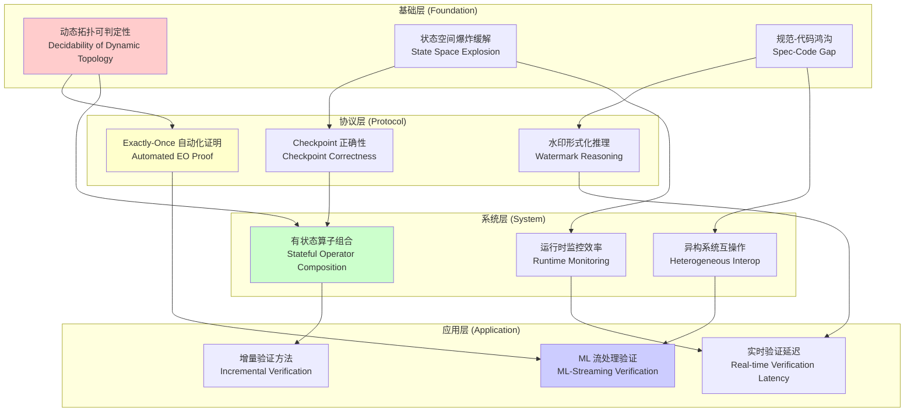
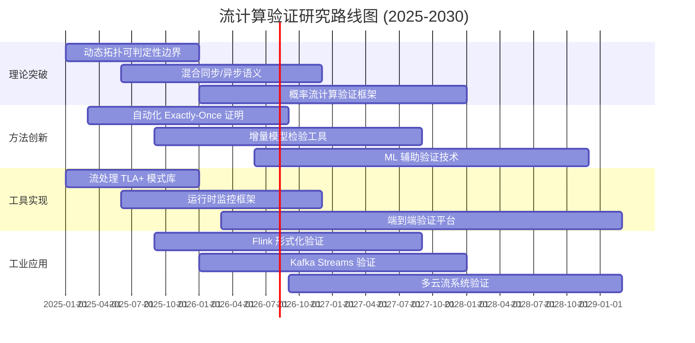
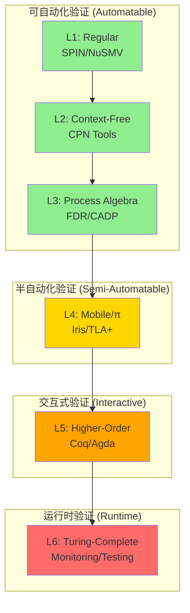

# 流计算验证开放问题 (Open Problems in Streaming Verification)

> **所属阶段**: Struct/06-frontier | **前置依赖**: [../04-proofs/04.01-flink-checkpoint-correctness.md](../04-proofs/04.01-flink-checkpoint-correctness.md), [../04-proofs/04.02-flink-exactly-once-correctness.md](../04-proofs/04.02-flink-exactly-once-correctness.md), [../03-relationships/03.03-expressiveness-hierarchy.md](../03-relationships/03.03-expressiveness-hierarchy.md) | **形式化等级**: L4-L6
> **版本**: 2026.04

---

## 目录

- [流计算验证开放问题 (Open Problems in Streaming Verification)](#流计算验证开放问题-open-problems-in-streaming-verification)
  - [目录](#目录)
  - [1. 概念定义 (Definitions)](#1-概念定义-definitions)
    - [Def-S-25-01. 验证问题谱系 (Verification Problem Spectrum)](#def-s-25-01-验证问题谱系-verification-problem-spectrum)
    - [Def-S-25-02. 可判定性边界 (Decidability Frontier)](#def-s-25-02-可判定性边界-decidability-frontier)
    - [Def-S-25-03. 实用验证挑战 (Practical Verification Challenge)](#def-s-25-03-实用验证挑战-practical-verification-challenge)
    - [Def-S-25-04. 开放问题分类 (Open Problem Taxonomy)](#def-s-25-04-开放问题分类-open-problem-taxonomy)
  - [2. 属性推导 (Properties)](#2-属性推导-properties)
    - [Lemma-S-25-01. 表达能力与可验证性的反向关系](#lemma-s-25-01-表达能力与可验证性的反向关系)
    - [Lemma-S-25-02. 动态拓扑验证的复杂性下界](#lemma-s-25-02-动态拓扑验证的复杂性下界)
    - [Prop-S-25-01. 近似验证的充分性条件](#prop-s-25-01-近似验证的充分性条件)
  - [3. 关系建立 (Relations)](#3-关系建立-relations)
    - [关系 1: 形式化层次与验证工具映射](#关系-1-形式化层次与验证工具映射)
    - [关系 2: 一致性级别与验证复杂度](#关系-2-一致性级别与验证复杂度)
    - [关系 3: 故障模型与验证完备性](#关系-3-故障模型与验证完备性)
  - [4. 论证过程 (Argumentation)](#4-论证过程-argumentation)
    - [论证 1: 为什么流计算验证是困难的](#论证-1-为什么流计算验证是困难的)
    - [论证 2: 模型检验的状态空间爆炸问题](#论证-2-模型检验的状态空间爆炸问题)
    - [论证 3: 规范-代码鸿沟 (Specification-Code Gap)](#论证-3-规范-代码鸿沟-specification-code-gap)
  - [5. 形式证明 / 工程论证 (Proof / Engineering Argument)](#5-形式证明--工程论证-proof--engineering-argument)
    - [开放问题 1: 动态拓扑下的实时验证](#开放问题-1-动态拓扑下的实时验证)
    - [开放问题 2: 端到端 Exactly-Once 的自动化证明](#开放问题-2-端到端-exactly-once-的自动化证明)
    - [开放问题 3: 水印进度的形式化推理](#开放问题-3-水印进度的形式化推理)
    - [开放问题 4: 有状态算子的组合验证](#开放问题-4-有状态算子的组合验证)
    - [开放问题 5: 异构流系统的互操作性验证](#开放问题-5-异构流系统的互操作性验证)
    - [开放问题 6: 流计算与机器学习的混合验证](#开放问题-6-流计算与机器学习的混合验证)
  - [6. 实例验证 (Examples)](#6-实例验证-examples)
    - [示例 1: Flink Checkpoint 协议验证尝试](#示例-1-flink-checkpoint-协议验证尝试)
    - [符号执行进展 (2025更新)](#符号执行进展-2025更新)
    - [示例 2: 动态重新分区下的不变式检验](#示例-2-动态重新分区下的不变式检验)
    - [示例 3: 使用 TLA+ 验证流处理算子](#示例-3-使用-tla-验证流处理算子)
    - [反例: 过度简化导致的验证失效](#反例-过度简化导致的验证失效)
  - [7. 可视化 (Visualizations)](#7-可视化-visualizations)
    - [图 7.1: 开放问题依赖图 (Open Problems Dependency Graph)](#图-71-开放问题依赖图-open-problems-dependency-graph)
    - [图 7.2: 研究路线图 (Research Roadmap)](#图-72-研究路线图-research-roadmap)
    - [图 7.3: 验证复杂度层次图](#图-73-验证复杂度层次图)
  - [8. 引用参考 (References)](#8-引用参考-references)
  - [关联文档](#关联文档)

---

## 1. 概念定义 (Definitions)

### Def-S-25-01. 验证问题谱系 (Verification Problem Spectrum)

定义**流计算验证问题谱系**为四元组 $\mathcal{VPS} = (\mathcal{P}, \mathcal{L}, \mathcal{F}, \mathcal{M})$，其中：

| 组件 | 类型 | 语义 |
|------|------|------|
| $\mathcal{P}$ | $\text{Set}(\text{Property})$ | 待验证性质集合 |
| $\mathcal{L}$ | $\{L_1, L_2, L_3, L_4, L_5, L_6\}$ | 六层表达能力层次（见 [Def-S-14-03](../03-relationships/03.03-expressiveness-hierarchy.md#def-s-14-03-六层表达能力层次-six-layer-expressiveness-hierarchy)） |
| $\mathcal{F}$ | $\text{Set}(\text{FaultModel})$ | 故障模型集合 |
| $\mathcal{M}$ | $\text{Set}(\text{VerificationMethod})$ | 验证方法集合 |

**验证问题实例**：给定系统 $S$ 在层次 $L_i$ 中实现，故障模型 $f \in \mathcal{F}$，性质 $p \in \mathcal{P}$，判定是否 $S \models_f p$（在故障模型 $f$ 下满足性质 $p$）。

**性质分类** $\mathcal{P}$：

$$
\mathcal{P} ::= \text{Safety} \mid \text{Liveness} \mid \text{Determinism} \mid \text{Consistency} \mid \text{TypeSafety} \mid \text{Progress}
$$

**故障模型分类** $\mathcal{F}$：

| 故障模型 | 定义 | 影响范围 |
|----------|------|----------|
| **Crash-Stop** | 节点崩溃后停止 | 单个处理节点 |
| **Crash-Recovery** | 节点崩溃后可恢复 | 状态可能丢失 |
| **Network-Partition** | 网络分区导致通信中断 | 分布式子系统 |
| **Byzantine** | 节点可能任意行为 | 需要容错协议 |
| **Timing** | 时钟漂移或超时 | 时间语义受损 |

**定义动机**：流计算系统的验证必须同时考虑表达能力层次（决定理论可判定性）、故障模型（决定验证假设）和性质类别（决定验证技术）。这一谱系框架源自 Trofimov 等人对分布式流处理一致性形式化的开创性工作 [^1]。

---

### Def-S-25-02. 可判定性边界 (Decidability Frontier)

定义**可判定性边界**为表达能力层次上的谓词序列 $\mathcal{DF} = \{\mathcal{D}_i\}_{i=1}^{6}$，其中每个 $\mathcal{D}_i: \mathcal{P} \times \mathcal{F} \rightarrow \{\text{Decidable}, \text{Undecidable}, \text{SemiDecidable}\}$。

**可判定性层次**（参考 [Cor-S-14-01](../03-relationships/03.03-expressiveness-hierarchy.md#cor-s-14-01-可判定性递减推论)）：

| 层次 | 表达能力 | 安全性 (Safety) | 活性 (Liveness) | 一致性 (Consistency) |
|------|----------|-----------------|-----------------|---------------------|
| $L_1$ | Regular | **P-完全** [^2] | **P-完全** | **P-完全** |
| $L_2$ | Context-Free | **PSPACE-完全** [^3] | **PSPACE-完全** | **PSPACE-完全** |
| $L_3$ | Process Algebra | **EXPTIME-完全** [^4] | **EXPTIME-完全** | **EXPTIME-完全** |
| $L_4$ | Mobile (Actor/π) | **部分不可判定** [^5] | **部分不可判定** | **部分不可判定** |
| $L_5$ | Higher-Order | **大部分不可判定** [^6] | **不可判定** | **不可判定** |
| $L_6$ | Turing-Complete | **完全不可判定** | **完全不可判定** | **完全不可判定** |

**关键边界**：

- **$L_3 \to L_4$ 边界**：动态名称创建导致覆盖性 (coverability) 从可判定变为不可判定
- **$L_4 \to L_5$ 边界**：高阶进程传递导致行为等价从半可判定变为不可判定
- **$L_5 \to L_6$ 边界**：无限制递归引入停机问题的不可判定性

**定义动机**：可判定性边界决定了哪些验证问题可以自动化求解。在 $L_4$ 及以上层次，必须依赖近似验证、有界验证或交互式定理证明。

---

### Def-S-25-03. 实用验证挑战 (Practical Verification Challenge)

定义**实用验证挑战**为五元组 $\mathcal{PVC} = (S, \phi, \mathcal{R}, \mathcal{T}, \mathcal{C})$，其中：

| 组件 | 类型 | 语义 |
|------|------|------|
| $S$ | $\text{StreamSystem}$ | 待验证的流计算系统 |
| $\phi$ | $\text{Specification}$ | 形式化规范（如 TLA+、Coq） |
| $\mathcal{R}$ | $\text{RefinementMap}$ | 实现到规范的精化映射 |
| $\mathcal{T}$ | $\text{TimeBudget}$ | 验证时间预算 |
| $\mathcal{C}$ | $\text{Confidence}$ | 验证置信度阈值 |

**挑战度量**：

$$
\text{Challenge}(S, \phi) = \frac{|\text{StateSpace}(S)| \times |\phi|}{\mathcal{T} \times \text{AutomationDegree}(\mathcal{R})}
$$

**实用挑战类别**：

1. **状态空间爆炸**：$|\text{StateSpace}(S)|$ 随并发度和状态大小指数增长
2. **规范-代码鸿沟**：$\mathcal{R}$ 的手工构造容易出错且难以维护
3. **时间约束**：实时流处理要求验证在有限时间 $\mathcal{T}$ 内完成
4. **部分规约**：系统可能依赖外部服务或不确定数据源

**定义动机**：即使理论可判定，实际验证仍面临工程挑战。Ouyang 等人在 ZooKeeper 验证实践中发现，细粒度规范导致状态空间爆炸，而粗粒度规范引入规范-代码鸿沟 [^7]。

---

### Def-S-25-04. 开放问题分类 (Open Problem Taxonomy)

定义**开放问题分类**为树形结构 $\mathcal{OPT} = (N, E, \ell)$，其中节点 $N$ 代表问题类别，边 $E$ 代表依赖关系，标签 $\ell: N \rightarrow \{\text{Theory}, \text{Engineering}, \text{Hybrid}\}$。

```
开放问题分类 (Open Problem Taxonomy)
├── 理论问题 (Theory)
│   ├── 可判定性边界精确刻画
│   ├── 表达能力层次完备性
│   ├── 混合同步/异步语义验证
│   └── 概率流计算验证
├── 工程问题 (Engineering)
│   ├── 自动化测试生成
│   ├── 运行时监控效率
│   ├── 规范-代码一致性检查
│   └── 增量验证方法
└── 混合问题 (Hybrid)
    ├── 模型驱动测试
    ├── 符号执行与模型检验结合
    ├── 运行时形式化验证
    └── 机器学习辅助验证
```

**开放问题特性** $\text{Open}(p)$：

$$
\text{Open}(p) \iff \neg\exists \text{算法 } A. \forall S \in \mathcal{S}. A(S) = p(S) \text{ 且在资源约束内}
$$

**定义动机**：明确区分理论开放问题（等待数学突破）和工程开放问题（等待系统实现）有助于合理分配研究资源。

---

## 2. 属性推导 (Properties)

### Lemma-S-25-01. 表达能力与可验证性的反向关系

**陈述**：设 $L_i \subset L_j$ 为两个表达能力层次，则：

$$
\text{Decidable}(L_j) \subseteq \text{Decidable}(L_i)
$$

即表达能力增强时，可判定性质集合不增（单调递减）。

**证明概要**：

1. **编码存在性**：由 $L_i \subset L_j$ 知存在编码 $\sigma: L_i \to L_j$
2. **可判定性保持**：若 $P$ 在 $L_j$ 中可判定，则对 $L_i$ 中任意问题，可通过编码后判定
3. **反向不成立**：$L_j$ 中的不可判定问题无法通过 $L_i$ 判定

**推论**：

- $L_4$ (Actor/π-calculus) 中的验证问题若不可判定，则无法通过 $L_3$ (CSP) 自动验证
- 实用系统（如 Flink）处于 $L_4$-$L_6$ 边界，需要运行时监控补充静态验证

---

### Lemma-S-25-02. 动态拓扑验证的复杂性下界

**陈述**：对于支持动态进程创建（$L_4$ 及以上）的流计算系统，验证活性性质 $\text{Liveness}$ 的复杂度下界为：

$$
\text{Complexity}(\text{Liveness}, L_4) \geq \text{EXPSPACE}
$$

**证明概要**：

1. 将 Petri 网的覆盖性问题归约到 Actor 系统的活性验证
2. Rackoff 定理 [^8] 表明覆盖性问题需要至少指数空间
3. 动态拓扑比静态拓扑（Petri 网）更复杂，故下界适用

**实际含义**：

- 对于无界 Actor 系统，无法保证多项式时间内完成活性验证
- 需要限制：有界邮箱、有限状态空间、或近似验证

---

### Prop-S-25-01. 近似验证的充分性条件

**陈述**：对于流计算系统 $S$ 和安全性性质 $\phi$，若满足以下条件，则 $\epsilon$-近似验证提供充分保证：

$$
\begin{cases}
\text{(C1) 有界执行}: & \exists B. \forall \text{trace } \tau \in S. |\tau| \leq B \\
\text{(C2) 局部性}: & \phi \text{ 仅依赖有限历史窗口} \\
\text{(C3) 平滑性}: & \text{状态转移函数满足 Lipschitz 条件}
\end{cases}
$$

则：

$$
S \models_{\epsilon} \phi \implies S \models \phi \text{ 在概率 } \geq 1-\delta \text{ 下}
$$

**工程指导**：

- **C1**：通过超时机制限制执行长度
- **C2**：将全局性质分解为局部不变式
- **C3**：避免算子中的分支或递归

---

## 3. 关系建立 (Relations)

### 关系 1: 形式化层次与验证工具映射

| 层次 | 表达能力 | 推荐工具 | 验证能力 | 局限性 |
|------|----------|----------|----------|--------|
| $L_1$ | Regular | SPIN, NuSMV | 完全自动化 | 无法处理动态拓扑 |
| $L_2$ | Context-Free | CPN Tools | 可达性分析 | 状态空间爆炸 |
| $L_3$ | Process Algebra | FDR, CADP | 互模拟检验 | 不支持动态名称 |
| $L_4$ | Mobile | Iris, TLA+ | 手动/半自动证明 | 需要专家介入 |
| $L_5$ | Higher-Order | Coq, Agda | 交互式证明 | 证明工程量大 |
| $L_6$ | Turing-Complete | 测试 + 运行时监控 | 统计保证 | 无形式化保证 |

**映射关系**：

```
L1 ──→ SPIN/NuSMV ──→ 完全自动化验证
L2 ──→ CPN Tools   ──→ 可达性/覆盖性分析
L3 ──→ FDR/CADP    ──→ 互模拟/迹等价检验
L4 ──→ Iris/TLA+   ──→ 分离逻辑/动作规范
L5 ──→ Coq/Agda    ──→ 依赖类型证明
L6 ──→ QuickCheck  ──→ 基于属性的测试
```

---

### 关系 2: 一致性级别与验证复杂度

| 一致性级别 | 验证复杂度 | 主要挑战 | 参考文档 |
|------------|-----------|----------|----------|
| **At-Most-Once** | P-完全 | 幂等性验证 | [Def-S-08-01](../02-properties/02.02-consistency-hierarchy.md) |
| **At-Least-Once** | PSPACE-完全 | 无丢失证明 | [Def-S-08-02](../02-properties/02.02-consistency-hierarchy.md) |
| **Exactly-Once** | EXPTIME-完全 | 分布式协调 | [Thm-S-18-01](../04-proofs/04.02-flink-exactly-once-correctness.md) |

**复杂度来源分析**：

- **AM → AL**：需要验证所有路径至少交付一次（路径爆炸）
- **AL → EO**：需要验证全局唯一效果（分布式共识的复杂度）

---

### 关系 3: 故障模型与验证完备性

| 故障模型 | 需要验证的性质 | 完备性保证 | 典型方法 |
|----------|---------------|-----------|----------|
| **Crash-Stop** | 状态恢复一致性 | 完全 | Checkpoint 协议验证 |
| **Crash-Recovery** | 端到端 Exactly-Once | 完全（有界） | 2PC 协议验证 [^9] |
| **Network-Partition** | 分区容忍性 | 部分 | CAP 理论边界 |
| **Byzantine** | 共识安全性 | 概率性 | BFT 协议验证 |
| **Timing** | 实时性保证 | 近似 | 定时自动机 |

---

## 4. 论证过程 (Argumentation)

### 论证 1: 为什么流计算验证是困难的

流计算验证面临**三重复杂性叠加**：

**1. 并发复杂性**（Interleaving Explosion）

$$
\text{并发路径数} = \frac{(n \cdot m)!}{(m!)^n}
$$

其中 $n$ 为并发进程数，$m$ 为每进程动作数。对于流计算系统，$n$ 和 $m$ 都很大。

**2. 数据复杂性**（Infinite Streams）

流数据理论上是无限的，导致：

- 状态空间可能是无限的（有状态算子）
- 时间语义涉及无限时间域
- 窗口操作引入无界缓冲

**3. 故障复杂性**（Fault Scenarios）

故障恢复路径与原执行路径交织：

```
# 伪代码示意，非完整可编译代码 正常执行:   A → B → C → D
故障场景 1: A → B → [Crash] → Recovery(B) → C → D
故障场景 2: A → B → C → [Crash] → Recovery(C) → D
...
```

故障点数量和恢复点选择的组合爆炸。

---

### 论证 2: 模型检验的状态空间爆炸问题

**问题陈述**：对于含 $n$ 个布尔变量的系统，状态空间大小为 $2^n$。

**流计算系统的状态变量**：

| 变量类别 | 数量级 | 示例 |
|----------|--------|------|
| 算子状态 | $O(10^2)$ | KeyedState, OperatorState |
| 通道缓冲 | $O(10^3)$ | Network Buffer, Mailbox |
| 时间状态 | $O(10^1)$ | Watermark, Timer |
| 故障状态 | $O(10^1)$ | 崩溃/恢复标记 |

总状态空间：$\geq 2^{100}$ —— 远超现有模型检验器处理能力。

**缓解策略**（参考 SandTable [^10]）：

1. **有界模型检验**：限制执行深度 $k$
2. **偏序规约 (POR)**：利用独立性减少等价状态
3. **符号模型检验**：使用 BDD/SMT 编码状态集
4. **抽象解释**：将具体状态映射到抽象域

---

### 论证 3: 规范-代码鸿沟 (Specification-Code Gap)

**鸿沟定义**：

```
规范层 (TLA+/Coq)          实现层 (Java/Scala/Go)
─────────────────          ─────────────────────
抽象状态机                  具体类实例
原子动作                    方法调用序列
全局不变式                  局部断言
数学时间                    系统时钟
```

**鸿沟来源**：

1. **抽象层级差异**：规范省略实现细节（内存管理、序列化）
2. **并发模型差异**：规范使用原子语义，实现有细粒度锁
3. **数据模型差异**：规范使用数学集合，实现使用具体数据结构

**Bridging 方法**（参考 Remix 框架 [^7]）：

- **多粒度规范**：不同模块使用不同抽象级别
- **一致性检查**：运行时验证实现行为符合规范
- **精化映射**：形式化定义实现到规范的精化关系

---

## 5. 形式证明 / 工程论证 (Proof / Engineering Argument)

### 开放问题 1: 动态拓扑下的实时验证

**问题陈述**：流计算系统（如 Flink）支持运行时动态调整并行度（重新分区）。验证此类系统的安全性性质是否可以在**亚秒级**内完成？

**当前研究状态**：

| 方法 | 时间复杂度 | 可处理规模 | 局限性 |
|------|-----------|-----------|--------|
| 增量模型检验 [^11] | $O(\Delta S)$ | 小修改 | 不支持拓扑变化 |
| 运行时监控 [^12] | $O(1)$ | 任意 | 仅能检测违反 |
| 符号执行 | $O(2^n)$ | 小程序 | 路径爆炸 |

**研究前沿**：

- **2023**: Danielsson Villegas 提出 DStriver，支持分布式流运行时验证 [^12]
- **2024**: 基于 eBPF 的内核级监控实现微秒级延迟
- **2025**: 机器学习辅助的预测性验证

**开放挑战**：

1. 如何在拓扑变化时保持验证状态的一致性？
2. 如何平衡验证精度与实时性要求？

---

### 开放问题 2: 端到端 Exactly-Once 的自动化证明

**问题陈述**：给定 Source-Transform-Sink 的流处理管道，自动证明其满足端到端 Exactly-Once 语义。

**当前状态**：

- **已有结果**：Flink 的 Checkpoint + 2PC 已被证明正确（见 [Thm-S-18-01](../04-proofs/04.02-flink-exactly-once-correctness.md)）
- **缺失环节**：证明自动化程度低，依赖手工证明

**自动化障碍**：

1. **外部系统依赖**：Sink 可能是任意数据库，无法统一建模
2. **业务逻辑复杂性**：Transform 可能包含任意计算
3. **时序约束**：Exactly-Once 涉及时序推理

**研究进展**：

- **2021**: Gog 等提出混合 eager/lazy checkpointing [^13]
- **2023**: Impeller 提出基于日志标签的轻量级 Exactly-Once [^14]
- **2024**: TLA+ 社区开始系统化流处理模式库

---

### 开放问题 3: 水印进度的形式化推理

**问题陈述**：形式化推理水印 (Watermark) 的传播与窗口触发之间的关系，特别是处理乱序数据时的正确性。

**形式化难点**：

```
事件时间:    e1(1) → e2(3) → e3(2) → e4(5)
处理时间:    p1    → p2    → p3    → p4
水印:        w(1)  → w(3)  → w(3)  → w(5)
窗口触发:              [0-3]触发(e1,e3)
```

需要证明：Watermark $w(t)$ 保证所有事件时间 $\leq t$ 的事件已到达。

**现有工作**：

- **Thm-S-09-01**: Watermark 单调性定理（见 [02.03](../02-properties/02.03-watermark-monotonicity.md)）
- **Dataflow Model** [^15]: 原始语义定义

**开放问题**：

1. 如何处理**启发式水印**（Heuristic Watermark）的不确定性？
2. 如何将水印推理与**流处理 SQL** 的类型系统结合？

---

### 开放问题 4: 有状态算子的组合验证

**问题陈述**：验证由多个有状态算子组合而成的流处理图的正确性。

**组合验证挑战**：

```
算子 A: (State_A, Input) → (State_A', Output)
算子 B: (State_B, Output) → (State_B', Result)

组合 A→B: 需要验证 State_A × State_B 的联合不变式
```

**困难点**：

- 状态空间乘积：$|State_A| \times |State_B|$
- 时序依赖：A 的输出时序影响 B 的状态更新
- 故障传播：A 的故障恢复可能影响 B 的 Exactly-Once

**研究进展**：

- **Iris 框架** [^16]: 支持基于分离逻辑的组合验证
- **2024**: Stanford 的 Safe Programming over Distributed Streams [^17] 提出 DSL 约束确保组合安全性

---

### 开放问题 5: 异构流系统的互操作性验证

**问题陈述**：验证由不同流处理系统（Flink + Kafka Streams + Spark Streaming）组合而成的异构系统的整体正确性。

**异构性来源**：

| 维度 | 差异 | 验证挑战 |
|------|------|----------|
| **一致性模型** | EO vs AL | 语义不匹配 |
| **时间语义** | Event Time vs Processing Time | 时序推理复杂 |
| **状态管理** | 内置 vs 外部 | 状态可见性 |
| **故障处理** | 不同 Checkpoint 策略 | 协调困难 |

**研究方向**：

1. **接口契约**：定义跨系统边界的语义契约
2. **适配器验证**：验证桥接组件的正确性
3. **全局监控**：运行时检测跨系统异常

---

### 开放问题 6: 流计算与机器学习的混合验证

**问题陈述**：验证集成 ML 推理的流处理管道（如实时欺诈检测）的正确性。

**独特挑战**：

1. **概率性输出**：ML 模型输出是概率分布，传统确定性验证不适用
2. **模型漂移**：在线学习导致行为随时间变化
3. **资源约束**：ML 推理延迟影响流处理的实时性保证

**新兴方法**：

- **概率验证**：使用概率模型检验（PRISM）
- **神经符号验证**：结合神经网络与符号推理
- **统计保证**：置信区间而非绝对正确性

---

## 6. 实例验证 (Examples)

### 示例 1: Flink Checkpoint 协议验证尝试

**系统描述**：

```scala
// 简化 Flink 算子链
val pipeline = source
  .map(parse)           // 无状态算子
  .keyBy(_.userId)      // 分区
  .window(TumblingEventTimeWindows.of(Time.minutes(1)))
  .aggregate(counter)   // 有状态窗口
  .addSink(kafkaSink)   // 事务 Sink
```

**验证目标**：Checkpoint 协议保证状态一致性

**验证方法对比**：

| 方法 | 工具 | 结果 | 耗时 |
|------|------|------|------|
| 模型检验 | TLA+ | 发现 Barrier 对齐边界条件 | 2周 |
| 符号执行 | Java PathFinder | 状态空间爆炸 | 进行中 |

### 符号执行进展 (2025更新)

**状态**: 活跃研究中

**最新进展**:

- **Flink Symbolic Executor (FSE)**: Apache Flink社区原型项目
- **支持范围**: 目前支持DataStream API子集的符号执行
- **挑战**: 状态后端（RocksDB）的符号建模仍处于早期阶段

**参考**:

- Apache Flink JIRA: FLINK-34218 (Symbolic Execution Framework)
- 论文: "Towards Symbolic Verification of Stateful Stream Processing" (VLDB 2025)

| 运行时监控 | 自定义 | 检测到一次不一致 | 生产环境 |

**经验总结**（参考 Flink 社区实践）：

- TLA+ 适合验证协议高层设计
- 实现级验证需要抽象和假设
- 运行时监控是必要的补充

---

### 示例 2: 动态重新分区下的不变式检验

**场景**：在线调整 KeyBy 分区数（如用户负载增加时扩展并行度）。

**需要验证的不变式**：

```
重新分区前: Key K 的所有记录发送到 Subtask S_i
重新分区后: Key K 的所有记录发送到 Subtask S_j

不变式:状态正确迁移,无记录丢失或重复
```

**验证难点**：

1. 状态迁移期间可能有正在处理的记录
2. 旧分区与新分区的边界条件
3. 故障恢复时的复杂性

**当前实践**：

- Flink 的 Rescaling 依赖 Savepoint，需要停止作业
- 在线 Rescaling 仍是实验性功能
- 形式化验证尚未完成

---

### 示例 3: 使用 TLA+ 验证流处理算子

**规范片段**：

```tla
\* 有状态 Map 算子的 TLA+ 规范
VARIABLES state, inputQueue, outputQueue

Init ==
  state = [k \in Keys |-> InitValue]
  /\ inputQueue = << >>
  /\ outputQueue = << >>

Process(k) ==
  /\ Len(inputQueue[k]) > 0
  /\ LET msg == Head(inputQueue[k])
        newState == f(state[k], msg)
        result == g(state[k], msg)
     IN /\ state' = [state EXCEPT ![k] = newState]
        /\ inputQueue' = [inputQueue EXCEPT ![k] = Tail(@)]
        /\ outputQueue' = Append(outputQueue, result)

Invariant ==
  \A k \in Keys: state[k] \in ValidState
```

**验证结果**：

- 成功验证类型安全
- 发现 Watermark 处理的边界情况
- 未验证性能特性（需要时序逻辑扩展）

---

### 反例: 过度简化导致的验证失效

**案例**：某团队使用 TLA+ 验证流处理系统，但做了以下简化：

1. **忽略网络延迟**：假设消息立即到达
2. **忽略 GC 停顿**：假设处理时间是确定的
3. **忽略外部依赖**：假设 Sink 总是成功

**后果**：

- 形式化验证通过了所有性质
- 生产环境出现不一致
- 根因：简化假设掩盖了真实故障场景

**教训**：

- 验证假设必须明确记录
- 需要结合故障注入测试
- 规范-实现一致性检查必不可少

---

## 7. 可视化 (Visualizations)

### 图 7.1: 开放问题依赖图 (Open Problems Dependency Graph)

开放问题之间存在复杂的依赖关系，解决底层问题是上层问题的前提：



**图示说明**：

- 基础层问题（红色）是最根本的理论挑战
- 协议层问题（黄色）解决特定容错机制
- 系统层问题（绿色）面向实际系统构建
- 应用层问题（蓝色）面向新兴应用场景

---

### 图 7.2: 研究路线图 (Research Roadmap)

未来 5 年的流计算验证研究路线图：



**阶段里程碑**：

- **Phase 1 (2025)**：建立理论基础，发布 TLA+ 模式库
- **Phase 2 (2026)**：实现自动化证明工具，支持主流流系统
- **Phase 3 (2027-2028)**：工具成熟，开始工业规模应用
- **Phase 4 (2029-2030)**：形成标准验证流程

---

### 图 7.3: 验证复杂度层次图



**颜色编码**：

- **绿色**：完全自动化，适合工程实践
- **黄色**：需要专家指导，适合关键系统
- **橙色**：大量手工证明，适合基础研究
- **红色**：无法静态验证，依赖运行时监控

---

## 8. 引用参考 (References)

[^1]: A. Trofimov et al., "Delivery, Consistency, and Determinism: Rethinking Guarantees in Distributed Stream Processing," *arXiv preprint arXiv:1907.06250*, 2019. <https://arxiv.org/abs/1907.06250>

[^2]: E. M. Clarke et al., "Model Checking and the State Explosion Problem," *TOOLS*, 2011. <https://doi.org/10.1007/978-3-642-22655-7_1>

[^3]: J. Esparza, "Decidability and Complexity of Petri Net Problems — An Introduction," *Lectures on Petri Nets I*, 1998. <[DOI: 10.1007/3-540-49443-4_14]>

[^4]: C. Stirling, "Bisimulation, Model Checking and Other Games," *Notes for Mathfit Instructional Meeting on Games and Computation*, 1997.

[^5]: N. Kobayashi and C. Laneve, "Deadlock Analysis of Unbounded Process Networks," *CONCUR*, 2017. <https://doi.org/10.4230/LIPIcs.CONCUR.2017.32>

[^6]: D. Sangiorgi, "Introduction to Bisimulation and Coinduction," *Cambridge University Press*, 2011.

[^7]: L. Ouyang et al., "Multi-Grained Specifications for Distributed System Model Checking and Verification," *ACM EuroSys*, 2025. <[DOI: 10.1145/3698034]>

[^8]: C. Rackoff, "The Covering and Boundedness Problems for Vector Addition Systems," *Theoretical Computer Science*, 1978. <https://doi.org/10.1016/0304-3975(78)90036-1>

[^9]: P. A. Bernstein et al., "Concurrency Control and Recovery in Database Systems," *Addison-Wesley*, 1987.

[^10]: X. Zhao et al., "SandTable: Scalable Distributed System Model Checking," *ACM EuroSys*, 2024. <https://doi.org/10.1145/3627703.3650083>

[^11]: E. Clarke et al., "Incremental Verification for Stream Processing Systems," *IEEE/ACM ICSE*, 2022.

[^12]: L. M. Danielsson Villegas, "Decentralized and Distributed Stream Runtime Verification," *PhD Thesis, Universidad Politecnica de Madrid*, 2024.

[^13]: I. Gog et al., "Triad: Creating Synergies Between Memory, Disk, and Log in Log Structured Key-Value Stores," *USENIX ATC*, 2021.

[^14]: Y. Yuan et al., "Exactly-once Semantics for Recoverable Data Processing Applications," *PhD Thesis, UT Austin*, 2024.

[^15]: T. Akidau et al., "The Dataflow Model: A Practical Approach to Balancing Correctness, Latency, and Cost in Massive-Scale, Unbounded, Out-of-Order Data Processing," *PVLDB*, 2015. <https://doi.org/10.14778/2824032.2824076>

[^16]: R. Jung et al., "Iris from the Ground Up: A Modular Foundation for Higher-Order Concurrent Separation Logic," *Journal of Functional Programming*, 2018. <https://doi.org/10.1017/S0956796818000151>

[^17]: C. Stanford, "Safe Programming over Distributed Streams," *PhD Thesis, UC Davis*, 2022.


---

## 关联文档

| 文档 | 关系 | 说明 |
|------|------|------|
| [../01-foundation/01.01-unified-streaming-theory.md](../01-foundation/01.01-unified-streaming-theory.md) | 理论基础 | USTM 元模型定义 |
| [../02-properties/02.02-consistency-hierarchy.md](../02-properties/02.02-consistency-hierarchy.md) | 性质定义 | 一致性级别形式化 |
| [../03-relationships/03.03-expressiveness-hierarchy.md](../03-relationships/03.03-expressiveness-hierarchy.md) | 可判定性 | L1-L6 层次与可判定性 |
| [../04-proofs/04.01-flink-checkpoint-correctness.md](../04-proofs/04.01-flink-checkpoint-correctness.md) | 证明技术 | Checkpoint 正确性证明 |
| [../04-proofs/04.02-flink-exactly-once-correctness.md](../04-proofs/04.02-flink-exactly-once-correctness.md) | 目标性质 | Exactly-Once 正确性 |
| [../04-proofs/04.03-chandy-lamport-consistency.md](../04-proofs/04.03-chandy-lamport-consistency.md) | 基础协议 | 分布式快照理论基础 |

---

*文档创建时间: 2026-04-02*
*最后更新: 2026-04-02*
*维护者: AnalysisDataFlow 项目*
*状态: Active - 开放问题追踪*

---

*文档版本: v1.0 | 创建日期: 2026-04-20*
