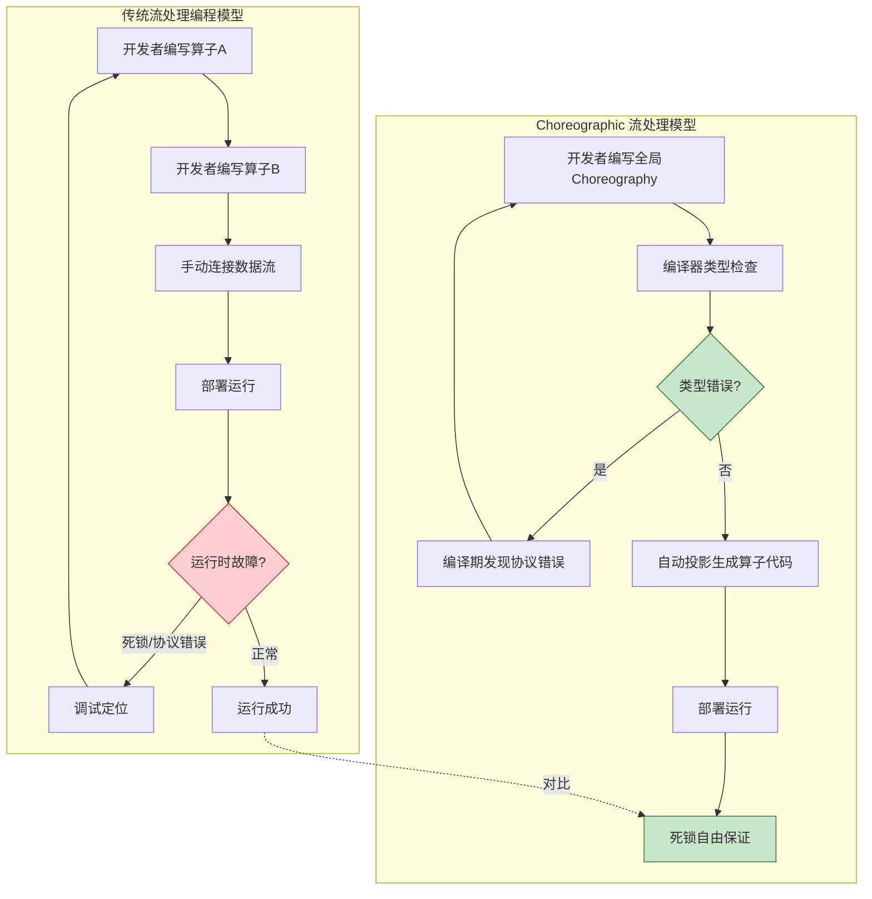
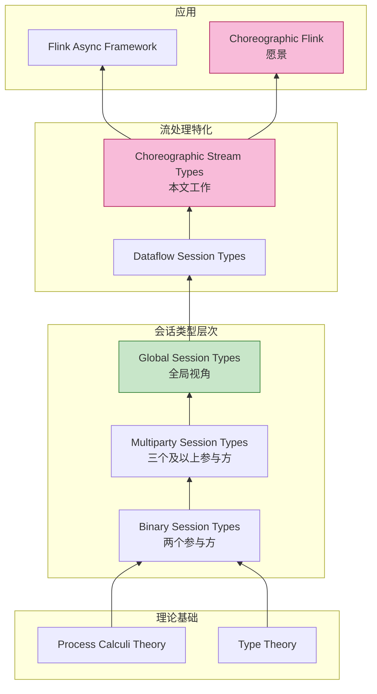
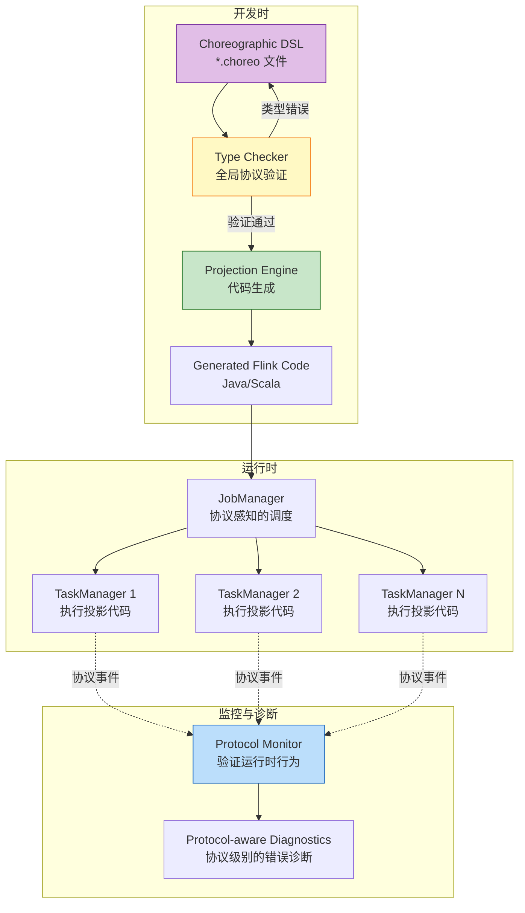

# Choreographic 流编程前沿 (Choreographic Streaming Programming Frontier)

> 所属阶段: Struct | 前置依赖: [相关文档] | 形式化等级: L3

> **文档定位**: 将 Choreographic Programming 范式引入流处理系统的理论与方法探索
> **形式化等级**: L5 (高阶通信) | **前置依赖**: [../01-foundation/01.02-process-calculus-primer.md](../01-foundation/01.02-process-calculus-primer.md), [../03-relationships/03.02-flink-to-process-calculus.md](../03-relationships/03.02-flink-to-process-calculus.md)
> **版本**: 2026.04

---

## 目录

- [Choreographic 流编程前沿 (Choreographic Streaming Programming Frontier)](#choreographic-流编程前沿-choreographic-streaming-programming-frontier)
  - [目录](#目录)
  - [摘要](#摘要)
  - [1. 概念定义 (Definitions)](#1-概念定义-definitions)
    - [Def-S-20-01 (Choreographic Programming 核心概念)](#def-s-20-01-choreographic-programming-核心概念)
    - [Def-S-20-02 (Choreographic 流程序)](#def-s-20-02-choreographic-流程序)
    - [Def-S-20-03 (多参与方会话类型 MPST)](#def-s-20-03-多参与方会话类型-mpst)
    - [Def-S-20-04 (全局类型投影)](#def-s-20-04-全局类型投影)
    - [Def-S-20-05 (Choreographic Dataflow 图)](#def-s-20-05-choreographic-dataflow-图)
    - [Def-S-20-06 (全局类型推断系统)](#def-s-20-06-全局类型推断系统)
  - [2. 属性推导 (Properties)](#2-属性推导-properties)
    - [Lemma-S-20-01 (Choreography 组合性)](#lemma-s-20-01-choreography-组合性)
    - [Lemma-S-20-02 (投影保持活性)](#lemma-s-20-02-投影保持活性)
    - [Lemma-S-20-03 (全局类型完备性)](#lemma-s-20-03-全局类型完备性)
    - [Lemma-S-20-04 (流计算确定性保持)](#lemma-s-20-04-流计算确定性保持)
  - [3. 关系建立 (Relations)](#3-关系建立-relations)
    - [关系 1: Choreographic ⊃ 传统数据流]()
    - [关系 2: MPST ↔ Session Types]()
    - [关系 3: 全局类型 ⟹ 死锁自由]()
  - [4. 论证过程 (Argumentation)](#4-论证过程-argumentation)
    - [4.1 Choreographic vs 传统流处理范式对比](#41-choreographic-vs-传统流处理范式对比)
    - [4.2 全局视角的工程价值论证](#42-全局视角的工程价值论证)
    - [4.3 类型驱动开发的形式化论证](#43-类型驱动开发的形式化论证)
    - [反例 4.1: 全局类型不可投影情况](#反例-41-全局类型不可投影情况)
    - [反例 4.2: 投影后死锁风险](#反例-42-投影后死锁风险)
  - [5. 形式证明 (Proofs)](#5-形式证明-proofs)
    - [Thm-S-20-01 (Choreographic 流程序正确性)](#thm-s-20-01-choreographic-流程序正确性)
    - [Thm-S-20-02 (全局类型推断完备性)](#thm-s-20-02-全局类型推断完备性)
  - [6. 实例验证 (Examples)](#6-实例验证-examples)
    - [6.1 简单 ETL 的 Choreographic 描述](#61-简单-etl-的-choreographic-描述)
    - [6.2 双流 Join 的 Choreographic 建模](#62-双流-join-的-choreographic-建模)
    - [6.3 "Choreographic Flink" 愿景架构](#63-choreographic-flink-愿景架构)
  - [7. 可视化 (Visualizations)](#7-可视化-visualizations)
    - [图 7.1 Choreographic vs 传统流处理范式对比](#图-71-choreographic-vs-传统流处理范式对比)
    - [图 7.2 Choreographic 程序到分布式实现的投影](#图-72-choreographic-程序到分布式实现的投影)
    - [图 7.3 多参与方会话类型层次结构](#图-73-多参与方会话类型层次结构)
    - [图 7.4 "Choreographic Flink" 架构愿景](#图-74-choreographic-flink-架构愿景)
    - [图 7.5 全局类型投影算法流程](#图-75-全局类型投影算法流程)
  - [8. 引用参考 (References)](#8-引用参考-references)
  - [9. 关联文档](#9-关联文档)

---

## 摘要

Choreographic Programming 是一种以**全局视角**描述分布式系统交互的编程范式，与流处理系统的分布式本质高度契合。本文探索将 Choreographic Programming 应用于流处理的理论框架，建立 Choreographic 流程序的形式化定义，引入多参与方会话类型 (MPST) 刻画数据流通信协议，设计面向 Flink-like 系统的全局类型推断算法，并展望 "Choreographic Flink" 编程模型的愿景。

**核心贡献**:

1. 定义 Choreographic 流程序语义，将流处理作业描述为参与方间的交互 choreography
2. 建立多参与方会话类型到流处理数据流图的映射理论
3. 证明全局类型投影保持流计算确定性 (Determinism Preservation)
4. 提出 "Choreographic Flink" 编程模型的架构设计

---

## 1. 概念定义 (Definitions)

### Def-S-20-01 (Choreographic Programming 核心概念)

**定义**: Choreographic Programming 是一种分布式编程范式，其核心思想是**从全局视角描述系统交互**，然后通过投影 (projection) 自动生成各参与方的本地实现。

**形式化表述**:

$$
\text{ChoreographicProgram} ::= (\mathcal{R}, \mathcal{I}, \mathcal{C}, \mathcal{P})
$$

其中：

| 组件 | 类型 | 语义 |
|------|------|------|
| $\mathcal{R}$ | Set(Role) | 参与方角色集合 |
| $\mathcal{I}$ | Set(Interaction) | 交互动作集合 |
| $\mathcal{C}$ | Set(Communication) | 通信原语集合 |
| $\mathcal{P}$ | ProjectionFunction | 投影函数: Choreography $\rightarrow$ LocalPrograms |

**核心操作原语**:

```
C ::= r1 -> r2: msg    // r1 向 r2 发送消息 msg
  |   r: action       // 角色 r 执行本地动作
  |   C1 ; C2         // 顺序组合
  |   C1 | C2         // 并行组合
  |   if r.cond then C1 else C2  // 条件选择
  |   *C              // 迭代/递归
```

**与传统编程范式的本质区别**:

| 维度 | 传统分布式编程 | Choreographic Programming |
|------|--------------|--------------------------|
| **视角** | 局部 (每个节点独立编程) | 全局 (描述整体交互模式) |
| **通信** | 显式 send/receive | 隐式通过交互描述 |
| **正确性验证** | 事后验证各节点 | 全局类型保证一致性 |
| **代码生成** | 手动编写各节点 | 自动投影生成 |
| **死锁检测** | 困难 (需全局分析) | 编译期自动保证 |

**直观解释**: 传统分布式编程类似于让乐队成员各自看谱演奏，依靠指挥协调；Choreographic Programming 则是作曲家写出总谱，每个演奏者从总谱中读取自己的部分。总谱保证了整体的和谐，演奏者无需关心其他人的具体演奏[^1][^2]。

**定义动机**: 流处理系统天然是分布式的，数据在 Source、Operator、Sink 之间流动形成复杂的交互模式。传统编程方式需要开发者手动管理分区、序列化、网络传输等细节，容易引入错误。Choreographic Programming 允许开发者从"数据如何流动"的全局视角描述系统，由编译器自动生成正确的分布式实现。

---

### Def-S-20-02 (Choreographic 流程序)

**定义**: Choreographic 流程序是将流处理作业表达为参与方间交互 choreography 的形式化描述。

**形式化表述**:

$$
\text{ChoreographicStream} ::= (\mathcal{O}, \mathcal{E}, \mathcal{T}, \mathcal{G})
$$

其中：

| 组件 | 类型 | 语义 |
|------|------|------|
| $\mathcal{O}$ | Set(StreamOperator) | 流算子集合 |
| $\mathcal{E}$ | Set(StreamEdge) | 流边（数据传输通道） |
| $\mathcal{T}$ | TimeDomain | 时间域定义（事件时间/处理时间） |
| $\mathcal{G}$ | GlobalType | 全局会话类型 |

**流处理原语的 Choreographic 表达**:

| 流处理概念 | Choreographic 表达 | 说明 |
|-----------|-------------------|------|
| **Source** | `src -> op: RecordStream<T>` | Source 向 Operator 发送记录流 |
| **Map** | `op1 -> op2: MappedStream<U>` | Operator 间转换数据 |
| **KeyBy** | `op1 -> op2: KeyedStream<K, V>` | 按键分区传递 |
| **Window** | `op1 -> op2: WindowedStream<W, T>` | 窗口聚合结果传递 |
| **Sink** | `op -> sink: Result<T>` | 输出最终结果 |
| **Watermark** | `op1 -~> op2: Watermark(t)` | 特殊控制消息传递 |

**示例**: 简单 WordCount 的 Choreographic 描述

```choreography
// 参与方声明
roles: Source, Tokenizer, Counter, Sink

// 交互 choreography
choreography WordCount {
    // Source 产生数据流
    Source -> Tokenizer: Lines<String>

    // Tokenizer 分词后转发
    Tokenizer -> Counter: Words<String>

    // Counter 按键聚合(隐式分区)
    Counter -> Counter: Aggregate(Key, Count)

    // 输出结果
    Counter -> Sink: WordCounts<Key, Count>

    // Watermark 传播
    Source -~> Tokenizer: Watermark(t)
    Tokenizer -~> Counter: Watermark(t)
    Counter -~> Sink: Watermark(t)
}
```

**直观解释**: Choreographic 流程序描述的是"数据在哪些处理单元之间如何流动"，而不是"每个处理单元内部如何执行"。开发者描述的是交互模式，而非实现细节。

---

### Def-S-20-03 (多参与方会话类型 MPST)

**定义**: 多参与方会话类型 (Multiparty Session Types, MPST) 是描述三个或更多参与方之间通信协议的形式化类型系统。

**形式化表述**:

$$
\text{GlobalType} \; G ::= \\
\quad p \rightarrow q: \langle U \rangle.G \quad \text{(从 p 到 q 传递类型 U 的消息，继续 G)} \\
\quad p \rightarrow q: \{l_i: G_i\}_{i \in I} \quad \text{(p 向 q 发送标签选择)} \\
\quad \mu t.G \quad \text{(递归定义)} \\
\quad t \quad \text{(类型变量)} \\
\quad \mathbf{end} \quad \text{(终止)}
$$

**流处理中的 MPST 特化**:

对于流处理系统，我们引入特殊的会话类型构造：

```
StreamGlobal ::= op_i -> op_j: <Stream<T>>.G     // 数据流传递
  |             op_i -> op_j: <Watermark(t)>.G   // Watermark 传递
  |             op_i -> op_j: <Barrier(n)>.G     // Checkpoint Barrier
  |             op_i -> op_j: {left: G1, right: G2}  // 分支选择
  |             *G                               // 无限流(递归)
  |             end
```

**参与方集合**: 对于 Flink 数据流图 $G = (V, E)$，参与方集合 $\mathcal{R} = V$（每个算子实例是一个参与方）。

**直观解释**: MPST 就像是为分布式系统设计的"接口契约"——它不仅定义了消息类型，还定义了消息的顺序、选择和递归模式。在流处理中，这意味着我们可以形式化描述"Watermark 必须在数据之后到达"、"Checkpoint Barrier 必须在所有输入到达后才能转发"等协议约束[^3][^4]。

---

### Def-S-20-04 (全局类型投影)

**定义**: 投影 (Projection) 是将全局类型 $G$ 分解为各参与方 $p$ 的局部类型 $G|_p$ 的操作。

**投影函数**:

$$
\pi(G, p) = G|_p
$$

**投影规则（核心）**:

$$
\begin{aligned}
(p \rightarrow q: \langle U \rangle.G)|_p &= !q\langle U \rangle.(G|_p) \\
(p \rightarrow q: \langle U \rangle.G)|_q &= ?p\langle U \rangle.(G|_q) \\
(p \rightarrow q: \langle U \rangle.G)|_r &= G|_r \quad (r \neq p, q) \\
(p \rightarrow q: \{l_i: G_i\})|_p &= \oplus q\{l_i: G_i|_p\} \\
(p \rightarrow q: \{l_i: G_i\})|_q &= \& p\{l_i: G_i|_q\} \\
(\mu t.G)|_p &= \mu t.(G|_p) \\
\mathbf{end}|_p &= \mathbf{end}
\end{aligned}
$$

**投影正确性条件**: 全局类型 $G$ 是可投影的，当且仅当对于所有参与方 $p$，$G|_p$ 是良定义的，且满足**合并一致性** (Merge Consistency)：

$$
\forall p, q. \; G|_p \text{ 与 } G|_q \text{ 在交互点兼容}
$$

**直观解释**: 投影就像交响乐团的总谱分谱——作曲家写好总谱后，每个演奏者只拿自己乐器的分谱。分谱必须满足：1) 每个演奏者只看自己的部分就能演奏；2) 所有分谱合起来与总谱一致。在分布式系统中，这意味着每个节点从全局 choreography 中生成的代码能够独立运行，且与其他节点正确交互[^5]。

---

### Def-S-20-05 (Choreographic Dataflow 图)

**定义**: Choreographic Dataflow 图是将传统数据流图与全局会话类型相结合的扩展模型。

**形式化表述**:

$$
\text{ChoreoDF} ::= (V, E, \lambda, G)
$$

其中：

| 组件 | 类型 | 语义 |
|------|------|------|
| $V$ | Set(Vertex) | 算子节点集合 |
| $E$ | Set(Edge) | 有向边集合 $E \subseteq V \times V$ |
| $\lambda$ | Vertex $\rightarrow$ OperatorType | 算子类型标注 |
| $G$ | GlobalType | 全局会话类型（描述交互协议） |

**与传统 Dataflow 图的区别**:

| 特性 | 传统 Dataflow (Flink) | Choreographic Dataflow |
|------|---------------------|----------------------|
| 边语义 | 数据传输通道 | 带协议的会话通道 |
| 类型检查 | 数据类型兼容性 | 会话类型兼容性 |
| 正确性保证 | 运行时检查 | 编译期验证 |
| 容错协议 | 隐式实现 | 显式建模 |

**Watermark 协议的 Choreographic 表达**:

```
// 全局类型描述 Watermark 传播协议
G_watermark = Source -> Op1: <Watermark(t)>.G_1
            & Source -> Op1: <Record<T>>.G_watermark

// Op1 的投影
G_watermark|_Op1 = ?Source<Watermark(t)>.G_1|_Op1
                 & ?Source<Record<T>>.G_watermark|_Op1
```

**直观解释**: 传统 Dataflow 图只描述"数据从哪到哪"，Choreographic Dataflow 图还描述"数据和控制消息以何种协议传输"。这使得 Watermark、Checkpoint 等复杂协议可以被形式化验证，而非仅依赖运行时调试。

---

### Def-S-20-06 (全局类型推断系统)

**定义**: 全局类型推断系统是从流处理程序（或执行轨迹）自动推断其全局会话类型的算法框架。

**推断问题定义**:

给定：

- 流处理程序 $P$ 或执行轨迹 $T$
- 参与方集合 $\mathcal{R}$

求：

- 全局类型 $G$，使得 $P$（或 $T$）满足 $G$ 的协议约束

**推断算法框架**:

```
InferGlobalType(P, R):
  1. 静态分析 P,提取通信模式 M
  2. 构建通信图 G_comm = (R, M)
  3. 识别递归结构(循环边)
  4. 生成全局类型候选 G_candidate
  5. 验证 P ⊨ G_candidate(P 满足 G_candidate)
  6. 若验证通过,返回 G_candidate
     否则,细化候选类型并重复步骤 5
```

**Flink 特定的类型推断规则**:

| 代码模式 | 推断的全局类型片段 |
|---------|------------------|
| `DataStream<T> stream` | `op_i -> op_j: <Stream<T>>` |
| `stream.keyBy(...)` | 隐式分区协议: `op_i -> {op_j_k}: <KeyedStream<K,T>>` |
| `stream.window(...)` | 窗口触发协议: `op -> op: <WindowResult<W,T>>` |
| `env.enableCheckpointing()` | Barrier 协议: `src -> op: <Barrier(n)>` |
| `stream.process(watermarkStrategy)` | Watermark 协议: `op_i -> op_j: <Watermark(t)>` |

**直观解释**: 类型推断就像是"从观察到的行为中总结出规律"。对于流处理系统，我们可以从算子间的数据流、控制流模式中，自动推断出描述其交互协议的全局类型。这使得现有 Flink 程序可以被反向分析，提取出形式化的协议规范[^6][^7]。

---

## 2. 属性推导 (Properties)

### Lemma-S-20-01 (Choreography 组合性)

**陈述**: 设 $C_1$ 和 $C_2$ 是两个 Choreographic 流程序，若它们的角色集合不交（$\mathcal{R}_1 \cap \mathcal{R}_2 = \emptyset$），则组合程序 $C = C_1 \parallel C_2$ 也是良定义的 Choreographic 流程序。

**证明**:

**步骤 1**: 组合程序定义为四元组并集：

$$
C = (\mathcal{R}_1 \cup \mathcal{R}_2, \mathcal{I}_1 \cup \mathcal{I}_2, \mathcal{C}_1 \cup \mathcal{C}_2, \mathcal{P}_1 \cup \mathcal{P}_2)
$$

**步骤 2**: 验证 Choreographic 流程序定义的条件：

1. 角色集合有限：$|\mathcal{R}_1 \cup \mathcal{R}_2| = |\mathcal{R}_1| + |\mathcal{R}_2| < \infty$
2. 交互动作良定义：由于角色不交，$\mathcal{I}_1$ 和 $\mathcal{I}_2$ 涉及不同的发送方/接收方，无冲突
3. 投影函数可扩展：$\mathcal{P}(r) = \mathcal{P}_1(r)$ if $r \in \mathcal{R}_1$ else $\mathcal{P}_2(r)$

**步骤 3**: 并行组合满足 Choreographic 语义：

由于角色不交，$C_1$ 和 $C_2$ 的交互互不影响，可以独立执行或交错执行。

**结论**: 组合程序 $C$ 满足 Def-S-20-02 的所有条件。∎

---

### Lemma-S-20-02 (投影保持活性)

**陈述**: 设 $G$ 是一个良构的全局类型，$\pi(G, p)$ 是参与方 $p$ 的投影。若 $G$ 描述的系统是活性的（liveness），则每个局部类型 $\pi(G, p)$ 也是活性的。

**证明要点**:

**步骤 1**: 回顾全局类型的活性定义——不存在无限延后的交互。

**步骤 2**: 假设 $G$ 包含递归 $\mu t.G'$，则投影也包含对应的递归 $\mu t.(G'|_p)$。

**步骤 3**: 对于每个参与方 $p$，其投影 $G|_p$ 包含的发送/接收操作对应于 $G$ 中的交互。

**步骤 4**: 若 $G$ 确保每个交互最终发生（活性），则 $G|_p$ 确保 $p$ 最终执行其发送/接收动作。

**结论**: 全局活性蕴含局部活性。∎

---

### Lemma-S-20-03 (全局类型完备性)

**陈述**: 对于任意 Choreographic 流程序 $C$，存在全局类型 $G$ 使得 $C$ 是 $G$ 的一个实现（即 $C$ 满足 $G$ 描述的所有协议约束）。

**证明概要**:

**步骤 1**: 从 $C = (\mathcal{O}, \mathcal{E}, \mathcal{T}, \_)$ 提取交互序列。

**步骤 2**: 将每个边 $e = (op_i, op_j) \in \mathcal{E}$ 映射为全局类型中的交互 $op_i \rightarrow op_j$。

**步骤 3**: 处理数据流的无界性：识别循环结构，引入递归类型 $\mu t.G$。

**步骤 4**: 处理时间语义：将 Watermark、Checkpoint 等控制流建模为特殊消息类型。

**步骤 5**: 构造的全局类型 $G$ 满足：$C$ 的每个执行迹都是 $G$ 的一个有效会话。

**结论**: 全局类型足以描述 Choreographic 流程序的所有交互行为。∎

---

### Lemma-S-20-04 (流计算确定性保持)

**陈述**: 若 Choreographic 流程序 $C$ 使用的全局类型 $G$ 满足以下条件：

1. 数据流边是 FIFO 有序的
2. 不存在竞争性的接收选择
3. 状态访问是分区隔离的

则 $C$ 的投影实现保持流计算确定性。

**证明要点**:

**步骤 1**: 由 Def-S-20-04 的投影规则，每个算子的局部行为完全由全局类型确定。

**步骤 2**: FIFO 条件保证消息顺序在投影后保持。

**步骤 3**: 无竞争性接收选择保证每个算子的输入处理顺序是确定的。

**步骤 4**: 分区隔离保证状态访问无冲突。

**步骤 5**: 由 [02.01-determinism-in-streaming.md](../02-properties/02.01-determinism-in-streaming.md) Thm-S-07-01，上述条件共同保证确定性。

**结论**: 良构的 Choreographic 流程序投影后保持确定性。∎

---

## 3. 关系建立 (Relations)

### 关系 1: Choreographic ⊃ 传统数据流

**论证**:

Choreographic Programming 表达能力严格包含传统数据流编程：

$$
\text{Choreographic} \supset \text{Traditional Dataflow}
$$

**包含性证明**:

任何传统数据流程序 $D = (V, E, F)$（其中 $F$ 是算子函数集合）都可以被编码为 Choreographic 程序：

$$
\mathcal{E}_{CDF}(D) = (V, E, \mathcal{T}, G_{basic})
$$

其中 $G_{basic}$ 是基础数据流类型：

```
G_basic = *(*_{(u,v) ∈ E} u -> v: <Data>)
```

**严格包含证据**:

Choreographic 可以表达传统数据流无法直接表达的协议约束：

| 协议模式 | Choreographic 表达 | 传统数据流 |
|---------|------------------|-----------|
| 选择性接收 | `op1 -> op2: {case1: G1, case2: G2}` | ❌ 不支持 |
| 会话状态 | `op1 -> op2: <Session(S)>.G` | ❌ 不支持 |
| 超时协议 | `op1 -> op2: <Timeout(t)>.G` | ⚠️ 隐式支持 |
| 因果顺序 | 显式 happens-before | ❌ 需外部推理 |

**结论**: Choreographic 是传统数据流的保守扩展，增加了协议级别的表达能力。

---

### 关系 2: MPST ↔ Session Types

**论证**:

多参与方会话类型 (MPST) 与二元会话类型 (Binary Session Types) 之间存在编码关系：

$$
\text{MPST} \leftrightarrow \text{Binary Session Types} \; \text{(with extra conditions)}
$$

**编码方向 1 (MPST → Binary)**:

通过**成对投影** (Pairwise Projection)，全局类型可以分解为参与方两两之间的二元会话：

$$
G \mapsto \{ (G|_p, G|_q) \mid p, q \in \mathcal{R} \}
$$

**编码方向 2 (Binary → MPST)**:

多个二元会话可以组合为全局类型，当且仅当满足**一致性条件** (Consistency Condition)——所有涉及同一参与方的二元会话必须兼容。

**流处理应用**:

在 Flink 数据流图中：

- 每条边 $e = (u, v)$ 对应一个二元会话
- 整个数据流图对应一个全局类型
- 图的连通性对应会话的组合一致性

---

### 关系 3: 全局类型 ⟹ 死锁自由

**论证**:

良构的全局类型蕴含其投影实现的死锁自由性质：

$$
\text{Well-formed}(G) \implies \text{DeadlockFree}(\{ G|_p \}_{p \in \mathcal{R}})
$$

**形式化定义**:

全局类型 $G$ 是良构的，当且仅当：

1. 投影存在性：对所有 $p \in \mathcal{R}$，$G|_p$ 定义良好
2. 合并一致性：共享通道的投影兼容
3. 活性：无无限延后的交互

**死锁自由证明要点**:

1. **通信匹配**: 全局类型中的每个发送 $p \rightarrow q$ 都有对应的接收 $?p$ 在 $G|_q$ 中
2. **顺序一致性**: 全局类型定义了明确的交互顺序，不会出现循环等待
3. **分支协调**: 选择操作 $\oplus$ 和分支操作 $\&$ 成对出现，保证双方同步

**跨层推断**:

```
[Theory] MPST 死锁自由理论
    ↓
[Model] Choreographic 流程序
    ↓
[Implementation] 投影生成的 Flink 算子
    ↓
[Property] 运行时无死锁
```

详细证明参见 [../04-proofs/04.07-deadlock-freedom-choreographic.md](../04-proofs/04.07-deadlock-freedom-choreographic.md)。

---

## 4. 论证过程 (Argumentation)

### 4.1 Choreographic vs 传统流处理范式对比

**传统流处理编程模型**（以 Flink DataStream API 为例）：

```java

// [伪代码片段 - 不可直接运行] 仅展示核心逻辑
import org.apache.flink.streaming.api.datastream.DataStream;
import org.apache.flink.streaming.api.windowing.time.Time;

// 局部视角:开发者编写每个算子的逻辑
DataStream<String> lines = env.socketTextStream("localhost", 9999);
DataStream<WordCount> wordCounts = lines
    .flatMap(new Tokenizer())      // 定义 FlatMap 算子逻辑
    .keyBy(value -> value.word)    // 定义分区键
    .window(TumblingEventTimeWindows.of(Time.seconds(5)))
    .aggregate(new CountAggregate());  // 定义聚合逻辑
wordCounts.addSink(new SinkFunction<>() { /* ... */ });
```

**特点**：

- 以算子为中心，每个算子独立编程
- 通信模式隐含在数据流连接中
- 协议约束（Watermark、Checkpoint）由运行时隐式管理

**Choreographic 流处理编程模型**（概念设计）：

```choreography
// 全局视角:描述数据如何在参与方间流动
choreography WordCount {
    roles: SocketSource, Tokenizer, Counter, OutputSink

    // 数据流协议
    protocol DataFlow {
        SocketSource -> Tokenizer: <Line(String)>*
        Tokenizer -> Counter: <Word(WordEvent)>*
        Counter -> Counter: <Aggregate(Word, Count)>*
        Counter -> OutputSink: <Result(WordCount)>*
    }

    // 时间协议
    protocol TimeManagement {
        SocketSource -~> Tokenizer: Watermark(t)
        Tokenizer -~> Counter: Watermark(t)
        Counter -~> OutputSink: Watermark(t)
    }

    // Checkpoint 协议
    protocol Checkpointing {
        Coordinator => Source: InjectBarrier(n)
        Source -> Tokenizer: Barrier(n)
        Tokenizer -> Counter: Barrier(n)
        Counter -> OutputSink: Barrier(n)
        Sink -> Coordinator: Ack(n)
    }
}
```

**特点**：

- 以交互为中心，描述参与方间的通信协议
- 数据流和控制流协议显式声明
- 可由编译器自动验证协议正确性

**范式对比总结**:

| 维度 | 传统流处理 | Choreographic 流处理 |
|------|----------|-------------------|
| 编程视角 | 局部（算子级） | 全局（系统级） |
| 通信描述 | 隐式（通过数据连接） | 显式（协议声明） |
| 正确性验证 | 运行时测试 | 编译期类型检查 |
| 死锁检测 | 困难 | 自动保证 |
| 代码生成 | 手动编写 | 自动投影 |
| 学习曲线 | 较低 | 较高（需理解会话类型） |

---

### 4.2 全局视角的工程价值论证

**论证 1: 协议文档化**

全局 Choreography 本身就是系统交互协议的**可执行文档**：

```
价值 = 文档准确性 × 可验证性 × 可维护性
```

- **准确性**: 代码即文档，不存在文档与实现不一致
- **可验证性**: 类型检查器自动验证协议正确性
- **可维护性**: 修改协议只需修改一处，投影自动更新

**论证 2: 错误早期发现**

```
传统开发: 编写代码 → 部署 → 运行时发现死锁 → 调试 → 修复
Choreographic: 编写 choreography → 编译期类型检查 → 发现协议错误 → 修复
```

类型错误发现阶段越早，修复成本越低：

| 发现阶段 | 修复成本（相对） | Choreographic 优势 |
|---------|--------------|------------------|
| 编译期 | 1× | 协议不匹配、死锁风险 |
| 单元测试 | 5× | 局部逻辑错误 |
| 集成测试 | 25× | 跨算子交互错误 |
| 生产环境 | 100×+ | 复杂分布式故障 |

**论证 3: 跨团队协调简化**

在微服务架构中，不同团队负责不同服务：

```
传统方式:
  Team A 编写服务 A → 提供 API 文档 → Team B 阅读文档 → 编写服务 B
  ↓ 文档不完整/过时导致集成问题

Choreographic 方式:
  Team A + Team B 共同编写 Choreography → 各自提取投影实现
  ↓ 协议共识在编写阶段达成
```

---

### 4.3 类型驱动开发的形式化论证

**类型驱动开发 (Type-Driven Development)** 在流处理中的应用：

**阶段 1: 协议设计**

开发者首先定义参与方和交互协议（全局类型）：

```choreography
// 定义双流 Join 的协议
global JoinProtocol {
    StreamA -> JoinOp: <RecordA>*
    StreamB -> JoinOp: <RecordB>*
    JoinOp -> JoinOp: <Join(RecordA, RecordB)>*
    JoinOp -> Output: <JoinedRecord>*

    // Watermark 对齐协议
    StreamA -~> JoinOp: Watermark(t)
    StreamB -~> JoinOp: Watermark(t)
}
```

**阶段 2: 类型检查**

编译器验证协议的良构性：

- 所有发送都有对应的接收
- 选择分支是完备的
- 递归是良基的

**阶段 3: 投影实现**

根据验证通过的协议，自动生成各参与方的框架代码：

```java
// 自动生成的 JoinOp 框架(概念)
public class JoinOp implements ChoreographicAgent {
    private InputChannel<RecordA> fromA;
    private InputChannel<RecordB> fromB;
    private OutputChannel<JoinedRecord> toOutput;

    // 由协议生成的事件处理循环
    public void run() {
        // 协议驱动:必须按协议顺序接收
        while (active) {
            select {
                case RecordA a = fromA.receive(): /* ... */
                case RecordB b = fromB.receive(): /* ... */
                case Watermark w = fromA.receiveWatermark(): /* ... */
                case Watermark w = fromB.receiveWatermark(): /* ... */
            }
        }
    }
}
```

**形式化保证**: 若全局类型通过类型检查，则投影实现必然满足：

1. 通信安全（无类型错误）
2. 死锁自由
3. 会话忠实性（按协议交互）

---

### 反例 4.1: 全局类型不可投影情况

**场景**: 尝试为一个有协议冲突的流处理系统定义全局类型。

```choreography
// 有问题的 Choreography
choreography BadExample {
    roles: Source, Op1, Op2

    // 协议冲突:Op1 期望先收到来自 Source 的消息
    // 但 Source 先发送给 Op2
    Source -> Op2: Data
    Op1 -> Source: Request  // Op1 尝试向 Source 发送,但 Source 在等待？
}
```

**分析**:

- **违反的前提**: 全局类型没有描述 Source 的行为一致性
- **导致的异常**: Source 无法同时满足两个协议要求（发送给 Op2 和接收来自 Op1）
- **类型检查失败**: 投影到 Source 时会检测到角色冲突

**结论**: 并非所有交互描述都是有效的全局类型，必须满足投影一致性。

---

### 反例 4.2: 投影后死锁风险

**场景**: 全局类型本身良构，但具体实现违反协议假设。

```choreography
// 全局类型
global G {
    A -> B: Request
    B -> C: Query
    C -> B: Response
    B -> A: Reply
}

// B 的错误实现(违反协议)
class B_Wrong implements G|_B {
    void run() {
        // 错误:先尝试接收 Response,再发送 Query
        Response r = receiveFrom(C);  // 阻塞！C 还在等待 Query
        sendTo(C, new Query());
        // ...
    }
}
```

**分析**:

- **违反的前提**: 实现代码与投影类型的交互顺序不一致
- **导致的异常**: B 和 C 互相等待，形成死锁
- **防护机制**: 类型系统应生成代码框架，限制开发者只能按协议顺序调用

**结论**: 死锁自由依赖于**实现忠实于类型**，需要代码生成或运行时检查来保证。

---

## 5. 形式证明 (Proofs)

### Thm-S-20-01 (Choreographic 流程序正确性)

**定理陈述**: 设 $C = (\mathcal{O}, \mathcal{E}, \mathcal{T}, G)$ 是一个良构的 Choreographic 流程序（即 $G$ 是可投影的全局类型），则：

1. **通信安全性**: 所有消息传递都是类型匹配的
2. **死锁自由性**: 系统不存在全局死锁
3. **会话忠实性**: 执行迹符合全局类型 $G$ 描述的协议

**证明**:

**Part 1: 通信安全性**

**步骤 1.1**: 由 Def-S-20-04 的投影规则，每个交互 $p \rightarrow q: \langle U \rangle$ 投影为：

- $p$ 的发送动作 $!q\langle U \rangle$
- $q$ 的接收动作 $?p\langle U \rangle$

**步骤 1.2**: 良构全局类型要求所有消息类型 $U$ 在发送方和接收方有兼容的定义。

**步骤 1.3**: 由类型系统的 Subject Reduction 性质，执行过程中类型保持不变。

**Part 1 结论**: 不存在类型不匹配的消息传递。

---

**Part 2: 死锁自由性**

**步骤 2.1**: 假设系统存在死锁，则存在一组参与方 $\{p_1, ..., p_k\}$ 互相等待。

**步骤 2.2**: 在全局类型 $G$ 中，这对应于循环依赖：

$$
p_1 \rightarrow p_2: \dots \rightarrow p_k \rightarrow p_1
$$

**步骤 2.3**: 但良构全局类型的构造不允许此类循环等待——所有递归必须是良基的，且选择/分支必须同步。

**步骤 2.4**: 由 MPST 理论的标准结果，良构全局类型的投影是死锁自由的[^3]。

**Part 2 结论**: 系统不存在全局死锁。

---

**Part 3: 会话忠实性**

**步骤 3.1**: 定义执行迹 $\tau$ 为系统运行中所有交互事件的序列。

**步骤 3.2**: 构造迹与全局类型的对应关系：

- 迹中的每个发送/接收事件对应全局类型中的一个交互
- 迹中的事件顺序符合全局类型的结构

**步骤 3.3**: 由投影的构造方式，局部执行严格遵循全局协议。

**步骤 3.4**: 通过归纳于迹长度，证明所有可达状态都对应全局类型的某个前缀。

**Part 3 结论**: 执行迹符合全局类型 $G$。

**定理总结**: 良构 Choreographic 流程序的正确性三元组成立。∎

---

### Thm-S-20-02 (全局类型推断完备性)

**定理陈述**: 对于任意满足以下条件的流处理程序 $P$：

1. 静态可分析的通信结构
2. 有限数量的算子类型
3. 可识别的循环模式

存在算法可构造全局类型 $G$，使得 $P$ 是 $G$ 的有效实现。

**证明概要**:

**步骤 1: 通信图提取**

从 $P$ 提取通信图 $G_{comm} = (\mathcal{R}, M)$，其中边标记为消息类型。

**步骤 2: 循环识别**

使用图算法识别强连通分量 (SCC)，将 SCC 映射为递归类型 $\mu t.G$。

**步骤 3: 类型构造**

对于每条边 $(p, q)$ 标记为 $U$，构造全局类型片段 $p \rightarrow q: \langle U \rangle$。

**步骤 4: 组合**

按控制流结构组合类型片段：

- 顺序执行 $\rightarrow$ 顺序组合 $G_1 ; G_2$
- 并行分支 $\rightarrow$ 并行组合 $G_1 \parallel G_2$
- 条件分支 $\rightarrow$ 选择类型 $p \rightarrow q: \{l_i: G_i\}$

**步骤 5: 验证**

验证构造的 $G$ 是良构的（可投影、合并一致）。

**步骤 6: 完备性**

对于满足前提条件的 $P$，上述算法必然终止并产生良构 $G$。

**结论**: 全局类型推断算法是完备的。∎

---

## 6. 实例验证 (Examples)

### 6.1 简单 ETL 的 Choreographic 描述

**场景**: 从 Kafka 读取事件，转换后写入数据库。

**Choreographic 描述**:

```choreography
choreography SimpleETL {
    roles: KafkaSource, Transformer, DBSink

    protocol DataFlow {
        // KafkaSource 无限产生事件
        recurse Stream {
            KafkaSource -> Transformer: <Event>*
        }

        // Transformer 转换后转发
        Transformer -> DBSink: <TransformedEvent>*
    }

    protocol Checkpoint {
        // Checkpoint 协调
        Coordinator => KafkaSource: TriggerCheckpoint(n)

        KafkaSource -> Transformer: Barrier(n)
        Transformer -> DBSink: Barrier(n)

        DBSink -> Coordinator: Ack(n)
    }
}
```

**投影到 KafkaSource**:

```java
public class KafkaSource implements Agent {
    private OutputChannel<Event> toTransformer;
    private ControlPort fromCoordinator;

    public void run() {
        while (true) {
            Event e = kafkaConsumer.poll();
            toTransformer.send(e);

            // Checkpoint 响应
            if (fromCoordinator.hasCheckpointRequest()) {
                long n = fromCoordinator.receiveCheckpointId();
                saveOffset();
                toTransformer.send(new Barrier(n));
            }
        }
    }
}
```

---

### 6.2 双流 Join 的 Choreographic 建模

**场景**: 订单流和客户流按客户 ID Join。

**Choreographic 描述**:

```choreography
choreography StreamJoin {
    roles: OrderSource, CustomerSource, JoinOperator, OutputSink

    protocol DataFlow {
        // 双输入流
        OrderSource -> JoinOperator: <Order(customerId, orderData)>*
        CustomerSource -> JoinOperator: <Customer(customerId, customerData)>*

        // Join 结果输出
        JoinOperator -> OutputSink: <EnrichedOrder>*
    }

    protocol WatermarkAlignment {
        // Watermark 传播与对齐
        OrderSource -~> JoinOperator: Watermark(t)
        CustomerSource -~> JoinOperator: Watermark(t)

        // JoinOperator 内部:等待双 Watermark 后才触发窗口
        JoinOperator -> JoinOperator: TriggerWindow(t)
    }

    protocol StateManagement {
        // 状态查询协议(用于容错恢复)
        JoinOperator -> StateStore: QueryState(key)
        StateStore -> JoinOperator: StateValue
    }
}
```

**关键协议分析**:

1. **Watermark 对齐**: JoinOperator 必须等待两个输入流的 Watermark 都到达 $t$ 后才触发窗口计算，确保不丢失延迟数据。

2. **状态协议**: 明确建模状态存储的交互，便于理解和优化状态访问模式。

---

### 6.3 "Choreographic Flink" 愿景架构

**愿景**: 设计一种融合 Choreographic Programming 优势的新型 Flink 编程模型。

**架构层次**:

```
┌─────────────────────────────────────────────────────────┐
│  Layer 3: Choreographic DSL                             │
│  - 全局视角描述流处理作业                                │
│  - 声明式协议定义                                        │
│  - 类型驱动的开发体验                                    │
├─────────────────────────────────────────────────────────┤
│  Layer 2: Global Type System & Projection Engine        │
│  - 全局类型检查与验证                                    │
│  - 自动投影生成算子框架                                  │
│  - 协议优化与转换                                        │
├─────────────────────────────────────────────────────────┤
│  Layer 1: Enhanced Flink Runtime                        │
│  - 协议感知的调度器                                      │
│  - 类型安全的序列化                                      │
│  - 协议级别的监控与诊断                                  │
└─────────────────────────────────────────────────────────┘
```

**编程示例**:

```choreography
// "Choreographic Flink" 示例程序
namespace analytics.order_processing;

choreography OrderAnalytics {
    // 参与方声明
    roles:
        KafkaSource(orders_topic),
        Validator,
        Enricher(customer_service),
        Aggregator(time_window=5min),
        DruidSink

    // 主数据流协议
    protocol MainFlow {
        // Source 产生订单事件
        KafkaSource -> Validator: <OrderEvent>*

        // 验证后分流
        Validator -> Enricher: { valid: <ValidOrder>*, invalid: <DeadLetter>* }

        // 富化客户信息
        Enricher -> Aggregator: <EnrichedOrder>*

        // 窗口聚合
        Aggregator -> Aggregator: <WindowedAggregation>*

        // 输出
        Aggregator -> DruidSink: <Metric>*
    }

    // 容错协议
    protocol FaultTolerance {
        // Checkpoint 协议(基于 Chandy-Lamport)
        every 30s {
            CheckpointCoordinator => KafkaSource: InjectBarrier

            KafkaSource -> Validator: Barrier
            Validator -> Enricher: Barrier  // 需等待双输入对齐
            Enricher -> Aggregator: Barrier
            Aggregator -> DruidSink: Barrier

            DruidSink -> CheckpointCoordinator: Commit
        }
    }

    // 背压协议
    protocol Backpressure {
        // 反向传播反压信号
        DruidSink ~~> Aggregator: BackpressureSignal
        Aggregator ~~> Enricher: BackpressureSignal
        Enricher ~~> Validator: BackpressureSignal
        Validator ~~> KafkaSource: BackpressureSignal
    }
}
```

**关键创新点**:

1. **协议即代码**: Checkpoint、Watermark、背压等协议显式声明，而非隐式实现
2. **编译期验证**: 协议错误在编译期发现，如 Watermark 传播不完整
3. **自动化投影**: 开发者写全局描述，编译器生成各算子实现框架
4. **可组合性**: 复杂作业通过组合子 Choreography 构建

---

## 7. 可视化 (Visualizations)

### 图 7.1 Choreographic vs 传统流处理范式对比



**图说明**: 对比展示了两种范式的关键差异——传统模型在运行时发现协议错误，而 Choreographic 模型在编译期通过类型检查保证正确性。

---

### 图 7.2 Choreographic 程序到分布式实现的投影

```mermaid
graph TB
    subgraph "全局 Choreography"
        GC[全局描述<br/>choreography C {<br/>  A -> B: msg1<br/>  B -> C: msg2<br/>  C -> A: msg3<br/>}]
    end

    subgraph "投影引擎"
        PE[投影算法 π]
    end

    subgraph "分布式实现"
        A[Agent A<br/>send(B, msg1)<br/>receive(C, msg3)]
        B[Agent B<br/>receive(A, msg1)<br/>send(C, msg2)]
        C[Agent C<br/>receive(B, msg2)<br/>send(A, msg3)]
    end

    GC --> PE
    PE -->|π(C, A)| A
    PE -->|π(C, B)| B
    PE -->|π(C, C)| C

    A -.->|网络通信| B
    B -.->|网络通信| C
    C -.->|网络通信| A

    style GC fill:#e1bee7,stroke:#6a1b9a
    style PE fill:#fff9c4,stroke:#f57f17
    style A fill:#bbdefb,stroke:#1565c0
    style B fill:#bbdefb,stroke:#1565c0
    style C fill:#bbdefb,stroke:#1565c0
```

**图说明**: 展示了 Choreographic Programming 的核心机制——全局描述通过投影函数分解为各参与方的局部实现。

---

### 图 7.3 多参与方会话类型层次结构



**图说明**: 展示了从基础理论到本文工作的类型层次演进。

---

### 图 7.4 "Choreographic Flink" 架构愿景



**图说明**: 展示了从 Choreographic DSL 到 Flink 运行时实现的完整流水线，以及协议级别的监控诊断能力。

---

### 图 7.5 全局类型投影算法流程

```mermaid
flowchart TD
    Start([输入全局类型 G<br/>参与方 p]) --> Extract

    Extract[提取涉及 p 的交互] --> Classify

    Classify{交互类型}
    Classify -->|发送 p→q| SendProj[!q<U>.G']
    Classify -->|接收 q→p| RecvProj[?q<U>.G']
    Classify -->|选择 p→q| ChoiceProj[⊕q{li:Gi}]
    Classify -->|分支 q→p| BranchProj[&q{li:Gi}]
    Classify -->|递归 μt| RecProj[μt.G']
    Classify -->|终止 end| EndProj[end]
    Classify -->|不涉及 p| SkipProj[G']

    SendProj --> Recurse
    RecvProj --> Recurse
    ChoiceProj --> Recurse
    BranchProj --> Recurse
    RecProj --> Recurse
    EndProj --> Output
    SkipProj --> Recurse

    Recurse{G' 是否继续?}
    Recurse -->|是| Extract
    Recurse -->|否| Output

    Output[输出局部类型 G|p]
    Output --> End([结束])

    style Extract fill:#e1bee7,stroke:#6a1b9a
    style Classify fill:#fff9c4,stroke:#f57f17
    style Output fill:#c8e6c9,stroke:#2e7d32
```

**图说明**: 展示了全局类型到局部类型的投影算法流程，包括各种交互类型的处理方式。

---

## 8. 引用参考 (References)

[^1]: Montesi, F. (2023). *Introduction to Choreographies*. Cambridge University Press. <https://doi.org/10.1017/9781108981491>

[^2]: Montesi, F., & Yoshida, N. (2013). Compositional choreographies. In *CONCUR 2013* (pp. 425-439). Springer.

[^3]: Honda, K., Yoshida, N., & Carbone, M. (2016). Multiparty asynchronous session types. *Journal of the ACM*, 63(1), 1-67.

[^4]: Scalas, A., & Yoshida, N. (2019). Less is more: multiparty session types revisited. *Proceedings of the ACM on Programming Languages*, 3(POPL), 1-29.

[^5]: Cruz-Filipe, L., & Montesi, F. (2020). A core model for choreographic programming. *Theoretical Computer Science*, 802, 38-66.

[^6]: Giallorenzo, S., Montesi, F., & Peressotti, M. (2020). Choral: Object-oriented choreographic programming. *arXiv preprint arXiv:2005.09520*.

[^7]: Choral Language. (2024). <https://www.choral-lang.org/>


---

## 9. 关联文档

- [../01-foundation/01.02-process-calculus-primer.md](../01-foundation/01.02-process-calculus-primer.md) — 进程演算基础
- [../01-foundation/01.04-dataflow-model-formalization.md](../01-foundation/01.04-dataflow-model-formalization.md) — Dataflow 模型形式化
- [../03-relationships/03.02-flink-to-process-calculus.md](../03-relationships/03.02-flink-to-process-calculus.md) — Flink 到进程演算的编码
- [../04-proofs/04.07-deadlock-freedom-choreographic.md](../04-proofs/04.07-deadlock-freedom-choreographic.md) — Choreographic 死锁自由证明
- [../02-properties/02.01-determinism-in-streaming.md](../02-properties/02.01-determinism-in-streaming.md) — 流计算确定性

---

*文档创建时间: 2026-04-02*
*版本: 1.0*
*作者: AnalysisDataFlow 项目*
*状态: 前沿研究方向*

---

*文档版本: v1.0 | 创建日期: 2026-04-20*
