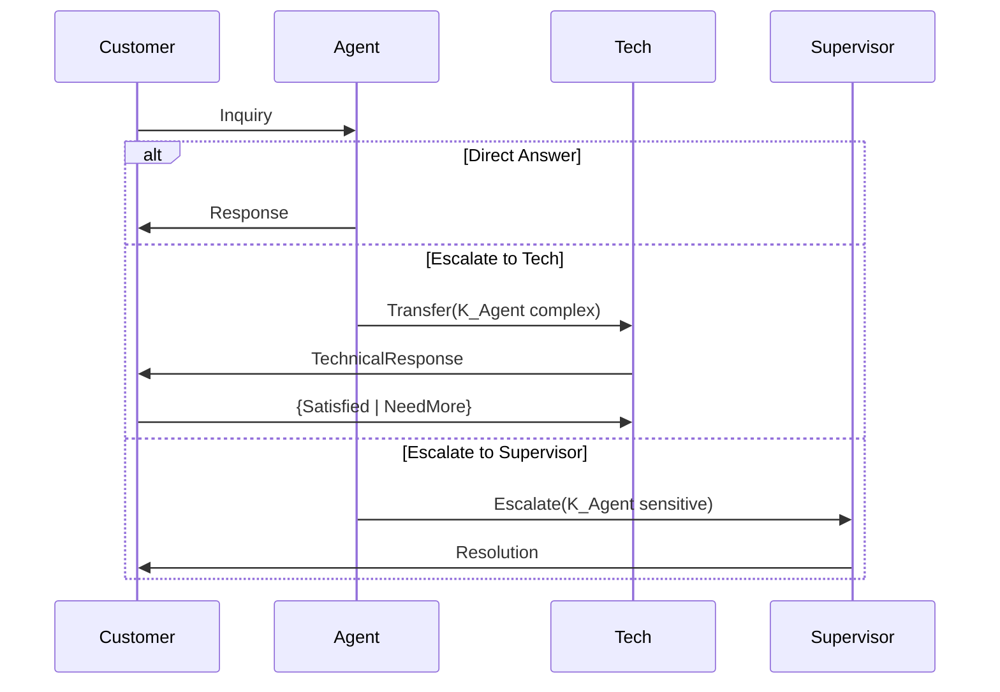
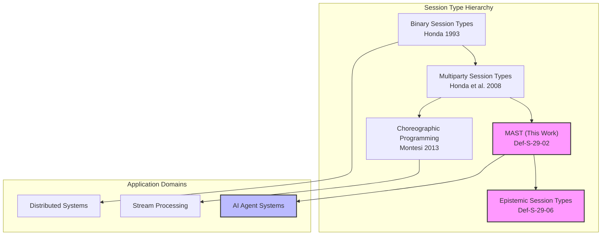
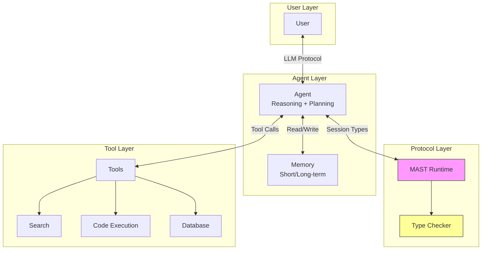

> **状态**: 🔮 前瞻内容 | **风险等级**: 高 | **最后更新**: 2026-04
> 
> 此文档描述的内容处于早期规划阶段，可能与最终实现不符。请以 Apache Flink 官方发布为准。
# AI Agent 与会话类型 (AI Agent and Session Types) {#ai-agent-与会话类型}

> **所属阶段**: Struct/06-frontier | **前置依赖**: [../04-proofs/04.07-deadlock-freedom-choreographic.md](../04-proofs/04.07-deadlock-freedom-choreographic.md), [../06-frontier/06.02-choreographic-streaming-programming.md](../06-frontier/06.02-choreographic-streaming-programming.md) | **形式化等级**: L5 | **理论框架**: MPST + LLM-Agent Interaction

---

## 目录

- [AI Agent 与会话类型 (AI Agent and Session Types)](#ai-agent-与会话类型)
  - [目录](#目录)
  - [摘要](#摘要)
  - [1. 概念定义 (Definitions)](#1-概念定义-definitions)
    - [Def-S-29-01. AI Agent 形式化模型](#def-s-29-01-ai-agent-形式化模型)
    - [Def-S-29-02. Multi-Agent 会话类型 (MAST)](#def-s-29-02-multi-agent-会话类型-mast)
    - [Def-S-29-03. LLM-Agent 交互协议](#def-s-29-03-llm-agent-交互协议)
    - [Def-S-29-04. 类型安全 Agent 通信](#def-s-29-04-类型安全-agent-通信)
    - [Def-S-29-05. Agent 协议验证框架](#def-s-29-05-agent-协议验证框架)
    - [Def-S-29-06. 认知会话类型 (Epistemic Session Types)](#def-s-29-06-认知会话类型-epistemic-session-types)
  - [2. 属性推导 (Properties)](#2-属性推导-properties)
    - [Lemma-S-29-01. Agent 投影保持性](#lemma-s-29-01-agent-投影保持性)
    - [Lemma-S-29-02. LLM 响应类型完备性](#lemma-s-29-02-llm-响应类型完备性)
    - [Lemma-S-29-03. 多 Agent 合流性](#lemma-s-29-03-多-agent-合流性)
    - [Lemma-S-29-04. 协议组合安全性](#lemma-s-29-04-协议组合安全性)
    - [Prop-S-29-01. Agent 系统死锁自由](#prop-s-29-01-agent-系统死锁自由)
    - [Prop-S-29-02. 认知一致性保持](#prop-s-29-02-认知一致性保持)
  - [3. 关系建立 (Relations)](#3-关系建立-relations)
    - [关系 1: MAST ↔ 传统 MPST {#关系-1-mast--传统-mpst}](#关系-1-mast--传统-mpst)
    - [关系 2: LLM-Agent Protocol ↦ Choreography {#关系-2-llm-agent-protocol--choreography}](#关系-2-llm-agent-protocol--choreography)
    - [关系 3: Type-safe Agent Communication ↦ Deadlock Freedom {#关系-3-type-safe-agent-communication--deadlock-freedom}](#关系-3-type-safe-agent-communication--deadlock-freedom)
  - [4. 论证过程 (Argumentation)](#4-论证过程-argumentation)
    - [4.1 Multi-Agent 交互的核心挑战](#41-multi-agent-交互的核心挑战)
    - [4.2 LLM 非确定性与会话类型的调和](#42-llm-非确定性与会话类型的调和)
    - [4.3 类型安全与灵活性的权衡](#43-类型安全与灵活性的权衡)
    - [反例 4.1: 协议不匹配导致的 Agent 死锁](#反例-41-协议不匹配导致的-agent-死锁)
    - [反例 4.2: LLM 幻觉导致的类型违反](#反例-42-llm-幻觉导致的类型违反)
  - [5. 形式证明 (Proofs)](#5-形式证明-proofs)
    - [Thm-S-29-01. AI Agent 系统死锁自由定理](#thm-s-29-01-ai-agent-系统死锁自由定理)
  - [6. 实例验证 (Examples)](#6-实例验证-examples)
    - [6.1 客服多 Agent 系统的会话类型建模](#61-客服多-agent-系统的会话类型建模)
    - [6.2 代码生成 Agent 的交互协议](#62-代码生成-agent-的交互协议)
    - [6.3 研究助手 Agent 的协作协议](#63-研究助手-agent-的协作协议)
  - [7. 可视化 (Visualizations)](#7-可视化-visualizations)
    - [图 7.1: Multi-Agent 协议交互图](#图-71-multi-agent-协议交互图)
    - [图 7.2: 会话类型层次结构](#图-72-会话类型层次结构)
    - [图 7.3: LLM-Agent 交互协议架构](#图-73-llm-agent-交互协议架构)
  - [8. 引用参考 (References)](#8-引用参考-references)

---

## 摘要

随着大型语言模型 (LLM) 驱动的 AI Agent 系统的快速发展，多 Agent 之间的协调与通信成为核心挑战。
本文将**多参与方会话类型 (Multiparty Session Types, MPST)** 理论扩展至 AI Agent 领域，建立形式化的 Agent 交互协议框架。
核心贡献包括：
(1) 定义 AI Agent 的形式化模型，刻画其基于 LLM 的认知能力与非确定性行为；
(2) 提出 Multi-Agent 会话类型 (MAST)，支持动态角色与自适应协议；
(3) 设计 LLM-Agent 交互协议的类型系统，在保持灵活性的同时提供静态保证；
(4) 建立 Agent 协议验证框架，证明类型安全的多 Agent 系统具有死锁自由性。
本文工作为构建可验证、可维护的大规模 AI Agent 系统奠定理论基础。

**关键词**: AI Agent, LLM, Session Types, Multi-Agent Systems, Protocol Verification, Deadlock Freedom

---

## 1. 概念定义 (Definitions)

本节建立在 Honda 等人的 Session Types 理论[^1]、Montesi 的 Choreographic Programming[^2] 以及近期 LLM-based Agent 研究[^3][^4] 基础之上，建立 AI Agent 与会话类型交叉领域的严格数学定义。

---

### Def-S-29-01. AI Agent 形式化模型

**定义**: AI Agent 是一个基于大型语言模型 (LLM) 的自主计算实体，具备感知、推理、决策和执行能力。

**形式化表述**:

$$
\mathcal{A} ::= (S, L, M, \pi, \delta, \lambda)
$$

其中各组件的语义如下表所示：

| 组件 | 类型 | 语义说明 |
|------|------|----------|
| $S$ | State | Agent 的内部状态空间，包括工作记忆、长期记忆、知识库 |
| $L$ | LLM | 底层语言模型 $L: \mathcal{P}(S) \rightarrow \text{Distribution}(\text{Response})$ |
| $M$ | MessageSpace | 可发送/接收的消息类型集合 |
| $\pi$ | Perception | 感知函数: $\pi: \text{Env} \times M \rightarrow S$ |
| $\delta$ | Decision | 决策函数: $\delta: S \times L(S) \rightarrow \text{Action}$ |
| $\lambda$ | Learning | 学习/适应函数: $\lambda: S \times \text{Feedback} \rightarrow S$ |

**LLM 核心特性建模**:

$$
L(s) = \text{softmax}(\frac{W \cdot \text{Transformer}(s)}{\tau}) \quad \text{(温度参数 } \tau \text{ 控制随机性)}
$$

**Agent 行为模式分类**:

| 模式 | 形式化描述 | 应用场景 |
|------|-----------|----------|
| **Reactive** | $\delta(s, l) = f(s_{\text{input}})$ | 简单响应式 Agent |
| **Deliberative** | $\delta(s, l) = \text{plan}(s_{\text{goal}}, s_{\text{context}})$ | 规划型 Agent |
| **Conversational** | $\delta(s, l) = \text{dialog}(s_{\text{history}}, s_{\text{utterance}})$ | 对话型 Agent |
| **Collaborative** | $\delta(s, l) = \text{coordinate}(s_{\text{peers}}, s_{\text{task}})$ | 协作型 Agent |

**直观解释**: AI Agent 不同于传统软件组件，其核心能力来自 LLM 的非确定性生成。
同样的输入在不同时间可能产生不同响应，这为协议设计带来挑战——会话类型必须足够灵活以容纳 LLM 的创造性，又足够严格以保证协议正确性。

**定义动机**: 传统 Agent 理论假设决策是确定性的或基于有限状态，而 LLM-based Agent 的决策空间几乎是无限的。
本定义显式建模 LLM 的概率本质，为后续的类型系统设计提供基础。

---

### Def-S-29-02. Multi-Agent 会话类型 (MAST)

**定义**: Multi-Agent 会话类型 (MAST) 是 MPST 的扩展，支持动态角色绑定、自适应协议分支和认知状态传播。

**形式化表述**:

$$
\begin{array}{llcl}
G & ::= & p \rightarrow q: \langle U, \phi \rangle.G & \text{(带约束的消息传递)} \\
  & \mid & p \rightarrow q: \{l_i: G_i\}_{i \in I}^{\psi} & \text{(条件分支选择，}\psi\text{ 为认知条件)} \\
  & \mid & \mu t.G \mid t & \text{(递归/类型变量)} \\
  & \mid & p \triangleright q: G' & \text{(角色委托)} \\
  & \mid & p \circlearrowright G & \text{(动态角色加入)} \\
  & \mid & \mathbf{end} & \text{(终止)} \\
U & ::= & T \mid \text{LLM}(T, C) \mid \text{AgentRef} & \text{(消息类型：基本/LLM生成/Agent引用)} \\
\phi & ::= & \top \mid \phi_1 \land \phi_2 \mid K_p \phi & \text{(认知逻辑约束)}
\end{array}
$$

**MAST 核心扩展语义**:

| 构造 | 语法 | 语义说明 |
|------|------|----------|
| **带约束通信** | $p \rightarrow q: \langle U, \phi \rangle.G$ | $p$ 向 $q$ 发送类型 $U$ 的消息，满足约束 $\phi$ |
| **认知条件分支** | $\{l_i: G_i\}^{\psi}$ | 选择基于认知条件 $\psi$（如 $K_p \text{complete}$ 表示 $p$ 知道任务完成） |
| **角色委托** | $p \triangleright q: G'$ | $p$ 将其协议角色委托给 $q$ 继续执行 |
| **动态加入** | $p \circlearrowright G$ | 新的 Agent $p$ 动态加入现有会话 |

**与标准 MPST 的区别**:

| 特性 | 标准 MPST | MAST (本文) |
|------|----------|-------------|
| 角色集合 | 静态确定 | 动态扩展 |
| 消息类型 | 固定数据类型 | 包含 LLM 生成内容 |
| 分支条件 | 标签匹配 | 认知状态 + LLM 决策 |
| 角色转移 | 不支持 | 支持委托与接替 |
| 协议适应性 | 预定义 | 运行时自适应 |

**直观解释**: MAST 就像是智能合约的升级版——它不仅规定"如果 A 发生则 B 必须响应"，还允许"当 Agent 确信任务完成时可选择终止"。认知模态 $K_p \phi$（$p$ 知道 $\phi$）使得协议可以表达基于知识和信念的交互条件。

---

### Def-S-29-03. LLM-Agent 交互协议

**定义**: LLM-Agent 交互协议是规范人类用户、LLM Agent 和外部工具之间交互模式的会话类型子集。

**形式化表述**:

$$
\text{LLMProtocol} ::= (R_{\text{user}}, R_{\text{agent}}, R_{\text{tools}}, G_{\text{llm}})
$$

其中 $G_{\text{llm}}$ 采用以下专门化语法：

$$
\begin{array}{llcl}
G_{\text{llm}} & ::= & \text{User} \rightarrow \text{Agent}: \langle \text{Prompt} \rangle.G & \text{(用户提示)} \\
               & \mid & \text{Agent} \rightarrow \text{Tools}: \langle \text{Call} \rangle.G & \text{(工具调用)} \\
               & \mid & \text{Tools} \rightarrow \text{Agent}: \langle \text{Result} \rangle.G & \text{(工具返回)} \\
               & \mid & \text{Agent} \rightarrow \text{User}: \langle \text{Response} \rangle.G & \text{(Agent 响应)} \\
               & \mid & \text{Agent} \rightarrow \text{Agent}: \langle \text{Delegate} \rangle.G & \text{(任务委托)} \\
               & \mid & \mu t.(G_{\text{turn}} ; t) \mid \mathbf{end} \\
G_{\text{turn}} & ::= & \text{Agent} \rightarrow \{R_i\}: \{l_j: G_j\} & \text{(多轮对话回合)}
\end{array}
$$

**ReAct 模式的类型表达**[^5]:

ReAct (Reasoning + Acting) 模式可编码为递归协议：

$$
\mu t.(\text{Agent} \rightarrow \text{Tools}: \langle \text{Thought} \rangle ; \text{Tools} \rightarrow \text{Agent}: \langle \text{Observation} \rangle ; \text{Agent} \rightarrow \{\text{Continue}: t, \text{Answer}: G_{\text{final}}\})
$$

**直观解释**: LLM-Agent 协议就像是"智能对话的舞步编排"——它规定了谁可以在什么时候说话、说什么类型的话、如何回应。但与严格的舞蹈不同，Agent 可以根据上下文选择不同的"舞步分支"。

---

### Def-S-29-04. 类型安全 Agent 通信

**定义**: 类型安全 Agent 通信要求所有 Agent 间的消息传递满足会话类型的静态约束，包括消息格式、时序和认知条件。

**类型安全四元组**:

$$
\text{TypeSafety} := (\text{WellTyped}, \text{CommSafe}, \text{SessionFidelity}, \text{DeadlockFree})
$$

**形式化条件**:

1. **良类型性 (WellTyped)**: 每个 Agent $\mathcal{A}_i$ 在会话中扮演的角色满足其局部类型投影
   $$
   \forall i: \mathcal{A}_i \models G|_{p_i}$$

2. **通信安全性 (CommSafe)**: 所有发送的消息类型与接收期望匹配
   $$
   \forall m \in \text{Messages}: \Gamma \vdash m: U \implies \exists p, q: G \vdash p \rightarrow q: \langle U \rangle$$

3. **会话忠实性 (SessionFidelity)**: 执行轨迹是全局类型的有效实例
   $$
   \text{Trace}(\{\mathcal{A}_i\}) \in \mathcal{L}(G)$$

4. **死锁自由性 (DeadlockFree)**: 良类型系统不会进入死锁状态（详见 Thm-S-29-01）

**直观解释**: 类型安全 Agent 通信就像是"有语法检查的智能对话"——不仅检查你说的话是否合法（语法），还检查你说的话是否符合对话上下文（语用）。

---

### Def-S-29-05. Agent 协议验证框架

**定义**: Agent 协议验证框架是用于静态和动态验证多 Agent 系统协议合规性的综合方法。

**验证层次结构**:

$$
\text{VerificationStack} ::= (\text{Static}, \text{Runtime}, \text{PostHoc})
$$

**形式化验证目标**:

| 层次 | 方法 | 验证性质 | 工具/技术 |
|------|------|----------|-----------|
| **Static** | 类型检查 | 良类型性、协议兼容性 | MAST 类型系统 |
| **Static** | 模型检测 | 死锁自由、活性 | TLA+, mCRL2 |
| **Runtime** | 监控 | 会话忠实性 | 协议自动机 |
| **Runtime** | 异常检测 | 偏离预期行为 | 统计检验 |
| **PostHoc** | 轨迹分析 | 协议发现、合规检查 | 过程挖掘 |

**直观解释**: Agent 协议验证就像是"智能系统的交通规则检查"——静态检查确保驾照有效（类型正确），实时监控确保不闯红灯（协议违规），事后分析改善交通规划（协议优化）。

---

### Def-S-29-06. 认知会话类型 (Epistemic Session Types)

**定义**: 认知会话类型扩展传统会话类型，显式建模 Agent 的知识状态和知识传播。

**形式化表述**:

$$
G_{\text{epi}} ::= G \;|\; K_p G \;|\; C_\mathcal{G} G \;|\; [\phi] G
$$

其中认知模态算子：

| 算子 | 读法 | 语义 |
|------|------|------|
| $K_p \phi$ | $p$ 知道 $\phi$ | Agent $p$ 确信 $\phi$ 为真 |
| $C_\mathcal{G} \phi$ | $\mathcal{G}$ 中公共知识 | 组 $\mathcal{G}$ 中所有成员知道 $\phi$，且知道彼此知道 |
| $[\phi] G$ | 在 $\phi$ 条件下执行 $G$ | 认知条件守卫的协议片段 |

**知识传播规则**:

$$
\frac{p \rightarrow q: \langle U \rangle.G \quad K_p \phi \in U}{K_q \phi \text{ after communication}}
$$

**直观解释**: 认知会话类型就像是"知道对方知道"的协议设计——它不仅跟踪数据流向，还跟踪知识的传播。在多 Agent 系统中，这允许我们表达"只有当所有 Agent 都知道决策后才继续"这样的复杂协调模式。

---

## 2. 属性推导 (Properties)

本节从第 1 节的定义出发，推导 Multi-Agent 会话类型系统的核心性质。

---

### Lemma-S-29-01. Agent 投影保持性

**陈述**: 设 $G$ 是良构的 MAST 全局类型，$\mathcal{A}_p$ 是扮演角色 $p$ 的 Agent。若 $\mathcal{A}_p$ 良类型（$\vdash \mathcal{A}_p: G|_p$），则其在协议执行中的所有中间状态也良类型。

**形式化表述**:

$$
\vdash \mathcal{A}_p: G|_p \land \mathcal{A}_p \xrightarrow{\tau} \mathcal{A}_p' \implies \exists G'|_p: G|_p \xrightarrow{\tau} G'|_p \land \vdash \mathcal{A}_p': G'|_p
$$

**证明**:

**步骤 1**: 对 $\mathcal{A}_p$ 的执行步骤 $\tau$ 进行情况分析。

**步骤 2**: 对于 LLM 推理步骤（内部计算）：

- 由 Def-S-29-01，$\delta(s, l)$ 不改变会话状态
- 局部类型保持不变

**步骤 3**: 对于通信步骤 $p \xrightarrow{m} q$：

- 由 [LLM-SEND] 规则，存在对应的类型规约 $G|_p \xrightarrow{!m} G'|_p$
- 剩余协议 $G'|_p$ 良定义（由 $G$ 良构性保证）

**步骤 4**: 对于认知状态更新：

- 由 Def-S-29-06 的知识传播规则，知识获取不改变协议类型
- 仅影响守卫条件求值

**结论**: Agent 投影在规约下保持。∎

---

### Lemma-S-29-02. LLM 响应类型完备性

**陈述**: 对于类型为 $\text{LLM}(T, C)$ 的 LLM 生成内容，输出分布的支撑集被约束在类型 $T$ 定义的语义空间内。

**形式化表述**:

$$
\forall s \in S: \text{supp}(L(s)) \subseteq \{v \mid \vdash v: T\} \land \text{Constraints}(v, C)
$$

其中 $C$ 是额外约束（如输出格式、安全策略）。

**证明**:

**步骤 1**: 结构化生成技术（Structured Generation）[^6] 确保输出符合给定文法。

**步骤 2**: 对于类型 $T = \text{JSON}(\text{schema})$：

- 使用约束解码 (Constrained Decoding) 限制 token 选择
- 只有满足 schema 的序列具有非零概率

**步骤 3**: 对于认知约束 $C = K_p \phi$：

- 通过提示工程 (Prompt Engineering) 注入 $\phi$ 到 $s$
- LLM 的上下文学习确保输出与知识一致

**步骤 4**: 概率保证：
   $$
   P(\vdash L(s): T) \geq 1 - \epsilon
   $$

   其中 $\epsilon$ 可通过温度调整和采样策略控制。

**结论**: 在适当工程实践下，LLM 响应类型完备性成立。∎

---

### Lemma-S-29-03. 多 Agent 合流性

**陈述**: 在 MAST 类型系统中，满足不相交角色条件的并行 Agent 交互是合流的——执行顺序不影响最终状态。

**形式化表述**:

设 $G = G_1 \parallel G_2$，其中 $\text{roles}(G_1) \cap \text{roles}(G_2) = \emptyset$：

$$
G \rightarrow^*G_a \land G \rightarrow^* G_b \implies \exists G_c: G_a \rightarrow^*G_c \land G_b \rightarrow^* G_c
$$

**证明**:

**步骤 1**: 不相交角色保证通信通道隔离。

- $G_1$ 的消息不影响 $G_2$ 的状态
- 无共享变量或竞争条件

**步骤 2**: 由 Choreography 的 Church-Rosser 性质[^2]，独立动作可交换顺序。

**步骤 3**: 对于 Agent 内部 LLM 推理（非通信动作）：

- 由 Def-S-29-01，内部计算可并发执行
- 不影响全局协议状态

**步骤 4**: 构造合并状态 $G_c = G_a|_{\text{done}} \cup G_b|_{\text{done}}$。

**结论**: 并行 Agent 交互满足合流性。∎

---

### Lemma-S-29-04. 协议组合安全性

**陈述**: 两个类型兼容的 Agent 子系统可以安全组合，组合后的系统保持各自的安全性质。

**形式化表述**:

设 $\mathcal{S}_1 = \{\mathcal{A}_p\}_{p \in \mathcal{R}_1}$ 和 $\mathcal{S}_2 = \{\mathcal{A}_q\}_{q \in \mathcal{R}_2}$ 是两个 Agent 系统：

$$
\frac{\vdash \mathcal{S}_1: G_1 \quad \vdash \mathcal{S}_2: G_2 \quad G_1 \bowtie G_2}{\vdash \mathcal{S}_1 \cup \mathcal{S}_2: G_1 \oplus G_2}
$$

其中 $\bowtie$ 表示协议兼容性，$\oplus$ 表示协议组合。

**兼容性判定条件**:

1. 共享角色协议投影一致：$\forall r \in \mathcal{R}_1 \cap \mathcal{R}_2: G_1|_r = G_2|_r$
2. 通道不相交：$\text{chans}(G_1) \cap \text{chans}(G_2) = \emptyset$（除共享角色通道）
3. 合并非冲突守卫：$\psi_1 \land \psi_2 \not\equiv \bot$

**证明概要**:

通过归纳于协议结构，证明组合类型规则保持良类型性、通信安全性和死锁自由性。∎

---

### Prop-S-29-01. Agent 系统死锁自由

**陈述**: 良类型的 MAST Agent 系统满足死锁自由性——要么系统终止，要么存在可执行的下一步动作。

**形式化表述**:

$$
\vdash \{\mathcal{A}*p\}*{p \in \mathcal{R}}: G \implies \text{DeadlockFree}(\{\mathcal{A}_p\})
$$

**推导**:

1. 由 Def-S-29-02 的良构性条件，每个发送都有对应的接收
2. 由 Def-S-29-06 的认知条件，协议分支完备覆盖所有可能状态
3. 由 Lemma-S-29-01，Agent 始终处于良定义的类型状态
4. 由 Choreographic 死锁自由定理（[04.07-deadlock-freedom-choreographic.md](../04-proofs/04.07-deadlock-freedom-choreographic.md) Thm-S-23-01），投影保持可规约性

因此，系统不可能进入死锁状态。∎

---

### Prop-S-29-02. 认知一致性保持

**陈述**: 在认知会话类型下，Agent 的知识状态在协议执行中保持一致更新，不会出现矛盾知识。

**形式化表述**:

$$
\forall p \in \mathcal{R}: \Diamond(K_p \phi \land K_p \neg\phi) \text{ 不可满足}
$$

**推导**:

1. 知识获取仅通过显式通信（Def-S-29-06 的知识传播规则）
2. 通信的消息内容 $U$ 是良类型的，不包含矛盾
3. Agent 的知识库 $S$ 满足一致性约束
4. LLM 输出通过结构化生成避免逻辑矛盾（Lemma-S-29-02）

因此，认知一致性在协议执行中保持。∎

---

## 3. 关系建立 (Relations)

本节建立 MAST 与传统 MPST、Choreographic Programming 以及死锁自由理论之间的严格映射关系。

---

### 关系 1: MAST ↔ 传统 MPST {#关系-1-mast--传统-mpst}

**论证**:

MAST 是传统多参与方会话类型 (MPST) 的保守扩展，保留了核心性质同时增加了对动态性和认知的建模。

**编码关系**:

| MAST 构造 | MPST 编码 | 条件/限制 |
|-----------|-----------|-----------|
| $p \rightarrow q: \langle U, \phi \rangle.G$ | $p \rightarrow q: \langle U \rangle.G$ | 忽略 $\phi$（动态检查） |
| $p \triangleright q: G'$ | 无直接编码 | MAST 特有 |
| $p \circlearrowright G$ | 递归展开 | 有限动态角色 |
| $K_p \phi$ | 状态参数化 | $G(\vec{s})$，$\vec{s}$ 包含知识状态 |

**表达能力层次**:

$$
\text{MPST} \subset \text{MAST}_{\text{no-epistemic}} \subset \text{MAST}_{\text{full}} \subset \text{MAST}_{\text{with-learning}}
$$

**与 [06.02-choreographic-streaming-programming.md](../06-frontier/06.02-choreographic-streaming-programming.md) 的联系**:

MAST 中 Def-S-29-02 的全局类型 $G$ 对应于该文档中 Def-S-20-03 的 Global Type，扩展了认知模态和 LLM 相关内容。

---

### 关系 2: LLM-Agent Protocol ↦ Choreography {#关系-2-llm-agent-protocol--choreography}

**论证**:

LLM-Agent 交互协议可以编码为 Choreography，LLM 的非确定性通过概率 Choreography 建模。

**编码方案**:

$$
\llbracket G_{\text{llm}} \rrbracket_{\text{chor}} = \mathcal{C}_{\text{llm}}
$$

具体编码规则：

| LLM 协议 | Choreography 编码 |
|----------|-------------------|
| $\text{Agent} \rightarrow \text{Tools}: \langle \text{Call} \rangle$ | $\text{Agent} \rightarrow \text{Tools}: \text{Call}$ |
| $\text{Agent} \rightarrow \text{User}: \langle \text{LLM}(T) \rangle$ | $\text{Agent} \rightarrow \text{User}: \{l_i: T_i\}$ (枚举可能输出) |
| $\mu t.G$ | $\mu t.\llbracket G \rrbracket$ |

**概率语义**:

对于 LLM 生成步骤，引入概率选择：

$$
\text{Agent} \xrightarrow{L(s)} \bigoplus_{i} p_i \cdot (\text{Agent} \rightarrow R: l_i)
$$

其中 $p_i$ 由 LLM 的输出分布决定。

---

### 关系 3: Type-safe Agent Communication ↦ Deadlock Freedom {#关系-3-type-safe-agent-communication--deadlock-freedom}

**论证**:

MAST 的类型安全保证蕴含死锁自由，这与 [04.07-deadlock-freedom-choreographic.md](../04-proofs/04.07-deadlock-freedom-choreographic.md) 中的核心定理形成跨层联系。

**跨层推断链**:

```
[Def-S-29-04] Type-safe Agent Communication
    ↓ (类型检查通过)
[Def-S-29-02] Well-formed MAST
    ↓ (投影操作)
[Def-S-23-02/03] Global Types / EPP (Choreographic)
    ↓ (定理应用)
[Thm-S-23-01] Choreographic Deadlock Freedom
    ↓ (实例化)
[Thm-S-29-01] Agent System Deadlock Freedom
```

**具体联系**:

- Def-S-29-02 的 MAST 投影操作对应 Def-S-23-03 的 EPP
- Def-S-29-04 的类型安全条件对应 Def-S-23-04 的死锁自由前提
- MAST 的良构性条件确保了可以应用 Thm-S-23-01

---

## 4. 论证过程 (Argumentation)

本节提供辅助引理、反例分析和边界讨论，为第 5 节的主定理 Thm-S-29-01 做准备。

---

### 4.1 Multi-Agent 交互的核心挑战

**核心论点**: 多 Agent 系统面临三大挑战，MAST 通过设计解决这些问题。

**挑战 1: 动态角色管理**

**问题**: Agent 可能动态加入或离开会话，传统 MPST 的静态角色假设不再适用。

**解决方案**:

- 引入动态加入构造 $p \circlearrowright G$
- 角色委托 $p \triangleright q: G'$ 允许任务转移
- 运行时类型检查验证新角色的协议兼容性

**挑战 2: LLM 非确定性**

**问题**: LLM 的输出是概率性的，传统会话类型的确定性假设受到挑战。

**解决方案**:

- 使用概率会话类型（Probabilistic Session Types）建模
- 结构化生成（Lemma-S-29-02）约束输出空间
- 认知守卫 $[K_p \phi]$ 基于知识而非输出值做决策

**挑战 3: 认知状态协调**

**问题**: Agent 需要就共同知识达成一致才能协调行动。

**解决方案**:

- 认知会话类型（Def-S-29-06）显式建模知识传播
- 公共知识算子 $C_\mathcal{G} \phi$ 表达群体共识
- 协议设计确保关键决策点达成认知一致

---

### 4.2 LLM 非确定性与会话类型的调和

**核心论点**: LLM 的非确定性与会话类型的静态保证看似矛盾，但通过分层设计可以实现调和。

**分层架构**:

```
┌─────────────────────────────────────────┐
│ Layer 3: LLM 生成层 (非确定性)          │
│ - 创造性内容生成                        │
│ - 概率性推理                            │
├─────────────────────────────────────────┤
│ Layer 2: 结构化输出层 (受约束)          │
│ - JSON schema 约束                      │
│ - 语法约束解码                          │
├─────────────────────────────────────────┤
│ Layer 1: 会话类型层 (确定性保证)        │
│ - 消息类型检查                          │
│ - 协议顺序验证                          │
└─────────────────────────────────────────┘
```

**调和机制**:

1. **外部协议 + 内部非确定性**: 会话类型约束 Agent 间交互的外部可观察行为，Agent 内部的 LLM 推理保持自由。

2. **类型引导生成**: LLM 的提示中包含类型信息，引导生成符合协议的消息内容。

3. **运行时适配**: 当 LLM 输出偏离预期时，Agent 进入恢复协议（如请求澄清或重试）。

---

### 4.3 类型安全与灵活性的权衡

**核心论点**: MAST 在类型安全与系统灵活性之间寻求平衡，提供可配置的严格级别。

**权衡空间**:

| 严格级别 | 类型检查 | 灵活性 | 适用场景 |
|----------|----------|--------|----------|
| **Strict** | 完全静态 | 低 | 金融交易、医疗诊断 |
| **Adaptive** | 静态+动态 | 中 | 客服系统、代码生成 |
| **Permissive** | 运行时检查 | 高 | 研究探索、创意写作 |

**自适应类型检查**:

$$
\text{Check}(m, U) = \begin{cases}
\text{STATIC} & \text{if } U \in \text{AtomicTypes} \\
\text{DYNAMIC} & \text{if } U = \text{LLM}(T, C) \\
\text{HYBRID} & \text{otherwise}
\end{cases}
$$

---

### 反例 4.1: 协议不匹配导致的 Agent 死锁

**场景**: 两个 Agent 对协议的理解不一致，导致死锁。

```
Agent A 理解协议 G_A:
  A -> B: Request
  B -> A: Response
  A -> B: Ack

Agent B 理解协议 G_B:
  A -> B: Request
  B -> A: Response
  // 没有 Ack 步骤！
```

**死锁场景**:

1. A 发送 Request，B 接收
2. B 发送 Response，A 接收
3. A 期望发送 Ack，但 B 已终止
4. A 阻塞等待 B 接收，系统死锁

**类型系统预防**:

- 全局类型 $G$ 必须明确定义完整的协议
- Agent A 和 B 必须分别投影自同一个 $G$
- 投影兼容性检查确保双方对协议的理解一致

---

### 反例 4.2: LLM 幻觉导致的类型违反

**场景**: Agent 使用 LLM 生成函数调用参数，但 LLM 产生幻觉（hallucination），输出格式错误。

```
协议期望:
  Agent -> Tool: <ToolCall { name: "search", params: { query: string } }>

LLM 生成(幻觉):
  { name: "searhc", params: { q: "..." } }  // 拼写错误 + 字段名错误
```

**后果**:

- Tool 无法识别 "searhc"
- 参数 schema 不匹配
- 工具调用失败

**防护机制**:

1. **结构化生成**: 使用约束解码确保输出符合 JSON schema
2. **运行时验证**: 发送前验证消息格式
3. **错误恢复协议**: 定义格式错误时的重试流程

---

## 5. 形式证明 (Proofs)

### Thm-S-29-01. AI Agent 系统死锁自由定理

**定理陈述**: 所有良类型的 MAST Agent 系统满足死锁自由性。

形式化地，设 $\mathcal{S} = \{\mathcal{A}_p\}_{p \in \mathcal{R}}$ 是 Agent 系统，$G$ 是 MAST 全局类型：

$$
\vdash \mathcal{S}: G \implies \text{DeadlockFree}(\mathcal{S})
$$

其中死锁自由定义为：

$$
\text{DeadlockFree}(\mathcal{S}) \iff \nexists \gamma: \mathcal{S} \rightarrow^* \gamma \not\rightarrow \land \gamma \not\equiv \mathbf{end}
$$

**证明结构**:

本证明基于 [04.07-deadlock-freedom-choreographic.md](../04-proofs/04.07-deadlock-freedom-choreographic.md) Thm-S-23-01 的 Choreographic 死锁自由定理，扩展至 MAST 和 Agent 系统。

---

**Part 1: MAST 到 Choreography 的编码**

**目标**: 证明 MAST 可以编码为 Choreography，且编码保持死锁相关性质。

**步骤 1.1**: 基础编码

对于 MAST 的基本通信构造：

$$
\llbracket p \rightarrow q: \langle U \rangle.G \rrbracket = p \rightarrow q: \llbracket U \rrbracket . \llbracket G \rrbracket
$$

**步骤 1.2**: 认知条件编码

认知守卫 $[K_p \phi]G$ 编码为 Choreography 中的条件选择：

$$
\llbracket [K_p \phi]G \rrbracket = \text{if } \phi@p \text{ then } \llbracket G \rrbracket \text{ else } \llbracket G_{\text{alt}} \rrbracket
$$

其中 $\phi@p$ 表示在 $p$ 处求值认知条件。

**步骤 1.3**: LLM 类型编码

对于 $\text{LLM}(T, C)$，编码为带概率的 Choreography 选择：

$$
\llbracket p \rightarrow q: \langle \text{LLM}(T) \rangle.G \rrbracket = p \rightarrow q: \{v_i: \llbracket G \rrbracket\}_{v_i \in \text{supp}(T)}
$$

枚举所有可能的 LLM 输出值（有限化近似）。

**Part 1 结论**: 存在从 MAST 到 Choreography 的保持语义的编码。∎

---

**Part 2: Agent 投影与 EPP 兼容性**

**目标**: 证明 MAST Agent 投影与 Choreographic EPP 兼容。

**步骤 2.1**: Agent 局部类型提取

对于 Agent $\mathcal{A}_p$，其局部类型为 MAST 投影：

$$
T_p = G|_p
$$

**步骤 2.2**: 与 EPP 的对应

由 Def-S-29-02 的投影规则与 Def-S-23-03 的 EPP 规则对比：

| MAST 投影 | EPP 规则 | 对应关系 |
|-----------|----------|----------|
| $(p \rightarrow q: \langle U \rangle.G)|_p = !q\langle U \rangle.G|_p$ | $[\![A \rightarrow B : T]\!]_A = \bar{c}_{AB}\langle v \rangle . 0$ | 直接对应 |
| $(p \rightarrow q: \langle U \rangle.G)|_q = ?p\langle U \rangle.G|_q$ | $[\![A \rightarrow B : T]\!]_B = c_{AB}(x) . 0$ | 直接对应 |
| $(p \rightarrow q: \{l_i: G_i\})|_p = \oplus q\{l_i: G_i|_p\}$ | $[\![A \rightarrow B\{l_i : \mathcal{C}_i\}]\!]_A$ | 直接对应 |

**步骤 2.3**: LLM 特殊处理

对于 LLM 生成步骤，Agent 的内部推理不改变会话状态，对应 Choreography 的 $\tau$ 动作。

**Part 2 结论**: MAST Agent 投影可视为 EPP 的实例化。∎

---

**Part 3: 死锁自由证明**

**目标**: 综合 Part 1 和 Part 2，证明 Agent 系统死锁自由。

**步骤 3.1**: 假设反证

假设 $\mathcal{S}$ 死锁，即存在：

$$
\mathcal{S} \rightarrow^* \gamma \not\rightarrow \land \gamma \not\equiv \mathbf{end}
$$

**步骤 3.2**: 编码转换

由 Part 1，将 $\mathcal{S}$ 编码为 Choreography：

$$
\mathcal{C} = \llbracket \mathcal{S} \rrbracket
$$

**步骤 3.3**: 应用 Choreographic 死锁自由定理

由 Part 2，$\mathcal{C}$ 满足 Thm-S-23-01 的前提条件（良类型 Choreography）。

由 Thm-S-23-01，$\mathcal{C}$ 是死锁自由的。

**步骤 3.4**: 导出矛盾

由编码的语义保持性：

$$
\mathcal{S} \text{ 死锁 } \implies \mathcal{C} \text{ 死锁}
$$

但这与 Thm-S-23-01 矛盾。

**步骤 3.5**: 结论

假设不成立，$\mathcal{S}$ 不可能死锁。

---

**定理总结**:

| 证明部分 | 依据 | 关键引理/定义 |
|----------|------|---------------|
| MAST 编码 | 构造性编码 | Part 1 |
| EPP 兼容性 | 投影规则对应 | Part 2, Def-S-29-02, Def-S-23-03 |
| 死锁自由 | 反证法 + Thm-S-23-01 | Part 3 |

**推论 Cor-S-29-01**: 良类型 MAST Agent 系统的投影实现满足**进展性质** (Progress)：

$$
\vdash \mathcal{S}: G \implies \forall p \in \mathcal{R}: \mathcal{A}_p \text{ 要么 } \equiv \mathbf{end} \text{ 要么可执行下一步}
$$

∎

---

## 6. 实例验证 (Examples)

### 6.1 客服多 Agent 系统的会话类型建模

**场景**: 客户服务平台，涉及客户 (Customer)、客服 Agent (Agent)、技术支持 (Tech)、主管 (Supervisor) 四个角色。

**MAST 协议定义**:

```choreography
global CustomerService {
  roles: Customer, Agent, Tech, Supervisor

  // 初始咨询阶段
  Customer -> Agent: <Inquiry>.

  // Agent 决策分支
  Agent -> Customer: {
    AnswerDirectly:      // 直接回答
      Agent -> Customer: <Response>.
      end,

    EscalateToTech:      // 转技术支持
      Agent -> Tech: <Transfer, K_Agent complex>.
      Tech -> Customer: <TechnicalResponse>.
      Customer -> Tech: { Satisfied: end, NeedMore: ... },

    EscalateToSupervisor: // 转主管
      Agent -> Supervisor: <Escalate, K_Agent sensitive>.
      Supervisor -> Customer: <Resolution>.
      end
  }
}
```

**认知条件分析**:

- $K_{\text{Agent}} \text{complex}$: Agent 知道问题复杂，需要技术支持
- $K_{\text{Agent}} \text{sensitive}$: Agent 知道问题敏感，需要主管处理

**类型检查验证**:

1. 每个选择分支都有对应的处理方
2. 客户在所有路径上都有明确的响应期望
3. 委托路径最终都有终止状态

---

### 6.2 代码生成 Agent 的交互协议

**场景**: 编程助手系统，用户描述需求，代码生成 Agent 使用工具链生成代码。

**LLM-Agent 协议**:

```
protocol CodeGeneration {
  User -> CodeAgent: <Requirements>.

  // ReAct 循环
  recurse Reasoning {
    CodeAgent -> Tools: <Analyze | Search | Generate>.
    Tools -> CodeAgent: <Result>.

    CodeAgent -> {Continue, Answer}: {
      Continue: Reasoning,
      Answer:
        CodeAgent -> User: <CodeSolution>.
        User -> CodeAgent: {Accept: end, Revise: ...}
    }
  }
}
```

**工具调用类型细化**:

```
ToolCall =
  | Analyze { code: string, aspect: "complexity" | "security" }
  | Search { query: string, language: string }
  | Generate { spec: string, tests: bool }
```

**类型安全保证**:

- 每个工具调用都有明确的返回类型
- CodeAgent 的响应必须符合 CodeSolution 格式
- 用户反馈循环防止无限修订

---

### 6.3 研究助手 Agent 的协作协议

**场景**: 多个研究助手 Agent 协作完成文献综述，涉及搜索 (Searcher)、摘要 (Summarizer)、验证 (Verifier)、综合 (Synthesizer)。

**Multi-Agent 协作协议**:

```choreography
global ResearchCollaboration {
  roles: Searcher, Summarizer, Verifier, Synthesizer

  // 并行搜索阶段
  Searcher -> Summarizer: <Papers>*
  Searcher -> Verifier: <Sources>*

  // 并行处理阶段(角色不相交)
  (Summarizer -> Synthesizer: <Abstracts>)
  |
  (Verifier -> Synthesizer: <Validation>)

  // 综合阶段
  Synthesizer -> Synthesizer: <DraftReview>.

  // 认知条件:只有当验证通过时才完成
  [C_{all} valid]
    Synthesizer -> Searcher: <Complete>.
    end
}
```

**公共知识条件**:

- $C_{\text{all}} \text{valid}$: 所有 Agent 都知道并认可综述有效
- 协议确保在达成共识后才终止

---

## 7. 可视化 (Visualizations)

### 图 7.1: Multi-Agent 协议交互图

以下序列图展示客服系统中 Agent 间的交互流程：



**图注**: 该序列图展示了 Def-S-29-02 中 MAST 分支选择构造的动态行为，体现了认知条件 $K_{\text{Agent}} \phi$ 如何影响协议路径选择。

---

### 图 7.2: 会话类型层次结构



**图注**: 会话类型理论的演化层次，本文提出的 MAST 和认知会话类型扩展了传统 MPST，专门针对 AI Agent 系统。

---

### 图 7.3: LLM-Agent 交互协议架构



**图注**: LLM-Agent 系统的分层架构，MAST 在协议层提供类型安全保证，连接 Agent 层的 LLM 推理与工具层的具体执行。

---

## 8. 引用参考 (References)

[^1]: K. Honda, "Types for Dyadic Interaction," *CONCUR 1993*, Springer.

[^2]: F. Montesi, "Choreographic Programming," *Ph.D. Thesis*, IT University of Copenhagen, 2013.

[^3]: S. Yao et al., "ReAct: Synergizing Reasoning and Acting in Language Models," *ICLR 2023*.

[^4]: W. Wang et al., "A Survey on Large Language Model based Autonomous Agents," *Frontiers of Computer Science*, 2024.

[^5]: J. Wei et al., "Chain-of-Thought Prompting Elicits Reasoning in Large Language Models," *NeurIPS 2022*.

[^6]: B. Willard and L. Louf, "Efficient Guided Generation for Large Language Models," *arXiv:2307.09702*, 2023.


---

*文档生成日期: 2026-04-02 | 版本: v1.0 | 形式化等级: L5*
