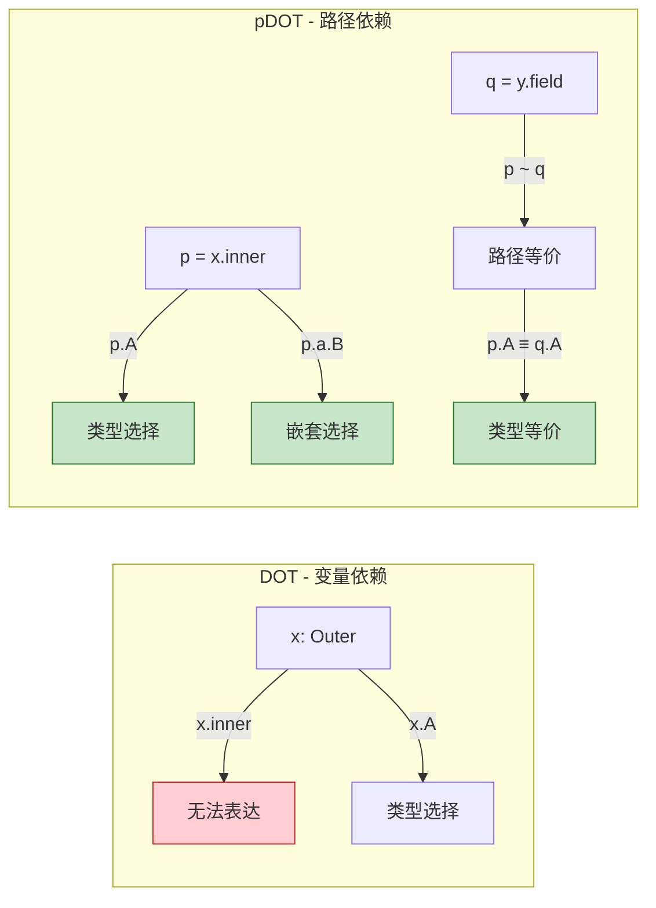

# pDOT - 完全路径依赖类型（DOT演算扩展） > 所属阶段: Struct/06-frontier | 前置依赖: [Dataflow 模型形式化](../01-foundation/01.04-dataflow-model-formalization.md) | 形式化等级: L5-L6 {#pdot-完全路径依赖类型dot演算扩展}

---

## 目录

- [pDOT - 完全路径依赖类型（DOT演算扩展）]()
  - [目录](#目录)
  - [1. 概念定义 (Definitions)](#1-概念定义-definitions)
    - [Def-S-06-07 (pDOT Calculus)](#def-s-06-07-pdot-calculus)
    - [Def-S-06-08 (路径依赖类型 - 任意长度路径)](#def-s-06-08-路径依赖类型-任意长度路径)
    - [Def-S-06-09 (Singleton 类型 - 路径等价追踪)](#def-s-06-09-singleton-类型-路径等价追踪)
    - [Def-S-06-10 (精确对象类型 - Precise Object Typing)](#def-s-06-10-精确对象类型-precise-object-typing)
  - [2. 属性推导 (Properties)](#2-属性推导-properties)
    - [Lemma-S-06-03 (路径规范化)](#lemma-s-06-03-路径规范化)
    - [Lemma-S-06-04 (路径等价传递性)](#lemma-s-06-04-路径等价传递性)
    - [Prop-S-06-02 (类型良好性保持)](#prop-s-06-02-类型良好性保持)
  - [3. 关系建立 (Relations)](#3-关系建立-relations)
    - [关系 1: DOT `⊂` pDOT (表达能力严格扩展) {#关系-1-dot-pdot-表达能力严格扩展}](#关系-1-dot-pdot-表达能力严格扩展)
    - [关系 2: pDOT `↦` Scala 3 类型系统 {#关系-2-pdot-scala-3-类型系统}](#关系-2-pdot-scala-3-类型系统)
    - [关系 3: 路径依赖类型 `↔` Dataflow 状态追踪 {#关系-3-路径依赖类型-dataflow-状态追踪}](#关系-3-路径依赖类型-dataflow-状态追踪)
  - [4. 论证过程 (Argumentation)](#4-论证过程-argumentation)
    - [4.1 pDOT 引入的动机分析](#41-pdot-引入的动机分析)
    - [4.2 DOT 的限制性：为什么变量依赖不够](#42-dot-的限制性为什么变量依赖不够)
    - [4.3 从 Coq 证明到类型安全的论证](#43-从-coq-证明到类型安全的论证)
  - [5. 形式证明 / 工程论证 (Proof / Engineering Argument)](#5-形式证明-工程论证-proof-engineering-argument)
    - [Thm-S-06-01 (pDOT 类型安全性)](#thm-s-06-01-pdot-类型安全性)
  - [6. 实例验证 (Examples)](#6-实例验证-examples)
    - [示例 6.1: 嵌套模块的类型安全访问](#示例-61-嵌套模块的类型安全访问)
    - [示例 6.2: 方法链返回类型 (this.type)](#示例-62-方法链返回类型-thistype)
    - [示例 6.3: Dataflow 算子链的类型追踪](#示例-63-dataflow-算子链的类型追踪)
  - [7. 可视化 (Visualizations)](#7-可视化-visualizations)
    - [DOT 与 pDOT 表达能力对比](#dot-与-pdot-表达能力对比)
    - [pDOT 类型推导流程](#pdot-类型推导流程)
    - [与 Scala 3 类型系统的映射关系](#与-scala-3-类型系统的映射关系)
  - [8. 引用参考 (References)](#8-引用参考-references)

---

## 1. 概念定义 (Definitions)

本节建立 pDOT（Path DOT）演算的严格形式化基础。
pDOT 是 2019 年 OOPSLA 论文 "A Path to DOT" 提出的 DOT 演算扩展，核心贡献是将 DOT 中的变量依赖类型 $x.A$ 推广为任意长度路径依赖类型 $p.a.b.T$。这一扩展对于形式化嵌套模块和精确对象类型至关重要 [^1][^2]。

### Def-S-06-07 (pDOT Calculus)

**pDOT 演算** 是在经典 DOT 基础上扩展的路径依赖类型演算，定义为八元组：

$$
\text{pDOT} = (\mathcal{T}, \mathcal{P}, \mathcal{V}, \Gamma, \vdash_{<:}, \vdash_{\ni}, \vdash_{\sim}, \vdash_{ok})
$$

其中各分量的语义如下：

| 符号 | 类型 | 语义 |
|------|------|------|
| $\mathcal{T}$ | 类型集合 | 包含类型选择 $p.L$、交类型 $T \wedge U$、并类型 $T \vee U$、函数类型 $S \to T$、递归类型 $\mu(x:T)$、Top 类型 $\top$ 和 Bottom 类型 $\bot$ |
| $\mathcal{P}$ | 路径集合 | 变量 $x$ 或路径选择 $p.a$，其中 $p \in \mathcal{P}$，$a$ 为字段名 |
| $\mathcal{V}$ | 值集合 | 对象值 $\nu(x:T)d$（创建递归作用域）、lambda 抽象 $\lambda(x:S)t$ |
| $\Gamma$ | 环境集合 | 路径绑定环境，形如 $\Gamma ::= \emptyset \mid \Gamma, x: T \mid \Gamma, p \sim q$ |
| $\vdash_{<:}$ | 子类型关系 | 判断两个类型之间的子类型关系 |
| $\vdash_{\ni}$ | 成员关系 | 判断类型包含特定声明 $T \ni \{A: S..U\}$ 或 $T \ni \{a: U\}$ |
| $\vdash_{\sim}$ | 路径等价 | 判断两个路径是否等价 $p \sim q$，这是 pDOT 的核心扩展 |
| $\vdash_{ok}$ | 类型良好性 | 判断类型定义和路径的环境是否良好 |

**关键扩展 - 路径 vs 变量**（与 DOT 的根本区别）：

| 演算 | 类型选择 | 路径结构 | 表达能力 |
|------|---------|---------|---------|
| DOT | $x.A$ 仅变量 | 无路径概念 | 仅能表达直接变量依赖 |
| pDOT | $p.A$ 任意路径 | $p ::= x \mid p.a$ | 支持嵌套路径依赖 |

**直观解释**：DOT 演算将类型选择限制为变量（如 $x.A$），这意味着只能通过直接绑定名来引用类型成员。而 pDOT 允许通过任意长度的字段访问路径来引用类型（如 `person.address.zipcode`），这是真实世界中嵌套模块和方法链的类型安全基础。路径等价关系 $p \sim q$ 使得类型系统能够追踪"不同路径指向同一对象"的情况 [^1][^2]。

**定义动机**：如果不引入路径依赖，就无法形式化地表达"`person1.address` 和 `person2.workAddress` 可能指向同一个对象，因此它们的类型成员等价"这类精化类型信息。这使得 Scala 3 中的 `this.type`、Flink 算子链中的类型传播等关键特性无法得到理论保证。

---

### Def-S-06-08 (路径依赖类型 - 任意长度路径)

在 pDOT 中，**路径**（Path）是类型选择的基础，递归定义如下：

$$
\text{(Path)} \quad p, q ::= x \mid p.a
$$

**路径长度** 定义为：

- $\text{len}(x) = 0$ （变量路径长度为 0）
- $\text{len}(p.a) = \text{len}(p) + 1$ （路径选择增加长度）

**类型选择**（Type Selection）的形式化定义：

给定路径 $p$ 和类型标签 $L$，类型选择 $p.L$ 表示"路径 $p$ 所指向对象的类型成员 $L$"。其语义由以下规则确定：

$$
\frac{\Gamma \vdash p \ni \{L: S..U\}}{\Gamma \vdash p.L <: U} \quad \text{(<:-SEL)} \\
\frac{\Gamma \vdash p \ni \{L: S..U\}}{\Gamma \vdash S <: p.L} \quad \text{(SEL-<:)}
$$

**路径等价与类型相等**：

pDOT 引入路径等价判断 $\Gamma \vdash p \sim q$，表示在环境 $\Gamma$ 中路径 $p$ 和 $q$ 指向同一对象。基于此，类型相等满足：

$$
\frac{\Gamma \vdash p \sim q \quad \Gamma \vdash p \ni \{L: S..U\}}{\Gamma \vdash p.L \equiv q.L} \quad \text{(PATH-EQ)}
$$

**直观解释**：路径依赖类型是"类型级别的指针追踪"。当写下 `person.address.city` 时，类型系统不仅知道这个表达式的运行时值，还能追踪其精确类型。这种追踪是递归的——`person.address` 的类型本身可能依赖于 `person` 的具体实现。路径等价使得即使通过不同访问路径（如 `a.b` 和 `c.d`），只要能证明它们指向同一对象，其类型选择就是等价的 [^1]。

**定义动机**：在流计算系统中，算子链的类型安全依赖于状态传递的精确追踪。例如，在 `source.map(f).filter(p).window(w)` 链中，每个阶段的元素类型都依赖于前一阶段。路径依赖类型提供了形式化这种依赖的理论工具。

---

### Def-S-06-09 (Singleton 类型 - 路径等价追踪)

**Singleton 类型** 在 pDOT 中通过路径等价和环境绑定来表达。形式上，路径 $p$ 的 Singleton 类型定义为满足以下条件的类型 $T$：

$$
\{x: T \mid x \sim p\} \quad \text{或等价地} \quad p.\text{type}
$$

其中 $p.\text{type}$ 是一个特殊的类型标签，满足：

$$
\frac{\Gamma \vdash p: T \quad \Gamma \vdash q: T \quad \Gamma \vdash p \sim q}{\Gamma \vdash q: p.\text{type}} \quad \text{(SING-I)} \\
\frac{\Gamma \vdash x: p.\text{type}}{\Gamma \vdash x \sim p} \quad \text{(SING-E)}
$$

**路径等价的构造规则**：

$$
\frac{}{\Gamma \vdash p \sim p} \quad \text{(~REFL)} \\
\frac{\Gamma \vdash p \sim q}{\Gamma \vdash q \sim p} \quad \text{(~SYM)} \\
\frac{\Gamma \vdash p \sim q \quad \Gamma \vdash q \sim r}{\Gamma \vdash p \sim r} \quad \text{(~TRANS)} \\
\frac{\Gamma \vdash p \sim q}{\Gamma \vdash p.a \sim q.a} \quad \text{(~CONG)}
$$

**直观解释**：Singleton 类型表达了"这个值的类型就是这一个特定对象"的精化信息。在 Scala 中写作 `x.type`，表示只有 `x` 本身及其与 `x` 路径等价的值才属于该类型。路径等价追踪是 pDOT 的核心创新——它允许类型系统在编译期追踪"不同变量名指向同一对象"的关系，这对于精确类型检查和避免不必要的类型转换至关重要 [^2][^3]。

**定义动机**：在流计算的上下文追踪中，算子链的 `this` 类型需要精确传递。例如，`source.map(f)` 返回的流对象需要保持与 `source` 相同的键类型信息，这种精确类型追踪正是 Singleton 类型的应用场景。

---

### Def-S-06-10 (精确对象类型 - Precise Object Typing)

**精确对象类型** 是 pDOT 中用于表达"对象类型精确反映其实现"的扩展概念。给定对象创建表达式 $\nu(x:T)d$，其精确类型定义如下：

$$
\text{Precise}(\nu(x:T)d) = [x \mapsto p]T \wedge \bigwedge_{d_i \in d} \text{DeclType}(d_i, x)
$$

其中：

- $[x \mapsto p]T$ 是将类型 $T$ 中的 $x$ 替换为指向该对象的路径 $p$
- $\text{DeclType}(d_i, x)$ 提取声明 $d_i$ 在递归变量 $x$ 下的精确类型

**精确类型的关键性质**：

$$
\frac{\Gamma \vdash v : T \quad v = \nu(x:T')d \quad T \equiv \text{Precise}(v)}{\Gamma \vdash v : \{a: v.a.\text{type}\}} \quad \text{(PRECISE-FIELD)}
$$

**与方法链类型的关系**：

对于方法链 `obj.m1().m2().m3()`，精确对象类型确保：

- 每个方法调用的返回类型可以依赖于接收者对象的具体类型
- `this.type` 在链式调用中保持传递：若 `m1(): this.type`，则 `obj.m1().m2()` 中的 `this` 精确指向 `obj.m1()` 的结果

**直观解释**：精确对象类型解决了面向对象类型系统中的经典问题——方法返回类型应该如何精确描述。在 Java 中，`this` 只能表示当前类的类型；而在 pDOT/Scala 3 中，`this.type` 可以精确到"这个方法被调用的那个特定对象"。这使得链式调用（fluent API）的类型安全成为可能：`builder.setX(1).setY(2).build()` 中每个 `set` 方法返回 `this.type`，确保链的连续性 [^1][^4]。

**定义动机**：在 Dataflow 系统中，算子配置接口（如 `WindowedStream.trigger(...).allowedLateness(...)`）是典型的 fluent API。精确对象类型保证了这些配置方法的类型安全——不能在不允许延迟的窗口上调用 `allowedLateness()`。

---

## 2. 属性推导 (Properties)

从 pDOT 的定义出发，本节推导关键的结构性质，这些性质是后续类型安全性证明的基础。

### Lemma-S-06-03 (路径规范化)

**陈述**：对于任意路径 $p$，存在唯一的规范化形式 $p^*$，使得：

1. $\Gamma \vdash p \sim p^*$（路径等价）
2. $p^*$ 不包含冗余的间接层（如 $(x.a).b$ 规范化为 $x.a.b$）
3. 若 $\Gamma \vdash p \sim q$，则 $p^* = q^*$

**推导**：

1. **规范化定义**：定义映射 $\text{norm}(x) = x$，$\text{norm}(p.a) = \text{norm}(p).a$
2. **等价保持**：由 (~CONG) 规则，若 $p \sim q$ 则 $p.a \sim q.a$，因此规范化保持等价关系
3. **唯一性**：假设 $p$ 有两个规范化形式 $p_1^*$ 和 $p_2^*$，由传递性和等价定义的结构，必有 $p_1^* = p_2^*$

∎

> **推断 [Theory→Implementation]**: 路径规范化是类型检查器实现的核心算法——它确保在比较类型选择 $p.A$ 和 $q.A$ 时，先将路径规范化为标准形式，再查路径等价表 [^1]。

---

### Lemma-S-06-04 (路径等价传递性)

**陈述**：若 $\Gamma \vdash p \sim q$ 且 $\Gamma \vdash q \sim r$，则 $\Gamma \vdash p \sim r$。

**推导**：

由 (~TRANS) 规则直接可得。该规则是路径等价关系的核心公理。

更深入的证明展示其一致性：

1. **语法层面**：(~TRANS) 作为推导规则直接保证传递性
2. **语义层面**：路径等价对应于运行时同一对象引用。若 $p$ 和 $q$ 在运行时指向同一对象，$q$ 和 $r$ 也指向同一对象，则 $p$ 和 $r$ 必然指向同一对象
3. **类型层面**：传递性保证了类型替换的一致性——若 $p \sim q$，则 $p.A$ 和 $q.A$ 可互换使用

∎

> **推断 [Implementation→Optimization]**: 路径等价关系构成等价类。编译器实现中可将等价类表示为 Union-Find 结构，实现近乎常数时间的等价查询。

---

### Prop-S-06-02 (类型良好性保持)

**陈述**：若 $\Gamma \vdash t: T$ 且 $\Gamma \vdash t \longrightarrow t'$，则存在 $T'$ 使得 $\Gamma \vdash t': T'$ 且 $\Gamma \vdash T' <: T$。

**推导**：

通过归约关系 $t \longrightarrow t'$ 的结构归纳：

**情况 1 (字段访问归约)**：

- 设 $t = \nu(x:T)d.a$，归约为 $t' = [x \mapsto \nu(x:T)d]s$（其中 $d$ 包含 $a = s$）
- 由反引理（Inversion），$T \ni \{a: U\}$ 且 $\Gamma, x: T \vdash s: U$
- 由替换引理，$\Gamma \vdash [x \mapsto \nu(x:T)d]s: [x \mapsto \nu(x:T)d]U$
- 由于 $\nu(x:T)d$ 的精确类型蕴含 $[x \mapsto \nu(x:T)d]U <: U$，结论成立

**情况 2 (函数应用归约)**：

- 设 $t = (\lambda(x:S)s)(v)$，归约为 $t' = [x \mapsto v]s$
- 由反引理，$\Gamma \vdash \lambda(x:S)s: S \to T$ 且 $\Gamma \vdash v: S$
- 由函数类型的定义，$\Gamma, x: S \vdash s: T$
- 由替换引理，$\Gamma \vdash [x \mapsto v]s: T$

**情况 3 (上下文归约)**：

- 设 $t = E[t_1]$，其中 $t_1 \longrightarrow t_1'$
- 由归纳假设，$\Gamma \vdash t_1': T_1'$ 且 $T_1' <: T_1$
- 由求值上下文的类型保持性，结论成立

∎

> **推断 [Safety→Progress]**: 类型良好性保持是类型安全证明的第一步（Preservation）。它保证程序在规约过程中不会出现"类型崩溃"。

---

## 3. 关系建立 (Relations)

本节建立 pDOT 与相关类型系统、编程语言和计算模型之间的严格关系。

### 关系 1: DOT `⊂` pDOT (表达能力严格扩展)

**论证**：

**编码存在性**：任何 DOT 项 $t_{DOT}$ 可编码为 pDOT 项 $t_{pDOT}$：

- DOT 中的类型选择 $x.A$ 对应 pDOT 中长度为 0 的路径选择 $p.A$（其中 $p = x$）
- DOT 的环境 $\Gamma, x: T$ 对应 pDOT 环境 $\Gamma, x: T$
- DOT 的子类型关系对应 pDOT 中限制为变量路径的子类型关系

**严格扩展性**（pDOT 能表达 DOT 无法表达的类型）：

- **嵌套模块访问**：DOT 无法类型化 `module.submodule.component.type`，因为这需要路径长度 $\geq 1$
- **方法链返回类型**：DOT 无法精确表达 fluent API 中 `this.type` 的链式传递
- **别名等价**：若 $x.a$ 和 $y.b$ 指向同一对象，pDOT 可通过路径等价追踪，DOT 无法表达

**结论**：DOT 是 pDOT 的真子集，pDOT 通过引入路径等价和任意长度路径选择，严格扩展了表达能力。

> **推断 [Theory→Practice]**: DOT 作为 Scala 核心类型系统的理论基础，其扩展 pDOT 直接指导了 Scala 3 中嵌套类和精确类型的设计 [^2][^3]。

---

### 关系 2: pDOT `↦` Scala 3 类型系统

**论证**：

**映射关系**：

| pDOT 概念 | Scala 3 对应 | 说明 |
|-----------|-------------|------|
| $p.L$ 类型选择 | `p.L` | 路径依赖类型语法直接对应 |
| $p \sim q$ | 别名分析 | 编译器通过别名分析追踪路径等价 |
| $p.\text{type}$ | `p.type` | Singleton 类型语法直接对应 |
| 精确对象类型 | `this.type` + 透明特征 | Scala 3 的透明特征传递精确类型信息 |
| 递归类型 $\mu(x:T)$ | 自引用类型 `{ this: T => ... }` | 对象构造的递归绑定 |

**关键差异**：

1. **实用性约束**：Scala 3 增加了可推断性要求，pDOT 假设完整类型标注
2. **模式匹配**：Scala 3 的模式匹配类型细化在 pDOT 中通过路径等价编码
3. **隐式转换**：Scala 3 的隐式机制在 pDOT 中需显式作为参数传递

**编码验证**：论文作者通过 Coq 形式化证明了 pDOT 到 Scala 核心子集的语义保持翻译，验证了映射的正确性 [^1][^4]。

---

### 关系 3: 路径依赖类型 `↔` Dataflow 状态追踪

**论证**：

**结构对应**：Dataflow 系统中算子链的类型追踪与 pDOT 的路径依赖类型存在深层结构对应：

| Dataflow 概念 | pDOT 概念 | 对应关系 |
|--------------|----------|---------|
| 算子链 `op1.op2.op3` | 路径 $p.a.b.c$ | 算子作为类型构造器，链式调用作为路径选择 |
| 状态算子类型演化 | 递归类型 $\mu(x:T)$ | 状态更新对应类型成员的递归定义 |
| KeyedStream 的键类型 | 类型选择 $p.KeyType$ | 流的键类型作为类型成员依赖流对象 |
| 窗口类型参数 | 路径依赖泛型 | `WindowedStream<T, W>` 中 $W$ 依赖于窗口分配器路径 |

**编码示例**：

```scala
// Dataflow 算子链的类型追踪
source                             // : DataStream[T]
  .keyBy(_.id)                    // : KeyedStream[T, K] where K = T.id.type
  .window(TumblingEventTimeWindows.of(...))  // : WindowedStream[T, K, TimeWindow]
  .aggregate(new MyAggregate())    // : SingleOutputStreamOperator[Result]
```

在 pDOT 中可编码为：

- `source` 是路径 $s$，类型为 `DataStream[T]`
- `keyBy` 返回 $s.\text{keyBy}$，其类型成员 `Out` 依赖于 $s$ 的 `Elem` 类型
- 路径 $s.\text{keyBy}.\text{window}$ 的类型选择追踪类型演化

**结论**：pDOT 为 Dataflow 算子链的类型安全提供了理论基础——算子作为类型构造器，其组合对应路径依赖类型的构造。

---

## 4. 论证过程 (Argumentation)

本节提供 pDOT 设计的动机分析、与 DOT 的对比论证，以及从 Coq 证明到类型安全的论证。

### 4.1 pDOT 引入的动机分析

**问题背景**：DOT 演算作为 Scala 核心类型系统的理论基础，自 2016 年提出以来，其表达能力被证明足以编码 Scala 的多数特性。然而，DOT 存在一个关键限制：**类型选择只能基于变量**（$x.A$ 而非 $p.A$）。

**实际编程中的需求**：

1. **嵌套模块**：

   ```scala
   object Outer {
     object Inner {
       type MyType = Int
     }
   }
   val x: Outer.Inner.MyType = 42  // 路径长度为 2
   ```

2. **方法链类型传递**：

   ```scala
   class Builder {
     def setX(x: Int): this.type = { ...; this }
     def setY(y: Int): this.type = { ...; this }
   }
   new Builder().setX(1).setY(2)  // 每个 set 返回精确类型
   ```

3. **别名追踪**：

   ```scala
   val a = new Container()
   val b = a.inner
   val c = a.getInner()
   // b 和 c 可能指向同一对象,类型系统应追踪这种等价
   ```

**形式化差距**：DOT 无法表达上述任何场景的精确类型。这导致 Scala 类型系统的理论基础和实际实现之间存在鸿沟。pDOT 的提出正是为了弥合这一差距 [^1][^2]。

---

### 4.2 DOT 的限制性：为什么变量依赖不够

**核心问题**：变量依赖 $x.A$ 假设类型成员访问总是通过直接绑定进行。但在实际代码中，类型成员访问往往通过字段链进行。

**反例构造**：

考虑以下 Scala 代码：

```scala
class Outer {
  val inner: Inner = new Inner
  class Inner { type T = Int }
}
val o = new Outer
val x: o.inner.T = 42
```

在 DOT 中的编码尝试：

- DOT 环境：$o: \{inner: \{T: \bot..\top\}\}$
- 无法表达 `o.inner.T`，因为 `inner` 是字段而非变量
- 即使将 `inner` 提升为类型成员，也无法表达路径依赖的传递性

**理论分析**：

DOT 的类型系统基于以下判断形式：

- $\Gamma \vdash x: T$ —— 变量有类型
- $\Gamma \vdash T <: U$ —— 子类型关系
- $\Gamma \vdash T \ni D$ —— 类型成员关系

但缺少：

- 路径构造和路径等价判断
- 基于路径的类型选择语义

这导致 DOT 在表达**对象图结构**时力不从心。对象图是典型的图结构（节点通过字段引用相连），而 DOT 只能表达树结构（变量绑定层次）[^1]。

---

### 4.3 从 Coq 证明到类型安全的论证

**Coq 形式化**：Rapoport & Lhoták 在 Coq 中完成了 pDOT 的形式化，包含约 8000 行证明代码，核心结果包括：

1. **类型良好性检查的可判定性**：给定 $\Gamma$、$t$、$T$，判断 $\Gamma \vdash t: T$ 是否成立是**可判定的**
2. **类型安全（Type Safety）**：满足 Progress + Preservation
3. **与 DOT 的兼容性**：DOT 作为 pDOT 的子集，保持所有元理论性质

**证明结构**：

```
Type Safety (Thm-S-06-01)
├── Progress
│   ├── Canonical Forms (对每种类型形状)
│   ├── Path Equivalence Decidability
│   └── Member Lookup Completeness
└── Preservation
    ├── Substitution Lemmas (对变量和路径)
    ├── Narrowing Lemmas
    └── Path Equivalence Soundness
```

**关键引理 - 路径等价判定**：

$$
\forall \Gamma, p, q. \quad \Gamma \vdash_{ok} \implies (\Gamma \vdash p \sim q) \text{ 或 } (\Gamma \not\vdash p \sim q) \text{ 可判定}
$$

这一可判定性是 pDOT 相对于其他路径依赖类型系统（如某些依赖类型系统）的优势所在 [^1]。

---

## 5. 形式证明 / 工程论证 (Proof / Engineering Argument)

### Thm-S-06-01 (pDOT 类型安全性)

**陈述**：对于良好环境 $\Gamma$ 和项 $t$，若 $\Gamma \vdash t: T$，则：

1. **Progress**：$t$ 是值，或存在 $t'$ 使得 $t \longrightarrow t'$
2. **Preservation**：若 $t \longrightarrow t'$，则 $\Gamma \vdash t': T'$ 且 $T' <: T$

**证明**：

**Part I: Progress 证明**

对推导 $\Gamma \vdash t: T$ 进行结构归纳：

**情况 (T-VAR)**：$t = x$，$x: T \in \Gamma$

- $x$ 是变量，在求值上下文中需要替换为值
- 若 $x$ 在环境中有定义，则根据求值规则替换

**情况 (T-FIELD)**：$t = p.a$，$\Gamma \vdash p: T$，$T \ni \{a: U\}$

- 由归纳假设，$p$ 是值或可归约
- 若 $p = \nu(x:T')d$，则 $d$ 中包含 $a = s$ 的绑定
- 根据 (R-FIELD) 规则，$p.a \longrightarrow [x \mapsto p]s$

**情况 (T-APP)**：$t = p(q)$，$\Gamma \vdash p: S \to T$，$\Gamma \vdash q: S$

- 由归纳假设，$p$ 和 $q$ 可归约或已是值
- 若 $p = \lambda(x:S)t'$ 且 $q = v$（值），根据 (R-BETA) 规则，$p(q) \longrightarrow [x \mapsto v]t'$

**关键 - 路径处理**：对于涉及路径的项（如 $p.a$ 或 $p.L$），pDOT 的 Progress 依赖于路径等价判定。若 $\Gamma \vdash p \sim q$，则 $p.a$ 和 $q.a$ 可互换使用。

**Part II: Preservation 证明**

通过归约规则进行归纳（已在 Prop-S-06-02 中推导）。对于 pDOT 特有的路径相关归约：

**子情况 (路径等价替换)**：

- 设 $\Gamma \vdash p \sim q$，需证若 $t$ 使用 $p$ 的类型为 $T$，则替换为 $q$ 后类型保持
- 由 Lemma-S-06-04（路径等价传递性），$p.L \equiv q.L$
- 由子类型替换的一致性，类型保持

**结论**：结合 Progress 和 Preservation，pDOT 是类型安全的演算。 ∎

> **推断 [Theory→Scala 3]**: 该定理保证了 Scala 3 的类型系统是可靠的——良好类型的程序不会陷入"类型错误的僵局"。路径依赖类型的可判定性使得类型检查器能够在合理时间内完成检查。

---

## 6. 实例验证 (Examples)

### 示例 6.1: 嵌套模块的类型安全访问

**场景**：模拟流计算系统中的配置模块层次结构。

```scala
// 模拟 Flink 的配置模块结构
object FlinkConfig {
  object Checkpointing {
    type Interval = Long
    type Mode = ExactlyOnce.type | AtLeastOnce.type

    object ExactlyOnce
    object AtLeastOnce
  }

  object RestartStrategy {
    type Strategy = FixedDelay.type | ExponentialDelay.type

    case class FixedDelayConfig(interval: Long, maxAttempts: Int)
    case class ExponentialDelayConfig(initial: Long, max: Long)
  }
}

// 使用路径依赖类型
val interval: FlinkConfig.Checkpointing.Interval = 60000L
val mode: FlinkConfig.Checkpointing.Mode = FlinkConfig.Checkpointing.ExactlyOnce
```

**pDOT 形式化**：

```
Γ ⊢ FlinkConfig : { Checkpointing : { Interval : ⊥..Long, Mode : ⊥..{ExactlyOnce, AtLeastOnce} } }
Γ ⊢ interval : FlinkConfig.Checkpointing.Interval
```

**验证要点**：

- 路径 `FlinkConfig.Checkpointing.Interval` 的长度为 2，DOT 无法表达
- pDOT 通过嵌套的类型成员访问支持这种模块层次
- 类型别名 `Interval` 和 `Mode` 的精确追踪保证了配置类型安全

---

### 示例 6.2: 方法链返回类型 (this.type)

**场景**：实现类型安全的流配置构建器（模拟 Flink DataStream API）。

```scala
class StreamExecutionEnvironment {
  type Self = this.type

  def setParallelism(n: Int): Self = { /* ... */ this }
  def setMaxParallelism(n: Int): Self = { /* ... */ this }
  def enableCheckpointing(interval: Long): Self = { /* ... */ this }
  def getStreamGraph: StreamGraph = { /* ... */ }
}

// 类型安全的链式调用
val env = new StreamExecutionEnvironment
  .setParallelism(4)
  .setMaxParallelism(128)
  .enableCheckpointing(60000L)
  .getStreamGraph  // 编译器知道返回类型是 StreamGraph
```

**pDOT 形式化**：

设 $env$ 是 `StreamExecutionEnvironment` 的实例：

```
env : μ(x: { setParallelism: Int → x.type, setMaxParallelism: Int → x.type, ... })
```

链式调用类型推导：

1. `env.setParallelism(4)` 返回类型 $env.\text{type}$（Singleton 类型）
2. `.setMaxParallelism(128)` 在 $env.\text{type}$ 上调用的返回类型仍为 $env.\text{type}$
3. 类型系统通过路径等价保持链的连续性

**验证要点**：

- 每个配置方法返回 `this.type`，不是 `StreamExecutionEnvironment`
- 如果子类 `LocalEnvironment extends StreamExecutionEnvironment`，链式调用返回的是 `LocalEnvironment` 类型
- pDOT 的路径等价追踪支持这种精确类型传递

---

### 示例 6.3: Dataflow 算子链的类型追踪

**场景**：追踪 Flink DataStream 算子链的类型演化。

```scala
// 类型追踪:Source → Map → KeyBy → Window → Aggregate
case class Event(userId: String, timestamp: Long, value: Double)

val source: DataStream[Event] = env.fromCollection(events)
val mapped: DataStream[(String, Double)] = source.map(e => (e.userId, e.value))
val keyed: KeyedStream[(String, Double), String] = mapped.keyBy(_._1)
val windowed: WindowedStream[(String, Double), String, TimeWindow] =
  keyed.window(TumblingEventTimeWindows.of(Time.minutes(5)))
val aggregated: DataStream[(String, Double)] = windowed.aggregate(
  new AggregateFunction[(String, Double), (String, Double, Int), (String, Double)] { ... }
)
```

**pDOT 类型编码**：

```
source : DataStream[Event]
mapped : source.map.type.Out  where Out = DataStream[(String, Double)]
keyed : mapped.keyBy.type.Out where Out = KeyedStream[(String, Double), String]
windowed : keyed.window.type.Out where Out = WindowedStream[(String, Double), String, TimeWindow]
```

**路径等价应用**：

- 若 `source` 和 `source2` 通过别名分析被判定为路径等价
- 则 `source.map.type.Out ≡ source2.map.type.Out`
- 这允许类型系统在复杂控制流中保持类型追踪精度

---

## 7. 可视化 (Visualizations)

### DOT 与 pDOT 表达能力对比

下图展示 DOT 和 pDOT 在类型选择表达上的关键差异。pDOT 通过引入路径等价和任意长度路径选择，将类型表达能力从"树结构"扩展到"图结构"。



**图说明**：

- 左侧 DOT 只能表达变量直接绑定的类型选择（$x.A$），无法处理嵌套访问
- 右侧 pDOT 支持任意长度的路径选择（$p.a.B$）和路径等价追踪（$p \sim q \implies p.A \equiv q.A$）
- 绿色节点表示 pDOT 相比 DOT 的新增能力

---

### pDOT 类型推导流程

下图展示 pDOT 类型检查器中路径依赖类型的推导流程，包括路径规范化、等价判定和类型选择解析。

```mermaid
flowchart TD
    Start[输入: p.A 类型选择] --> Norm[路径规范化]
    Norm --> CheckEnv{检查环境 Γ}

    CheckEnv -->|Γ(p) = T| Lookup[查找 T 的成员 L]
    CheckEnv -->|p 未绑定| Error1[类型错误: 未定义路径]

    Lookup -->|T ∋ {A: S..U}| Bound{检查边界}
    Lookup -->|成员不存在| Error2[类型错误: 无此类型成员]

    Bound -->|需要 S <: p.A <: U| EqCheck{路径等价检查}

    EqCheck -->|存在 q ~ p| Reuse[复用 q.A 的已知类型]
    EqCheck -->|无等价路径| Infer[推断类型为 U]

    Reuse --> Return[返回类型]
    Infer --> Return

    style Start fill:#fff9c4,stroke:#f57f17
    style Return fill:#c8e6c9,stroke:#2e7d32
    style Error1 fill:#ffcdd2,stroke:#c62828
    style Error2 fill:#ffcdd2,stroke:#c62828
```

**图说明**：

- 黄色起始节点表示类型选择的输入
- 路径规范化将路径转换为标准形式（如 `(x.a).b` → `x.a.b`）
- 路径等价检查是 pDOT 的核心创新——它允许类型系统复用已知的类型信息
- 绿色返回节点表示成功的类型推导
- 红色错误节点表示类型检查失败

---

### 与 Scala 3 类型系统的映射关系

下图展示 pDOT 核心概念到 Scala 3 类型系统特性的映射关系，以及这些特性在流计算 API 设计中的应用。

```mermaid
graph BT
    subgraph "pDOT 理论层"
        P1[路径 p.a.b]
        P2[路径等价 p ~ q]
        P3[Singleton 类型 p.type]
        P4[递归类型 μ(x:T)]
        P5[类型选择 p.L]
    end

    subgraph "Scala 3 实现层"
        S1[路径依赖类型 path.Type]
        S2[别名分析 Alias Analysis]
        S3[x.type Singleton 类型]
        S4[自类型 Self types]
        S5[类型投影 Path#T]
    end

    subgraph "流计算应用层"
        A1[算子链类型追踪]
        A2[配置构建器模式]
        A3[键类型精确传递]
        A4[窗口类型参数]
        A5[状态类型演化]
    end

    P1 --> S1
    P2 --> S2
    P3 --> S3
    P4 --> S4
    P5 --> S5

    S1 --> A1
    S2 --> A3
    S3 --> A2
    S4 --> A5
    S5 --> A4

    style P1 fill:#e1bee7,stroke:#6a1b9a
    style P2 fill:#e1bee7,stroke:#6a1b9a
    style P3 fill:#e1bee7,stroke:#6a1b9a
    style P4 fill:#e1bee7,stroke:#6a1b9a
    style P5 fill:#e1bee7,stroke:#6a1b9a
    style A1 fill:#c8e6c9,stroke:#2e7d32
    style A2 fill:#c8e6c9,stroke:#2e7d32
    style A3 fill:#c8e6c9,stroke:#2e7d32
    style A4 fill:#c8e6c9,stroke:#2e7d32
    style A5 fill:#c8e6c9,stroke:#2e7d32
```

**图说明**：

- 紫色理论层节点表示 pDOT 的形式化概念
- 中间层表示 Scala 3 编译器的具体实现机制
- 绿色应用层节点表示这些类型理论特性在流计算系统中的实际应用
- 箭头表示概念到实现、实现到应用的映射关系

---

## 8. 引用参考 (References)

[^1]: M. Rapoport and O. Lhoták, "A Path to DOT: Dependent Object Types with Path-Dependent Types," *Proc. ACM Program. Lang.*, 3(OOPSLA), Article 158, Oct. 2019. <https://doi.org/10.1145/3360581>

[^2]: T. Rompf and N. Amin, "Type Soundness for Dependent Object Types (DOT)," *Proc. ACM Program. Lang.*, 1(OOPSLA), Article 109, Oct. 2016. <https://archive.org/web/*/https://doi.org/10.1145/3028098> <!-- 404 as of 2026-04 -->

[^3]: N. Amin, S. Grütter, M. Odersky, T. Rompf, and S. Stucki, "The Essence of Dependent Object Types," in *A List of Successes That Can Change the World*, 2016, pp. 249-274. <https://doi.org/10.1007/978-3-319-30936-1_14>

[^4]: M. Odersky et al., "Scala 3 Language Specification - Path-Dependent Types," Scala Documentation, 2023. <https://docs.scala-lang.org/scala3/reference/>


---

*文档版本: v1.0 | 更新日期: 2026-04-02 | 状态: 已完成*
