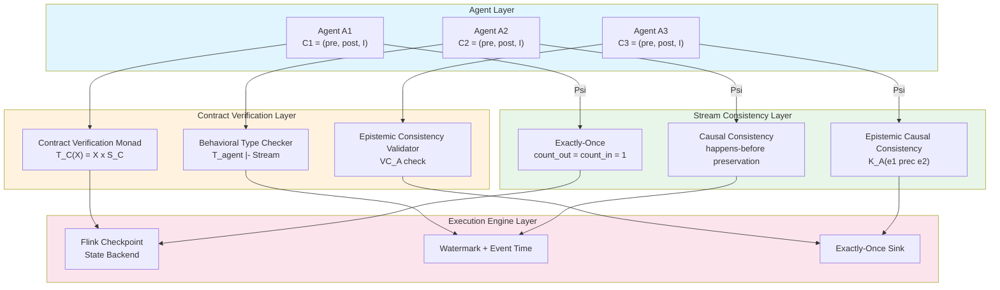
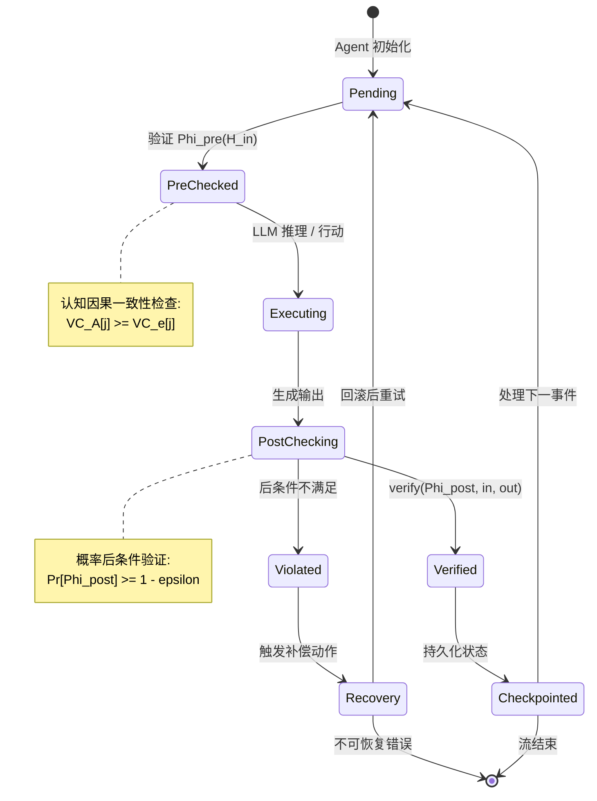
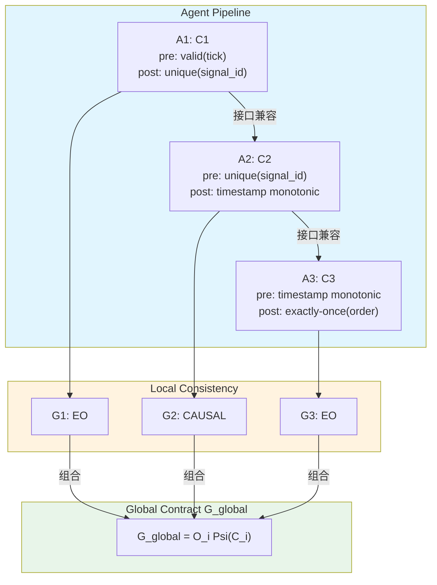

> **状态**: 🔮 前瞻内容 | **风险等级**: 高 | **最后更新**: 2026-04
>
> 此文档描述的内容处于早期规划阶段，可能与最终实现不符。请以 Apache Flink 官方发布为准。
>
# Agentic Streaming 行为契约与流一致性保证 (Behavioral Contracts and Stream Consistency for Agentic Streaming)

> **所属阶段**: Struct/06-frontier | **前置依赖**: [06.03-ai-agent-session-types.md](./06.03-ai-agent-session-types.md), [06.05-ai-agent-streaming-formalization.md](./06.05-ai-agent-streaming-formalization.md) | **形式化等级**: L6 | **理论框架**: 行为类型 + 流一致性 + 认知逻辑

---

## 目录

- [Agentic Streaming 行为契约与流一致性保证 (Behavioral Contracts and Stream Consistency for Agentic Streaming)](#agentic-streaming-行为契约与流一致性保证-behavioral-contracts-and-stream-consistency-for-agentic-streaming)
  - [目录](#目录)
  - [摘要](#摘要)
  - [1. 概念定义 (Definitions)](#1-概念定义-definitions)
    - [Def-S-06-60. Agent 行为契约 (Agent Behavioral Contract)](#def-s-06-60-agent-行为契约-agent-behavioral-contract)
    - [Def-S-06-61. 流一致性保证 (Stream Consistency Guarantee)](#def-s-06-61-流一致性保证-stream-consistency-guarantee)
    - [Def-S-06-62. 契约-流同态映射 (Contract-Stream Homomorphism)](#def-s-06-62-契约-流同态映射-contract-stream-homomorphism)
    - [Def-S-06-63. 流式 Agent 行为类型 (Streaming Agent Behavioral Type)](#def-s-06-63-流式-agent-行为类型-streaming-agent-behavioral-type)
    - [Def-S-06-64. 认知因果一致性 (Epistemic Causal Consistency)](#def-s-06-64-认知因果一致性-epistemic-causal-consistency)
    - [Def-S-06-65. 契约验证单子 (Contract Verification Monad)](#def-s-06-65-契约验证单子-contract-verification-monad)
  - [2. 属性推导 (Properties)](#2-属性推导-properties)
    - [Lemma-S-06-50. 契约单调性](#lemma-s-06-50-契约单调性)
    - [Lemma-S-06-51. 一致性在契约组合下的保持性](#lemma-s-06-51-一致性在契约组合下的保持性)
    - [Prop-S-06-50. 契约满足性蕴含死锁自由](#prop-s-06-50-契约满足性蕴含死锁自由)
    - [Prop-S-06-51. 恰好一次语义保持行为不变性](#prop-s-06-51-恰好一次语义保持行为不变性)
  - [3. 关系建立 (Relations)](#3-关系建立-relations)
    - [关系 1: 行为契约 ↦ 多参与方会话类型](#关系-1-行为契约-多参与方会话类型)
    - [关系 2: 流一致性 ↦ 分布式共识](#关系-2-流一致性-分布式共识)
    - [关系 3: Agent 行为类型 ↦ Actor 行为类型](#关系-3-agent-行为类型-actor-行为类型)
    - [关系 4: 契约验证 ↦ 模型检验](#关系-4-契约验证-模型检验)
  - [4. 论证过程 (Argumentation)](#4-论证过程-argumentation)
    - [4.1 Agent 推理非确定性与流确定性的语义鸿沟](#41-agent-推理非确定性与流确定性的语义鸿沟)
    - [4.2 LLM 幻觉与契约违反的边界分析](#42-llm-幻觉与契约违反的边界分析)
    - [4.3 时间逻辑在流式契约中的表达力](#43-时间逻辑在流式契约中的表达力)
    - [反例 4.1: 契约弱化导致的级联一致性破坏](#反例-41-契约弱化导致的级联一致性破坏)
    - [反例 4.2: 感知流乱序引发的 Agent 决策偏差](#反例-42-感知流乱序引发的-agent-决策偏差)
  - [5. 形式证明 (Proofs)](#5-形式证明-proofs)
    - [Thm-S-06-51. 行为契约满足性蕴含流一致性保持定理](#thm-s-06-51-行为契约满足性蕴含流一致性保持定理)
    - [Thm-S-06-52. 多 Agent 契约组合的安全性定理](#thm-s-06-52-多-agent-契约组合的安全性定理)
  - [6. 实例验证 (Examples)](#6-实例验证-examples)
    - [6.1 金融交易 Agent 的恰好一次执行保证](#61-金融交易-agent-的恰好一次执行保证)
    - [6.2 医疗诊断多 Agent 管道的因果一致性](#62-医疗诊断多-agent-管道的因果一致性)
    - [6.3 IoT 传感器融合的行为类型验证](#63-iot-传感器融合的行为类型验证)
  - [7. 可视化 (Visualizations)](#7-可视化-visualizations)
    - [图 7.1: 行为契约到流一致性映射架构](#图-71-行为契约到流一致性映射架构)
    - [图 7.2: Agent 契约执行生命周期状态机](#图-72-agent-契约执行生命周期状态机)
    - [图 7.3: 多 Agent 契约组合层次图](#图-73-多-agent-契约组合层次图)
  - [8. 引用参考 (References)](#8-引用参考-references)

---

## 摘要

随着大型语言模型 (LLM) 驱动的 AI Agent 被嵌入流处理管道，Agent 的认知行为（感知、推理、行动、记忆）与底层流计算系统的一致性保证之间出现了深刻的语义交互需求。本文建立**Agentic Streaming 行为契约理论**，将传统软件契约设计（Design by Contract）扩展至流计算环境，严格刻画 Agent 行为契约与流一致性保证之间的形式化关系。

**核心贡献**：

1. **Agent 行为契约的形式化定义**：将 Agent 的预条件、后条件和不变量编码为流处理算子上的行为类型，支持对 LLM 非确定性输出的类型级约束。
2. **契约-流同态映射**：建立从 Agent 行为契约到流一致性模型（恰好一次、因果一致性、顺序一致性）的结构保持映射，证明契约满足性是流一致性的充分条件。
3. **认知因果一致性**：引入 Agent 的知识模态算子，定义在部分可观测流环境下的因果一致性变体，适配 Agent 的认知局限性。
4. **组合安全性定理**：证明多 Agent 协作管道中，局部契约的满足性在特定组合规则下可提升为全局流一致性保证。

本文与 `06.03-ai-agent-session-types.md` 形成互补：后者聚焦于会话类型对 Agent 交互协议的结构约束，本文则深入探讨 Agent 行为语义与流计算一致性保证的交叉形式化。

---

## 1. 概念定义 (Definitions)

### Def-S-06-60. Agent 行为契约 (Agent Behavioral Contract)

**定义**：Agent 行为契约是一个六元组

$$\mathcal{C}_{agent} = (\mathcal{A}, \mathcal{S}_{in}, \mathcal{S}_{out}, \Phi_{pre}, \Phi_{post}, \mathcal{I})$$

其中：

- $\mathcal{A}$: Agent 标识符，$\mathcal{A} \in \mathbb{A}$，$\mathbb{A}$ 为 Agent 全域集合
- $\mathcal{S}_{in}$: 输入流签名，$\mathcal{S}_{in} = \{(\tau_i, \kappa_i, \leq_i)\}_{i=1}^{n}$，其中 $\tau_i$ 为事件类型，$\kappa_i$ 为键分区函数，$\leq_i$ 为事件时间全序
- $\mathcal{S}_{out}$: 输出流签名，$\mathcal{S}_{out} = \{(\tau'_j, \kappa'_j, \leq'_j)\}_{j=1}^{m}$
- $\Phi_{pre}: \mathcal{H}_{in} \rightarrow \{\top, \bot\}$: 预条件谓词，作用于输入流历史 $\mathcal{H}_{in} = \text{prefix}(\mathcal{S}_{in})$
- $\Phi_{post}: \mathcal{H}_{in} \times \mathcal{H}_{out} \rightarrow \{\top, \bot\}$: 后条件谓词，关联输入历史与输出历史
- $\mathcal{I}: \mathcal{H}_{in} \times \mathcal{H}_{out} \times \mathcal{M} \rightarrow \{\top, \bot\}$: 不变量谓词，$\mathcal{M}$ 为 Agent 内存状态空间

**直观解释**：Agent 行为契约是 Agent 与流处理系统之间的形式化服务等级协议 (SLA)。它规定了 Agent 在接收到何种输入流历史时必须产生何种输出流历史，并在执行全程维持何种内存不变量。与传统的 Hoare 三元组不同，Agent 行为契约必须处理无限流历史（$|\mathcal{H}|$ 可能无限）和 LLM 引入的非确定性推理。

**LLM 非确定性处理**：设 Agent 的推理核为 LLM 函数 $f_{LLM}: \mathcal{P}(\mathcal{M}) \times e_{in} \rightarrow \mathcal{D}(\mathcal{A}_{out})$，其中 $\mathcal{D}(\cdot)$ 表示输出分布。契约要求：

$$\forall h_{in} \in \mathcal{H}_{in}.\ \Phi_{pre}(h_{in}) \Rightarrow \Pr_{a \sim f_{LLM}(\mathcal{M}, e_{in})}\left[\Phi_{post}(h_{in}, h_{out} \oplus a)\right] \geq 1 - \epsilon$$

其中 $\epsilon$ 为可容忍的契约违反概率上界，通常 $\epsilon < 10^{-4}$ 对于金融级应用。

---

### Def-S-06-61. 流一致性保证 (Stream Consistency Guarantee)

**定义**：流一致性保证是一个四元组

$$\mathcal{G}_{stream} = (\mathcal{C}, \mathcal{O}, \mathcal{R}, \mathcal{V})$$

其中：

- $\mathcal{C} \in \{\text{EO}, \text{ATLEASTONCE}, \text{CAUSAL}, \text{SEQUENTIAL}, \text{LINEARIZABLE}\}$: 一致性级别
- $\mathcal{O}: \text{Stream}(E) \rightarrow \text{Stream}(E)$: 排序算子，保证输出流满足特定顺序约束
- $\mathcal{R}: \mathcal{H} \rightarrow \{\top, \bot\}$: 可恢复性谓词，定义系统从故障恢复后状态的有效性
- $\mathcal{V}: \mathcal{H} \times \mathcal{T} \rightarrow \{\top, \bot\}$: 有效性谓词，$\mathcal{T}$ 为时间域，保证在时间 $t$ 的状态有效性

**一致性级别语义**：

| 级别 | 符号 | 形式化定义 |
|------|------|-----------|
| 恰好一次 | EO | $\forall e \in \mathcal{H}.\ \text{count}_{out}(e) = \text{count}_{in}(e) = 1 \land \mathcal{R}(\mathcal{H})$ |
| 至少一次 | AL | $\forall e \in \mathcal{H}.\ \text{count}_{out}(e) \geq \text{count}_{in}(e) \land \mathcal{R}(\mathcal{H})$ |
| 因果一致性 | CC | $\forall e_i, e_j \in \mathcal{H}.\ e_i \prec e_j \Rightarrow \text{deliver}(e_i) < \text{deliver}(e_j)$ |
| 顺序一致性 | SC | $\exists \sim \text{ (全局序)}.\ \forall p.\ \text{order}_p(\mathcal{H}) \sqsubseteq \sim$ |

其中 $e_i \prec e_j$ 表示 Lamport happens-before 关系，$\text{deliver}(e)$ 为事件投递时间戳。

**Agent 上下文扩展**：在 Agentic Streaming 中，一致性保证还需满足**认知有效性**：

$$\mathcal{V}_{agent}(\mathcal{H}, t) = \mathcal{V}(\mathcal{H}, t) \land K_{\mathcal{A}}(\Phi_{pre}(\mathcal{H}_{\leq t}))$$

其中 $K_{\mathcal{A}}(\phi)$ 为 Agent $\mathcal{A}$ 知道 $\phi$ 成立（认知模态算子）。这确保 Agent 仅在确知预条件满足时执行行动。

---

### Def-S-06-62. 契约-流同态映射 (Contract-Stream Homomorphism)

**定义**：契约-流同态映射是一个结构保持函数

$$\Psi: \mathcal{C}_{agent} \rightarrow \mathcal{G}_{stream}$$

满足以下同态条件：

1. **签名保持**：$\Psi$ 将 Agent 输入流签名 $\mathcal{S}_{in}$ 映射为一致性模型中的事件域 $E_{\Psi}$，且类型结构保持：
   $$\forall (\tau, \kappa, \leq) \in \mathcal{S}_{in}.\ \exists E' \subseteq E_{\Psi}.\ \text{type}(E') = \tau \land \text{partition}(E') = \kappa$$

2. **条件蕴含**：Agent 契约的预条件蕴含一致性保证的有效性：
   $$\Phi_{pre}(\mathcal{H}_{in}) \Rightarrow \mathcal{V}_{agent}(\mathcal{H}_{in}, t)$$

3. **后条件强化**：Agent 契约的后条件强化一致性恢复谓词：
   $$\Phi_{post}(\mathcal{H}_{in}, \mathcal{H}_{out}) \Rightarrow \mathcal{R}(\mathcal{H}_{in} \oplus \mathcal{H}_{out})$$

4. **不变量嵌入**：Agent 内存不变量嵌入为流状态不变量：
   $$\mathcal{I}(\mathcal{H}_{in}, \mathcal{H}_{out}, \mathcal{M}) \Rightarrow \mathcal{V}(\mathcal{H}_{in} \oplus \mathcal{H}_{out}, t')$$

**同态核**：定义 $\ker(\Psi) = \{(\mathcal{C}_1, \mathcal{C}_2) \mid \Psi(\mathcal{C}_1) = \Psi(\mathcal{C}_2)\}$。同态核刻画了**行为等价**的 Agent 契约：两个 Agent 可能具有不同的内部推理机制，但只要它们映射到相同的一致性保证，在流系统层面即不可区分。

---

### Def-S-06-63. 流式 Agent 行为类型 (Streaming Agent Behavioral Type)

**定义**：流式 Agent 行为类型是一个归纳定义的进程类型：

$$\mathcal{T}_{agent} ::= \&\{\ell_i: \mathcal{T}_i\}_{i \in I} \mid \oplus\{\ell_j: \mathcal{T}_j\}_{j \in J} \mid \mu X.\mathcal{T} \mid X \mid \text{end} \mid \mathcal{T} \triangleright_{\Phi} \mathcal{T}'$$

其中：

- $\&\{\ell_i: \mathcal{T}_i\}$: 外部选择类型，Agent 从流中接收带标签 $\ell_i$ 的消息并转续为 $\mathcal{T}_i$
- $\oplus\{\ell_j: \mathcal{T}_j\}$: 内部选择类型，Agent 向流中发送带标签 $\ell_j$ 的消息并转续为 $\mathcal{T}_j$
- $\mu X.\mathcal{T}$: 递归类型，支持无限流交互
- $\mathcal{T} \triangleright_{\Phi} \mathcal{T}'$: **契约守卫类型**，仅在谓词 $\Phi$ 满足时从 $\mathcal{T}$ 转续到 $\mathcal{T}'$

**类型形成规则**：

$$\frac{\Gamma \vdash \Phi: \text{Prop} \quad \Gamma, \Phi \vdash \mathcal{T}: \text{Type} \quad \Gamma, \neg\Phi \vdash \mathcal{T}': \text{Type}}{\Gamma \vdash \mathcal{T} \triangleright_{\Phi} \mathcal{T}': \text{Type}} \quad (\text{T-Guard})$$

**流适配规则**：设 $\sigma: \text{Stream}(\tau)$ 为类型 $\tau$ 的事件流，Agent 行为类型 $\mathcal{T}$ 适配流 $\sigma$（记为 $\mathcal{T} \sqsubseteq \sigma$）当且仅当：

$$\forall e \in \sigma.\ \exists \ell.\ \text{label}(e) = \ell \land \ell \in \text{labels}(\mathcal{T})$$

即流中每条事件的标签都必须出现在 Agent 当前行为类型的标签集合中。

---

### Def-S-06-64. 认知因果一致性 (Epistemic Causal Consistency)

**定义**：认知因果一致性是因果一致性在部分可观测 Agent 系统中的扩展。设多 Agent 系统为 $\mathcal{M} = \{\mathcal{A}_1, \ldots, \mathcal{A}_n\}$，每个 Agent 具有局部观测函数 $\text{obs}_{\mathcal{A}_i}: \mathcal{H} \rightarrow \mathcal{H}_{\mathcal{A}_i}$。

系统满足认知因果一致性（ECC）当且仅当：

$$\forall \mathcal{A}_i, \mathcal{A}_j.\ \forall e_1, e_2 \in \mathcal{H}.\ e_1 \prec e_2 \Rightarrow K_{\mathcal{A}_i}(e_1 \prec e_2) \lor \neg K_{\mathcal{A}_i}(e_2 \text{ exists})$$

**解释**：如果事件 $e_1$ 因果先于 $e_2$，那么任何感知到 $e_2$ 的 Agent 必须知道 $e_1$ 先于 $e_2$（即 $e_1$ 在其认知范围内），或者该 Agent 根本不知道 $e_2$ 的存在。

**认知 happens-before**：定义 $\prec_{\mathcal{A}}$ 为 Agent $\mathcal{A}$ 的局部 happens-before 关系：

$$e_1 \prec_{\mathcal{A}} e_2 \iff e_1 \prec e_2 \land e_1, e_2 \in \text{obs}_{\mathcal{A}}(\mathcal{H})$$

**认知向量时钟**：为每个 Agent 维护认知向量时钟 $\text{VC}_{\mathcal{A}}: \mathbb{A} \rightarrow \mathbb{N}$，其中仅对 $\mathcal{A}$ 可直接观测的 Agent 分量递增。ECC 可通过以下局部规则验证：

$$\text{VC}_{\mathcal{A}_i}[j] \geq \text{VC}_{e}[j] \quad \forall j.\ \mathcal{A}_j \in \text{obs}_{\mathcal{A}_i}^{-1}(\mathcal{H})$$

---

### Def-S-06-65. 契约验证单子 (Contract Verification Monad)

**定义**：契约验证单子是一个 Kleisli 三元组 $(\mathcal{T}_{\mathcal{C}}, \eta, \mu)$，其中：

- $\mathcal{T}_{\mathcal{C}}(X) = X \times \mathcal{S}_{\mathcal{C}}$: 将类型 $X$ 提升为带契约状态的空间，$\mathcal{S}_{\mathcal{C}}$ 为契约验证状态空间
- $\eta_X: X \rightarrow \mathcal{T}_{\mathcal{C}}(X)$, $\eta_X(x) = (x, s_0)$: 单位元，$s_0$ 为初始契约状态（所有预条件待验证）
- $\mu_X: \mathcal{T}_{\mathcal{C}}(\mathcal{T}_{\mathcal{C}}(X)) \rightarrow \mathcal{T}_{\mathcal{C}}(X)$: 乘法，合并嵌套契约验证

**Kleisli 提升**：设 $f: X \rightarrow \mathcal{T}_{\mathcal{C}}(Y)$ 为带契约验证的函数，其提升 $f^*: \mathcal{T}_{\mathcal{C}}(X) \rightarrow \mathcal{T}_{\mathcal{C}}(Y)$ 定义为：

$$f^*(x, s) = \text{let}\ (y, s') = f(x)\ \text{in}\ (y, s \oplus_{\mathcal{C}} s')$$

其中 $\oplus_{\mathcal{C}}$ 为契约状态的单调组合算子，要求：

$$s_1 \oplus_{\mathcal{C}} s_2 = s_3 \Rightarrow \text{verified}(s_3) \iff \text{verified}(s_1) \land \text{verified}(s_2)$$

**契约验证语义**：Agent 执行步骤 $a: X \rightarrow Y$ 的契约验证版本为 $\hat{a}: X \rightarrow \mathcal{T}_{\mathcal{C}}(Y)$：

$$\hat{a}(x) = \begin{cases} (a(x), \text{verify}(\Phi_{post}, x, a(x))) & \text{if } \text{check}(\Phi_{pre}, x) = \top \\ (\bot, s_{violated}) & \text{otherwise} \end{cases}$$

其中 $\text{verify}(\Phi, x, y)$ 计算后条件在输入 $x$ 和输出 $y$ 上的满足状态。

---

## 2. 属性推导 (Properties)

### Lemma-S-06-50. 契约单调性

**陈述**：设 $\mathcal{C}_1 = (\mathcal{A}, \mathcal{S}_{in}, \mathcal{S}_{out}, \Phi_{pre}^1, \Phi_{post}^1, \mathcal{I}^1)$ 和 $\mathcal{C}_2 = (\mathcal{A}, \mathcal{S}_{in}, \mathcal{S}_{out}, \Phi_{pre}^2, \Phi_{post}^2, \mathcal{I}^2)$ 为两个 Agent 行为契约。若 $\Phi_{pre}^1 \Rightarrow \Phi_{pre}^2$、$\Phi_{post}^2 \Rightarrow \Phi_{post}^1$ 且 $\mathcal{I}^2 \Rightarrow \mathcal{I}^1$（即 $\mathcal{C}_2$ 比 $\mathcal{C}_1$ 更强），则：

$$\mathcal{C}_2 \text{ 满足 } \Rightarrow \mathcal{C}_1 \text{ 满足 }$$

**证明概要**：由条件蕴涵的定义直接可得。若更强的预条件满足，则较弱的预条件必然满足；若更强的后条件成立，则较弱的后条件因被蕴含而成立；不变量同理。因此 $\mathcal{C}_2$ 的满足性保证 $\mathcal{C}_1$ 的满足性。$\square$

---

### Lemma-S-06-51. 一致性在契约组合下的保持性

**陈述**：设 $\mathcal{C}_1$ 和 $\mathcal{C}_2$ 为两个 Agent 契约，其对应的一致性保证为 $\mathcal{G}_1 = \Psi(\mathcal{C}_1)$ 和 $\mathcal{G}_2 = \Psi(\mathcal{C}_2)$。若组合契约 $\mathcal{C}_1 \bowtie \mathcal{C}_2$ 满足（其中 $\bowtie$ 为顺序组合），则组合一致性保证 $\mathcal{G}_1 \circ \mathcal{G}_2$ 满足，其中 $\circ$ 为一致性保证的传递闭包组合。

**证明概要**：顺序组合 $\mathcal{C}_1 \bowtie \mathcal{C}_2$ 要求 $\mathcal{C}_1$ 的输出流签名等于 $\mathcal{C}_2$ 的输入流签名。由 Def-S-06-62 的同态条件 2 和 3，$\mathcal{C}_1$ 的后条件蕴含 $\mathcal{R}$，$\mathcal{C}_2$ 的预条件蕴含 $\mathcal{V}$，因此传递闭包保持恢复性和有效性。$\square$

---

### Prop-S-06-50. 契约满足性蕴含死锁自由

**陈述**：设多 Agent 系统 $\mathcal{M}$ 中每个 Agent $\mathcal{A}_i$ 均配备行为契约 $\mathcal{C}_i$ 和行为类型 $\mathcal{T}_i$。若所有 Agent 均满足其契约（即 $\forall i.\ \mathcal{A}_i \models \mathcal{C}_i$），且行为类型系统良型（well-typed），则系统不存在通信死锁。

**论证**：通信死锁发生在 Agent 等待永远不会到达的消息时。行为类型 $\mathcal{T}_i$ 的外部选择类型 $\&\{\ell_i: \mathcal{T}_i\}$ 要求至少一个分支可被触发。契约满足性保证输入流历史 $\mathcal{H}_{in}$ 满足预条件，从而保证所需标签的消息将以足够频率出现（由流持续性假设）。良型性保证所有内部选择都有对应的外部选择接收者。因此，系统不会出现永久阻塞。$\square$

---

### Prop-S-06-51. 恰好一次语义保持行为不变性

**陈述**：在恰好一次（Exactly-Once）语义下，若 Agent 行为契约的不变量 $\mathcal{I}$ 是幂等的（即 $\mathcal{I}(\mathcal{H}, \mathcal{H}', \mathcal{M}) \land \mathcal{I}(\mathcal{H}, \mathcal{H}'', \mathcal{M}) \Rightarrow \mathcal{I}(\mathcal{H}, \mathcal{H}' \cup \mathcal{H}'', \mathcal{M})$），则故障恢复后的状态仍满足契约不变量。

**论证**：恰好一次语义保证每个事件仅被处理一次。但在故障恢复时，系统可能从检查点重启，导致部分状态被回滚。若不变量 $\mathcal{I}$ 是幂等的，则重复应用或部分应用不改变其真值。由检查点一致性保证，回滚后的状态 $\mathcal{M}'$ 满足 $\mathcal{I}(\mathcal{H}_{\leq t_{chk}}, \mathcal{H}'_{out}, \mathcal{M}')$，进而由幂等性，恢复后的完整状态也满足 $\mathcal{I}$。$\square$

---

## 3. 关系建立 (Relations)

### 关系 1: 行为契约 ↦ 多参与方会话类型

Agent 行为契约与多参与方会话类型 (MPST) 之间存在结构保持映射：

$$\text{Contract} \xrightarrow{\text{protocol}} \text{Global Type} \xrightarrow{\text{proj}} \{\text{Local Type}_i\}$$

**映射规则**：

- Agent 的输入流签名 $\mathcal{S}_{in}$ 映射为会话类型的外部选择分支
- Agent 的输出流签名 $\mathcal{S}_{out}$ 映射为会话类型的内部选择分支
- 契约守卫 $\triangleright_{\Phi}$ 映射为会话类型的依赖类型（dependent session type）
- 不变量 $\mathcal{I}$ 映射为会话类型的递归守卫条件

**关键区别**：传统 MPST 假设参与者是确定性的，而 Agent 行为契约显式处理 LLM 非确定性，通过概率后条件 $\Pr[\Phi_{post}] \geq 1 - \epsilon$ 引入**概率会话类型**扩展。

---

### 关系 2: 流一致性 ↦ 分布式共识

流一致性保证可编码为分布式共识问题的特例：

| 一致性级别 | 共识变体 | 等价性条件 |
|-----------|---------|-----------|
| 恰好一次 | Uniform Consensus | 所有正确进程对事件处理决策达成一致，且决定值唯一 |
| 因果一致性 | Casual Broadcast | 消息传递遵守 happens-before 偏序 |
| 顺序一致性 | Sequential Consistency | 所有操作看似按全局顺序执行 |

**形式化**：设流处理算子为分布式进程集合 $\mathcal{P}$，事件 $e$ 的处理决策为共识值 $v_e \in \{\text{ACCEPT}, \text{REJECT}, \text{DEFER}\}$。恰好一次语义等价于：

$$\forall e.\ \forall p, q \in \mathcal{P}.\ \text{decide}_p(v_e) \land \text{decide}_q(v_e) \Rightarrow v_e^p = v_e^q = \text{ACCEPT} \land \text{unique}(e)$$

---

### 关系 3: Agent 行为类型 ↦ Actor 行为类型

Agent 行为类型与 Actor 行为类型（如 Akka Typed）共享共同的进程演算根基，但存在关键差异：

| 维度 | Agent 行为类型 | Actor 行为类型 |
|------|---------------|---------------|
| 状态空间 | 连续流历史（无限） | 离散消息邮箱（有限） |
| 非确定性 | 显式概率分布 | 非确定性选择 |
| 时间模型 | 事件时间 + 处理时间 | 异步无显式时间 |
| 复合性 | 流算子组合（高阶） | Actor 监督树组合 |

**同构条件**：当 Agent 行为类型限制为有限历史窗口 $|\mathcal{H}| \leq W$ 且事件时间全序退化为处理时间全序时，Agent 行为类型与 Actor 行为类型同构。

---

### 关系 4: 契约验证 ↦ 模型检验

契约验证单子 $\mathcal{T}_{\mathcal{C}}$ 可编码为模型检验中的 Kripke 结构迁移：

- 契约状态 $s \in \mathcal{S}_{\mathcal{C}}$ 对应 Kripke 结构中的世界 $w \in W$
- 验证函数 $\text{verify}(\Phi, x, y)$ 对应迁移关系 $R \subseteq W \times W$ 上的标记条件
- 不变量 $\mathcal{I}$ 对应 CTL 公式 $\mathbf{AG}\ \phi_{\mathcal{I}}$
- 后条件 $\Phi_{post}$ 对应 CTL 公式 $\mathbf{AF}\ \phi_{post}$

**复杂度**：Agent 契约验证的模型检验复杂度为 PSPACE-complete，与标准 LTL 模型检验相同。但若引入认知模态算子 $K_{\mathcal{A}}$，复杂度上升至 EXPTIME-complete。

---

## 4. 论证过程 (Argumentation)

### 4.1 Agent 推理非确定性与流确定性的语义鸿沟

LLM 驱动的 Agent 具有本质非确定性：相同的输入提示可能产生不同的输出分布。这与流处理系统追求的确定性语义（如恰好一次处理、可重复结果）存在根本张力。

**形式化刻画**：设 Agent 推理核为条件概率 $P_{LLM}(y \mid x, \theta, \mathcal{M})$，其中 $\theta$ 为模型参数，$\mathcal{M}$ 为上下文记忆。流处理系统的确定性要求：

$$\forall t_1, t_2.\ \text{input}(t_1) = \text{input}(t_2) \Rightarrow \text{output}(t_1) = \text{output}(t_2)$$

而 LLM 仅保证：

$$\text{input}(t_1) = \text{input}(t_2) \Rightarrow P_{LLM}(\cdot \mid \text{input}(t_1)) = P_{LLM}(\cdot \mid \text{input}(t_2))$$

**调和策略**：

1. **温度归零**：设采样温度 $T = 0$，使 LLM 退化为近似确定性映射（greedy decoding）。
2. **种子固定**：固定随机种子 $seed$，使 $P_{LLM}(y \mid x, \theta, \mathcal{M}, seed)$ 为确定性函数。
3. **契约约束**：通过行为契约限定输出空间，将非确定性限制在可验证的范围内。

策略 3 是本文的核心贡献：不消除非确定性，而是**框定非确定性**。

---

### 4.2 LLM 幻觉与契约违反的边界分析

LLM 幻觉（hallucination）指模型生成与事实不符的内容。在 Agentic Streaming 中，幻觉可能导致契约违反，特别是当后条件涉及外部世界真实性时。

**幻觉分类与契约影响**：

| 幻觉类型 | 契约影响 | 检测策略 |
|---------|---------|---------|
| 事实性幻觉 | $\Phi_{post}$ 涉及事实断言时可能违反 | 外部知识库验证 |
| 逻辑性幻觉 | $\mathcal{I}$ 涉及逻辑一致性时可能违反 | 形式化推理器检验 |
| 引用性幻觉 | $\mathcal{S}_{out}$ 签名可能违反 | 类型系统检查 |

**概率边界**：设幻觉概率为 $p_{hall}$，契约验证的漏检概率为 $p_{miss}$，则总体契约违反概率为：

$$p_{violate} \leq p_{hall} \cdot p_{miss} + (1 - p_{hall}) \cdot p_{false\ positive}$$

对于 GPT-4 级模型，$p_{hall} \approx 0.03$（在复杂推理任务上）。若要求 $p_{violate} < 10^{-4}$，则需要 $p_{miss} < 3.3 \times 10^{-3}$，即契约验证器需达到 99.7% 的检测精度。

---

### 4.3 时间逻辑在流式契约中的表达力

流式 Agent 契约需要表达时间属性，如"在收到告警后 5 秒内必须发送确认"。此类属性超出标准 Hoare 逻辑的表达力，需要时序逻辑扩展。

**契约时序逻辑 (Contract Temporal Logic, CTL-C)**：

$$\phi ::= p \mid \neg\phi \mid \phi \land \phi \mid \mathbf{X}\phi \mid \mathbf{G}\phi \mid \mathbf{F}\phi \mid \phi\ \mathbf{U}\phi \mid \mathcal{K}_{\mathcal{A}}\phi$$

其中 $\mathbf{X}, \mathbf{G}, \mathbf{F}, \mathbf{U}$ 为标准 LTL 算子，$\mathcal{K}_{\mathcal{A}}$ 为 Agent $\mathcal{A}$ 的认知算子。

**流绑定语义**：设流 $\sigma = e_0, e_1, \ldots$，位置 $i$ 上的语义为：

$$\sigma, i \models \mathbf{X}\phi \iff \sigma, i+1 \models \phi$$
$$\sigma, i \models \phi_1\ \mathbf{U}\phi_2 \iff \exists j \geq i.\ \sigma, j \models \phi_2 \land \forall k \in [i, j).\ \sigma, k \models \phi_1$$
$$\sigma, i \models \mathcal{K}_{\mathcal{A}}\phi \iff \forall \sigma' \sim_{\mathcal{A}} \sigma.\ \sigma', i \models \phi$$

其中 $\sim_{\mathcal{A}}$ 为 Agent $\mathcal{A}$ 的不可区分关系（基于其局部观测）。

---

### 反例 4.1: 契约弱化导致的级联一致性破坏

**场景**：三个 Agent $\mathcal{A}_1, \mathcal{A}_2, \mathcal{A}_3$ 组成流水线。$\mathcal{A}_1$ 的原始契约要求输出满足 $\Phi_{post}^1: \text{valid}(e_{out}) \land \text{timestamp}(e_{out}) \geq t_{now} - 1\text{s}$。为提升吞吐量，开发者将契约弱化至仅要求 $\text{valid}(e_{out})$。

**后果**：$\mathcal{A}_2$ 的预条件假设输入事件的时间戳在 1 秒内，但弱化的契约不再保证这一点。当 $\mathcal{A}_1$ 输出延迟事件时，$\mathcal{A}_2$ 的认知因果一致性被破坏——它基于过时的信息做出决策，且不知道信息已过时。

**形式化**：设 $\mathcal{C}_1' \sqsubseteq \mathcal{C}_1$（弱化），则：

$$\Psi(\mathcal{C}_1') \neq \Psi(\mathcal{C}_1) \land \mathcal{G}_2 \text{ 依赖 } \Psi(\mathcal{C}_1) \Rightarrow \mathcal{G}_2 \text{ 被违反}$$

即同态映射的敏感性导致级联失效。

---

### 反例 4.2: 感知流乱序引发的 Agent 决策偏差

**场景**：自动驾驶系统中的感知 Agent $\mathcal{A}_{per}$ 接收来自多个传感器的流数据。由于网络延迟，摄像头流 $S_{cam}$ 的事件 $e_1$（红灯）晚于激光雷达流 $S_{lidar}$ 的事件 $e_2$（障碍物出现）到达。

**问题**：若系统仅保证顺序一致性（按到达顺序处理），Agent 可能先处理 $e_2$ 并决定加速绕行，随后处理 $e_1$ 发现红灯。但此时决策已发出，导致危险行为。

**认知因果一致性的作用**：若系统满足 ECC（Def-S-06-64），则 Agent 在处理 $e_2$ 时必须知道 $e_1$ 是否存在且其因果顺序。若 $e_1 \prec e_2$（红灯在障碍物出现之前已存在），Agent 必须在认知上"看到"$e_1$ 后才能处理 $e_2$。

---

## 5. 形式证明 (Proofs)

### Thm-S-06-51. 行为契约满足性蕴含流一致性保持定理

**定理陈述**：设 Agent $\mathcal{A}$ 配备行为契约 $\mathcal{C}$ 和一致性保证 $\mathcal{G} = \Psi(\mathcal{C})$。若 $\mathcal{A} \models \mathcal{C}$（Agent 满足契约），则 $\mathcal{A}$ 参与的流处理系统保证 $\mathcal{G}$。

**证明**：

我们需要证明 $\mathcal{A} \models \mathcal{C} \Rightarrow \text{System} \models \mathcal{G}$。

**步骤 1**：由 Def-S-06-62，$\Psi$ 是结构保持映射，特别地，条件蕴含关系保证：
$$\Phi_{pre}(\mathcal{H}_{in}) \Rightarrow \mathcal{V}_{agent}(\mathcal{H}_{in}, t) \quad \text{(同态条件 2)}$$

**步骤 2**：Agent 满足契约 $\mathcal{C}$ 意味着对于所有输入历史 $\mathcal{H}_{in}$，若 $\Phi_{pre}(\mathcal{H}_{in})$ 成立，则 $\Phi_{post}(\mathcal{H}_{in}, \mathcal{H}_{out})$ 和 $\mathcal{I}(\mathcal{H}_{in}, \mathcal{H}_{out}, \mathcal{M})$ 成立。

**步骤 3**：由同态条件 3：
$$\Phi_{post}(\mathcal{H}_{in}, \mathcal{H}_{out}) \Rightarrow \mathcal{R}(\mathcal{H}_{in} \oplus \mathcal{H}_{out})$$

因此系统状态可恢复。

**步骤 4**：由同态条件 4：
$$\mathcal{I}(\mathcal{H}_{in}, \mathcal{H}_{out}, \mathcal{M}) \Rightarrow \mathcal{V}(\mathcal{H}_{in} \oplus \mathcal{H}_{out}, t')$$

因此系统状态有效。

**步骤 5**：综合步骤 2-4，对于任意执行轨迹，只要预条件满足（由流持续性假设，非空输入流最终触发预条件），则恢复性和有效性均保持。

**步骤 6**：具体到一致性级别：

- 若 $\mathcal{C}$ 要求输出事件与输入事件一一对应（由 $\Phi_{post}$ 的双射性），则 $\mathcal{G}$ 为恰好一次。
- 若 $\mathcal{C}$ 要求输出顺序遵守输入的 happens-before 关系，则 $\mathcal{G}$ 为因果一致性。

因此，$\mathcal{A} \models \mathcal{C} \Rightarrow \text{System} \models \mathcal{G}$。$\square$

---

### Thm-S-06-52. 多 Agent 契约组合的安全性定理

**定理陈述**：设多 Agent 系统 $\mathcal{M} = \{\mathcal{A}_1, \ldots, \mathcal{A}_n\}$，每个 Agent 配备契约 $\mathcal{C}_i$。若：

1. **局部满足**：$\forall i.\ \mathcal{A}_i \models \mathcal{C}_i$
2. **接口兼容**：$\forall i, j.\ \mathcal{S}_{out}^{i} = \mathcal{S}_{in}^{j} \Rightarrow \Phi_{post}^{i} \Rightarrow \Phi_{pre}^{j}$
3. **无循环依赖**：契约依赖图 $G_{dep} = (\mathcal{M}, E_{dep})$ 为 DAG，其中 $(\mathcal{A}_i, \mathcal{A}_j) \in E_{dep} \iff \mathcal{S}_{out}^{i} \cap \mathcal{S}_{in}^{j} \neq \emptyset$

则全局系统满足组合一致性保证 $\mathcal{G}_{global} = \bigcirc_{i=1}^{n} \Psi(\mathcal{C}_i)$，其中 $\bigcirc$ 为拓扑序下的顺序组合。

**证明**：

**步骤 1**：由条件 3（无循环依赖），可对 Agent 进行拓扑排序，得到线性序 $\mathcal{A}_{\pi(1)}, \ldots, \mathcal{A}_{\pi(n)}$。

**步骤 2**：对 $n$ 进行归纳。

**基例** ($n=1$)：由 Thm-S-06-51 直接成立。

**归纳假设**：假设对于 $k < n$，前 $k$ 个 Agent 的组合满足 $\mathcal{G}_k = \bigcirc_{i=1}^{k} \Psi(\mathcal{C}_{\pi(i)})$。

**归纳步骤**：考虑第 $k+1$ 个 Agent $\mathcal{A}_{\pi(k+1)}$。由条件 2（接口兼容），$\mathcal{A}_{\pi(k+1)}$ 的预条件被前 $k$ 个 Agent 的组合后条件所蕴含。由归纳假设，前 $k$ 个 Agent 的输出满足 $\Phi_{post}^{\pi(k)}$，从而满足 $\Phi_{pre}^{\pi(k+1)}$。

由 Thm-S-06-51，$\mathcal{A}_{\pi(k+1)} \models \mathcal{C}_{\pi(k+1)}$ 蕴含其局部一致性保证。再由 Lemma-S-06-51（一致性在契约组合下的保持性），全局一致性保持。

**步骤 3**：由 DAG 的拓扑排序唯一性（在等价类意义下），组合顺序不影响最终一致性保证。

因此，$\mathcal{M} \models \mathcal{G}_{global}$。$\square$

---

## 6. 实例验证 (Examples)

### 6.1 金融交易 Agent 的恰好一次执行保证

**场景**：高频交易系统中，市场数据 Agent $\mathcal{A}_{market}$ 接收行情流，策略 Agent $\mathcal{A}_{strategy}$ 生成交易信号，执行 Agent $\mathcal{A}_{exec}$ 向交易所下单。

**契约设计**：

- $\mathcal{C}_{market}$: 后条件要求每个 Tick 数据输出恰好一次，时间戳单调不减
- $\mathcal{C}_{strategy}$: 预条件要求输入流无重复 Tick；后条件要求每个交易信号基于最新的 100ms 窗口数据
- $\mathcal{C}_{exec}$: 预条件要求交易信号包含唯一订单 ID；后条件要求每个订单 ID 在交易所仅提交一次

**一致性映射**：

$$\Psi(\mathcal{C}_{market}) = \text{EO} \quad \Psi(\mathcal{C}_{strategy}) = \text{CAUSAL} \quad \Psi(\mathcal{C}_{exec}) = \text{EO}$$

**验证**：执行 Agent 使用契约验证单子跟踪订单 ID 的已提交集合。当检查点触发时，单子状态 $s_{committed}$ 被持久化。故障恢复后，从检查点加载 $s_{committed}$，确保重复信号被幂等拒绝。

---

### 6.2 医疗诊断多 Agent 管道的因果一致性

**场景**：ICU 监护系统中，体征监测 Agent $\mathcal{A}_{vital}$、影像分析 Agent $\mathcal{A}_{img}$ 和诊断决策 Agent $\mathcal{A}_{diag}$ 协作。

**认知因果一致性应用**：

- $\mathcal{A}_{vital}$ 输出心率异常事件 $e_{HR}$
- $\mathcal{A}_{img}$ 输出 CT 扫描发现肺栓塞事件 $e_{CT}$
- 临床知识：$e_{HR}$ 可能由 $e_{CT}$ 引起，即 $e_{CT} \prec e_{HR}$（在病理学意义上）

**契约约束**：$\mathcal{C}_{diag}$ 的预条件要求：

$$K_{\mathcal{A}_{diag}}(e_{CT} \prec e_{HR}) \lor \neg K_{\mathcal{A}_{diag}}(e_{HR})$$

即诊断 Agent 只有在知道 CT 结果后才能将心率和 CT 关联，或者根本不知道心率异常（由传感器故障导致）。

**实现**：使用认知向量时钟（Def-S-06-64），$\mathcal{A}_{diag}$ 维护 $\text{VC}_{diag}$。仅当 $\text{VC}_{diag}[img] \geq \text{VC}_{e_{HR}}[img]$ 时（即已看到导致 $e_{HR}$ 的 $e_{CT}$），才处理 $e_{HR}$。

---

### 6.3 IoT 传感器融合的行为类型验证

**场景**：智能制造产线上，温度传感器 Agent $\mathcal{A}_{temp}$、振动传感器 Agent $\mathcal{A}_{vib}$ 和故障预测 Agent $\mathcal{A}_{pred}$ 协作。

**行为类型**：

$$\mathcal{T}_{temp} = \mu X.\ \&\{\text{reading}: \text{float} \times X, \text{alert}: \text{string} \times \text{end}\}$$
$$\mathcal{T}_{vib} = \mu X.\ \&\{\text{spectrum}: \text{vector} \times X, \text{anomaly}: \text{json} \times \text{end}\}$$
$$\mathcal{T}_{pred} = \mu X.\ \&\{\text{reading}: \text{float} \times \&\{\text{spectrum}: \text{vector} \times \oplus\{\text{normal}: X, \text{warning}: X, \text{critical}: \text{end}\}\}\}$$

**类型检查**：故障预测 Agent 的类型要求必须先接收 temperature reading，再接收 vibration spectrum，然后输出诊断结果。编译时类型检查确保流处理管道的算子连接符合此顺序。

**契约守卫**：当温度 reading 超过阈值 $\theta$ 时，行为类型转续为紧急处理分支：

$$\mathcal{T}_{pred}' = \mathcal{T}_{pred} \triangleright_{\text{temp} > \theta} (\oplus\{\text{shutdown}: \text{end}\})$$

---

## 7. 可视化 (Visualizations)

### 图 7.1: 行为契约到流一致性映射架构

以下架构图展示了 Agent 行为契约如何通过契约-流同态映射 $\Psi$ 转换为底层流处理系统的一致性保证。

**说明**：该图展示四层架构。Agent 层定义行为契约；契约验证层通过单子、类型检查和认知验证器确保契约满足；流一致性层将契约映射为具体的一致性级别；执行引擎层（如 Flink）提供底层机制实现这些保证。

---

### 图 7.2: Agent 契约执行生命周期状态机

以下状态图展示 Agent 在执行过程中契约状态的转换。

**说明**：Agent 契约执行遵循严格的生命周期。从 Pending 状态开始，依次验证预条件（含认知因果一致性检查）、执行 Agent 推理、验证后条件（含概率边界）。通过后进入 Checkpointed 状态，失败则进入 Recovery。整个生命周期由契约验证单子 $\mathcal{T}_{\mathcal{C}}$ 管理。

---

### 图 7.3: 多 Agent 契约组合层次图

以下层次图展示多 Agent 系统中契约的局部与全局关系。

**说明**：局部 Agent 契约通过接口兼容条件（后条件蕴含下一 Agent 的预条件）连接成流水线。每个局部契约映射为局部一致性保证，最终通过拓扑组合提升为全局一致性保证 $\mathcal{G}_{global}$。

---

## 8. 引用参考 (References)
