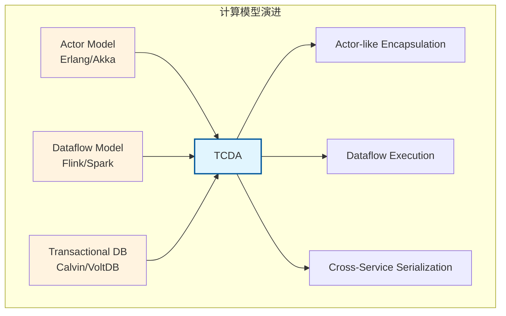
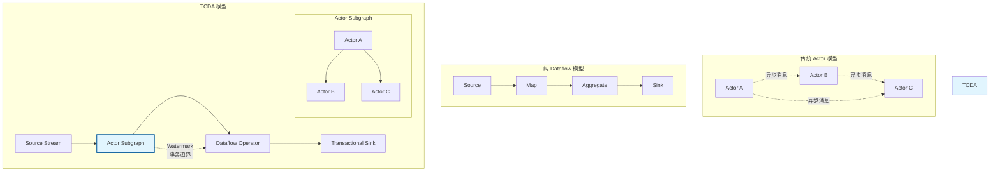
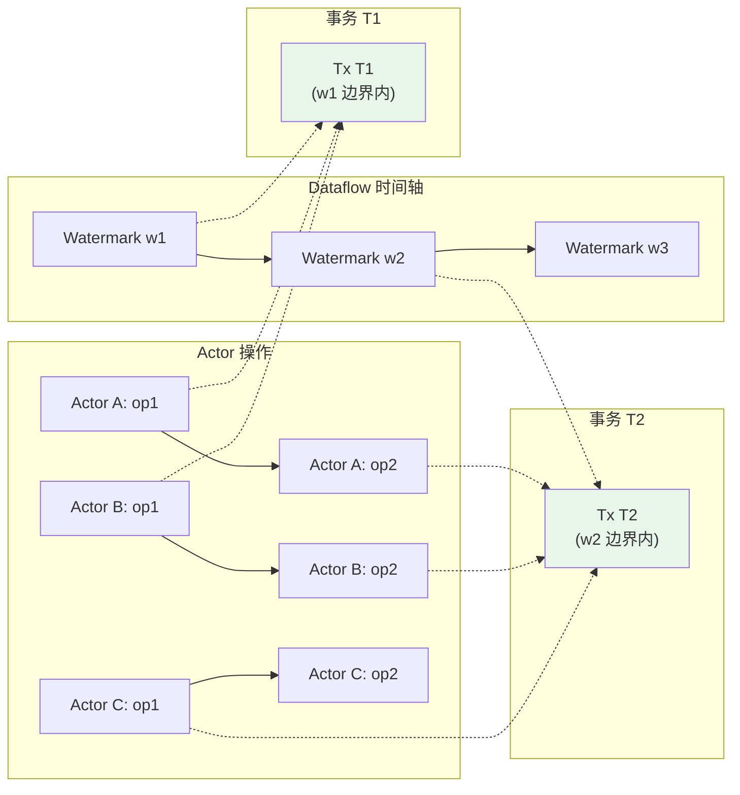
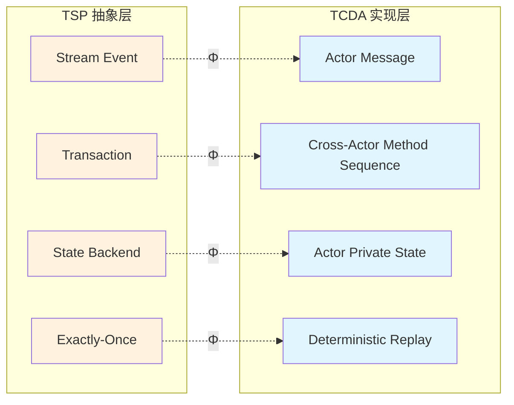

# Transactional Cloud Applications: Dataflow + Actor-like Programming

> **所属阶段**: Struct/06-frontier | **前置依赖**: [01.03-actor-model-formalization.md](../01-foundation/01.03-actor-model-formalization.md), [01.04-dataflow-model-formalization.md](../01-foundation/01.04-dataflow-model-formalization.md), [../../Knowledge/06-frontier/transactional-stream-processing-deep-dive.md](../../Knowledge/06-frontier/transactional-stream-processing-deep-dive.md) | **形式化等级**: L5-L6

---

## 1. 概念定义 (Definitions)

### Def-S-06-55: Transactional Cloud Dataflow Actor (TCDA) 计算模型

**定义**: Transactional Cloud Dataflow Actor（TCDA）是一种面向事务性云应用的新兴计算模型，核心思想是将 dataflow 执行引擎的增量处理能力（流处理语义）与 actor-like / 面向对象编程模型的封装性、隔离性和消息传递语义相结合，以支持跨服务边界的可串行化事务。

形式化地，TCDA 系统是一个七元组：

$$
\text{TCDA} = (\mathcal{A}, \mathcal{G}, \mathcal{T}, \Sigma, \delta, \mathcal{C}, \mathcal{W})
$$

其中：

- $\mathcal{A}$：Actor 集合，每个 actor $a \in \mathcal{A}$ 具有唯一标识符、私有状态和行为方法
- $\mathcal{G}$：Dataflow 图，$\mathcal{G} = (V, E)$，顶点 $V$ 对应 actor 方法调用或算子，边 $E$ 对应事件/消息流
- $\mathcal{T}$：事务集合，每个事务 $T \in \mathcal{T}$ 是 $\mathcal{G}$ 上的一条可串行化执行路径
- $\Sigma$：全局状态空间，$\Sigma = \prod_{a \in \mathcal{A}} \text{State}(a) \times \text{StreamState}(\mathcal{G})$
- $\delta: \Sigma \times \mathcal{E} \to \Sigma$：状态转移函数，将全局状态和输入事件映射到新状态
- $\mathcal{C}$：一致性约束集合，定义跨 actor 事务的完整性规则
- $\mathcal{W}$：Watermark/时间进展机制，用于在流语义下定义事务边界

**直观解释**: 在传统 actor 模型中，actor 通过异步消息传递交互，事务性由应用层保证。在 TCDA 中，actor 的方法调用和数据流图的边都被纳入统一的事务框架——一个事务可以跨越多个 actor 的方法调用，并通过 dataflow 的 watermark 机制定义提交边界。

### Def-S-06-56: Actor-like 编程语义边界

**定义**: TCDA 中的 "actor-like" 编程语义边界是指保留传统 actor 模型核心特征（封装、引用透明、消息传递）的同时，显式引入事务控制边界的编程抽象。

形式化地，一个 actor-like 实体 $a$ 的语义边界由以下四元组定义：

$$
\text{Boundary}(a) = (\text{Encaps}(a), \text{Ref}(a), \text{Msg}(a), \text{Tx}(a))
$$

其中：

1. **封装性** ($\text{Encaps}(a)$): actor $a$ 的状态 $\sigma_a$ 只能通过 $a$ 的行为方法访问和修改：
   $$
   \forall a' \neq a, \forall m \in \text{Methods}(a'): \text{modifies}(m) \cap \text{reads}(\sigma_a) = \emptyset
   $$

2. **引用透明性** ($\text{Ref}(a)$): 给定相同的消息序列，actor 产生相同的行为效果（确定性保证）：
   $$
   \forall \mu_1, \mu_2: \mu_1 = \mu_2 \Rightarrow \text{beh}(a, \mu_1) = \text{beh}(a, \mu_2)
   $$

3. **消息传递** ($\text{Msg}(a)$): actor 间交互仅通过异步消息完成，消息队列具有 FIFO 语义：
   $$
   \text{send}(a, a', m) \Rightarrow m \in \text{Queue}(a') \land \text{order}(\text{Queue}(a')) = \text{FIFO}
   $$

4. **事务控制** ($\text{Tx}(a)$): actor 的方法执行可被标记为事务的一部分，支持参与分布式事务的两阶段提交：
   $$
   \text{execute}(a, m) \in T \Rightarrow a \text{ 注册为事务 } T \text{ 的参与者}
   $$

### Def-S-06-57: Dataflow + Actor 事务边界

**定义**: 在 TCDA 中，事务边界由两个互补机制共同定义——dataflow 的 watermark 边界提供**时间维度**的粗粒度切分，actor 的方法调用提供**逻辑维度**的细粒度操作单元。

**Dataflow 事务边界**（流式语义）:

$$
\text{TxBoundary}_{df}(w) = \{ e \in \mathcal{E} \mid \text{timestamp}(e) \leq w \}
$$

即 watermark $w$ 之前的所有事件构成一个可提交批次。

**Actor 事务边界**（方法语义）:

$$
\text{TxBoundary}_{actor}(T) = \{ m_i(a_i) \mid a_i \in \text{Participants}(T) \land m_i \text{ 在 } T \text{ 上下文中执行} \}
$$

**统一事务边界**: 一个 TCDA 事务是同时满足 dataflow 边界和 actor 边界的操作集合：

$$
\text{TxBoundary}_{TCDA}(T) = \text{TxBoundary}_{df}(w_T) \cap \bigcup_{a \in \text{Participants}(T)} \text{TxBoundary}_{actor}(T, a)
$$

其中 $w_T$ 是事务 $T$ 的提交 watermark。

### Def-S-06-58: 跨服务可串行化 (Serializability Across Services)

**定义**: 跨服务可串行化是指 TCDA 系统中并发事务的执行历史等价于某个串行执行历史，即使这些事务涉及分布在不同服务（或不同 actor 宿主）中的 actor。

形式化地，设 $H$ 是 TCDA 系统的并发执行历史，$T_i \in H$ 是事务。$H$ 满足跨服务可串行化当且仅当存在串行历史 $H_{serial}$ 使得：

$$
H \equiv_{sr} H_{serial}
$$

其中 $\equiv_{sr}$ 是冲突等价关系：两个历史在冲突操作（读写、写写）上的顺序一致。

**TCDA 可串行化条件**: 对于涉及多个服务的 actor 的事务，系统必须确保：

1. **全局排序**: 所有跨服务事务在全局事务日志中有唯一顺序
2. **本地一致性**: 每个服务内部的事务执行与其在全局顺序中的位置一致
3. **watermark 单调性**: 若事务 $T_1$ 在全局顺序中先于 $T_2$，则 $w_{T_1} \leq w_{T_2}$

### Def-S-06-59: TCDA 与 TSP 的语义映射

**定义**: TCDA 与事务性流处理（TSP, Transactional Stream Processing）之间存在结构性映射。TCDA 可视为 TSP 在 actor-like 编程抽象上的实例化。

映射关系如下：

| TSP 概念 | TCDA 对应概念 | 映射说明 |
|---------|--------------|----------|
| 流事件 ($e \in E$) | actor 消息 ($m \in \text{Msg}(a)$) | 消息即事件，触发 actor 行为 |
| 事务 ($T \in \mathcal{T}$) | 跨 actor 方法调用序列 | 一个事务包含多个 actor 的操作 |
| 全局排序器 (Sequencer) | dataflow 源算子 / watermark | watermark 驱动全局时序 |
| 状态后端 (State Backend) | actor 私有状态 | actor 状态即事务状态 |
|  exactly-once 语义 | actor 引用透明 + 事务边界 | 确定性重放保证 exactly-once |

形式化映射函数：

$$
\Phi_{TSP\to TCDA}: TSP \to TCDA
$$

其中：

- $\Phi_{TSP\to TCDA}(E) = \bigcup_{a \in \mathcal{A}} \text{Msg}(a)$（所有 actor 的消息流）
- $\Phi_{TSP\to TCDA}(T) = \langle m_1(a_1), m_2(a_2), ..., m_k(a_k) \rangle$（事务映射为消息序列）
- $\Phi_{TSP\to TCDA}(\mathcal{G}) = \mathcal{G}_{TCDA}$（dataflow 图直接继承）

---

## 2. 属性推导 (Properties)

### Lemma-S-06-20: Actor 封装性保证本地可串行化

**引理**: 在 TCDA 中，由于 actor 的封装性（Def-S-06-56），单个 actor 内部的事务执行天然满足可串行化。

**证明**:

设 actor $a$ 参与两个并发事务 $T_1$ 和 $T_2$。由于 $\text{Encaps}(a)$ 要求 $a$ 的状态只能通过 $a$ 的方法访问，且 actor 的方法执行在实现上是顺序的（单线程事件循环模型），$T_1$ 和 $T_2$ 在 $a$ 上的操作必然按某种全序执行。

设该全序为 $\langle op_1, op_2, ..., op_n \rangle$。由于 $a$ 的方法是原子的（在 actor 语义中），这一全序本身就是串行历史。因此 $T_1$ 和 $T_2$ 在 $a$ 上的执行是可串行化的。$\square$

### Prop-S-06-20: Watermark 单调性蕴含事务全局顺序

**命题**: 若 TCDA 系统的 watermark 推进满足单调性，且事务提交与 watermark 对齐（Def-S-06-57），则已提交事务的全局顺序与 watermark 顺序一致。

**形式化表述**:

$$
\forall T_1, T_2 \in \mathcal{T}: \text{committed}(T_1) \land \text{committed}(T_2) \land w_{T_1} < w_{T_2} \Rightarrow T_1 \prec_{global} T_2
$$

其中 $\prec_{global}$ 是全局事务顺序。

**证明概要**:

1. 根据 Def-S-06-57，事务 $T$ 的 dataflow 边界为 $\text{TxBoundary}_{df}(w_T)$
2. watermark 单调性保证 $w_{T_1} < w_{T_2} \Rightarrow \text{TxBoundary}_{df}(w_{T_1}) \subset \text{TxBoundary}_{df}(w_{T_2})$
3. 事务提交时，其所有事件已被处理，且不会回退到更小 watermark
4. 因此 $T_1$ 的提交必然在 $T_2$ 之前，$T_1 \prec_{global} T_2$。$\square$

### Lemma-S-06-21: 跨服务可串行化的充分条件

**引理**: 若 TCDA 系统满足以下条件，则所有事务历史满足跨服务可串行化（Def-S-06-58）：

1. 每个 actor 内部执行可串行化（Lemma-S-06-20）
2. 跨 actor 事务通过两阶段提交（2PC）或确定性排序协议协调
3. watermark 单调性成立（Prop-S-06-20）

**证明概要**:

1. actor 内部可串行化提供了"本地串行化"基础
2. 2PC 或确定性排序确保跨 actor 事务在全局上具有全序
3. watermark 单调性保证该全局顺序与时间推进一致
4. 根据可串行化理论，若每个参与者的本地历史可串行化，且全局协调协议保证事务间的冲突顺序一致，则全局历史可串行化
5. 因此 TCDA 系统满足跨服务可串行化。$\square$

---

## 3. 关系建立 (Relations)

### TCDA 与现有计算模型的关系



### TCDA 与 Actor 模型的关系

TCDA 继承了 actor 模型的以下核心特性：

- **位置透明性**: actor 的标识符与物理位置解耦，支持跨服务迁移
- **故障隔离**: actor 的失败不会影响其他 actor（除非显式监督关系）
- **消息驱动**: 所有计算由消息到达触发

但 TCDA 对 actor 模型做了关键扩展：

- **事务性消息传递**: 传统 actor 消息是"发射后不管"（fire-and-forget），TCDA 支持事务性消息，消息的传递和接收成为事务的一部分
- **确定性重放**: TCDA 要求 actor 行为满足引用透明性（Def-S-06-56），以支持故障后的确定性恢复

### TCDA 与 Dataflow 模型的关系

TCDA 将 actor 嵌入 dataflow 图的方式有两种：

1. **Actor-as-Operator**: 每个 actor 实例对应 dataflow 图中的一个算子，actor 的方法调用对应算子的处理逻辑
2. **Actor-as-Graph**: 多个 actor 组成一个子图，子图内部通过消息传递交互，子图与外部通过 dataflow 边连接

```
Dataflow 图视角:
┌─────────────────────────────────────────────────────────────┐
│  Source ──► [Actor Subgraph] ──► [Aggregator Operator] ──► Sink  │
│             ┌─────────┐   ┌─────────┐                      │
│             │ Actor A │──►│ Actor B │                      │
│             └────┬────┘   └─────────┘                      │
│                  │                                         │
│             ┌────┴────┐                                    │
│             │ Actor C │                                    │
│             └─────────┘                                    │
│                                                            │
│  子图内部: 消息传递 (Actor 语义)                             │
│  子图外部: 数据流边 (Dataflow 语义)                          │
└─────────────────────────────────────────────────────────────┘
```

### TCDA 与 TSP 的深度关联

TCDA 可以被视为 TSP 的一种**编程模型层面的实现**。在 Knowledge/06-frontier/transactional-stream-processing-deep-dive.md 中，TSP 被定义为"将流处理的事件驱动特性与事务的 ACID 保证相结合的分布式计算范式"。TCDA 通过 actor-like 抽象为这一范式提供了具体的编程接口：

- TSP 的"流原生事务边界"对应 TCDA 的 watermark 驱动的事务边界
- TSP 的"确定性执行"对应 TCDA 的 actor 引用透明性
- TSP 的"跨实体一致性"对应 TCDA 的跨服务可串行化

**关键洞察**: TCDA 回答了 TSP 研究中一个开放问题——如何在保持流处理高吞吐、低延迟特性的同时，为开发者提供直观的事务编程模型。Actor-like 的面向对象抽象正是连接低层流执行与高层业务逻辑的桥梁。

---

## 4. 论证过程 (Argumentation)

### 4.1 为什么 Dataflow + Actor-like 是事务性云应用的正确方向？

**问题背景**: 传统云应用的事务处理面临两难困境：

1. **关系型数据库方案**: 强一致性，但扩展性差，不适合高并发流式场景
2. **NoSQL + 应用层补偿方案**: 高扩展性，但事务语义弱，一致性保证复杂
3. **纯 Dataflow 方案**: 高吞吐低延迟，但编程模型偏底层，事务控制困难

**TCDA 的论证框架**:

| 维度 | 关系型 DB | 纯 Dataflow | TCDA |
|------|----------|------------|------|
| 事务保证 | 强（ACID） | 弱（Sink 级） | 强（跨 actor 2PC） |
| 扩展性 | 垂直扩展为主 | 水平扩展优秀 | 水平扩展优秀 |
| 编程模型 | SQL / ORM | 算子图 | Actor-like OO |
| 延迟 | 中-高 | 低 | 低-中 |
| 故障恢复 | 日志重放 | Checkpoint | 确定性重放 |

**核心论证**: 事务性云应用（如实时金融风控、在线游戏状态同步、物联网设备编排）具有以下特征：

1. **事件驱动**: 系统行为由外部事件触发，天然适合 dataflow 模型
2. **状态ful**: 需要维护大量实体状态，actor 模型提供了理想的状态封装
3. **一致性要求**: 跨实体的操作需要事务保证，不能仅靠最终一致性
4. **服务边界**: 现代云应用由多个微服务组成，事务需要跨越服务边界

Dataflow 提供事件处理和水平扩展能力，actor-like 抽象提供状态封装和编程友好性，二者结合再通过 2PC/watermark 提供事务保证——这正是 TCDA 的设计哲学。

### 4.2 CIDR 2025 方向的学术背景

CIDR 2025 上涌现的多篇论文指向同一趋势：将声明式数据流执行与命令式/面向对象编程模型相融合。代表性方向包括：

1. **Styx** (确定性流分析 + 事务): 展示了 watermark 作为事务边界的可行性
2. **SFaaS** (Stateful Functions as a Service): 证明了 actor-like 函数可以参与分布式事务
3. **新兴 TCDA 提案**: 将 actor 的 mailbox 语义与 dataflow 的 window 语义统一，提出"事务性 actor 流"（Transactional Actor Streams）

**学术共识**: 未来的事务性云应用平台将不再在"强一致性"和"高扩展性"之间二选一，而是通过编程模型创新和协议优化实现二者兼得。TCDA 代表了这一方向的形式化基础。

### 4.3 边界与争议

**争议 1: actor 的异步消息传递是否与事务的同步提交语义冲突？**

**回应**: 在 TCDA 中，actor 的普通消息保持异步语义，但**事务性消息**在提交前对其他事务不可见。这类似于数据库中的"未提交读隔离"控制——事务内部可以异步交互，但事务边界处强制同步提交。

**争议 2: watermark 作为事务边界是否过于粗粒度？**

**回应**: watermark 提供的是**外部可见性边界**（即事务何时对其他 reader 可见），而非**内部操作边界**。事务内部的 actor 方法调用可以细粒度地交错执行，只需在 watermark 推进时进行统一的提交/回滚决策。对于需要更细粒度事务的场景，可以引入子 watermark 或显式事务标记。

---

## 5. 形式证明 / 工程论证 (Proof / Engineering Argument)

### Thm-S-06-20: TCDA 跨服务可串行化定理

**定理**: 在一个正确实现的 TCDA 系统中，所有并发事务的执行历史满足跨服务可串行化（Def-S-06-58）。

**形式化表述**:

设 $H$ 是 TCDA 系统的任意有效并发执行历史，则：

$$
\exists H_{serial}: H \equiv_{sr} H_{serial}
$$

其中 $H_{serial}$ 是一个串行历史（即事务按某种全序依次执行）。

**证明**:

**步骤 1: 定义全局事务顺序**

根据 Prop-S-06-20，watermark 单调性保证已提交事务按 watermark 全序排列。对于 watermark 相同的事务，由全局事务协调器（2PC 协调者或确定性排序器）分配全序。因此所有已提交事务具有全局全序 $\prec_{global}$。

**步骤 2: 证明冲突等价**

设 $T_i$ 和 $T_j$ 是两个事务，且在历史 $H$ 中存在冲突操作（即 $T_i$ 和 $T_j$ 访问同一 actor 状态且至少一个为写操作）。

根据 Lemma-S-06-20，每个 actor 内部的操作按全序执行。因此对于任何共享 actor $a$，$T_i$ 和 $T_j$ 在 $a$ 上的操作顺序与全局顺序一致：

$$
T_i \prec_{global} T_j \Rightarrow \forall op_i \in T_i|_a, op_j \in T_j|_a: op_i \prec_a op_j
$$

**步骤 3: 构造串行历史**

按全局顺序 $\prec_{global}$ 排列所有事务，得到串行历史 $H_{serial}$。对于任意两个事务 $T_i \prec_{global} T_j$，$H_{serial}$ 中 $T_i$ 的所有操作都在 $T_j$ 之前。

由于步骤 2 已证明冲突操作的顺序与全局顺序一致，$H$ 和 $H_{serial}$ 在冲突操作上的顺序相同，即 $H \equiv_{sr} H_{serial}$。

**结论**: TCDA 系统满足跨服务可串行化。$\square$

### Thm-S-06-21: TCDA  exactly-once 语义定理

**定理**: 在 TCDA 系统中，若 actor 满足引用透明性（Def-S-06-56）且 dataflow 执行采用确定性 checkpoint 恢复，则系统提供 exactly-once 处理语义。

**形式化表述**:

设输入事件序列为 $E = \langle e_1, e_2, ..., e_n \rangle$，系统在故障恢复后重放 $E$。设 $\eta(E)$ 为系统对 $E$ 产生的状态变更和输出。则：

$$
\eta(E) \text{ 在首次执行和恢复重放后相同}
$$

**证明**:

1. **Actor 确定性**: 根据 $\text{Ref}(a)$，对于任意 actor $a$，给定相同的消息序列，$a$ 的行为效果相同。

2. **Dataflow 确定性**: dataflow 图的执行是确定性的——给定相同的输入流和 watermark，算子（包括 actor-as-operator）产生的输出流唯一。

3. **Checkpoint 一致性**: 系统定期对全局状态 $\Sigma$ 做 checkpoint。故障恢复时，系统从最近 checkpoint 重启并重放该 checkpoint 后的输入事件。

4. **组合确定性**: 由步骤 1 和 2，重放的事件序列必然导致与首次执行相同的中间消息流和 actor 状态演进。由步骤 3，checkpoint 恢复保证系统从一致的全局状态开始重放。

5. **Exactly-once**: 由于执行是确定性的，每个事件的效果恰好生效一次——即使发生了故障重放，最终状态也与无故障执行相同，不存在重复处理或遗漏。

$\square$

---

## 6. 实例验证 (Examples)

### 6.1 电商订单处理：跨 Actor 事务

**场景**: 用户下单时，需要同时更新库存 actor、订单 actor 和支付 actor 的状态。

```python
# TCDA 风格的伪代码 class InventoryActor:
    def __init__(self):
        self.stock = {}

    @transactional
    def deduct(self, item_id, quantity):
        if self.stock[item_id] >= quantity:
            self.stock[item_id] -= quantity
            return True
        return False

class OrderActor:
    def __init__(self):
        self.orders = {}

    @transactional
    def create_order(self, order_id, items):
        self.orders[order_id] = Order(items, status="PENDING")
        return order_id

class PaymentActor:
    def __init__(self):
        self.payments = {}

    @transactional
    def charge(self, order_id, amount):
        self.payments[order_id] = Payment(amount, status="CHARGED")
        return True

# Dataflow 图中的事务协调 class OrderPipeline:
    def process_order_event(self, event):
        # 此事务跨越三个 actor
        with transaction(watermark=event.watermark) as tx:
            success = inventory_actor.deduct(event.item_id, event.qty)
            if success:
                order_id = order_actor.create_order(event.order_id, event.items)
                payment_actor.charge(order_id, event.amount)
                tx.commit()
            else:
                tx.rollback()
```

**事务保证**:

- 要么库存扣减、订单创建、支付扣款全部成功
- 要么全部失败，不会出现库存已扣但订单未创建的状态
- watermark 保证该事务的可见性在事件时间边界内原子切换

### 6.2 实时游戏状态同步

**场景**: 多人在线游戏中，玩家动作需要实时同步到所有客户端，同时保证状态一致性。

```
┌─────────────────────────────────────────────────────────────┐
│                    游戏状态 TCDA 架构                         │
├─────────────────────────────────────────────────────────────┤
│                                                             │
│   玩家动作流          Dataflow 图            状态更新输出     │
│   ┌─────────┐       ┌─────────────┐        ┌─────────┐     │
│   │ Move    │──────►│ PlayerActor │───────►│ Client 1│     │
│   │ Attack  │       │   (P1)      │        ├─────────┤     │
│   │ UseItem │       ├─────────────┤        │ Client 2│     │
│   └─────────┘       │ PlayerActor │        ├─────────┤     │
│                     │   (P2)      │        │ Client 3│     │
│                     ├─────────────┤        └─────────┘     │
│                     │ WorldActor  │                        │
│                     │  (共享状态)  │                        │
│                     └─────────────┘                        │
│                                                             │
│   事务示例: "玩家 P1 攻击 P2"                                │
│   1. P1 扣减 MP (P1 Actor)                                  │
│   2. P2 扣减 HP (P2 Actor)                                  │
│   3. 世界状态记录击杀 (WorldActor)                           │
│   4. 所有变更在同一个 watermark 边界内提交                    │
│                                                             │
└─────────────────────────────────────────────────────────────┘
```

### 6.3 IoT 设备编排

**场景**: 智能家居系统中，一个场景触发需要协调多个设备 actor 的动作。

```python
class LightActor:
    @transactional
    def set_brightness(self, level):
        self.brightness = level

class ThermostatActor:
    @transactional
    def set_temperature(self, temp):
        self.target_temp = temp

class CurtainActor:
    @transactional
    def set_position(self, pos):
        self.position = pos

# "回家模式" 场景作为一个事务 def arrive_home_scene():
    with transaction() as tx:
        light_actor.set_brightness(80)
        thermostat_actor.set_temperature(22)
        curtain_actor.set_position(100)
        tx.commit()
```

---

## 7. 可视化 (Visualizations)

### 7.1 TCDA 架构对比图



### 7.2 事务边界可视化



### 7.3 TCDA 与 TSP 映射关系图



---

## 8. 引用参考 (References)


---

*文档版本: 1.0 | 创建日期: 2026-04-14 | 状态: Complete*

---

*文档版本: v1.0 | 创建日期: 2026-04-18*
