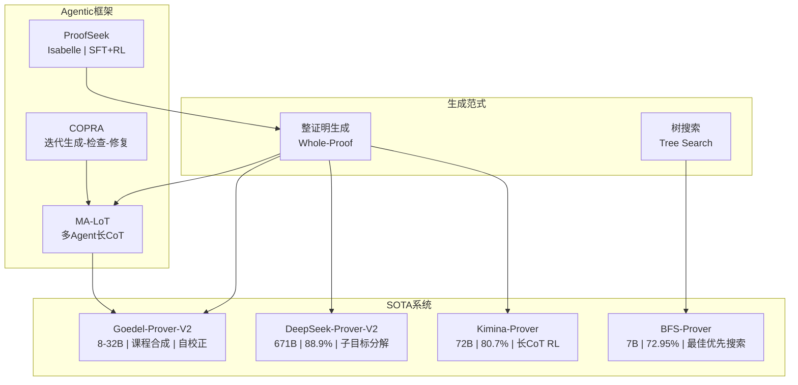
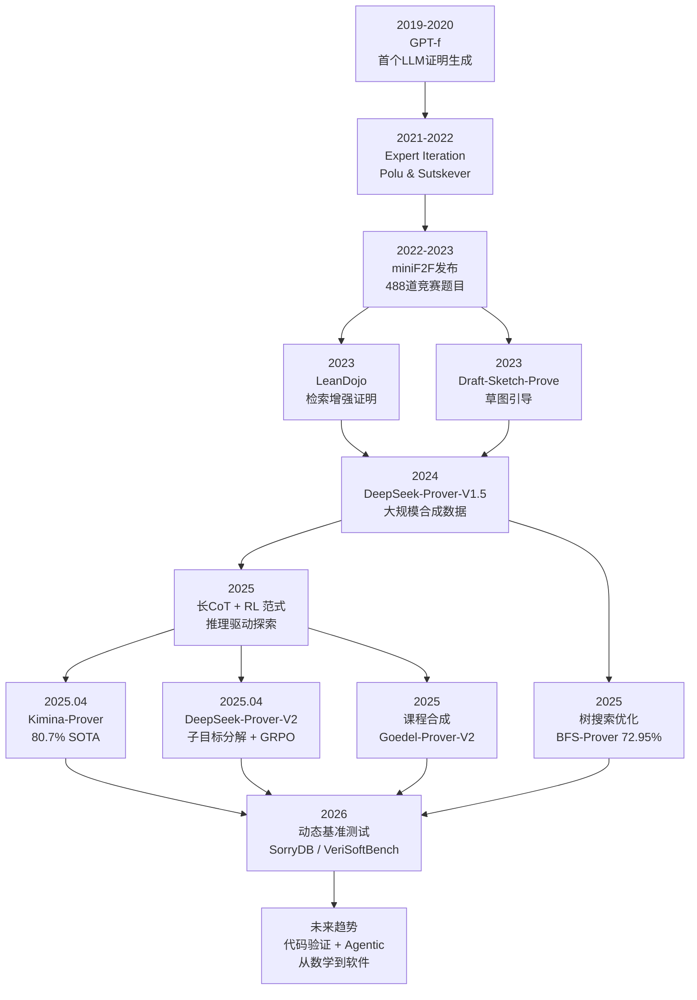
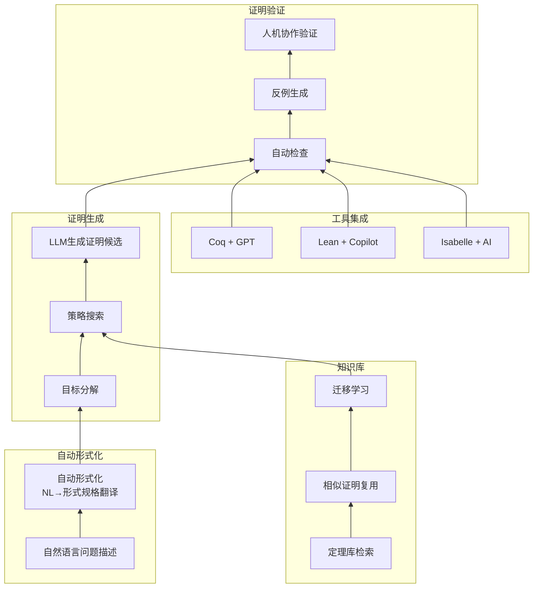
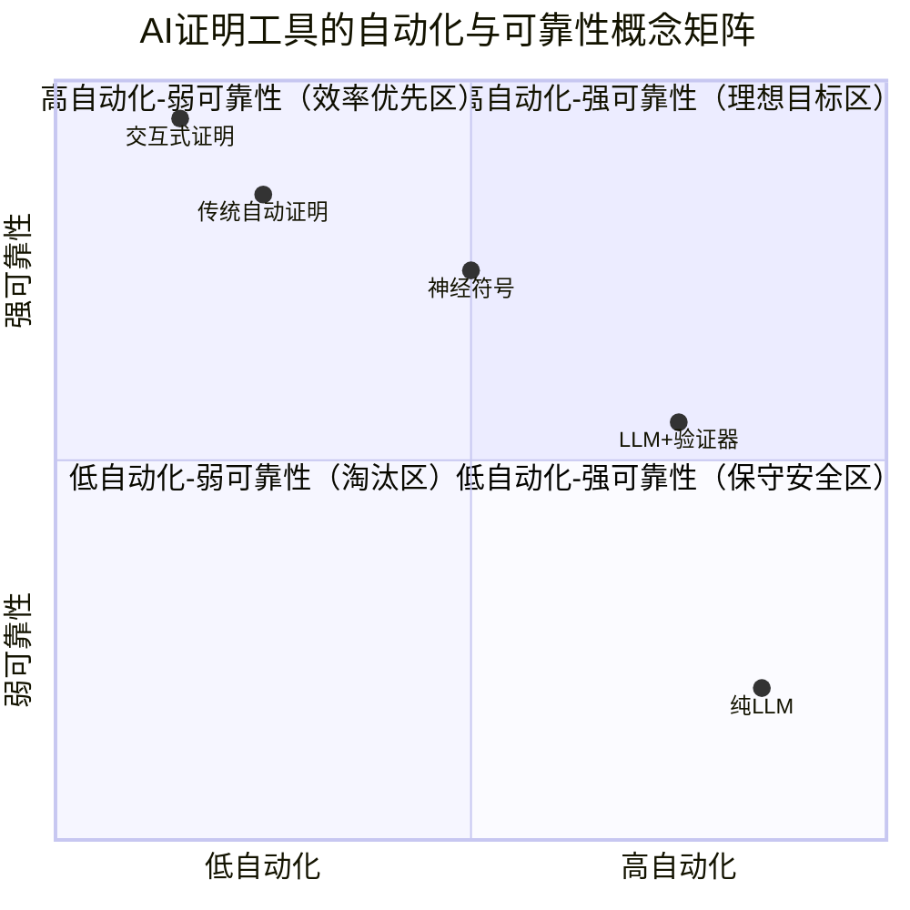
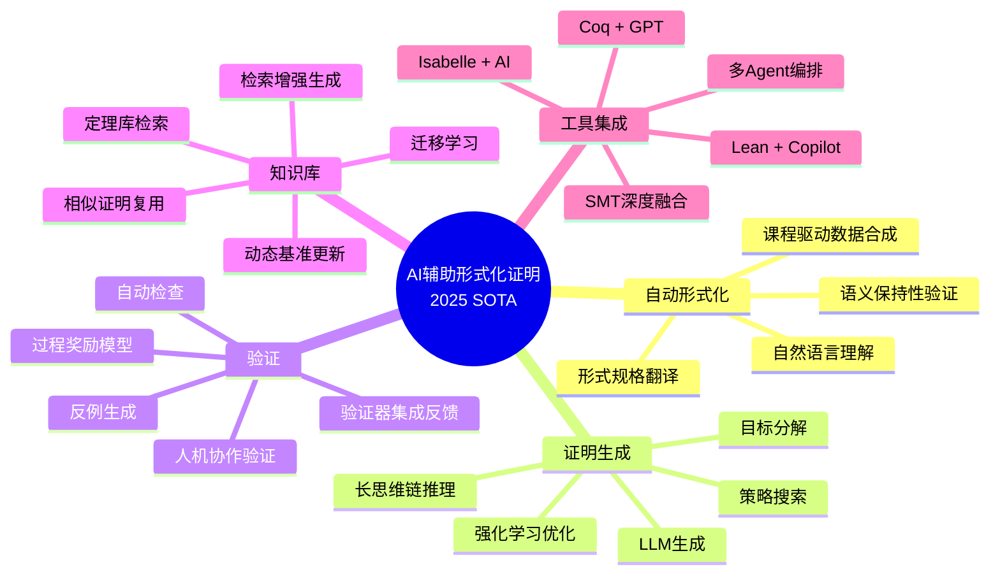

> **状态**: 🔮 前瞻内容 | **风险等级**: 高 | **最后更新**: 2026-04
>
> 此文档描述的内容处于早期规划阶段，可能与最终实现不符。请以各证明器系统的官方发布为准。
>
# AI辅助形式化证明 2025年 SOTA 综述

> **所属阶段**: Struct/06-frontier | **前置依赖**: [../04-proofs/](../04-proofs/) | **形式化等级**: L3-L4 | **理论框架**: Neural Theorem Proving + RL + Agentic

---

## 目录

- [AI辅助形式化证明 2025年 SOTA 综述](#ai辅助形式化证明-2025年-sota-综述)
  - [目录](#目录)
  - [摘要](#摘要)
  - [1. 概念定义 (Definitions)](#1-概念定义-definitions)
    - [Def-S-33-01. 神经定理证明器 (Neural Theorem Prover)](#def-s-33-01-神经定理证明器-neural-theorem-prover)
    - [Def-S-33-02. 证明搜索空间与验证器反馈](#def-s-33-02-证明搜索空间与验证器反馈)
    - [Def-S-33-03. 推理驱动的探索范式 (Reasoning-Driven Exploration)](#def-s-33-03-推理驱动的探索范式-reasoning-driven-exploration)
  - [2. 属性推导 (Properties)](#2-属性推导-properties)
    - [Lemma-S-33-01. Test-Time Scaling 单调性](#lemma-s-33-01-test-time-scaling-单调性)
    - [Prop-S-33-01. Agentic证明循环的收敛性](#prop-s-33-01-agentic证明循环的收敛性)
    - [Lemma-S-33-02. 检索增强证明的前提选择完备性界](#lemma-s-33-02-检索增强证明的前提选择完备性界)
  - [3. 关系建立 (Relations)](#3-关系建立-relations)
    - [关系 1: 整证明生成 ↔ 树搜索证明](#关系-1-整证明生成--树搜索证明)
    - [关系 2: 数学证明 ↦ 软件验证](#关系-2-数学证明--软件验证)
    - [关系 3: 形式化推理 ↔ 非形式化推理](#关系-3-形式化推理--非形式化推理)
  - [4. 论证过程 (Argumentation)](#4-论证过程-argumentation)
    - [4.1 从数学到代码验证的迁移鸿沟](#41-从数学到代码验证的迁移鸿沟)
    - [4.2 Test-Time Scaling: 顺序缩放 vs 并行缩放](#42-test-time-scaling-顺序缩放-vs-并行缩放)
  - [5. 形式证明 / 工程论证 (Proof / Engineering Argument)](#5-形式证明--工程论证-proof--engineering-argument)
    - [Thm-S-33-01. 强化学习增强定理证明的性能上界](#thm-s-33-01-强化学习增强定理证明的性能上界)
  - [6. 实例验证 (Examples)](#6-实例验证-examples)
    - [6.1 Kimina-Prover: 长CoT强化学习推理](#61-kimina-prover-长cot强化学习推理)
    - [6.2 DeepSeek-Prover-V2: 显式子目标分解](#62-deepseek-prover-v2-显式子目标分解)
    - [6.3 Goedel-Prover-V2: 课程驱动数据合成](#63-goedel-prover-v2-课程驱动数据合成)
    - [6.4 ProofSeek: AWS S3策略验证](#64-proofseek-aws-s3策略验证)
    - [6.5 AutoVerus: Rust代码自动验证](#65-autoverus-rust代码自动验证)
  - [7. 可视化 (Visualizations)](#7-可视化-visualizations)
    - [图 7.1: 2025年主流神经定理证明器对比矩阵](#图-71-2025年主流神经定理证明器对比矩阵)
    - [图 7.2: AI辅助形式化证明技术演进树](#图-72-ai辅助形式化证明技术演进树)
    - [图 7.3: AI辅助形式化证明SOTA推导链](#图-73-ai辅助形式化证明sota推导链)
    - [图 7.4: AI证明工具自动化与可靠性概念矩阵](#图-74-ai证明工具自动化与可靠性概念矩阵)
    - [图 7.5: AI辅助形式化证明2025 SOTA思维导图](#图-75-ai辅助形式化证明2025-sota思维导图)
  - [8. 引用参考 (References)](#8-引用参考-references)

---

## 摘要

2025年，AI辅助形式化证明经历了从**搜索驱动**到**推理驱动**的范式转变。**Kimina-Prover** (80.7%)[^1]、**DeepSeek-Prover-V2** (88.9%)[^2] 和 **Goedel-Prover-V2**[^3] 通过大规模RL、子目标分解和课程驱动数据合成推升自动证明成功率。**BFS-Prover** (72.95%)[^4] 挑战了MCTS的统治；**Lean-SMT** (CAV 2025)[^5] 深度集成SMT至Lean 4；**AutoVerus** (OOPSLA 2025)[^6] 实现Rust代码端到端自动验证。Agentic框架如 **COPRA**[^7] 和 **ProofSeek**[^8] 扩展应用场景至安全策略验证。

**关键词**: Neural Theorem Proving, Lean 4, RL, Agentic Proof, Test-Time Scaling

---

## 1. 概念定义 (Definitions)

### Def-S-33-01. 神经定理证明器 (Neural Theorem Prover)

**定义**: 神经定理证明器是由大型语言模型参数化的自动证明生成系统，输出形式化证明脚本，并通过证明助手内核验证。

**形式化表述**:

$$
\mathcal{P} = (\mathcal{M}, \mathcal{T}, \mathcal{V}, R, \pi_\theta)
$$

| 组件 | 类型 | 语义说明 |
|------|------|----------|
| $\mathcal{M}$ | LLM | 参数为 $\theta$ 的语言模型，$\mathcal{M}_\theta: \text{Prompt} \rightarrow \text{Distribution}(\text{ProofScript})$ |
| $\mathcal{T}$ | TacticSpace | 目标证明助手的合法tactic/证明语句集合 |
| $\mathcal{V}$ | Verifier | 证明验证器，$\mathcal{V}: \text{ProofScript} \times \text{Theorem} \rightarrow \{0, 1\}$ |
| $R$ | Reward | 奖励函数，$R = 1$ 当且仅当 $\mathcal{V}(p, t) = 1$ |
| $\pi_\theta$ | Policy | 策略网络，生成证明候选的概率分布 $p \sim \pi_\theta(\cdot \mid t)$ |

**两类生成范式**:

1. **整证明生成**: 模型一次性输出完整证明脚本，由验证器端到端检验。
2. **逐步生成/树搜索**: 模型逐个生成tactic，每一步后查询验证器获取新证明状态，在证明状态树上搜索。

### Def-S-33-02. 证明搜索空间与验证器反馈

**定义**: 证明搜索空间是一个有向树 $\mathcal{S} = (N, E, \sigma_0, \mathcal{G})$，节点为证明状态，边为tactic应用，根节点为初始待证目标，目标节点集合 $\mathcal{G}$ 包含所有证明完成的终止状态。

**形式化表述**:

$$
N = \{\sigma \mid \sigma \text{ 为证明状态}\}, \quad E = \{(\sigma, s, \sigma') \mid \sigma' = \mathcal{V}_{\text{step}}(\sigma, s)\}
$$

**关键观察**: 验证器提供的二元反馈是**稀疏奖励信号**。为改善信用分配，2025年SOTA系统普遍引入**过程奖励**或**验证器集成推理**[^9]。

### Def-S-33-03. 推理驱动的探索范式 (Reasoning-Driven Exploration)

**定义**: 推理驱动的探索是不依赖外部搜索算法、而是利用LLM内部推理能力（通过长思维链）隐式展开证明搜索空间的范式。

**形式化表述**:

$$
r = (\underbrace{r_1, r_2, ..., r_m}_{\text{推理tokens}}, \underbrace{s_1, s_2, ..., s_n}_{\text{证明tokens}})
$$

其中推理tokens模拟人类数学家的问题求解策略——包括路径探索、反思修正和小规模案例分析[^1]。

| 维度 | 树搜索 (BFS/MCTS) | 推理驱动 (长CoT) |
|------|-------------------|------------------|
| 搜索控制 | 外部算法 | 模型内部推理token |
| 样本效率 | 低（多次LLM调用） | 高（单次生成） |
| 代表系统 | BFS-Prover | Kimina-Prover |

---

## 2. 属性推导 (Properties)

### Lemma-S-33-01. Test-Time Scaling 单调性

**引理**: 对于基于采样的神经定理证明器，设 $p_k$ 为 $k$ 次独立采样下至少找到一个正确证明的概率，则：

$$
p_k = 1 - (1 - p_1)^k
$$

其中 $p_1$ 为单次采样的通过概率 (pass@1)。

**证明概要**: 每次采样为伯努利试验，$k$ 次全部失败的概率为 $(1 - p_1)^k$，因此至少一次成功为 $1 - (1 - p_1)^k$。显然 $p_{k+1} > p_k$，即单调递增。∎

**推论**: 样本效率 $p_1$ 决定了Test-Time Scaling的边际收益。Kimina-Prover pass@1 = 52.94%[^1]，在少量采样下即可达到竞争力水平。

### Prop-S-33-01. Agentic证明循环的收敛性

**命题**: 考虑Agentic证明框架，每次迭代执行 (生成 → 验证 → 修复)。若修复策略在有限步内以正概率 $\epsilon > 0$ 消除错误，则循环在有限期望步内收敛，且期望收敛轮数 $\mathbb{E}[T] \leq 1/\epsilon$。

**工程意义**: COPRA[^7]、MA-LoT[^10] 和 ProofSeek[^8] 等系统正是基于此收敛性设计多轮迭代。实际中，语法错误易于修复（高$\epsilon$），而策略性错误则可能需要人类干预。∎

### Lemma-S-33-02. 检索增强证明的前提选择完备性界

**引理**: 设待证定理依赖的前提集合为 $\mathcal{L}$（$|\mathcal{L}| = m$），检索系统返回候选集合 $\hat{\mathcal{L}}$（$|\hat{\mathcal{L}}| = k$），召回率为 $r$。在不引入无关前提下，成功证明的概率上界为：

$$
\mathbb{P}[\text{success} \mid \hat{\mathcal{L}}] \leq \min\left(1, \frac{k \cdot r}{m}\right) \cdot \mathbb{P}[\text{success} \mid \mathcal{L}]
$$

**直观解释**: 该引理量化了 LeanDojo[^11] 等系统的根本张力——检索窗口 $k$ 有限而真实依赖 $m$ 在Mathlib4中可能超过100。Kimina-Prover通过将检索融入长CoT推理缓解了此问题[^1]。∎

---

## 3. 关系建立 (Relations)

### 关系 1: 整证明生成 ↔ 树搜索证明

2025年神经定理证明系统形成两条技术路线：

- **整证明生成路线**: Kimina-Prover[^1]、DeepSeek-Prover-V2[^2]、Goedel-Prover-V2[^3] —— 通过大规模RL训练模型直接生成完整证明。
- **树搜索路线**: BFS-Prover[^4]、LeanDojo + ReProver[^11] —— 保持tactic级别交互，利用外部搜索算法导航证明空间。

两条路线在数学上等价：任何整证明可逐tactic展开为树路径；反之，任何成功路径可拼接为整证明。差异在于**计算效率**与**样本效率**的权衡。

### 关系 2: 数学证明 ↦ 软件验证

形式化数学证明与软件验证共享同一理论基础，但存在结构性差异：

| 维度 | 数学证明 (Mathlib4) | 软件验证 (Rust/Verus, S3策略) |
|------|--------------------|------------------------------|
| 引理生态 | 密集 (>100K 定理) | 稀疏（需自证引理） |
| 问题结构 | 定义明确，陈述紧凑 | 需处理状态、副作用、并发 |
| 失败模式 | 策略错误 | "概念增殖" [^12] |
| SOTA通过率 | ~80% (miniF2F) | ~30-40% (真实代码) |

**概念增殖问题**: 软件验证中，简单性质可能依赖于大量辅助定义和中间引理，形成"证明膨胀"，与Mathlib4中既有引理可直接引用的场景形成鲜明对比[^12]。

### 关系 3: 形式化推理 ↔ 非形式化推理

当前通用LLM在非形式化数学推理上表现出色（可解所有15道AIME问题），但在形式化证明上显著落后：OpenAI o3-mini 的 miniF2F pass@32 仅 24.59%，Gemini 2.5 Pro 仅 37.70%，而 Kimina-Prover 达 68.85%[^1]。这表明**形式化推理是独立能力**，不能简单由非形式化推理迁移得到。

---

## 4. 论证过程 (Argumentation)

### 4.1 从数学到代码验证的迁移鸿沟

当前SOTA系统主要在 **miniF2F**（488道竞赛级数学题目）和 **PutnamBench**（1,724道竞赛题目）上评估。这些基准存在饱和性问题（已被 Seed-Prover[^13] 接近饱和）、数据污染和领域错配。**SorryDB** (2026)[^14] 和 **VeriSoftBench** (2026)[^15] 从真实Lean项目中挖掘未完成的`sorry`任务，动态更新以避免污染。评估显示：当前模型在真实项目上表现显著低于miniF2F，且不同模型解决的问题集合具有**互补性**。

### 4.2 Test-Time Scaling: 顺序缩放 vs 并行缩放

**顺序缩放**通过长CoT进行迭代反思，Kimina-Prover为代表，样本效率高但延迟高。**并行缩放**独立采样多个候选证明，pass@$k$ 为典型度量，易并行化但样本效率低。2025年最优实践是**混合策略**：先用顺序推理生成高质量候选，再对困难情况回退到并行采样。EconProver[^16] 的动态CoT切换机制进一步优化了此权衡。

---

## 5. 形式证明 / 工程论证 (Proof / Engineering Argument)

### Thm-S-33-01. 强化学习增强定理证明的性能上界

**定理**: 设初始策略 $\pi_0$ 在定理分布 $\mathcal{D}$ 上的期望成功率为 $\alpha_0$。经过 $N$ 轮专家迭代，每轮利用验证器反馈筛选成功证明并加入训练集，新策略 $\pi_N$ 的期望成功率满足：

$$
\alpha_N \geq \alpha_0 + \sum_{i=1}^{N} \Delta_i, \quad \Delta_i \geq c \cdot \alpha_{i-1} \cdot (1 - \alpha_{i-1})
$$

对于某个常数 $c > 0$（取决于模型容量和数据多样性）。

**证明概要**:

1. **基础情况** ($N=0$): 显然成立，$\alpha_N = \alpha_0$。

2. **归纳步骤**: 假设对 $N-1$ 轮成立。第 $N$ 轮中，模型以概率 $\alpha_{N-1}$ 成功解决定理并生成训练数据。由模型容量假设，学习这些新正例可提升"边界可解"定理成功率至少 $c \cdot \alpha_{N-1} \cdot (1 - \alpha_{N-1})$，在 $\alpha_{N-1} \approx 0.5$ 时最大，趋近于1时边际递减。

3. **收敛分析**: 收敛速度为 $O(1/N)$。工程验证显示 Goedel-Prover-V2[^3] 早期迭代提升显著（每轮 +5-10%），后期进入平台期。∎

---

## 6. 实例验证 (Examples)

### 6.1 Kimina-Prover: 长CoT强化学习推理

Kimina-Prover Preview (2025)[^1] 基于 Qwen2.5-72B，通过 Kimi k1.5 RL 流水线训练，核心创新为**Formal Reasoning Pattern**和清晰的**模型规模效应**（1.5B→72B持续提升）。pass@1 = 52.94%，pass@8192 = 80.74%。

### 6.2 DeepSeek-Prover-V2: 显式子目标分解

DeepSeek-Prover-V2 (2025)[^2] 采用双模型流水线：DeepSeek-V3 生成证明草图并递归分解子目标，证明模型形式化为Lean 4片段，使用 **GRPO** 强化学习。671B模型达88.9% (MiniF2F)。

### 6.3 Goedel-Prover-V2: 课程驱动数据合成

Goedel-Prover-V2 (2025)[^3] 建立在三个机制上：**Scaffolded Data Synthesis**（自动形式化器将1.64M自然语言陈述翻译为Lean 4）、**Verifier-Guided Self-Correction**和**Model Averaging**。数据飞轮形成自举：自然语言问题 → 自动形式化 → 证明尝试 → 验证器反馈 → 成功证明加入训练集 → 迭代更难问题。

### 6.4 ProofSeek: AWS S3策略验证

ProofSeek (2025)[^8] 面向非数学领域的形式化验证，采用两阶段微调（SFT学习Isabelle语法，RL鼓励验证器通过）。AWS S3用例将桶访问策略转化为形式化安全性质，通过Isabelle/HOL验证，未见领域提升3%成功率。

### 6.5 AutoVerus: Rust代码自动验证

AutoVerus (OOPSLA 2025)[^6] 针对Rust/Verus，由LLM Agent网络模拟三阶段：生成循环不变量、多Agent精化、Verus引导调试。150个非平凡任务通过率 > 90%，半数在 < 30秒内完成。获OOPSLA Distinguished Artifact Award。

---

## 7. 可视化 (Visualizations)

### 图 7.1: 2025年主流神经定理证明器对比矩阵

该矩阵揭示两个趋势：(1) 头部系统已从逐步搜索转向整证明生成；(2) Agentic框架作为"元层"编排多个证明器。

### 图 7.2: AI辅助形式化证明技术演进树

技术演进呈现"数据-算法-评估"三轮驱动：数据侧走向自动合成；算法侧走向大规模RL；评估侧走向动态真实项目。

### 图 7.3: AI辅助形式化证明SOTA推导链

该推导链揭示了AI辅助形式化证明的五层架构：自动形式化为输入层，证明生成为核心引擎，验证为质量关卡，知识库为记忆增强，工具集成为生态落地。各层之间存在双向反馈——验证器的反例可回流至生成环节修正策略，知识库的迁移学习可提升新域证明效率。

### 图 7.4: AI证明工具自动化与可靠性概念矩阵

该矩阵定位了五类方法在自动化-可靠性空间的分布趋势：纯LLM自动化最高但可靠性最弱（幻觉风险）；交互式证明可靠性最强但需大量人工介入；神经符号与传统自动证明占据保守安全区，是当前工程落地的稳妥选择；LLM+验证器处于向理想目标区演进的关键路径上。

### 图 7.5: AI辅助形式化证明2025 SOTA思维导图

思维导图以"AI辅助形式化证明2025 SOTA"为中心，放射展开五大核心维度。每个维度下细分3-5个关键技术点，完整覆盖了从自然语言输入到形式化证明输出的全链路技术栈，以及支撑该链路的知识底座与工具生态。

---

## 8. 引用参考 (References)

[^1]: H. Wang et al., "Kimina-Prover Preview: Towards Large Formal Reasoning Models with Reinforcement Learning," arXiv:2504.11354, 2025.

[^2]: Z.Z. Ren et al., "DeepSeek-Prover-V2: Advancing Formal Mathematical Reasoning via RL for Subgoal Decomposition," arXiv:2504.21801, 2025.

[^3]: Y. Lin et al., "Goedel-Prover-V2: Scaling Formal Theorem Proving with Scaffolded Data Synthesis and Self-Correction," arXiv:2508.03613, 2025.

[^4]: R. Xin et al., "BFS-Prover: Scalable Best-First Tree Search for LLM-based Automatic Theorem Proving," ACL 2025, arXiv:2502.03438, 2025.

[^5]: A. Mohamed et al., "lean-smt: An SMT Tactic for Discharging Proof Goals in Lean," CAV 2025, pp. 197–212, 2025.

[^6]: C. Yang et al., "AutoVerus: Automated Proof Generation for Rust Code," OOPSLA 2025, 2025.

[^7]: A.D. Thakur et al., "COPRA: A Coq-Based Proof Repair Agent," arXiv:2310.04891, 2024.

[^8]: B. Rao et al., "Neural Theorem Proving: Generating and Structuring Proofs for Formal Verification," arXiv:2504.17017, 2025.

[^9]: Y. Ji et al., "Leanabell-Prover-V2: Verifier-integrated Reasoning for Formal Theorem Proving via RL," arXiv:2507.08649, 2025.

[^10]: C. Wang et al., "MA-LoT: Multi-Agent Lean-based Long Chain-of-Thought for Theorem Proving," 2025.

[^11]: K. Yang et al., "LeanDojo: Theorem Proving with Retrieval-Augmented Language Models," NeurIPS 2023, 2023.

[^12]: R. Reuel et al., "The Concept Proliferation Problem in Automated Software Verification," 2024.

[^13]: Y. Chen et al., "Seed-Prover: Advanced Theorem Proving via Iterative Proof Refinement," 2025.

[^14]: E. Letson et al., "SorryDB: A Dynamic Benchmark for Automated Theorem Proving from Real-World Lean Projects," arXiv:2603.02668, 2026.

[^15]: Y. Xu et al., "VeriSoftBench: Evaluating Proof Synthesis over Repository-Scale Lean Verification Tasks," 2026.

[^16]: C. Xi et al., "EconProver: Towards More Economical Test-Time Scaling for Automated Theorem Proving," arXiv:2509.12603, 2025.
