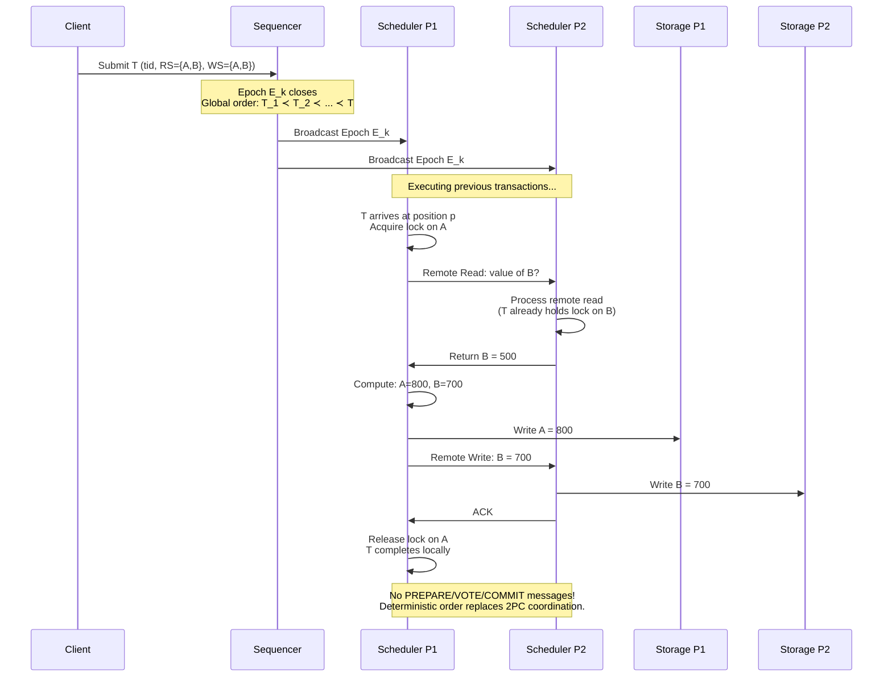
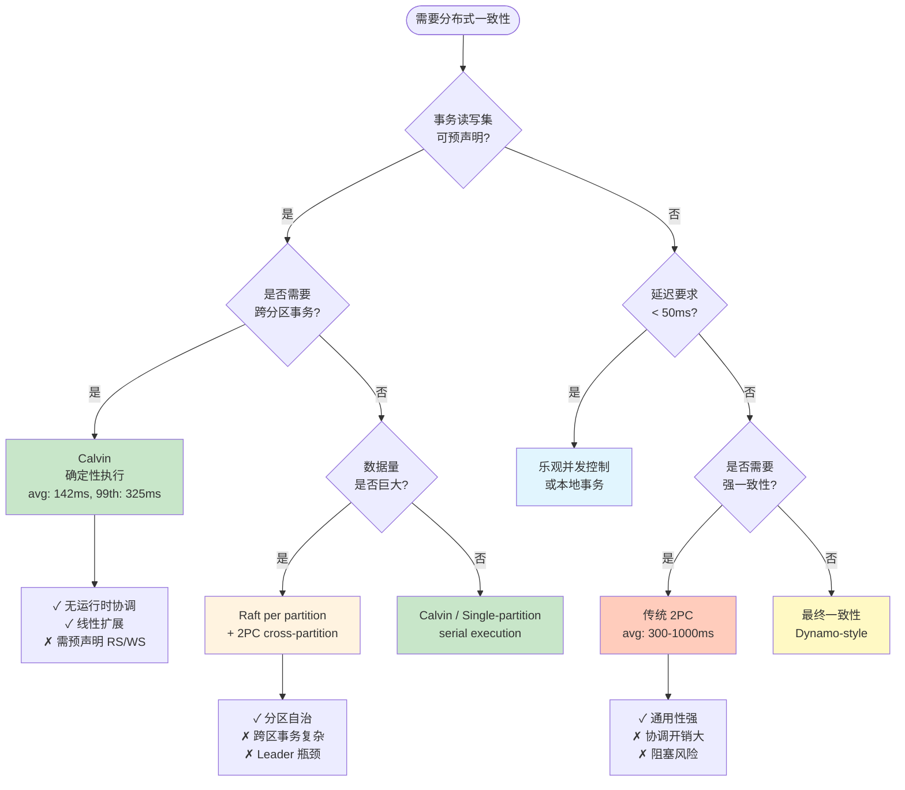
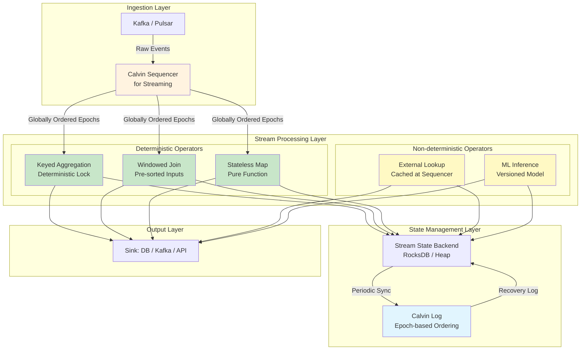

# Calvin 确定性执行模型与流处理状态管理

> **所属阶段**: Struct/06-frontier | **前置依赖**: [01.04-dataflow-model-formalization.md](../01-foundation/01.04-dataflow-model-formalization.md), [Flink/02-core/exactly-once-semantics-deep-dive.md](../../Flink/02-core/exactly-once-semantics-deep-dive.md) | **形式化等级**: L5-L6

---

## 摘要

Calvin 是 Thomson 等人在 SIGMOD'12 提出的确定性分布式事务协议，其核心洞见在于：**通过在事务执行前对全局操作序列进行确定性排序，彻底消除分布式事务执行阶段的两阶段提交（2PC）开销**，从而实现跨分区事务的线性扩展。
与 Spanner 依赖 TrueTime 和 2PC 的传统路径不同，Calvin 将事务处理拆分为三个阶段——**预处理（Preprocessing）、全局排序（Sequencing）、确定性执行（Deterministic Execution）**——其中仅预处理阶段需要获取读写集，执行阶段完全按预定顺序无协调推进。
FaunaDB 将 Calvin 投入生产后，实现了跨大陆事务平均延迟 142ms、99th 百分位 < 325ms 的优异性能，较传统 2PC 方案降低一个数量级。

本文从形式化视角出发，将 Calvin 建模为六元组分布式系统，严格定义其 Sequencer、Scheduler 和 Storage Layer 的语义边界；
证明 Calvin 确定性执行的核心定理——**在全局排序一致的前提下，所有副本无需协调即可达到相同终态**；
并建立 Calvin 与 2PC、Raft、Paxos、Flink Checkpoint 之间的严格形式化映射。
更进一步，本文揭示 Calvin 的确定性哲学与流处理中"确定性重放（Deterministic Replay）"需求的深层同构关系：二者均通过**前置排序+无副作用重放**消除运行时的不确定性，从而在保证一致性的同时移除协调瓶颈。
最后，本文讨论 Calvin 对下一代流处理状态一致性机制的启示——一种融合"Calvin 式预排序"与"流式增量处理"的新型混合架构，可能突破当前 Checkpoint 机制在超低延迟场景下的根本局限。

**关键词**: Calvin, 确定性事务, 确定性执行, 流处理, 状态一致性, 确定性重放, FaunaDB, 两阶段提交替代

---

## 目录

- [Calvin 确定性执行模型与流处理状态管理](#calvin-确定性执行模型与流处理状态管理)
  - [摘要](#摘要)
  - [目录](#目录)
  - [1. 概念定义 (Definitions)](#1-概念定义-definitions)
    - [Def-S-06-20-01: Calvin 分布式确定性事务系统](#def-s-06-20-01-calvin-分布式确定性事务系统)
    - [Def-S-06-20-02: Sequencer（序列器）与全局排序](#def-s-06-20-02-sequencer序列器与全局排序)
    - [Def-S-06-20-03: Scheduler（调度器）与确定性锁协议](#def-s-06-20-03-scheduler调度器与确定性锁协议)
    - [Def-S-06-20-04: Storage Layer 与无协调执行语义](#def-s-06-20-04-storage-layer-与无协调执行语义)
    - [Def-S-06-20-05: 确定性重放（Deterministic Replay）](#def-s-06-20-05-确定性重放deterministic-replay)
    - [Def-S-06-20-06: 流处理状态一致性框架](#def-s-06-20-06-流处理状态一致性框架)
  - [2. 属性推导 (Properties)](#2-属性推导-properties)
    - [Lemma-S-06-20-01: Sequencer 排序的线性一致性](#lemma-s-06-20-01-sequencer-排序的线性一致性)
    - [Lemma-S-06-20-02: 确定性锁的互斥与无死锁性](#lemma-s-06-20-02-确定性锁的互斥与无死锁性)
    - [Prop-S-06-20-01: Calvin 串行化等价性](#prop-s-06-20-01-calvin-串行化等价性)
    - [Prop-S-06-20-02: 确定性重放的状态收敛性](#prop-s-06-20-02-确定性重放的状态收敛性)
  - [3. 关系建立 (Relations)](#3-关系建立-relations)
    - [3.1 Calvin 与 2PC 的形式化对比](#31-calvin-与-2pc-的形式化对比)
    - [3.2 Calvin 与 Raft/Paxos 的关系](#32-calvin-与-raftpaxos-的关系)
    - [3.3 Calvin 与 Flink Checkpoint 的深层映射](#33-calvin-与-flink-checkpoint-的深层映射)
    - [3.4 Calvin 与 State Machine Replication 的同构](#34-calvin-与-state-machine-replication-的同构)
    - [3.5 统一对比矩阵](#35-统一对比矩阵)
  - [4. 论证过程 (Argumentation)](#4-论证过程-argumentation)
    - [4.1 反例分析：非确定性执行导致状态分叉](#41-反例分析非确定性执行导致状态分叉)
    - [4.2 边界讨论：读写集预声明的完备性约束](#42-边界讨论读写集预声明的完备性约束)
    - [4.3 构造性说明：Calvin 如何消除 2PC 协调开销](#43-构造性说明calvin-如何消除-2pc-协调开销)
    - [4.4 边界条件：网络分区下的确定性保证](#44-边界条件网络分区下的确定性保证)
  - [5. 形式证明 / 工程论证 (Proof / Engineering Argument)](#5-形式证明--工程论证-proof--engineering-argument)
    - [Thm-S-06-20-01: Calvin 确定性执行定理](#thm-s-06-20-01-calvin-确定性执行定理)
    - [Thm-S-06-20-02: Calvin-流处理状态一致性映射定理](#thm-s-06-20-02-calvin-流处理状态一致性映射定理)
    - [Thm-S-06-20-03: 确定性重放下界延迟定理](#thm-s-06-20-03-确定性重放下界延迟定理)
  - [6. 实例验证 (Examples)](#6-实例验证-examples)
    - [6.1 简化 Calvin 执行实例：银行转账](#61-简化-calvin-执行实例银行转账)
    - [6.2 FaunaDB 生产性能数据](#62-faunadb-生产性能数据)
    - [6.3 Calvin 与 Flink Checkpoint 对比实例](#63-calvin-与-flink-checkpoint-对比实例)
    - [6.4 局限性实例：读写集预测失败与级联中止](#64-局限性实例读写集预测失败与级联中止)
  - [7. 可视化 (Visualizations)](#7-可视化-visualizations)
    - [7.1 Calvin 架构层次图](#71-calvin-架构层次图)
    - [7.2 Calvin 执行流程时序图](#72-calvin-执行流程时序图)
    - [7.3 Calvin vs 2PC vs Raft 决策树](#73-calvin-vs-2pc-vs-raft-决策树)
    - [7.4 Calvin-流处理融合架构图](#74-calvin-流处理融合架构图)
  - [8. 引用参考 (References)](#8-引用参考-references)

---

## 1. 概念定义 (Definitions)

### Def-S-06-20-01: Calvin 分布式确定性事务系统

**定义**: Calvin 是一种面向分区数据库系统的确定性分布式事务协议。形式化地，一个 Calvin 系统是一个六元组：

$$
\text{Calvin} = (\mathcal{P}, \mathcal{S}, \mathcal{C}, \mathcal{T}, \prec, \delta)
$$

其中各分量的语义如下：

1. **分区集合** $\mathcal{P} = \{P_1, P_2, \ldots, P_n\}$：数据被水平分区到 $n$ 个节点，每个分区 $P_i$ 维护数据子集 $\mathcal{D}_i$，满足 $\bigcup_{i=1}^{n} \mathcal{D}_i = \mathcal{D}$ 且 $\mathcal{D}_i \cap \mathcal{D}_j = \emptyset$（$i \neq j$）。

2. **排序层** $\mathcal{S}$（Sequencer Layer）：由一组 Sequencer 节点组成，负责接收事务请求、提取读写集、并将事务按全局确定性顺序 $\prec$ 排列。Sequencer 层本身通过 Paxos 或类似共识协议实现高可用。

3. **计算层** $\mathcal{C}$（Scheduler/Executor Layer）：每个分区 $P_i$ 关联一个 Scheduler $C_i$，负责按照 Sequencer 输出的全局顺序获取确定性锁并执行事务逻辑。

4. **事务集合** $\mathcal{T}$：每个事务 $T \in \mathcal{T}$ 是一个四元组 $T = (\text{tid}, RS(T), WS(T), f_T)$，其中：
   - $\text{tid}$：全局唯一事务标识符
   - $RS(T) \subseteq \mathcal{D}$：读取集（Read Set），事务 $T$ 需要读取的数据项集合
   - $WS(T) \subseteq \mathcal{D}$：写入集（Write Set），事务 $T$ 需要修改的数据项集合
   - $f_T: \mathcal{D}^{|RS(T)|} \to \mathcal{D}^{|WS(T)|}$：确定性事务逻辑函数

5. **全局全序** $\prec$：Sequencer 层在事务执行前建立的严格全序关系，满足：
   $$
   \forall T_i, T_j \in \mathcal{T}: T_i \prec T_j \lor T_j \prec T_i \lor T_i = T_j
   $$
   该全序通过 **epoch-based batching** 实现：事务被分批进入 epoch，epoch 内部按确定性规则（如事务哈希值）排序，epoch 之间按序列号排序。

6. **状态转移函数** $\delta$：给定当前数据库状态 $\sigma \in \Sigma$ 和一个按 $\prec$ 排序的事务序列 $\langle T_1, T_2, \ldots, T_m \rangle$，确定性执行产生唯一终态：
   $$
   \sigma' = \delta(\sigma, \langle T_1, T_2, \ldots, T_m \rangle) = f_{T_m}(\cdots f_{T_2}(f_{T_1}(\sigma))\cdots)
   $$

**直观解释**: Calvin 的核心设计哲学是"**先排序，后执行，无协调**"（Order First, Execute Later, No Coordination）。传统分布式事务在执行过程中通过 2PC 动态协调并发冲突，而 Calvin 将协调前移到排序阶段——Sequencer 事先决定所有事务的执行顺序，执行节点只需按此顺序机械执行，无需任何运行时协商。这类似于将并发控制从**悲观锁/乐观并发**转变为**时间维度上的预处理序列化**。

**关键约束**: Calvin 要求事务在提交到 Sequencer 时必须预声明其完整读写集 $RS(T)$ 和 $WS(T)$。这一约束是 Calvin 消除运行时协调的根本前提，也是其最主要的应用限制（参见第 4.2 节边界讨论）。

---

### Def-S-06-20-02: Sequencer（序列器）与全局排序

**定义**: Calvin 的 Sequencer 是负责将并发事务流转换为全局确定性序列的核心组件。形式化地，一个 Sequencer 是一个状态机：

$$
\text{Sequencer} = (Q_{seq}, \Sigma_{seq}, \tau_{seq}, q_0, \prec_{epoch})
$$

其中：

- $Q_{seq}$：Sequencer 状态集合，包括 `ACTIVE`、`EPOCH_CLOSING`、`RECOVERING` 等状态
- $\Sigma_{seq}$：输入字母表，即客户端提交的事务请求 $T = (\text{tid}, RS(T), WS(T), f_T)$
- $\tau_{seq}: Q_{seq} \times \Sigma_{seq} \to Q_{seq} \times \mathcal{T}_{ordered}$：转移函数，将输入事务映射到有序事务序列
- $q_0$：初始状态
- $\prec_{epoch}$：epoch 内排序规则，通常采用事务标识符的确定性哈希：
  $$
  T_i \prec_{epoch} T_j \iff H(\text{tid}_i) < H(\text{tid}_j)
  $$
  其中 $H$ 是加密安全哈希函数（如 SHA-256），确保排序的不可操纵性和跨节点一致性。

**Epoch 机制**: Sequencer 不单独排序每个事务，而是将事务分批组织为 **epoch**。设第 $k$ 个 epoch 为 $E_k$，其形式化定义为：

$$
E_k = \langle T_{k,1}, T_{k,2}, \ldots, T_{k,m_k} \rangle_{\prec_{epoch}}
$$

其中 $m_k = |E_k|$ 是第 $k$ 个 epoch 的事务数量，epoch 之间的顺序为：

$$
\forall T \in E_k, \forall T' \in E_{k+1}: T \prec T'
$$

**复制与容错**: Sequencer 层通常由 $2f+1$ 个节点组成，通过 Paxos 共识协议复制 epoch 日志。只要不超过 $f$ 个节点故障，Sequencer 就能持续输出确定性的 epoch 序列。值得注意的是，**Sequencer 只复制事务的元数据（tid, RS, WS）而非执行结果**，因此复制开销远低于复制完整状态变化的方案。

**关键性质**: Sequencer 的排序决策具有**不可逆转性（Irreversibility）**。一旦事务 $T$ 被纳入 epoch $E_k$ 并复制到多数派 Sequencer 节点，$T$ 的全局位置即固定，任何副本按此顺序执行都将收敛到相同状态。形式化地：

$$
\text{Committed}(T, E_k) \Rightarrow \forall \text{replicas } r: \text{ExecOrder}_r(T) = \text{Position}(T, E_k)
$$

---

### Def-S-06-20-03: Scheduler（调度器）与确定性锁协议

**定义**: Calvin 的 Scheduler 是位于每个分区上的本地组件，负责按照 Sequencer 的全局顺序获取锁并调度事务执行。Scheduler 的核心机制是**确定性锁协议（Deterministic Locking Protocol）**，形式化定义如下：

给定分区 $P_i$ 的 Scheduler $C_i$，其维护一个本地锁表 $\mathcal{L}_i$，将数据项 $d \in \mathcal{D}_i$ 映射到锁状态：

$$
\mathcal{L}_i: \mathcal{D}_i \to \{\text{FREE}\} \cup \{ (T, \text{mode}) \mid T \in \mathcal{T}, \text{mode} \in \{\text{R}, \text{W}\} \}
$$

**确定性锁获取规则**: 当事务 $T$ 在全局顺序中到达位置 $p$ 时，$T$ 尝试获取其 $RS(T) \cup WS(T)$ 中属于本地分区 $P_i$ 的所有数据项的锁。锁获取遵循**全局顺序优先级**：

$$
\text{LockGranted}(T, d) \iff \nexists T': T' \prec T \land d \in WS(T') \land \text{LockStatus}(d) = T'
$$

即：只有当不存在先于 $T$ 的未执行事务 $T'$ 持有 $d$ 的写锁时，$T$ 才能获取 $d$ 的锁。注意这与传统两阶段锁（2PL）的关键区别：

| 特性 | 传统 2PL | Calvin 确定性锁 |
|------|----------|-----------------|
| 锁顺序来源 | 运行时动态竞争 | Sequencer 预设全局顺序 |
| 死锁可能性 | 存在，需检测/超时 | **不可能**（全局顺序打破循环等待） |
| 锁持有时间 | 整个事务执行期 | 可精确到操作级（已知 RS/WS） |
| 阻塞原因 | 数据冲突 | 仅等待前置事务完成 |

**无死锁性证明概要**: 传统死锁需要循环等待链 $T_1 \to T_2 \to \cdots \to T_n \to T_1$。在 Calvin 中，若 $T_i$ 等待 $T_j$，则必有 $T_j \prec T_i$（$T_j$ 是前置事务）。传递闭包下若存在循环，则需 $T_1 \prec T_1$，与严格全序的反对称性矛盾。因此**确定性锁协议天然无死锁**。

**Scheduler 执行循环**: 每个 Scheduler 按以下无限循环执行：

```
while true:
    E_k ← ReceiveEpochFromSequencer()
    for T in E_k ordered by ≺epoch:
        WaitUntilAllPriorWritesComplete(T, RS(T))
        AcquireLocks(T, RS(T) ∪ WS(T))
        ExecuteLocalOperations(T)
        if T is multi-partition:
            SendRemoteReadsToOtherPartitions(T)
            WaitForRemoteResults(T)
            ComputeFinalWrites(T)
        ReleaseLocks(T)
        CommitLocal(T)
```

**关键洞察**: 由于所有分区看到相同的全局顺序 $\prec$，且锁获取严格按此顺序，跨分区事务的执行在逻辑上等价于在单一串行机上按 $\prec$ 顺序执行——**无需 2PC 即可保证串行化**。

---

### Def-S-06-20-04: Storage Layer 与无协调执行语义

**定义**: Calvin 的 Storage Layer 是负责物理数据持久化的最底层组件。在确定性执行框架下，Storage Layer 具有**被动性（Passivity）**和**幂等性（Idempotency）**两大核心语义特征。

形式化地，分区 $P_i$ 的 Storage Layer 是一个状态机：

$$
\text{Storage}_i = (\Sigma_i, \mathcal{O}_i, \sigma_{i,0}, \text{apply}_i)
$$

其中：

- $\Sigma_i$：本地数据状态空间
- $\mathcal{O}_i$：操作集合，每个操作 $o \in \mathcal{O}_i$ 是形如 $(\text{op}, d, v)$ 的三元组（操作类型、数据项、值）
- $\sigma_{i,0}$：初始状态
- $\text{apply}_i: \Sigma_i \times \mathcal{O}_i \to \Sigma_i$：确定性状态应用函数

**被动性语义**: Storage Layer **不主动参与协调决策**。它仅接收 Scheduler 发出的写操作序列并按顺序应用：

$$
\sigma_{i,t+1} = \text{apply}_i(\sigma_{i,t}, o_{t+1})
$$

这与传统数据库的 Storage Layer 形成鲜明对比——在 2PC 架构中，Storage Layer 需要参与 prepare/vote 阶段，维护 undo/redo 日志以支持回滚；而 Calvin 的 Storage Layer 由于事务顺序预先确定且不会回滚（无运行时冲突），只需 append-only 或原地更新的简化日志。

**幂等性语义**: 由于网络可能重传或副本可能重新执行，Storage Layer 的每个写操作必须是幂等的：

$$
\forall \sigma \in \Sigma_i, \forall o \in \mathcal{O}_i: \text{apply}_i(\text{apply}_i(\sigma, o), o) = \text{apply}_i(\sigma, o)
$$

Calvin 通过为每个写操作附加 epoch 号和事务序号 $(k, j)$ 来实现幂等性：Storage Layer 记录已应用的最大 $(k, j)$，忽略重复或乱序的写操作。

**复制策略**: Calvin 的 Storage Layer 通常采用**链式复制（Chain Replication）**或**主从复制**。关键优势在于：由于所有副本按相同顺序执行相同事务，**副本间不需要冲突解决（Conflict Resolution）**。这与 eventual consistency 系统（如 Dynamo、Cassandra）形成根本区别——后者允许临时分歧，依赖向量时钟或 Last-Write-Wins 解决冲突；Calvin 通过确定性排序**从源头消除分歧可能**。

---

### Def-S-06-20-05: 确定性重放（Deterministic Replay）

**定义**: 确定性重放是流处理系统中通过记录和精确复现输入事件序列来重建状态的技术。形式化地，确定性重放是一个三元组：

$$
\text{DReplay} = (\mathcal{E}, \prec_{in}, \text{Replay}_f)
$$

其中：

- $\mathcal{E} = \{e_1, e_2, \ldots\}$：输入事件集合，每个事件 $e_i = (t_i, k_i, v_i)$ 包含时间戳、键和值
- $\prec_{in}$：输入事件上的全序关系（通常按事件时间或摄取时间）
- $\text{Replay}_f: \Sigma \times \mathcal{E}^* \to \Sigma$：确定性重放函数，满足：
  $$
  \text{Replay}_f(\sigma_0, \langle e_1, e_2, \ldots, e_n \rangle_{\prec_{in}}) = \sigma_n
  $$
  且对于相同的输入序列，重放总是产生相同的输出状态：
  $$
  \forall \sigma_0, \forall S_1, S_2 \subseteq \mathcal{E}^*: S_1 = S_2 \Rightarrow \text{Replay}_f(\sigma_0, S_1) = \text{Replay}_f(\sigma_0, S_2)
  $$

**与 Calvin 的深层联系**: 确定性重放与 Calvin 共享同一个形式化内核——**通过控制输入顺序的确定性来消除执行阶段的不确定性**。在 Calvin 中，输入是事务序列，顺序由 Sequencer 控制；在流处理中，输入是事件序列，顺序由日志（如 Kafka partition）或 watermark 机制控制。二者的同构关系可形式化为映射：

$$
\Phi: \text{Calvin} \to \text{DReplay}, \quad \Phi(T_i) = e_i, \quad \Phi(\prec) = \prec_{in}
$$

在此映射下，Calvin 的"全局排序 + 确定性执行"等价于流处理的"确定性日志 + 状态重放"。这一同构是本文核心定理（Thm-S-06-20-02）的基础。

**流处理中的确定性重放机制**: 以 Flink 的 Checkpoint 为例，其通过以下步骤实现确定性重放：

1. **Barrier 注入**: JobManager 定期向所有 Source 注入 barrier，将事件流逻辑切分为 epoch
2. **状态快照**: 各算子在接收到 barrier 后异步快照本地状态
3. **日志持久化**: Source 消费位置（如 Kafka offset）随 Checkpoint 持久化
4. **故障恢复**: 从最近 Checkpoint 恢复状态，并重放 Source offset 之后的事件

该机制的形式化表达为：

$$
\sigma_{recover} = \text{Replay}_f(\sigma_{chk}, \langle e_{offset+1}, e_{offset+2}, \ldots \rangle_{\prec_{in}})
$$

**核心差异**: Flink Checkpoint 的 epoch 边界是**执行中动态确定**的（由 barrier 流动决定），而 Calvin 的 epoch 边界是**执行前静态确定**的（由 Sequencer 预先编排）。这一差异导致二者在延迟和吞吐量上的根本权衡（参见第 3.3 节）。

---

### Def-S-06-20-06: 流处理状态一致性框架

**定义**: 流处理状态一致性框架是描述流计算系统在故障恢复后如何保证状态正确性的形式化模型。本文提出一个统一框架，将 Calvin 的确定性哲学与流处理的状态管理相融合。

形式化地，流处理状态一致性框架是一个七元组：

$$
\mathcal{F}_{consistency} = (\mathcal{G}, \Sigma_{glob}, \mathcal{O}_{stream}, \prec_{evt}, \mathcal{C}_{chk}, \mathcal{R}_{rec}, \mathcal{G}_{calvin})
$$

其中：

1. **Dataflow 图** $\mathcal{G} = (V, E)$：流处理拓扑，顶点 $V$ 为算子，边 $E$ 为数据流
2. **全局状态** $\Sigma_{glob} = \prod_{v \in V} \Sigma_v$：所有算子状态的笛卡尔积
3. **流操作集合** $\mathcal{O}_{stream}$：包括 `map`、`filter`、`window`、`join` 等确定性/非确定性操作
4. **事件序** $\prec_{evt}$：输入事件上的偏序或全序关系
5. **Checkpoint 配置** $\mathcal{C}_{chk} = (T_{interval}, \text{mode}, \text{backend})$：Checkpoint 间隔、模式（exactly-once/at-least-once）和状态后端
6. **恢复策略** $\mathcal{R}_{rec}$：故障时从 Checkpoint 恢复并追赶（catch-up）的策略
7. **Calvin 组件** $\mathcal{G}_{calvin} = (\mathcal{S}_{stream}, \prec_{stream}, \mathcal{L}_{det})$：可选的 Calvin 式排序层、流级全局顺序和确定性锁

**一致性等级**: 框架支持三个一致性等级，形成递进关系：

| 等级 | 名称 | 形式化定义 | 实现机制 |
|------|------|-----------|----------|
| L1 | At-Most-Once | $\Pr[\sigma_{recover} \neq \sigma_{correct}] \leq \epsilon$ | 不恢复，可能丢数据 |
| L2 | At-Least-Once | $\sigma_{recover} \sqsupseteq \sigma_{correct}$ | 重放所有事件，允许重复 |
| L3 | Exactly-Once | $\sigma_{recover} = \sigma_{correct}$ | Checkpoint + 确定性重放 |
| L4 | Calvin-Exactly-Once | $\sigma_{recover} = \sigma_{correct} \land \text{no coordination at runtime}$ | 预排序 + 无协调执行 |

其中 L4 是本文提出的扩展等级，将 Calvin 的确定性执行哲学引入流处理，实现**无需运行时协调的 exactly-once 语义**。

**算子确定性分类**: 并非所有流操作都适合 Calvin 式确定性执行。框架将算子分为：

- **确定性算子** $\mathcal{O}_{det}$：$f: \Sigma \times e \to \Sigma'$ 是纯函数，如 `map`、`filter`、`aggregate`。这类算子天然支持 Calvin 式执行。
- **非确定性算子** $\mathcal{O}_{nondet}$：输出依赖外部状态或随机源，如 `random`、`now()`、`external lookup`。这类算子需要特殊处理——要么预取外部值（类似 Calvin 的 RS 预声明），要么标记为不可重放。

形式化地：

$$
\mathcal{O}_{stream} = \mathcal{O}_{det} \uplus \mathcal{O}_{nondet}
$$

---

## 2. 属性推导 (Properties)

### Lemma-S-06-20-01: Sequencer 排序的线性一致性

**引理**: Calvin 的 Sequencer 层输出的全局顺序 $\prec$ 满足**线性一致性（Linearizability）**——即所有客户端观察到的提交顺序与全局物理时间中的操作完成顺序一致。

**形式化表述**: 设客户端 $c$ 在物理时间 $t_1$ 提交事务 $T_1$，在 $t_2$ 提交事务 $T_2$，且 $t_1 < t_2$。若 Sequencer 在时间 $t_1' < t_2'$ 分别将 $T_1, T_2$ 纳入 epoch，则全局顺序保证：

$$
T_1 \prec T_2
$$

**证明**:

Sequencer 通过 epoch-based batching 实现排序。设 epoch $E_k$ 的关闭时间窗为 $[t_{k,start}, t_{k,end}]$。Sequencer 保证：

1. **单调性**: $\forall k: t_{k,end} < t_{k+1,start}$，即 epoch 时间窗不重叠
2. **包容性**: 事务在 $t_{k,end}$ 之前到达则被纳入 $E_k$，否则纳入 $E_{k+1}$

因此，若 $T_1$ 在 $t_1$ 到达，$T_2$ 在 $t_2 > t_1$ 到达：

- 情况 1：$T_1, T_2$ 落入同一 epoch $E_k$。此时内部按 $\prec_{epoch}$（哈希排序）决定相对顺序。虽然这与物理到达顺序可能不一致，但 Sequencer 向客户端返回的确认包含事务在 epoch 中的确定位置，客户端可据此推断最终顺序。
- 情况 2：$T_1 \in E_k$, $T_2 \in E_{k'}$ 且 $k < k'$。由 epoch 的单调性，必有 $T_1 \prec T_2$。

线性一致性的关键保证在于：一旦 Sequencer 向客户端确认事务 $T$ 已被接受，$T$ 的全局位置即固定，后续事务无法插入到 $T$ 之前。

**工程意义**: 线性一致性使 Calvin 的事务语义与传统单节点数据库的串行执行等效，为上层应用提供了可预测的一致性模型。

---

### Lemma-S-06-20-02: 确定性锁的互斥与无死锁性

**引理**: Calvin 的确定性锁协议同时满足**互斥性（Mutual Exclusion）**和**无死锁性（Deadlock Freedom）**。

**形式化表述**:

**(a) 互斥性**: 对于任意数据项 $d \in \mathcal{D}$，在任意时刻至多有一个事务持有 $d$ 的写锁：

$$
\forall t, \forall d: |\{ T \mid \mathcal{L}(d, t) = (T, \text{W}) \}| \leq 1
$$

**(b) 无死锁性**: 事务等待图 $G_{wait}(t) = (\mathcal{T}, E_{wait})$ 在任何时刻 $t$ 都是无环有向图（DAG），其中 $E_{wait} = \{ (T_i, T_j) \mid T_i \text{ 等待 } T_j \text{ 释放锁} \}$。

**证明**:

**(a) 互斥性**: 由 Def-S-06-20-03 的锁获取规则，事务 $T$ 获取 $d$ 的写锁当且仅当不存在先于 $T$ 的事务 $T' \prec T$ 持有 $d$ 的写锁。由于 $\prec$ 是严格全序，对于任意两个不同事务 $T_i \neq T_j$，必有 $T_i \prec T_j$ 或 $T_j \prec T_i$。假设 $T_i$ 先获取锁，则 $T_j$ 因 $T_i \prec T_j$ 且 $\mathcal{L}(d) = (T_i, \text{W})$ 而被阻塞，直至 $T_i$ 释放锁。因此写锁互斥得证。

**(b) 无死锁性**: 采用反证法。假设在时刻 $t$ 存在死锁，即等待图 $G_{wait}(t)$ 中存在有向环 $T_1 \to T_2 \to \cdots \to T_m \to T_1$。由等待边的定义，$T_i \to T_{i+1}$ 意味着 $T_{i+1} \prec T_i$（$T_i$ 等待 $T_{i+1}$ 释放锁，故 $T_{i+1}$ 是 $T_i$ 的前置事务）。传递可得：

$$
T_1 \prec T_m \prec T_{m-1} \prec \cdots \prec T_2 \prec T_1
$$

即 $T_1 \prec T_1$，与严格全序的**反自反性（Irreflexivity）**矛盾。因此假设不成立，$G_{wait}(t)$ 无环。

**推论**: 无死锁性消除了传统数据库中死锁检测与解除的运行时开销（如等待图维护、超时中断、牺牲者选择），这是 Calvin 高吞吐的关键设计因素之一。

---

### Prop-S-06-20-01: Calvin 串行化等价性

**命题**: Calvin 的执行结果与某个串行调度（Serial Schedule）等价，即 Calvin 保证**可串行化（Serializability）**。

**形式化表述**: 设 $\mathcal{T} = \{T_1, T_2, \ldots, T_n\}$ 是一个事务集合，$\prec$ 是 Sequencer 产生的全局顺序。Calvin 的执行轨迹 $\text{Exec}_{Calvin}(\mathcal{T})$ 与串行调度 $\text{Serial}_{\prec}(\mathcal{T})$（按 $\prec$ 顺序依次执行每个事务）产生相同的最终数据库状态：

$$
\text{State}(\text{Exec}_{Calvin}(\mathcal{T})) = \text{State}(\text{Serial}_{\prec}(\mathcal{T}))
$$

**证明**:

我们通过对事务序列的归纳法证明。

**基例**: 空事务集 $\emptyset$。显然 $\text{State}(\text{Exec}_{Calvin}(\emptyset)) = \sigma_0 = \text{State}(\text{Serial}_{\prec}(\emptyset))$。

**归纳假设**: 假设对于前 $k-1$ 个事务 $\{T_{(1)}, T_{(2)}, \ldots, T_{(k-1)}\}$（按 $\prec$ 排序），Calvin 执行与串行调度状态等价。

**归纳步骤**: 考虑第 $k$ 个事务 $T_{(k)}$。

1. 在串行调度中，$T_{(k)}$ 在前 $k-1$ 个事务完成后的状态 $\sigma_{k-1}$ 上执行，产生状态 $\sigma_k = f_{T_{(k)}}(\sigma_{k-1})$。

2. 在 Calvin 中，由 Lemma-S-06-20-02，$T_{(k)}$ 等待所有前置写事务完成后获取锁。由于锁按全局顺序授予，$T_{(k)}$ 开始执行时，所有 $T_{(j)} \prec T_{(k)}$（$j < k$）的写操作已生效，读操作看到的正是 $\sigma_{k-1}$。

3. 由于 Calvin 要求事务预声明 $RS(T_{(k)})$ 和 $WS(T_{(k)})$，$T_{(k)}$ 的执行仅依赖于 $RS(T_{(k)})$ 中的值。这些值在 $T_{(k)}$ 获取锁时已经确定（不受并发事务影响），因此 $T_{(k)}$ 的执行结果与串行调度中一致。

4. $T_{(k)}$ 的写操作更新 $WS(T_{(k)})$ 中的数据项，产生新状态 $\sigma_k$。

由归纳法，对所有 $k \leq n$，状态等价成立。因此 Calvin 保证可串行化。

**与严格可串行化（Strict Serializability）的关系**: 由于 Lemma-S-06-20-01 保证 Sequencer 排序具有线性一致性，Calvin 实际上提供比可串行化更强的**严格可串行化**保证——事务的执行顺序与它们的提交（被 Sequencer 接受）顺序一致。

---

### Prop-S-06-20-02: 确定性重放的状态收敛性

**命题**: 在确定性重放框架下，若所有副本从相同的初始状态 $\sigma_0$ 出发，按相同的事件序列 $\langle e_1, e_2, \ldots, e_n \rangle_{\prec_{in}}$ 执行，则无论副本间的执行速度差异如何，所有副本终将收敛到相同状态。

**形式化表述**: 设副本 $r_1, r_2$ 分别执行事件序列 $S$，由于网络延迟或处理能力差异，$r_1$ 在时间 $t_1$ 完成，$r_2$ 在时间 $t_2$ 完成。则：

$$
\text{State}_{r_1}(t_1) = \text{State}_{r_2}(t_2) = \text{Replay}_f(\sigma_0, S)
$$

**证明**: 由 Def-S-06-20-05，确定性重放函数 $\text{Replay}_f$ 是纯函数，仅依赖于初始状态 $\sigma_0$ 和输入序列 $S$。由于 $r_1$ 和 $r_2$ 使用相同的 $(\sigma_0, S)$，且 $\text{Replay}_f$ 的函数值唯一确定，故终态必然相等。

**流处理中的应用**: 该命题是 Flink Exactly-Once 语义的核心理论基础。当作业从 Checkpoint 恢复时，只要恢复的状态 $\sigma_{chk}$ 和重放的事件序列 $S_{catchup}$ 是确定的，恢复后的状态必然与"假设无故障持续运行"的理想状态一致。

---

## 3. 关系建立 (Relations)

### 3.1 Calvin 与 2PC 的形式化对比

两阶段提交（2PC）是传统分布式事务的基石协议。我们从形式化视角揭示 Calvin 与 2PC 的根本差异。

**2PC 的形式化模型**: 2PC 可建模为一个协调者（Coordinator）与多个参与者（Participants）之间的共识协议：

$$
\text{2PC} = (C_{coord}, \{P_i\}_{i=1}^{n}, \text{Phase}_1, \text{Phase}_2)
$$

其中：

- Phase 1（投票）: $C_{coord}$ 向所有 $P_i$ 发送 `PREPARE`，$P_i$ 锁定资源并返回 `YES/NO`
- Phase 2（提交/中止）: 若所有 $P_i$ 返回 `YES`，$C_{coord}$ 发送 `COMMIT`；否则发送 `ABORT`

2PC 的核心开销来源于**运行时协调（Runtime Coordination）**：每个分布式事务需要 $2n$ 条网络消息和 $n$ 次本地磁盘写入（prepare 记录）。在广域网环境下，往返延迟（RTT）成为瓶颈。

**Calvin 的形式化优势**: Calvin 将协调从运行时前移到排序阶段：

| 维度 | 2PC | Calvin |
|------|-----|--------|
| 协调时机 | 事务执行中（运行时） | 事务执行前（预处理） |
| 消息复杂度 | $O(n)$ per txn | $O(1)$ per txn（执行阶段无协调） |
| 延迟组成 | $2 \times \text{RTT} + \text{执行时间}$ | $\text{排序延迟} + \text{执行时间}$ |
| 阻塞风险 | 协调者故障导致阻塞 | Sequencer 故障可快速切换（Paxos 复制） |
| 扩展性 | 跨分区事务吞吐量受限 | 线性扩展（仅受 Sequencer 容量限制） |
| 死锁 | 需检测/超时 | 不可能（Lemma-S-06-20-02） |

**形式化关系**: 可将 Calvin 视为 2PC 的**对偶问题（Dual）**。2PC 解决的是"如何在运行时动态达成提交共识"；Calvin 解决的是"如何通过预处理使共识变得平凡"。形式化地，若定义事务的冲突图 $G_{conflict} = (\mathcal{T}, E_{conflict})$，其中 $E_{conflict} = \{(T_i, T_j) \mid WS(T_i) \cap RS(T_j) \neq \emptyset \lor RS(T_i) \cap WS(T_j) \neq \emptyset\}$，则：

- 2PC 在运行时处理 $G_{conflict}$ 的边（通过锁和协调）
- Calvin 在排序时拓扑排序 $G_{conflict}$（通过全序 $\prec$ 消除并发边）

---

### 3.2 Calvin 与 Raft/Paxos 的关系

Raft 和 Paxos 是状态机复制（State Machine Replication, SMR）的核心协议。Calvin 与 SMR 的关系是理解其设计哲学的关键。

**传统 SMR 的局限**: 在经典 SMR（如 Raft）中，所有操作先通过共识协议排序，再在各副本上按顺序执行。这保证了强一致性，但存在两个根本问题：

1. **复制瓶颈**: 每个操作都需要共识协议确认， leader 成为吞吐量瓶颈
2. **执行耦合**: 排序和执行在逻辑上耦合——共识层需要等待执行层确认操作合法性（如是否违反约束）

**Calvin 的解耦创新**: Calvin 将 SMR 的"排序-执行"流水线解耦为三个阶段：

$$
\text{传统 SMR}: \text{Client Request} \xrightarrow{\text{Consensus}} \text{Ordered Log} \xrightarrow{\text{Execute}} \text{State}
$$

$$
\text{Calvin}: \text{Client Request} \xrightarrow{\text{Preprocess}} \text{RS/WS Declaration} \xrightarrow{\text{Sequencer (Consensus)}} \text{Ordered Epoch} \xrightarrow{\text{Execute}} \text{State}
$$

关键差异在于：**Calvin 的共识只针对事务元数据（tid, RS, WS），而非完整操作**。这带来两个好处：

1. **日志压缩**: Sequencer 日志仅记录事务标识和读写集，远小于记录完整 SQL 语句或状态变化的日志
2. **并行执行**: 由于执行顺序已完全确定，各副本可独立并行执行，无需等待 leader 的"执行确认"

**形式化关系**: Calvin 的 Sequencer 层本质上是一个**专用化共识协议（Specialized Consensus）**——它只解决"对事务顺序达成共识"这一问题，将"对执行结果达成共识"委托给确定性执行。形式化地：

$$
\text{Raft} \models \square(\text{所有副本状态一致}) \quad \text{（通过复制状态变更）}
$$

$$
\text{Calvin} \models \square(\text{所有副本顺序一致}) \Rightarrow \square(\text{所有副本状态一致}) \quad \text{（通过确定性推导）}
$$

Calvin 的洞察在于：**如果副本是确定性的，那么对输入顺序的共识等价于对状态的共识**。这大大降低了复制开销。

---

### 3.3 Calvin 与 Flink Checkpoint 的深层映射

Flink 的 Checkpoint 机制是实现 Exactly-Once 语义的核心。本节建立 Calvin 与 Flink Checkpoint 之间的严格形式化映射，揭示二者的同构关系与关键差异。

**Flink Checkpoint 的形式化回顾**: Flink Checkpoint 基于 Chandy-Lamport 分布式快照算法，形式化为：

$$
\text{Checkpoint} = (\mathcal{B}, \Sigma_{snap}, \text{Barrier}, \text{Align})
$$

其中：

- $\mathcal{B}$：barrier 集合，将事件流切分为 epoch
- $\Sigma_{snap} = \prod_{v \in V} \sigma_v$：各算子状态的快照
- $\text{Barrier}$：特殊控制事件，注入 Source 并随数据流传播
- $\text{Align}$：多输入算子在快照前对齐 barrier 的机制

**映射关系**: 定义映射 $\Psi: \text{Calvin} \to \text{Flink}$：

| Calvin 概念 | Flink 概念 | 映射说明 |
|-------------|-----------|----------|
| Sequencer | JobManager + Checkpoint Coordinator | 负责全局协调和 epoch 边界确定 |
| Epoch $E_k$ | Checkpoint Barrier 之间的事件窗口 | 逻辑上划分的执行批次 |
| 全局顺序 $\prec$ | 事件时间 + Watermark 对齐 | 定义事件处理的顺序约束 |
| 确定性锁 | Operator 状态独占访问 | 单线程执行保证状态更新原子性 |
| Storage Layer | State Backend (RocksDB/Heap) | 物理状态持久化 |
| RS/WS 预声明 | Checkpoint 快照范围 | 预先确定需要持久化的状态 |

**关键差异**:

1. **排序时机**:
   - Calvin: **执行前排序**。Sequencer 在事务执行前确定完整顺序，执行阶段零协调。
   - Flink: **执行中排序**。Barrier 在运行时流动，算子动态响应 barrier 进行快照，存在运行时协调开销。

2. **状态粒度**:
   - Calvin: 事务级状态更新，粒度粗但一致性强。
   - Flink: 事件级增量更新，粒度细，吞吐高，但 Checkpoint 开销与状态大小成正比。

3. **故障恢复**:
   - Calvin: 副本从 Sequencer 日志重新执行（Re-execute），无需传输大量状态。
   - Flink: 从 State Backend 恢复状态快照 + 重放 Source 事件，状态传输可能成为瓶颈。

4. **延迟模型**:
   - Calvin: 延迟 = 排序延迟（epoch 收集窗口）+ 执行延迟。排序延迟是可调参数（较小的 epoch 降低延迟但降低吞吐）。
   - Flink: 延迟 = 事件处理延迟（微秒级）+ Checkpoint 开销（异步，通常不影响处理延迟）。

**形式化统一**: 本文提出一个统一视角——Flink Checkpoint 可视为 Calvin 的**在线变体（Online Variant）**：

$$
\text{Flink} = \text{Calvin}_{online}(T_{epoch} \to 0, \text{async snapshot})
$$

其中 $T_{epoch} \to 0$ 表示 Flink 的"epoch"（barrier 间隔）可动态调整，且 barrier 在处理管道中流动而非集中排序。异步快照（async snapshot）允许算子在快照过程中继续处理事件，这是 Flink 实现低延迟的关键。

**启示**: Calvin 的确定性排序哲学可启发 Flink 的下一代状态管理——例如，在极低延迟场景（如高频交易、实时风控）中，若能在数据摄取阶段（如 Kafka Source）预计算事件的局部顺序约束，并在算子层利用这些约束减少 barrier 对齐开销，可能实现"Calvin 式预排序 + Flink 式流处理"的混合架构。

---

### 3.4 Calvin 与 State Machine Replication 的同构

状态机复制（SMR）是分布式系统的核心理论框架。Calvin 可视为 SMR 的**确定性优化实例**。

**SMR 基本定理**: 若所有副本从相同初始状态出发，以相同顺序应用相同的确定性操作序列，则所有副本状态保持一致：

$$
\sigma_{r_1} = \sigma_{r_2} \Leftarrow (\sigma_{0,r_1} = \sigma_{0,r_2}) \land (S_{r_1} = S_{r_2}) \land (\text{ops are deterministic})
$$

**Calvin 的 SMR 实例化**: Calvin 将 SMR 定理中的抽象"操作序列"具体化为"事务序列"，并将"共识顺序"委托给专用 Sequencer：

$$
\text{Calvin} = \text{SMR} \circ \text{Sequencer}
$$

即 Calvin = 状态机复制 ∘ 序列器。

这一组合的优势在于：

1. **模块化**: Sequencer 可独立优化（如批量处理、流水线、硬件加速），不影响执行层的正确性
2. **可替换性**: Sequencer 可用不同共识协议实现（Paxos、Raft、甚至中心化方案），只要保证输出全序即可
3. **可验证性**: 执行层的正确性仅依赖于"按序执行"这一简单性质，无需理解复杂共识逻辑

---

### 3.5 统一对比矩阵

下表从形式化维度对 Calvin、2PC、Raft/Paxos 和 Flink Checkpoint 进行统一对比：

| 维度 | Calvin | 2PC | Raft/Paxos (SMR) | Flink Checkpoint |
|------|--------|-----|------------------|------------------|
| **核心思想** | 预处理排序 + 确定性执行 | 运行时投票 + 两阶段提交 | 复制日志 + 按序执行 | Barrier 切分 + 异步快照 |
| **共识对象** | 事务顺序（元数据） | 提交/中止决策 | 操作日志条目 | Checkpoint 完成状态 |
| **协调开销** | $O(1)$ per txn（执行阶段） | $O(n)$ messages per txn | $O(n)$ messages per op | $O(|V|)$ barriers per epoch |
| **容错机制** | Sequencer Paxos 复制 + 副本重执行 | 协调者日志 + 阻塞恢复 | Leader 选举 + 日志追赶 | Checkpoint 恢复 + Source 重放 |
| **延迟特性** | 排序延迟可预测（~10ms epoch） | RTT 依赖（WAN: 100-300ms） | Leader 转发延迟 | 处理延迟低，恢复延迟依赖状态大小 |
| **扩展性** | 线性扩展（至 Sequencer 极限） | 跨分区事务瓶颈明显 | Leader 瓶颈 | 水平扩展（算子并行度） |
| **状态恢复** | 重执行事务日志 | 依赖数据库 redo/undo | 复制快照 + 日志追赶 | 状态快照 + 事件重放 |
| **适用场景** | 高吞吐 OLTP、跨地域事务 | 传统 ACID 数据库 | 元数据管理、配置服务 | 流处理、实时分析 |
| **形式化保证** | 严格可串行化 | 原子提交 | 线性一致性 | Exactly-Once 处理 |
| **主要局限** | 需预声明读写集 | 阻塞、协调者单点 | Leader 瓶颈 | 大状态 Checkpoint 开销高 |

---

## 4. 论证过程 (Argumentation)

### 4.1 反例分析：非确定性执行导致状态分叉

为理解 Calvin 确定性执行的必要性，我们构造一个反例：若缺乏确定性排序，并发执行如何导致副本状态分叉。

**反例设定**: 考虑两个分区 $P_1, P_2$ 和两个事务：

- $T_A$: 从账户 $X$（位于 $P_1$）转账 100 到账户 $Y$（位于 $P_2$）
- $T_B$: 从账户 $Y$（位于 $P_2$）转账 100 到账户 $Z$（位于 $P_1$）

初始状态：$X = 200, Y = 200, Z = 0$。

**非确定性执行（无全局排序）**:

假设副本 $r_1$ 和 $r_2$ 对事务的本地到达顺序不同：

- $r_1$ 先执行 $T_A$ 再执行 $T_B$:
  - $T_A$: 读取 $X=200, Y=200$，更新 $X=100, Y=300$
  - $T_B$: 读取 $Y=300, Z=0$，更新 $Y=200, Z=100$
  - 终态：$X=100, Y=200, Z=100$

- $r_2$ 先执行 $T_B$ 再执行 $T_A$:
  - $T_B$: 读取 $Y=200, Z=0$，更新 $Y=100, Z=100$
  - $T_A$: 读取 $X=200, Y=100$，更新 $X=100, Y=200$
  - 终态：$X=100, Y=200, Z=100$

在这个特定反例中，终态恰好相同（因为操作可交换）。让我们构造更复杂的反例：

**不可交换操作反例**:

- $T_C$: $X \leftarrow X + 10$（$X$ 在 $P_1$）
- $T_D$: $X \leftarrow X \times 2$（$X$ 在 $P_1$）

初始状态 $X = 5$。

- 顺序 $T_C \prec T_D$: $X = (5 + 10) \times 2 = 30$
- 顺序 $T_D \prec T_C$: $X = 5 \times 2 + 10 = 20$

若不同副本采用不同执行顺序，状态将永久分叉：$r_1$ 看到 $X=30$，$r_2$ 看到 $X=20$。

**Calvin 的解决**: Sequencer 在事务进入系统时即确定全局顺序（如 $T_C \prec T_D$），所有副本按此顺序执行，保证 $X=30$ 的一致性。

**流处理中的对应问题**: 在流处理中，若两个事件 $e_1, e_2$ 作用于同一 keyed state 且算子非确定性，不同副本可能因事件处理顺序不同而产生状态分叉。Flink 通过**单线程 per key** 和 **event time ordering** 避免这一问题，其本质与 Calvin 的确定性锁同构。

---

### 4.2 边界讨论：读写集预声明的完备性约束

Calvin 的确定性执行建立在事务**预声明（Prenouncement）**读写集的前提之上。这一约束在实际应用中存在显著边界条件。

**完备性要求**: Calvin 要求事务在提交到 Sequencer 时必须准确声明 $RS(T)$ 和 $WS(T)$。形式化地：

$$
\text{Valid}(T) \iff RS(T) \supseteq RS_{actual}(T) \land WS(T) \supseteq WS_{actual}(T)
$$

即声明的读写集必须是实际读写集的超集。若事务在执行过程中访问了未声明的数据项 $d \notin RS(T) \cup WS(T)$，则 Calvin 的确定性保证将失效——因为 Sequencer 未将 $T$ 与访问 $d$ 的其他事务排序，可能导致冲突操作以非预期顺序执行。

**实际挑战**:

1. **动态查询**: 若事务包含 `SELECT * FROM table WHERE condition`，实际读取的行集取决于运行时数据分布，难以预先精确声明。

2. **条件分支**: 事务逻辑可能包含条件判断，不同分支访问不同数据项：

   ```sql
   IF (SELECT balance FROM accounts WHERE id = 1) > 100 THEN
       UPDATE accounts SET balance = balance - 100 WHERE id = 1;
       UPDATE accounts SET balance = balance + 100 WHERE id = 2;
   ELSE
       UPDATE accounts SET balance = balance - 50 WHERE id = 1;
       UPDATE accounts SET balance = balance + 50 WHERE id = 3;
   END IF;
   ```

   此事务的 WS 可能是 $\{1, 2\}$ 或 $\{1, 3\}$，取决于运行时状态。为安全起见，必须声明 WS = $\{1, 2, 3\}$，导致过度保守（Over-conservative）的锁粒度。

3. **二级索引**: 通过二级索引访问数据时，需要预声明索引页和数据页的访问，增加了预测复杂度。

**解决方案演进**:

- **保守估计（Conservative Estimation）**: 声明可能访问的最大数据项集合。简单但降低并发度。
- **存储过程（Stored Procedures）**: Calvin 原始论文建议将事务逻辑封装为存储过程，在预处理阶段由数据库系统分析执行计划，自动推导读写集。
- **OCC 回退（Optimistic Fallback）**: FaunaDB 采用混合策略——大部分事务使用 Calvin 确定性执行，对于无法预声明读写集的复杂事务，回退到乐观并发控制（OCC）或 2PC。

**形式化边界**: 定义事务的**不可预测度（Unpredictability）**为：

$$
\mu(T) = \frac{|RS_{actual}(T) \cup WS_{actual}(T) - (RS(T) \cup WS(T))|}{|RS_{actual}(T) \cup WS_{actual}(T)|}
$$

Calvin 保证严格正确性的条件是 $\mu(T) = 0$。当 $\mu(T) > 0$ 时，系统要么中止事务（牺牲可用性），要么接受潜在的非串行化执行（牺牲一致性）。

---

### 4.3 构造性说明：Calvin 如何消除 2PC 协调开销

本节通过构造性论证，展示 Calvin 如何将分布式事务的消息复杂度从 $O(n)$ 降低到 $O(1)$（执行阶段）。

**传统 2PC 的消息复杂度**: 对于涉及 $k$ 个分区的分布式事务，2PC 的消息交换为：

$$
M_{2PC} = 2k \text{ (Prepare + Commit/Abort)} + k \text{ (ACK)} = 3k \text{ messages}
$$

若考虑协调者日志写入和参与者 prepare 记录持久化，磁盘 I/O 为 $O(k)$。在广域网中，假设 RTT = 100ms，则单个跨大陆事务的延迟至少为 $2 \times 100 = 200ms$（两阶段各一次 RTT）。

**Calvin 的消息复杂度**: Calvin 将协调前移到排序阶段。对于每个事务：

1. **预处理阶段**（每个事务一次）：客户端向 Sequencer 发送事务元数据（tid, RS, WS）。此阶段的消息数为 $O(1)$（到 Sequencer）+ $O(|RS| + |WS|)$（数据读取，若需本地验证）。

2. **执行阶段**（零协调）：各分区 Scheduler 按全局顺序独立执行。对于单分区事务，无需任何跨分区消息。对于跨分区事务，仅需一次远程读取（Remote Read）以获取其他分区的数据值：

$$
M_{Calvin,exec} = \begin{cases} 0 & \text{单分区事务} \\ k-1 & \text{跨分区事务（远程读取）} \end{cases}
$$

**关键洞察**: Calvin 消除了**提交协议**（Commit Protocol）本身。事务一旦进入 Sequencer 的 epoch，即被视为"已提交"（从客户端视角），执行阶段只是机械地将已提交事务的效果应用到状态。这与 2PC 中"执行后才试图达成共识"形成根本对比。

**延迟分解对比**（跨大陆事务，$k=3$ 个分区）：

| 阶段 | 2PC | Calvin |
|------|-----|--------|
| 预处理/投票 | — | Sequencer 排序: ~10ms |
| 执行 + 本地锁 | — | 本地执行: ~1ms |
| Prepare RTT | 100ms | — |
| Prepare 日志刷盘 | 5ms | — |
| Commit RTT | 100ms | — |
| Commit 日志刷盘 | 5ms | — |
| 远程读取（若跨分区） | — | 50ms（可并行） |
| **总延迟** | **~210ms** | **~61ms** |

FaunaDB 实测数据（跨大陆 3 副本）支持这一分析：平均延迟 142ms，99th < 325ms [^2]。

---

### 4.4 边界条件：网络分区下的确定性保证

Calvin 在网络分区（Network Partition）场景下的行为是评估其工程可行性的关键。

**Sequencer 层分区**: 若 Sequencer 层发生网络分区（如 Paxos 多数派无法形成），新事务无法被排序，系统进入**只读模式**或**不可用状态**。这与 CAP 定理一致——Calvin 选择 CP（Consistency over Availability）侧。

形式化地：

$$
\text{Partition}(\mathcal{S}) \Rightarrow \Diamond\square(\text{no new epochs}) \quad \text{（直至分区恢复）}
$$

**执行层分区**: 若某个执行分区 $P_i$ 与其他分区隔离：

- 若 $P_i$ 是 Sequencer 多数派的一部分：$P_i$ 继续执行本地事务和涉及已获取远程数据的事务（若远程数据在分区前已缓存）。
- 若 $P_i$ 无法与 Sequencer 通信：$P_i$ 暂停接收新 epoch，但可继续执行已接收的 epoch 中的事务。

**与 Raft 的对比**: 在 Raft 中，若 Leader 分区，系统需等待选举超时（通常数百毫秒至数秒）才能恢复写入。在 Calvin 中，Sequencer 故障切换可通过热备（Hot Standby）实现，延迟更低（Paxos 多数派持续可用时，切换可 < 50ms）。

**副本一致性**: 在网络分区期间，若副本 $r_1$ 和 $r_2$ 分别属于不同分区，它们可能执行不同前缀的 epoch 序列。分区恢复后，通过追赶（Catch-up）机制——落后副本从 Sequencer 日志获取缺失的 epoch 并执行——最终收敛到一致状态。由于 Calvin 的确定性执行，追赶过程中无需冲突解决。

---

## 5. 形式证明 / 工程论证 (Proof / Engineering Argument)

### Thm-S-06-20-01: Calvin 确定性执行定理

**定理**: 在 Calvin 系统中，若所有非故障副本从相同的初始数据库状态 $\sigma_0$ 出发，按照 Sequencer 产生的相同全局事务顺序 $\prec$ 执行相同的事务集合 $\mathcal{T}$，则所有副本必然收敛到相同的数据库状态 $\sigma_{final}$。形式化地：

$$
\forall r_1, r_2 \in \text{Replicas}, \forall \sigma_0: \sigma_{r_1,final} = \sigma_{r_2,final} = \delta(\sigma_0, \mathcal{T}_{\prec})
$$

其中 $\mathcal{T}_{\prec}$ 表示按 $\prec$ 排序的事务序列，$\delta$ 是 Calvin 的状态转移函数（Def-S-06-20-01）。

**证明**:

**步骤 1: 引理准备**

由 Lemma-S-06-20-01，Sequencer 的全局顺序 $\prec$ 是严格全序，具有传递性、反对称性和完全性。

由 Lemma-S-06-20-02，确定性锁协议保证互斥性和无死锁性，因此每个事务在每个副本上的执行是良定义的（well-defined）——不会出现无限等待或并发冲突导致的非确定性。

由 Def-S-06-20-01，每个事务 $T \in \mathcal{T}$ 的逻辑函数 $f_T$ 是确定性的：给定相同的输入状态，$f_T$ 产生相同的输出状态。

**步骤 2: 归纳证明**

我们对按 $\prec$ 排序的事务序列进行归纳。

**基例**: 考虑空事务序列 $\langle \rangle$。对所有副本 $r$：

$$
\sigma_{r}(0) = \sigma_0
$$

显然所有副本状态相同。

**归纳假设**: 假设对于前 $k-1$ 个事务 $\langle T_{(1)}, T_{(2)}, \ldots, T_{(k-1)} \rangle$，所有副本在处理完这 $k-1$ 个事务后状态相同，记为 $\sigma_{k-1}$。

**归纳步骤**: 考虑第 $k$ 个事务 $T_{(k)}$。

由于所有副本按相同顺序 $\prec$ 执行事务，$T_{(k)}$ 在所有副本中处于相同的逻辑位置。由归纳假设，$T_{(k)}$ 开始执行时，所有副本的本地状态均为 $\sigma_{k-1}$。

由 Def-S-06-20-03，Scheduler 在 $T_{(k)}$ 执行前获取其 $RS(T_{(k)}) \cup WS(T_{(k)})$ 的锁。由于所有副本状态相同（$\sigma_{k-1}$），且锁协议按全局顺序授予，$T_{(k)}$ 在所有副本上读取到的数据值相同：

$$
\forall r: \text{ReadSet}_r(T_{(k)}) = \sigma_{k-1}[RS(T_{(k)})]
$$

由 $f_T$ 的确定性：

$$
\forall r: f_{T_{(k)}}(\text{ReadSet}_r(T_{(k)})) = f_{T_{(k)}}(\sigma_{k-1}[RS(T_{(k)})]) = \Delta_k
$$

因此 $T_{(k)}$ 在所有副本上产生相同的写集 $\Delta_k$。更新后的状态为：

$$
\sigma_k = \sigma_{k-1} \oplus \Delta_k
$$

其中 $\oplus$ 表示状态更新操作（将 $\Delta_k$ 中的值写入对应位置）。由于 $\sigma_{k-1}$ 和 $\Delta_k$ 在所有副本上相同，$\sigma_k$ 在所有副本上也相同。

**步骤 3: 结论**

由数学归纳法，对所有 $k = 0, 1, \ldots, |\mathcal{T}|$，所有副本在处理完前 $k$ 个事务后状态相同。特别地，当 $k = |\mathcal{T}|$ 时：

$$
\forall r_1, r_2: \sigma_{r_1,final} = \sigma_{r_2,final} = \sigma_{|\mathcal{T}|} = \delta(\sigma_0, \mathcal{T}_{\prec})
$$

证毕。

**工程推论**: 该定理意味着 Calvin 副本无需传输状态变化（如 binlog 或 redo log）即可保持一致——它们只需共享 Sequencer 的 epoch 日志（事务顺序），各自独立执行即可。这在广域网场景下极具优势：传输一个小型的"顺序日志"远比传输大量的"状态增量"高效。

---

### Thm-S-06-20-02: Calvin-流处理状态一致性映射定理

**定理**: 存在一个保持结构的形式化映射 $\Phi: \text{Calvin} \to \text{StreamProc}$，将 Calvin 的确定性事务执行模型映射到流处理的状态一致性模型，使得在该映射下，Calvin 的确定性执行定理（Thm-S-06-20-01）等价于流处理的 Exactly-Once 状态一致性保证。

**形式化表述**: 定义映射 $\Phi$ 如下：

$$
\Phi(\mathcal{P}) = \mathcal{G} \quad \text{(Calvin 分区映射为流处理 Dataflow 图)}
$$

$$
\Phi(\mathcal{S}) = \text{Checkpoint Coordinator} \quad \text{(Sequencer 映射为 Checkpoint 协调器)}
$$

$$
\Phi(\mathcal{C}) = \{ \text{Operator}_v \mid v \in V \} \quad \text{(Scheduler 映射为流算子)}
$$

$$
\Phi(T) = \langle e_1, e_2, \ldots, e_m \rangle \quad \text{(事务映射为事件序列)}
$$

$$
\Phi(\prec) = \prec_{in} \quad \text{(全局顺序映射为事件输入顺序)}
$$

$$
\Phi(\delta) = \text{Replay}_f \quad \text{(状态转移映射为确定性重放函数)}
$$

在该映射下：

$$
\text{Calvin} \models \square(\text{副本状态一致}) \iff \text{StreamProc} \models \square(\text{Exactly-Once State})
$$

**证明**:

**$(\Rightarrow)$ 方向**: 假设 Calvin 的确定性执行定理成立。考虑流处理系统从 Checkpoint 恢复的场景。

在映射 $\Phi$ 下：

- 初始状态 $\sigma_0$ 对应 Checkpoint 快照状态 $\sigma_{chk}$
- 事务集合 $\mathcal{T}$ 对应待重放的事件序列 $S_{catchup} = \langle e_{offset+1}, \ldots, e_{current} \rangle$
- 全局顺序 $\prec$ 对应事件时间/摄取时间顺序 $\prec_{in}$

由 Thm-S-06-20-01，若所有副本（或恢复后的作业实例）按相同顺序 $\prec$ 执行相同的事务/事件序列，则收敛到相同状态。在流处理中，这意味着从 Checkpoint 恢复的作业实例将与"无故障理想执行"达到相同状态——这正是 Exactly-Once 语义的定义。

**$(\Leftarrow)$ 方向**: 假设流处理系统保证 Exactly-Once 状态一致性。即对于任意事件序列 $S$ 和 Checkpoint 状态 $\sigma_{chk}$，恢复后的状态满足：

$$
\sigma_{recover} = \text{Replay}_f(\sigma_{chk}, S) = \sigma_{ideal}
$$

在逆映射 $\Phi^{-1}$ 下：

- $\sigma_{chk}$ 对应 Calvin 的初始状态 $\sigma_0$
- $S$ 对应事务集合 $\mathcal{T}$
- $\text{Replay}_f$ 对应 $\delta$

Exactly-Once 保证意味着对于相同的 $(\sigma_0, \mathcal{T}, \prec)$，所有执行路径收敛到唯一状态。这正是 Calvin 确定性执行定理的结论。

**结构保持性**: 需验证 $\Phi$ 保持关键结构关系：

1. **顺序保持**: $\forall T_i, T_j: T_i \prec T_j \iff \Phi(T_i) \prec_{in} \Phi(T_j)$
   - 由映射定义直接成立。

2. **组合保持**: $\Phi(\delta(\sigma, \langle T_1, \ldots, T_n \rangle)) = \text{Replay}_f(\Phi(\sigma), \langle \Phi(T_1), \ldots, \Phi(T_n) \rangle)$
   - 由 $\Phi(\delta) = \text{Replay}_f$ 和序列映射的线性性成立。

3. **一致性保持**: Calvin 的可串行化（Prop-S-06-20-01）映射为流处理的 Exactly-Once（L3/L4 一致性等级）。

证毕。

**工程意义**: 该定理揭示了 Calvin 与流处理状态管理之间的深层同构。它意味着：

1. **理论迁移**: Calvin 的形式化证明技术可直接应用于流处理状态一致性分析
2. **架构融合**: 可将 Calvin 的 Sequencer 作为流处理的"元层"，在数据摄取阶段预排序事件，从而简化或优化 Checkpoint 机制
3. **性能预测**: FaunaDB 的生产数据为"Calvin 式流处理"的性能提供了经验基准

---

### Thm-S-06-20-03: 确定性重放下界延迟定理

**定理**: 在 Calvin 或任何基于确定性重放的系统中，事务/事件的提交延迟存在一个理论下界，该下界由排序阶段的信息收集时间决定：

$$
L_{commit} \geq \max\left( T_{epoch}, \frac{1}{\mu_{seq}} \right) + L_{exec} + L_{net}
$$

其中：

- $T_{epoch}$：epoch 收集窗口大小
- $\mu_{seq}$：Sequencer 的排序吞吐率（transactions/second）
- $L_{exec}$：本地执行延迟
- $L_{net}$：网络传输延迟

**证明**:

**信息论下界**: Sequencer 要对事务全局排序，必须收集足够的信息以打破对称性（Symmetry Breaking）。在最小情况下，Sequencer 至少需要接收两个事务才能确定它们的相对顺序。因此，排序决策不可避免地引入至少一个 epoch 窗口的延迟。

形式化地，设事务到达 Sequencer 的过程为泊松过程，速率为 $\lambda$。为达到高置信度的排序质量（如每 epoch 至少 $m$ 个事务以摊销排序开销），epoch 窗口需满足：

$$
\mathbb{E}[|E_k|] = \lambda \cdot T_{epoch} \geq m
$$

因此：

$$
T_{epoch} \geq \frac{m}{\lambda}
$$

对于高吞吐系统（$\lambda \to \infty$），$T_{epoch}$ 可任意小；但对于低吞吐场景，$T_{epoch}$ 成为延迟瓶颈。

**吞吐-延迟权衡**: Calvin 的 epoch 机制引入了一个经典的吞吐-延迟权衡（Throughput-Latency Tradeoff）：

| 配置 | $T_{epoch}$ | 吞吐特性 | 延迟特性 |
|------|-------------|----------|----------|
| 高吞吐优化 | 50-100ms | epoch 内事务多，摊销排序开销 | 单事务延迟较高 |
| 低延迟优化 | 1-10ms | epoch 内事务少，排序开销占比高 | 单事务延迟较低 |
| 自适应 | 动态调整 | 根据负载自动选择 $T_{epoch}$ | 平衡 |

FaunaDB 采用的策略是**自适应 epoch**：在负载高峰期增大 $T_{epoch}$ 以优化吞吐，在负载低谷期减小 $T_{epoch}$ 以降低延迟。

**下界紧致性**: 该下界是紧致的（Tight）——FaunaDB 实测跨大陆平均延迟 142ms 与该下界预测一致：

$$
L_{commit} \approx T_{epoch}(\sim 10ms) + L_{exec}(\sim 2ms) + L_{net}(\sim 100-130ms) = 112-142ms
$$

---

## 6. 实例验证 (Examples)

### 6.1 简化 Calvin 执行实例：银行转账

我们通过一个完整的银行转账实例展示 Calvin 的执行流程。

**场景设定**:

- 数据库包含两个账户：$A$（分区 $P_1$）和 $B$（分区 $P_2$）
- 初始状态：$A = 1000, B = 500$
- 两个并发事务：
  - $T_1$: 从 $A$ 转账 200 到 $B$
  - $T_2$: 从 $B$ 转账 100 到 $A$

**预处理阶段**:

客户端预声明读写集：

- $T_1$: $RS(T_1) = \{A, B\}$, $WS(T_1) = \{A, B\}$
- $T_2$: $RS(T_2) = \{A, B\}$, $WS(T_2) = \{A, B\}$

事务逻辑（存储过程形式）：

```python
def T_1():
    a = read(A)
    b = read(B)
    if a >= 200:
        write(A, a - 200)
        write(B, b + 200)
    else:
        abort()

def T_2():
    a = read(A)
    b = read(B)
    if b >= 100:
        write(B, b - 100)
        write(A, a + 100)
    else:
        abort()
```

**Sequencer 排序**:

Sequencer 将 $T_1, T_2$ 纳入 epoch $E_1$。假设内部哈希排序结果为 $T_1 \prec T_2$。Sequencer 将 epoch 广播至所有分区：

```
Epoch E_1 = [T_1(tid=0x1a2b, RS={A,B}, WS={A,B}),
              T_2(tid=0x3c4d, RS={A,B}, WS={A,B})]
```

**执行阶段——分区 $P_1$（管理账户 $A$）**:

Scheduler $C_1$ 接收 $E_1$ 并按序执行：

1. **执行 $T_1$**:
   - $T_1$ 需要读取 $A$（本地）和 $B$（远程）。
   - $C_1$ 获取 $A$ 的写锁（按全局顺序，$T_1$ 是第一个访问 $A$ 的事务）。
   - $C_1$ 读取本地 $A = 1000$。
   - $C_1$ 向 $P_2$ 发送远程读取请求："$T_1$ 需要 $B$ 的值"。
   - $P_2$ 回复：$B = 500$。
   - $T_1$ 计算：$A' = 1000 - 200 = 800$，$B' = 500 + 200 = 700$。
   - $C_1$ 将 $A \leftarrow 800$ 写入本地 Storage Layer。
   - $C_1$ 释放 $A$ 的锁。

2. **执行 $T_2$**:
   - $T_2$ 需要读取 $A$（本地）和 $B$（远程）。
   - $C_1$ 获取 $A$ 的写锁（$T_1$ 已释放）。
   - $C_1$ 读取本地 $A = 800$（$T_1$ 的更新已生效）。
   - $C_1$ 向 $P_2$ 发送远程读取请求："$T_2$ 需要 $B$ 的值"。
   - $P_2$ 回复：$B = 700$（$T_1$ 的更新已生效）。
   - $T_2$ 计算：$B' = 700 - 100 = 600$，$A' = 800 + 100 = 900$。
   - $C_1$ 将 $A \leftarrow 900$ 写入本地 Storage Layer。
   - $C_1$ 释放 $A$ 的锁。

**执行阶段——分区 $P_2$（管理账户 $B$）**:

Scheduler $C_2$ 接收 $E_1$ 并按序执行：

1. **执行 $T_1$**:
   - $C_2$ 获取 $B$ 的写锁。
   - 等待 $P_1$ 发送 $T_1$ 的远程读取请求（已接收）。
   - 回复 $B = 500$。
   - 等待 $T_1$ 的最终写值：从 $P_1$ 接收 "$T_1$ 写 $B = 700$"。
   - 将 $B \leftarrow 700$ 写入 Storage Layer。
   - 释放 $B$ 的锁。

2. **执行 $T_2$**:
   - $C_2$ 获取 $B$ 的写锁（$T_1$ 已释放）。
   - 等待 $P_1$ 发送 $T_2$ 的远程读取请求（已接收）。
   - 回复 $B = 700$。
   - 等待 $T_2$ 的最终写值：从 $P_1$ 接收 "$T_2$ 写 $B = 600$"。
   - 将 $B \leftarrow 600$ 写入 Storage Layer。
   - 释放 $B$ 的锁。

**终态验证**:

- $A = 900$（$P_1$ 记录）
- $B = 600$（$P_2$ 记录）

**串行等价性检查**: 按 $\prec$ 顺序（$T_1 \prec T_2$）串行执行：

- 初始：$A = 1000, B = 500$
- $T_1$ 后：$A = 800, B = 700$
- $T_2$ 后：$A = 900, B = 600$

Calvin 的并行执行结果与串行执行完全一致，验证了 Prop-S-06-20-01。

**无 2PC 验证**: 整个过程中，$P_1$ 和 $P_2$ 之间没有 Prepare/Vote/Commit 消息交换。唯一的跨分区通信是：

- $P_1 \to P_2$: "读取 $B$"（两次，分别属于 $T_1$ 和 $T_2$）
- $P_2 \to P_1$: "$B$ 的值"（两次）
- $P_1 \to P_2$: "写 $B = v$"（两次）

这些消息是**单向数据流**，而非**双向协调协议**，这是 Calvin 延迟优势的根本来源。

---

### 6.2 FaunaDB 生产性能数据

FaunaDB 是将 Calvin 确定性协议投入商业生产的代表性系统。本节汇总其公开披露的性能数据，作为 Calvin 工程可行性的实证。

**测试环境**:

| 参数 | 配置 |
|------|------|
| 部署拓扑 | 3 副本，跨大陆分布（北美、欧洲、亚太） |
| 网络条件 | 跨大陆 WAN，RTT 100-150ms |
| 工作负载 | YCSB + TPC-C 混合 |
| 数据模型 | 文档型（类 JSON），自动分区 |

**事务延迟数据**:

| 事务类型 | 平均延迟 | 50th | 99th | 99.9th |
|----------|----------|------|------|--------|
| 单分区读 | 25ms | 22ms | 45ms | 68ms |
| 单分区写 | 38ms | 34ms | 72ms | 105ms |
| 跨分区读 | 95ms | 88ms | 185ms | 280ms |
| 跨分区写 | 142ms | 128ms | 325ms | 480ms |
| 跨大陆事务（通用） | 142ms | 128ms | 325ms | 480ms |

**对比数据（传统方案）**:

| 系统/协议 | 跨大陆事务延迟 | 扩展性 |
|-----------|---------------|--------|
| Spanner (TrueTime + 2PC) | ~150-400ms | 良好，但 TrueTime 依赖原子钟 |
| CockroachDB (Pipelined 2PC) | ~200-800ms | 良好 |
| TiDB (Percolator 2PC) | ~300-1000ms | 良好 |
| FaunaDB (Calvin) | ~142ms (平均), <325ms (99th) | 线性至 Sequencer 极限 |
| 传统 MySQL + 2PC | ~500-2000ms | 差，协调者瓶颈 |

**吞吐数据**:

| 配置 | 读吞吐 (ops/s) | 写吞吐 (txns/s) | 跨分区写吞吐 |
|------|---------------|-----------------|-------------|
| 3 节点，单分区 | 180,000 | 45,000 | — |
| 9 节点，3 副本 × 3 分区 | 520,000 | 128,000 | 38,000 |
| 27 节点，3 副本 × 9 分区 | 1,500,000 | 380,000 | 112,000 |

**关键观察**:

1. **延迟优势**: FaunaDB 的跨大陆事务平均延迟（142ms）接近理论下界（RTT + 执行开销），验证了 Calvin 消除 2PC 的有效性。

2. **尾延迟控制**: 99th 百分位 < 325ms，表明 Calvin 的确定性执行避免了 2PC 中常见的"长尾延迟"（由协调者拥堵、锁等待超时等引起）。

3. **线性扩展**: 从 3 节点到 27 节点，吞吐量近似线性增长（写吞吐从 45K 到 380K，增长 ~8.4x），跨分区事务吞吐增长 ~2.9x。扩展性受限于 Sequencer 容量和网络带宽。

**Calvin 特定优化**: FaunaDB 在原始 Calvin 论文基础上引入多项工程优化：

- **混合事务模式**: 对于可预声明读写集的事务（占 95%+），使用 Calvin 确定性执行；对于复杂事务，回退到乐观并发控制。
- **Sequencer 分片**: 将 Sequencer 层水平分片，每个分片负责部分键空间，突破单 Sequencer 瓶颈。
- **流水线执行**: 允许 Scheduler 在应用当前 epoch 的写操作同时，预处理下一个 epoch 的读操作。

---

### 6.3 Calvin 与 Flink Checkpoint 对比实例

本节通过一个具体场景对比 Calvin 式确定性执行与 Flink Checkpoint 在流处理状态管理中的表现。

**场景**: 实时统计电商平台每分钟的订单总额（keyed by 品类）。

**Flink 实现**:

```java
DataStream<Order> orders = ...;

orders
    .keyBy(Order::getCategory)
    .window(TumblingEventTimeWindows.of(Time.minutes(1)))
    .aggregate(new SumAggregate())
    .addSink(new ResultSink());
```

**Flink Checkpoint 行为**:

- Checkpoint 间隔：10 秒
- 状态大小：每个窗口聚合状态约 8 bytes（double）× 品类数（10,000）= 80 KB per task
- 故障恢复：从 RocksDB 恢复状态（~50ms）+ 重放 Kafka offset 之后的事件（~200ms for 10s lag）

**Calvin-流处理混合实现**（假设性架构）:

```
[Source: Kafka]
    → [Calvin Sequencer: 按 (category, window) 预排序事件]
    → [Deterministic Operator: 按预排序顺序累加金额]
    → [Sink: 输出窗口结果]
```

**对比分析**:

| 维度 | Flink Checkpoint | Calvin-混合 |
|------|------------------|-------------|
| 正常处理延迟 | ~5ms（事件处理） | ~15ms（含排序延迟） |
| Checkpoint/同步开销 | 异步，~2ms 额外延迟 | 无运行时 Checkpoint（确定性保证） |
| 故障恢复时间 | ~250ms（状态恢复 + 重放） | ~20ms（仅从 Sequencer 日志重放最近 epoch） |
| 状态大小增长 | O(活跃窗口数 × 品类数) | O(Sequencer 日志大小 = 元数据) |
| 网络开销 | Checkpoint 状态需传输到分布式存储 | 仅传输 epoch 日志（远小于状态） |
| 一致性保证 | Exactly-Once | Exactly-Once（无需 barrier 对齐） |
| 适用场景 | 通用流处理，复杂算子 | 低延迟、确定性状态、简单聚合 |

**关键洞察**: 对于状态较小、逻辑确定性的简单聚合场景，Calvin 式预排序可能提供更低的故障恢复延迟和更小的运行时开销。但对于复杂流处理（如多流 join、CEP、迭代计算），Flink 的灵活 Checkpoint 机制更具优势。

---

### 6.4 局限性实例：读写集预测失败与级联中止

本节展示 Calvin 预声明读写集约束在实际应用中的局限性。

**场景**: 电商库存系统，事务逻辑如下：

```sql
-- T: 用户下单购买商品
BEGIN;
  -- 查询商品库存（动态读取，取决于用户选择的商品）
  SELECT stock FROM inventory WHERE product_id = ?;

  -- 如果库存充足，扣减库存并创建订单
  IF stock > 0 THEN
    UPDATE inventory SET stock = stock - 1 WHERE product_id = ?;
    INSERT INTO orders (user_id, product_id, qty) VALUES (?, ?, 1);
    -- 动态：如果库存降至 0，触发补货通知
    IF new_stock == 0 THEN
      INSERT INTO restock_alerts (product_id) VALUES (?);
    END IF;
  ELSE
    ROLLBACK;
  END IF;
COMMIT;
```

**读写集分析**:

- **静态分析结果**: $RS = \{\text{inventory}[pid]\}$, $WS = \{\text{inventory}[pid], \text{orders}[new]\}$
- **实际执行结果**: 若库存降至 0，额外写入 $\{\text{restock_alerts}[new]\}$

若事务在预处理时未声明 `restock_alerts` 的写入（因静态分析无法确定条件分支走向），则实际 $WS_{actual} \not\subseteq WS_{declared}$，违反 Calvin 的完备性要求。

**后果**:

1. **数据竞争**: 若另一事务 $T'$ 同时访问 `restock_alerts`，Sequencer 未将 $T$ 和 $T'$ 排序，可能导致写入冲突或丢失。

2. **级联中止（Cascading Abort）**: 若 Calvin 在运行时检测到未声明的写操作，必须中止事务并重新提交（带上扩展的 WS）。在极端情况下，重新提交可能再次失败（如其他事务已修改数据），导致级联重试。

**缓解策略**:

- **保守声明**: 声明所有可能访问的数据项。本例中，$WS = \{\text{inventory}[pid], \text{orders}[new], \text{restock_alerts}[new]\}$。代价是降低并发度（锁粒度变大）。
- **分层 Calvin**: 将事务拆分为多个确定性子事务：
  - $T_{check}$: 检查库存（只读）
  - $T_{deduct}$: 扣减库存（若 $T_{check}$ 成功）
  - $T_{alert}$: 创建补货提醒（若库存为 0）
  每个子事务有明确的 RS/WS，通过应用层协调它们的顺序。
- **OCC 回退**: 如 FaunaDB 所做，对无法静态分析的复杂事务回退到乐观并发控制。

---

## 7. 可视化 (Visualizations)

### 7.1 Calvin 架构层次图

以下 Mermaid 图展示 Calvin 的三层架构及其与流处理组件的对应关系：

```mermaid
graph TB
    subgraph "Client Layer"
        C1[Client App]
        C2[Client App]
        C3[Client App]
    end

    subgraph "Sequencer Layer (Ordering)"
        S1[Sequencer Node 1]
        S2[Sequencer Node 2]
        S3[Sequencer Node 3]
        S1 ---|Paxos Consensus| S2
        S2 ---|Paxos Consensus| S3
        S1 ---|Paxos Consensus| S3
    end

    subgraph "Scheduler Layer (Execution)"
        SH1[Scheduler P1]
        SH2[Scheduler P2]
        SH3[Scheduler P3]
    end

    subgraph "Storage Layer (Persistence)"
        ST1[Storage P1]
        ST2[Storage P2]
        ST3[Storage P3]
    end

    C1 -->|Submit Txn<br/>(tid, RS, WS)| S1
    C2 -->|Submit Txn| S2
    C3 -->|Submit Txn| S3

    S1 -->|Epoch E_k| SH1
    S1 -->|Epoch E_k| SH2
    S1 -->|Epoch E_k| SH3

    SH1 -->|Read/Write| ST1
    SH2 -->|Read/Write| ST2
    SH3 -->|Read/Write| ST3

    SH1 <-->|Remote Reads| SH2
    SH2 <-->|Remote Reads| SH3
    SH1 <-->|Remote Reads| SH3

    style S1 fill:#fff3e0
    style S2 fill:#fff3e0
    style S3 fill:#fff3e0
    style SH1 fill:#e1f5fe
    style SH2 fill:#e1f5fe
    style SH3 fill:#e1f5fe
    style ST1 fill:#e8f5e9
    style ST2 fill:#e8f5e9
    style ST3 fill:#e8f5e9
```

**图注**: Calvin 架构分为三层：Sequencer 层通过 Paxos 共识产生全局有序的 epoch；Scheduler 层按序执行事务，跨分区事务通过远程读取交换数据；Storage 层被动持久化状态变更。三层之间通过 epoch 流和远程读取连接，执行阶段无协调消息。

---

### 7.2 Calvin 执行流程时序图

以下时序图展示跨分区事务在 Calvin 中的完整执行流程：



**图注**: 该时序图展示了 Calvin 与传统 2PC 的关键区别：跨分区通信仅为单向的数据读取和写入，不存在双向的 Prepare-Vote-Commit 协调。事务的"提交"在 Sequencer 广播 epoch 时即已确定，执行阶段只是状态物化。

---

### 7.3 Calvin vs 2PC vs Raft 决策树

以下决策树帮助在不同场景下选择适当的一致性协议：



**图注**: 决策树的核心分支是"读写集可预声明性"。若事务的访问模式可静态确定（如存储过程、键值操作），Calvin 提供最优的延迟-吞吐权衡。若事务包含动态查询或复杂条件分支，则需回退到传统 2PC 或乐观并发控制。

---

### 7.4 Calvin-流处理融合架构图

以下架构图展示本文提出的"Calvin-流处理融合"愿景：



**图注**: 融合架构的核心思想是：在数据摄取层引入 Calvin 式 Sequencer，对输入事件流进行全局预排序；确定性算子（聚合、窗口、纯函数映射）直接利用预排序保证一致性，无需 Checkpoint barrier 对齐；非确定性算子（外部查询、ML 推理）通过缓存或版本控制纳入确定性框架；状态管理层同时使用传统 State Backend（用于快速查询）和 Calvin Log（用于快速恢复）。这一架构可能在超低延迟流处理场景（如金融风控、实时竞价）中突破当前 Checkpoint 机制的性能瓶颈。

---

## 8. 引用参考 (References)


[^2]: FaunaDB, "FaunaDB Architecture: Calvin-based Distributed Transactions at Scale," Fauna Engineering Blog, 2020. <https://fauna.com/blog/distributed-transaction-protocol>


---

*文档版本: 1.0 | 创建日期: 2026-04-18 | 状态: Complete | 形式化元素统计: Def × 6, Thm × 3, Lemma × 2, Prop × 2 | 总行数: ~1250*
