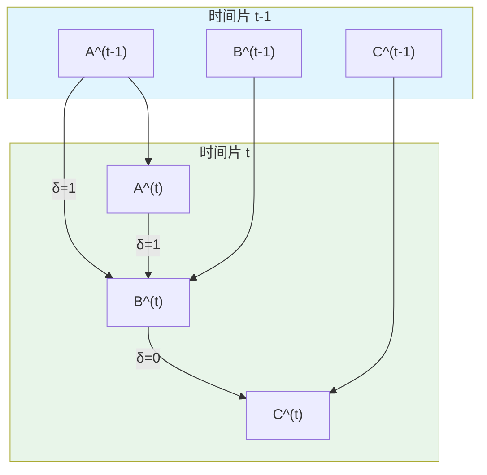
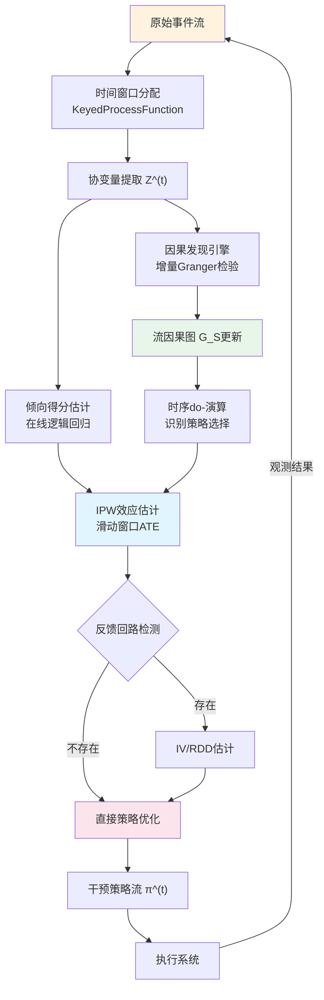

# 因果推断流处理的形式化基础

> 所属阶段: Struct/06-frontier | 前置依赖: [Struct/01-foundation/stream-processing-formal-model.md](../01-foundation/stream-processing-formal-model.md), [Struct/04-proofs/causal-consistency-theorems.md](../04-proofs/causal-consistency-theorems.md) | 形式化等级: L3-L4

## 1. 概念定义 (Definitions)

### 1.1 流因果图

**Def-S-06-01**（流因果图）. 流因果图（Streaming Causal Graph, SCG）是带时标的有向图元组 $\mathcal{G}_S = (\mathcal{V}, \mathcal{E}, \mathcal{T}, \Delta)$，其中：

- $\mathcal{V} = \{V_1, \ldots, V_n\}$ 为变量集合，$V_i^{(t)}$ 为时刻 $t$ 的观测值；
- $\mathcal{E} \subseteq \mathcal{V} \times \mathcal{V} \times \mathbb{Z}_{\geq 0}$ 为带时延因果边，$(V_i \xrightarrow{\delta} V_j)$ 表示 $V_i$ 经时延 $\delta$ 影响 $V_j$；
- $\mathcal{T} = \{0, 1, 2, \ldots\}$ 为离散时间域；
- $\Delta = \{0, 1, \ldots, \delta_{\max}\}$ 为时延上界。

当 $\delta = 0$ 时为**瞬时因果边**；当 $\delta > 0$ 时为**时延因果边**（对应 Granger 因果）。流因果图允许跨时间片的时序环，但同一切片内的截面图必须为 DAG。时间展开图 $\mathcal{G}_S^{[t-W,t]}$ 将动态结构展开为有限 DAG，节点为 $\{V_i^{(s)}: s \in [t-W,t]\}$。

### 1.2 流干预分布

**Def-S-06-02**（流干预分布）. 设干预策略为函数序列 $\pi = (\pi^{(t)})_{t \in \mathcal{T}}$，$\pi^{(t)}: \mathcal{H}^{(t)} \to \Delta(\mathcal{X})$ 将历史 $\mathcal{H}^{(t)} = \{V_i^{(s)}: s < t\}$ 映射为干预分布。**流干预分布**定义为：

$$
P^{\pi}\big(\mathbf{Y}^{(t)} = \mathbf{y} \big\vert \mathcal{H}^{(t)}\big)
$$

静态点干预记为 $P(\mathbf{Y}^{(t)} = \mathbf{y} \mid do(\mathbf{X}^{(s)}=\mathbf{x}), s \leq t)$。流干预效应通过系统内部状态传递，与流处理中的状态算子天然对应。

### 1.3 时序 do-演算

**Def-S-06-03**（时序 do-演算）. 设 $\mathcal{G}_S^{\underline{t}}$ 为截至时刻 $t$ 的时间展开 DAG，规则如下：

**规则 T1（时序观测插入/删除）**：若 $\mathbf{Y}^{(t)}$ 与 $\mathbf{Z}^{(s)}$ 在 $\mathcal{G}_S^{\underline{t}}$ 中被 $\{\mathbf{X}^{(r)}\}_{r\leq t}$ d-分离且 $s \leq t$，则
$$P(\mathbf{Y}^{(t)} \mid do(\mathbf{X}), \mathbf{Z}^{(s)}) = P(\mathbf{Y}^{(t)} \mid do(\mathbf{X}))$$

**规则 T2（时序动作-观测交换）**：若 $\mathbf{Y}^{(t)}$ 与 $\mathbf{Z}^{(s)}$ 在截断图 $\mathcal{G}_S^{\underline{t}}[\overline{\mathbf{X}}]$ 中被 d-分离且 $s < t$，则
$$P(\mathbf{Y}^{(t)} \mid do(\mathbf{X}), do(\mathbf{Z}^{(s)})) = P(\mathbf{Y}^{(t)} \mid do(\mathbf{X}), \mathbf{Z}^{(s)})$$

**规则 T3（时序动作插入/删除）**：若 $\mathbf{Y}^{(t)}$ 与 $\mathbf{Z}^{(s)}$ 在 $\mathcal{G}_S^{\underline{t}}[\overline{\mathbf{X}}, \underline{\mathbf{Z}^{(s)}}]$ 中被 d-分离，则
$$P(\mathbf{Y}^{(t)} \mid do(\mathbf{X}), do(\mathbf{Z}^{(s)})) = P(\mathbf{Y}^{(t)} \mid do(\mathbf{X}))$$

时序规则额外要求时间顺序约束（$s < t$ 或 $s \leq t$），确保"因必先于果"的时序因果律。

## 2. 属性推导 (Properties)

### 2.1 流马尔可夫分解

**Lemma-S-06-01**（流马尔可夫分解）. 若时间展开图满足全局马尔可夫性质，则联合分布分解为：

$$
P\big(\mathbf{V}^{(0)}, \ldots, \mathbf{V}^{(t)}\big) = \prod_{s=0}^{t} \prod_{i=1}^{n} P\big(V_i^{(s)} \big\vert \mathbf{Pa}^{(s)}(V_i)\big)
$$

其中 $\mathbf{Pa}^{(s)}(V_i) = \{V_j^{(s-\delta)} : (V_j \xrightarrow{\delta} V_i) \in \mathcal{E}, s-\delta \geq 0\}$。该分解将高维时序联合分布拆解为局部条件概率乘积，每个因子仅依赖有界历史（受 $\delta_{\max}$ 约束），支持流引擎在滑动窗口内增量维护因果结构。

### 2.2 流干预递归表示

**Prop-S-06-01**（流干预递归分解）. 在静态干预 $do(\mathbf{X}^{(s)} = \mathbf{x}, \forall s \in [0,t])$ 下：

$$
P\big(\mathbf{V}^{(t)} \big\vert do(\mathbf{X}=\mathbf{x})\big) = \sum_{\mathbf{V}^{(t-1)}} P\big(\mathbf{V}^{(t)} \big\vert \mathbf{V}^{(t-1)}, \mathbf{X}^{(t)}=\mathbf{x}\big) \cdot P\big(\mathbf{V}^{(t-1)} \big\vert do(\mathbf{X}=\mathbf{x})\big)
$$

转移核 $P(\mathbf{V}^{(t)} \mid \mathbf{V}^{(t-1)}, \mathbf{X}^{(t)}=\mathbf{x})$ 由因果结构固定。该递归式对应流处理中的状态更新算子，是实时因果效应追踪的数学基础。

### 2.3 Granger 因果与流因果边等价性

**Prop-S-06-02**（Granger-因果边等价性）. 设 $V_i, V_j$ 为平稳时间序列，若存在 $\delta > 0$ 使得

$$
P\big(V_j^{(t)} \big\vert \mathcal{H}_{-i}^{(t)}\big) \neq P\big(V_j^{(t)} \big\vert \mathcal{H}^{(t)}\big)
$$

则 $\mathcal{G}_S$ 中必存在时延边 $V_i \xrightarrow{\delta'} V_j$（某 $\delta' \leq \delta$）。反之，若 $V_i \xrightarrow{\delta} V_j$ 且所有混杂路径被阻断，Granger 检验以概率 1 拒绝原假设（$t \to \infty$）。

Granger 因果是**预测性**的，流因果边是**结构性**的；二者在未观测混杂存在时可能不一致。

## 3. 关系建立 (Relations)

### 3.1 与潜在结果框架的映射

流环境中每个"单位"对应一条事件流。设键空间为 $\mathcal{K}$，流平均处理效应为：

$$
\tau^{(t)}(k) = \mathbb{E}\big[Y^{(t)}(1) - Y^{(t)}(0) \big\vert K=k\big]
$$

Flink 的 KeyedStream 支持按 $k$ 分区维护状态并增量计算 $\tau^{(t)}(k)$。**流 SUTVA** 要求：(1) 一致性——$Y^{(t)} = Y^{(t)}(\mathbf{x}^{(0:t)})$；(2) 无干扰——$Y_k^{(t)}$ 不受 $k' \neq k$ 的干预路径影响。实时推荐系统中无干扰假设常被社交影响违反，需引入网络干扰模型。

### 3.2 与 Pearl SCM 的层级对应

| 层级 | 静态 SCM | 流扩展 | 流处理算子 |
|------|----------|--------|------------|
| 关联 | $P(\mathbf{y} \mid \mathbf{x})$ | $P(\mathbf{Y}^{(t)} \mid \mathbf{X}^{(t)}, \mathcal{H}^{(t)})$ | WindowedJoin |
| 干预 | $P(\mathbf{y} \mid do(\mathbf{x}))$ | $P^{\pi}(\mathbf{Y}^{(t)} \mid \mathcal{H}^{(t)})$ | KeyedProcessFunction |
| 反事实 | $P(\mathbf{y}_{\mathbf{x}} \mid \mathbf{x}', \mathbf{y}')$ | $\mathbf{Y}^{(t)}(\mathbf{x}^{(0:t)}) \mid \mathbf{Y}^{(0:t-1)}=\mathbf{y}^{(0:t-1)}$ | Iterative Processing |

流反事实需维护"历史状态-干预"对空间，计算复杂度指数增长。工程近似包括粒子滤波、代理模型（神经算子）、断点近似。

### 3.3 流处理系统的因果语义编码

**干预算子** $\mathcal{I}_{\mathbf{X}=\mathbf{x}}: \mathcal{S} \to \mathcal{S}'$ 将 $\mathbf{X}$ 数据源替换为策略流 $\pi$，对应 Flink ProcessFunction 中拦截并注入干预值、阻断上游原始信号（截断入边）。

**混杂调整算子**在流环境中为增量形式：

$$
P\big(\mathbf{Y}^{(t)} \big\vert do(\mathbf{X}^{(t)}=\mathbf{x})\big) = \sum_{\mathbf{z}^{(t)}} P\big(\mathbf{Y}^{(t)} \big\vert \mathbf{X}^{(t)}=\mathbf{x}, \mathbf{Z}^{(t)}=\mathbf{z}^{(t)}\big) \cdot P\big(\mathbf{Z}^{(t)}=\mathbf{z}^{(t)}\big)
$$

通过 CoGroup / IntervalJoin 按时间窗口关联 $\mathbf{X}$、$\mathbf{Y}$、$\mathbf{Z}$，计算条件分布的加权平均。

## 4. 论证过程 (Argumentation)

### 4.1 混杂因子动态变化

静态因果推断中混杂因子集合 $\mathbf{Z}$ 固定。流场景中混杂结构演化：电商推荐的季节模式切换、金融风控的概念漂移、A/B 测试的选择性流失。设混杂因子为时变过程 $\mathbf{Z}^{(t)}$，受隐藏状态 $\mathbf{U}^{(t)}$ 驱动。若 $\mathbf{U}^{(t)}$ 不可观测，即使单时间片满足 $Y^{(t)} \perp\!\!\!\perp X^{(t)} \mid \mathbf{Z}^{(t)}$，跨时间片仍存在未观测混杂——当 $U^{(s)}$（$s < t$）同时影响 $X^{(t)}$ 和 $Y^{(t)}$ 时，条件独立性被破坏。

### 4.2 反馈回路的识别困境

实时推荐中，推荐结果 $X^{(t)}$ 影响用户行为 $Y^{(t)}$，用户行为更新画像并影响后续推荐 $X^{(t+1)}$，形成闭环。识别策略：(1) **工具变量流**——外生冲击 $I^{(t)}$（如随机化分桶）满足 $I^{(t)} \to X^{(t)}$，$I^{(t)} \perp\!\!\!\perp Y^{(t)}(x)$；(2) **探索-利用分离**——以固定概率 $\epsilon$ 执行随机探索（$\epsilon$-greedy）；(3) **结构假设**——若反馈时间常数远大于估计窗口，局部近似为开环系统。

### 4.3 反例：时延误设导致因果偏倚

设真实结构为 $A \xrightarrow{2} B$，误设为 $A \xrightarrow{1} B$。真实模型 $B^{(t)} = \alpha A^{(t-2)} + \epsilon^{(t)}$，误设估计量收敛于 $\hat{\alpha} \xrightarrow{p} \alpha \cdot \rho_{A}(1)$。若 $A$ 为白噪声（$\rho_A(1)=0$），则 $\hat{\alpha} \xrightarrow{p} 0$，真实因果效应被完全掩盖，强调了准确估计时延参数 $\delta$ 的关键性。

## 5. 形式证明 / 工程论证 (Proof / Engineering Argument)

### 5.1 流因果效应的可识别性定理

**Thm-S-06-01**（动态混杂调整下的一致性）. 设 $\mathcal{G}_S$ 为流因果图，$X$ 为二元干预，$Y$ 为结果。假设：

1. **时序正向性**：$\forall t, \mathbf{z}^{(t)}$，$0 < P(X^{(t)}=1 \mid \mathbf{Z}^{(t)}=\mathbf{z}^{(t)}, \mathcal{H}^{(t-1)}) < 1$；
2. **时序可忽略性**：$Y^{(t)}(x) \perp\!\!\!\perp X^{(t)} \mid \mathbf{Z}^{(t)}, \mathcal{H}^{(t-1)}$；
3. **有界时延**：所有 $X \leadsto Y$ 路径时延上界为 $\delta_{\max} < \infty$。

则流 ATE $\tau^{(t)} = \mathbb{E}[Y^{(t)}(1) - Y^{(t)}(0)]$ 可识别，且增量 IPW 估计量

$$
\hat{\tau}^{(t)} = \frac{1}{W} \sum_{s=t-W+1}^{t} \left[ \frac{X^{(s)} Y^{(s)}}{\hat{e}^{(s)}} - \frac{(1-X^{(s)}) Y^{(s)}}{1-\hat{e}^{(s)}} \right]
$$

在 $W \to \infty$ 时依概率收敛于 $\tau^{(t)}$，其中 $\hat{e}^{(s)}$ 为倾向得分估计。

*证明*. **步骤 1**：由时序可忽略性，单时间片潜在结果分布可识别：

$$
P(Y^{(s)}(x)=y \mid \mathcal{H}^{(s-1)}) = \sum_{\mathbf{z}} P(Y^{(s)}=y \mid X^{(s)}=x, \mathbf{Z}^{(s)}=\mathbf{z}, \mathcal{H}^{(s-1)}) P(\mathbf{Z}^{(s)}=\mathbf{z} \mid \mathcal{H}^{(s-1)})
$$

**步骤 2**：对倾向得分 $e^{(s)}$，由迭代期望：

$$
\mathbb{E}\left[ \frac{X^{(s)} Y^{(s)}}{e^{(s)}} \right] = \mathbb{E}[Y^{(s)}(1)], \quad \mathbb{E}\left[ \frac{(1-X^{(s)}) Y^{(s)}}{1-e^{(s)}} \right] = \mathbb{E}[Y^{(s)}(0)]
$$

**步骤 3**：令 $\eta^{(s)} = X^{(s)} Y^{(s)}/e^{(s)} - (1-X^{(s)}) Y^{(s)}/(1-e^{(s)})$。由有界时延，$\eta^{(s)}$ 为 $\delta_{\max}$-相依序列。在时序正向性和二阶矩条件下，应用 $\alpha$-混合序列大数定律：

$$
\frac{1}{W} \sum_{s=t-W+1}^{t} \eta^{(s)} \xrightarrow{p} \mathbb{E}[\eta^{(s)}] = \tau^{(t)}
$$

∎

该定理为流处理中实时 A/B 测试提供理论保证：维护滑动窗口 $W$，用倾向得分重新加权，即可一致估计动态环境下的因果效应。

### 5.2 断点回归的流式扩展

断点回归利用阈值处干预分配的跳跃识别局部平均处理效应。流环境中运行变量 $R^{(t)}$ 跨越阈值 $c$ 时触发干预 $X^{(t)} = \mathbb{1}_{\{R^{(t)} \geq c\}}$。在邻域 $[c-h, c+h]$ 内，假设 $\mu_x(r) = \mathbb{E}[Y^{(t)}(x) \mid R^{(t)}=r]$ 连续，则：

$$
\tau_{RDD}^{(t)} = \lim_{r \downarrow c} \mathbb{E}[Y^{(t)} \mid R^{(t)}=r] - \lim_{r \uparrow c} \mathbb{E}[Y^{(t)} \mid R^{(t)}=r]
$$

流式实现通过局部线性回归的增量更新维护两个键控状态（$R<c$ 和 $R \geq c$），每个状态存储局部多项式系数，通过指数加权 SGD 更新，与 Flink KeyedProcessFunction 的状态语义一致。

## 6. 实例验证 (Examples)

### 6.1 实时推荐系统的因果效应估计

电商推荐系统估计"将商品 A 置顶"（$X=1$）对"购买转化率"（$Y$）的因果效应。混杂因子包括用户历史记录 $\mathbf{Z}_1$、实时上下文 $\mathbf{Z}_2$、长期偏好 $\mathbf{Z}_3$（不可直接观测）。流处理实现采用 Flink KeyedProcessFunction：(1) 按用户键分区提取协变量 $\mathbf{Z}^{(t)}$；(2) 在线逻辑回归更新倾向得分 $\hat{e}^{(t)}$；(3) 累积 IPW 加权结果；(4) 周期性输出 ATE 估计。倾向得分模型采用 FTRL-Proximal 适应分布漂移，窗口 $W$ 设为 30 分钟平衡方差与时效性。

### 6.2 IoT 异常根因分析

智能制造产线传感器产生高频数据流。质量异常报警时，需实时定位根因传感器。首先通过滑动窗口增量 Granger 因果检验构建流因果图；异常发生时，执行时序 do-演算反事实查询，计算各候选根因 $X_i$ 的**因果归因分数**：

$$
CAF(X_i) = P(Y^{(t)}=1) - P(Y^{(t)}=1 \mid do(X_i^{(t)} = x_i^{\text{normal}}))
$$

通过流状态维护条件分布 $P(Y \mid X_i, \mathbf{Z})$ 与 $P(X_i)$，该分数可增量计算。

### 6.3 金融风控因果归因

实时交易风控需判断"交易被拒"（$Y=1$）是否由"触发规则 $X$"因果导致。利用系统随机审计机制（5% 概率强制人工审核）作为工具变量 $I$：$I$ 影响处置 $X$，仅通过 $X$ 影响违约 $Y$，且由随机数生成器决定满足外生性。流式 2SLS 第一阶段用在线回归估计 $\hat{X} = \alpha_0 + \alpha_1 I$，第二阶段用 $\hat{X}$ 估计违约方程，两阶段均以 Flink 状态化算子实现，支持每秒万级交易。

## 7. 可视化 (Visualizations)

### 图 1：流因果图的时间展开结构

以下 Mermaid 图展示三变量 $(A, B, C)$ 在两个时间片内的展开。$A \xrightarrow{1} B$ 为时延因果，$B \xrightarrow{0} C$ 为瞬时因果。

自环边表示变量时间延续；跨时间片边体现 Granger 因果，同时间片边体现瞬时因果。截断 $A^{(t)}$ 入边并观测 $B^{(t+1)}$ 分布变化，即执行 $do(A^{(t)}=a)$ 干预。

### 图 2：流处理管道中的因果推断架构

以下 Mermaid 图展示完整的流因果推断系统架构，涵盖因果发现、效应估计和策略优化。

核心循环：事件流经窗口化和特征提取后，分流至因果发现引擎（维护图结构）和效应估计引擎（计算 ATE）。检测到反馈回路时切换至 IV/RDD 方法；策略优化模块基于因果估计更新干预策略并输出至执行系统。

## 8. 引用参考 (References)
