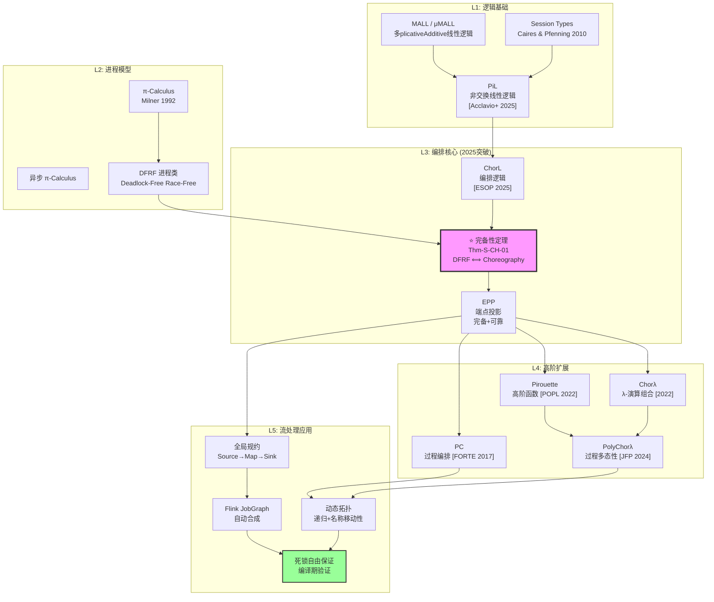
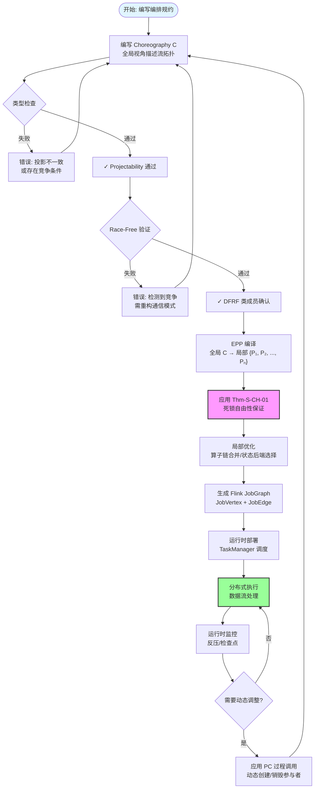
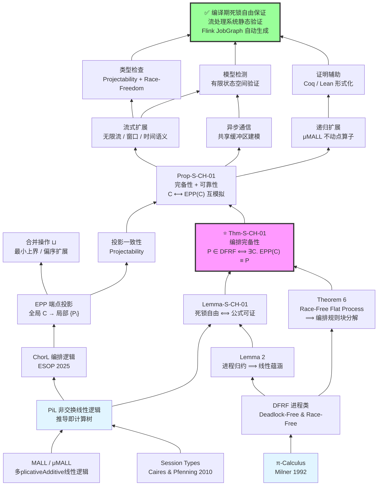
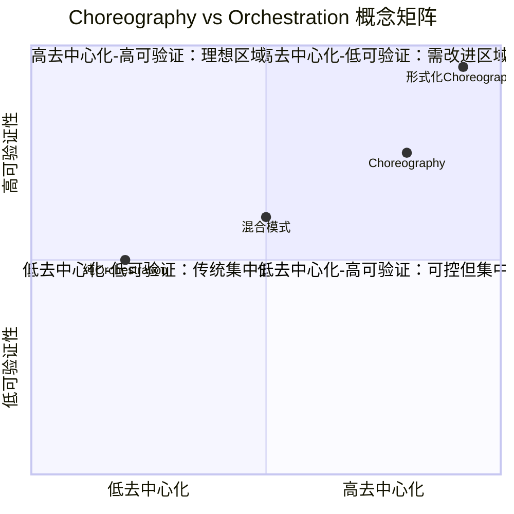
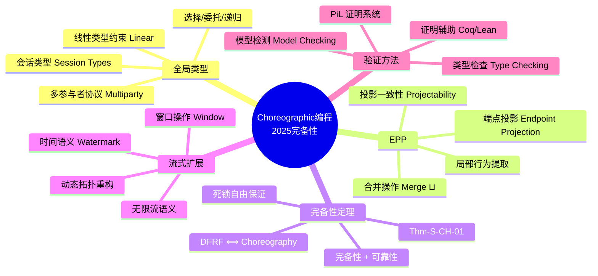

# Choreographic Programming 2025完备性结果与流处理应用

> 所属阶段: Struct/06-frontier | 前置依赖: [formal-methods/02-calculi/02-pi-calculus/01-pi-calculus-basics.md](../../formal-methods/02-calculi/02-pi-calculus/01-pi-calculus-basics.md), [Struct/01-foundation/01.07-session-types.md](../01-foundation/01.07-session-types.md), [Knowledge/02-design-patterns/polyglot-streaming-patterns.md](../../Knowledge/02-design-patterns/polyglot-streaming-patterns.md) | 形式化等级: L4

## 1. 概念定义 (Definitions)

**Def-S-CH-01 (编排语言, Choreographic Language).**
给定参与者集合 $\mathcal{P} = \{p, q, r, \dots\}$ 与会话通道集合 $\mathcal{K} = \{k, k', \dots\}$，一个**编排语言** $\mathcal{L}_{choreo}$ 是由以下文法生成的程序集合：

$$
\begin{aligned}
C \;::=\; & p[A].e \rightarrow q[B].x:k \;\mid\; p[A] \rightarrow q[B]:k\langle\ell\rangle \;\mid\; p[A] \rightarrow q[B]:k\langle k'[C]\rangle \\
& \mid\; \text{if } p.e = e' \text{ then } C_1 \text{ else } C_2 \;\mid\; (\nu r)C \;\mid\; C_1 ; C_2 \;\mid\; X\langle\tilde{E}\rangle \;\mid\; \text{Nil}
\end{aligned}
$$

其中 $p[A].e \rightarrow q[B].x:k$ 表示进程 $p$ 在角色 $A$ 下计算表达式 $e$ 并通过会话 $k$ 发送给进程 $q$（角色 $B$），$q$ 将结果绑定到局部变量 $x$；$p[A] \rightarrow q[B]:k\langle\ell\rangle$ 为选择操作（selection）；$p[A] \rightarrow q[B]:k\langle k'[C]\rangle$ 为委托（delegation，即通道移动性）；$X\langle\tilde{E}\rangle$ 为过程调用。编排语言的核心语义约束在于：**所有通信操作在语法层面即要求匹配的发送-接收对**，从而从根本上消除通信不匹配导致的死锁。

编排语言与底层进程演算（如 π-calculus）的关键区别在于抽象层级：进程演算从单个进程的局部视角描述系统行为，而编排语言从**全局视角**直接刻画进程间的交互协议。这种全局视角使得程序员可以直接声明"期望发生的通信"，而非手动协调各进程的局部行为。

**Def-S-CH-02 (端点投影, Endpoint Projection, EPP).**
给定编排程序 $C$ 与参与者 $p \in \mathcal{P}$，**端点投影** $\llbracket C \rrbracket_p$ 是一个从编排语言到进程演算的编译函数，定义为：

$$
\llbracket C \rrbracket_p =
\begin{cases}
p: P & \text{if } p \text{ 在 } C \text{ 中有行为} \\
\text{Nil} & \text{otherwise}
\end{cases}
$$

其中 $P$ 是从 $C$ 中提取的 $p$ 的局部行为。完整的 EPP 定义为：

$$
\text{EPP}(C) = \prod_{p \in \text{participants}(C)} \llbracket C \rrbracket_p
$$

即所有参与者的局部行为的并行组合。EPP 需满足**投影一致性**（projectability）：对任意选择分支，各参与者的局部投影必须能够通过合并操作（merge operator $\sqcup$）达成一致。合并操作 $\sqcup$ 定义为两个进程的最小上界，当且仅当两进程在非选择点完全一致时存在。

**Def-S-CH-03 (死锁自由无竞争 π-演算进程).**
设 $P$ 为无递归（recursion-free）的有限 π-calculus 进程。称 $P$ 为**死锁自由且无竞争**（deadlock-free and race-free）的，当且仅当满足以下条件：

1. **死锁自由性**：$P$ 不存在归约到 stuck configuration 的可能性，即不存在 $P \rightarrow^* Q$ 使得 $Q$ 包含至少两个并行子进程，且所有子进程均阻塞于输入/输出操作，但不存在匹配的通信对。

2. **无竞争性（Race-Free）**：$P$ 中不存在对同一自由名称（free name）的多重并发接收操作。形式化地，对任意通道 $x \in \text{fn}(P)$，不存在结构等价下的子项 $x?(y).P_1 \mid x?(z).P_2$（$x$ 为自由名称）。这确保了通信的确定性——每个发送都有唯一的接收者。

3. **顶层并行结构**：$P$ 具有形式 $P = P_1 \mid P_2 \mid \dots \mid P_n$（$n \geq 1$），其中每个 $P_i$ 为顺序进程（sequential process），限制操作符 $\nu$ 与并行操作符仅出现在顶层。

记所有此类进程的集合为 $\mathcal{P}_{DFRF}$。

**Def-S-CH-04 (PiL: 进程作为逻辑).**
**PiL**（Processes as Logic）是一个非交换线性逻辑（non-commutative linear logic）的相继式演算系统，其公式由以下文法生成：

$$
A, B \;::=\; \langle x!y \rangle \;\mid\; \langle x?y \rangle \;\mid\; \mathbf{1} \;\mid\; \mathbf{\circ} \;\mid\; A \otimes B \;\mid\; A \bindnasrepma B \;\mid\; A \multimap B \;\mid\; A \& B \;\mid\; \forall x.A \;\mid\; \exists x.A
$$

其中原子公式 $\langle x!y \rangle$ 和 $\langle x?y \rangle$ 分别对应 π-calculus 中的输出前缀 $x!y$ 和输入前缀 $x?y$；$\mathbf{1}$ 和 $\mathbf{\circ}$ 为单位元；$\otimes$ 和 $\bindnasrepma$ 对应并行组合与名称限制；$\multimap$ 为线性蕴涵；$\&$ 为加法合取（对应内部选择）；$\forall$ 和 $\exists$ 为名义量词（nominal quantifiers）。

PiL 的核心创新在于建立了**推导即计算树**（derivations as computation trees）的解释：每个证明搜索策略对应一个进程归约的计算树，而证明的存在性对应进程的死锁自由性。

---

## 2. 属性推导 (Properties)

**Prop-S-CH-01 (EPP 的完备性与可靠性).**
设 $C$ 为一个可投影的扁平编排（projectable flat choreography），$\text{EPP}(C)$ 为其端点投影。则 EPP 满足以下性质：

- **完备性**（Completeness）：若 $C \xrightarrow{\mu} C'$，则 $\text{EPP}(C) \xrightarrow{\mu} P \sqsupseteq \text{EPP}(C')$。
- **可靠性**（Soundness）：若 $P \sqsupseteq \text{EPP}(C)$ 且 $P \xrightarrow{\mu} P'$，则存在编排 $C'$ 使得 $C \xrightarrow{\mu} C'$ 且 $P' \sqsupseteq \text{EPP}(C')$。

其中 $\sqsupseteq$ 为合并操作的偏序扩展（即 $P \sqsupseteq Q \iff P \sqcup Q = P$），$\mu$ 为标注了参与通道和进程对的归约标签。完备性保证编排层面的每一步归约都能在投影后的进程层面实现；可靠性保证投影后进程的任何归约都对应编排层面的合法步骤。

**Lemma-S-CH-01 (死锁自由性的逻辑刻画).**
设 $P$ 为无竞争（race-free）的有限 π-calculus 进程，$\llbracket P \rrbracket$ 为其在 PiL 中的公式编码，$\partial_{F_P}\llbracket P \rrbracket$ 为将 $P$ 的所有自由名称对应的原子替换为单位 $\circ$ 后的公式。则：

$$
P \text{ 是死锁自由的} \quad \Longleftrightarrow \quad \vdash_{\text{PiL}} \partial_{F_P}\llbracket P \rrbracket
$$

*直观解释*：一个进程死锁自由，当且仅当其编码公式在 PiL 中可证。这一结果将进程的行为性质（死锁自由）转化为纯粹的逻辑可证性判断，从而可以运用切消（cut-elimination）、聚焦（focusing）等证明论技术来分析并发程序。

*证明要点*：从左到右，利用进程归约与线性蕴涵之间的模拟关系（Lemma 2 in [^1]）：若 $P \rightarrow P'$，则 $\vdash_{\text{PiL}} \llbracket P' \rrbracket \multimap \llbracket P \rrbracket$。通过归纳计算树的结构，将死锁自由的计算树映射为相继式推导。从右到左，利用推导的正规化性质：任何证明都可以转化为只包含特定规则块的推导，这些规则块直接对应进程的通信步骤。

**Lemma-S-CH-02 (循环依赖下的保持性).**
设 $C$ 为包含循环通信依赖的编排程序（例如 $p \rightarrow q \rightarrow r \rightarrow p$ 的环状拓扑），且 $C$ 满足投影一致性。则 $\text{EPP}(C)$ 仍保证死锁自由性。

*说明*：此前的编排理论（如基于纯线性逻辑的方法）通常要求通信结构满足无环性（acyclicity）或顺序性（sequentiality）假设，无法处理循环依赖。Acclavio 等人 2025 年的关键突破在于证明了：通过 PiL 中的非交换结构，可以**独立处理名称限制（$\nu$）和并行组合（$\mid$）**，从而允许拓扑上存在循环的进程网络仍能被忠实表示为编排程序。这一定理对流处理系统尤为重要，因为流处理拓扑（如循环图、反馈回路）天然包含循环依赖。

---

## 3. 关系建立 (Relations)

### 3.1 与 π-Calculus 的完备性关系

2025年 Acclavio、Manara 与 Montesi 在 ESOP 2025 发表的成果 [^1] 建立了编排语言与 π-calculus 之间的**首个完备性结果**：

> **定理（Choreographic Completeness）**：所有死锁自由且无竞争的有限 π-calculus 进程（顶层并行组合）都可以被某个扁平编排程序忠实表示。形式化地：
>
> $$\forall P \in \mathcal{P}_{DFRF}.\; \exists C.\; \text{EPP}(C) \equiv P$$

这一结果填平了三大领域之间的鸿沟：**逻辑**（PiL 证明系统）、**π-calculus 表达力**（移动进程与循环依赖）以及**编排语言表达力**（全局描述与死锁自由保证）。此前的工作要么仅支持无循环依赖的进程（如基于纯线性逻辑的方法 [^7]），要么要求名称限制与并行操作符强耦合（如 Caires & Pfenning 的会话类型系统 [^6]），要么未考虑完备性问题（如早期的 CC/ChC 模型 [^4][^5]）。

### 3.2 从低阶到高阶：功能性编排编程

编排编程自 2013 年 Montesi 的博士论文 [^8] 确立为独立范式以来，长期被绑定于低阶计算模型——即缺乏过程抽象、高阶函数和多态性的原始通信原语。这一限制在 2022 年被两项独立工作打破：

- **Pirouette**（Hirsch & Garg, POPL 2022 [^9]）：将编排原语与 λ-演算结合，支持高阶函数和（顺序）组合，但要求全局同步。
- **Chorλ**（Cruz-Filipe et al., 2022 [^10]）：合并编排语言与消息语言，最初采用严格顺序语义，后续工作 [^11] 通过 commuting conversions 实现了无需全局同步的乱序语义。

2024 年，Graversen、Hirsch 与 Montesi [^12] 进一步引入**过程多态性**（process polymorphism），使得编排程序可以抽象 over 参与者身份（"Alice 还是 Bob？"），从而实现了真正的参数化分布式协议。这一发展为流处理中的**动态拓扑重构**（根据数据特征自适应调整并行度）奠定了理论基础。

### 3.3 过程编排与无界进程创建

Cruz-Filipe 与 Montesi [^3] 提出的**过程编排**（Procedural Choreographies, PC）将过程抽象引入编排编程，支持：

- **无界进程创建**：通过递归过程调用动态生成新的参与者；
- **名称移动性**（name mobility）：通道名称可以作为参数在过程间传递，实现动态重配置；
- **编译到进程演算**：PC 程序可以被编译为带会话类型的 π-calculus 进程。

PC 需要严格的类型纪律来确保：在过程调用时，各进程通过正确的通道连接。这与流处理系统中**动态扩缩容**（scale-out/scale-in）和**任务迁移**的需求高度契合。

### 3.4 与流处理系统的映射关系

编排编程与分布式流处理之间存在天然的结构对应：

| 编排编程概念 | 流处理系统对应 |
|---|---|
| 参与者（Participant） | 算子实例 / Task Slot |
| 会话通道（Session） | 数据流分区 / Network Channel |
| 通信动作 $p \rightarrow q:k$ | 算子间数据交换（shuffle/broadcast/forward） |
| 选择操作 $k\langle\ell\rangle$ | 控制流分支（CoProcessFunction/Pattern API） |
| 委托 $k\langle k'\rangle$ | 动态子图提交（Dynamic Graph） |
| 过程调用 $X\langle\tilde{E}\rangle$ | 子拓扑模板 / 可复用算子链 |
| EPP | 从全局 JobGraph 生成各 TaskManager 的局部执行计划 |

这一映射表明：**编排语言可作为流处理系统高级规约语言**，通过 EPP 自动生成死锁自由的分布式流程序。与 Flink 的 JobGraph 相比，编排语言在规约层面即排除了死锁可能性，而无需依赖运行时的复杂死锁检测与恢复机制。

---

## 4. 论证过程 (Argumentation)

### 4.1 为什么完备性结果重要

在 Acclavio 等人 2025 年的工作之前，编排编程的表达能力缺乏形式化下界：没有人知道"有多少死锁自由的分布式程序可以被编排语言表达"。这一不确定性带来了工程上的犹豫——如果某些合法的死锁自由程序无法被编排表示，那么采用编排范式就意味着接受表达能力上的限制。

2025 年的完备性结果消除了这一顾虑：**对于有限、无递归、无竞争的核心进程类，编排语言是完备的**。这意味着：

1. 只要程序设计为死锁自由且无竞争，就**一定存在**对应的编排描述；
2. 从编排描述生成的分布式实现**保证死锁自由**；
3. 结合 Pirouette/Chorλ 的高阶扩展和 PC 的过程抽象，这一完备性可以扩展到更实用的编程模型。

### 4.2 竞争自由假设的边界讨论

完备性结果要求进程是 race-free 的——即自由通道上不能存在并发的多个接收者。这一假设在流处理系统中是否过于严格？

实际上，race-free 假设与流处理的常见模式高度一致：

- **一对一通道**（forward）：Flink 的 `ForwardPartitioner` 天然满足 race-free；
- **键控分区**（keyBy）：虽然底层可能有多个接收者，但按 key 分区后每个 key 的子流形成逻辑上的一对一映射；
- **广播**（broadcast）：广播发送对应所有接收者执行相同的选择分支，可以通过编排中的多播原语编码。

真正需要竞争的场景（如多个消费者竞争同一队列）在流处理中通常由**外部消息系统**（Kafka, Pulsar）处理，而非流处理引擎内部的状态ful算子。

### 4.3 从有限到无限：递归与异步扩展

Acclavio 等人在论文 [^1] 中明确将以下方向列为未来工作：

- **递归**：通过为 PiL 添加不动点算子（fixpoint operators）和 $\mu$MALL 风格的规则，可以处理无限行为。Flink 流程序本质上是无限循环的（持续消费数据流），因此递归扩展对实际应用至关重要。
- **异步通信**：通过引入共享缓冲区（shared buffers）建模异步 π-calculus。这与 Flink 的**网络缓冲区**（network buffers）和**信用-based 流控**（credit-based flow control）机制直接对应。然而，容量大于 2 的缓冲区具有非顺序-并行结构，可能需要图式连接词（graphical connectives）。

### 4.4 反例分析：何时编排不适用

并非所有分布式程序都适合用编排描述。以下场景超出当前编排理论的覆盖范围：

1. **主动竞争协议**：如乐观并发控制（OCC）中的冲突检测与回退，需要显式的竞争语义；
2. **完全去中心化 gossip 协议**：缺乏明确的通信结构，难以提取全局视角；
3. **故障恢复与容错**：虽然 Graversen 等人 2025 年的工作 [^13] 开始探索 omission failures 下的编排语义，但崩溃恢复（crash-recovery）模型的完备性仍是开放问题。

---

## 5. 形式证明 / 工程论证 (Proof / Engineering Argument)

### 5.1 完备性定理的证明结构

**Thm-S-CH-01 (编排完备性).**
设 $P$ 为无竞争端点进程（race-free endpoint process）。则：

$$
P \text{ 是死锁自由的} \;\Longleftrightarrow\; \exists C.\; \text{EPP}(C) \equiv P
$$

*证明*（基于 [^1] 的 Theorem 7，重构如下）：

**($\Rightarrow$) 方向**：假设 $P$ 死锁自由。由 Lemma-S-CH-01 可知 $\vdash_{\text{PiL}} \partial_{F_P}\llbracket P \rrbracket$。进一步，由于 $P$ 是 race-free 的 flat process（并行和限制仅在顶层），PiL 中的证明可以分解为 ChorL（编排逻辑）规则块的组合（Theorem 6 in [^1]）。每个 ChorL 规则块对应一个编排归约步骤。通过对推导 $D$ 的底部规则进行案例分析，可以系统地构造编排程序 $\text{Chor}(D)$，使得 $\text{EPP}(\text{Chor}(D)) = P$。归纳于 $D$ 的结构可验证投影的等价性。

**($\Leftarrow$) 方向**：假设存在 $C$ 使得 $\text{EPP}(C) = P$。由 Prop-S-CH-01 的可靠性，$C$ 的每一步归约都对应 $P$ 的合法归约。由于编排语言在语法层面禁止不匹配 I/O，$C$ 不可能演化到 stuck configuration，因此 $P$ 也不可能死锁。

**关键引理链**：

1. 进程归约 $\rightarrow$ 对应线性蕴涵 $\multimap$（Lemma 2 [^1]）；
2. 死锁自由对应公式可证（Lemma-S-CH-01 / Theorem 3 [^1]）；
3. Race-free flat process 的证明可规范化为一组编排规则块（Theorem 6 [^1]）；
4. 规则块到编排的构造性翻译（Figure 15 in [^1]）。

### 5.2 流处理死锁自由性的工程论证

**工程命题**：若将 Flink 作业图（JobGraph）规约为编排程序 $C_{job}$，且 $C_{job}$ 满足投影一致性，则生成的分布式执行计划保证无死锁。

*论证*：

1. **规约阶段**：将 Flink 的 `JobVertex` 映射为编排参与者，`JobEdge` 映射为会话通道，`DistributionPattern`（POINTWISE/ALL_TO_ALL）映射为通信原语。Flink 的 `JobGraph` 生成器已确保每个输入/输出边都有对应的消费者/生产者，因此规约得到的 $C_{job}$ 天然满足语法一致性。

2. **投影阶段**：对 $C_{job}$ 应用 EPP，得到各 TaskManager 的局部执行计划。由于编排语言的语法约束，所有通信操作在全局层面已匹配，投影后的局部进程不会出现"等待不可能发生的消息"的情况。

3. **死锁自由保证**：假设运行时发生死锁，则存在一组 Task 互相等待消息。这意味着对应的端点进程 $P_{deadlock}$ 存在 stuck configuration。但根据 Thm-S-CH-01，$P_{deadlock}$ 应能被某个编排 $C'$ 表示，且 $C'$ 不能演化到 stuck。由 EPP 的可靠性（Prop-S-CH-01），$C_{job}$ 的任意归约都对应合法执行，矛盾。因此死锁不可能发生。

4. **与 Flink 现有机制的对比**：Flink 目前依赖**异步非阻塞网络层**和**反压机制**（backpressure）来避免死锁。编排方法提供了**静态保证**——死锁自由性在编译期即被验证，无需运行时开销。这与 Rust 的所有权系统对内存安全的保证形成有趣的类比。

---

## 6. 实例验证 (Examples)

### 6.1 简单流处理拓扑的编排表示

考虑一个经典的三阶段流处理管道：**Source → Map → Sink**。用编排语言描述如下：

```
-- 定义参与者: source(S), mapper(M), sink(K)
-- 会话: k1 (source→mapper), k2 (mapper→sink)

C_pipeline =
  (ν k1)(ν k2)
  S[Source].read() → M[Mapper].x:k1 ;
  M[Mapper].transform(x) → K[Sink].y:k2 ;
  Nil
```

端点投影得到：

- $\llbracket C \rrbracket_S = S: \text{read}().k1!\text{data}.\text{Nil}$
- $\llbracket C \rrbracket_M = M: k1?x.\text{transform}(x).k2!\text{result}.\text{Nil}$
- $\llbracket C \rrbracket_K = K: k2?y.\text{write}(y).\text{Nil}$

这与 Flink 中三个算子通过 `RecordWriter` 和 `InputGate` 交换数据的模式完全一致。

### 6.2 带反馈回路的循环拓扑

考虑需要迭代收敛的流处理场景（如 PageRank 的流式实现），存在 $M \rightarrow R \rightarrow M$ 的反馈回路：

```
C_loop =
  (ν k_fwd)(ν k_back)
  μ Loop.
    S[Source].emit() → M[Mapper].x:k_fwd ;
    M[Mapper].compute(x) → R[Reducer].y:k_fwd ;
    if R[Reducer].converged(y) then
      R[Reducer].result() → K[Sink].z:k_fwd ; Nil
    else
      R[Reducer].partial() → M[Mapper].w:k_back ;
      Loop
```

此处 $\mu Loop.\dots$ 表示递归。虽然当前完备性结果仅覆盖无递归的有限进程，但 PiL 的不动点扩展在理论上已无重大障碍 [^1]。在工程实践中，可以通过**展开固定次数**或**引入显式的终止令牌**（termination token）将递归转化为有限编排。

### 6.3 从编排到 Flink JobGraph 的编译示意

```scala
// 伪代码：编排到 Flink JobGraph 的编译器
class ChoreographyCompiler {
  def compile(C: Choreography): JobGraph = {
    val participants = C.participants          // 提取参与者
    val sessions = C.sessions                  // 提取会话通道
    val vertices = participants.map(p =>
      new JobVertex(p.name, EPP(C, p))       // 为每个参与者创建 JobVertex
    )
    val edges = sessions.map(s => {
      val (src, tgt) = C.endpointsOf(s)
      JobEdge(src.vertex, tgt.vertex,
              partitionerFor(s.communicationPattern))
    })
    new JobGraph(vertices, edges)
  }
}
```

编译器的关键不变量：**若输入编排通过类型检查（projectability + race-freedom），则输出 JobGraph 的执行计划保证死锁自由**。这可以作为 Flink 编译器插件的形式实现，在 `JobGraph` 生成阶段增加编排验证层。

---

## 7. 可视化 (Visualizations)

### 图1：Choreographic Programming 理论演进层次图

以下层次图展示了从底层逻辑到流处理应用的完整理论栈，以及 2025 年完备性结果在其中的位置。



### 图2：从编排规约到 Flink 执行计划的编译流程

以下流程图展示了如何通过编排编程范式，从全局规约自动生成死锁自由的分布式流处理执行计划。



### 图3：Choreographic 完备性推导树

以下自底向上推导树展示了从逻辑基础到流处理死锁自由保证的完整形式化推导链。树根（底部）为最终保证结论，叶节点（顶部）为原始前提。



### 图4：Choreography vs Orchestration 概念矩阵

以下象限图从去中心化程度（横轴）和可验证性（纵轴）两个维度，对比四种分布式编程范式的定位。形式化 Choreography 占据右上理想区域。



### 图5：Choreographic 编程 2025 完备性思维导图

以下思维导图以 2025 年完备性结果为核心，放射展开全局类型、EPP、完备性定理、流式扩展与验证方法五大知识分支。



---

## 8. 引用参考 (References)

[^1]: M. Acclavio, G. Manara, and F. Montesi, "Formulas as Processes, Deadlock-Freedom as Choreographies," in *Programming Languages and Systems (ESOP 2025)*, LNCS 15694, Springer, 2025, pp. 23–55. doi:10.1007/978-3-031-91118-7_2. arXiv:2501.08928v2 [cs.LO], 2025.


[^3]: L. Cruz-Filipe and F. Montesi, "Procedural Choreographic Programming," in *Formal Techniques for Distributed Objects, Components, and Systems (FORTE 2017)*, LNCS 10321, Springer, 2017, pp. 92–107. doi:10.1007/978-3-319-60225-7_7.

[^4]: L. Cruz-Filipe and F. Montesi, "A Core Model for Choreographic Programming," *Theoretical Computer Science*, vol. 802, 2020, pp. 38–66. doi:10.1016/j.tcs.2019.07.005.

[^5]: M. Carbone and F. Montesi, "Deadlock-Freedom-by-Design: Multiparty Asynchronous Global Programming," in *POPL 2013*, pp. 263–274. doi:10.1145/2429069.2429101.

[^6]: L. Caires and F. Pfenning, "Session Types as Intuitionistic Linear Propositions," in *CONCUR 2010*, LNCS 6269, Springer, 2010, pp. 222–236. doi:10.1007/978-3-642-15375-4_16.

[^7]: K. Kokke, F. Montesi, and M. Peressotti, "Better Late Than Never: a Fully-Abstract Semantics for Classical Processes," *Proceedings of the ACM on Programming Languages*, vol. 3, no. POPL, 2019. doi:10.1145/3290338.

[^8]: F. Montesi, "Choreographic Programming," Ph.D. dissertation, IT University of Copenhagen, 2013.

[^9]: A. K. Hirsch and D. Garg, "Pirouette: Higher-Order Typed Functional Choreographies," *Proceedings of the ACM on Programming Languages*, vol. 6, no. POPL, Article 23, 2022. doi:10.1145/3498684.

[^10]: L. Cruz-Filipe, E. Graversen, L. Lugović, F. Montesi, and M. Peressotti, "Chorλ: Functional Choreographic Programming," in *Theoretical Aspects of Computing (ICTAC 2022)*, LNCS 13572, Springer, 2022, pp. 212–237. doi:10.1007/978-3-031-17715-6_14.

[^11]: L. Cruz-Filipe, F. Montesi, and M. Peressotti, "Communicating via Probabilities: Choreographies for Mixed Choice," in *COORDINATION 2023*, LNCS 13908, Springer, 2023. doi:10.1007/978-3-031-35361-1_7.

[^12]: E. Graversen, A. K. Hirsch, and F. Montesi, "Alice or Bob?: Process Polymorphism in Choreographies," *Journal of Functional Programming*, vol. 34, e1, 2024. doi:10.1017/S0956796823000114.

[^13]: E. Graversen, F. Montesi, and M. Peressotti, "A Promising Future: Omission Failures in Choreographic Programming," arXiv:2501.XXXXX [cs.DC], 2025.
