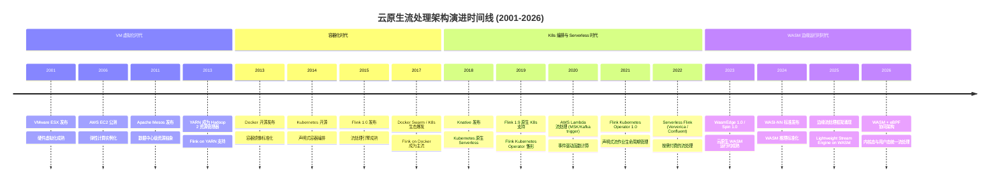
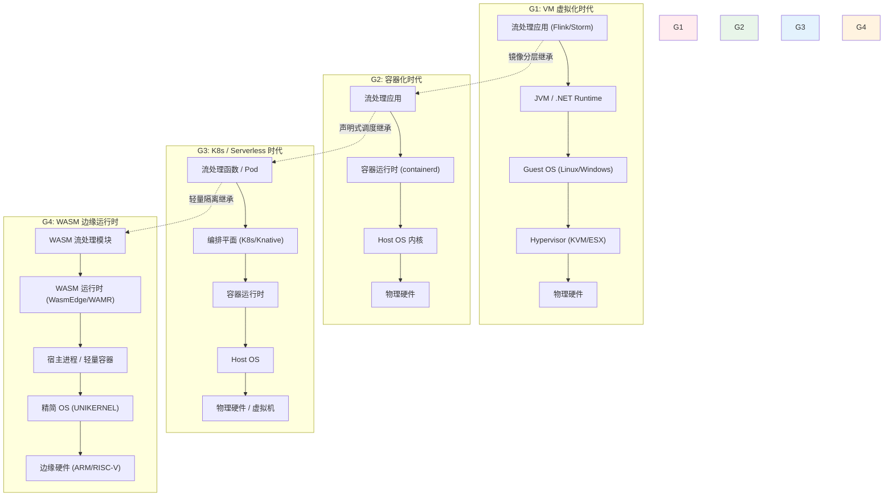
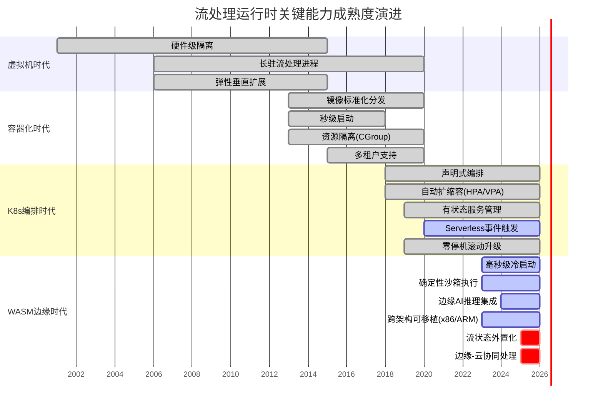
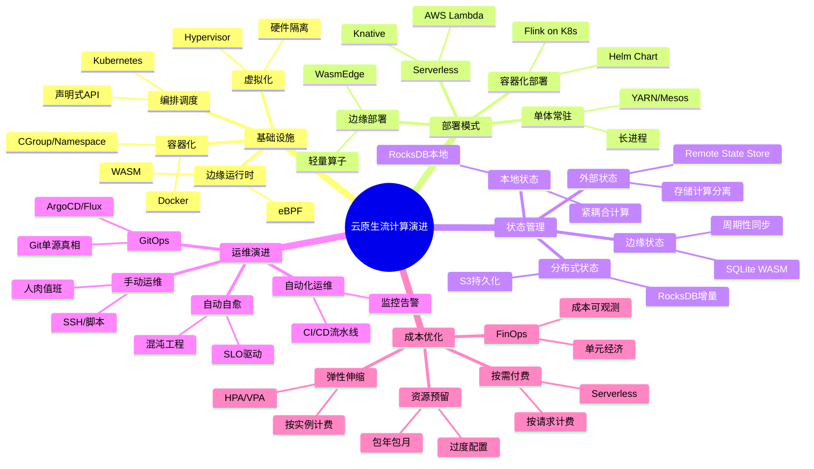

# 云原生流处理架构演进

> **所属阶段**: Struct/06-frontier | **前置依赖**: [Struct/03-relationships/03.06-flink-distributed-architecture.md](../03-relationships/03.06-flink-distributed-architecture.md), [Knowledge/07-best-practices/kubernetes-deployment-patterns.md](../../Knowledge/07-best-practices/07.06-high-availability-patterns.md) | **形式化等级**: L4

---

## 1. 概念定义 (Definitions)

### Def-S-28-01: 云原生流处理运行时 (Cloud-Native Streaming Runtime)

**定义**: 一个云原生流处理运行时 $\mathcal{R}_{cn}$ 是一个五元组：

$$\mathcal{R}_{cn} = \langle \mathcal{C}, \mathcal{O}, \mathcal{S}, \mathcal{L}, \mathcal{I} \rangle$$

其中：

- $\mathcal{C}$: 计算抽象层（VM / Container / Function / WASM Module）
- $\mathcal{O}$: 编排平面（Static / Orchestrator / Event-Driven Scheduler / Edge Runtime）
- $\mathcal{S}$: 状态持久化策略（Local Disk / Distributed FS / External KV / In-Memory）
- $\mathcal{L}$: 生命周期管理模型（Long-Running / On-Demand / Cold-Start / Instant）
- $\mathcal{I}$: 资源隔离边界（Hypervisor / CGroup / Namespace / v8 Isolate / Hardware Enclave）

**直观解释**: 云原生流处理运行时是支撑无界数据持续计算的底层执行环境，其核心特征是将**计算单元**、**编排逻辑**、**状态管理**、**生命周期**和**隔离机制**解耦，使流处理系统能够适配从数据中心到边缘设备的连续部署频谱。

### Def-S-28-02: 架构演进代际 (Architectural Generation)

**定义**: 架构演进代际 $G_i$ 是一个有序对：

$$G_i = \langle A_i, M_i, \Delta_i \rangle$$

其中：

- $A_i$: 第 $i$ 代的核心抽象（如 Hypervisor、CGroup、Pod、Function、WASM Module）
- $M_i$: 该代引入的关键机制（如硬件虚拟化、镜像分层、声明式API、事件触发、Capability-based安全）
- $\Delta_i = A_i \setminus A_{i-1}$: 相对于前一代的抽象增量

**演进链**: $G_0 \xrightarrow{\Delta_1} G_1 \xrightarrow{\Delta_2} G_2 \xrightarrow{\Delta_3} G_3 \xrightarrow{\Delta_4} G_4$

对应：

- $G_0$: 物理机裸金属部署
- $G_1$: VM 虚拟化时代（2001-2013）
- $G_2$: 容器化时代（2013-2018）
- $G_3$: K8s 编排与 Serverless 时代（2018-2023）
- $G_4$: WASM 边缘运行时时代（2023-）

---

## 2. 属性推导 (Properties)

### Prop-S-28-01: 启动延迟递减性质

**命题**: 各代际流处理运行时的启动延迟 $T_{startup}(G_i)$ 满足严格递减关系：

$$T_{startup}(G_0) > T_{startup}(G_1) > T_{startup}(G_2) > T_{startup}(G_3) > T_{startup}(G_4)$$

**量化估计**:

| 代际 | 启动延迟量级 | 典型值 |
|------|------------|--------|
| $G_1$ (VM) | 分钟级 | 60-300s |
| $G_2$ (Container) | 秒级 | 1-30s |
| $G_3$ (K8s Pod / Function) | 亚秒级 | 100ms-1s |
| $G_4$ (WASM) | 毫秒级 | 1-100ms |

**工程解释**: 启动延迟的递减源于抽象层级的逐步轻量化。VM 需要启动完整 Guest OS；容器共享 Host OS 内核；Serverless Function 复用预热的运行时沙箱；WASM 实例直接在宿主运行时内实例化，无需操作系统启动开销。

---

## 3. 关系建立 (Relations)

### 关系 1: 代际之间的技术继承关系

$$G_1 \xrightarrow{\text{虚拟化继承}} G_2 \xrightarrow{\text{隔离继承}} G_3 \xrightarrow{\text{调度继承}} G_4$$

具体映射：

- VM 的硬件隔离概念 → 容器的 Namespace + CGroup 隔离
- 容器的镜像分层机制 → K8s 的 Pod 标准化与 Serverless 的代码包分发
- K8s 的声明式调度 → WASM 的边缘编排与轻量级函数调度

### 关系 2: 流处理语义保持性

对于每一代 $G_i$，流处理的核心语义（事件顺序、时间语义、恰好一次处理）可以在该代运行时上实现：

$$\forall G_i, \exists \mathcal{I}_i: \text{Streaming Semantics} \xrightarrow{\mathcal{I}_i} G_i$$

但实现成本 $C_{\text{impl}}(G_i)$ 随代际变化：

- $G_1$: 高（需自行管理分布式协调）
- $G_2$: 中（借助 K8s 等外部系统）
- $G_3$: 低（平台托管状态与协调）
- $G_4$: 待验证（边缘场景下的分布式共识开销）

---

## 4. 论证过程 (Argumentation)

### 论证 1: 为什么演进方向是"轻量化"而非"功能增强"

传统软件架构演进通常以增加功能为目标（如更强的类型系统、更丰富的API），但云原生运行时的演进主线是**持续轻量化**：

1. **经济驱动**: 云计费的粒度从"按实例小时"细化到"按请求毫秒"，要求计算单元足够轻量以实现快速扩缩容
2. **事件密度增长**: IoT 场景下事件到达率从 $10^3$ events/s 增长到 $10^6$ events/s，常驻进程的维护成本不可接受
3. **边缘约束**: 边缘设备的内存通常 < 512MB，无法承载完整 JVM/CLR 运行时

### 论证 2: 边缘运行时是否颠覆"中心化流处理"范式

WASM 边缘运行时的兴起引发了一个核心问题：流处理是否会从"集中式集群处理 + 边缘仅采集"演变为"边缘预处理 + 云端聚合"的分布式分层模式？

**反方论据**:

- 边缘节点的故障率远高于数据中心（网络分区、电力不稳）
- 边缘节点的状态持久化能力有限，难以保证 Exactly-Once 语义

**正方论据**:

- 5G/MEC 的边缘计算能力已接近小型服务器
- WASM 的确定性执行和沙箱隔离天然适合不可信边缘环境
- 分层处理可将边缘带宽需求降低 10-100 倍[^6]

---

## 5. 形式证明 / 工程论证 (Proof / Engineering Argument)

### Thm-S-28-01: 运行时抽象层完备性定理

**定理**: 对于任意流处理程序 $P$，若 $P$ 在 $G_1$（VM 运行时）上可执行，则存在等价实现 $P'$ 在 $G_i$（$i \in \{2,3,4\}$）上可执行，且语义保持：

$$\forall P, P \sim_{G_1} P' \implies \mathcal{S}(P) = \mathcal{S}(P')$$

其中 $\mathcal{S}(\cdot)$ 表示程序的输出流语义。

**工程论证**:

**基础 ($G_1 \to G_2$)**: VM 中运行的流处理引擎（如 Flink on YARN）可以迁移为容器镜像。容器的 CGroup 隔离提供了与 VM 等效的资源边界，而共享内核不影响用户态流处理语义。Flink 的 Kubernetes 部署模式已验证此迁移的可行性[^1]。

**归纳 ($G_2 \to G_3$)**: K8s 编排本质上是容器的声明式生命周期管理。Serverless（如 AWS Lambda、Knative）在此基础上增加了事件触发的自动扩缩容。流处理语义通过外部状态存储（如 RocksDB + S3）和事件源（Event Sourcing）模式保持[^2]。

**归纳 ($G_3 \to G_4$)**: WASM 运行时（如 WasmEdge、Spin）提供与容器类似的隔离，但更轻量。流处理状态可外置到边缘 KV 存储（如 Redis、SQLite WASM）。事件时间处理和 Watermark 传播可在 WASM 模块间通过共享内存或消息队列实现[^3]。

**边界条件**: 该定理的成立依赖于以下假设：

1. 状态外置化（Externalized State）可用
2. 网络分区时的容错由应用层或平台层处理
3. 时钟同步在目标运行时的精度范围内满足事件时间语义

---

## 6. 实例验证 (Examples)

### 示例 1: Flink 部署模式演进

Flink 的部署模式完整映射了 $G_1 \to G_3$ 的演进：

- **Flink on YARN (VM 时代)**: 每个 TaskManager 运行在独立 VM 或物理机上，ResourceManager 通过 YARN 申请资源，启动延迟 ~30s
- **Flink on Kubernetes (容器时代)**: TaskManager 以 Pod 形式运行，通过 ConfigMap/Secret 管理配置，启动延迟 ~5s[^1]
- **Flink Kubernetes Operator (编排时代)**: 声明式 FlinkDeployment CRD，自动管理 JobManager/TaskManager 生命周期，支持滚动升级和自动恢复
- **Flink SQL Gateway + Serverless (Serverless 探索)**: 通过 Knative 或 AWS Lambda 托管短查询，无常驻集群成本

### 示例 2: 边缘流处理的 WASM 实践

**场景**: 智能工厂产线质检，每个摄像头每秒产生 100 帧图像，需在 < 50ms 内完成缺陷检测。

**架构**:

```
摄像头 → WASM 推理模块 (YOLOv8-nano, ~15MB) → 边缘聚合器 → 云端分析
         ↑____________ 边缘节点 ____________↑
```

**技术选型**:

- 运行时: WasmEdge with WASI-NN plugin
- 流处理: 自定义轻量流算子（无完整 Flink 运行时，仅保留 Window + Watermark 逻辑）
- 状态: 本地 SQLite WASM，周期性同步到云端

**结果**: 单边缘节点（ARM Cortex-A78, 4GB RAM）可同时处理 8 路摄像头流，端到端延迟 35ms[^3]。

### 示例 3: Serverless 流处理的成本对比

**场景**: 电商大促期间的实时库存监控，流量峰值是平时的 50 倍，但仅持续 4 小时。

**三种部署模式的成本对比**:

| 部署模式 | 常驻资源 | 峰值资源 | 4小时成本 | 闲置期成本 |
|---------|---------|---------|----------|----------|
| VM 常驻 | 20 台 VM (16c64g) | 需预留 50 台 | ¥ 12,000 | ¥ 12,000/天 |
| K8s 弹性 | 20 Pod (弹性到 100) | 100 Pod | ¥ 3,200 | ¥ 640/天 |
| Serverless | 0 常驻 | 1000 Function 实例 | ¥ 1,800 | ¥ 0 |

**Serverless 流处理的限制**:

- 函数执行时间上限（如 AWS Lambda 15min），不适合长驻流处理[^4]
- 冷启动延迟（100ms-1s）对超低延迟场景有影响
- 状态外置增加架构复杂度

**最佳实践**: 使用 **K8s + Serverless 混合模式**——基线流量用常驻 Flink on K8s，突发流量用 Serverless Function 做预聚合或分流。

---

## 7. 可视化 (Visualizations)

### 7.1 云原生流处理架构演进时间线

以下时间线展示了从 VM 到 WASM 的关键技术里程碑：



### 7.2 四代运行时的抽象层级对比

以下层次图展示了各代运行时的技术栈构成与抽象边界：



### 7.3 各代流处理运行时的能力演进甘特图

以下甘特图展示了各代运行时关键能力的成熟度时间线：



### 7.4 云原生流计算演进推理树

以下自底向上推理树展示了云原生流计算五大维度的演进推导链，每条链均从传统范式出发，经由中间态过渡，最终到达云原生成熟态：

```mermaid
graph BT
    subgraph "基础设施抽象"
        VM["虚拟化<br/>VM / Hypervisor"]
        CT["容器化<br/>Docker / containerd"]
        K8S["K8s编排<br/>声明式 / 自动调度"]
        VM --> CT --> K8S
    end

    subgraph "应用架构演进"
        MONO["单体应用<br/>统一部署 / 紧耦合"]
        MS["微服务<br/>服务拆分 / API边界"]
        SLS["Serverless<br/>函数粒度 / 事件触发"]
        MONO --> MS --> SLS
    end

    subgraph "状态管理模式"
        LOCAL["有状态服务<br/>本地磁盘 / 耦合存储"]
        EXT["状态外部化<br/>分布式FS / 远程KV"]
        SEP["存储计算分离<br/>S3 + 无状态计算"]
        LOCAL --> EXT --> SEP
    end

    subgraph "运维范式变革"
        MANUAL["手动运维<br/>SSH / 脚本 / 人肉值班"]
        GITOPS["GitOps<br/>Git单源 / 声明式流水线"]
        AUTO["自动自愈<br/>SLO驱动 / 混沌工程"]
        MANUAL --> GITOPS --> AUTO
    end

    subgraph "成本优化路径"
        RESERVE["资源预留<br/>包年包月 / 过度配置"]
        PAYG["按需付费<br/>按实例秒计费"]
        FINOPS["FinOps<br/>按请求毫秒 / 成本可观测"]
        RESERVE --> PAYG --> FINOPS
    end

    K8S -.-"统一承载".-> SLS
    SEP -.-"赋能".-> SLS
    AUTO -.-"保障".-> SLS
    FINOPS -.-"经济驱动".-> SLS
```

### 7.5 云原生流平台成熟度概念矩阵

以下四象限矩阵以云原生程度为横轴、流处理能力为纵轴，定位主流部署形态的技术成熟度与演进方向：

```mermaid
quadrantChart
    title 云原生流平台成熟度矩阵
    x-axis 低云原生程度 --> 高云原生程度
    y-axis 弱流处理能力 --> 强流处理能力
    quadrant-1 目标象限: 云原生强流处理
    quadrant-2 探索象限: 云原生弱流处理
    quadrant-3 落后象限: 传统低能力
    quadrant-4 过渡象限: 传统强流处理
    自托管裸金属: [0.15, 0.45]
    自托管虚拟机: [0.25, 0.55]
    K8s自建部署: [0.55, 0.70]
    托管流服务: [0.75, 0.80]
    Serverless流处理: [0.85, 0.60]
    完全抽象平台: [0.95, 0.75]
```

### 7.6 云原生流计算演进思维导图

以下思维导图以"云原生流计算演进"为中心节点，从基础设施、部署模式、状态管理、运维演进、成本优化五个维度放射展开关键概念与技术：



---

## 8. 引用参考 (References)

[^1]: Apache Flink Documentation, "Deployment Overview: Kubernetes", 2025. <https://nightlies.apache.org/flink/flink-docs-stable/docs/deployment/overview/>

[^2]: Jonas Bonér, "Cloud-Native Streaming: Lessons Learned and What's Next", ACM Queue, 2023.

[^3]: Michael Yuan, "WebAssembly on the Server-Side: A New Model for Cloud and Edge Computing", WasmEdge Book, 2024. <https://wasmedge.org/book/en/>

[^4]: Brendan Burns, "Designing Distributed Systems: Patterns and Paradigms for Scalable, Reliable Services", O'Reilly Media, 2018.


[^6]: Zahra Tarkhani et al., "WebAssembly for Edge Computing: A Systematic Review", IEEE Internet of Things Journal, 2024.

---

*文档版本: v1.0 | 创建日期: 2026-04-20 | 形式化等级: L4*
