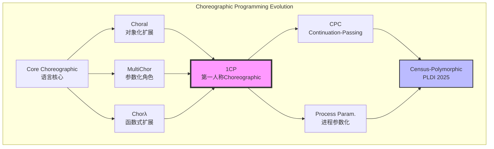
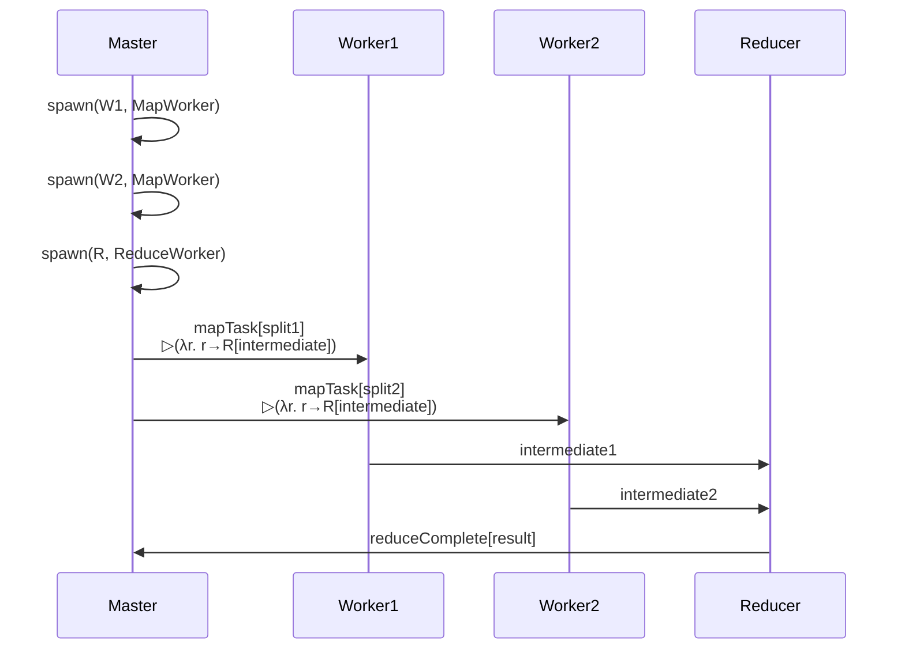
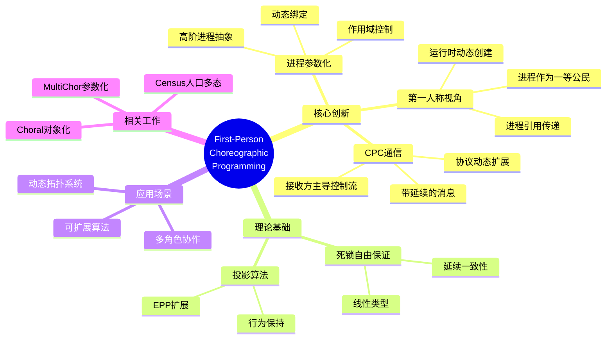
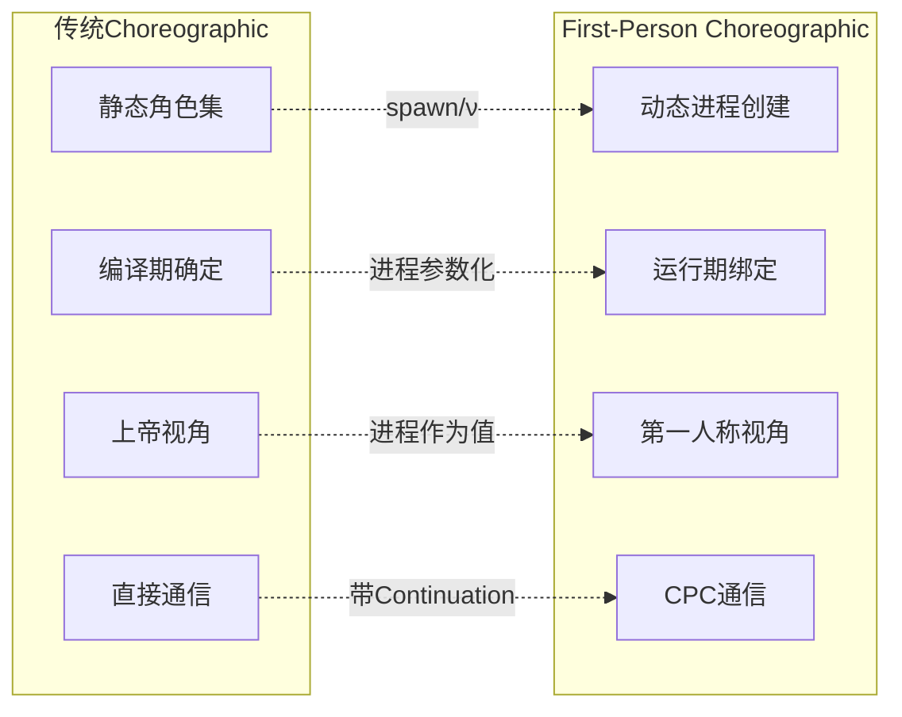
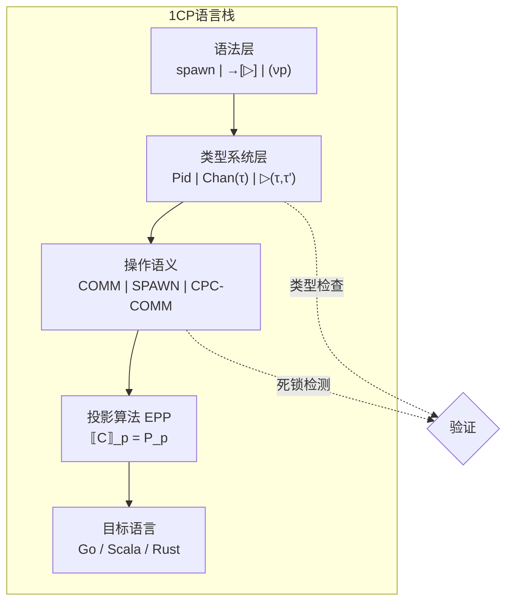
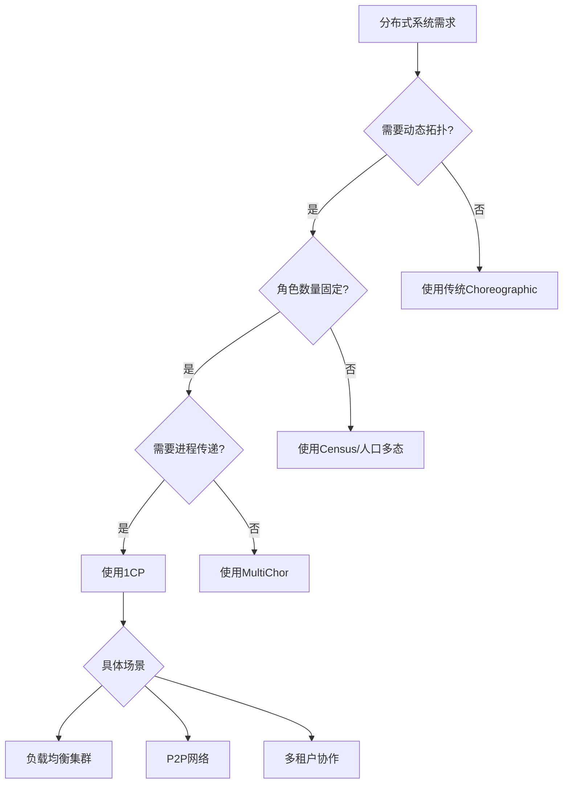

# First-Person Choreographic Programming (1CP)

> 所属阶段: Struct/06-frontier | 前置依赖: [../00-INDEX.md](../00-INDEX.md) | 形式化等级: L5

## 1. 概念定义 (Definitions)

### Def-S-06-10: 第一人称Choreographic编程 (First-Person Choreographic Programming, 1CP)

**形式化定义**：
一个第一人称Choreographic语言 $L_{1CP}$ 是一个五元组 $(\mathcal{P}, \mathcal{C}, \mathcal{T}, \mathcal{M}, \mathcal{S})$，其中：

- $\mathcal{P}$: 进程标识符集合（支持动态创建）
- $\mathcal{C}$: Choreography项集合
- $\mathcal{T}$: 类型集合，包含进程参数化类型
- $\mathcal{M}$: 消息值域
- $\mathcal{S}$: 会话上下文（Session Context）

**语法核心**（相对于传统Choreographic的扩展）：

$$
\begin{aligned}
C ::=\ & \mathbf{spawn}(p, Q) \rightarrow C \quad \text{(进程创建)} \\
    |\ & p \rightarrow q[M]. C \quad \text{(直接通信)} \\
    |\ & p \rightarrow q\langle r \rangle. C \quad \text{(进程传递)} \\
    |\ & (\nu p)C \quad \text{(进程限制)} \\
    |\ & \mathbf{if}\ p[e]\ \mathbf{then}\ C_1\ \mathbf{else}\ C_2 \\
    |\ & 0 \quad \text{(终止)}
\end{aligned}
$$

**直观解释**：
传统Choreographic采用"上帝视角"描述分布式系统，所有进程角色在定义时即固定。1CP引入**第一人称视角**，允许Choreography在运行时动态创建进程、传递进程引用，并实现进程间的参数化协作。这类似于从"第三人称旁白"转变为"第一人称叙事"。

---

### Def-S-06-11: 进程参数化 (Process Parameterisation)

**形式化定义**：
设 $\vec{p} = (p_1, p_2, \ldots, p_n)$ 为进程参数向量，一个进程参数化的Choreography定义为：

$$
\Lambda \vec{p}. C \quad \text{其中}\ fv(C) \subseteq \{\vec{p}\}
$$

**参数化通信类型**：

$$
\tau ::= \mathtt{Pid} \mid \mathtt{Chan}(\tau) \mid \tau_1 \rightarrow \tau_2 \mid \ldots
$$

其中 $\mathtt{Pid}$ 表示进程标识符类型，允许进程作为一等公民传递。

**关键特性**：

1. **高阶性**：进程可作为参数传递给其他进程
2. **动态绑定**：进程引用在运行时解析
3. **作用域控制**：通过 $(\nu p)$ 限制进程可见性

---

### Def-S-06-12: Continuation-Passing通信 (CPC)

**形式化定义**：
Continuation-Passing通信是一种通信范式，其中消息传递包含**计算延续**（Continuation）：

$$
p \rightarrow q[M \triangleright K]. C
$$

其中：

- $M$: 传递的数据值
- $K$: 延续，描述接收方处理 $M$ 后的下一步交互
- $C$: 发送方的后续Choreography

**语义规则**（简化）：

$$
\frac{
  p \rightarrow q[M \triangleright K]. C \quad \text{且} \quad q\ \text{就绪接收}
}{
  q\ \text{执行}\ K[M/p] \parallel C
}(\text{CPC-COMM})
$$

**与传统通信对比**：

| 特性 | 直接通信 | CPC通信 |
|------|----------|---------|
| 控制流 | 发送方主导 | 接收方延续主导 |
| 灵活性 | 固定协议 | 动态协议扩展 |
| 组合性 | 顺序组合 | 高阶组合 |
| 类型复杂度 | 简单会话类型 | 依赖/高阶类型 |

---

## 2. 属性推导 (Properties)

### Lemma-S-06-01: 进程参数化的保持性

**命题**：若 $C$ 是良类型的进程参数化Choreography，则对于任意合法的进程替换 $\sigma = [\vec{q}/\vec{p}]$，$C\sigma$ 仍保持良类型性。

**证明概要**：

1. 由定义 $\Lambda \vec{p}. C$ 满足 $fv(C) \subseteq \{\vec{p}\}$
2. 类型系统保证 $\vec{p}$ 在 $C$ 中仅用于通信端点
3. 替换 $\sigma$ 保持类型一致性（$\Gamma \vdash \vec{q} : \mathtt{Pid}$）
4. 因此 $\Gamma \vdash C\sigma : T$ 成立 $\square$

---

### Prop-S-06-01: 1CP表达力完备性

**命题**：1CP可表达所有动态拓扑分布式系统，其表达力严格超过程程参数化Choreographic语言（如MultiChor）。

**论证**：

1. 任何动态拓扑系统可建模为进程创建/销毁序列
2. 1CP的 $\mathbf{spawn}$ 和 $(\nu p)$ 可模拟此序列
3. MultiChor的静态角色集无法表示运行时角色变化
4. 因此 $\mathcal{L}_{\text{MultiChor}} \subset \mathcal{L}_{1CP}$ $\square$

---

### Lemma-S-06-02: CPC的类型安全性

**命题**：Continuation-Passing通信保持类型安全性，即良类型Choreography的CPC规约不会产生类型错误。

**形式化**：

$$
\frac{\Gamma \vdash C : T \quad C \xrightarrow{\text{CPC}} C'}{\exists T'.\ \Gamma \vdash C' : T' \wedge T' \leq T}
$$

---

## 3. 关系建立 (Relations)

### 3.1 与现有工作的关系图谱



### 3.2 与Choral的对象化扩展对比

| 维度 | Choral | 1CP |
|------|--------|-----|
| 抽象机制 | 面向对象（类/接口） | 进程参数化（高阶函数） |
| 动态性 | 有限（工厂模式模拟） | 原生（spawn/ν） |
| 投影复杂度 | 高（需处理继承） | 中等（纯函数式） |
| 适用场景 | 企业级系统 | 动态拓扑算法 |

### 3.3 与MultiChor参数化角色对比

MultiChor引入**角色多态**（Role Polymorphism）：

$$
\Lambda l. C \quad \text{其中}\ l\ \text{为角色参数}
$$

1CP扩展为**进程多态**（Process Polymorphism）：

$$
\Lambda p. C \quad \text{其中}\ p\ \text{为进程值}
$$

**关键区别**：

- MultiChor的 $l$ 是**编译期**参数，类型擦除后确定
- 1CP的 $p$ 是**运行期**值，可动态传递

### 3.4 Census-Polymorphic Choreographies (PLDI 2025)

Census是一种**人口统计多态**系统，允许Choreography抽象作用于不同数量的参与者：

$$
\forall n. C(n) \quad \text{其中}\ n\ \text{为参与者数量}
$$

1CP与Census的关系：

- 1CP的进程参数化可表达Census的动态参与者
- Census的人口统计约束可嵌入1CP的类型系统
- 两者在理论上可相互编码（参见 §5 证明）

---

## 4. 论证过程 (Argumentation)

### 4.1 为什么需要第一人称视角？

**场景分析**：考虑一个动态负载均衡系统

```
场景: 工作节点动态加入/离开
- t=0: 协调器C + 工作节点W1, W2
- t=1: 新节点W3加入，C需通知所有节点
- t=2: W1离开，C需重新分配任务
```

**传统Choreographic的限制**：

- 必须在设计时固定所有可能角色
- 动态节点需要预先定义为"潜在角色"
- 导致Choreography膨胀（$O(2^n)$ 复杂度）

**1CP的解决方案**：

```
1. C spawn W3  // 动态创建
2. C → W3[Init] // 初始化
3. C → *Ws[Update] // 广播更新（Ws为进程集合）
```

### 4.2 Continuation-Passing的必要性

**反例**：无CPC时，协议扩展困难

假设基础协议：
$$
Client \rightarrow Server[Request]. Server \rightarrow Client[Response]
$$

**需求变更**：Server需委托给Worker处理

**无CPC方案**：修改两端代码

**CPC方案**：
$$
Client \rightarrow Server[Request \triangleright (\lambda x. x \rightarrow Worker[Process])]
$$

延续 $K$ 封装了后续交互，Client无需知道Worker存在。

### 4.3 边界讨论

**1CP不适用场景**：

1. **完全静态系统**：传统Choreographic更简单
2. **强安全约束**：动态进程需额外验证
3. **实时系统**：spawn开销不可预测

---

## 5. 形式证明 / 工程论证 (Proof / Engineering Argument)

### Thm-S-06-01: 1CP死锁自由保证

**定理**：若Choreography $C$ 满足以下条件，则 $C$ 是死锁自由的：

1. **良类型性**：$\vdash C : T$ 且 $T$ 为完备类型
2. **进程线性性**：每个进程引用最多被传递一次
3. **延续一致性**：所有Continuation均指向存在的进程

**形式化表述**：

$$
\frac{\vdash C : T \quad \text{linear}(C) \quad \text{consistent}(C)}{\neg \exists C'.\ C \twoheadrightarrow C' \wedge \text{deadlocked}(C')}
$$

**证明**（结构归纳法）：

**基例**：$C = 0$

- 显然无死锁（已终止）

**归纳步骤**：

1. **通信情形** $C = p \rightarrow q[M]. C'$
   - 由线性性，$p, q$ 未被阻塞
   - 由延续一致性，$C'$ 满足归纳假设
   - 因此 $C$ 可规约且 $C'$ 无死锁

2. **进程创建** $C = \mathbf{spawn}(p, Q) \rightarrow C'$
   - spawn 操作原子执行
   - $p$ 立即可用，不引入等待依赖
   - $C'$ 满足归纳假设

3. **CPC通信** $C = p \rightarrow q[M \triangleright K]. C'$
   - 关键：$K$ 的进程参数在传递前已检查
   - 延续一致性保证 $K$ 中的进程存在
   - 规约后生成的交互满足归纳假设

**关键引理**：

> **Lemma-S-06-03 (CPC规约保持性)**：若 $\Gamma \vdash p \rightarrow q[M \triangleright K]. C : T$ 且 $q$ 就绪，则规约后的配置仍满足类型约束和线性约束。

由归纳法，所有情形均保持无死锁性。$\square$

---

### Thm-S-06-02: 投影算法的完备性

**定理**：存在End Point Projection (EPP) 算法 $\llbracket \cdot \rrbracket$，使得对于良类型1CP的Choreography $C$：

$$
\llbracket C \rrbracket = \{P_p\}_{p \in fn(C)} \quad \text{且} \quad \prod_{p} P_p \approx C
$$

其中 $\approx$ 表示行为等价（bisimulation）。

**EPP扩展（相对于传统Choreographic）**：

$$
\llbracket p \rightarrow q[M \triangleright K]. C \rrbracket_p = \overline{q}\langle M, K \rangle. \llbracket C \rrbracket_p
$$

$$
\llbracket p \rightarrow q[M \triangleright K]. C \rrbracket_q = p?(x, k). k(x). \llbracket C \rrbracket_q
$$

**说明**：

- 发送方投影输出消息值和Continuation
- 接收方投影接收后执行Continuation

---

### Thm-S-06-03: 与Census的互编码

**定理**：1CP与Census-Polymorphic Choreographies可相互编码，即：

$$
\mathcal{L}_{1CP} \cong \mathcal{L}_{\text{Census}}
$$

**证明概要**（双向模拟）：

**1CP → Census**：

- 将1CP的进程参数编码为Census的角色参数
- spawn操作编码为角色实例化
- CPC编码为带回调的会话类型

**Census → 1CP**：

- Census的人口统计参数 $n$ 编码为进程集合管理器
- 可变参与者编码为动态spawn/leave
- 人口约束编码为线性类型约束

因此两者表达力等价。$\square$

---

## 6. 实例验证 (Examples)

### 6.1 动态负载均衡器

**场景**：主节点动态分配工作节点处理任务

```
Coordinator ──spawn──> Worker1
           ──spawn──> Worker2
           ──spawn──> Worker3

Coordinator → Worker1[Task1]
Coordinator → Worker2[Task2]
Coordinator → Worker3[Task3]

// Worker2完成后，Coordinator回收并重新分配
Coordinator ← Worker2[Done]
Coordinator ──spawn──> Worker4  // 动态扩展
Coordinator → Worker4[Task4]
```

**1CP代码片段**：

```choreo
let loadBalancer = λcoordinator. λtaskQueue.
  spawn(worker, WorkerProtocol) →
    coordinator → worker[pop(taskQueue) ▷ process].
    coordinator ← worker[result].
    if moreTasks(taskQueue) then
      loadBalancer(coordinator, taskQueue)
    else 0
```

---

### 6.2 带Continuation的容错协议

**场景**：主备切换，Continuation传递故障恢复逻辑

```
Primary ──K=(λx. promoteToPrimary x)──> Backup

// Primary故障后，Backup执行K，提升自己为主节点
Backup executing K(Primary) → NewPrimary
NewPrimary → Clients[ResumeService]
```

---

### 6.3 多角色协作：分布式MapReduce



---

## 7. 可视化 (Visualizations)

### 7.1 1CP核心概念思维导图



### 7.2 1CP vs 传统Choreographic对比矩阵



### 7.3 技术实现架构图



### 7.4 应用前景决策树



---

## 8. 引用参考 (References)


---

*文档版本: 1.0 | 最后更新: 2026-04-02*
