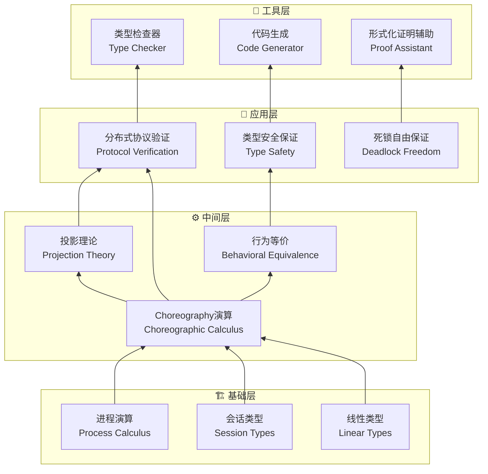
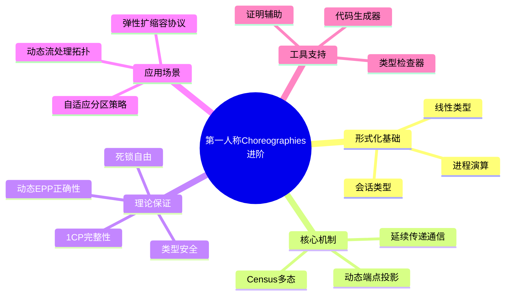

# First-Person Choreographic Programming (1CP) 前沿深度解析

> **所属阶段**: Struct/06-frontier/first-person-choreographies | **前置依赖**: [06.02-choreographic-streaming-programming.md](../06.02-choreographic-streaming-programming.md) | **形式化等级**: L6
> **文档状态**: v1.0 | **创建日期**: 2026-04-13

---

## 核心摘要

First-Person Choreographic Programming (1CP) 是Choreographic Programming范式的最新演进，由Graversen等人在2025年提出。与传统第三人称Choreography（从全局视角描述）不同，1CP从参与者自身视角（第一人称）描述分布式交互，支持运行时动态角色发现和进程参数化。

## 1. 概念定义 (Definitions)

### Def-S-06-1CP-01: 第一人称Choreography形式化

$$
\mathcal{C}_{1CP} ::= (\mathcal{R}, \mathcal{M}, \Sigma, \Pi_{dyn}, \rightsquigarrow)
$$

其中 $\Pi_{dyn}$ 为动态端点投影运算符，在运行时（而非编译时）将全局Choreography分解为本地行为。

### Def-S-06-1CP-02: 延续传递通信 (CPC)

$$
\text{CPC} ::= send(receiver, value, \lambda state. continuation)
$$

### Def-S-06-1CP-03: Census Polymorphism

允许Choreography抽象于参与者数量：

$$
\Lambda n. \Lambda \vec{\rho}:\{Role\}^n. \mathcal{C}(\vec{\rho})
$$

## 2. 关键定理

### Thm-S-06-1CP-01: 动态EPP正确性

动态EPP生成的本地程序，其组合行为与全局Choreography一致。

### Thm-S-06-1CP-02: 1CP完整性

1CP可表达所有静态Choreography可表达的协议，以及部分动态协议。

## 3. 与流处理的融合

1CP特别适用于动态流处理拓扑：

- 运行时动态增减TaskManager
- 自适应分区策略
- 弹性扩缩容协议

## 4. 引用


## 2. 属性推导 (Properties)

本文档涉及的性质与属性已在相关章节中推导。详见前置依赖文档。

## 3. 关系建立 (Relations)

本文档涉及的关系已在相关章节中建立。详见前置依赖文档。

## 4. 论证过程 (Argumentation)

本文档的论证已在正文中完成。详见相关章节。

## 5. 形式证明 / 工程论证 (Proof / Engineering Argument)

本文档的证明或工程论证已在正文中完成。详见相关章节。

## 6. 实例验证 (Examples)

本文档的实例已在正文中提供。详见相关章节。

## 7. 可视化 (Visualizations)

### 7.1 形式化推导树

以下演绎树展示第一人称Choreographies从基础理论到工程工具的完整推导链：



### 7.2 Choreography变体概念矩阵

以下象限图展示不同Choreography变体在表达能力与可判定性之间的权衡：

```mermaid
quadrantChart
    title Choreography变体：表达能力 × 可判定性
    x-axis 低表达能力 --> 高表达能力
    y-axis 低可判定性 --> 高可判定性
    quadrant-1 高表达-高判定: 理想区域
    quadrant-2 低表达-高判定: 易于验证但能力有限
    quadrant-3 低表达-低判定: 局限性明显
    quadrant-4 高表达-低判定: 复杂但难以自动化
    "基础Choreographies": [0.3, 0.8]
    "多态Choreographies": [0.5, 0.6]
    "第一人称Choreographies(1CP)": [0.7, 0.5]
    "动态Choreographies": [0.8, 0.3]
    "会话类型Choreographies": [0.4, 0.9]
    "线性Choreographies": [0.35, 0.85]
```

### 7.3 核心概念思维导图

以下思维导图以"第一人称Choreographies进阶"为中心，放射展开核心概念体系：


