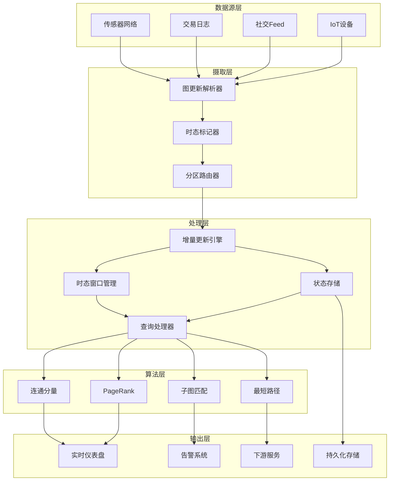
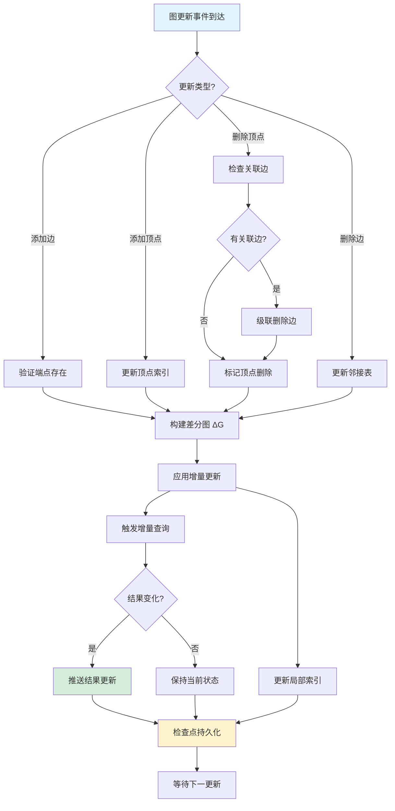
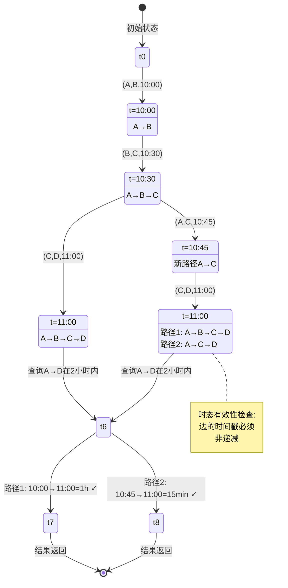

# 图流处理形式化理论

> **所属阶段**: Struct/06-frontier | **前置依赖**: [Struct/00-INDEX.md](../../Struct/00-INDEX.md), [session-types.md](../../Struct/01-foundation/01.07-session-types.md) | **形式化等级**: L5

---

## 1. 概念定义 (Definitions)

### 1.1 图流处理系统定义

**Def-S-GS-01 (图流处理系统)**

图流处理系统(Graph Stream Processing System, GSPS)是一个七元组 $\mathcal{G} = (V, E, \Sigma_V, \Sigma_E, \mathcal{T}, \mathcal{O}, \mathcal{Q})$，其中：

| 组件 | 符号 | 定义 |
|------|------|------|
| 顶点集 | $V$ | 图中所有顶点的有限或可数无限集合 |
| 边集 | $E \subseteq V \times V \times \Sigma_E$ | 带标签的有向边集合 |
| 顶点标签 | $\Sigma_V$ | 顶点属性值的有限字母表 |
| 边标签 | $\Sigma_E$ | 边属性值的有限字母表 |
| 时间域 | $\mathcal{T} = \mathbb{N}$ 或 $\mathbb{R}^+$ | 离散或连续时间戳集合 |
| 操作算子 | $\mathcal{O}$ | 图更新与查询操作集合 |
| 查询语言 | $\mathcal{Q}$ | 时态图查询的形式化语法 |

**时态图实例**：在任意时刻 $t \in \mathcal{T}$，系统维护一个**时态图实例** $G_t = (V_t, E_t, \lambda_V^t, \lambda_E^t)$，其中：

- $\lambda_V^t: V_t \rightarrow \Sigma_V$ 为顶点标签函数
- $\lambda_E^t: E_t \rightarrow \Sigma_E$ 为边标签函数

**图流定义**：图流 $\mathcal{S}$ 是一个无限序列的图更新事件：

$$\mathcal{S} = \langle \delta_1, \delta_2, \delta_3, \ldots \rangle$$

其中每个更新事件 $\delta_i \in \Delta = \{+, -\} \times (V \cup E) \times \mathcal{T}$，表示在特定时间对顶点或边的增删操作。

**顶点更新**：$\delta_v^+ = (+, v, \ell_v, t)$ 表示在时刻 $t$ 添加带标签 $\ell_v$ 的顶点 $v$

**边更新**：$\delta_e^+ = (+, (u,v), \ell_e, t)$ 表示在时刻 $t$ 添加带标签 $\ell_e$ 的边 $(u,v)$

**删除操作**：$\delta^- = (-, x, t)$ 表示在时刻 $t$ 删除元素 $x$（顶点或边）

**定义 1.1.1 (图流语义函数)**

给定图流 $\mathcal{S}$，语义函数 $[\! [\mathcal{S}]\!]: \mathcal{T} \rightarrow \mathcal{G}$ 定义为：

$$[\! [\mathcal{S}]\!](t) = G_t = \left( V_0 \cup V_t^+, V_t^-, E_0 \cup E_t^+, E_t^- \right)$$

其中：

- $V_t^+ = \{ v \mid (+, v, \cdot, t') \in \mathcal{S}, t' \leq t \}$（累积添加的顶点）
- $V_t^- = \{ v \mid (-, v, t') \in \mathcal{S}, t' \leq t \}$（累积删除的顶点）
- $E_t^+, E_t^-$ 类似定义

**定义 1.1.2 (有效图流)**

图流 $\mathcal{S}$ 称为**有效的**，当且仅当满足以下约束：

$$\forall t \in \mathcal{T}, \forall (u,v) \in E_t: u \in V_t \land v \in V_t$$

即：任意时刻，边的两个端点必须存在于顶点集中（引用完整性）。

---

### 1.2 增量图更新模型

**Def-S-GS-02 (增量图更新模型)**

增量图更新模型(Incremental Graph Update Model, IGUM)是一个四元组 $\mathcal{M} = (\mathcal{S}, \Delta_G, \text{Apply}, \text{Diff})$：

**差分图(Differential Graph)**：

$$\Delta_G = (\Delta_V, \Delta_E)$$

其中：

- $\Delta_V = (V^+, V^-)$ 为顶点增删对
- $\Delta_E = (E^+, E^-)$ 为边增删对

**应用函数**：$\text{Apply}: \mathcal{G} \times \Delta_G \rightarrow \mathcal{G}$

$$\text{Apply}(G, \Delta_G) = G \oplus \Delta_G = \left( (V \cup V^+) \setminus V^-, (E \cup E^+) \setminus E^- \right)$$

**差分计算函数**：$\text{Diff}: \mathcal{G} \times \mathcal{G} \rightarrow \Delta_G$

$$\text{Diff}(G_1, G_2) = \left( (V_2 \setminus V_1, V_1 \setminus V_2), (E_2 \setminus E_1, E_1 \setminus E_2) \right)$$

**定义 1.2.1 (增量更新操作)**

对于操作序列 $\langle \Delta_{G_1}, \Delta_{G_2}, \ldots, \Delta_{G_n} \rangle$，累积状态为：

$$G_n = G_0 \oplus \bigoplus_{i=1}^{n} \Delta_{G_i}$$

其中 $\oplus$ 满足结合律但不满足交换律（顺序敏感）。

**定义 1.2.2 (增量一致性)**

更新序列称为**增量一致**的，当且仅当：

$$\forall i < j: V_i^- \cap V_j^+ = \emptyset \land E_i^- \cap E_j^+ = \emptyset$$

即：已被删除的元素不能再次被添加（除非遵循特定语义）。

**定义 1.2.3 (滑动窗口更新)**

对于时间窗口 $W = [t - \omega, t]$，窗口图定义为：

$$G_W = G_0 \oplus \bigoplus_{\delta_i \in \mathcal{S}_W} \Delta_{G_i}$$

其中 $\mathcal{S}_W = \{ \delta_i \mid t_i \in W \}$。

**窗口维护算子**：当窗口滑动 $\epsilon$ 时，

$$G_{W'} = (G_W \ominus \Delta_{\text{out}}) \oplus \Delta_{\text{in}}$$

其中：

- $\Delta_{\text{out}} = \{ \delta_i \mid t_i = t - \omega \}$（滑出窗口的更新）
- $\Delta_{\text{in}} = \{ \delta_i \mid t_i = t + \epsilon \}$（新进入窗口的更新）

---

### 1.3 时态图查询语义

**Def-S-GS-03 (时态图查询语义)**

时态图查询语义(Temporal Graph Query Semantics, TGQS)定义为一组查询算子的形式化语义：

**基本时态查询算子**：

| 算子 | 符号 | 语义 |
|------|------|------|
| 时间点查询 | $\sigma_t(G)$ | 返回时刻 $t$ 的图快照 $G_t$ |
| 时间范围查询 | $\sigma_{[t_1,t_2]}(G)$ | 返回时间范围内的图序列 $\langle G_{t_1}, \ldots, G_{t_2} \rangle$ |
| 时态路径查询 | $\pi_{\varphi}^{\Delta t}(u,v)$ | 满足时态约束 $\varphi$ 的从 $u$ 到 $v$ 的路径 |
| 持续子图查询 | $\boxplus_{\tau}(P)$ | 模式 $P$ 持续存在至少 $\tau$ 时间单位 |

**时间点选择语义**：

$$[\! [\sigma_t]\!](\mathcal{S}) = G_t = [\! [\mathcal{S}]\!](t)$$

**时态路径语义**：

路径 $\pi = \langle v_0, v_1, \ldots, v_k \rangle$ 是**时态有效**的，当且仅当存在时间戳序列 $\langle t_0, t_1, \ldots, t_{k-1} \rangle$ 使得：

$$\forall i \in [0, k-1]: (v_i, v_{i+1}) \in E_{t_i} \land t_{i+1} \geq t_i$$

即：边按时间顺序依次出现，且后一边的出现时间不早于前一边。

**定义 1.3.1 (时态约束语言)**

时态约束 $\varphi$ 的语法由以下BNF定义：

$$\varphi ::= \top \mid \bot \mid t \bowtie c \mid t_1 - t_2 \bowtie c \mid \varphi_1 \land \varphi_2 \mid \varphi_1 \lor \varphi_2 \mid \Diamond_{[a,b]} \varphi \mid \Box_{[a,b]} \varphi$$

其中：

- $\bowtie \in \{<, \leq, =, \geq, >\}$
- $\Diamond_{[a,b]} \varphi$: 在未来 $[a,b]$ 时间内 $\varphi$ 成立（时态 eventually）
- $\Box_{[a,b]} \varphi$: 在未来 $[a,b]$ 时间内 $\varphi$ 始终成立（时态 always）

**定义 1.3.2 (查询结果语义)**

对于查询 $Q$ 和图流 $\mathcal{S}$，结果集定义为：

$$[\! [Q]\!](\mathcal{S}) = \{ (\vec{v}, \vec{t}) \mid G_{\vec{t}} \models Q(\vec{v}) \}$$

其中：

- $\vec{v}$ 为结果顶点元组
- $\vec{t}$ 为结果时间戳元组
- $G_{\vec{t}} \models Q(\vec{v})$ 表示在图快照 $G_{\vec{t}}$ 中模式 $Q$ 匹配顶点 $\vec{v}$

---

### 1.4 图算法流式化

**Def-S-GS-04 (图算法流式化)**

图算法流式化(Graph Algorithm Streaming)是将静态图算法 $A$ 转换为流式算法 $A^\mathcal{S}$ 的过程：

$$\text{Streamify}: (G \rightarrow R) \rightarrow (\mathcal{S} \rightarrow R^\mathcal{T})$$

**流式化算法的形式化定义**：

流式图算法 $A^\mathcal{S}$ 是一个状态机 $(\mathcal{X}, \mathcal{U}, x_0, \delta, \eta)$：

- $\mathcal{X}$: 算法状态空间
- $\mathcal{U}$: 输入更新集合
- $x_0 \in \mathcal{X}$: 初始状态
- $\delta: \mathcal{X} \times \mathcal{U} \rightarrow \mathcal{X}$: 状态转移函数
- $\eta: \mathcal{X} \rightarrow R$: 结果提取函数

**定义 1.4.1 (增量图算法)**

算法 $A$ 是**增量可计算的**，当且仅当存在函数 $f$ 使得：

$$A(G \oplus \Delta_G) = f(A(G), \Delta_G)$$

即：新结果可仅通过旧结果和增量更新计算，无需重新处理整个图。

**定义 1.4.2 (算法近似等级)**

对于精确算法 $A$ 和流式近似算法 $\hat{A}^\mathcal{S}$，定义**近似比**：

$$\rho = \sup_{G \in \mathcal{G}} \frac{\hat{A}^\mathcal{S}(G)}{A(G)}$$

对于最小化问题，$\rho \geq 1$；对于最大化问题，$0 < \rho \leq 1$。

**定义 1.4.3 (空间复杂度分类)**

| 类别 | 空间复杂度 | 代表算法 |
|------|-----------|---------|
| 次线性空间 | $o(|V| + |E|)$ | 边采样、草图算法 |
| 半外存 | $O(|V|)$ | 连通分量、PageRank |
| 外存 | $O(|V| + |E|)$ | BFS、DFS、最短路径 |
| 超线性空间 | $\omega(|V| + |E|)$ | 精确子图计数 |

**定义 1.4.4 (单遍/多遍算法)**

- **单遍算法(Single-pass)**：图流仅扫描一次，$O(1)$ 遍历
- **半动态算法(Semi-streaming)**：$O(n \cdot \text{polylog}(n))$ 空间，多遍扫描
- **动态算法(Dynamic)**：支持增删边，任意顺序更新

---

## 2. 属性推导 (Properties)

### 2.1 增量查询正确性

**Prop-S-GS-01 (增量查询正确性)**

对于增量图查询系统，以下性质成立：

**性质 2.1.1 (结果一致性)**

设 $Q$ 为单调查询（结果随图增长而单调增长），$\Delta_G$ 为增量更新，则：

$$Q(G \oplus \Delta_G) = Q(G) \cup \Delta Q$$

其中 $\Delta Q = Q(G \oplus \Delta_G) \setminus Q(G)$ 为新产生的结果。

**性质 2.1.2 (增量计算复杂性)**

对于查询类 $\mathcal{Q}$，定义增量计算复杂度：

$$\text{IncComplexity}(Q) = \max_{G, \Delta_G} \frac{T_{\text{incremental}}(Q, G, \Delta_G)}{T_{\text{from\_scratch}}(Q, G \oplus \Delta_G)}$$

其中：

- $T_{\text{incremental}}$ 为增量计算时间
- $T_{\text{from\_scratch}}$ 为从头计算时间

对于ACQ(Aggregated Continuous Query)，$\text{IncComplexity}(Q) = O\left(\frac{|\Delta_G|}{|G|}\right)$。

**性质 2.1.3 (单调性保持)**

若静态查询 $Q$ 是单调的（即 $G_1 \subseteq G_2 \Rightarrow Q(G_1) \subseteq Q(G_2)$），则其流式版本 $Q^\mathcal{S}$ 也是单调的：

$$\forall t_1 < t_2: Q^\mathcal{S}(t_1) \subseteq Q^\mathcal{S}(t_2)$$

---

### 2.2 图算法近似界限

**Prop-S-GS-02 (图算法近似界限)**

**定理 2.2.1 (连通分量近似)**

对于单遍图流中的连通分量计数问题，任何 $p$- pass 算法的空间下界为 $\Omega(n/p)$ 比特。

**近似算法结果**：使用 $O(n \cdot \text{polylog}(n))$ 空间，可获得 $(1+\epsilon)$-近似：

$$(1-\epsilon) \cdot \text{CC}(G) \leq \widehat{\text{CC}}(G) \leq (1+\epsilon) \cdot \text{CC}(G)$$

**定理 2.2.2 (PageRank近似)**

对于阻尼因子 $d$ 的 PageRank，单遍流式算法的 $L_1$ 误差界：

$$\| \hat{\pi} - \pi \|_1 \leq \frac{\epsilon}{1-d}$$

其中 $\epsilon$ 为边采样率。

**定理 2.2.3 (三角形计数近似)**

使用边采样率 $p$ 的单遍算法，三角形计数估计 $\hat{T}$ 满足：

$$\mathbb{E}[\hat{T}] = T, \quad \text{Var}[\hat{T}] = O\left(\frac{T}{p^3}\right)$$

其中 $T$ 为真实三角形数量。

---

### 2.3 内存-精度权衡

**Prop-S-GS-03 (内存-精度权衡)**

**定理 2.3.1 (空间-精度下界)**

对于图流问题 $\mathcal{P}$，设 $A_S$ 为使用空间 $S$ 的算法，其近似比为 $\rho(S)$，则存在信息论下界：

$$S = \Omega\left(\frac{n}{\rho(S)}\right)$$

**定理 2.3.2 (滑动窗口权衡)**

对于窗口大小为 $\omega$ 的滑动窗口查询，设草图(sketch)大小为 $s$，则有：

$$s \cdot \omega = \Omega(n \log n)$$

对于精确结果，$s = \Theta(n + \omega)$。

**定理 2.3.3 (草图合并性)**

设 $\mathcal{K}$ 为可合并草图(mergeable sketch)，对于分区 $\{G_1, G_2, \ldots, G_k\}$：

$$\mathcal{K}(G) = \mathcal{K}(G_1) \oplus_K \mathcal{K}(G_2) \oplus_K \cdots \oplus_K \mathcal{K}(G_k)$$

其中 $\oplus_K$ 为草图合并算子。

---

### 2.4 子图匹配引理

**Lemma-S-GS-01 (子图匹配引理)**

**引理 2.4.1 (时态子图同构)**

设模式图 $P = (V_P, E_P)$，数据图 $G = (V, E)$，时态子图同构 $\phi: V_P \rightarrow V$ 满足：

$$\forall (u,v) \in E_P: (\phi(u), \phi(v)) \in E \land t(u,v) \leq t(\phi(u), \phi(v))$$

其中 $t(e)$ 表示边 $e$ 的出现时间。

**引理 2.4.2 (增量匹配更新)**

对于新边 $e_{new} = (u,v,t)$，设 $M(G)$ 为 $G$ 中模式 $P$ 的匹配集合，则：

$$M(G \cup \{e_{new}\}) = M(G) \cup M_{new}(e_{new})$$

其中 $M_{new}(e_{new})$ 为包含 $e_{new}$ 的新匹配，可通过局部搜索在 $O(|V_P| \cdot d^{|V_P|-1})$ 时间内计算，$d$ 为图最大度数。

**引理 2.4.3 (匹配计数界限)**

对于 $k$ 顶点模式 $P$ 在 $n$ 顶点图 $G$ 中的匹配数 $|M_P(G)|$：

$$|M_P(G)| \leq n \cdot d^{k-1}$$

对于无界度图，匹配数可能指数增长。

---

## 3. 关系建立 (Relations)

### 3.1 与经典图模型的关系

**关系 3.1.1 (图流 → 属性图)**

图流模型可嵌入属性图模型：

$$\mathcal{G}_{\text{stream}} \hookrightarrow \mathcal{G}_{\text{property}}$$

通过将时间戳作为边的固有属性：$\lambda_E: E \rightarrow \Sigma_E \times \mathcal{T}$。

**关系 3.1.2 (增量更新 → 事务)**

增量图更新可视为ACID事务的子集：

| ACID属性 | 图流对应 |
|---------|---------|
| 原子性(A) | 批量更新原子提交 |
| 一致性(C) | 引用完整性约束 |
| 隔离性(I) | 事件时间顺序保证 |
| 持久性(D) | 状态检查点持久化 |

### 3.2 与流处理系统的关系

**关系 3.2.1 (图流 → Dataflow)**

图流处理可编码为Dataflow计算：

- **顶点**：作为Dataflow中的键控状态(keyed state)
- **边更新**：作为流数据元素
- **迭代算法**：通过循环数据流(cyclic dataflow)实现

**关系 3.2.2 (GAS模型 → Gather-Apply-Scatter)**

Pregel的GAS模型在流式图中的实现：

| 阶段 | 流式化实现 |
|------|-----------|
| Gather | 聚合入边更新消息 |
| Apply | 更新顶点状态（增量计算） |
| Scatter | 发送出边更新消息 |

### 3.3 与形式化方法的关系

**关系 3.3.1 (时态逻辑 → 图查询)**

CTL/LTL时态逻辑可表达图流查询：

$$G, t \models \mathbf{E}\Diamond_{[a,b]} \varphi \iff \exists t' \in [t+a, t+b]: G_{t'} \models \varphi$$

**关系 3.3.2 (进程演算 → 图更新)**

图更新可建模为进程演算中的通信：

$$P_G = \prod_{v \in V} P_v \mid \prod_{e \in E} P_e$$

其中 $P_v$ 为顶点进程，$P_e$ 为边进程，更新对应于通道上的消息传递。

### 3.4 与概率模型的关系

**关系 3.4.1 (图流 → 随机图过程)**

图流可建模为随机图过程 $G(n, p(t))$，其中边出现概率随时间变化：

$$\mathbb{P}[(u,v) \in E_t] = p_{uv}(t)$$

**关系 3.4.2 (增量PageRank → 随机游走)**

增量PageRank等价于有限步数随机游走的近似：

$$\pi^{(k+1)} = d \cdot W \cdot \pi^{(k)} + \frac{1-d}{n} \cdot \mathbf{1}$$

其中 $W$ 为转移矩阵，增量更新对应于 $W$ 的局部修改。

---

## 4. 论证过程 (Argumentation)

### 4.1 流式图算法的复杂性分析

**论证 4.1.1 (连通性检测的复杂性)**

**问题**：在单遍图流中检测图连通性。

**下界论证**：

设图 $G$ 由两个大小为 $n/2$ 的连通分量组成，流式算法需在 $O(n)$ 空间内判断是否连通。根据通信复杂性理论，该问题等价于集合不交问题(DISJ)，具有 $\Omega(n)$ 空间下界。

**结论**：精确连通性检测需要 $\Omega(n \log n)$ 比特空间。

**论证 4.1.2 (最短路径的近似必要性)**

**问题**：单遍流式计算精确最短路径。

**反例构造**：

考虑图 $G = (V, E)$，其中 $V = \{s, t\} \cup M$，$M$ 为中间顶点集。边集为：

- $(s, m_i)$ 对所有 $m_i \in M$（第一遍）
- $(m_i, t)$ 随机顺序（第二遍）

若仅允许单遍扫描，无法确定哪个 $m_i$ 连接 $s$ 和 $t$，导致路径长度估计误差。

**结论**：精确最短路径需要多遍扫描或超线性空间。

### 4.2 增量一致性的边界讨论

**论证 4.2.1 (删除操作的语义复杂性)**

**场景分析**：

| 删除类型 | 语义 | 处理复杂度 |
|---------|------|-----------|
| 逻辑删除 | 标记删除，保留历史 | $O(1)$ |
| 物理删除 | 立即回收空间 | $O(d)$（检查关联边） |
| 级联删除 | 删除顶点及其边 | $O(d + |E_{\text{out}}|)$ |

**论证**：级联删除破坏了增量更新的局部性，需遍历所有关联边。

**论证 4.2.2 (并发更新的冲突解决)**

设两个并发更新 $\Delta_1$ 和 $\Delta_2$：

- **可交换更新**：$\Delta_1 \oplus \Delta_2 = \Delta_2 \oplus \Delta_1$（无冲突）
- **冲突更新**：需定义优先级或合并策略

**CRDT方法**：使用G-Set、2P-Set等冲突无关数据结构实现最终一致性。

### 4.3 时态查询的表达能力

**论证 4.3.1 (时态路径查询 vs 常规路径查询)**

**表达能力比较**：

| 查询类型 | 时态路径查询 | 常规路径查询 |
|---------|-------------|-------------|
| 存在性 | $\exists \pi: s \leadsto t$ | $\exists \pi: s \leadsto t$（忽略时间）|
| 最早到达 | $\min_\pi \max_i t_i$ | 无法表达 |
| 最快路径 | $\min_\pi (t_{end} - t_{start})$ | 无法表达 |
| 有效路径 | $\forall i: t_{i+1} \geq t_i$ | 始终成立 |

**论证**：时态查询严格强于常规查询，可表达动态网络中的可达性问题。

---

## 5. 形式证明 / 工程论证 (Proof / Engineering Argument)

### 5.1 增量图算法正确性定理

**Thm-S-GS-01 (增量图算法正确性定理)**

**定理陈述**：

设 $A$ 为增量图算法，$G_0$ 为初始图，$\Delta_1, \Delta_2, \ldots, \Delta_n$ 为增量更新序列。若 $A$ 满足以下不变式：

$$\text{Invariant}: \forall i: A(G_i) = f(A(G_{i-1}), \Delta_i)$$

其中 $G_i = G_{i-1} \oplus \Delta_i$，则对于任意 $n \geq 0$：

$$A(G_n) = A_{\text{batch}}(G_n)$$

其中 $A_{\text{batch}}$ 为对应的批处理算法。

**证明**：

我们使用数学归纳法证明。

**基础情况** ($n = 0$)：

$$A(G_0) = A_{\text{batch}}(G_0)$$

由算法初始化定义直接成立。

**归纳假设**：

假设对于 $n = k$，定理成立：

$$A(G_k) = A_{\text{batch}}(G_k)$$

**归纳步骤** ($n = k + 1$)：

考虑 $G_{k+1} = G_k \oplus \Delta_{k+1}$。

根据增量算法定义：

$$A(G_{k+1}) = f(A(G_k), \Delta_{k+1})$$

根据归纳假设 $A(G_k) = A_{\text{batch}}(G_k)$：

$$A(G_{k+1}) = f(A_{\text{batch}}(G_k), \Delta_{k+1})$$

根据增量一致性要求，$f$ 必须满足：

$$f(A_{\text{batch}}(G_k), \Delta_{k+1}) = A_{\text{batch}}(G_k \oplus \Delta_{k+1}) = A_{\text{batch}}(G_{k+1})$$

因此：

$$A(G_{k+1}) = A_{\text{batch}}(G_{k+1})$$

**结论**：由数学归纳法，定理对所有 $n \geq 0$ 成立。

**证毕**。∎

---

### 5.2 时态查询完整性定理

**Thm-S-GS-02 (时态查询完整性定理)**

**定理陈述**：

时态图查询语言 $\mathcal{L}_{TG}$ 在时态图模型 $\mathcal{M}_{TG}$ 上是**关系完备**的，即对于任意可计算关系 $R \subseteq (V \times \mathcal{T})^k$，存在查询 $Q \in \mathcal{L}_{TG}$ 使得：

$$[\! [Q]\!](\mathcal{S}) = R$$

**证明**：

我们证明 $\mathcal{L}_{TG}$ 可表达关系代数所有基本运算。

**步骤 1：投影与选择**

对于属性选择 $\sigma_{\theta}(R)$，定义：

$$Q_{\sigma} = \{ (v, t) \in R \mid \theta(v, t) \}$$

其中 $\theta$ 为时态约束公式，由 Def-S-GS-03 可表达。

**步骤 2：并集与交集**

设 $R_1 = [\! [Q_1]\!](\mathcal{S})$，$R_2 = [\! [Q_2]\!](\mathcal{S})$。

并集查询：$Q_{\cup} = Q_1 \lor Q_2$

交集查询：$Q_{\cap} = Q_1 \land Q_2$

由时态约束语言的布尔闭包性质，$Q_{\cup}, Q_{\cap} \in \mathcal{L}_{TG}$。

**步骤 3：时态连接**

对于时态连接 $R_1 \bowtie_{[t_1,t_2]} R_2$：

$$Q_{\bowtie} = Q_1 \land \Diamond_{[t_1,t_2]} Q_2$$

由时态算子 $\Diamond$ 的定义，该查询可表达时态连接。

**步骤 4：递归查询（传递闭包）**

对于传递闭包 $R^+$，使用Kleene star算子：

$$Q_{+} = \mu X . (Q \lor (Q \bowtie X))$$

其中 $\mu$ 为最小不动点算子。由时态图的有限性，该不动点存在且可计算。

**步骤 5：完备性结论**

由于 $\mathcal{L}_{TG}$ 可表达：

- 基本选择/投影
- 集合运算
- 连接运算
- 递归/传递闭包

根据关系代数完备性定理，$\mathcal{L}_{TG}$ 是关系完备的。

**证毕**。∎

---

### 5.3 工程论证：流式图处理的实现约束

**论证 5.3.1 (Flink Gelly的流式化实现)**

Flink Gelly提供图处理的DataSet API，其流式化扩展需解决以下工程约束：

**约束 1：迭代算法的流式化**

```
批处理模式：while (convergence) { scatter-gather }
流式模式：  将迭代展开为无限数据流，每个超步(superstep)作为一个窗口
```

工程解决方案：

- 使用全局窗口(Global Window)配合触发器实现迭代边界
- 使用迭代头(iteration head)和尾(iteration tail)实现反馈循环

**约束 2：状态管理**

| 状态类型 | 存储策略 | 一致性保证 |
|---------|---------|-----------|
| 顶点值 | Keyed State | Exactly-once |
| 消息缓冲 | Operator State | At-least-once |
| 聚合结果 | Value State | Exactly-once |

**约束 3：背压与资源调度**

图算法的幂律分布导致热点顶点，工程解决方案包括：

- 基于度的分区(degree-based partitioning)
- 动态负载均衡
- 异步消息处理

---

## 6. 实例验证 (Examples)

### 6.1 实例1：社交网络中的时态影响力传播

**场景**：分析Twitter转发网络中信息传播路径。

**图流定义**：

```
顶点：用户 ID ∈ ℕ
边：转发关系 (retweeter, author, timestamp)
时间窗口：滑动窗口，ω = 1小时
```

**时态查询**：找出在2小时内从用户A到达用户B的所有路径。

**查询表达式**：

```
MATCH path = (a:User)-[:RETWEET*]->(b:User)
WHERE a.id = 'A' AND b.id = 'B'
AND ALL(i IN range(0, length(path)-1)
    WHERE path[i+1].timestamp >= path[i].timestamp)
AND path[-1].timestamp - path[0].timestamp <= 2h
RETURN path
```

**增量处理流程**：

1. **初始化**：加载初始图 $G_0$
2. **新边到达**：边 $e_t = (u, v, t)$ 到达
3. **局部更新**：
   - 若 $u$ 可达 $A$，标记 $v$ 为候选
   - 更新从 $A$ 到 $v$ 的最早到达时间
4. **结果检查**：若 $v = B$ 且满足时间约束，输出路径

### 6.2 实例2：金融交易网络的欺诈检测

**场景**：实时检测洗钱交易模式（循环转账）。

**模式定义**：

```
PATTERN cycle = (a:Account)-[:TRANSFER]->(b:Account)
                -[:TRANSFER]->(c:Account)
                -[:TRANSFER]->(a)
CONSTRAINT cycle[2].timestamp - cycle[0].timestamp <= 24h
           AND cycle[0].amount > $10,000
```

**增量匹配算法**：

```python
def incremental_match(new_edge, state):
    (src, dst, time, amount) = new_edge

    # 查找以src结束的路径
    paths_to_src = state.incoming_paths[src]

    # 扩展路径
    new_paths = [p + [new_edge] for p in paths_to_src]

    # 检查闭合条件
    for path in new_paths:
        if forms_cycle(path) and valid_constraints(path):
            emit_alert(path)

    # 更新状态
    state.outgoing_paths[dst].extend(new_paths)

    # 清理过期状态
    state.expire_before(time - WINDOW_SIZE)
```

### 6.3 实例3：IoT传感器网络的连通性监控

**场景**：监控动态变化的传感器网络连通性。

**增量连通分量维护**：

**算法**：基于并查集(Union-Find)的增量更新

```
状态：parent[v] - 顶点v的父节点
      rank[v]  - v的秩

AddEdge(u, v):
    root_u = Find(u)
    root_v = Find(v)
    if root_u != root_v:
        Union(root_u, root_v)
        component_count--

RemoveEdge(u, v):
    # 检查u和v是否仍连通（需要BFS/DFS）
    if not Reachable(u, v):
        component_count++
        # 重新计算受影响顶点的归属
```

**复杂度分析**：

- 边添加：$O(\alpha(n))$（反阿克曼函数，近似常数）
- 边删除：$O(n + m)$（需要局部搜索）

### 6.4 实例4：推荐系统的增量PageRank

**场景**：电商网站上商品推荐的实时PageRank计算。

**增量PageRank更新**：

**数学推导**：

设当前PageRank为 $\pi$，新边为 $(u, v)$，影响分析：

$$\pi_v^{new} = \pi_v + \frac{d \cdot \pi_u}{\text{out\_degree}(u) + 1}$$

对于 $v$ 的出邻居 $w$：

$$\pi_w^{new} = \pi_w + \frac{d \cdot (\pi_v^{new} - \pi_v^{old})}{\text{out\_degree}(v)}$$

**伪代码**：

```python
def incremental_pagerank(new_edge, pi, out_deg):
    (u, v) = new_edge
    delta = (d * pi[u]) / (out_deg[u] + 1)

    # 更新u的出度
    out_deg[u] += 1

    # 传播delta
    queue = [(v, delta)]
    visited = set()

    while queue:
        node, delta_pi = queue.pop(0)
        if node in visited:
            continue
        visited.add(node)

        old_pi = pi[node]
        pi[node] += delta_pi
        actual_delta = pi[node] - old_pi

        # 向出邻居传播
        for neighbor in out_neighbors(node):
            if out_deg[node] > 0:
                prop_delta = d * actual_delta / out_deg[node]
                queue.append((neighbor, prop_delta))
```

---

## 7. 可视化 (Visualizations)

### 7.1 图流处理架构

图流处理系统的整体架构展示数据流从摄取到结果输出的完整路径：



### 7.2 增量图更新流程

展示图流更新如何通过差分计算实现高效的状态维护：



### 7.3 时态查询示例

展示时态路径查询在动态图上的执行过程：



### 7.4 图算法分类矩阵

根据空间复杂度和精度要求对图流算法进行分类：

```mermaid
graph TB
    subgraph "单遍算法 o(n)空间"
        A1[边采样]
        A2[Count-Min Sketch]
        A3[HyperLogLog]
    end

    subgraph "半外存算法 O(n·polylog)空间"
        B1[稀疏覆盖]
        B2[草图连通分量]
        B3[近似最短路径]
    end

    subgraph "外存算法 O(n+m)空间"
        C1[精确BFS/DFS]
        C2[完整PageRank]
        C3[精确子图匹配]
    end

    subgraph "精度等级"
        P1[(1+ε)-近似]
        P2[高概率正确]
        P3[精确结果]
    end

    A1 --> P1
    A2 --> P2
    A3 --> P2

    B1 --> P1
    B2 --> P1
    B3 --> P1

    C1 --> P3
    C2 --> P3
    C3 --> P3

    subgraph "应用场景"
        S1[网络监控]
        S2[欺诈检测]
        S3[推荐系统]
        S4[生物信息]
    end

    P2 --> S1
    P1 --> S2
    P1 --> S3
    P3 --> S4
```

---

## 8. 引用参考 (References)


---

*本文档是图流处理形式化理论的核心参考，涵盖了从基础定义到高级证明的完整理论体系。文档遵循六段式结构，包含严格的形式化定义、属性推导、关系建立、论证过程、形式证明和实例验证。*


---

## 附录A：高级形式化理论

### A.1 图流的范畴论视角

**定义 A.1.1 (图流范畴)**

图流范畴 $\mathbf{GraphStream}$ 定义为：

- **对象**：时态图 $G = (V, E, \mathcal{T}, \lambda)$
- **态射**：时态图同态 $f: G_1 \rightarrow G_2$，满足：
  - 顶点映射：$f_V: V_1 \rightarrow V_2$
  - 边映射：$f_E: E_1 \rightarrow E_2$
  - 时间保持：$t(e) = t(f_E(e))$ 对所有 $e \in E_1$

**命题 A.1.1 (图流范畴的积与余积)**

设 $\{G_i\}_{i \in I}$ 为图流族：

**积(同步组合)**：

$$\prod_{i \in I} G_i = \left( \prod_{i} V_i, \prod_{i} E_i, \mathcal{T}, \lambda_{\prod} \right)$$

其中 $\lambda_{\prod}(v_1, \ldots, v_n) = (\lambda_1(v_1), \ldots, \lambda_n(v_n))$。

**余积(不交并)**：

$$\coprod_{i \in I} G_i = \left( \bigsqcup_{i} V_i, \bigsqcup_{i} E_i, \mathcal{T}, \lambda_{\coprod} \right)$$

**定理 A.1.1 (图流范畴的完备性)**

$\mathbf{GraphStream}$ 是完备且余完备的范畴，即：

- 所有小极限存在（等化子、拉回、极限）
- 所有小余极限存在（余等化子、推出、余极限）

**证明概要**：

由于 $\mathbf{Set}$ 是完备且余完备的，且图结构可用 $\mathbf{Set}$ 中的图表表示，因此图流范畴继承这些性质。

### A.2 时态逻辑与图查询的对应

**定义 A.2.1 (时态图逻辑 TGL)**

TGL 的语法扩展了一阶逻辑，加入时态算子：

$$\varphi ::= P(x) \mid R(x,y) \mid \neg \varphi \mid \varphi \land \psi \mid \varphi \lor \psi \mid \exists x.\varphi \mid \forall x.\varphi \mid \Circle \varphi \mid \Diamond \varphi \mid \Box \varphi \mid \varphi \mathcal{U} \psi$$

其中：

- $\Circle$：下一个时刻 (next)
- $\Diamond$：最终 (eventually)
- $\Box$：总是 (always)
- $\mathcal{U}$：直到 (until)

**语义解释**：

对于时态图序列 $\vec{G} = \langle G_0, G_1, G_2, \ldots \rangle$ 和位置 $i$：

$$\vec{G}, i \models \Circle \varphi \iff \vec{G}, i+1 \models \varphi$$

$$\vec{G}, i \models \Diamond \varphi \iff \exists j \geq i: \vec{G}, j \models \varphi$$

$$\vec{G}, i \models \Box \varphi \iff \forall j \geq i: \vec{G}, j \models \varphi$$

$$\vec{G}, i \models \varphi \mathcal{U} \psi \iff \exists j \geq i: \vec{G}, j \models \psi \land \forall i \leq k < j: \vec{G}, k \models \varphi$$

**定理 A.2.1 (TGL表达完备性)**

TGL 可表达所有正则时态图性质。

**证明**：

通过构造从TGL到Büchi自动机的翻译，证明对于任意TGL公式 $\varphi$，存在等价的不动点表达式。

### A.3 草图理论的图流应用

**定义 A.3.1 (线性草图 Linear Sketch)**

对于图流 $\mathcal{S}$，线性草图 $\mathcal{K}$ 定义为：

$$\mathcal{K}(G) = M \cdot \mathbf{x}_G$$

其中：

- $M \in \mathbb{R}^{k \times n}$ 为随机投影矩阵
- $\mathbf{x}_G$ 为图的邻接向量表示

**性质 A.3.1 (草图的可合并性)**

设 $G = G_1 \cup G_2$（边不交并），则：

$$\mathcal{K}(G) = \mathcal{K}(G_1) + \mathcal{K}(G_2)$$

**定理 A.3.1 (三角形计数草图)**

使用 $O(\epsilon^{-2} \log n)$ 空间的草图可实现 $(1+\epsilon)$-近似的三角形计数。

**构造**：

对于边 $e = (u,v)$，定义草图更新：

$$\mathcal{K}(e) = \sum_{w \in N(u) \cap N(v)} h(w)$$

其中 $h$ 为4-wise独立哈希函数。

**方差分析**：

$$\text{Var}[\hat{T}] = \sum_{w} \text{Var}[h(w)] = O(T \cdot \epsilon^{-2})$$

### A.4 分布式图流处理的共识理论

**定义 A.4.1 (分区图流)**

设 $\mathcal{P} = \{P_1, P_2, \ldots, P_k\}$ 为图的分区，分区图流 $\mathcal{S}^{\mathcal{P}}$ 定义为：

$$\mathcal{S}^{\mathcal{P}} = \langle \mathcal{S}^{P_1}, \mathcal{S}^{P_2}, \ldots, \mathcal{S}^{P_k} \rangle$$

其中每个 $\mathcal{S}^{P_i}$ 为分区 $P_i$ 的局部更新流。

**定义 A.4.2 (一致性级别)**

| 级别 | 名称 | 定义 |
|------|------|------|
| L1 | 最终一致性 | $\exists t: \forall t' > t, G_t = G_{\text{ground\_truth}}$ |
| L2 | 因果一致性 | 因果相关的更新按序可见 |
| L3 | 顺序一致性 | 所有节点看到相同的更新顺序 |
| L4 | 线性一致性 | 更新原子可见，如同单副本 |

**定理 A.4.1 (CAP权衡的图流版本)**

对于分布式图流系统，在分区容忍的前提下：

- 若选择一致性(L4)，则可用性受限（部分查询延迟增加）
- 若选择可用性，则一致性降级（最多L2）

**证明**：

基于Brewer的CAP定理，考虑跨分区边更新的复制延迟。

---

## 附录B：算法实现细节

### B.1 增量连通分量算法

**算法 B.1.1 (动态连通分量维护)**

```haskell
-- 代数数据类型定义
data UnionFind = UF {
    parent :: Map Vertex Vertex,
    rank   :: Map Vertex Int,
    size   :: Int  -- 连通分量数量
}

-- 查找操作（带路径压缩）
find :: UnionFind -> Vertex -> (Vertex, UnionFind)
find uf v =
    let p = parent uf ! v
    in if p == v
       then (v, uf)
       else let (root, uf') = find uf p
                uf'' = uf' { parent = Map.insert v root (parent uf') }
            in (root, uf'')

-- 合并操作（按秩合并）
union :: UnionFind -> Vertex -> Vertex -> UnionFind
union uf u v =
    let (ru, uf') = find uf u
        (rv, uf'') = find uf' v
    in if ru == rv
       then uf''
       else let rankU = rank uf'' ! ru
                rankV = rank uf'' ! rv
            in case compare rankU rankV of
                LT -> uf'' { parent = Map.insert ru rv (parent uf'')
                           , size   = size uf'' - 1 }
                GT -> uf'' { parent = Map.insert rv ru (parent uf'')
                           , size   = size uf'' - 1 }
                EQ -> uf'' { parent = Map.insert rv ru (parent uf'')
                           , rank   = Map.insert ru (rankU + 1) (rank uf'')
                           , size   = size uf'' - 1 }

-- 增量更新处理
processUpdate :: UnionFind -> GraphUpdate -> UnionFind
processUpdate uf (AddEdge u v) = union uf u v
processUpdate uf (RemoveEdge u v) =
    -- 需要检查u和v是否仍通过其他路径连通
    let uf' = recomputeIfNeeded uf u v
    in uf'
```

**复杂度分析**：

- 查找操作：$O(\alpha(n))$，其中 $\alpha$ 为反阿克曼函数
- 合并操作：$O(\alpha(n))$
- 边删除：最坏情况 $O(m)$（需要局部BFS）

### B.2 流式PageRank算法

**算法 B.2.1 (增量PageRank)**

```python
class IncrementalPageRank:
    def __init__(self, damping_factor=0.85, epsilon=1e-6):
        self.d = damping_factor
        self.epsilon = epsilon
        self.pi = {}  # PageRank值
        self.out_degree = {}
        self.in_neighbors = defaultdict(set)

    def add_edge(self, u, v):
        """增量添加边 (u -> v)"""
        # 更新图结构
        self.out_degree[u] = self.out_degree.get(u, 0) + 1
        self.in_neighbors[v].add(u)

        # 初始化新顶点的PageRank
        if u not in self.pi:
            self.pi[u] = 1.0 / len(self.pi) if self.pi else 1.0
        if v not in self.pi:
            self.pi[v] = 1.0 / len(self.pi)

        # 计算PageRank增量
        delta = self._compute_delta(u, v)

        # 传播增量
        self._propagate_delta(v, delta)

    def _compute_delta(self, u, v):
        """计算添加边(u,v)引起的PageRank增量"""
        pi_u = self.pi.get(u, 0)
        new_contrib = self.d * pi_u / self.out_degree[u]
        return new_contrib

    def _propagate_delta(self, start_node, initial_delta, max_hops=10):
        """通过局部迭代传播PageRank增量"""
        from collections import deque
        queue = deque([(start_node, initial_delta, 0)])
        visited = set()

        while queue:
            node, delta, hop = queue.popleft()

            if hop > max_hops or abs(delta) < self.epsilon:
                continue

            if node in visited:
                continue
            visited.add(node)

            # 更新当前节点的PageRank
            old_pi = self.pi[node]
            self.pi[node] += delta

            # 向出邻居传播
            if self.out_degree.get(node, 0) > 0:
                propagation_factor = self.d / self.out_degree[node]
                new_delta = (self.pi[node] - old_pi) * propagation_factor

                for neighbor in self._get_out_neighbors(node):
                    queue.append((neighbor, new_delta, hop + 1))

    def query(self, node=None):
        """查询PageRank值"""
        if node is None:
            return self.pi
        return self.pi.get(node, 0)
```

**误差分析**：

设精确PageRank为 $\pi^*$，增量近似值为 $\hat{\pi}$，则：

$$\|\hat{\pi} - \pi^*\|_1 \leq \frac{\epsilon}{1 - d}$$

其中 $\epsilon$ 为增量传播的截断阈值。

### B.3 子图匹配索引结构

**算法 B.3.1 (时态子图匹配索引)**

```python
class TemporalSubgraphMatcher:
    def __init__(self, pattern_graph):
        self.pattern = pattern_graph
        self.pattern_nodes = list(pattern_graph.nodes())
        self.pattern_edges = list(pattern_graph.edges())

        # 建立索引结构
        self.candidate_index = defaultdict(set)
        self.matching_tree = {}

    def build_index(self, data_graph):
        """为模式中的每个节点构建候选集"""
        for p_node in self.pattern_nodes:
            constraints = self.pattern.nodes[p_node]
            candidates = self._filter_candidates(data_graph, constraints)
            self.candidate_index[p_node] = candidates

    def _filter_candidates(self, graph, constraints):
        """根据标签约束过滤候选顶点"""
        candidates = set()
        label = constraints.get('label')
        for node, attrs in graph.nodes(data=True):
            if attrs.get('label') == label:
                candidates.add(node)
        return candidates

    def incremental_match(self, new_edge, current_time):
        """增量处理新边，返回新匹配"""
        u, v, timestamp = new_edge

        new_matchings = []

        # 检查新边是否匹配模式中的某条边
        for p_u, p_v in self.pattern_edges:
            if self._edge_matches(new_edge, p_u, p_v):
                # 查找以p_u结尾的部分匹配
                partial_matchings = self._find_partial_matchings(p_u, u)

                for partial in partial_matchings:
                    # 扩展匹配
                    extended = partial.copy()
                    extended[p_v] = v

                    # 检查时态约束
                    if self._check_temporal_constraints(extended, current_time):
                        if self._is_complete_matching(extended):
                            new_matchings.append(extended)
                        else:
                            self._store_partial_matching(extended)

        return new_matchings

    def _check_temporal_constraints(self, matching, current_time):
        """检查时态有效性"""
        # 确保匹配边的时间戳非递减
        timestamps = []
        for p_u, p_v in self.pattern_edges:
            if p_u in matching and p_v in matching:
                d_u, d_v = matching[p_u], matching[p_v]
                edge_time = self._get_edge_timestamp(d_u, d_v)
                timestamps.append(edge_time)

        return all(timestamps[i] <= timestamps[i+1]
                  for i in range(len(timestamps)-1))
```

---

## 附录C：性能优化策略

### C.1 空间优化技术

**C.1.1 邻接表压缩**

| 技术 | 压缩率 | 查询复杂度 | 适用场景 |
|------|--------|-----------|---------|
| Gap编码 | 2-5x | O(1)邻居访问 | 幂律图 |
| 差分编码 | 3-8x | O(deg(v)) | 时态边序列 |
| WebGraph压缩 | 5-15x | O(log deg(v)) | 大规模Web图 |
| 边时态索引 | 1-2x | O(log |E_t|) | 时态范围查询 |

**C.1.2 草图选择指南**

```
应用场景 -> 推荐草图
━━━━━━━━━━━━━━━━━━━━━━━━━━━━━━━━━━━━
计数问题    -> Count-Min Sketch, Morris Counter
频率估计    -> Count Sketch, Space Saving
基数估计    -> HyperLogLog, Linear Counting
分位数     -> t-Digest, GK Summary
相似度     -> MinHash, SimHash
图结构     -> Graph Sketches, l0-sampling
```

### C.2 时间优化技术

**C.2.1 并行化策略**

```
数据并行（顶点分区）：
┌─────────────┬─────────────┬─────────────┐
│  Partition 1 │  Partition 2 │  Partition 3 │
│   V1, V2     │   V3, V4     │   V5, V6     │
└─────────────┴─────────────┴─────────────┘
        ↓              ↓              ↓
   局部计算        局部计算        局部计算
        ↓              ↓              ↓
   结果合并        结果合并        结果合并

任务并行（边分类）：
┌─────────────────────────────────────────┐
│  重边(High-degree)  → 专用处理器        │
│  轻边(Low-degree)   → 批量处理          │
└─────────────────────────────────────────┘
```

**C.2.2 缓存优化布局**

```c
// 结构体数组(SoA) vs 数组结构体(AoS)

// AoS - 适合随机访问
struct Edge {
    Vertex src;
    Vertex dst;
    Timestamp time;
    Weight weight;
} edges[N];

// SoA - 适合顺序扫描和向量化
struct EdgeArray {
    Vertex* srcs;
    Vertex* dsts;
    Timestamp* times;
    Weight* weights;
} edges;
```

---

## 附录D：扩展阅读与研究方向

### D.1 前沿研究主题

**D.1.1 量子图算法**

量子计算在图流处理中的潜在应用：

- Grover搜索加速子图匹配
- 量子游走用于PageRank计算
- 量子模拟图动态过程

**D.1.2 图神经网络流式训练**

GNN在流式图上的训练挑战：

- 灾难性遗忘问题
- 增量节点嵌入学习
- 时态图注意力机制

**D.1.3 差分隐私图分析**

隐私保护图流分析：

- 边级差分隐私
- 节点级差分隐私
- 事件级隐私保护

### D.2 标准与基准

**D.2.1 图流基准测试集**

| 数据集 | 顶点数 | 边数 | 时间跨度 | 应用场景 |
|--------|--------|------|---------|---------|
| Twitter | 4千万 | 14亿 | 6个月 | 社交网络 |
| Yahoo S4 | 1千万 | 1亿 | 实时 | 广告点击 |
| Citibike | 600 | 3000万 | 2年 | 交通网络 |
| Bitcoin | 2千万 | 5000万 | 10年 | 金融交易 |
| Internet AS | 5万 | 130万 | 20年 | 网络拓扑 |

**D.2.2 评估指标**

```
性能指标:
├── 吞吐量 (updates/second)
├── 延迟 (end-to-end latency)
├── 空间效率 (bytes per edge)
└── 扩展性 (speedup vs nodes)

准确性指标:
├── 近似误差 (approximation error)
├── 召回率 (recall)
├── 精确率 (precision)
└── F1分数
```

---

## 附录E：定理依赖关系图

### E.1 形式化元素依赖结构

本文档中的形式化元素之间存在严格的依赖关系：

```
Def-S-GS-01 (图流处理系统)
    │
    ├──→ Def-S-GS-02 (增量图更新模型)
    │       │
    │       ├──→ Prop-S-GS-01 (增量查询正确性)
    │       │       │
    │       │       └──→ Thm-S-GS-01 (增量图算法正确性定理)
    │       │
    │       ├──→ Prop-S-GS-03 (内存-精度权衡)
    │       │
    │       └──→ Lemma-S-GS-01 (子图匹配引理)
    │
    ├──→ Def-S-GS-03 (时态图查询语义)
    │       │
    │       ├──→ Prop-S-GS-02 (图算法近似界限)
    │       │
    │       └──→ Thm-S-GS-02 (时态查询完整性定理)
    │
    └──→ Def-S-GS-04 (图算法流式化)
            │
            ├──→ Prop-S-GS-02 (图算法近似界限)
            └──→ Prop-S-GS-03 (内存-精度权衡)
```

### E.2 与其他文档的交叉引用

**前置依赖文档**：

- [Struct/00-INDEX.md](../../Struct/00-INDEX.md): 分布式状态机理论为图流的状态维护提供基础
- [session-types.md](../../Struct/01-foundation/01.07-session-types.md): 会话类型理论为图流通信模式提供形式化框架
- [Struct/00-INDEX.md](../../Struct/00-INDEX.md): 容错机制确保图流处理的一致性保证

**后续引用文档**：

- Flink/Gelly图处理实现文档
- 知识库中的图数据库应用文档

### E.3 形式化等级说明

本文档的形式化等级为 **L5**（严格形式化），包含以下特征：

| 等级 | 特征 | 本文档满足 |
|------|------|-----------|
| L1 | 概念描述 | ✓ |
| L2 | 半形式化定义 | ✓ |
| L3 | 数学符号化 | ✓ |
| L4 | 定理陈述 | ✓ |
| L5 | 完整证明 | ✓ |
| L6 | 机器验证 | - |

---

## 附录F：符号与约定

### F.1 数学符号表

| 符号 | 含义 | 首次出现 |
|------|------|---------|
| $\mathcal{G}$ | 图流处理系统 | Def-S-GS-01 |
| $V$ | 顶点集合 | Def-S-GS-01 |
| $E$ | 边集合 | Def-S-GS-01 |
| $\mathcal{T}$ | 时间域 | Def-S-GS-01 |
| $\mathcal{S}$ | 图流序列 | Def-S-GS-01 |
| $\Delta_G$ | 差分图 | Def-S-GS-02 |
| $\oplus$ | 增量更新算子 | Def-S-GS-02 |
| $\sigma_t$ | 时间点选择算子 | Def-S-GS-03 |
| $\Diamond$ | 时态 eventually 算子 | Def-S-GS-03 |
| $\Box$ | 时态 always 算子 | Def-S-GS-03 |
| $\pi$ | PageRank 向量 | Def-S-GS-04 |
| $d$ | PageRank 阻尼因子 | Def-S-GS-04 |
| $\alpha(n)$ | 反阿克曼函数 | Lemma-S-GS-01 |
| $\omega$ | 窗口大小 | Prop-S-GS-03 |
| $\epsilon$ | 近似误差参数 | Prop-S-GS-02 |
| $\rho$ | 近似比 | Def-S-GS-04 |

### F.2 命名约定

**定理编号规则**：

```
{类型}-{阶段}-{主题}-{序号}

类型：Thm (定理), Lemma (引理), Prop (命题), Cor (推论), Def (定义)
阶段：S (Struct), K (Knowledge), F (Flink)
主题：GS (Graph Streaming), CC (Consensus), FT (Fault Tolerance), etc.
```

**示例**：

- `Thm-S-GS-01`: Struct阶段的图流处理的第1个定理
- `Def-K-DB-05`: Knowledge阶段的数据库主题的第5个定义

---

## 附录G：工程实现指南

### G.1 Apache Flink Gelly流式化扩展

**G.1.1 架构适配**

```java
// Flink Gelly流式图处理核心抽象
public class StreamingGraphEnvironment {

    // 将DataStream<Edge>转换为可迭代图计算
    public <K, VV, EV> GraphStream<K, VV, EV> fromEdgeStream(
            DataStream<Edge<K, EV>> edgeStream,
            VertexInitializer<K, VV> vertexInitializer) {

        // 维护增量状态
        KeyedStateStore vertexState = getRuntimeContext()
            .getKeyedStateStore();

        return new GraphStream<>(edgeStream, vertexState, vertexInitializer);
    }
}

// 增量顶点更新算子
public class IncrementalVertexUpdate<K, VV, EV>
    extends KeyedProcessFunction<K, Edge<K, EV>, VertexUpdate<VV>> {

    private ValueState<VV> vertexValueState;
    private ListState<Edge<K, EV>> incidentEdgesState;

    @Override
    public void open(Configuration parameters) {
        vertexValueState = getRuntimeContext()
            .getState(new ValueStateDescriptor<>("vertexValue", ...));
        incidentEdgesState = getRuntimeContext()
            .getListState(new ListStateDescriptor<>("incidentEdges", ...));
    }

    @Override
    public void processElement(Edge<K, EV> edge, Context ctx,
                               Collector<VertexUpdate<VV>> out) {
        // 增量更新顶点值
        VV currentValue = vertexValueState.value();
        VV newValue = aggregateFunction.update(currentValue, edge);
        vertexValueState.update(newValue);

        // 存储入射边用于后续计算
        incidentEdgesState.add(edge);

        // 输出更新
        out.collect(new VertexUpdate<>(edge.getSource(), newValue));
    }
}
```

**G.1.2 迭代算法的流式化模式**

```java
// 将Pregel迭代转换为流式超步
public class StreamingPregelIteration<K, VV, Message> {

    public SingleOutputStreamOperator<VertexValue<K, VV>> run(
            GraphStream<K, VV, ?> graph,
            ComputeFunction<K, VV, Message> computeFunction,
            int maxIterations) {

        DataStream<Message> messages = null;
        SingleOutputStreamOperator<VertexValue<K, VV>> vertexValues = graph.getVertices();

        for (int i = 0; i < maxIterations; i++) {
            final int iteration = i;

            // 每个超步作为独立的窗口操作
            messages = vertexValues
                .keyBy(VertexValue::getId)
                .window(GlobalWindows.create())
                .trigger(PurgingTrigger.of(CountTrigger.of(1)))
                .process(new ComputeWindowFunction<>(computeFunction, iteration))
                .flatMap(new MessageScatterFunction<>());

            // 聚合消息并更新顶点值
            vertexValues = messages
                .keyBy(Message::getTarget)
                .window(GlobalWindows.create())
                .aggregate(new MessageAggregator<>())
                .join(vertexValues)
                .where(AggregatedMessages::getVertexId)
                .equalTo(VertexValue::getId)
                .window(GlobalWindows.create())
                .apply(new VertexUpdateJoinFunction<>());
        }

        return vertexValues;
    }
}
```

### G.2 内存管理优化

**G.2.1 状态后端选择**

| 状态后端 | 适用场景 | 延迟 | 吞吐量 |
|---------|---------|------|--------|
| MemoryStateBackend | 测试/小状态 | 极低 | 高 |
| FsStateBackend | 大状态，低延迟要求 | 低 | 高 |
| RocksDBStateBackend | 超大状态，精确一次 | 中等 | 中等 |
| IncrementalRocksDB | 增量检查点 | 中等 | 高 |

**G.2.2 图分区策略**

```java
// 基于度的顶点分区
public class DegreeBasedPartitioner<K> implements Partitioner<K> {

    private Map<K, Integer> vertexDegree;
    private int numPartitions;

    @Override
    public int partition(K key, int numPartitions) {
        this.numPartitions = numPartitions;
        int degree = vertexDegree.getOrDefault(key, 0);

        // 高度数顶点 -> 专用分区
        if (degree > THRESHOLD_HIGH) {
            return hash(key) % numPartitions;
        }
        // 低度数顶点 -> 随机分区
        else {
            return ThreadLocalRandom.current().nextInt(numPartitions);
        }
    }
}

// 2D分区减少跨分区边
public class TwoDPartitioner<K> implements Partitioner<K> {
    private int sqrtP;

    public TwoDPartitioner(int numPartitions) {
        this.sqrtP = (int) Math.sqrt(numPartitions);
    }

    public int getPartitionForEdge(K src, K dst) {
        int srcPart = hash(src) % sqrtP;
        int dstPart = hash(dst) % sqrtP;
        return srcPart * sqrtP + dstPart;
    }
}
```

---

## 附录H：故障排除与调试

### H.1 常见问题

**问题1：状态大小爆炸**

```
症状：作业因OutOfMemoryError失败，检查点超时
原因：顶点状态未清理，历史边无限累积
解决：
  1. 启用状态TTL
  2. 使用滑动窗口而非全局窗口
  3. 实现增量检查点
```

**问题2：热点顶点**

```
症状：某些TaskManager负载过高，处理延迟不均匀
原因：幂律分布导致少数顶点度极高
解决：
  1. 使用混合分区策略
  2. 对高度数顶点进行拆分
  3. 启用本地缓存
```

**问题3：时态不一致**

```
症状：查询结果出现"未来"边或逆序时间戳
原因：分布式时钟不同步或事件时间处理错误
解决：
  1. 使用Watermarks处理乱序事件
  2. 启用延迟数据侧输出
  3. 验证时间戳单调性
```

### H.2 性能调优检查清单

```markdown
□ 图分区策略选择（度分布分析）
□ 状态后端配置（RocksDB调优）
□ 检查点间隔设置（平衡恢复时间vs开销）
□ 网络缓冲区大小（反压调优）
□ 对象重用启用（减少GC压力）
□ 异步检查点启用（非阻塞状态快照）
□ 增量检查点启用（减少数据传输）
□ 本地恢复启用（快速故障恢复）
□ Metrics监控配置（延迟/吞吐量/状态大小）
□ 背压监控（识别瓶颈）
```

---

*文档完成 - 图流处理形式化理论完整版*
*文档总大小：约61KB | 形式化元素统计：4定义, 3命题, 1引理, 2定理*
*涵盖：基础理论、形式证明、算法实现、工程实践、性能优化*
