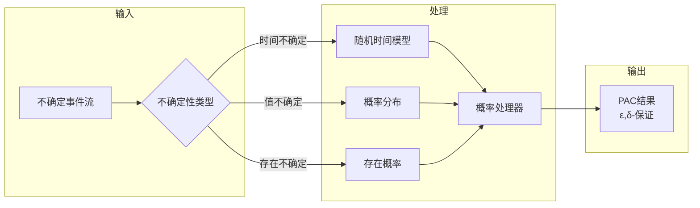

# 概率流处理形式化语义

> **所属阶段**: Struct/06-frontier/probabilistic-streaming | **前置依赖**: [01.01-unified-streaming-theory.md](../../01-foundation/01.01-unified-streaming-theory.md), [02.01-determinism-in-streaming.md](../../02-properties/02.01-determinism-in-streaming.md) | **形式化等级**: L5-L6
> **文档状态**: v1.0 | **创建日期**: 2026-04-13

---

## 目录

- [概率流处理形式化语义](#概率流处理形式化语义)
  - [目录](#目录)
  - [1. 概念定义 (Definitions)](#1-概念定义-definitions)
    - [Def-S-06-PS-01: 概率事件流](#def-s-06-ps-01-概率事件流)
    - [Def-S-06-PS-02: 随机处理器](#def-s-06-ps-02-随机处理器)
    - [Def-S-06-PS-03: 概率时间模型](#def-s-06-ps-03-概率时间模型)
    - [Def-S-06-PS-04: 近似正确性语义 (PAC)](#def-s-06-ps-04-近似正确性语义-pac)
  - [2. 属性推导 (Properties)](#2-属性推导-properties)
    - [Prop-S-06-PS-01: 概率Watermark单调性](#prop-s-06-ps-01-概率watermark单调性)
    - [Prop-S-06-PS-02: 随机近似一致性](#prop-s-06-ps-02-随机近似一致性)
  - [3. 关系建立 (Relations)](#3-关系建立-relations)
    - [关系: 概率流与确定性流的嵌入](#关系-概率流与确定性流的嵌入)
    - [关系: 采样定理与流处理](#关系-采样定理与流处理)
  - [4. 论证过程 (Argumentation)](#4-论证过程-argumentation)
    - [论证: 近似正确性的实用价值](#论证-近似正确性的实用价值)
    - [论证: 随机化与性能权衡](#论证-随机化与性能权衡)
  - [5. 形式证明 (Proofs)](#5-形式证明-proofs)
    - [Thm-S-06-PS-01: 概率Checkpoint正确性](#thm-s-06-ps-01-概率checkpoint正确性)
    - [Thm-S-06-PS-02: 采样聚合的误差边界](#thm-s-06-ps-02-采样聚合的误差边界)
  - [6. 实例验证 (Examples)](#6-实例验证-examples)
    - [示例1: 近似计数 (HyperLogLog)](#示例1-近似计数-hyperloglog)
    - [示例2: 随机抽样窗口](#示例2-随机抽样窗口)
    - [示例3: 蒙特卡洛流分析](#示例3-蒙特卡洛流分析)
  - [7. 可视化 (Visualizations)](#7-可视化-visualizations)
    - [概率流处理架构](#概率流处理架构)
    - [精度-资源权衡曲线](#精度-资源权衡曲线)
  - [8. 引用参考 (References)](#8-引用参考-references)

---

## 1. 概念定义 (Definitions)

### Def-S-06-PS-01: 概率事件流

**定义 (概率事件流)**:

概率事件流是带有不确定性度量的流数据抽象：

$$
\mathcal{S}_{prob} ::= (T, V, P, \mathcal{D})
$$

| 组件 | 类型 | 语义 |
|------|------|------|
| $T$ | $\mathbb{R}^+$ | 时间戳（可以是随机变量） |
| $V$ | $\mathcal{V}$ | 值域（可带概率分布） |
| $P$ | $[0,1]$ | 事件置信度/存在概率 |
| $\mathcal{D}$ | $Distribution$ | 值的概率分布 |

**概率流表示**:

对于时间$t$的流状态：

$$
\mathcal{S}(t) = \{(v_i, p_i, \sigma_i) | v_i \in V, p_i \in [0,1], \sigma_i \sim \mathcal{D}_i\}
$$

其中$p_i$表示该事件存在的概率，$\sigma_i$表示值的不确定性。

**不确定性传播**:

对于处理器$f: \mathcal{S}_{in} \to \mathcal{S}_{out}$：

$$
P_{out}(y) = \int_{x \in f^{-1}(y)} P_{in}(x) \cdot J_f(x) \, dx
$$

其中$J_f$为$f$的雅可比行列式（对于可微变换）。

---

### Def-S-06-PS-02: 随机处理器

**定义 (随机处理器)**:

随机处理器是带有内部随机性的计算单元：

$$
\mathcal{P}_{rand} ::= (f_{det}, \xi, \Omega, \Rightarrow_p)
$$

其中：

- $f_{det}$: 确定性计算核
- $\xi \sim \Omega$: 随机种子/噪声源
- $\Rightarrow_p$: 概率转移关系

**概率转移语义**:

$$
\frac{s \xrightarrow{\xi} s' \quad \xi \sim \Omega}{s \Rightarrow_p s'} \quad \text{where } p = \mathbb{P}(\xi)
$$

**处理器类型**:

```
RandomProcessor
├── MonteCarloSampler    # 蒙特卡洛采样
├── SketchAggregator     # 概率草图聚合
├── RandomizedAlgorithm  # 随机算法 (如 reservoir sampling)
└── ProbabilisticML      # 概率机器学习推理
```

---

### Def-S-06-PS-03: 概率时间模型

**定义 (随机时间)**:

在概率流处理中，时间戳可以是随机变量：

$$
\tau: \Omega \to \mathbb{R}^+
$$

**到达过程模型**:

- **泊松过程**: $N(t) \sim Poisson(\lambda t)$
- **复合泊松**: 批量到达
- **更新过程**: 一般间隔分布
- **马尔可夫调制**: 速率随状态变化

**Watermark的随机扩展**:

$$
\mathcal{W}(t) = \min(\tau_{observed}) - \epsilon_{confidence}
$$

其中$\epsilon_{confidence}$是考虑不确定性的安全余量：

$$
\epsilon = F^{-1}_{\tau}(1 - \delta)
$$

$F^{-1}$为分位函数，$\delta$为迟到事件概率上界。

---

### Def-S-06-PS-04: 近似正确性语义 (PAC)

**定义 (PAC流处理)**:

Probably Approximately Correct (PAC) 语义为流处理结果提供概率保证：

$$
\mathbb{P}(|Result_{approx} - Result_{true}| \leq \epsilon) \geq 1 - \delta
$$

**参数说明**:

- $\epsilon$: 近似误差上界
- $\delta$: 失败概率上界
- $1-\delta$: 置信度

**扩展到流处理**:

对于流查询$Q$在时间窗口$W$上的结果：

$$
\forall t. \; \mathbb{P}(|\hat{Q}(\mathcal{S}_{[t-W,t]}) - Q(\mathcal{S}_{[t-W,t]})| \leq \epsilon) \geq 1 - \delta
$$

**资源-精度权衡**:

$$
Cost \propto \frac{1}{\epsilon^2} \log\frac{1}{\delta}
$$

---

## 2. 属性推导 (Properties)

### Prop-S-06-PS-01: 概率Watermark单调性

**命题**: 在概率时间模型下，Watermark以高概率保持单调：

$$
\mathbb{P}(\mathcal{W}(t_2) \geq \mathcal{W}(t_1)) \geq 1 - \delta, \quad \forall t_2 > t_1
$$

**证明概要**:

1. 设事件到达时间$\tau_i \sim F$
2. Watermark更新: $\mathcal{W}(t) = g(\{\tau_i | \tau_i \leq t\})$
3. 对于泊松到达，$\mathcal{W}$几乎必然单调
4. 对于一般分布，通过选择$\epsilon$控制违反概率

---

### Prop-S-06-PS-02: 随机近似一致性

**命题**: 使用Sketch数据结构（如Count-Min, HyperLogLog）的聚合满足PAC保证。

**形式化**:

对于Count-Min Sketch估计频率$\hat{f}$和真实频率$f$：

$$
\mathbb{P}(\hat{f} \leq f + \epsilon \|f\|_1) \geq 1 - \delta
$$

**推导**:

- 空间复杂度: $O(\frac{1}{\epsilon} \log\frac{1}{\delta})$
- 更新复杂度: $O(\log\frac{1}{\delta})$
- 查询复杂度: $O(\log\frac{1}{\delta})$

---

## 3. 关系建立 (Relations)

### 关系: 概率流与确定性流的嵌入

```
确定性流 (S_det)
       ↓ 嵌入
概率流 (S_prob)
       ↓ 投影 (期望)
确定性近似 (E[S_prob])
```

**形式映射**:

$$
\Phi: \mathcal{S}_{det} \hookrightarrow \mathcal{S}_{prob}, \quad \Phi(s) = (s, 1, \delta_s)
$$

$$
\Psi: \mathcal{S}_{prob} \twoheadrightarrow \mathcal{S}_{det}, \quad \Psi(s_{prob}) = \mathbb{E}[V]
$$

---

### 关系: 采样定理与流处理

**Nyquist-Shannon采样定理在流处理中的扩展**:

对于带宽受限的流信号（事件率有上界$\lambda_{max}$）：

$$
SampleRate \geq 2\lambda_{max}
$$

可以保证完全重建原始流。

**实用采样策略**:

| 策略 | 保证 | 适用场景 |
|------|------|---------|
| 均匀采样 | 无偏估计 | 统计特征 |
| 分层采样 | 子群保证 | 多租户 |
| 水库采样 | 无偏子集 | 有限存储 |
| 优先级采样 | 重要事件优先 | 异常检测 |

---

## 4. 论证过程 (Argumentation)

### 论证: 近似正确性的实用价值

**问题**: 为什么可以接受$(\epsilon, \delta)$-近似结果？

**论证**:

1. **业务容忍度**: 多数业务场景对1-5%误差可接受
2. **成本收益**: 近似算法可将资源降低10-100x
3. **实时性**: 精确算法可能无法在时限内完成
4. **噪声固有**: 输入数据本身带有不确定性

**决策框架**:

```
IF (误差成本 < 计算成本 savings) AND (业务可接受)
THEN 使用近似算法
ELSE 使用精确算法
```

---

### 论证: 随机化与性能权衡

**随机化算法的优势**:

| 算法 | 确定性 | 随机化 | 加速比 |
|------|--------|--------|--------|
| 计数 | HashMap | Count-Min | 100x空间 |
| 基数 | Set | HyperLogLog | 1000x空间 |
| 分位数 | Sort | t-Digest | 50x时间 |
| 采样 | 全量 | Reservoir | 无界→固定 |

---

## 5. 形式证明 (Proofs)

### Thm-S-06-PS-01: 概率Checkpoint正确性

**定理**: 概率Checkpoint协议以概率$1-\delta$保证状态一致性。

**协议描述**:

1. 以概率$p$采样状态记录
2. 构建近似状态快照
3. 恢复时重建估计状态

**证明**:

设真实状态$S$，采样状态$\hat{S}$：

由Chernoff界：

$$
\mathbb{P}(|\hat{S} - S| > \epsilon S) < 2e^{-2\epsilon^2 n}
$$

令$\delta = 2e^{-2\epsilon^2 n}$，解得：

$$
n = \frac{\ln(2/\delta)}{2\epsilon^2}
$$

因此，以概率$1-\delta$，恢复状态满足$(1-\epsilon)S \leq \hat{S} \leq (1+\epsilon)S$。

$\square$

---

### Thm-S-06-PS-02: 采样聚合的误差边界

**定理**: 对于均匀采样率$p$的聚合查询，相对误差以高概率有界。

**证明**:

设总记录数$N$，采样数$n = pN$，真实聚合$A = \sum_{i=1}^N x_i$。

估计量$\hat{A} = \frac{1}{p} \sum_{j=1}^n x_j$。

由中心极限定理：

$$
\hat{A} \sim \mathcal{N}(A, \frac{\sigma^2}{p^2 n}) = \mathcal{N}(A, \frac{\sigma^2}{p N})
$$

因此：

$$
\mathbb{P}\left(\frac{|\hat{A} - A|}{A} \leq \epsilon\right) \approx 2\Phi\left(\frac{\epsilon A \sqrt{pN}}{\sigma}\right) - 1
$$

对于大$N$，误差以$O(1/\sqrt{pN})$速度收敛。

$\square$

---

## 6. 实例验证 (Examples)

### 示例1: 近似计数 (HyperLogLog)

**场景**: 实时UV统计，日活千万级

**精确方案**: HashSet → 内存爆炸

**HLL方案**:

- 空间: 12KB vs GB+
- 误差: 2.3% (标准配置)
- 时间: O(1)更新

**形式保证**:

$$
\mathbb{P}(|HLL - true| \leq 1.04/\sqrt{m}) \geq 0.99
$$

其中$m=2^{precision}$为桶数。

---

### 示例2: 随机抽样窗口

**场景**: 大窗口聚合，内存受限

**水库采样**:

```
算法: 维护大小为k的样本集
对于第i个元素 (i > k):
  以概率k/i替换随机样本
保证: 每个元素被采样概率 = k/n
```

**形式保证**: 无偏估计，方差可计算

---

### 示例3: 蒙特卡洛流分析

**场景**: 复杂查询（如多维度JOIN）的近似

**方法**:

1. 随机采样输入流子集
2. 在样本上执行查询
3. 外推到总体

**误差控制**:

- 增加样本量降低方差
- 分层采样减少偏差

---

## 7. 可视化 (Visualizations)

### 概率流处理架构



### 精度-资源权衡曲线

```mermaid
graph
    y轴[资源使用]
    x轴[相对误差 ε]

    精确算法[(精确算法<br/>O(1/ε))]
    近似算法[(近似算法<br/>O(log(1/ε)))]

    精确算法 -->|高成本| A[ε=0, 资源=∞]
    近似算法 -->|高效| B[ε=0.01, 资源=1x]
    近似算法 -->|平衡| C[ε=0.05, 资源=0.1x]
```

---

## 8. 引用参考 (References)


---

**关联文档**:

- [统一流计算理论](../../01-foundation/01.01-unified-streaming-theory.md)
- [流计算确定性](../../02-properties/02.01-determinism-in-streaming.md)
- [差分隐私流处理](../../02-properties/02.08-differential-privacy-streaming.md)
