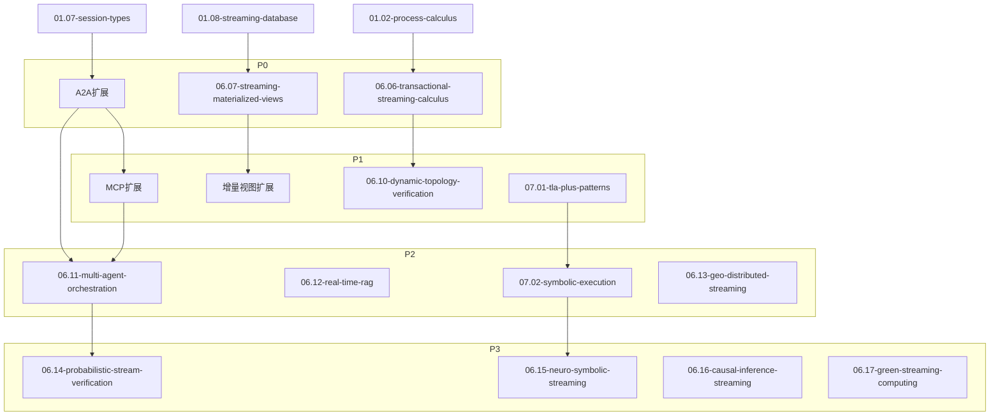

> **状态**: 🔮 前瞻内容 | **风险等级**: 高 | **最后更新**: 2026-04
> 
> 此文档描述的内容处于早期规划阶段，可能与最终实现不符。请以 Apache Flink 官方发布为准。
# 项目补充建议实施计划

> **所属阶段**: Struct/06-frontier | **前置依赖**: [academic-frontier-2024-2026.md](./academic-frontier-2024-2026.md), [research-trends-analysis-2024-2026.md](./research-trends-analysis-2024-2026.md) | **形式化等级**: L3-L5
> **版本**: 2026.04 | **优先级**: P0-P3

---

## 目录

- [项目补充建议实施计划](#项目补充建议实施计划)
  - [目录](#目录)
  - [执行摘要](#执行摘要)
  - [P0 - 立即执行（本月内）](#p0--立即执行本月内)
    - [P0-1: 事务性流处理进程演算](#p0-1-事务性流处理进程演算)
    - [P0-2: A2A协议形式化映射](#p0-2-a2a协议形式化映射)
    - [P0-3: 流物化视图基础理论](#p0-3-流物化视图基础理论)
  - [P1 - 短期计划（1-3个月）](#p1--短期计划1-3个月)
    - [P1-1: MCP协议流算子语义](#p1-1-mcp协议流算子语义)
    - [P1-2: 增量视图维护正确性定理](#p1-2-增量视图维护正确性定理)
    - [P1-3: 动态拓扑验证框架](#p1-3-动态拓扑验证框架)
    - [P1-4: TLA+模式库建设](#p1-4-tla模式库建设)
  - [P2 - 中期计划（3-6个月）](#p2--中期计划3-6个月)
    - [P2-1: 多Agent协作形式化](#p2-1-多agent协作形式化)
    - [P2-2: 实时RAG形式化模型](#p2-2-实时rag形式化模型)
    - [P2-3: 符号执行语义框架](#p2-3-符号执行语义框架)
    - [P2-4: 地理分布式流处理优化](#p2-4-地理分布式流处理优化)
  - [P3 - 长期计划（6-12个月）](#p3--长期计划6-12个月)
    - [P3-1: 概率流验证理论](#p3-1-概率流验证理论)
    - [P3-2: 神经符号流框架](#p3-2-神经符号流框架)
    - [P3-3: 因果推断流理论](#p3-3-因果推断流理论)
    - [P3-4: 绿色流计算形式化](#p3-4-绿色流计算形式化)
  - [资源需求与依赖关系](#资源需求与依赖关系)
    - [文档依赖图](#文档依赖图)
    - [形式化元素统计](#形式化元素统计)
  - [验收标准](#验收标准)
    - [整体项目验收标准](#整体项目验收标准)
    - [单文档验收检查清单](#单文档验收检查清单)
  - [风险与缓解策略](#风险与缓解策略)

---

## 执行摘要

基于对2024-2026年流计算学术前沿的综述分析，本项目提出以下补充建议：

**核心补充领域**:

1. **AI Agent-流融合** (P0-P1): 建立A2A/MCP协议的形式化映射
2. **事务性流处理** (P0): 建立进程演算与ACID形式化理论
3. **流-数据库统一** (P0-P1): 引入延迟视图语义与流物化视图理论
4. **形式化验证工程化** (P1-P2): 建设TLA+模式库与符号执行框架

**新增文档计划**: 13篇核心文档

**新增形式化元素预期**:

- 定理 (Thm): 15-20个
- 定义 (Def): 25-30个
- 引理 (Lemma): 10-15个
- 命题 (Prop): 8-10个

---

## P0 - 立即执行（本月内）

### P0-1: 事务性流处理进程演算

**文档**: `06.06-transactional-streaming-calculus.md`

**目标**: 建立事务性流处理的形式化基础，定义TSP-Calculus

**内容大纲**:

```markdown
1. 概念定义
   - Def-S-26-01: 事务性流处理演算 (TSP-Calculus)
   - Def-S-26-02: 流事务边界 (Stream Transaction Boundary)
   - Def-S-26-03: 事务性算子 (Transactional Operator)

2. 属性推导
   - Lemma-S-26-01: 事务原子性的组合保持性
   - Lemma-S-26-02: Checkpoint与事务边界对齐条件

3. 关系建立
   - TSP-Calculus ↔ π-calculus扩展
   - TSP-Calculus ↔ Dataflow模型映射

4. 形式证明
   - Thm-S-26-01: 流事务可串行化定理
   - Thm-S-26-02: Exactly-Once与可串行化等价条件

5. 实例验证
   - Flink Two-Phase Commit事务Sink的TSP建模
   - Kafka Transactions的形式化分析
```

**依赖**: [01.02-process-calculus-primer.md](../01-foundation/01.02-process-calculus-primer.md)

**预期工作量**: 3-4天

**验收标准**:

- [ ] TSP-Calculus语法与操作语义完整定义
- [ ] 至少2个定理的完整证明
- [ ] 至少1个工业系统实例的形式化建模

---

### P0-2: A2A协议形式化映射

**文档**: 扩展 [06.05-ai-agent-streaming-formalization.md](./06.05-ai-agent-streaming-formalization.md)

**目标**: 将Google A2A协议映射为多参与方会话类型

**内容大纲**:

```markdown
新增章节: A2A协议的形式化映射

1. A2A会话类型编码
   - Def-S-26-06: A2A会话类型 (A2A Session Type)
   - Task发送/接收的类型表示
   - Streaming Update的类型表示
   - Artifact交换的类型表示

2. A2A全局类型
   - G_A2A的完整定义
   - 任务生命周期会话类型
   - 多Agent协作会话类型

3. 类型安全定理
   - Thm-A2A-01: A2A协议类型安全
   - Thm-A2A-02: 投影后局部类型的合流性

4. 与流计算的映射
   - A2A消息 ↔ 流事件
   - A2A任务 ↔ 流处理算子链
```

**依赖**: [06.03-ai-agent-session-types.md](./06.03-ai-agent-session-types.md), [01.07-session-types.md](../01-foundation/01.07-session-types.md)

**预期工作量**: 2-3天

**验收标准**:

- [ ] A2A核心原语的会话类型编码
- [ ] 类型安全定理陈述
- [ ] A2A到流计算的映射示例

---

### P0-3: 流物化视图基础理论

**文档**: `06.07-streaming-materialized-views.md`

**目标**: 建立流物化视图的形式化理论，引入延迟视图语义

**内容大纲**:

```markdown
1. 概念定义
   - Def-S-26-02: 流物化视图 (Streaming Materialized View)
   - Def-S-26-03: 延迟视图语义 (Delayed View Semantics, DVS)
   - Def-S-26-09: 视图新鲜度 (View Freshness)
   - Def-S-26-10: Changelog语义 (Changelog Semantics)

2. 属性推导
   - Lemma-S-26-03: 增量更新的完备性
   - Lemma-S-26-04: DVS与传统视图语义的一致性

3. 关系建立
   - 流物化视图 ↔ 数据库物化视图
   - Changelog ↔ WAL映射

4. 形式证明
   - Thm-S-26-02: 增量视图维护正确性定理
   - Thm-S-26-03: 连续查询与批查询等价性定理

5. 实例验证
   - Materialize的Differential Dataflow建模
   - Flink SQL Continuous Query的物化视图分析
```

**依赖**: [01.08-streaming-database-formalization.md](../01-foundation/01.08-streaming-database-formalization.md)

**预期工作量**: 3-4天

**验收标准**:

- [ ] DVS形式化定义
- [ ] 增量维护正确性定理
- [ ] 至少1个流数据库系统的分析

---

## P1 - 短期计划（1-3个月）

### P1-1: MCP协议流算子语义

**文档**: 扩展 [06.05-ai-agent-streaming-formalization.md](./06.05-ai-agent-streaming-formalization.md)

**目标**: 将Anthropic MCP协议映射为流计算算子

**内容大纲**:

```markdown
新增章节: MCP协议的流算子语义

1. MCP组件的流算子映射
   - Resources ↔ Broadcast Stream
   - Tools ↔ AsyncFunction
   - Prompts ↔ MapFunction
   - Sampling ↔ CoProcessFunction

2. MCP上下文流的Dataflow图
   - 完整MCP数据流图
   - 上下文注入与查询处理

3. MCP协议的正确性
   - 工具调用的活性保证
   - 资源访问的一致性

4. 与A2A协议的集成
   - A2A + MCP的联合语义
   - 多协议Agent系统的形式化
```

**预期工作量**: 2-3天

**验收标准**:

- [ ] MCP核心组件的流算子映射表
- [ ] MCP上下文流Dataflow图
- [ ] 工具调用活性分析

---

### P1-2: 增量视图维护正确性定理

**文档**: 扩展 `06.07-streaming-materialized-views.md`

**目标**: 证明增量视图维护的正确性条件

**内容大纲**:

```markdown
新增章节: 增量视图维护的形式化证明

1. 问题陈述
   - 完整视图计算: V = Q(D)
   - 增量更新: ΔV = f(ΔD, V_old)
   - 正确性条件定义

2. 增量维护的完备性
   - Lemma-S-26-05: 变更捕获完备性
   - Lemma-S-26-06: 更新传播完备性

3. 增量维护的一致性
   - Thm-S-26-04: 增量更新与重新计算等价性
   - 证明: 基于归纳法

4. 流式增量维护的特殊性
   - 乱序事件的处理
   - Retraction机制的正确性
   - Watermark与视图一致性
```

**预期工作量**: 3-4天

**验收标准**:

- [ ] 增量维护正确性定理的完整证明
- [ ] Retraction机制的形式化分析
- [ ] 乱序场景下的正确性保证

---

### P1-3: 动态拓扑验证框架

**文档**: `06.10-dynamic-topology-verification.md`

**目标**: 建立运行时动态拓扑变化的形式化验证框架

**内容大纲**:

```markdown
1. 概念定义
   - Def-S-26-04: 动态拓扑迁移 (Dynamic Topology Migration)
   - Def-S-26-11: 状态重分区 (State Repartitioning)
   - Def-S-26-12: 在线重新并行化 (Online Rescaling)

2. 属性推导
   - Lemma-S-26-07: 状态迁移的单调性
   - Lemma-S-26-08: 分区键一致性保持

3. 形式证明
   - Thm-S-26-05: 动态拓扑下Exactly-Once保持定理
   - Thm-S-26-06: 状态迁移一致性定理

4. 验证方法
   - 模型检验方法
   - 运行时监控方法
   - 测试生成方法

5. 实例验证
   - Flink Rescaling的形式化分析
   - Kafka Streams重新分区的验证
```

**依赖**: [06.01-open-problems-streaming-verification.md](./06.01-open-problems-streaming-verification.md)

**预期工作量**: 4-5天

**验收标准**:

- [ ] 动态拓扑迁移的形式化定义
- [ ] 至少2个核心定理的完整证明
- [ ] 验证方法对比分析

---

### P1-4: TLA+模式库建设

**文档**: `07.01-tla-plus-patterns-for-streaming.md`

**目标**: 建立流处理系统的TLA+规范模式库

**内容大纲**:

```markdown
1. 基础模式
   - 有状态算子模式
   - 窗口操作模式
   - Checkpoint协议模式

2. 一致性模式
   - Exactly-Once模式
   - 事务性Sink模式
   - 分布式快照模式

3. 时间模式
   - Watermark推进模式
   - 事件时间处理模式
   - 乱序事件处理模式

4. 故障处理模式
   - 故障检测模式
   - 状态恢复模式
   - 容错重放模式

5. 验证案例
   - Flink Checkpoint协议的TLA+规范
   - 窗口触发器的TLA+规范
   - 端到端Exactly-Once的TLA+规范
```

**预期工作量**: 5-7天

**验收标准**:

- [ ] 至少10个TLA+模式定义
- [ ] 至少3个完整的验证案例
- [ ] 模式应用指南

---

## P2 - 中期计划（3-6个月）

### P2-1: 多Agent协作形式化

**文档**: `06.11-multi-agent-orchestration.md`

**目标**: 建立多Agent协作的流编排形式化理论

**内容大纲**:

```markdown
1. 概念定义
   - Def-S-26-13: 多Agent系统 (Multi-Agent System)
   - Def-S-26-14: Agent编排图 (Agent Orchestration Graph)
   - Def-S-26-15: 协作会话类型 (Collaborative Session Type)

2. 属性推导
   - Lemma-S-26-09: 多Agent系统的活性条件
   - Lemma-S-26-10: 协作协议的公平性

3. 形式证明
   - Thm-S-26-07: 多Agent协作活性定理
   - Thm-S-26-08: 协作安全性定理

4. 编排模式
   - 顺序编排模式
   - 并行编排模式
   - 条件分支模式
   - 循环反馈模式

5. 实例验证
   - DevAgent + TestAgent + DeployAgent协作
   - 客户服务多Agent系统
```

**依赖**: P0-2 (A2A协议形式化)

**预期工作量**: 4-5天

**验收标准**:

- [ ] 多Agent协作的形式化定义
- [ ] 至少2个编排定理的完整证明
- [ ] 至少2个协作模式的实例

---

### P2-2: 实时RAG形式化模型

**文档**: `06.12-real-time-rag-formalization.md`

**目标**: 建立实时检索增强生成的流式架构形式化模型

**内容大纲**:

```markdown
1. 概念定义
   - Def-S-26-16: 实时RAG流 (Real-time RAG Stream)
   - Def-S-26-17: 文档嵌入流 (Document Embedding Stream)
   - Def-S-26-18: 向量索引流 (Vector Index Stream)

2. 属性推导
   - Lemma-S-26-11: 嵌入一致性
   - Lemma-S-26-12: 检索相关性保证

3. 形式证明
   - Thm-S-26-09: 实时RAG结果一致性定理
   - Thm-S-26-10: 索引更新与查询的一致性

4. 架构模式
   - 文档流处理模式
   - 查询-索引Join模式
   - 增量向量更新模式

5. 实例验证
   - 实时文档问答系统
   - 流式知识库更新
```

**预期工作量**: 3-4天

**验收标准**:

- [ ] 实时RAG的形式化模型
- [ ] 一致性定理的完整证明
- [ ] 至少1个完整架构实例

---

### P2-3: 符号执行语义框架

**文档**: `07.02-symbolic-execution-for-streaming.md`

**目标**: 建立流处理算子的符号执行形式化框架

**内容大纲**:

```markdown
1. 概念定义
   - Def-S-26-19: 符号流 (Symbolic Stream)
   - Def-S-26-20: 符号状态 (Symbolic State)
   - Def-S-26-21: 路径约束 (Path Constraint)

2. 符号执行规则
   - Source算子的符号语义
   - Map算子的符号语义
   - Filter算子的符号语义
   - Window算子的符号语义
   - Join算子的符号语义

3. 状态后端符号建模
   - MemoryStateBackend符号模型
   - RocksDBStateBackend符号模型
   - IncrementalCheckpoint符号模型

4. 验证应用
   - 死代码检测
   - 不变式验证
   - 路径覆盖分析

5. 与Flink集成
   - Flink Symbolic Executor架构
   - 实际应用案例
```

**预期工作量**: 5-7天

**验收标准**:

- [ ] 核心算子的符号执行规则
- [ ] 状态后端符号模型
- [ ] 至少2个验证应用案例

---

### P2-4: 地理分布式流处理优化

**文档**: `06.13-geo-distributed-streaming.md`

**目标**: 建立地理分布式流处理的形式化优化模型

**内容大纲**:

```markdown
1. 概念定义
   - Def-S-26-07: 地理分布式算子放置 (Geo-Distributed Operator Placement)
   - Def-S-26-22: 网络拓扑感知 (Network Topology Awareness)
   - Def-S-26-23: 延迟约束 (Latency Constraint)

2. 优化问题形式化
   - 最小化跨数据中心网络传输
   - 满足端到端延迟约束
   - 负载均衡优化

3. 形式证明
   - Thm-S-26-11: 聚合函数放置最优性定理
   - Thm-S-26-12: 延迟约束可满足性判定

4. 放置算法
   - 启发式放置算法
   - 最优放置的近似算法
   - 动态放置调整

5. 实例验证
   - 全球分布式日志分析
   - 跨云流处理架构
```

**预期工作量**: 4-5天

**验收标准**:

- [ ] 优化问题的形式化定义
- [ ] 至少2个最优性定理
- [ ] 放置算法对比分析

---

## P3 - 长期计划（6-12个月）

### P3-1: 概率流验证理论

**文档**: `06.14-probabilistic-stream-verification.md`

**目标**: 建立概率性流处理的形式化验证理论

**内容大纲**:

```markdown
1. 概念定义
   - Def-S-26-24: 概率流 (Probabilistic Stream)
   - Def-S-26-25: 概率算子 (Probabilistic Operator)
   - Def-S-26-26: 置信度约束 (Confidence Constraint)

2. 概率模型
   - 马尔可夫决策过程(MDP)建模
   - 概率时间自动机(PTA)建模

3. 验证方法
   - 概率模型检验(PMC)
   - 统计模型检验(SMC)
   - 蒙特卡洛方法

4. 应用场景
   - LLM输出不确定性的处理
   - 传感器数据噪声建模
   - 近似计算的正确性保证

5. 工具集成
   - PRISM工具的应用
   - Storm工具的应用
```

**预期工作量**: 7-10天

**验收标准**:

- [ ] 概率流的形式化定义
- [ ] 概率验证方法的系统化整理
- [ ] 至少2个应用场景分析

---

### P3-2: 神经符号流框架

**文档**: `06.15-neuro-symbolic-streaming.md`

**目标**: 建立神经符号混合流处理的形式化框架

**内容大纲**:

```markdown
1. 概念定义
   - Def-S-26-27: 神经符号算子 (Neuro-Symbolic Operator)
   - Def-S-26-28: 感知层 (Perception Layer)
   - Def-S-26-29: 推理层 (Reasoning Layer)

2. 架构模式
   - 神经网络处理原始数据
   - 符号推理处理结构化知识
   - 流式神经符号管道

3. 验证挑战
   - 神经网络的可解释性
   - 神经-符号接口的正确性
   - 端到端正确性保证

4. 应用案例
   - 视频流中的对象检测与推理
   - 自然语言流的语义解析
```

**预期工作量**: 6-8天

**验收标准**:

- [ ] 神经符号流的形式化定义
- [ ] 架构模式的系统化整理
- [ ] 验证挑战的深入分析

---

### P3-3: 因果推断流理论

**文档**: `06.16-causal-inference-streaming.md`

**目标**: 建立流数据因果推断的形式化理论

**内容大纲**:

```markdown
1. 概念定义
   - Def-S-26-30: 流因果图 (Streaming Causal Graph)
   - Def-S-26-31: 实时因果效应 (Real-time Causal Effect)
   - Def-S-26-32: 反事实流查询 (Counterfactual Stream Query)

2. 因果发现
   - 流数据上的因果发现算法
   - 增量因果图更新
   - 因果关系的稳定性检验

3. 因果效应估计
   - 实时平均处理效应(ATE)估计
   - 条件平均处理效应(CATE)估计
   - 置信区间计算

4. 形式化保证
   - 因果发现的一致性
   - 效应估计的无偏性
   - 计算复杂度分析
```

**预期工作量**: 8-10天

**验收标准**:

- [ ] 流因果推断的形式化框架
- [ ] 算法的正确性分析
- [ ] 复杂度分析

---

### P3-4: 绿色流计算形式化

**文档**: `06.17-green-streaming-computing.md`

**目标**: 建立能耗优化的流计算形式化模型

**内容大纲**:

```markdown
1. 概念定义
   - Def-S-26-33: 能耗模型 (Energy Consumption Model)
   - Def-S-26-34: 碳足迹度量 (Carbon Footprint Metric)
   - Def-S-26-35: 绿色调度 (Green Scheduling)

2. 优化目标
   - 最小化能耗
   - 最小化碳排放
   - 性能-能耗权衡

3. 调度策略
   - 碳感知调度
   - 动态频率调整
   - 负载聚合优化

4. 形式化保证
   - 能耗上界分析
   - 性能下界保证
   - 权衡曲线的Pareto最优性
```

**预期工作量**: 5-6天

**验收标准**:

- [ ] 能耗模型的形式化定义
- [ ] 调度策略的形式化分析
- [ ] 权衡分析

---

## 资源需求与依赖关系

### 文档依赖图



### 形式化元素统计

| 优先级 | 新增文档 | 预期Thm | 预期Def | 预期Lemma | 预期Prop |
|--------|----------|---------|---------|-----------|----------|
| P0 | 3篇 | 4-5 | 8-10 | 3-4 | 2-3 |
| P1 | 4篇 | 5-6 | 8-10 | 4-5 | 3-4 |
| P2 | 4篇 | 4-5 | 6-8 | 2-3 | 2-3 |
| P3 | 4篇 | 3-4 | 5-6 | 2-3 | 1-2 |
| **总计** | **15篇** | **16-20** | **27-34** | **11-15** | **8-12** |

---

## 验收标准

### 整体项目验收标准

1. **完整性**: 所有P0/P1任务完成，P2任务完成50%以上
2. **形式化质量**: 每个新增定理都有完整证明或证明草图
3. **文档质量**: 遵循项目六段式模板规范
4. **交叉引用**: 新增文档与现有文档建立适当的交叉引用
5. **可视化**: 每个新增文档包含至少2个Mermaid图表

### 单文档验收检查清单

- [ ] 文档遵循六段式结构
- [ ] 包含至少3个形式化定义(Def)
- [ ] 包含至少1个定理(Thm)或引理(Lemma)
- [ ] 包含至少2个Mermaid可视化
- [ ] 包含至少1个实例验证
- [ ] 引用格式符合规范[^n]
- [ ] 文档末尾包含关联文档表格
- [ ] 元数据（所属阶段、前置依赖、形式化等级）完整

---

## 风险与缓解策略

| 风险 | 影响 | 可能性 | 缓解策略 |
|------|------|--------|----------|
| A2A/MCP协议快速演进 | 高 | 高 | 采用版本化文档，标注协议版本号；关注官方更新 |
| 学术研究进展超预期 | 中 | 中 | 建立季度审查机制，动态调整优先级 |
| 形式化证明复杂度超预期 | 高 | 中 | 采用分层证明策略；先给出证明草图再完善 |
| 资源不足（时间/人力） | 高 | 中 | 优先保证P0/P1；P3任务可根据情况调整 |
| 与现有文档冲突 | 中 | 低 | 编写前仔细审查现有文档；建立文档间一致性检查 |

---

**文档创建时间**: 2026-04-09

**最后更新**: 2026-04-09

**维护者**: AnalysisDataFlow 项目

**状态**: Active - 实施计划
