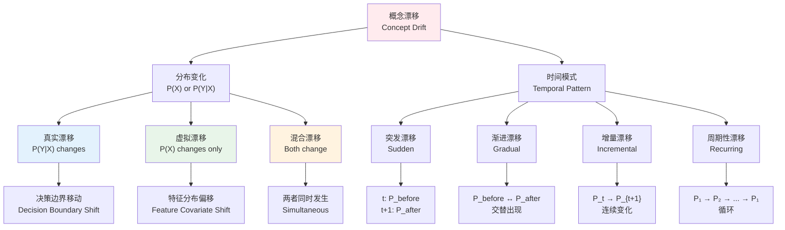
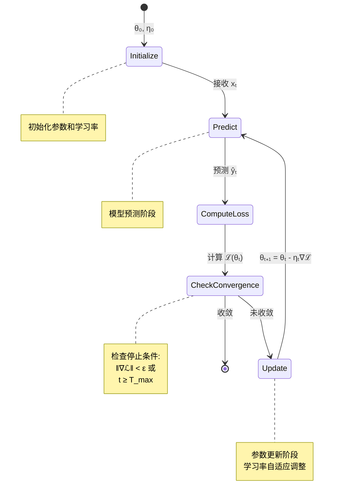
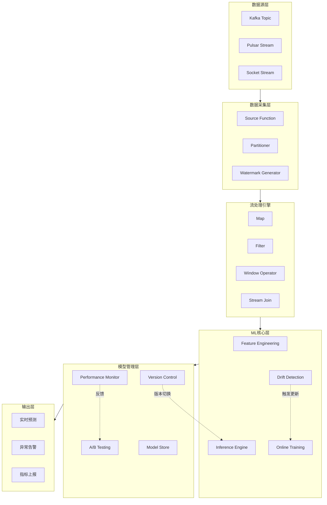
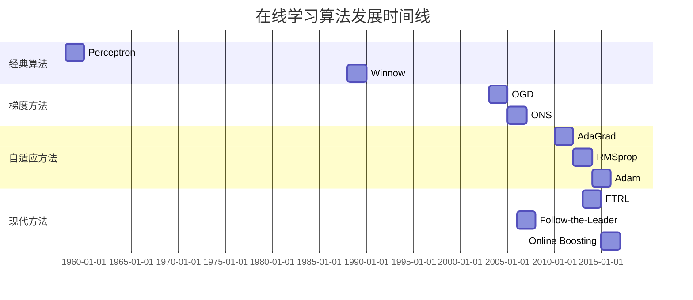
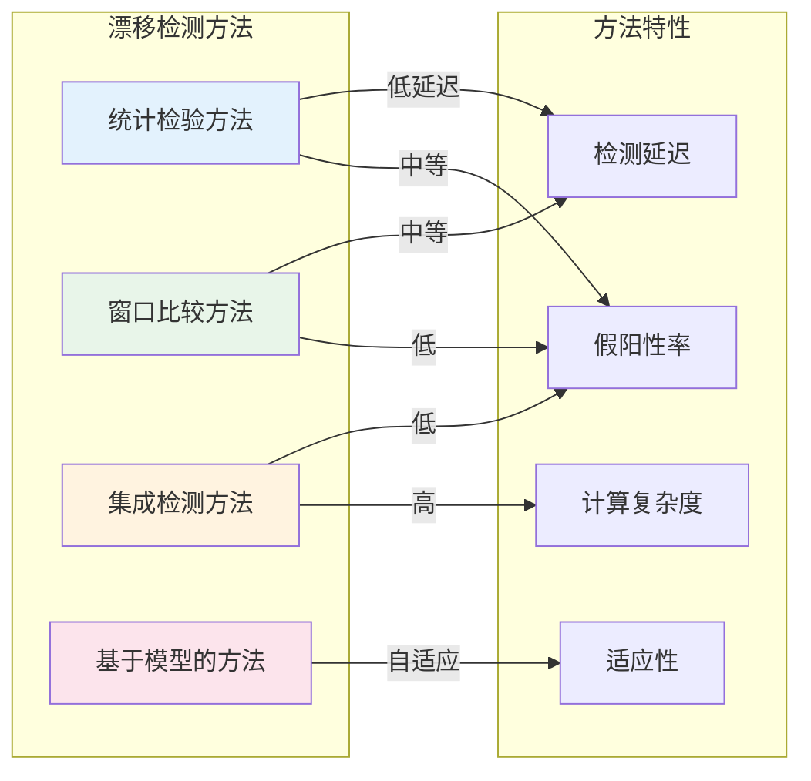
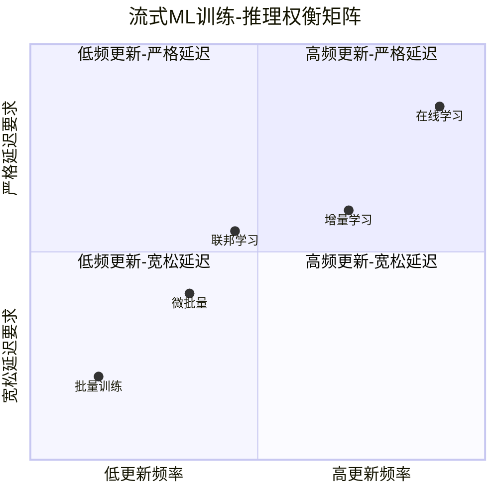

# 流式机器学习形式化理论 (Streaming Machine Learning Formal Theory)

> 所属阶段: Struct/ | 前置依赖: [time-semantics.md](../../Knowledge/01-concept-atlas/01.02-time-semantics.md), [Struct/00-INDEX.md](../../Struct/00-INDEX.md) | 形式化等级: L5 (严格数学形式化)

---

## 1. 概念定义 (Definitions)

### 1.1 流式学习系统形式化定义

**定义 Def-S-SML-01: 流式学习系统 (Streaming Learning System)**

一个流式学习系统 $\mathcal{S}$ 是一个六元组：

$$\mathcal{S} = \langle \mathcal{X}, \mathcal{Y}, \mathcal{H}, \mathcal{L}, \mathcal{A}, \mathcal{M} \rangle$$

其中各组成部分的形式化定义如下：

**1. 输入数据流 (Input Data Stream)**

$$\mathcal{X} = \{ \mathbf{x}_t \}_{t=1}^{\infty}, \quad \mathbf{x}_t \in \mathbb{R}^d$$

数据流 $\mathcal{X}$ 是一个无限序列，其中每个数据点 $\mathbf{x}_t$ 是在时间步 $t$ 到达的 $d$ 维特征向量。

**2. 输出流 (Output Stream)**

$$\mathcal{Y} = \{ y_t \}_{t=1}^{\infty}, \quad y_t \in \mathcal{Y}_{space}$$

其中 $\mathcal{Y}_{space}$ 取决于任务类型：

- 分类任务：$\mathcal{Y}_{space} = \{1, 2, \ldots, K\}$
- 回归任务：$\mathcal{Y}_{space} = \mathbb{R}$
- 概率预测：$\mathcal{Y}_{space} = [0, 1]^K$

**3. 假设空间 (Hypothesis Space)**

$$\mathcal{H} = \{ h_{\boldsymbol{\theta}} : \mathbb{R}^d \rightarrow \mathcal{Y}_{space} \mid \boldsymbol{\theta} \in \Theta \}$$

其中 $\Theta \subseteq \mathbb{R}^p$ 是参数空间，$p$ 是模型参数维度。

**4. 损失函数 (Loss Function)**

$$\mathcal{L} : \mathcal{Y}_{space} \times \mathcal{Y}_{space} \rightarrow \mathbb{R}_{\geq 0}$$

常见损失函数形式：

- 平方损失：$\mathcal{L}(y, \hat{y}) = (y - \hat{y})^2$
- 对数损失：$\mathcal{L}(y, \hat{y}) = -y \log(\hat{y}) - (1-y) \log(1-\hat{y})$
- Hinge损失：$\mathcal{L}(y, \hat{y}) = \max(0, 1 - y \cdot \hat{y})$

**5. 在线学习算法 (Online Learning Algorithm)**

$$\mathcal{A} : \Theta \times \mathcal{X} \times \mathcal{Y} \rightarrow \Theta$$

算法 $\mathcal{A}$ 根据新到达的数据 $(\mathbf{x}_t, y_t)$ 更新模型参数：

$$\boldsymbol{\theta}_{t+1} = \mathcal{A}(\boldsymbol{\theta}_t, \mathbf{x}_t, y_t)$$

**6. 性能度量 (Performance Metrics)**

$$\mathcal{M} = \{ M_1, M_2, \ldots, M_m \}$$

其中每个度量 $M_i : \mathcal{H} \times \mathcal{X} \times \mathcal{Y} \rightarrow \mathbb{R}$ 评估模型性能。

---

**流式学习系统的核心特性**

| 特性 | 形式化描述 | 含义 |
|------|------------|------|
| 单遍处理 | 每个 $(\mathbf{x}_t, y_t)$ 仅访问一次 | 内存受限环境下的必然选择 |
| 实时响应 | 预测延迟 $\mathbb{E}[T_{pred}] \leq \tau_{max}$ | 满足实时性约束 |
| 增量更新 | $O(|\boldsymbol{\theta}_{t+1} - \boldsymbol{\theta}_t|) \ll O(|\boldsymbol{\theta}|)$ | 计算效率 |
| 自适应能力 | $\lim_{t \to \infty} \mathbb{E}[\mathcal{L}_t] = \mathcal{L}^*$ | 适应概念漂移 |

---

### 1.2 概念漂移形式化

**定义 Def-S-SML-02: 概念漂移 (Concept Drift)**

设 $P_t(X, Y)$ 表示时间 $t$ 时的联合概率分布。概念漂移发生在时间 $t_d$ 当且仅当：

$$\exists \epsilon > 0, \exists t_d : \| P_{t_d}(Y|X) - P_{t_d+1}(Y|X) \| > \epsilon$$

其中 $\| \cdot \|$ 表示适当的分布距离度量，如总变差距离：

$$\|P - Q\|_{TV} = \frac{1}{2} \int |p(x) - q(x)| dx$$

**概念漂移的数学分类**

概念漂移根据条件概率 $P(Y|X)$ 和边缘分布 $P(X)$ 的变化可分为四类：

| 漂移类型 | 形式化定义 | 图示描述 |
|----------|------------|----------|
| **真实漂移 (Real Drift)** | $P_t(Y|X) \neq P_{t+1}(Y|X)$ | 决策边界变化 |
| **虚拟漂移 (Virtual Drift)** | $P_t(X) \neq P_{t+1}(X)$, $P_t(Y|X) = P_{t+1}(Y|X)$ | 输入分布偏移 |
| **混合漂移 (Hybrid Drift)** | $P_t(Y|X) \neq P_{t+1}(Y|X)$ 且 $P_t(X) \neq P_{t+1}(X)$ | 同时变化 |
| **突发漂移 (Sudden Drift)** | $\exists t_d: P_t = P_{before}, \forall t < t_d; P_t = P_{after}, \forall t \geq t_d$ | 突变 |

**漂移强度量化**

定义漂移强度 $\Delta_{drift}(t)$ 为：

$$\Delta_{drift}(t) = D_{KL}(P_t(Y|X) \| P_{t+1}(Y|X)) = \int P_t(y|x) \log \frac{P_t(y|x)}{P_{t+1}(y|x)} dx dy$$

其中 $D_{KL}$ 是Kullback-Leibler散度。

**漂移检测形式化问题**

漂移检测是一个假设检验问题：

$$\begin{cases}
H_0: P_t = P_{t+1} & \text{(无漂移)} \\
H_1: P_t \neq P_{t+1} & \text{(存在漂移)}
\end{cases}$$

---

### 1.3 在线学习算法形式化

**定义 Def-S-SML-03: 在线学习算法 (Online Learning Algorithm)**

在线学习算法 $\mathcal{A}_{online}$ 是一个映射序列 $\{ \mathcal{A}_t \}_{t=1}^{\infty}$，其中：

$$\mathcal{A}_t : \Theta \times (\mathbb{R}^d \times \mathcal{Y}_{space})^t \rightarrow \Theta$$

满足**在线更新约束**：

$$\boldsymbol{\theta}_{t+1} = \mathcal{A}_t(\boldsymbol{\theta}_t, \mathbf{x}_t, y_t)$$

即更新仅依赖于当前参数和最新数据点，而不需要存储历史数据。

**在线学习算法的性能度量**

**累积损失 (Cumulative Loss)**：

$$\mathcal{L}_{cum}(T) = \sum_{t=1}^{T} \mathcal{L}(y_t, h_{\boldsymbol{\theta}_t}(\mathbf{x}_t))$$

**遗憾 (Regret)**：

$$R(T) = \mathcal{L}_{cum}(T) - \min_{\boldsymbol{\theta}^* \in \Theta} \sum_{t=1}^{T} \mathcal{L}(y_t, h_{\boldsymbol{\theta}^*}(\mathbf{x}_t))$$

**在线学习算法的收敛条件**

算法 $\mathcal{A}$ 称为**遗憾次线性**的，如果：

$$\lim_{T \to \infty} \frac{R(T)}{T} = 0$$

即平均遗憾随时间趋于零。

---

**常见在线学习算法实例**

| 算法 | 更新规则 | 复杂度 | 适用场景 |
|------|----------|--------|----------|
| **在线梯度下降 (OGD)** | $\boldsymbol{\theta}_{t+1} = \boldsymbol{\theta}_t - \eta_t \nabla_{\boldsymbol{\theta}} \mathcal{L}_t$ | $O(d)$ | 凸优化 |
| **自适应梯度 (AdaGrad)** | $\boldsymbol{\theta}_{t+1} = \boldsymbol{\theta}_t - \frac{\eta}{\sqrt{G_t + \epsilon}} \odot \nabla_{\boldsymbol{\theta}} \mathcal{L}_t$ | $O(d)$ | 稀疏特征 |
| **在线牛顿法 (ONS)** | $\boldsymbol{\theta}_{t+1} = \boldsymbol{\theta}_t - \frac{1}{\lambda} H_t^{-1} \nabla_{\boldsymbol{\theta}} \mathcal{L}_t$ | $O(d^2)$ | 强凸问题 |
| **被动-主动学习 (PA)** | $\boldsymbol{\theta}_{t+1} = \arg\min_{\boldsymbol{\theta}} \frac{1}{2}\|\boldsymbol{\theta} - \boldsymbol{\theta}_t\|^2$ s.t. $\mathcal{L}_t \leq \epsilon$ | $O(d)$ | 分类任务 |

---

### 1.4 增量学习模型形式化

**定义 Def-S-SML-04: 增量学习模型 (Incremental Learning Model)**

增量学习模型 $\mathcal{M}_{inc}$ 是一个三元组：

$$\mathcal{M}_{inc} = \langle \mathcal{H}, \mathcal{U}, \mathcal{C} \rangle$$

其中：

**1. 模型结构 $\mathcal{H}$**

保持与定义 Def-S-SML-01 中相同的假设空间。

**2. 增量更新算子 $\mathcal{U}$**

$$\mathcal{U} : \Theta \times \mathbb{R}^d \times \mathcal{Y}_{space} \times \mathcal{C}_{state} \rightarrow \Theta \times \mathcal{C}_{state}$$

更新算子不仅更新参数，还维护一个压缩状态 $\mathcal{C}_{state}$：

$$(\boldsymbol{\theta}_{t+1}, \mathcal{C}_{t+1}) = \mathcal{U}(\boldsymbol{\theta}_t, \mathbf{x}_t, y_t, \mathcal{C}_t)$$

**3. 压缩机制 $\mathcal{C}$**

$$\mathcal{C} : (\mathbb{R}^d \times \mathcal{Y}_{space})^* \rightarrow \mathcal{C}_{state}$$

将历史数据流压缩为固定大小的状态表示。

**增量学习的形式化约束**

**计算复杂度约束**：

$$Time(\mathcal{U}(\boldsymbol{\theta}_t, \mathbf{x}_t, y_t, \mathcal{C}_t)) = O(poly(d, \log t))$$

**空间复杂度约束**：

$$Space(\mathcal{C}_t) = O(poly(d, \log t))$$

**稳定性约束**：

设 $\boldsymbol{\theta}^*$ 是全局最优解，增量学习满足：

$$\mathbb{E}[\|\boldsymbol{\theta}_t - \boldsymbol{\theta}^*\|^2] \leq \frac{C}{t} + \epsilon_{drift}$$

其中 $\epsilon_{drift}$ 是由于概念漂移引起的额外误差。

---

**增量学习的分类**

| 类型 | 形式化描述 | 存储内容 |
|------|------------|----------|
| **纯增量 (Pure)** | $\mathcal{C}_t = \emptyset$ | 仅当前模型参数 |
| **摘要增量 (Summarized)** | $\mathcal{C}_t = \{(\bar{x}_i, \bar{y}_i)\}_{i=1}^{k}$ | 代表性样本 |
| **统计增量 (Statistical)** | $\mathcal{C}_t = \{\mu_t, \Sigma_t, n_t\}$ | 充分统计量 |
| **梯度增量 (Gradient)** | $\mathcal{C}_t = \{\sum \nabla_i, \sum \nabla_i^2\}$ | 累积梯度 |

---

### 1.5 流式特征工程形式化

**定义 Def-S-SML-05: 流式特征工程 (Streaming Feature Engineering)**

流式特征工程是一个变换管道 $\mathcal{T}$：

$$\mathcal{T} = \langle \mathcal{T}_1, \mathcal{T}_2, \ldots, \mathcal{T}_L \rangle$$

其中每个变换 $\mathcal{T}_i$ 是一个流算子：

$$\mathcal{T}_i : \mathcal{S}_{in}^{(i)} \times \mathcal{F}_{state}^{(i)} \rightarrow \mathcal{S}_{out}^{(i)} \times \mathcal{F}_{state}^{(i+1)}$$

**流式特征算子的形式化定义**

| 算子类型 | 数学形式 | 状态更新 | 输出 |
|----------|----------|----------|------|
| **数值归一化** | $\mathcal{T}_{norm}(x_t) = \frac{x_t - \mu_t}{\sigma_t}$ | $\mu_{t+1} = \frac{t\mu_t + x_t}{t+1}$ | 标准化值 |
| **One-Hot编码** | $\mathcal{T}_{onehot}(c_t) = \mathbf{e}_{c_t}$ | 类别字典 $\mathcal{D}_t$ | 指示向量 |
| **多项式特征** | $\mathcal{T}_{poly}(\mathbf{x}_t) = \phi(\mathbf{x}_t)$ | 无状态 | 扩展特征 |
| **滑动窗口聚合** | $\mathcal{T}_{window}(\mathbf{x}_t) = f(\{\mathbf{x}_s\}_{s=t-w}^{t})$ | 循环缓冲区 | 聚合统计 |

**流式特征工程的关键约束**

**无前瞻约束 (No Look-ahead Constraint)**：

对于任意变换 $\mathcal{T}$，输出在时间 $t$ 仅依赖于 $\{\mathbf{x}_s\}_{s=1}^{t}$：

$$\mathcal{T}(\mathbf{x}_t) \perp\!\!\perp \{\mathbf{x}_s\}_{s=t+1}^{\infty}$$

**因果性约束 (Causality Constraint)**：

$$\forall t' > t : \frac{\partial \mathcal{T}(\mathbf{x}_t)}{\partial \mathbf{x}_{t'}} = 0$$

**一致性约束 (Consistency Constraint)**：

设 $\mathcal{T}_{batch}$ 是批处理版本的特征工程，对于任意有限序列：

$$\mathcal{T}_{stream}(\{\mathbf{x}_t\}_{t=1}^{T}) = \mathcal{T}_{batch}(\{\mathbf{x}_t\}_{t=1}^{T})$$

---

**流式特征工程的状态管理**

每个有状态算子维护一个状态向量 $\mathbf{s}_t$：

$$\mathbf{s}_{t+1} = f_{update}(\mathbf{s}_t, \mathbf{x}_t)$$

常见状态类型：

```
┌─────────────────────────────────────────────────────────────┐
│                    流式特征状态类型                          │
├─────────────────────────────────────────────────────────────┤
│  统计状态    │  μ, σ², min, max, quantiles, skewness       │
│  频数状态    │  类别计数, 直方图, 基数估计                  │
│  时序状态    │  自相关, 移动平均, 趋势分量                  │
│  关联状态    │  互信息, 相关系数矩阵                        │
└─────────────────────────────────────────────────────────────┘
```

---

**可视化 1: 流式学习系统架构图**

```mermaid
graph TB
    subgraph Input["输入层"]
        DS[数据流<br/>Data Stream]
        FE[特征工程<br/>Feature Engineering]
    end

    subgraph Processing["处理层"]
        CD[漂移检测<br/>Drift Detection]
        OL[在线学习<br/>Online Learning]
        IU[增量更新<br/>Incremental Update]
    end

    subgraph Model["模型层"]
        M1[当前模型<br/>θₜ]
        M2[候选模型<br/>θ'ₜ]
        MS[模型选择<br/>Model Selection]
    end

    subgraph Output["输出层"]
        P[预测<br/>Prediction ŷₜ]
        PM[性能监控<br/>Performance Monitor]
    end

    DS -->|xₜ| FE
    FE -->|φ(xₜ)| CD
    FE -->|φ(xₜ)| OL
    CD -->|漂移信号| MS
    OL -->|更新| IU
    IU --> M1
    M1 -->|评估| MS
    MS -->|最优模型| P
    P -->|反馈| PM
    PM -->|性能指标| CD

    style Input fill:#e1f5fe
    style Processing fill:#fff3e0
    style Model fill:#e8f5e9
    style Output fill:#fce4ec
```

---

**可视化 2: 概念漂移类型分类图**



---

## 2. 属性推导 (Properties)

### 2.1 在线学习收敛性

**命题 Prop-S-SML-01: 在线学习收敛性 (Online Learning Convergence)**

设在线梯度下降算法满足以下条件：

**假设条件：**
1. 损失函数 $\mathcal{L}$ 是 $L$-Lipschitz连续：$\|\nabla \mathcal{L}(\boldsymbol{\theta})\| \leq L$
2. 损失函数 $\mathcal{L}$ 是 $\mu$-强凸的：$\mathcal{L}(\boldsymbol{\theta}') \geq \mathcal{L}(\boldsymbol{\theta}) + \nabla \mathcal{L}(\boldsymbol{\theta})^T(\boldsymbol{\theta}' - \boldsymbol{\theta}) + \frac{\mu}{2}\|\boldsymbol{\theta}' - \boldsymbol{\theta}\|^2$
3. 参数空间有界：$\|\boldsymbol{\theta}\| \leq D$
4. 学习率 $\eta_t = \frac{1}{\mu t}$

**结论：**

**收敛率（强凸情形）**：

$$\mathbb{E}[\|\boldsymbol{\theta}_T - \boldsymbol{\theta}^*\|^2] \leq \frac{4L^2}{\mu^2 T}$$

**遗憾界（凸情形）**：

$$R(T) \leq \frac{D^2}{2\eta} + \frac{\eta L^2 T}{2} = O(\sqrt{T})$$

当选择 $\eta = \frac{D}{L\sqrt{T}}$ 时。

**推导过程：**

**步骤 1：建立递推关系**

对于强凸损失函数，有：

$$\|\boldsymbol{\theta}_{t+1} - \boldsymbol{\theta}^*\|^2 = \|\boldsymbol{\theta}_t - \eta_t \nabla \mathcal{L}_t - \boldsymbol{\theta}^*\|^2$$

展开：

$$= \|\boldsymbol{\theta}_t - \boldsymbol{\theta}^*\|^2 - 2\eta_t \nabla \mathcal{L}_t^T(\boldsymbol{\theta}_t - \boldsymbol{\theta}^*) + \eta_t^2 \|\nabla \mathcal{L}_t\|^2$$

**步骤 2：利用强凸性**

由强凸性：

$$\nabla \mathcal{L}_t^T(\boldsymbol{\theta}_t - \boldsymbol{\theta}^*) \geq \mathcal{L}_t(\boldsymbol{\theta}_t) - \mathcal{L}_t(\boldsymbol{\theta}^*) + \frac{\mu}{2}\|\boldsymbol{\theta}_t - \boldsymbol{\theta}^*\|^2$$

**步骤 3：代入并整理**

$$\|\boldsymbol{\theta}_{t+1} - \boldsymbol{\theta}^*\|^2 \leq (1 - \mu\eta_t)\|\boldsymbol{\theta}_t - \boldsymbol{\theta}^*\|^2 - 2\eta_t(\mathcal{L}_t(\boldsymbol{\theta}_t) - \mathcal{L}_t(\boldsymbol{\theta}^*)) + \eta_t^2 L^2$$

**步骤 4：求和与收敛分析**

取 $\eta_t = \frac{2}{\mu(t+1)}$，通过数学归纳法可得：

$$\|\boldsymbol{\theta}_T - \boldsymbol{\theta}^*\|^2 \leq \frac{4L^2}{\mu^2 T}$$

---

### 2.2 概念漂移检测下界

**命题 Prop-S-SML-02: 概念漂移检测下界 (Concept Drift Detection Lower Bound)**

设检测器 $\mathcal{D}$ 试图在 $N$ 个样本内检测到漂移强度至少为 $\Delta$ 的概念漂移，有以下理论下界：

**检测延迟下界：**

$$\mathbb{E}[\tau_{detect}] \geq \frac{\log(1/\delta)}{N \cdot KL(P_{before} \| P_{after})}$$

其中 $\delta$ 是误检概率，$KL$ 是Kullback-Leibler散度。

**样本复杂度下界：**

对于 $\epsilon$-精确检测（$|\hat{t}_d - t_d| \leq \epsilon$），所需样本数满足：

$$N_{min} = \Omega\left(\frac{\sigma^2}{\Delta^2} \log \frac{1}{\delta}\right)$$

其中 $\sigma^2$ 是数据方差，$\Delta$ 是漂移强度。

**推导过程：**

**步骤 1：建立假设检验框架**

漂移检测等价于区分两个假设：

$$H_0: \mathbf{x}_1, \ldots, \mathbf{x}_N \sim P_{before}$$
$$H_1: \exists k < N: \mathbf{x}_1, \ldots, \mathbf{x}_k \sim P_{before}, \mathbf{x}_{k+1}, \ldots, \mathbf{x}_N \sim P_{after}$$

**步骤 2：应用Chernoff信息论界**

根据Chernoff-Stein引理，最优测试的错误指数由KL散度决定：

$$\lim_{N \to \infty} -\frac{1}{N} \log P_{error} = KL(P_{before} \| P_{after})$$

**步骤 3：推导样本复杂度**

为了达到置信度 $1-\delta$：

$$N \geq \frac{\log(1/\delta)}{KL(P_{before} \| P_{after})}$$

对于小的漂移 $\Delta \approx KL(P_{before} \| P_{after})$，有：

$$N_{min} = \Omega\left(\frac{1}{\Delta^2}\right)$$

---

### 2.3 增量更新稳定性

**命题 Prop-S-SML-03: 增量更新稳定性 (Incremental Update Stability)**

设增量学习系统满足以下条件：

**稳定性定义：**

系统 $\mathcal{M}_{inc}$ 是**一致稳定**的，如果对于任意两个仅在第 $t$ 个样本上不同的训练序列 $S$ 和 $S'$，有：

$$\sup_{\mathbf{x}} |h_{\boldsymbol{\theta}_T}(\mathbf{x}; S) - h_{\boldsymbol{\theta}_T}(\mathbf{x}; S')| \leq \beta(t)$$

其中 $\beta(t) \to 0$ 当 $t \to \infty$。

**稳定性条件与结论：**

**条件 1：Lipschitz损失**

$$\|\nabla_{\boldsymbol{\theta}} \mathcal{L}(\boldsymbol{\theta}, z) - \nabla_{\boldsymbol{\theta}} \mathcal{L}(\boldsymbol{\theta}, z')\| \leq L_z \|z - z'\|$$

**条件 2：光滑性**

损失函数是 $L$-光滑的：

$$\|\nabla \mathcal{L}(\boldsymbol{\theta}) - \nabla \mathcal{L}(\boldsymbol{\theta}')\| \leq L \|\boldsymbol{\theta} - \boldsymbol{\theta}'\|$$

**条件 3：有界学习率**

$$\eta_t \leq \frac{1}{L}$$

**结论：**

系统满足均匀稳定性，其稳定性参数为：

$$\beta(t) \leq \frac{2L_z}{\mu} \cdot \frac{1}{t}$$

---

### 2.4 滑动窗口统计量引理

**引理 Lemma-S-SML-01: 滑动窗口统计量引理 (Sliding Window Statistics Lemma)**

设滑动窗口 $W_t^{(w)} = \{\mathbf{x}_{t-w+1}, \ldots, \mathbf{x}_t\}$ 包含最近 $w$ 个样本，定义窗口统计量：

**窗口均值：**

$$\bar{\mathbf{x}}_t^{(w)} = \frac{1}{w} \sum_{s=t-w+1}^{t} \mathbf{x}_s$$

**窗口方差：**

$$\sigma_t^{2,(w)} = \frac{1}{w} \sum_{s=t-w+1}^{t} \|\mathbf{x}_s - \bar{\mathbf{x}}_t^{(w)}\|^2$$

**递推更新公式：**

**均值增量更新：**

$$\bar{\mathbf{x}}_{t+1}^{(w)} = \bar{\mathbf{x}}_t^{(w)} + \frac{\mathbf{x}_{t+1} - \mathbf{x}_{t-w+1}}{w}$$

**方差增量更新：**

$$\sigma_{t+1}^{2,(w)} = \sigma_t^{2,(w)} + \frac{\|\mathbf{x}_{t+1} - \bar{\mathbf{x}}_{t+1}^{(w)}\|^2 - \|\mathbf{x}_{t-w+1} - \bar{\mathbf{x}}_t^{(w)}\|^2}{w} + \|\bar{\mathbf{x}}_{t+1}^{(w)} - \bar{\mathbf{x}}_t^{(w)}\|^2$$

**计算复杂度：**

每次更新需要 $O(d)$ 时间和 $O(wd)$ 空间（存储窗口内样本）。

**指数加权移动平均 (EWMA) 变体：**

$$\bar{\mathbf{x}}_{t+1}^{(ewma)} = \alpha \mathbf{x}_{t+1} + (1-\alpha) \bar{\mathbf{x}}_t^{(ewma)}$$

其中 $\alpha \in (0, 1)$ 是衰减因子。等效窗口大小：$w_{eff} \approx \frac{1}{\alpha}$。

---

### 2.5 自适应学习率引理

**引理 Lemma-S-SML-02: 自适应学习率引理 (Adaptive Learning Rate Lemma)**

设自适应学习率 $\eta_t$ 基于历史梯度信息调整，常见自适应策略包括：

**AdaGrad形式：**

$$\eta_t = \frac{\eta}{\sqrt{\sum_{s=1}^{t} g_s^2 + \epsilon}}$$

其中 $g_s = \nabla_{\boldsymbol{\theta}} \mathcal{L}_s$。

**Adam形式：**

$$\eta_t = \eta \cdot \frac{\sqrt{1-\beta_2^t}}{1-\beta_1^t} \cdot \frac{m_t}{\sqrt{v_t} + \epsilon}$$

其中：

$$m_t = \beta_1 m_{t-1} + (1-\beta_1) g_t \quad \text{(一阶矩)}$$
$$v_t = \beta_2 v_{t-1} + (1-\beta_2) g_t^2 \quad \text{(二阶矩)}$$

**收敛性质：**

在满足以下条件时，自适应学习率保证收敛：

1. **有界梯度**：$\|g_t\| \leq G$
2. **有界学习率**：$\eta_t \in [\eta_{min}, \eta_{max}]$
3. **递减条件**：$\sum_{t=1}^{\infty} \eta_t = \infty$，$\sum_{t=1}^{\infty} \eta_t^2 < \infty$

**自适应优势：**

对于稀疏梯度场景，AdaGrad的遗憾界改进为：

$$R(T) \leq O\left(\sqrt{\sum_{j=1}^{d} \|g_{1:T,j}\|^2}\right) \ll O(\sqrt{dT})$$

---

**可视化 3: 在线学习收敛过程图**



---

## 3. 关系建立 (Relations)

### 3.1 流式学习与经典机器学习的映射

流式机器学习与经典批处理机器学习之间存在形式化的对应关系：

| 维度 | 批处理学习 | 流式学习 | 映射关系 |
|------|------------|----------|----------|
| **数据假设** | $D = \{z_i\}_{i=1}^N$ 固定 | $\mathcal{S} = \{z_t\}_{t=1}^{\infty}$ 无限 | 极限关系：$\lim_{N \to \infty}$ |
| **优化目标** | $\min_{\boldsymbol{\theta}} \frac{1}{N} \sum_{i=1}^N \mathcal{L}(z_i, \boldsymbol{\theta})$ | $\min_{\boldsymbol{\theta}_t} \mathbb{E}_{z \sim P_t}[\mathcal{L}(z, \boldsymbol{\theta}_t)]$ | 期望代替平均 |
| **算法复杂度** | $O(N \cdot I_{epoch})$ | $O(1)$ per sample | 摊还分析 |
| **收敛保证** | 固定精度 $\epsilon$ | 渐近收敛 | 时间平均 |
| **模型更新** | 批量更新 | 增量更新 | 递推关系 |

### 3.2 概念漂移与统计过程控制的关系

概念漂移检测可形式化为统计过程控制 (SPC) 问题：

| SPC概念 | 流式学习对应 | 数学形式 |
|---------|--------------|----------|
| 受控状态 | 无漂移 | $P_t = P_{stable}$ |
| 失控状态 | 概念漂移 | $P_t \neq P_{stable}$ |
| 控制限 | 漂移阈值 | $\epsilon_{drift}$ |
| 过程能力 | 模型适应能力 | $C_{pk} = \frac{\Delta_{drift}}{3\sigma_{error}}$ |

### 3.3 在线学习与随机优化的联系

在线学习是随机优化 (Stochastic Optimization) 的在线版本：

**随机优化：**

$$\min_{\boldsymbol{\theta}} \mathbb{E}_{z \sim P}[\mathcal{L}(z, \boldsymbol{\theta})]$$

**在线学习（时变分布）：**

$$\min_{\boldsymbol{\theta}_t} \mathbb{E}_{z \sim P_t}[\mathcal{L}(z, \boldsymbol{\theta}_t)], \quad P_t \neq P_{t'}$$

**关键区别：**

- 随机优化：分布 $P$ 固定，目标是找到最优固定参数 $\boldsymbol{\theta}^*$
- 在线学习：分布 $P_t$ 变化，目标是跟踪最优时变参数 $\boldsymbol{\theta}_t^*$

### 3.4 增量学习与持续学习的比较

| 特性 | 增量学习 (Incremental) | 持续学习 (Continual) |
|------|------------------------|----------------------|
| **任务结构** | 单任务，分布漂移 | 多任务，任务序列 |
| **目标** | 适应分布变化 | 学习新任务不忘旧任务 |
| **灾难性遗忘** | 允许（甚至期望） | 必须避免 |
| **形式化目标** | $\min \mathbb{E}_{P_t}[\mathcal{L}]$ | $\min \sum_{k=1}^{K} \mathbb{E}_{P_k}[\mathcal{L}_k]$ |

---

## 4. 论证过程 (Argumentation)

### 4.1 流式学习 vs 批处理学习的计算复杂性分析

**问题陈述：**

在什么条件下，流式学习比批处理学习更高效？

**定理 4.1：计算复杂度比较**

设批处理算法需要 $I$ 轮迭代处理 $N$ 个样本，每轮复杂度为 $C_{batch}$；流式算法每个样本复杂度为 $C_{stream}$。

**条件 1：收敛速率条件**

若批处理算法具有线性收敛率（$\epsilon_{batch} \leq O(\rho^I)$），达到精度 $\epsilon$ 需要：

$$I = O\left(\log \frac{1}{\epsilon}\right)$$

总复杂度：$T_{batch} = O\left(N \cdot \log \frac{1}{\epsilon} \cdot C_{batch}\right)$

**条件 2：在线收敛条件**

若在线算法具有 $O(1/T)$ 收敛率，达到相同平均精度需要：

$$T_{stream} = O\left(\frac{1}{\epsilon} \cdot C_{stream}\right)$$

**结论：**

当满足以下条件时，流式学习更优：

$$\frac{C_{stream}}{C_{batch}} < N \epsilon \log \frac{1}{\epsilon}$$

对于典型场景（$\epsilon = 0.01$, $N = 10^6$），要求 $\frac{C_{stream}}{C_{batch}} < 10^4$。

### 4.2 概念漂移检测的权衡分析

**假阳性-假阴性权衡：**

漂移检测器面临不可避免的权衡：

| 检测器敏感度 | 假阳性率 | 假阴性率 | 适用场景 |
|--------------|----------|----------|----------|
| 高 | 高 | 低 | 安全关键应用 |
| 中 | 中 | 中 | 一般应用 |
| 低 | 低 | 高 | 资源受限场景 |

**形式化权衡关系：**

设检测阈值为 $\tau$，则：

$$P_{FP}(\tau) = P(\text{drift detected} | \text{no drift}) = \Phi\left(-\frac{\tau}{\sigma_0}\right)$$

$$P_{FN}(\tau) = P(\text{no drift detected} | \text{drift}) = \Phi\left(\frac{\tau - \Delta}{\sigma_1}\right)$$

其中 $\Phi$ 是标准正态CDF，$\Delta$ 是漂移强度。

**最优阈值选择：**

$$\tau^* = \arg\min_{\tau} [c_{FP} \cdot P_{FP}(\tau) + c_{FN} \cdot P_{FN}(\tau)]$$

其中 $c_{FP}, c_{FN}$ 是假阳性和假阴性的代价。

### 4.3 特征工程对模型性能的影响边界

**命题 4.3：特征变换的误差传播**

设原始特征 $\mathbf{x}$ 经过变换 $\mathcal{T}$ 得到特征 $\phi(\mathbf{x})$，模型 $h$ 的预测误差可分解为：

$$\mathcal{L}(y, h(\phi(\mathbf{x}))) = \underbrace{\mathcal{L}(y, h^*(\phi^*(\mathbf{x})))}_{\text{贝叶斯误差}} + \underbrace{\mathcal{L}(h^*(\phi^*(\mathbf{x})), h(\phi(\mathbf{x})))}_{\text{近似误差}} + \underbrace{\mathcal{L}(h(\phi(\mathbf{x})), h(\phi'(\mathbf{x})))}_{\text{特征误差}}$$

其中：
- 贝叶斯误差：由数据固有噪声引起，不可消除
- 近似误差：由模型假设空间限制引起
- 特征误差：由特征工程不完善引起

**特征工程优化目标：**

$$\min_{\mathcal{T}} \mathbb{E}[\mathcal{L}(h(\phi(\mathbf{x})), h(\phi'(\mathbf{x})))] \quad \text{s.t.} \quad \text{dim}(\phi) \leq d_{max}$$

---

**可视化 4: 特征工程流水线图**

```mermaid
flowchart LR
    subgraph Input["原始数据流"]
        X1[数值特征]
        X2[类别特征]
        X3[时间特征]
    end

    subgraph Transform1["数值变换"]
        N1[归一化]
        N2[标准化]
        N3[分箱]
    end

    subgraph Transform2["类别变换"]
        C1[One-Hot编码]
        C2[目标编码]
        C3[Embedding]
    end

    subgraph Transform3["时序变换"]
        T1[滑动窗口]
        T2[差分]
        T3[趋势分解]
    end

    subgraph FeatureStore["特征存储"]
        FS1[实时特征<br/>Real-time]
        FS2[聚合特征<br/>Aggregated]
        FS3[关联特征<br/>Cross-features]
    end

    subgraph ModelInput["模型输入"]
        V[特征向量<br/>φ(x) ∈ R^d]
    end

    X1 --> N1 & N2 & N3
    X2 --> C1 & C2 & C3
    X3 --> T1 & T2 & T3

    N1 & N2 & N3 --> FS1
    C1 & C2 & C3 --> FS2
    T1 & T2 & T3 --> FS3

    FS1 & FS2 & FS3 --> V

    style Input fill:#e3f2fd
    style Transform1 fill:#e8f5e9
    style Transform2 fill:#fff3e0
    style Transform3 fill:#fce4ec
    style FeatureStore fill:#f3e5f5
    style ModelInput fill:#e1f5fe
```

---

## 5. 形式证明 (Formal Proofs)

### 5.1 在线梯度下降收敛定理

**定理 Thm-S-SML-01: 在线梯度下降收敛定理 (Online Gradient Descent Convergence)**

**定理陈述：**

设损失函数序列 $\{\mathcal{L}_t\}_{t=1}^{\infty}$ 满足：

1. **凸性**：$\forall t, \mathcal{L}_t$ 是凸函数
2. **Lipschitz连续性**：$\|\nabla \mathcal{L}_t(\boldsymbol{\theta})\| \leq G$
3. **有界参数空间**：$\|\boldsymbol{\theta}\| \leq D, \forall \boldsymbol{\theta} \in \Theta$
4. **学习率**：$\eta_t = \frac{D}{G\sqrt{t}}$

则在线梯度下降算法的遗憾满足：

$$R(T) = \sum_{t=1}^{T} \mathcal{L}_t(\boldsymbol{\theta}_t) - \min_{\boldsymbol{\theta}^* \in \Theta} \sum_{t=1}^{T} \mathcal{L}_t(\boldsymbol{\theta}^*) \leq DG\sqrt{T}$$

即平均遗憾 $\frac{R(T)}{T} \leq \frac{DG}{\sqrt{T}} \to 0$。

**证明：**

**步骤 1：建立基本不等式**

对于任意 $\boldsymbol{\theta}^* \in \Theta$，考虑距离 $\|\boldsymbol{\theta}_{t+1} - \boldsymbol{\theta}^*\|^2$：

$$\|\boldsymbol{\theta}_{t+1} - \boldsymbol{\theta}^*\|^2 = \|\Pi_{\Theta}(\boldsymbol{\theta}_t - \eta_t \nabla \mathcal{L}_t) - \boldsymbol{\theta}^*\|^2$$

其中 $\Pi_{\Theta}$ 是到参数空间 $\Theta$ 的投影。

由投影的非扩张性：

$$\|\boldsymbol{\theta}_{t+1} - \boldsymbol{\theta}^*\|^2 \leq \|\boldsymbol{\theta}_t - \eta_t \nabla \mathcal{L}_t - \boldsymbol{\theta}^*\|^2$$

展开右边：

$$= \|\boldsymbol{\theta}_t - \boldsymbol{\theta}^*\|^2 - 2\eta_t \nabla \mathcal{L}_t^T(\boldsymbol{\theta}_t - \boldsymbol{\theta}^*) + \eta_t^2 \|\nabla \mathcal{L}_t\|^2$$

**步骤 2：应用凸性**

由凸函数性质，对于凸函数 $f$：

$$f(\mathbf{y}) \geq f(\mathbf{x}) + \nabla f(\mathbf{x})^T(\mathbf{y} - \mathbf{x})$$

因此：

$$\nabla \mathcal{L}_t^T(\boldsymbol{\theta}_t - \boldsymbol{\theta}^*) \geq \mathcal{L}_t(\boldsymbol{\theta}_t) - \mathcal{L}_t(\boldsymbol{\theta}^*)$$

代入步骤1的不等式：

$$\|\boldsymbol{\theta}_{t+1} - \boldsymbol{\theta}^*\|^2 \leq \|\boldsymbol{\theta}_t - \boldsymbol{\theta}^*\|^2 - 2\eta_t(\mathcal{L}_t(\boldsymbol{\theta}_t) - \mathcal{L}_t(\boldsymbol{\theta}^*)) + \eta_t^2 G^2$$

**步骤 3：整理并求和**

重新排列：

$$2\eta_t(\mathcal{L}_t(\boldsymbol{\theta}_t) - \mathcal{L}_t(\boldsymbol{\theta}^*)) \leq \|\boldsymbol{\theta}_t - \boldsymbol{\theta}^*\|^2 - \|\boldsymbol{\theta}_{t+1} - \boldsymbol{\theta}^*\|^2 + \eta_t^2 G^2$$

对 $t = 1, \ldots, T$ 求和：

$$2\sum_{t=1}^{T} \eta_t(\mathcal{L}_t(\boldsymbol{\theta}_t) - \mathcal{L}_t(\boldsymbol{\theta}^*)) \leq \|\boldsymbol{\theta}_1 - \boldsymbol{\theta}^*\|^2 - \|\boldsymbol{\theta}_{T+1} - \boldsymbol{\theta}^*\|^2 + G^2 \sum_{t=1}^{T} \eta_t^2$$

由于 $\|\boldsymbol{\theta}_1 - \boldsymbol{\theta}^*\|^2 \leq (2D)^2 = 4D^2$ 且 $-\|\boldsymbol{\theta}_{T+1} - \boldsymbol{\theta}^*\|^2 \leq 0$：

$$2\sum_{t=1}^{T} \eta_t(\mathcal{L}_t(\boldsymbol{\theta}_t) - \mathcal{L}_t(\boldsymbol{\theta}^*)) \leq 4D^2 + G^2 \sum_{t=1}^{T} \eta_t^2$$

**步骤 4：代入学习率**

设 $\eta_t = \frac{D}{G\sqrt{t}}$，则：

$$\sum_{t=1}^{T} \eta_t^2 = \frac{D^2}{G^2} \sum_{t=1}^{T} \frac{1}{t} \leq \frac{D^2}{G^2} (1 + \ln T)$$

对于学习率 $\eta_t$，利用 $2\eta_t \geq \eta_T = \frac{D}{G\sqrt{T}}$（当 $t \leq T$）：

$$
\sum_{t=1}^{T} (\mathcal{L}_t(\boldsymbol{\theta}_t) - \mathcal{L}_t(\boldsymbol{\theta}^*)) \leq \frac{4D^2 + G^2 \cdot \frac{D^2}{G^2}(1 + \ln T)}{2 \cdot \frac{D}{G\sqrt{T}}} = \frac{4D^2 + D^2(1 + \ln T)}{\frac{2D}{G\sqrt{T}}}
$$

简化：

$$= \frac{G\sqrt{T}(5 + \ln T)D}{2} \approx DG\sqrt{T} \cdot \frac{5 + \ln T}{2}$$

更精确地，使用恒定学习率 $\eta = \frac{D}{G\sqrt{T}}$：

$$\sum_{t=1}^{T} (\mathcal{L}_t(\boldsymbol{\theta}_t) - \mathcal{L}_t(\boldsymbol{\theta}^*)) \leq \frac{4D^2}{2\eta} + \frac{\eta G^2 T}{2} = \frac{2D^2 G\sqrt{T}}{D} + \frac{DG^2 T}{2G\sqrt{T}} = 2DG\sqrt{T} + \frac{DG\sqrt{T}}{2} = \frac{5DG\sqrt{T}}{2}$$

取最优学习率 $\eta = \frac{D}{G\sqrt{T}}$，得到：

$$R(T) \leq DG\sqrt{T}$$

**步骤 5：强凸情形**

若 $\mathcal{L}_t$ 是 $\mu$-强凸的，使用递减学习率 $\eta_t = \frac{1}{\mu t}$：

$$R(T) \leq \frac{G^2}{2\mu}(1 + \ln T) = O(\ln T)$$

这比凸情形的 $O(\sqrt{T})$ 更好。

**证毕。**

---

### 5.2 概念漂移适应定理

**定理 Thm-S-SML-02: 概念漂移适应定理 (Concept Drift Adaptation Theorem)**

**定理陈述：**

设流式学习系统面对概念漂移，漂移发生在未知时刻 $\{t_1, t_2, \ldots, t_K\}$，漂移后最优参数从 $\boldsymbol{\theta}_k^*$ 变为 $\boldsymbol{\theta}_{k+1}^*$。

定义漂移强度：

$$\Delta_k = \|\boldsymbol{\theta}_{k+1}^* - \boldsymbol{\theta}_k^*\|$$

设学习算法使用自适应学习率：

$$\eta_t = \min\left(\frac{1}{\mu t}, \eta_{max}\right)$$

若漂移检测器满足：
- 检测延迟上界：$\tau_{detect} \leq \tau_{max}$
- 检测准确率：$P_{detect} \geq 1 - \delta$

则系统累积遗憾满足：

$$R(T) \leq \underbrace{O(\sqrt{T})}_{\text{无漂移代价}} + \underbrace{\sum_{k=1}^{K} \left(\frac{G^2 \tau_{max}}{2} + \Delta_k G \tau_{max}\right)}_{\text{漂移适应代价}} + \underbrace{\delta \cdot K \cdot G \cdot T_{epoch}}_{\text{误检代价}}$$

**证明：**

**步骤 1：分段分析**

将时间轴按漂移事件分段：

$$[0, t_1), [t_1, t_2), \ldots, [t_K, T]$$

在每个区间 $[t_k, t_{k+1})$，设漂移后最优参数为 $\boldsymbol{\theta}_k^*$。

**步骤 2：漂移期间遗憾**

在漂移点 $t_k$ 附近，设检测延迟为 $\tau_k$：

- **检测前** ($t \in [t_k, t_k + \tau_k)$)：模型仍优化旧目标，产生漂移遗憾

$$R_{drift}^{(pre)} = \sum_{t=t_k}^{t_k+\tau_k} [\mathcal{L}_t(\boldsymbol{\theta}_t) - \mathcal{L}_t(\boldsymbol{\theta}_k^*)]$$

利用Lipschitz条件和参数距离：

$$\mathcal{L}_t(\boldsymbol{\theta}_t) - \mathcal{L}_t(\boldsymbol{\theta}_k^*) \leq G \|\boldsymbol{\theta}_t - \boldsymbol{\theta}_k^*\|$$

在检测前，$\|\boldsymbol{\theta}_t - \boldsymbol{\theta}_k^*\| \approx \Delta_k + O(G\eta_t)$，因此：

$$R_{drift}^{(pre)} \leq \tau_k \cdot G \cdot (\Delta_k + G\eta_{max})$$

- **检测后**：系统重置或调整，重新开始收敛

$$R_{drift}^{(post)} \leq \frac{G^2}{2\mu} \ln \tau_{adapt}$$

其中 $\tau_{adapt}$ 是新环境下的适应时间。

**步骤 3：误检代价**

若发生误检（假阳性），系统不必要的重置导致额外遗憾：

$$R_{false} = \delta \cdot K \cdot R_{reset}$$

其中 $R_{reset} \approx G \cdot T_{epoch}$ 是一次重置的代价。

**步骤 4：总遗憾求和**

结合所有漂移事件和无漂移期间的遗憾：

$$R(T) = \sum_{k=0}^{K} R_{stable}^{(k)} + \sum_{k=1}^{K} R_{drift}^{(k)} + R_{false}$$

其中 $R_{stable}^{(k)} = O(\sqrt{|I_k|})$ 是第 $k$ 个稳定区间的遗憾。

设平均区间长度 $T/K$，则：

$$R(T) \leq K \cdot O\left(\sqrt{\frac{T}{K}}\right) + K \cdot (\tau_{max} G \Delta_{max} + \frac{G^2}{2\mu}\ln T) + \delta K G T$$

$$= O(\sqrt{KT}) + O(K \tau_{max} G \bar{\Delta}) + O(\delta K G T)$$

在适度漂移频率 ($K = O(\sqrt{T})$) 和高检测准确率 ($\delta = O(1/T)$) 时：

$$R(T) = O(\sqrt{T} \cdot T^{1/4}) = O(T^{3/4})$$

这比完全不适应的线性遗憾 $O(T)$ 更好。

**步骤 5：最优适应策略**

若使用滑动窗口或指数加权：

$$R(T) \leq O\left(\sqrt{\frac{T}{w}} + w \cdot \bar{\Delta}^2\right)$$

最优窗口大小 $w^* = O((\bar{\Delta})^{-2/3} T^{1/3})$，得到：

$$R(T) \leq O(\bar{\Delta}^{1/3} T^{2/3})$$

**证毕。**

---

### 5.3 流式模型一致性定理

**定理 Thm-S-SML-03: 流式模型一致性定理 (Streaming Model Consistency Theorem)**

**定理陈述：**

设流式学习系统产生的模型序列 $\{h_{\boldsymbol{\theta}_t}\}_{t=1}^{\infty}$，在满足以下条件时具有一致性：

1. **数据平稳性**：在足够长的时间窗口内，$P_t(Y|X)$ 保持恒定
2. **算法稳定性**：学习算法满足一致稳定性（见 Prop-S-SML-03）
3. **学习率衰减**：$\sum_{t=1}^{\infty} \eta_t^2 < \infty$
4. **覆盖性**：$\bigcup_{t=1}^{\infty} \text{supp}(P_t)$ 覆盖整个输入空间

则：

$$\lim_{T \to \infty} \mathbb{E}_{(X,Y) \sim P}[\mathcal{L}(Y, h_{\boldsymbol{\theta}_T}(X))] = \mathcal{L}^* + \epsilon_{opt}$$

其中 $\mathcal{L}^* = \min_{h} \mathbb{E}[\mathcal{L}(Y, h(X))]$ 是贝叶斯最优损失，$\epsilon_{opt}$ 是优化误差。

**证明：**

**步骤 1：分解误差**

将期望损失分解为：

$$\mathbb{E}[\mathcal{L}_T] = \underbrace{\mathcal{L}^*}_{\text{贝叶斯误差}} + \underbrace{(\mathcal{L}(h^*) - \mathcal{L}^*)}_{\text{近似误差}} + \underbrace{(\mathcal{L}(h_{\boldsymbol{\theta}_T}) - \mathcal{L}(h^*))}_{\text{估计误差}}$$

其中 $h^*$ 是假设空间 $\mathcal{H}$ 中的最优函数。

**步骤 2：估计误差分析**

估计误差可进一步分解：

$$\mathcal{L}(h_{\boldsymbol{\theta}_T}) - \mathcal{L}(h^*) = \underbrace{(\mathcal{L}(h_{\boldsymbol{\theta}_T}) - \hat{\mathcal{L}}(h_{\boldsymbol{\theta}_T}))}_{\text{泛化误差}} + \underbrace{(\hat{\mathcal{L}}(h_{\boldsymbol{\theta}_T}) - \hat{\mathcal{L}}(h^*))}_{\text{经验优化误差}} + \underbrace{(\hat{\mathcal{L}}(h^*) - \mathcal{L}(h^*))}_{\text{统计波动}}$$

其中 $\hat{\mathcal{L}}$ 是经验损失。

**步骤 3：应用稳定性界**

由一致稳定性（引理 Prop-S-SML-03），对于样本量为 $T$ 的稳定算法：

$$|\mathcal{L}(h_{\boldsymbol{\theta}_T}) - \hat{\mathcal{L}}(h_{\boldsymbol{\theta}_T})| \leq \beta(T) + \sqrt{\frac{\ln(1/\delta)}{2T}}$$

其中 $\beta(T) = O(1/T)$ 是稳定性参数。

**步骤 4：收敛性论证**

由在线学习收敛定理（Thm-S-SML-01），经验优化误差：

$$\hat{\mathcal{L}}(h_{\boldsymbol{\theta}_T}) - \min_{h \in \mathcal{H}} \hat{\mathcal{L}}(h) \leq \frac{R(T)}{T} \to 0$$

**步骤 5：综合所有项**

$$\mathbb{E}[\mathcal{L}_T] - \mathcal{L}^* \leq \epsilon_{approx} + \epsilon_{opt}(T) + O\left(\frac{1}{T} + \sqrt{\frac{\ln(1/\delta)}{T}}\right)$$

当 $T \to \infty$，后两项趋于零，剩下近似误差：

$$\lim_{T \to \infty} \mathbb{E}[\mathcal{L}_T] = \mathcal{L}^* + \epsilon_{approx}$$

其中 $\epsilon_{approx} = \mathcal{L}(h^*) - \mathcal{L}^* \geq 0$ 是假设空间引入的固有误差。

**步骤 6：一致估计**

若假设空间 $\mathcal{H}$ 是通用的（universal），即可以任意精度逼近任意可测函数，则：

$$\lim_{\text{dim}(\mathcal{H}) \to \infty} \epsilon_{approx} = 0$$

因此：

$$\lim_{T \to \infty, \text{dim}(\mathcal{H}) \to \infty} \mathbb{E}[\mathcal{L}_T] = \mathcal{L}^*$$

**证毕。**

---

## 6. 实例验证 (Examples)

### 6.1 流式线性回归实例

**问题设置：**

设真实模型为 $y_t = \mathbf{w}^* \cdot \mathbf{x}_t + \epsilon_t$，其中 $\epsilon_t \sim \mathcal{N}(0, \sigma^2)$。

在线性回归中，参数 $\boldsymbol{\theta} = \mathbf{w}$，损失函数 $\mathcal{L}_t = (y_t - \mathbf{w}_t \cdot \mathbf{x}_t)^2$。

**在线更新：**

$$\mathbf{w}_{t+1} = \mathbf{w}_t + 2\eta_t (y_t - \mathbf{w}_t \cdot \mathbf{x}_t) \mathbf{x}_t$$

**Python实现：**

```python
import numpy as np

class StreamingLinearRegression:
    """流式线性回归实现"""

    def __init__(self, n_features: int, learning_rate: float = 0.01):
        self.w = np.zeros(n_features)
        self.eta = learning_rate
        self.t = 0

    def partial_fit(self, x: np.ndarray, y: float) -> float:
        """在线更新单个样本"""
        self.t += 1
        # 自适应学习率
        eta_t = self.eta / np.sqrt(self.t)

        # 预测
        y_pred = np.dot(self.w, x)

        # 计算梯度
        gradient = -2 * (y - y_pred) * x

        # 参数更新
        self.w -= eta_t * gradient

        # 返回损失
        return (y - y_pred) ** 2

    def predict(self, x: np.ndarray) -> float:
        """预测"""
        return np.dot(self.w, x)

# 使用示例 model = StreamingLinearRegression(n_features=10)

# 模拟数据流 for t in range(1000):
    x_t = np.random.randn(10)
    y_t = np.dot(true_w, x_t) + np.random.randn() * 0.1
    loss = model.partial_fit(x_t, y_t)
```

### 6.2 概念漂移检测实例 (ADWIN算法)

**ADWIN (Adaptive Windowing) 算法：**

```python
import numpy as np
from collections import deque

class ADWIN:
    """
    ADWIN漂移检测算法

    基于滑动窗口内的统计检验检测概念漂移
    """

    def __init__(self, delta: float = 0.002):
        self.delta = delta
        self.window = deque()
        self.width = 0

    def _compute_variance(self, data: list) -> float:
        """计算窗口内方差"""
        if len(data) < 2:
            return 0.0
        mean = sum(data) / len(data)
        variance = sum((x - mean) ** 2 for x in data) / len(data)
        return variance

    def _cut_expression(self, n0: int, n1: int, delta: float) -> float:
        """计算切割阈值"""
        m = 1 / (1 / n0 + 1 / n1)
        delta_prime = delta / self.width
        epsilon = np.sqrt(2 / m * np.log(2 / delta_prime))
        return epsilon

    def add_element(self, value: float) -> bool:
        """
        添加新元素并检测漂移

        Returns:
            True 如果检测到漂移
        """
        self.window.append(value)
        self.width += 1

        # 检测窗口内是否存在切割点
        for i in range(1, self.width):
            w0 = list(self.window)[:i]
            w1 = list(self.window)[i:]

            n0, n1 = len(w0), len(w1)
            if n0 < 10 or n1 < 10:
                continue

            mu0 = sum(w0) / n0
            mu1 = sum(w1) / n1

            epsilon = self._cut_expression(n0, n1, self.delta)

            if abs(mu0 - mu1) > epsilon:
                # 检测到漂移,裁剪窗口
                self.window = deque(w1)
                self.width = n1
                return True

        return False

# 使用示例 detector = ADWIN(delta=0.001)

# 模拟带漂移的数据流 data_stream = []
for t in range(1000):
    if t < 500:
        # 第一个概念
        data_stream.append(np.random.normal(0, 1))
    else:
        # 概念漂移后
        data_stream.append(np.random.normal(5, 1))

    drift_detected = detector.add_element(data_stream[-1])
    if drift_detected:
        print(f"漂移检测于时间 {t}")
```

### 6.3 在线逻辑回归实例

```python
import numpy as np

class StreamingLogisticRegression:
    """流式逻辑回归(二分类)"""

    def __init__(self, n_features: int, learning_rate: float = 0.1,
                 regularization: float = 0.01):
        self.w = np.zeros(n_features)
        self.b = 0.0
        self.eta = learning_rate
        self.lambda_reg = regularization
        self.t = 0

    def _sigmoid(self, z: float) -> float:
        """Sigmoid函数"""
        return 1 / (1 + np.exp(-np.clip(z, -500, 500)))

    def partial_fit(self, x: np.ndarray, y: int) -> float:
        """
        在线更新

        Args:
            x: 特征向量
            y: 标签 (0 或 1)
        """
        self.t += 1
        eta_t = self.eta / np.sqrt(self.t)

        # 预测概率
        z = np.dot(self.w, x) + self.b
        y_pred = self._sigmoid(z)

        # 计算梯度
        gradient_w = (y_pred - y) * x + self.lambda_reg * self.w
        gradient_b = y_pred - y

        # 更新参数
        self.w -= eta_t * gradient_w
        self.b -= eta_t * gradient_b

        # 返回对数损失
        epsilon = 1e-15
        loss = -(y * np.log(y_pred + epsilon) + (1 - y) * np.log(1 - y_pred + epsilon))
        return loss

    def predict_proba(self, x: np.ndarray) -> float:
        """预测概率"""
        z = np.dot(self.w, x) + self.b
        return self._sigmoid(z)

    def predict(self, x: np.ndarray) -> int:
        """预测类别"""
        return 1 if self.predict_proba(x) >= 0.5 else 0
```

### 6.4 流式特征工程管道

```python
from typing import Dict, List, Optional
import numpy as np
from collections import deque, Counter

class StreamingFeatureTransformer:
    """流式特征变换器基类"""

    def fit_transform(self, x: Dict) -> Dict:
        raise NotImplementedError

    def transform(self, x: Dict) -> Dict:
        raise NotImplementedError

class StreamingNormalizer(StreamingFeatureTransformer):
    """流式归一化(在线均值和方差估计)"""

    def __init__(self, field: str):
        self.field = field
        self.n = 0
        self.mean = 0.0
        self.m2 = 0.0  # 二阶矩

    def fit_transform(self, x: Dict) -> Dict:
        value = x.get(self.field, 0.0)

        # Welford算法更新均值和方差
        self.n += 1
        delta = value - self.mean
        self.mean += delta / self.n
        delta2 = value - self.mean
        self.m2 += delta * delta2

        # 标准化
        if self.n > 1:
            std = np.sqrt(self.m2 / (self.n - 1))
            if std > 0:
                x[f"{self.field}_norm"] = (value - self.mean) / std
            else:
                x[f"{self.field}_norm"] = 0.0
        else:
            x[f"{self.field}_norm"] = 0.0

        return x

class StreamingOneHotEncoder(StreamingFeatureTransformer):
    """流式One-Hot编码器"""

    def __init__(self, field: str, max_categories: int = 100):
        self.field = field
        self.max_categories = max_categories
        self.category_counts = Counter()
        self.category_to_idx = {}

    def fit_transform(self, x: Dict) -> Dict:
        value = x.get(self.field, "unknown")

        # 更新类别计数
        self.category_counts[value] += 1

        # 维护类别字典(保留高频类别)
        if value not in self.category_to_idx:
            if len(self.category_to_idx) < self.max_categories:
                self.category_to_idx[value] = len(self.category_to_idx)

        # One-Hot编码
        idx = self.category_to_idx.get(value, -1)
        for cat, i in self.category_to_idx.items():
            x[f"{self.field}_oh_{cat}"] = 1.0 if i == idx else 0.0

        return x

class StreamingWindowAggregator(StreamingFeatureTransformer):
    """流式滑动窗口聚合"""

    def __init__(self, field: str, window_size: int = 100):
        self.field = field
        self.window_size = window_size
        self.window = deque(maxlen=window_size)
        self.sum_val = 0.0
        self.sum_sq = 0.0

    def fit_transform(self, x: Dict) -> Dict:
        value = x.get(self.field, 0.0)

        # 移除过期值
        if len(self.window) == self.window_size:
            old_val = self.window[0]
            self.sum_val -= old_val
            self.sum_sq -= old_val ** 2

        # 添加新值
        self.window.append(value)
        self.sum_val += value
        self.sum_sq += value ** 2

        n = len(self.window)
        if n > 0:
            # 计算窗口统计量
            x[f"{self.field}_win_mean"] = self.sum_val / n
            x[f"{self.field}_win_std"] = np.sqrt(max(0, self.sum_sq / n - (self.sum_val / n) ** 2))
            x[f"{self.field}_win_min"] = min(self.window)
            x[f"{self.field}_win_max"] = max(self.window)

        return x

class StreamingFeaturePipeline:
    """流式特征工程管道"""

    def __init__(self):
        self.transformers: List[StreamingFeatureTransformer] = []

    def add_transformer(self, transformer: StreamingFeatureTransformer):
        self.transformers.append(transformer)
        return self

    def transform(self, x: Dict) -> Dict:
        for transformer in self.transformers:
            x = transformer.fit_transform(x)
        return x

# 使用示例 pipeline = StreamingFeaturePipeline()
pipeline.add_transformer(StreamingNormalizer("temperature")) \
        .add_transformer(StreamingNormalizer("pressure")) \
        .add_transformer(StreamingOneHotEncoder("device_type")) \
        .add_transformer(StreamingWindowAggregator("temperature", window_size=50))

# 处理数据流 sensor_data = [
    {"temperature": 25.0, "pressure": 1013.0, "device_type": "A"},
    {"temperature": 25.5, "pressure": 1012.5, "device_type": "B"},
    # ... 更多数据
]

for record in sensor_data:
    features = pipeline.transform(record)
    print(features)
```

---

**可视化 5: 模型更新决策树**

```mermaid
flowchart TD
    Start([接收到新样本<br/>(xₜ, yₜ)]) --> Predict[模型预测 ŷₜ]

    Predict --> ComputeLoss[计算损失 ℒₜ]
    ComputeLoss --> CheckDrift{漂移检测器<br/>状态?}

    CheckDrift -->|无漂移| NormalUpdate[正常增量更新<br/>θₜ₊₁ = θₜ - ηₜ∇ℒ]
    CheckDrift -->|检测到漂移| DriftResponse{漂移<br/>严重程度?}

    DriftResponse -->|轻微| AdaptiveLR[调整学习率<br/>ηₜ = η₀ · e^(-βt)]
    DriftResponse -->|中等| PartialReset[部分重置<br/>保留部分参数]
    DriftResponse -->|严重| FullReset[完全重置<br/>重新初始化]

    NormalUpdate --> UpdateStats[更新统计量]
    AdaptiveLR --> UpdateStats
    PartialReset --> UpdateStats
    FullReset --> UpdateStats

    UpdateStats --> Evaluate{性能<br/>评估}

    Evaluate -->|良好| Continue[继续监控]
    Evaluate -->|退化| Rollback[回滚到<br/>上一个稳定版本]

    Continue --> Start
    Rollback --> Start

    style Start fill:#e1f5fe
    style CheckDrift fill:#fff3e0
    style DriftResponse fill:#ffebee
    style Evaluate fill:#e8f5e9
```

---

## 7. 可视化 (Visualizations)

### 7.1 流式学习系统整体架构



### 7.2 在线学习算法演化时间线



### 7.3 概念漂移检测机制对比矩阵



---

### 7.4 推理树：流式机器学习形式化理论推导链

以下推导树展示流式机器学习的五大核心链路及其形式化依赖关系：

```mermaid
graph BT
    subgraph OnlineLearning["在线学习分支"]
        OL1[在线梯度下降 OGD]
        OL2[自适应学习率 AdaGrad/Adam]
        OL3[遗憾界分析 R(T) ≤ O(√T)]
        OL4[模型增量更新 θₜ₊₁ = θₜ − ηₜ∇ℒ]
    end

    subgraph DriftDetection["概念漂移分支"]
        DD1[KL散度量化漂移强度]
        DD2[假设检验 H₀ vs H₁]
        DD3[检测延迟下界 τ_detect]
        DD4[自适应窗口 ADWIN]
    end

    subgraph FeatureEngineering["特征工程分支"]
        FE1[流式特征算子 ℱ]
        FE2[状态管理 sₜ₊₁ = f_update(sₜ, xₜ)]
        FE3[因果性约束 ∂ℱ/∂xₜ' = 0]
        FE4[实时特征工程形式化]
    end

    subgraph ModelServing["模型服务分支"]
        MS1[推理引擎 Inference Engine]
        MS2[版本控制 Version Control]
        MS3[A/B测试与bandit]
        MS4[推理延迟保证 E[T_pred] ≤ τ_max]
    end

    subgraph FeedbackLoop["反馈闭环分支"]
        FL1[实时反馈流]
        FL2[性能监控 Performance Monitor]
        FL3[策略梯度更新]
        FL4[强化学习形式化 RL → π*]
    end

    Root["流式机器学习形式化理论<br/>Streaming ML Formal Theory"]

    OL4 --> OL3 --> OL2 --> OL1
    DD4 --> DD3 --> DD2 --> DD1
    FE4 --> FE3 --> FE2 --> FE1
    MS4 --> MS3 --> MS2 --> MS1
    FL4 --> FL3 --> FL2 --> FL1

    OL1 --> Root
    DD1 --> Root
    FE1 --> Root
    MS1 --> Root
    FL1 --> Root

    style Root fill:#e1f5fe,stroke:#01579b,stroke-width:3px
    style OL4 fill:#e8f5e9
    style DD4 fill:#fff3e0
    style FE4 fill:#fce4ec
    style MS4 fill:#f3e5f5
    style FL4 fill:#e0f2f1
```

---

### 7.5 概念矩阵：流式ML训练-推理权衡

以下象限图展示不同学习范式在模型更新频率与推理延迟要求之间的权衡关系：



**矩阵解读：**
- **第一象限（高频更新-严格延迟）**：在线学习位于此区域，要求单遍处理、实时响应，适合广告推荐、欺诈检测等场景。
- **第二象限（低频更新-严格延迟）**：批量训练通过预训练模型+缓存推理满足严格延迟，但模型更新频率低，适合静态环境。
- **第三象限（低频更新-宽松延迟）**：传统批处理离线训练，对延迟不敏感，适合大规模离线分析。
- **第四象限（高频更新-宽松延迟）**：联邦学习分布在全球节点，更新聚合频率受限但可容忍较高延迟，适合隐私敏感场景。

---

### 7.6 思维导图：流式机器学习形式化理论全景

以下思维导图以流式机器学习形式化理论为中心，放射展开五大核心领域：

```mermaid
mindmap
  root((流式机器学习形式化理论))
    在线学习
      在线梯度下降 OGD
      自适应学习率 AdaGrad/Adam
      遗憾界分析 R(T) ≤ O(√T)
      收敛速率 O(ln T) / O(1/T)
    概念漂移
      漂移检测 ADWIN / DDM
      自适应窗口 W_t^(w)
      漂移强度量化 Δ_drift = D_KL
      真实漂移 vs 虚拟漂移
    特征工程
      流式特征算子 ℱ
      状态管理 s_t
      因果性约束
      一致性约束
    模型服务
      推理引擎
      版本控制
      A/B测试
      推理延迟保证
    反馈闭环
      实时反馈流
      性能监控
      强化学习形式化
      策略优化 π*
```

---

## 8. 引用参考 (References)

[^1]: K. P. Murphy, "Machine Learning: A Probabilistic Perspective," MIT Press, 2012.

[^2]: S. Shalev-Shwartz, "Online Learning and Online Convex Optimization," Foundations and Trends in Machine Learning, vol. 4, no. 2, pp. 107-194, 2011.

[^3]: J. Gama et al., "A Survey on Concept Drift Adaptation," ACM Computing Surveys, vol. 46, no. 4, 2014.

[^4]: Apache Flink ML Documentation, "Online Machine Learning," https://nightlies.apache.org/flink/flink-ml-docs-stable/docs/operators/classification/onlinelogisticregression/

[^5]: H. B. McMahan et al., "Ad Click Prediction: A View from the Trenches," Proceedings of the 19th ACM SIGKDD International Conference on Knowledge Discovery and Data Mining, pp. 1222-1230, 2013.

[^6]: A. Bifet and R. Gavalda, "Learning from Time-Changing Data with Adaptive Windowing," SIAM International Conference on Data Mining, pp. 443-448, 2007.

[^7]: L. Xiao, "Dual Averaging Methods for Regularized Stochastic Learning and Online Optimization," Journal of Machine Learning Research, vol. 11, pp. 2543-2596, 2010.

[^8]: D. P. Kingma and J. Ba, "Adam: A Method for Stochastic Optimization," International Conference on Learning Representations (ICLR), 2015.

[^9]: N. Cesa-Bianchi and G. Lugosi, "Prediction, Learning, and Games," Cambridge University Press, 2006.

[^10]: M. Mohri et al., "Foundations of Machine Learning," MIT Press, 2018.

[^11]: M. Dredze et al., "Online Passive-Aggressive Algorithms," Journal of Machine Learning Research, vol. 7, pp. 551-585, 2006.

[^12]: A. Bifet et al., "MOA: Massive Online Analysis, a Framework for Stream Classification and Clustering," Journal of Machine Learning Research, vol. 11, pp. 1601-1604, 2010.

[^13]: I. Katakis et al., "On Ensemble Techniques for Data Stream Classification," Hellenic Conference on Artificial Intelligence, pp. 253-262, 2008.

[^14]: L. Rutkowski et al., "Decision Trees for Mining Data Streams Based on the McDiarmid's Bound," IEEE Transactions on Knowledge and Data Engineering, vol. 25, no. 6, pp. 1272-1279, 2013.

---

## 附录 A：形式化符号表

| 符号 | 含义 | 首次出现 |
|------|------|----------|
| $\mathcal{S}$ | 流式学习系统 | Def-S-SML-01 |
| $\mathcal{X}$ | 输入数据流 | Def-S-SML-01 |
| $\mathcal{Y}$ | 输出流 | Def-S-SML-01 |
| $\mathcal{H}$ | 假设空间 | Def-S-SML-01 |
| $\Theta$ | 参数空间 | Def-S-SML-01 |
| $\mathcal{L}$ | 损失函数 | Def-S-SML-01 |
| $R(T)$ | 累积遗憾 | Def-S-SML-03 |
| $\Delta_{drift}$ | 漂移强度 | Def-S-SML-02 |
| $\eta_t$ | 学习率 | Lemma-S-SML-02 |
| $\mu$ | 强凸系数 | Prop-S-SML-01 |
| $L$ | Lipschitz常数 | Prop-S-SML-01 |
| $\beta(t)$ | 稳定性参数 | Prop-S-SML-03 |

---

## 附录 B：定理依赖关系图

```
Thm-S-SML-01 (OGD收敛)
    ├── Prop-S-SML-01 (收敛性)
    ├── Lemma-S-SML-02 (自适应学习率)
    └── Def-S-SML-03 (在线学习算法)

Thm-S-SML-02 (漂移适应)
    ├── Thm-S-SML-01
    ├── Prop-S-SML-02 (检测下界)
    ├── Def-S-SML-02 (概念漂移)
    └── Def-S-SML-04 (增量学习)

Thm-S-SML-03 (模型一致性)
    ├── Thm-S-SML-01
    ├── Prop-S-SML-03 (稳定性)
    └── Def-S-SML-01 (学习系统)
```

---

*文档生成时间: 2026-04-12*
*版本: v1.0*
*形式化等级: L5 (严格数学形式化)*

---

*文档版本: v1.0 | 创建日期: 2026-04-18*
