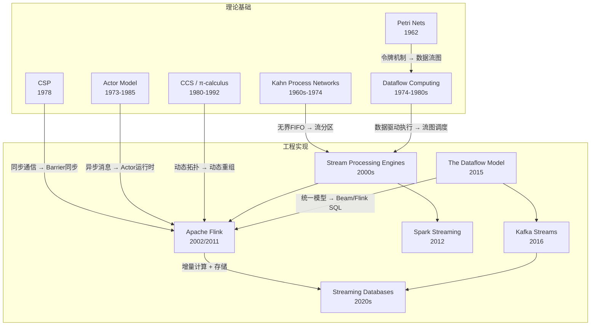
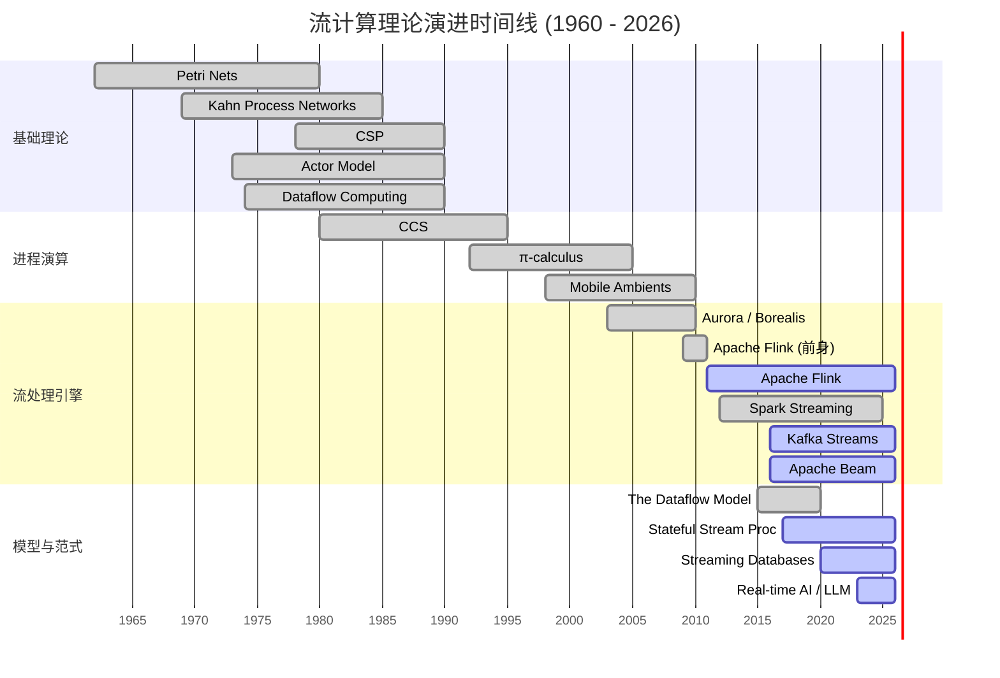
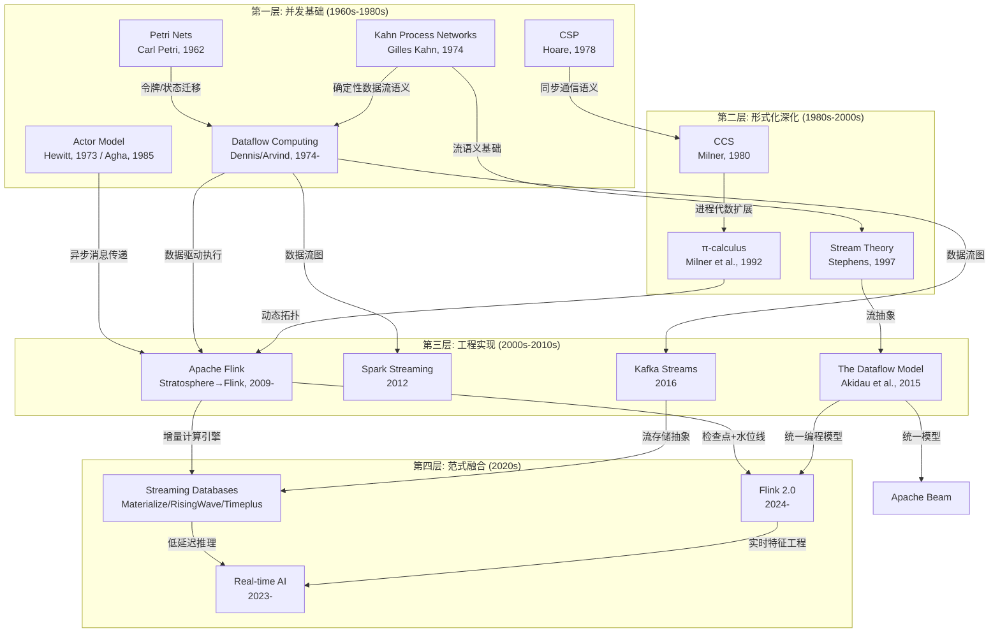
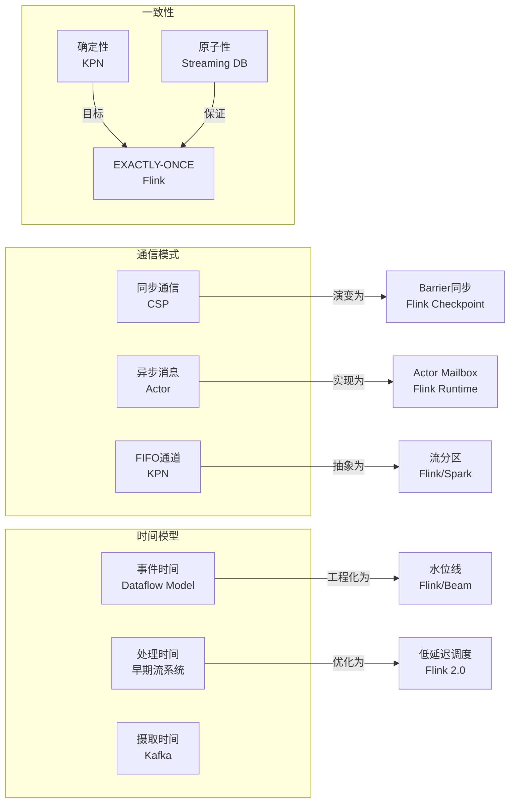
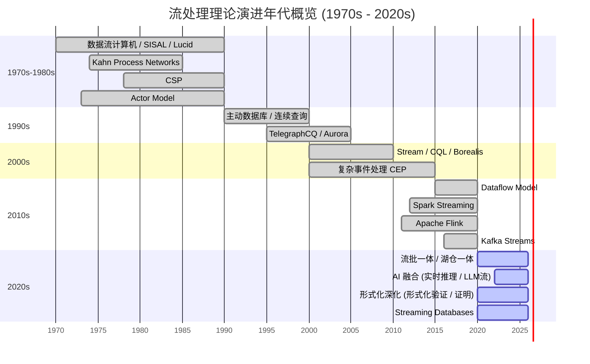
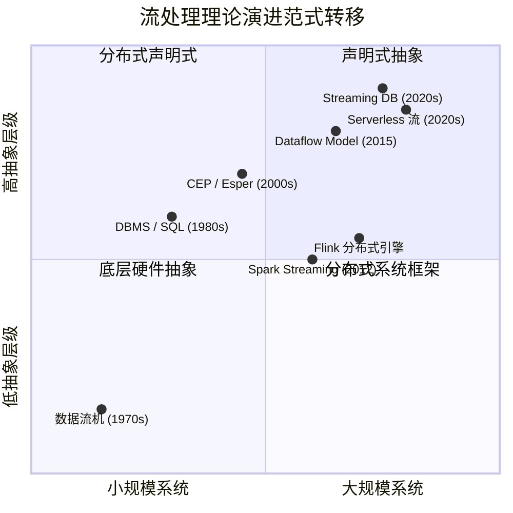
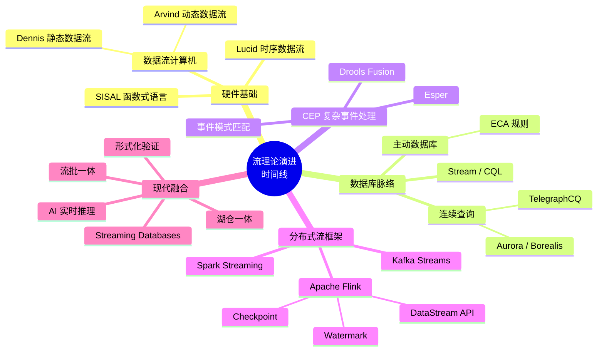

# 流计算理论演进时间线

> 所属阶段: Struct/06-frontier | 前置依赖: [Struct/00-INDEX.md](../00-INDEX.md), [Struct/03-relationships/03.03-expressiveness-hierarchy.md](../03-relationships/03.03-expressiveness-hierarchy.md) | 形式化等级: L3

## 1. 概念定义 (Definitions)

**Def-S-06-01 (流计算理论演进)**：流计算理论演进是指从 1960 年代至今，围绕**数据流处理**这一核心问题，在并发模型、进程演算、分布式系统和实际引擎等维度上形成的理论谱系及其演化关系。

**Def-S-06-02 (Kahn Process Networks, KPN)**：由 Gilles Kahn 于 1974 年形式化定义的数据流计算模型。一个 KPN 是由若干顺序进程通过**无界 FIFO 通道**连接而成的网络。每个进程通过 `read` 和 `write` 操作与通道交互，其中 `read` 是阻塞的。KPN 的语义由**不动点语义**定义：给定输入流，网络计算唯一的输出流。

**Def-S-06-03 (Communicating Sequential Processes, CSP)**：由 C.A.R. Hoare 于 1978 年提出的并发编程形式化语言。CSP 将系统建模为通过**同步通信**（rendezvous）交互的顺序进程集合。核心操作包括 `!`（输出）、`?`（输入）和 `□`（外部选择）。CSP 奠定了 OCCAM、Go 等语言的理论基础。

**Def-S-06-04 (Petri Nets)**：由 Carl Adam Petri 于 1962 年提出的分布式系统形式化模型。一个 Petri 网是一个四元组 $N = (P, T, F, M_0)$，其中 $P$ 为库所（place）集合，$T$ 为变迁（transition）集合，$F \subseteq (P \times T) \cup (T \times P)$ 为流关系，$M_0: P \rightarrow \mathbb{N}$ 为初始标识。Petri 网擅长建模**并发、冲突和同步**。

**Def-S-06-05 (Dataflow Computing)**：1970s-1980s 发展起来的计算范式，强调数据可用性驱动执行，而非控制流驱动。静态数据流（Dennis, 1974）使用**数据流图**（节点=操作，边=数据依赖）和**令牌**（token）传递机制。动态数据流（Arvind, 1977）引入**标记令牌**（tagged token）以支持条件执行和循环。

**Def-S-06-06 (Actor Model)**：由 Carl Hewitt 于 1973 年提出，Agha 于 1985 年形式化。一个 Actor 是一个计算实体，具有**状态**、**行为**和**邮箱**。Actor 之间仅通过**异步消息传递**通信。形式化地，一个 Actor 系统是一个迁移系统 $\langle A, M, \rightarrow \rangle$，其中 $A$ 为 Actor 集合，$M$ 为消息集合，$\rightarrow$ 为配置间的迁移关系。

**Def-S-06-07 (Calculus of Communicating Systems, CCS)**：由 Robin Milner 于 1980 年提出的进程演算。CCS 进程由动作前缀、并行组合、选择和限制等算子构成。Milner 于 1989 年提出**双模拟**（bisimulation）作为进程等价的标准，并引入逻辑学家 Hennessy 和 Milner 的模态逻辑（HML）。

**Def-S-06-08 ($\pi$-calculus)**：由 Robin Milner、Joachim Parrow 和 David Walker 于 1992 年提出的**移动进程演算**。$\pi$-calculus 扩展了 CCS，允许**通道名作为消息传递**，从而支持动态拓扑结构。语法核心：$P ::= 0 \mid \alpha.P \mid P+P \mid P|P \mid (\nu x)P \mid !P$，其中 $\alpha$ 可以是 $\bar{x}\langle y \rangle$（输出）、$x(z)$（输入）或 $\tau$（内部动作）。

**Def-S-06-09 (Dataflow Model / The Dataflow Model)**：由 Tyler Akidau 等人于 2015 年在 VLDB 发表的论文中系统阐述的流处理编程模型。核心抽象：

- **What**: 基于窗口（window）和触发器（trigger）的计算
- **Where**: 在事件时间（event time）上的窗口分配
- **When**: 触发时机和**水位线**（watermark）机制
- **How**: 累积模式（accumulation mode）

**Def-S-06-10 (Streaming Database)**：2020s 兴起的一类数据库系统，将**流处理**与**存储**统一为单一抽象。代表系统：Materialize、RisingWave、Timeplus、Arroyo。形式化上，可视为一个持续查询评估器 $Q: \text{Stream}(T) \rightarrow \text{Stream}(U)$，其中查询 $Q$ 被编译为**数据流图**并在增量计算引擎上执行。

## 2. 属性推导 (Properties)

**Prop-S-06-01 (KPN 确定性)**：Kahn Process Networks 是**确定性的**——给定相同的输入历史，网络总是产生相同的输出历史，与进程调度顺序无关。

> **证明概要**：Kahn 证明了 KPN 的语义可以通过 Scott 域上的连续函数的不动点来定义。由于连续函数在 CPO 上有唯一最小不动点，因此输出流唯一确定。

**Prop-S-06-02 (Actor 模型的无共享性蕴含局部性)**：在 Actor 模型中，由于没有共享状态，一个 Actor 的行为仅取决于其接收的消息序列和内部状态。这蕴含了自然的**故障隔离**和**位置透明性**。

**Prop-S-06-03 (数据流模型的迟到数据处理能力)**：Dataflow Model 通过水位线（watermark）和触发器（trigger）的分离，实现了对**迟到数据**（late data）的形式化处理。设 $t_e$ 为事件时间，$t_p$ 为处理时间，水位线 $W(t_p)$ 满足 $W(t_p) = \max\{ t_e : \text{所有事件时间} \leq t_e \text{的数据已观测} \}$，则窗口在 $W$ 越过窗口上界时触发。

**Prop-S-06-04 ($\pi$-calculus 的图灵完备性)**：$\pi$-calculus 是图灵完备的——它可以编码 $\lambda$-演算，从而表达所有可计算函数。更重要的是，它通过**名称传递**实现了**动态重组**能力，这是 CCS 所不具备的。

## 3. 关系建立 (Relations)

### 3.1 理论谱系映射

| 年代 | 理论/系统 | 核心贡献 | 与后继理论的关系 |
|------|-----------|----------|------------------|
| 1960s | Petri Nets | 并发建模的形式化起点 | 影响了数据流图中的令牌机制 |
| 1974 | Kahn Process Networks | 确定性数据流语义 | 为现代流处理引擎的确定性提供理论基础 |
| 1978 | CSP | 同步通信的形式化 | 影响了 Go 的 channel 语义和 Flink 的 Barrier 同步 |
| 1980s | Dataflow Computing | 数据驱动执行 | 直接催生了现代流处理的数据流图执行模型 |
| 1985 | Actor Model (形式化) | 异步消息传递的数学基础 | 影响了 Akka/Pekko 和 Flink 的 Actor 运行时 |
| 1992 | $\pi$-calculus | 移动进程演算 | 为动态拓扑重组提供了形式化框架 |
| 2002 | Apache Flink (前身 Stratosphere) | 分布式数据流执行 | 综合了数据流图、检查点和水位线 |
| 2015 | The Dataflow Model | 流批统一的编程模型 | 成为 Flink、Beam 等系统的核心 API 设计理念 |
| 2020s | Streaming Databases | 流处理与存储的统一 | 将流计算从"编程框架"推向"数据库"范式 |

### 3.2 理论与系统的编码关系



## 4. 论证过程 (Argumentation)

### 4.1 为什么流计算理论的演进是"螺旋上升"的？

观察时间线可以发现一个有趣的模式：

1. **1960s-1980s 的理论奠基期**：研究者在**形式化**层面回答了"并发计算是什么"的问题。KPN 回答确定性数据流，CSP 回答同步通信，Actor 回答异步消息。这些理论都是**去中心化**的——它们假设没有全局时钟、没有共享内存。

2. **1990s 的形式化深化期**：Milner 的进程演算（CCS → $\pi$-calculus）将"通信"本身提升为可操作的数学对象。$\pi$-calculus 的核心洞察是：**拓扑结构本身可以是计算的产物**。这为后来流处理系统的动态重配置提供了理论先声。

3. **2000s-2010s 的工程爆发期**：理论被"重新发现"并大规模工程化。Flink 的底层运行时借鉴了 Actor 模型（Akka），其数据流执行引擎借鉴了静态数据流图，其水位线机制则是 KPN 确定性语义在处理时间维度上的工程折中。

4. **2020s 的范式融合期**：Streaming Databases 的出现标志着流计算从"编程框架"向"声明式系统"的回归。这与 1980s 关系数据库取代网状/层次数据库的历史形成有趣的**镜像**——当时是从低层模型向声明式模型的跃迁，现在是从命令式流处理框架向声明式流数据库的跃迁。

### 4.2 水位线机制的理论定位

水位线（Watermark）是连接理论与工程的关键节点：

- **理论来源**：KPN 的确定性保证要求进程阻塞读取；但在分布式环境中，全局阻塞代价过高。
- **工程折中**：水位线是一种**单调的近似时钟**——它不是真正的全局时钟，而是通过心跳和进度传播实现的**偏序时间**的近似。
- **形式化模型**：可以将水位线视为一个**谓词** $W: T_e \times T_p \rightarrow \{\text{true}, \text{false}\}$，其中 $W(t_e, t_p) = \text{true}$ 表示"在时间 $t_p$，所有事件时间 $\leq t_e$ 的数据极大概率已到达"。

## 5. 形式证明 / 工程论证 (Proof / Engineering Argument)

**Thm-S-06-01 (流计算理论演进的完备性覆盖)**：从 KPN 到 Streaming Databases 的理论谱系，覆盖了流计算系统的所有核心关切——**计算语义**、**通信机制**、**时间模型**、**一致性保证**和**容错恢复**。

> **工程论证**：
>
> 现代流处理引擎（以 Flink 为代表）的每个核心机制都可以在理论谱系中找到对应：
>
> | Flink 机制 | 理论来源 | 工程化差异 |
> |------------|----------|------------|
> | DataStream API / 数据流图 | 静态数据流 (Dennis, 1974) | 从单机到分布式，引入分区与并行度 |
> | Actor 运行时 (Akka) | Actor Model (Agha, 1985) | 增加监督策略和容错语义 |
> | Checkpoint / Barrier | CSP 同步 + Chandy-Lamport (1985) | 从理论快照到异步增量快照 |
> | Watermark | KPN 确定性语义 + 松弛 | 从精确阻塞到近似进度跟踪 |
> | Event Time 处理 | The Dataflow Model (2015) | 直接实现 |
> | EXACTLY_ONCE | 分布式事务理论 | 两阶段提交 + 异步快照的混合 |
>
> 这一映射表明，现代流处理引擎并非凭空创造，而是**对 50 年理论积累的工程综合**。

## 6. 实例验证 (Examples)

### 6.1 经典代码示例：从 CSP 到 Go 再到 Flink

**CSP 风格（伪代码）**：

```
PROCESS Producer
  WHILE true
    x := compute()
    output ! x

PROCESS Consumer
  WHILE true
    input ? y
    process(y)
```

**Go 实现**：

```go
// Go 的 channel 直接继承 CSP 语义
ch := make(chan int)
go func() {       // Producer
    for {
        ch <- compute()
    }
}()
go func() {       // Consumer
    for y := range ch {
        process(y)
    }
}()
```

**Flink DataStream（Java）**：

```java
// Flink 的 DataStream 将 CSP 的 channel 抽象为分布式流分区
DataStream<Event> stream = env
    .addSource(new KafkaSource<>())
    .keyBy(Event::getUserId)
    .window(TumblingEventTimeWindows.of(Time.minutes(5)))
    .aggregate(new CountAggregate());
```

### 6.2 Streaming Database 声明式示例

```sql
-- Materialize / RisingWave 风格的持续查询
CREATE MATERIALIZED VIEW page_view_stats AS
SELECT
    page_id,
    COUNT(*) AS view_count,
    AVG(duration) AS avg_duration
FROM page_views
GROUP BY page_id,
         TUMBLE(event_time, INTERVAL '1' MINUTE);
-- 查询结果持续更新，无需显式触发器或水位线配置
```

## 7. 可视化 (Visualizations)

### 7.1 流计算理论演进甘特图（1960s - 2026）

以下甘特图展示了流计算核心理论与系统从 1960 年代到 2026 年的演进时间线。每个条段代表一个理论/系统的主要活跃期或影响力窗口。



### 7.2 理论影响力传导流程图

以下流程图展示了核心理论如何逐级影响后续理论和系统，形成一个**知识扩散网络**。



### 7.3 理论演进的关键特征对比矩阵



### 7.4 流处理理论演进年代时间线

以下甘特图按年代维度展示流处理从理论奠基到现代融合的五十年演进脉络。



### 7.5 理论演进范式转移概念矩阵

以下四象限图展示流处理理论在**系统规模**与**抽象层级**二维空间中的范式转移轨迹。



### 7.6 流理论演进时间线思维导图

以下思维导图以"流理论演进时间线"为核心，放射式展开五大技术脉络。



## 8. 引用参考 (References)
