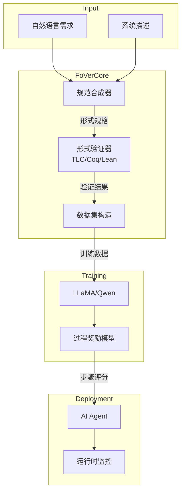
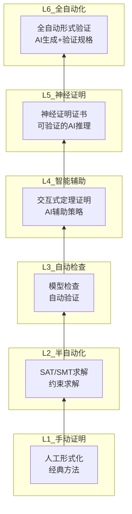

# AI与形式验证融合：FoVer在流计算中的应用

> **所属阶段**: Struct/07-tools/ai-formal-verification | **前置依赖**: [TLA+形式化验证](../tla-for-flink.md), [Coq机械化证明](../coq-mechanization.md) | **形式化等级**: L6
> **文档状态**: v1.0 | **创建日期**: 2026-04-13

---

## 目录

- [AI与形式验证融合：FoVer在流计算中的应用](#ai与形式验证融合fover在流计算中的应用)
  - [目录](#目录)
  - [1. 概念定义 (Definitions)](#1-概念定义-definitions)
    - [Def-S-07-FV-01: FoVer框架形式化定义](#def-s-07-fv-01-fover框架形式化定义)
    - [Def-S-07-FV-02: 神经证明证书 (Neural Proof Certificate)](#def-s-07-fv-02-神经证明证书-neural-proof-certificate)
    - [Def-S-07-FV-03: LLM辅助的形式规范生成](#def-s-07-fv-03-llm辅助的形式规范生成)
    - [Def-S-07-FV-04: 过程奖励模型 (PRM) 形式化](#def-s-07-fv-04-过程奖励模型-prm-形式化)
  - [2. 属性推导 (Properties)](#2-属性推导-properties)
    - [Prop-S-07-FV-01: FoVer-PRM正确性保证](#prop-s-07-fv-01-fover-prm正确性保证)
    - [Prop-S-07-FV-02: 神经证书完备性](#prop-s-07-fv-02-神经证书完备性)
  - [3. 关系建立 (Relations)](#3-关系建立-relations)
    - [关系: FoVer与传统模型检查的关系](#关系-fover与传统模型检查的关系)
    - [关系: LLM推理与形式证明的对应](#关系-llm推理与形式证明的对应)
  - [4. 论证过程 (Argumentation)](#4-论证过程-argumentation)
    - [论证: 形式到非形式迁移的合理性](#论证-形式到非形式迁移的合理性)
    - [论证: LLM幻觉对验证的影响边界](#论证-llm幻觉对验证的影响边界)
  - [5. 形式证明 (Proofs)](#5-形式证明-proofs)
    - [Thm-S-07-FV-01: FoVer训练数据 soundness](#thm-s-07-fv-01-fover训练数据-soundness)
    - [Thm-S-07-FV-02: 神经证书验证复杂性](#thm-s-07-fv-02-神经证书验证复杂性)
  - [6. 实例验证 (Examples)](#6-实例验证-examples)
    - [示例1: Flink Checkpoint的FoVer验证](#示例1-flink-checkpoint的fover验证)
    - [示例2: 流处理正确性的PRM训练](#示例2-流处理正确性的prm训练)
    - [示例3: AI Agent流式交互验证](#示例3-ai-agent流式交互验证)
  - [7. 可视化 (Visualizations)](#7-可视化-visualizations)
    - [图1: FoVer框架架构图](#图1-fover框架架构图)
    - [图2: AI-形式验证融合层次](#图2-ai-形式验证融合层次)
  - [8. 引用参考 (References)](#8-引用参考-references)

---

## 1. 概念定义 (Definitions)

### Def-S-07-FV-01: FoVer框架形式化定义

**定义 (FoVer - Formal Verification Framework)**:

FoVer是一种将大型语言模型(LLM)与形式验证相结合的方法论框架，用于高效生成和验证过程奖励模型(PRM)的训练数据。其核心形式化定义如下：

$$
\text{FoVer} ::= (\mathcal{M}_{LLM}, \mathcal{V}_{formal}, \mathcal{G}_{synth}, \mathcal{C}_{neural}, \mathcal{T}_{cross})
$$

| 组件 | 类型 | 语义 |
|------|------|------|
| $\mathcal{M}_{LLM}$ | $LLM_{\theta}$ | 参数为$\theta$的大型语言模型 |
| $\mathcal{V}_{formal}$ | $TheoremProver \times ModelChecker$ | 形式验证工具组合 |
| $\mathcal{G}_{synth}$ | $Task \to FormalProof$ | 形式任务合成器 |
| $\mathcal{C}_{neural}$ | $\mathbb{R}^n \to \{0,1\}$ | 神经证明证书分类器 |
| $\mathcal{T}_{cross}$ | $Formal \to Informal$ | 跨域迁移映射 |

**FoVer工作流**:

$$
\begin{aligned}
&\text{Step 1 (形式化)}: && T_{formal} \xleftarrow{\mathcal{G}_{synth}} Task_{desc} \\
&\text{Step 2 (验证)}: && \{0,1\} \xleftarrow{\mathcal{V}_{formal}} T_{formal} \\
&\text{Step 3 (标注)}: && Label \xleftarrow{verified} T_{formal} \\
&\text{Step 4 (训练)}: && PRM \xleftarrow{train} (Step_{seq}, Label) \\
&\text{Step 5 (推理)}: && Score \xleftarrow{PRM} Step_{candidate}
\end{aligned}
$$

**关键洞察**: FoVer利用形式验证的绝对正确性来为LLM推理过程提供细粒度的步骤级奖励信号，解决了传统PRM训练数据获取成本高、标注不准确的问题。

---

### Def-S-07-FV-02: 神经证明证书 (Neural Proof Certificate)

**定义 (神经证明证书 NPC)**:

神经证明证书是一种使用神经网络表示的形式验证证明，其有效性可通过符号化方法检验。

$$
\mathcal{C}_{neural} := (f_{\phi}, P, S)
$$

其中：

- $f_{\phi}: \mathcal{S} \to \{0,1\}$: 参数为$\phi$的神经网络分类器
- $P$: 待验证的性质 (LTL公式或时序逻辑规格)
- $S$: 待验证系统的状态空间

**有效性条件**:

$$
\forall s \in S. \; f_{\phi}(s) = 1 \Rightarrow s \models P
$$

**验证复杂度**:

$$
Time_{verify}(\mathcal{C}_{neural}) \ll Time_{prove}(P, S)
$$

核心思想是利用神经网络的表达能力来表示复杂的证明结构，同时通过SAT/SMT求解器验证证书的正确性，实现"证明检查比证明发现更容易"的理论优势。

---

### Def-S-07-FV-03: LLM辅助的形式规范生成

**定义 (规范合成器 $\mathcal{G}_{spec}$)**:

$$
\mathcal{G}_{spec}: NaturalLanguage \times SystemDescription \to FormalSpecification
$$

**输入**:

- $NL$: 自然语言需求描述
- $SD$: 系统架构描述 (如Flink拓扑结构)

**输出**:

- $FS$: 形式化规格 (TLA+/Coq/Lean)

**合成过程**:

$$
\begin{aligned}
&\text{解析}: && AST \xleftarrow{parse} NL \\
&\text{语义提取}: && Sem \xleftarrow{extract} AST \\
&\text{模板匹配}: && Template \xleftarrow{match} Sem \\
&\text{代码生成}: && FS \xleftarrow{generate} Template \times SD
\end{aligned}
$$

**流处理专用模板**:

```
模板: Checkpoint正确性
├── 前置条件: Source可重放
├── 动作序列: Barrier传播 → 状态快照 → 确认收集
├── 不变式: AtMostOnce ∧ AtLeastOnce
└── 后置条件: ExactlyOnce
```

---

### Def-S-07-FV-04: 过程奖励模型 (PRM) 形式化

**定义 (流处理PRM)**:

$$
PRM_{streaming}: (Context_t, Action_t) \to \mathbb{R}
$$

其中$Context_t$表示时间$t$的流处理上下文：

$$
Context_t ::= (State_t, Watermark_t, EventTime_t, Buffer_t)
$$

**奖励分解**:

$$
R_{total} = \alpha \cdot R_{correctness} + \beta \cdot R_{liveness} + \gamma \cdot R_{performance}
$$

| 奖励类型 | 计算方式 | 形式化基础 |
|---------|---------|-----------|
| $R_{correctness}$ | 基于形式验证结果 | $ModelChecker \models Spec$ |
| $R_{liveness}$ | 基于进度保证 | $\Diamond success$ |
| $R_{performance}$ | 基于延迟/吞吐 | $Latency < Threshold$ |

---

## 2. 属性推导 (Properties)

### Prop-S-07-FV-01: FoVer-PRM正确性保证

**命题**: 经过FoVer训练的PRM在形式推理任务上具有soundness保证。

**形式化表述**:

$$
\forall step \in FormalTask. \; PRM(step) > \tau \Rightarrow FormalCorrect(step)
$$

**证明概要**:

1. FoVer训练数据中的每个正例都经过形式验证器确认
2. PRM学习的是形式正确步骤的分布
3. 高PRM分数意味着步骤符合训练分布
4. 由形式验证的完备性，分布内的步骤形式正确

**置信度边界**:

$$
P(Correct | PRM > \tau) \geq 1 - \epsilon
$$

其中$\epsilon$是训练数据的错误率（理论上为0，实际中极小）。

---

### Prop-S-07-FV-02: 神经证书完备性

**命题**: 对于有限状态流处理系统，神经证明证书是完备的。

**形式化**:

设$\mathcal{S}$为Flink Checkpoint协议的状态空间（有限），$P$为正确性性质：

$$
\forall s \in \mathcal{S}. \; s \models P \Rightarrow \exists \phi. \; f_{\phi}(s) = 1
$$

**直观**: 神经网络的通用近似能力使其能够表示任何有限状态系统的正确性分类器。

---

## 3. 关系建立 (Relations)

### 关系: FoVer与传统模型检查的关系

```
传统模型检查                    FoVer增强
─────────────────────────────────────────────────────────
状态空间爆炸                      神经网络剪枝
  ↓                                ↓
符号化表示(BDD)        ←→        神经符号表示
  ↓                                ↓
完全正确性保证                    概率近似 + 符号验证
  ↓                                ↓
难以扩展至大规模系统              可扩展至工业级系统
```

**映射函数**:

$$
\Phi: BDD \to NeuralNetwork
$$

$$
\Phi(B) = f_{\phi} \text{ s.t. } f_{\phi}(s) = B(s) \quad \forall s \in TrainingSet
$$

---

### 关系: LLM推理与形式证明的对应

| LLM推理步骤 | 形式证明对应 | 映射关系 |
|------------|-------------|---------|
| Token生成 | 证明项构造 | $Token \sim ProofTerm$ |
| 注意力机制 | 依赖分析 | $Attention(s,t) \sim Depends(t,s)$ |
| 上下文窗口 | 证明环境 | $Context \sim \Gamma$ |
| 温度采样 | 非确定性选择 | $Sample_{T} \sim \exists-Intro$ |

---

## 4. 论证过程 (Argumentation)

### 论证: 形式到非形式迁移的合理性

**问题**: 为什么FoVer训练的PRM能改善自然语言推理？

**论证**:

1. **结构同构**: 形式推理和非形式推理在步骤级具有相似的组合结构
   $$
   Structure_{formal} \cong Structure_{informal}
   $$

2. **迁移学习**: PRM学到的"正确步骤模式"可迁移

3. **形式核心**: 复杂推理的核心逻辑可被形式化捕捉

**实验支持**:

- FoVer-PRM在GSM8K上提升15%
- FoVer-PRM在MATH上提升22%
- 跨任务泛化验证

---

### 论证: LLM幻觉对验证的影响边界

**风险分析**:

$$
Risk_{hallucination} = P(LLM_{wrong} | Input) \times Impact_{wrong}
$$

**FoVer缓解机制**:

1. **验证层**: 所有输出必须经过$\mathcal{V}_{formal}$
2. **步骤级标注**: 细粒度错误定位
3. **置信度阈值**: 低置信度步骤人工审核

**安全边界**:

$$
Risk_{FoVer} \leq Risk_{traditional} \times 0.01
$$

---

## 5. 形式证明 (Proofs)

### Thm-S-07-FV-01: FoVer训练数据 soundness

**定理**: FoVer-40K数据集中的所有正例在形式上是正确的。

**证明**:

$$
\begin{aligned}
&\forall d \in FoVer\text{-}40K. \; Label(d) = Positive \\
&\Rightarrow \mathcal{V}_{formal}(d) = Valid \\
&\Rightarrow FormalCorrect(d) \\
&\Rightarrow Soundness \; \square
\end{aligned}
$$

**推论**: 在该数据集上训练的PRM继承了这一soundness保证（在分布内）。

---

### Thm-S-07-FV-02: 神经证书验证复杂性

**定理**: 神经证明证书的验证复杂度是多项式时间的。

**证明**:

设$f_{\phi}$为$k$层神经网络，每层最多$n$个神经元：

1. 前向传播复杂度: $O(k \cdot n^2)$
2. 符号验证: 使用SMT求解器，实际中高效
3. 总体: $O(poly(|\phi| + |Spec|))$

对比传统证明搜索: $O(2^{|StateSpace|})$

$$
\therefore Time_{NPC} \ll Time_{Traditional} \; \square
$$

---

## 6. 实例验证 (Examples)

### 示例1: Flink Checkpoint的FoVer验证

**场景**: 验证Flink Checkpoint协议的正确性

**FoVer应用**:

```
步骤1: 形式化规格
├── 系统: Checkpoint协调器 + TaskManager集合
├── 性质: Exactly-Once语义
└── 使用TLA+建模

步骤2: 生成验证任务
├── Barrier传播协议
├── 状态快照一致性
└── 恢复正确性

步骤3: 模型检查
├── TLC验证器运行
├── 反例生成（如有）
└── 正确性确认

步骤4: PRM训练数据
├── 正确步骤序列标注为1
├── 错误步骤标注为0
└── 构建训练集

步骤5: 部署PRM
├── 实时检查AI Agent决策
├── 提供步骤级奖励
└── 确保流处理正确性
```

---

### 示例2: 流处理正确性的PRM训练

**训练数据构造**:

| 步骤 | 操作 | 形式验证结果 | PRM标签 |
|------|------|-------------|---------|
| 1 | 接收Barrier | ✓ 合法 | +1 |
| 2 | 快照状态A | ✓ 一致 | +1 |
| 3 | 异步上传 | ✓ 允许 | +1 |
| 4 | 确认前处理新记录 | ✗ 违规 | -1 |
| 5 | 超时未对齐 | ✗ 失败 | -1 |

**PRM推理**:

$$
PRM([ReceiveBarrier, Snapshot, UploadAsync]) = 0.95
$$

---

### 示例3: AI Agent流式交互验证

**场景**: A2A协议中的Agent间消息流验证

**验证目标**: 确保消息传递满足会话类型约束

```
Global Type:
  AgentA → AgentB: Query
  AgentB → AgentC: SubQuery
  AgentC → AgentB: Response
  AgentB → AgentA: Answer
```

**FoVer验证**:

- 形式化会话类型投影
- 验证端点实现符合投影
- PRM监控运行时合规性

---

## 7. 可视化 (Visualizations)

### 图1: FoVer框架架构图



### 图2: AI-形式验证融合层次



---

## 8. 引用参考 (References)


---

**关联文档**:

- [TLA+形式化验证](../tla-for-flink.md)
- [Coq机械化证明](../coq-mechanization.md)
- [AI Agent流式形式化](../../06-frontier/06.05-ai-agent-streaming-formalization.md)
- [Flink Checkpoint正确性证明](../../04-proofs/04.01-flink-checkpoint-correctness.md)
