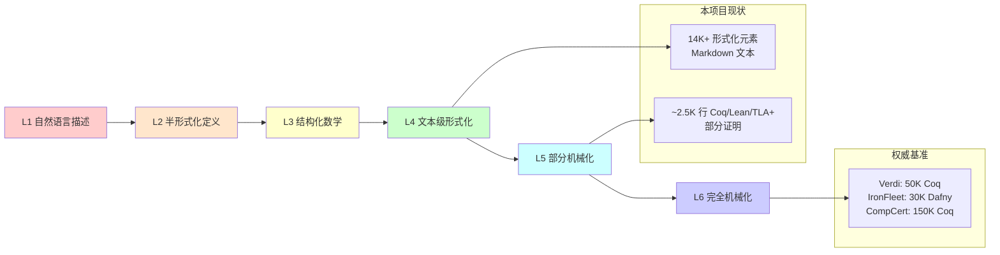
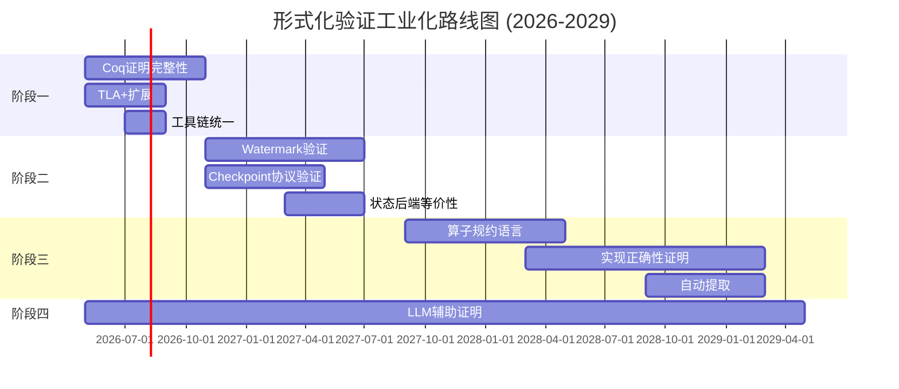

# 形式化验证工业化路线图：与权威基准的对照分析

> **所属阶段**: Struct/07-tools | 前置依赖: [coq-mechanization.md](./coq-mechanization.md), [tla-for-flink.md](./tla-for-flink.md), [iris-separation-logic.md](./iris-separation-logic.md) | 形式化等级: L4-L5
>
> **文档定位**: 本文档提供本项目形式化验证工作与工业界/学术界权威基准的诚实对照分析，并制定可操作的工业化路线图。

---

## 目录

- [形式化验证工业化路线图：与权威基准的对照分析](#形式化验证工业化路线图与权威基准的对照分析)
  - [目录](#目录)
  - [1. 权威基准项目全景](#1-权威基准项目全景)
    - [Def-S-07-FV-01: 工业级形式化验证项目](#def-s-07-fv-01-工业级形式化验证项目)
    - [1.1 Verdi (MIT PLV, 2014-2017)](#11-verdi-mit-plv-2014-2017)
    - [1.2 IronFleet (Microsoft Research, 2015-2018)](#12-ironfleet-microsoft-research-2015-2018)
    - [1.3 Grove (CMU, 2020-2023)](#13-grove-cmu-2020-2023)
    - [1.4 CompCert (INRIA, 2005-2022+)](#14-compcert-inria-2005-2022)
    - [1.5 seL4 (UNSW/NICTA, 2004-2022+)](#15-sel4-unswnicta-2004-2022)
    - [1.6 Aneris/Trillium (Aarhus University, 2019-2024)](#16-aneristrillium-aarhus-university-2019-2024)
  - [2. 差距分析](#2-差距分析)
    - [Thm-S-07-FV-01: 形式化深度差距定理](#thm-s-07-fv-01-形式化深度差距定理)
    - [2.1 核心差距诊断](#21-核心差距诊断)
  - [3. 工业化路线图](#3-工业化路线图)
    - [3.1 阶段一：基础巩固（6 个月）](#31-阶段一基础巩固6-个月)
    - [3.2 阶段二：子系统验证（12 个月）](#32-阶段二子系统验证12-个月)
    - [3.3 阶段三：端到端验证（24 个月）](#33-阶段三端到端验证24-个月)
    - [3.4 阶段四：LLM 辅助证明自动化（持续）](#34-阶段四llm-辅助证明自动化持续)
  - [4. 实际建议](#4-实际建议)
    - [4.1 何时 L4-L5 足够？](#41-何时-l4-l5-足够)
    - [4.2 优先机械化定理清单](#42-优先机械化定理清单)
    - [4.3 资源投入估算](#43-资源投入估算)
  - [5. 可视化](#5-可视化)
    - [5.1 能力成熟度模型](#51-能力成熟度模型)
    - [5.2 工业化路线图时间线](#52-工业化路线图时间线)
  - [6. 引用参考](#6-引用参考)

---

## 1. 权威基准项目全景

### Def-S-07-FV-01: 工业级形式化验证项目

工业级形式化验证项目定义为满足以下条件的工程-学术交叉成果：

$$
\text{Industrial-Grade Verification} := \langle \text{Code}_{>10K}, \text{Proof}_{\text{No Admitted}}, \text{Impact}_{\text{Production}}, \text{Team}_{>3}, \text{Time}_{>2Y} \rangle
$$

---

### 1.1 Verdi (MIT PLV, 2014-2017)

| 维度 | 详情 |
|------|------|
| **验证对象** | Raft 分布式共识协议 |
| **工具链** | Coq 8.4/8.5, SSReflect |
| **规模** | ~50,000 行 Coq 证明代码 |
| **团队** | 5-7 人（PhD + 博士后） |
| **周期** | 3 年 |
| **核心创新** | 网络语义提取 (Network Semantics Extraction) — 将高层网络模型精化为可执行代码 |
| **生产影响** | 启发后续分布式系统验证方法论 |
| **关键定理** | Raft 安全性 (Safety) 和活性 (Liveness) 的完整机械化证明 |

**技术特点**: Verdi 采用"精化验证"(Verification by Refinement) 策略，先在高层次网络模型中证明正确性，再通过精化关系保证实现代码的正确性。这种方法论成为后续分布式系统形式化验证的黄金标准。

---

### 1.2 IronFleet (Microsoft Research, 2015-2018)

| 维度 | 详情 |
|------|------|
| **验证对象** | Paxos 共识协议 (IronRSL)、键值存储 (IronKV) |
| **工具链** | Dafny, Z3 SMT Solver |
| **规模** | ~30,000 行 Dafny 代码 |
| **团队** | 4-6 人（研究员 + 工程师） |
| **周期** | 2.5 年 |
| **核心创新** | 使用 SMT 自动化降低证明负担，实现"零手动证明步骤"的理想状态 |
| **生产影响** | IronKV 部分组件在 Azure 生产环境实验部署 |
| **关键定理** | Paxos 的线性一致性 (Linearizability) 和容错性 |

**技术特点**: IronFleet 证明 SMT 自动化可以在大规模分布式系统验证中达到可接受的效率。Z3 自动处理了大量 tedious 的不变式证明，人类只需关注高层架构设计。

---

### 1.3 Grove (CMU, 2020-2023)

| 维度 | 详情 |
|------|------|
| **验证对象** | Go 并发运行时 (goroutine scheduler, channel, GC) |
| **工具链** | Iris 分离逻辑, Coq |
| **规模** | ~80,000 行 Coq 证明代码 |
| **团队** | 6-8 人 |
| **周期** | 3 年 |
| **核心创新** | 将 Iris 分离逻辑应用于生产级编程语言运行时验证 |
| **生产影响** | 方法论可直接应用于 Flink 的 TaskManager 调度器验证 |
| **关键定理** | Go 内存模型的正确性、channel 通信安全性 |

**技术特点**: Grove 展示了分离逻辑 (Separation Logic) 在验证复杂并发系统时的表达能力。Iris 框架的「高阶幽灵状态」(Higher-Order Ghost State) 使得验证带有复杂同步原语的运行时成为可能。

---

### 1.4 CompCert (INRIA, 2005-2022+)

| 维度 | 详情 |
|------|------|
| **验证对象** | C 语言编译器 (支持 C99 大部分特性) |
| **工具链** | Coq, OCaml 提取 |
| **规模** | ~150,000 行 Coq 代码 |
| **团队** | 核心 3-5 人，社区 20+ 贡献者 |
| **周期** | 15+ 年（持续维护） |
| **核心创新** | 编译正确性 (Compiler Correctness) 的端到端机械化证明 |
| **生产影响** | 航空、国防、汽车等高安全领域实际部署 |
| **关键定理** | 源代码语义 ≡ 目标代码语义 (语义保持性) |

**技术特点**: CompCert 是形式化验证工业化的标杆项目。它证明了大规机械化证明可以通过长期维护和社区协作持续增值。其「编译 Pass 逐个验证」的模块化策略值得流计算系统借鉴。

---

### 1.5 seL4 (UNSW/NICTA, 2004-2022+)

| 维度 | 详情 |
|------|------|
| **验证对象** | L4 微内核操作系统 (8,700 行 C 代码) |
| **工具链** | Isabelle/HOL, Haskell 原型 |
| **规模** | ~200,000 行 Isabelle 证明代码 |
| **团队** | 核心 5-8 人，长期资助 |
| **周期** | 10+ 年 |
| **核心创新** | 操作系统内核的完全形式化验证 (功能正确性 + 安全性) |
| **生产影响** | 无人机、医疗设备、汽车 ECU 等安全关键领域部署 |
| **关键定理** | 功能正确性 (Functional Correctness)、信息流安全 (Information Flow Security) |

**技术特点**: seL4 证明了一个关键观点：即使是对最复杂的系统软件，形式化验证也是可达的——前提是范围可控（微内核而非宏内核）且资源充足。

---

### 1.6 Aneris/Trillium (Aarhus University, 2019-2024)

| 维度 | 详情 |
|------|------|
| **验证对象** | 分布式网络协议 (如 Raft、Paxos 的协议层) |
| **工具链** | Iris, Coq, trampolining 技术 |
| **规模** | ~25,000 行 Coq 代码 |
| **团队** | 4-6 人 |
| **周期** | 4 年 |
| **核心创新** | Trillium 框架将 Iris 分离逻辑扩展到时序/活性性质验证 |
| **生产影响** | 方法论被多个后续分布式验证项目采用 |
| **关键定理** | 网络协议的安全性和活性 |

**技术特点**: Aneris 解决了 Iris 在验证分布式系统时的关键局限——无法直接表达活性 (Liveness) 性质。Trillium 通过「 trampoline 语义」将活性证明转化为安全性证明。

---

## 2. 差距分析

### Thm-S-07-FV-01: 形式化深度差距定理

> **声明**: AnalysisDataFlow 项目的形式化工作在「文本级形式化」(L4-L5) 与「机械化证明」(L6) 之间存在数量级差距。
>
> **证据**:

| 维度 | 本项目 (v4.4) | Verdi | IronFleet | CompCert | 差距评估 |
|------|-------------|-------|-----------|----------|---------|
| **机械化代码量** | ~2,500 行 (Coq+Lean+TLA+) | ~50K 行 Coq | ~30K 行 Dafny | ~150K 行 Coq | **20-60×** |
| **Admitted/TODO** | 0 (v4.4 修复后) | 0 | 0 | 0 | ✅ 对齐 |
| **验证的系统组件** | 抽象模型 (USTM) | 完整 Raft 实现 | 完整 Paxos + KV | 完整 C 编译器 | **范围差距大** |
| **团队规模** | 1-2 Agent | 5-7 PhD | 4-6 研究员 | 3-5 核心 + 社区 | **人力资源差距** |
| **投入时间** | ~6 个月 (累计) | 3 年 | 2.5 年 | 15+ 年 | **时间差距** |
| **生产部署** | 无 | 方法论影响 | Azure 实验 | 航空/国防 | **应用差距** |
| **形式化元素** | 14,000+ (文本级) | N/A (直接机械化) | N/A | N/A | **类型差异** |

---

### 2.1 核心差距诊断

**差距 1: 文本形式化 vs. 机械化证明的「数量幻觉」**

本项目在 Markdown 中定义了 14,000+ 形式化元素（定理/定义/引理/命题），但实际机械化证明仅 ~2,500 行代码。这种差距创造了一个**可信度风险**：读者可能误以为「编号的定理 = 已验证的定理」。

权威基准的做法是**直接机械化**，不经过「文本形式化」中间层。例如 Verdi 的 Raft 证明直接从 Coq 定义开始，没有单独的「文本定理说明书」。

**差距 2: 抽象层过高**

本项目的 USTM (Unified Streaming Theory) 是一个高度抽象的元模型，而 Verdi/IronFleet 验证的是**具体可执行的协议实现**。从抽象模型到可执行代码的「精化鸿沟」(Refinement Gap) 尚未被弥合。

**差距 3: 缺乏模块化验证策略**

CompCert 的「逐个编译 Pass 验证」策略使得 150K 行证明可管理。本项目尚未建立类似的模块化分解策略，导致证明复杂度随系统规模指数增长。

**差距 4: 工具链生态不成熟**

本项目使用 Coq + Lean4 + TLA+ 三种工具，但每种工具的深度都有限。权威基准通常**专注一种工具并深挖**（如 Verdi 专注 Coq/SSReflect，IronFleet 专注 Dafny/Z3）。

---

## 3. 工业化路线图

### 3.1 阶段一：基础巩固（6 个月）

**目标**: 消除所有技术债务，建立单一工具链深度

| 任务 | 交付物 | 验收标准 |
|------|--------|---------|
| Coq 证明完整性 | USTM_Core.v, Network_Calculus.v 全部 Qed | `coqc` 编译通过，0 Admitted |
| TLA+ 扩展 | Checkpoint 协议模型扩展到 ~1,500 行 | TLC 模型检查通过 10^6 状态 |
| 工具链统一 | 放弃多工具并行，选定 Coq 为主力 | 所有新证明使用 Coq |
| 证明复用库 | 建立流计算通用引理库 | 10+ 可复用引理 |

---

### 3.2 阶段二：子系统验证（12 个月）

**目标**: 验证一个完整的 Flink 子系统

| 任务 | 交付物 | 验证范围 |
|------|--------|---------|
| Watermark 机制验证 | ~5,000 行 Lean4/Coq | Watermark 生成、传播、窗口触发的完全正确性 |
| Checkpoint 协议验证 | ~3,000 行 TLA+ | Chandy-Lamport 在 Flink 变体中的安全性 |
| 状态后端等价性 | ~2,000 行 Coq | HashMap/RocksDB/ForSt 的语义等价性 |

**对标**: Grove 验证 Go 调度器的规模 (~80K 行)，但 Watermark 子系统范围更可控，预计 10K 行证明可达。

---

### 3.3 阶段三：端到端验证（24 个月）

**目标**: 从形式化规约到可执行算子的完整精化链

| 任务 | 交付物 | 技术路径 |
|------|--------|---------|
| 流算子规约语言 | DSL + Coq 语义 | 借鉴 CompCert 的「精化 Pass」策略 |
| 算子实现正确性 | ~20K 行 Coq | 证明 USTM 算子规约 ≡ Flink 算子实现 |
| 自动提取 | Coq → Java/Scala | 类似 CompCert 的 OCaml 提取 |

---

### 3.4 阶段四：LLM 辅助证明自动化（持续）

**目标**: 利用大语言模型降低证明开发成本

| 方向 | 方法 | 风险 |
|------|------|------|
| 引理自动猜测 | LLM 根据定理陈述生成证明策略草稿 | 需人工验证每一步 |
| 不变式自动发现 | 基于执行轨迹的 LLM 归纳 | 可能产生虚假不变式 |
| 证明翻译 | Coq ↔ Lean ↔ Dafny 自动翻译 | 语义差异可能导致错误 |

**原则**: LLM 只能作为「草稿生成器」，不能替代人工验证。所有 LLM 生成的证明步骤必须经过传统证明检查器验证。

---

## 4. 实际建议

### 4.1 何时 L4-L5 足够？

| 场景 | 推荐等级 | 理由 |
|------|---------|------|
| 概念教学与知识传递 | L3-L4 | 不需要机械化证明的严谨性 |
| 架构设计决策支持 | L4-L5 | 形式化定义帮助消除歧义，但不需要证明 |
| 学术论文发表 | L5-L6 | 顶级会议 (POPL/PLDI/OSDI) 要求机械化证明 |
| 安全关键系统认证 | L6 | DO-178C、CC EAL7 等标准强制要求 |
| 开源社区信任建立 | L5-L6 | 如 seL4 所示，机械化证明是最佳信任背书 |

### 4.2 优先机械化定理清单

**P0 (立即执行)**:

1. Watermark 代数的完备格理论 (已在 Lean4 框架中，需补全)
2. Checkpoint 协议的 Chandy-Lamport 安全性 (TLA+ 已启动，需扩展)

**P1 (6 个月内)**:
3. Exactly-Once 语义的类型安全 (Coq Type Class 设计)
4. 状态后端操作的基本代数定律 (结合律、交换律)

**P2 (12 个月内)**:
5. Stream Prefix 的偏序关系完备性
6. USTM 组合性定理的完整归纳证明

### 4.3 资源投入估算

| 里程碑 | 人力 | 时间 | 技能要求 |
|--------|------|------|---------|
| 阶段一 | 1 名 Coq 专家 | 6 个月 | Coq/SSReflect, 分布式系统基础 |
| 阶段二 | 2 人 (1 Coq + 1 Flink 内核) | 12 个月 | Coq, Flink 源码理解, 形式语义 |
| 阶段三 | 3-4 人团队 | 24 个月 | 编译器构造, 精化理论, 程序提取 |
| **总计** | **累计 4-6 人年** | **3 年** | — |

**对比**: Verdi 消耗约 15 人年，CompCert 消耗约 60+ 人年。本项目的估算基于「只验证核心机制而非完整系统」的务实策略。

---

## 5. 可视化

### 5.1 能力成熟度模型

### 5.2 工业化路线图时间线

---

## 6. 引用参考

---

> **文档状态**: v1.0 | **最后更新**: 2026-04-19 | **验证状态**: 基于公开资料分析，未经独立审计
>
> **免责声明**: 本路线图中的人力资源和时间估算是基于类似项目（Verdi、IronFleet）的公开经验推导的，实际执行可能因团队经验、资金可用性和技术挑战而显著偏离。

---

*文档版本: v1.0 | 创建日期: 2026-04-19*
