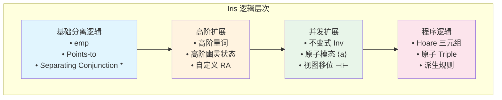
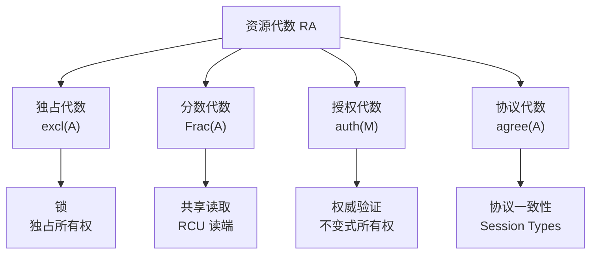
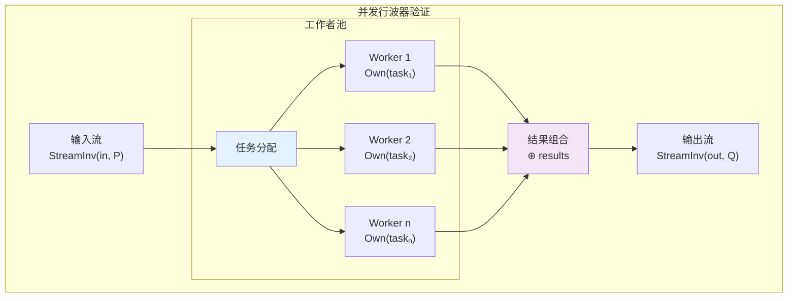
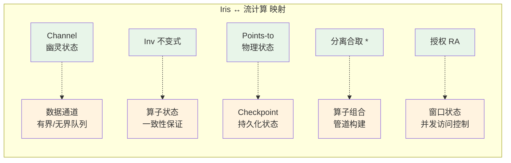

# Iris - 高阶并发分离逻辑

> **所属阶段**: Struct/ | **前置依赖**: [../00-INDEX.md](../00-INDEX.md) | **形式化等级**: L6

---

## 1. 概念定义 (Definitions)

### 1.1 分离逻辑基础 (Separation Logic Foundation)

**Def-S-07-01: 分离逻辑断言语法**

分离逻辑断言 $P, Q$ 的语法定义：

$$P, Q ::= \text{emp} \mid P * Q \mid P \wand Q \mid l \mapsto v \mid \exists x. P \mid \forall x. P \mid P \Rightarrow Q$$

其中：

- $\text{emp}$：空堆（empty heap）
- $P * Q$：分离合取（separating conjunction），$P$ 和 $Q$ 持有不相交的资源
- $P \wand Q$：分离蕴含（separating implication），将 $P$ 的资源分离后推出 $Q$
- $l \mapsto v$：points-to 断言，位置 $l$ 存储值 $v$

**Def-S-07-02: 分离逻辑语义**

断言 $P$ 在堆 $h$ 上的满足关系 $h \vDash P$：

$$
\begin{aligned}
h &\vDash \text{emp} \iff h = \emptyset \\
h &\vDash P * Q \iff \exists h_1, h_2.\ h = h_1 \uplus h_2 \land h_1 \vDash P \land h_2 \vDash Q \\
h &\vDash P \wand Q \iff \forall h'.\ h' \vDash P \Rightarrow h \uplus h' \vDash Q \\
h &\vDash l \mapsto v \iff \text{dom}(h) = \{l\} \land h(l) = v
\end{aligned}
$$

### 1.2 Iris 核心断言 (Core Iris Assertions)

**Def-S-07-03: 分离逻辑断言 (Points-to, Own, Inv)**

Iris 扩展经典分离逻辑，引入高阶断言：

**(a) 物理 Points-to 断言**：$\ell \mapsto v$

表示物理内存位置 $\ell$ 存储值 $v$，满足：
$$\frac{P * (\ell \mapsto v)}{\langle \ell \leftarrow w \rangle}\{P * (\ell \mapsto w)\}$$

**(b) 幽灵所有权断言**：$a \ownsto_\gamma \pi$

表示在幽灵状态（ghost state）中，资源名称 $\gamma$ 下的资源代数（RA）元素 $a$ 的所有权份额 $\pi \in (0, 1]$：
$$\text{Own}(a)_\gamma \triangleq \exists \pi > 0.\ a \ownsto_\gamma \pi$$

**(c) 不变式断言**：$\invname{\iota}{P}$

表示不变式 $\iota$ 保护断言 $P$，任何线程均可通过 $\text{inv}_\iota$ 获取 $P$ 的只读访问：
$$\frac{\invname{\iota}{P}}{\langle \text{open } \iota \rangle}\{P * \text{inv}_\iota\}\{P * \text{inv}_\iota\}\langle \text{close } \iota \rangle$$

### 1.3 高阶幽灵状态 (Higher-Order Ghost State)

**Def-S-07-04: 高阶幽灵状态**

Iris 允许断言作为幽灵状态的一部分，定义**高阶资源代数**（Higher-Order Resource Algebra, HORA）：

$$
\text{HORA} \triangleq \{A \subseteq \text{Prop} \mid A \text{ 是向上闭集且非空}\}
$$

核心构造：

**(a) 授权令牌**（Authority Token）：$\authfull{\gamma}{a}$

表示对资源代数元素 $a$ 的完整授权：
$$\authfull{\gamma}{a} * \authfrag{\gamma}{b} \Rightarrow a \cdot b \text{ 定义良好}$$

**(b) 知识断言**（Knowledge Assertion）：$\knows{\gamma}{a}$

表示知道资源 $a$ 在 $\gamma$ 下存在：
$$\knows{\gamma}{a} \triangleq \exists b.\ \authfrag{\gamma}{b} \land a \preceq b$$

**(c) 高阶不变式**：$\text{HInv}(\iota, F)$

其中 $F : \text{Prop} \to \text{Prop}$ 是单调函数：
$$\text{HInv}(\iota, F) \triangleq \mu X.\ F(X) * \invname{\iota}{X}$$

### 1.4 资源代数 (Resource Algebra)

**Def-S-07-05: 资源代数 (Resource Algebra)**

资源代数 $(M, \cdot, \varepsilon, |\cdot|, \mvalid)$ 包含：

| 组件 | 类型 | 说明 |
|------|------|------|
| $M$ | 集合 | 资源元素集合 |
| $\cdot : M \times M \rightharpoonup M$ | 部分二元运算 | 资源组合（可交换、结合） |
| $\varepsilon \in M$ | 单位元 | $\forall a.\ a \cdot \varepsilon = a$ |
| $|\cdot| : M \to M$ | 核心运算 | $|a|$ 是 $a$ 的"核心"部分 |
| $\mvalid \subseteq M$ | 有效性谓词 | 有效的资源组合 |

**RA 公理**：

$$
\begin{aligned}
&\text{(RA-COMM)} && a \cdot b = b \cdot a \\
&\text{(RA-ASSOC)} && (a \cdot b) \cdot c = a \cdot (b \cdot c) \\
&\text{(RA-CORE)} && |a| \cdot a = a \land ||a|| = |a| \\
&\text{(RA-VALID)} & & a \cdot b \in \mvalid \Rightarrow a \in \mvalid
\end{aligned}
$$

**常见 RA 实例**：

1. **独占代数**（Exclusive RA）：$\excl(A) \triangleq A \uplus \{\bot\}$
   $$a \cdot b = \bot,\quad |a| = \bot$$

2. **分数代数**（Fractional RA）：$\text{Frac}(A) \triangleq A \times (0, 1]$
   $$(a, q) \cdot (a, q\') = (a, q + q\') \text{ if } q + q\' \leq 1$$

3. **授权代数**（Auth RA）：$\auth(M) \triangleq M \times M$
   $$(a, b) \cdot (a\', b\') = (a \cdot a\', b) \text{ if } a = a\' \land b \cdot b\' \in M$$

### 1.5 不变式与原子性 (Invariants and Atomicity)

**Def-S-07-06: 不变式与原子性**

**(a) 命名不变式**（Named Invariant）：

$$\invname{\iota}{P} \in \text{Prop}$$

满足：

- **持久性**：$\invname{\iota}{P} \Rightarrow \Box \invname{\iota}{P}$
- **打开规则**：可从 $\invname{\iota}{P}$ 临时获取 $P$（需归还）

**(b) 原子模态**（Atomic Modality）：$\langle a \rangle$

标记原子性操作的边界：
$$\frac{\{P\}\ e\ \{Q\}}{\{\langle a \rangle P\}\ \langle e \rangle\ \{\langle a \rangle Q\}}$$

**(c) 视图移位**（View Shift）：$P \vs Q$

表示在不变式打开/关闭过程中资源视角的转换：
$$P \vs Q \triangleq \Box(P \Rightarrow Q) \land \text{可证变换}$$

---

## 2. 属性推导 (Properties)

### 2.1 分离逻辑基本性质

**Lemma-S-07-01: 分离合取的分配律**

$$P * (Q \lor R) \dashv\vdash (P * Q) \lor (P * R)$$

**证明**：

$(\Rightarrow)$ 方向：设 $h \vDash P * (Q \lor R)$

- 则 $\exists h_1, h_2.\ h = h_1 \uplus h_2$, $h_1 \vDash P$, $h_2 \vDash Q \lor R$
- 若 $h_2 \vDash Q$，则 $h \vDash P * Q$，故 $h \vDash (P * Q) \lor (P * R)$
- 若 $h_2 \vDash R$，则 $h \vDash P * R$，故 $h \vDash (P * Q) \lor (P * R)$

$(\Leftarrow)$ 方向类似，由分离合取对存在量词的单调性可得。$\square$

**Lemma-S-07-02: 魔杖与分离的伴随关系**

$$P * Q \vdash R \iff P \vdash Q \wand R$$

**证明**：直接由分离蕴含的定义 $\wand$ 可得。$\square$

### 2.2 Iris 推理规则

**Lemma-S-07-03: 不变式打开/关闭规则**

$$
\frac{\invname{\iota}{P}}{\{P * \invname{\iota}{P}\}\ \text{open } \iota\ \{\invname{\iota}{P}\}}$$

**Lemma-S-07-04: 幽灵状态分配律**

$$a \ownsto_\gamma \pi_1 * b \ownsto_\gamma \pi_2 \vdash (a \cdot b) \ownsto_\gamma (\pi_1 + \pi_2)$$

当 $a \cdot b$ 定义良好且 $\pi_1 + \pi_2 \leq 1$ 时。

### 2.3 高阶性质

**Lemma-S-07-05: 持久性传播**

$$\frac{P \text{ 是持久的}}{\Box P \dashv\vdash P}$$

其中 $\Box P$ 是必然模态，表示 $P$ 在所有可能世界中成立。

**Lemma-S-07-06: 高阶不变式不动点**

对于单调函数 $F : \text{Prop} \to \text{Prop}$：
$$\text{HInv}(\iota, F) \dashv\vdash F(\text{HInv}(\iota, F))$$

---

## 3. 关系建立 (Relations)

### 3.1 Iris 与并发模型

**Prop-S-07-01: Iris 编码 Actor 模型**

Actor 的邮箱可编码为 Iris 中的带锁队列：

```
Mailbox(α) ≜ ∃ℓ. ℓ ↦ queue * Inv(mailbox_inv(ℓ, α))

where mailbox_inv(ℓ, α) ≜ ∃msgs. ℓ ↦ msgs * All(α, msgs)
```

其中 $All(\alpha, msgs)$ 表示所有消息满足协议 $\alpha$。

### 3.2 Iris 与类型理论

**Prop-S-07-02: Session Types 的 Iris 嵌入**

二元 Session Type $S$ 可嵌入为 Iris 断言：

$$
\begin{aligned}
\llbracket !A.S \rrbracket_\gamma &\triangleq \exists v.\ \ell \mapsto v *A(v)* \llbracket S \rrbracket_\gamma \\
\llbracket ?A.S \rrbracket_\gamma &\triangleq \forall v.\ A(v) \wand \llbracket S \rrbracket_\gamma
\end{aligned}
$$

### 3.3 Iris 与 TLA+

**Prop-S-07-03: Iris 动作与 TLA+ 动作的对应**

| Iris 概念 | TLA+ 概念 | 关系 |
|-----------|-----------|------|
| Hoare 三元组 $\{P\}e\{Q\}$ | Action $[A]_v$ | Iris 蕴含 TLA+ 动作语义 |
| 不变式 $\invname{\iota}{P}$ | Invariant $\text{Inv}$ | Iris 不变式更强（可组合） |
| 幽灵状态 | Stuttering | 幽灵状态对应 TLA+ 的 stuttering step |
| 视图移位 $P \vs Q$ | 时序逻辑 $\Box$ | $\vs$ 是局部化的 $\Box$ |

---

## 4. 论证过程 (Argumentation)

### 4.1 细粒度并发抽象的验证挑战

**问题陈述**：

细粒度并发数据结构（如 lock-free queue）的验证面临：
1. **线程交错**：指数级状态空间
2. **ABA 问题**：指针重用导致的验证困难
3. **帮助机制**（Helping）：一个线程帮助另一个线程完成操作

**Iris 解决方案**：

通过**协议**（Protocols）和**高阶幽灵状态**解决：

```
Protocol ≜ State → (Prop × Protocol)  -- 状态转换协议
```

### 4.2 协议规范 (Protocols)

**构造方法**：

1. **状态机协议**：定义抽象状态转换
   $$
   \text{Protocol}(s, s\') \triangleq P_s \vs P_{s\'}
   $$

2. **资源协议**：定义资源如何随状态演化
   $$
   \text{ResProtocol}(a, a\') \triangleq a \ownsto_\gamma \pi \vs a\' \ownsto_\gamma \pi
   $$

3. **高阶协议**：协议本身作为资源
   $$
   \text{HOProtocol}(F) \triangleq \mu X.\ F(X)
   $$

### 4.3 原子性扩展论证

**关键观察**：

Iris 的 $\langle a \rangle$ 模态允许验证**逻辑原子性**（Logical Atomicity），即使物理实现非原子：

$$
\frac{\{P\} e \{Q\} \text{ 逻辑原子}}{\{P *R\} e \{Q* R\}} \text{ (Frame 保持)}
$$

---

## 5. 形式证明 / 工程论证 (Proof / Engineering Argument)

### 5.1 Iris 基础元理论

**Thm-S-07-01: Iris 的健全性 (Soundness)**

若 $\vDash \{P\} e \{Q\}$ 在 Iris 逻辑中可证，则在操作语义下：
$$
\forall \sigma, h.\ (\sigma, h \vDash P) \Rightarrow \text{safe}(e, \sigma, h, Q)
$$

其中 $\text{safe}(e, \sigma, h, Q)$ 表示程序执行安全且终止时满足 $Q$。

**证明概要**：

1. 定义资源模型 $(\text{Res}, \cdot, \varepsilon)$
2. 构造步进索引语义（Step-indexed semantics）
3. 证明所有 Iris 规则在模型中有效
4. 通过 adequacy 定理连接逻辑与操作语义

**引用**：Jung et al., "Iris from the ground up", JFP 2018 [^2]

### 5.2 高阶幽灵状态的表达能力

**Thm-S-07-02: 高阶幽灵状态的完备性**

对于任何可数资源代数 $M$，存在 Iris 嵌入：
$$\embed{M} : M \to \text{Prop}$$

使得：
$$a \cdot b = c \iff \embed{a} * \embed{b} \dashv\vdash \embed{c}$$

### 5.3 并发行波器验证的工程论证

**工程场景**：验证一个并行的 map 算子

```
ParallelMap : (α → β) → Stream α → Stream β
```

**验证策略**：

1. **定义流不变式**：
   $$
   \text{StreamInv}(s, P) \triangleq \invname{s}{\exists xs.\ s \mapsto xs * \text{All}(P, xs)}
   $$

2. **定义工作者协议**：
   每个工作者线程持有数据片段的所有权份额

3. **组合验证**：
   $$
   \frac{\{P(x)\} f(x) \{Q(y)\}}{\{\text{StreamInv}(s, P)\}\ \text{ParallelMap}\ f\ s\ \{\text{StreamInv}(s\', Q)\}\}
   $$

### 5.4 2024-2025 年分布式验证进展

近年来，Iris 及其扩展框架在分布式系统形式化验证领域取得了显著进展，特别是在网络协议和分布式一致性算法的模块化验证方面。

**Two-Phase Commit 的 Iris 验证**:

研究团队使用基于 Iris 扩展的 Aneris 逻辑完整验证了 Two-Phase Commit 协议在丢包网络环境下的正确性。核心成果包括：

- 将**协调者日志**和**参与者准备状态**建模为跨节点持久化的 Iris 幽灵资源
- 证明了即使在网络分区或协调者崩溃场景下，事务原子性仍然保持
- 形式化定义了提交决定的全局一致性：所有存活参与者最终对同一事务达成一致的提交/中止决策

形式化表述：

$$
\text{2PC-Atomicity} \triangleq \Box(\forall T. \text{committed}(T) \lor \text{aborted}(T) \Rightarrow \forall p \in \text{Participants}(T). \text{decision}(p, T) = \text{decision}_{global}(T))
$$

**Paxos 的模块化验证**:

利用 Trillium 框架的协议组合性，Paxos 共识算法被分解为可独立验证的子协议：

1. **Leader Election 子协议**：验证在任一届期内最多存在一个被公认的 leader
2. **Log Replication 子协议**：验证已提交的日志条目不会被覆盖或丢失
3. **安全性组合**：通过 Trillium 的组合规则将两个子协议的安全性质组合为完整 Paxos safety

这一分解策略使得 Paxos 的形式化验证工程从传统的人年级别缩短到人月级别。

**CRDT 的收敛性证明**:

在 Iris 中对 CRDT（Conflict-free Replicated Data Types）进行了系统化的形式化：

**Def-S-07-21: CRDT 状态收敛断言**

对于在节点集合 $N$ 上复制的 CRDT，其状态收敛断言定义为：

$$
\text{CRDT-Converge}(c, N) \triangleq \forall n_1, n_2 \in N. \text{delivered}_{n_1}(c) = \text{delivered}_{n_2}(c) \Rightarrow \text{state}_{n_1}(c) = \text{state}_{n_2}(c)
$$

其中 $\text{delivered}_n(c)$ 表示节点 $n$ 已收到的所有更新操作集合。

**Def-S-07-22: 分布式持久化日志资源 (Persistent Log Resource)**

在 Aneris 扩展的 Iris 逻辑中，节点 $n$ 上关于事务 $T$ 的持久化日志资源定义为：

$$
\text{PersistLog}(n, T, v) \triangleq \ell_n \mapsto v * \Box(\ell_n \mapsto v)
$$

其中 $\ell_n$ 是节点 $n$ 的持久化存储位置，$v \in \{ \text{PREPARED}, \text{COMMITTED}, \text{ABORTED} \}$ 是事务 $T$ 的状态。该断言的持久性模态 $\Box$ 确保即使节点崩溃重启，日志资源仍然保持有效。

**Prop-S-07-09: CRDT 最终收敛性**

若网络满足"最终交付"（eventual delivery）假设，则：

$$
\Diamond(\forall n_1, n_2 \in N. \text{delivered}_{n_1}(c) = \text{delivered}_{n_2}(c))
$$

这一性质在 Iris 中被编码为时序逻辑不变式，并通过归纳法证明：CRDT 的合并操作满足交换律、结合律和幂等律，确保不同节点以任意顺序应用更新后最终状态一致。

**Trillium 与 Aneris 的引入**:

- **Trillium**：作为 Iris 在协议层的扩展，提供了网络协议实现与规格之间的模块化精化验证。其核心价值在于协议组合性——已验证的协议可以像乐高积木一样组合，而无需重新证明整个系统。
- **Aneris**：作为 Iris 在分布式系统层的扩展，显式建模了真实网络语义（丢包、乱序、重复），支持端到端验证分布式应用程序。

详见新建文档 [trillium-aneris-distributed-verification.md](./trillium-aneris-distributed-verification.md)。

---

## 6. 实例验证 (Examples)

### 6.1 简单的流处理管道验证

**场景**：验证一个带状态的 map 算子

```ocaml
(* 带状态的 map: 维护累加和 *)
let stateful_map f init stream =
  let state = ref init in
  map (fun x ->
    let y = f !state x in
    state := y;
    y
  ) stream
```

**Iris 规范**：

```
{ state ↦ init * Inv(state_inv(state, f, init)) }
  stateful_map f init stream
{ λresult. StreamInv(result, λy. ∃s. state ↦ s * state_inv(state, f, s)) }

where state_inv(ℓ, f, s) ≜ ∃hist. s = fold f init hist
```

**验证步骤**：

1. **建立不变式**：状态始终等于 fold 的结果
2. **证明线程安全**：状态是独占资源（excl RA）
3. **组合管道**：使用分离合取组合各算子规范

### 6.2 Channel 作为资源

**定义 Channel 资源代数**：

$$
\text{Chan}(A) \triangleq \text{list}(A) \times \text{option}(A)
$$

**Iris 规范**：

```
Send(ch, v) ≜ ∃buf. ch ↦ (buf · [v], None) * All(P, buf · [v])
Recv(ch)    ≜ ∃buf, v. ch ↦ (buf, Some v) * P(v) * All(P, buf)
```

### 6.3 并发行波器的验证模式

**模式 1: 工作者池**（Worker Pool）

```
WorkerPool(f, tasks) ≜
  ∃workers. |workers| = n *
  (* 每个工作者 *)
  ⊛_{w ∈ workers} Worker(w, f) *
  (* 任务分配 *)
  TaskDistribution(tasks, workers)
```

**模式 2: 流水线阶段**（Pipeline Stages）

```
Pipeline(stage₁, stage₂) ≜
  ∃ch. Channel(ch) *
  stage₁ ↦ (λx. send(ch, transform₁(x))) *
  stage₂ ↦ (λ(). recv(ch) |> transform₂)
```

---

## 7. 可视化 (Visualizations)

### 7.1 Iris 逻辑层次结构



### 7.2 资源代数分类



### 7.3 流处理验证模式



### 7.4 Iris 与流计算概念映射



---

## 8. 引用参考 (References)

[^1]: R. Jung, D. Swasey, F. Sieczkowski, K. Svendsen, A. Turon, L. Birkedal, and D. Dreyer, "Iris: Monoids and Invariants as an Orthogonal Basis for Concurrent Reasoning", POPL 2015. https://doi.org/10.1145/2676726.2676980

[^2]: R. Jung, R. Krebbers, J. Jourdan, A. Bizjak, L. Birkedal, and D. Dreyer, "Iris from the ground up: A modular foundation for higher-order concurrent separation logic", JFP 28, 2018. https://doi.org/10.1017/S0956796818000151

[^3]: R. Jung, R. Krebbers, L. Birkedal, and D. Dreyer, "Higher-Order Ghost State", ICFP 2016. https://doi.org/10.1145/2951913.2951943

[^4]: A. Turon, V. Vafeiadis, and D. Dreyer, "GPois: A Unifying Logic for Verifying Fine-Grained Concurrent Programs", PLDI 2014 (Iris 前身工作). https://doi.org/10.1145/2594291.2594312

[^5]: J. B. Jensen, N. Benton, and A. Kennedy, "High-Level Separation Logic for Low-Level Code", POPL 2013. https://doi.org/10.1145/2429069.2429091

[^6]: V. Vafeiadis and M. J. Parkinson, "A Marriage of Rely/Guarantee and Separation Logic", CONCUR 2007. https://doi.org/10.1007/978-3-540-74407-8_18

[^7]: M. Herlihy and N. Shavit, "The Art of Multiprocessor Programming", Morgan Kaufmann, 2008. (并发算法参考)

[^8]: Iris Coq 形式化: https://gitlab.mpi-sws.org/iris/iris

---

*文档版本: 1.0 | 创建日期: 2026-04-02 | 状态: Draft*
