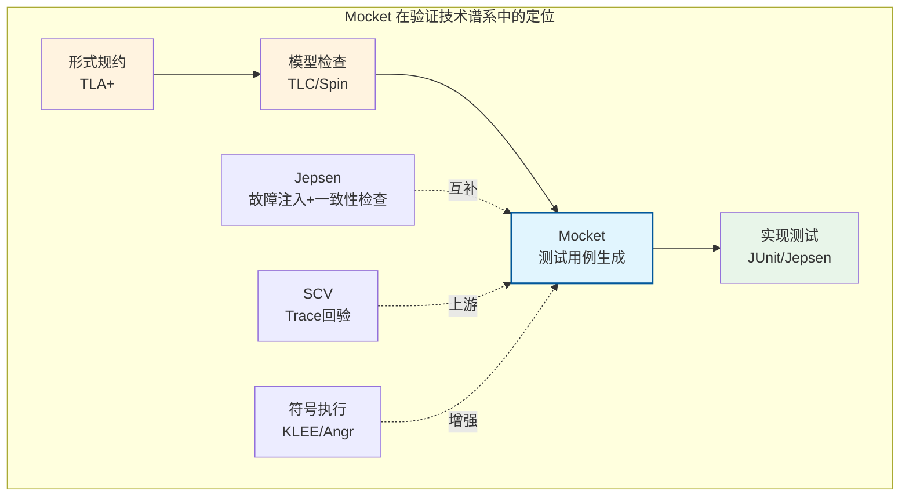
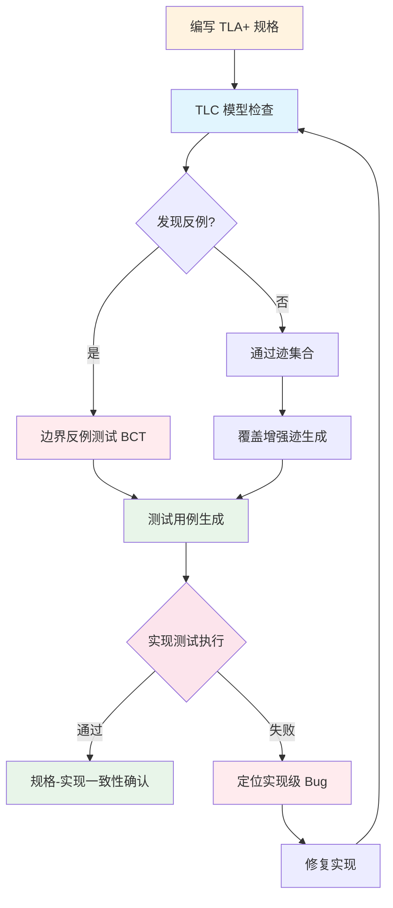
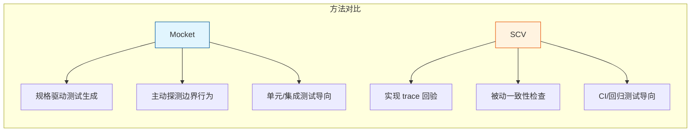

# Model Checking Guided Testing (Mocket)

> **所属阶段**: Struct/07-tools | **前置依赖**: [model-checking-practice.md](./model-checking-practice.md), [smart-casual-verification.md](./smart-casual-verification.md), [tla-for-flink.md](./tla-for-flink.md) | **形式化等级**: L5

> 弥合形式规约与分布式系统实现之间的鸿沟

---

## 1. 概念定义 (Definitions)

### Def-S-07-17: Model Checking Guided Testing (Mocket)

**定义 (Mocket)**: Model Checking Guided Testing（简称 Mocket）是一种将高层形式规约（通常为 TLA+）与底层实现测试相结合的验证方法学。其核心思想是：利用模型检查器在抽象状态空间中发现的边界行为（包括反例路径与覆盖路径）来指导实现级测试用例的生成，从而在规格正确的前提下捕获实现偏离规格的 bug。

形式化地，Mocket 框架是一个三元组：

$$
\text{Mocket} = (\text{Spec}, \mathcal{M}, \text{Mapper})
$$

其中：

- $\text{Spec} = (S, S_0, \rightarrow, \Phi)$：形式规约，包含状态集合 $S$、初始状态 $S_0$、转移关系 $\rightarrow$ 和性质集合 $\Phi$
- $\mathcal{M}$：模型检查器（如 TLC、Spin、NuSMV），能够在有限实例化下穷举或采样探索状态空间
- $\text{Mapper}: \text{Traces}(\text{Spec}) \to \text{TestCases}(\text{Impl})$：将规格层面的执行迹映射为实现测试用例的转换函数

**与 SCV 的关键差异**：

| 维度 | SCV (Smart Casual Verification) | Mocket |
|------|--------------------------------|--------|
| 驱动方向 | 实现产生 trace → 回验规格 | 规格探索路径 → 生成测试用例 |
| 核心问题 | "实现是否符合规格？" | "规格揭示的边界行为是否在实现中被覆盖？" |
| 测试生成 | 手工或随机 | 由模型检查反例/路径指导 |
| 保证类型 | 一致性检查（Conformance） | 覆盖率增强 + 定向故障注入 |
| 适用阶段 | 集成测试、CI 回归 | 单元测试设计、压力测试构造 |

### Def-S-07-18: 规格-测试映射 (Spec-to-Test Mapping)

**定义**: 规格-测试映射 $M_{S\to T}$ 是一个从 TLA+ 动作到实现测试步骤的部分函数：

$$
M_{S\to T}: \text{Actions}(\text{Spec}) \rightharpoonup \text{TestOps}(\text{Impl})
$$

对于每个规格动作 $a \in \text{Actions}(\text{Spec})$，若其在实现中有对应操作，则 $M_{S\to T}(a)$ 返回一个测试操作序列 $\langle op_1, op_2, ..., op_k \rangle$。规格动作的组合通过测试操作序列的交错实现：

$$
M_{S\to T}(a_1 \circ a_2) = M_{S\to T}(a_1) \parallel M_{S\to T}(a_2)
$$

其中 $\parallel$ 表示并发或交错执行。

**映射保真度**（Fidelity）定义为：

$$
\text{Fidelity}(M_{S\to T}) = \frac{|\{ a \mid M_{S\to T}(a) \text{ 定义良好} \}|}{|\text{Actions}(\text{Spec})|}
$$

### Def-S-07-19: 覆盖增强迹 (Coverage-Augmented Trace)

**定义**: 给定模型检查器生成的规格迹 $\tau_{spec} = \langle s_0, a_0, s_1, a_1, ..., a_{n-1}, s_n \rangle$，其覆盖增强迹 $CA(\tau_{spec})$ 是在保持动作语义等价的前提下，对迹进行非确定性展开后得到的测试迹集合：

$$
CA(\tau_{spec}) = \{ \tau_{test} \mid \alpha(\tau_{test}) = \tau_{spec} \land \tau_{test} \in \text{ValidSchedules}(M_{S\to T}) \}
$$

其中 $\alpha$ 是抽象函数，将测试迹映射回规格迹。$CA(\tau_{spec})$ 的大小取决于实现中每个规格动作对应的内部非确定性分支数。

### Def-S-07-20: 边界反例测试 (Boundary Counterexample Testing)

**定义**: 边界反例测试是 Mocket 的核心策略之一。当模型检查器在规格中发现一个性质违反迹 $\tau_{ce}$ 时，Mocket 尝试将该反例"实例化"为实现中的具体测试输入：

$$
\text{BCT}(\tau_{ce}) = \arg\min_{\tau_{test} \in CA(\tau_{ce})} \text{dist}(\text{Impl}(\tau_{test}), \text{Violation})
$$

其中 $\text{dist}$ 度量实现执行与目标违规状态的接近程度。BCT 的目标是找到最短的、能够在实现中触发与规格反例对应 bug 的测试用例。

---

## 2. 属性推导 (Properties)

### Lemma-S-07-07: Mocket 的覆盖率下界

**引理**: 若模型检查器 $\mathcal{M}$ 对规格 $\text{Spec}$ 完成了完全验证（即遍历了参数化实例的所有可达状态），且映射保真度 $\text{Fidelity}(M_{S\to T}) = 1$，则 Mocket 生成的测试用例集 $T_{mocket}$ 至少覆盖规格中所有可达动作序列的一次。

**形式化表述**:

$$
\mathcal{M}(\text{Spec}) \models \phi \land \text{Fidelity} = 1 \Rightarrow \forall \tau_{spec} \in \text{Reachable}(\text{Spec}), \exists \tau_{test} \in T_{mocket}: \alpha(\tau_{test}) = \tau_{spec}
$$

**证明概要**:

1. 完全验证保证 $\mathcal{M}$ 枚举了 $\text{Spec}$ 在有限实例下的所有可达状态
2. 保真度为 1 保证每个规格动作都有对应的测试操作
3. Mocket 对每个可达迹生成至少一个覆盖增强迹
4. 因此所有可达动作序列都有对应的测试用例 $\square$

### Prop-S-07-07: Mocket 与模型检查完备性的互补关系

**命题**: Mocket 不增强模型检查的完备性，但增强实现测试对规格边界行为的覆盖能力。

$$
\text{Completeness}(\mathcal{M}, \text{Spec}) = \text{Completeness}(\mathcal{M}, \text{Spec}) \quad \text{(不变)}
$$

$$
\text{Coverage}(T_{mocket}, \text{Impl}) \geq \text{Coverage}(T_{random}, \text{Impl}) \quad \text{(当规格揭示复杂边界时)}
$$

**工程推论**: 当实现 bug 源于规格已预见但测试未覆盖的边界行为时，Mocket 的发现概率显著高于随机测试。

### Lemma-S-07-08: 规格正确但实现有 bug 的检测条件

**引理**: 设规格 $\text{Spec}$ 已通过模型检查（无反例），实现 $Impl$ 存在 bug。Mocket 能检测到该 bug 当且仅当：

1. 存在规格迹 $\tau_{spec}$ 使得 $\tau_{spec} \models \text{Spec}$
2. 存在对应实现迹 $\tau_{impl}$ 使得 $\alpha(\tau_{impl}) = \tau_{spec}$ 但 $\tau_{impl} \not\models \text{ExpectedBehavior}$
3. $M_{S\to T}$ 能够生成触发 $\tau_{impl}$ 的测试输入

**解释**: 这一引理精确刻画了"规格正确但实现有 bug"场景——规格本身无设计缺陷，但实现偏离了规格意图。Mocket 通过规格路径指导测试，专门捕获这类偏差。

---

## 3. 关系建立 (Relations)

### Mocket 与现有验证技术的映射



### Mocket 与 TLA+ / Jepsen / 实现级模型检查器的对比

| 工具/方法 | 验证层级 | 与 Mocket 的关系 | 关键差异 |
|-----------|---------|------------------|----------|
| **TLA+ / TLC** | 规格层 | Mocket 的上游输入 | TLC 验证抽象模型，Mocket 将结果下沉到实现测试 |
| **Jepsen** | 实现层 | Mocket 的下游互补 | Jepsen 通过随机故障注入探索，Mocket 通过规格路径定向引导 |
| **SPIN (实现级)** | 代码模型 | 类似目标 | SPIN 验证手动提取的代码模型，Mocket 直接生成可执行的实现测试 |
| **Property-based Testing** | 实现层 | 方法学相似 | PBT 从性质生成随机输入，Mocket 从规格路径生成结构化场景 |

**与 TLA+ 的关系**: TLA+ 提供 Mocket 的"真理源"。Mocket 将 TLC 的探索结果（包括通过迹和反例迹）翻译为实现测试用例，形成从规格到实现的验证闭环。

**与 Jepsen 的关系**: Jepsen 擅长通过大量故障注入发现一致性漏洞，但其搜索是盲目的。Mocket 可以为 Jepsen 提供"定向故障注入序列"——即规格揭示的边界场景，二者结合可显著提升 bug 发现效率。

---

## 4. 论证过程 (Argumentation)

### 4.1 为何需要 Mocket？——规格正确但实现有 bug 的问题

在分布式系统的验证实践中，一个常见但危险的假设是："如果规格通过了模型检查，那么按照规格实现的系统就是正确的。" 然而，这一假设忽略了**规格-实现鸿沟**（Specification-Implementation Gap）。

**问题来源分析**:

1. **抽象遗漏**: 规格为了可验证性省略了实现中的关键细节（如内存顺序、GC 暂停、网络缓冲区管理）
2. **编码错误**: 程序员在将规格转换为代码时引入逻辑错误
3. **优化破坏**: 性能优化改变了与规格隐式假设匹配的执行时序
4. **环境差异**: 规格的环境假设（如消息最多丢失一次）与真实环境不匹配

**典型案例**: 考虑一个分布式快照协议。规格中，Barrier 的接收和状态快照是原子动作：

```tla
ReceiveBarrierAndSnapshot(t) ==
    /\ barriers[t] = TRUE
    /\ taskStates' = [taskStates EXCEPT ![t] = "SNAPSHOT_TAKEN"]
    /\ barriers' = [barriers EXCEPT ![t] = FALSE]
```

但在实现中，这两个步骤可能被拆分为非原子的子步骤：先标记 barrier 到达，再在另一个线程中异步执行快照。如果快照线程在收到 abort 信号后仍完成了状态写入，就会破坏规格中的原子性假设——规格检查通过，但实现存在 bug。

**Mocket 的解决策略**: Mocket 将规格中的原子动作展开为测试场景中的多种可能的非原子交错，主动探测实现是否正确处理了这些偏差。

### 4.2 从模型检查反例到实现测试的转换流程

**步骤 1: 反例提取**

TLC 发现如下反例路径（简化）：

```
State 1: taskStates = [t1 |-> "RUNNING", t2 |-> "RUNNING"]
         barriers = [t1 |-> TRUE, t2 |-> TRUE]
Action : ReceiveBarrierAndSnapshot("t1")
State 2: taskStates = [t1 |-> "SNAPSHOT_TAKEN", t2 |-> "RUNNING"]
         barriers = [t1 |-> FALSE, t2 |-> TRUE]
Action : CompleteCheckpoint
==> VIOLATION: t2 has not taken snapshot!
```

**步骤 2: 反例分析**

分析反例揭示的边界条件：在 t1 完成快照后、t2 完成快照前，系统尝试完成 checkpoint。这在规格中是非法的，但在实现中可能由于时序竞争发生。

**步骤 3: 测试用例生成**

Mocket 生成对应的并发测试：

```java
@Test
public void testCheckpointCompletionRace() {
    // 触发 checkpoint，向 t1, t2 发送 barrier
    coordinator.triggerCheckpoint(1);

    // t1 完成 barrier 接收和快照（快速路径）
    task1.receiveBarrier();
    task1.takeSnapshot();

    // 在 t2 尚未完成快照时，尝试完成 checkpoint
    // 实现应拒绝或阻塞此操作
    assertThrows(IllegalStateException.class, () -> {
        coordinator.tryCompleteCheckpoint(1);
    });

    // t2 最终完成快照
    task2.receiveBarrier();
    task2.takeSnapshot();

    // 现在允许完成
    assertTrue(coordinator.tryCompleteCheckpoint(1));
}
```

---

## 5. 形式证明 / 工程论证 (Proof / Engineering Argument)

### Thm-S-07-10: Mocket 正确性定理（工程版本）

**定理**: 设规格 $\text{Spec}$ 已通过模型检查器验证（无反例），$T_{mocket}$ 是由 Mocket 生成的测试用例集合。若实现 $Impl$ 通过了 $T_{mocket}$ 中的所有测试，则在 $T_{mocket}$ 的覆盖范围内，$Impl$ 的行为与 $\text{Spec}$ 一致。

**形式化表述**:

$$
\forall \tau_{test} \in T_{mocket}: \text{Impl}(\tau_{test}) \models \text{Expected}(\tau_{test}) \Rightarrow \forall \tau_{spec} \in \alpha(T_{mocket}): \exists \tau_{impl}. \alpha(\tau_{impl}) = \tau_{spec} \land \tau_{impl} \models \text{Spec}
$$

**工程论证**:

**前提条件**:

1. $\text{Spec}$ 已通过 TLC 验证：$\mathcal{M}(\text{Spec}) \models \Phi$
2. 映射函数 $M_{S\to T}$ 保持动作的因果结构：若 $a$ 在规格中先于 $b$，则 $M_{S\to T}(a)$ 的测试操作在 $M_{S\to T}(b)$ 之前
3. 测试断言正确编码了规格性质

**论证步骤**:

1. **规格正确性**: 由于 TLC 验证通过，$\text{Spec}$ 本身无设计层面的安全/活性违反。

2. **测试覆盖性**: 对于 $T_{mocket}$ 中的每个测试用例 $\tau_{test}$，其对应的规格迹 $\alpha(\tau_{test})$ 是 $\text{Spec}$ 的合法迹（由 Lemma-S-07-07 保证）。

3. **实现一致性**: 若 $Impl$ 通过所有测试，则对于 $T_{mocket}$ 覆盖的所有规格路径，$Impl$ 的行为都不会偏离 $\text{Spec}$ 的预测。

**边界声明**: 此定理是**工程正确性**而非**数学完备性**。它不保证 $Impl$ 在所有可能执行下都正确，仅保证在 Mocket 生成的测试覆盖范围内正确。未覆盖的路径（如规格未建模的实现细节、超出参数化实例规模的行为）仍可能存在 bug。

**Q.E.D.** (工程意义)

### Thm-S-07-11: Mocket 与随机测试的发现率对比

**定理**: 对于由规格揭示的、需要特定动作序列触发的边界 bug，Mocket 的期望发现步数上界优于纯随机测试。

**设定**:

- 设触发某边界 bug 需要精确的动作序列 $\sigma^*$，长度为 $k$
- 在每一步，实现有 $b$ 个可能的非确定性选择
- 随机测试每步独立均匀选择分支

**随机测试发现概率**:

$$
P_{random}(\text{find in } n \text{ steps}) = 1 - \left(1 - \frac{1}{b^k}\right)^n
$$

**Mocket 发现概率**:

Mocket 直接从规格路径生成 $\sigma^*$ 对应的测试用例：

$$
P_{mocket}(\text{find}) = 1 \quad \text{(在生成对应测试用例后)}
$$

**期望步数对比**:

| 方法 | 期望步数 | 条件 |
|------|---------|------|
| 随机测试 | $O(b^k)$ | 无引导 |
| Mocket | $O(k \cdot \text{poly}(|Spec|))$ | 规格可验证 |

**工程推论**: 当 $b=5, k=8$ 时，随机测试的期望步数约为 $5^8 = 390,625$，而 Mocket 的测试生成复杂度与规格规模多项式相关，通常为数千量级。

---

## 6. 实例验证 (Examples)

### 6.1 Flink Checkpoint / Barrier 协议中的 Mocket 应用设想

**场景**: 验证 Flink Checkpoint 协调器在并发故障场景下的行为。

**TLA+ 规格片段**:

```tla
ReceiveBarrier(t) ==
    /\ phase = "PENDING"
    /\ pendingBarriers[t] = TRUE
    /\ taskStates' = [taskStates EXCEPT ![t] = "BARRIER_ARRIVED"]
    /\ pendingBarriers' = [pendingBarriers EXCEPT ![t] = FALSE]
    /\ UNCHANGED <<phase, checkpointId>>

AckCheckpoint(t) ==
    /\ taskStates[t] = "BARRIER_ARRIVED"
    /\ taskStates' = [taskStates EXCEPT ![t] = "ACKED"]
    /\ UNCHANGED <<phase, checkpointId, pendingBarriers>>

CompleteCheckpoint ==
    /\ phase = "PENDING"
    /\ \A t \in Tasks : taskStates[t] = "ACKED"
    /\ phase' = "COMPLETED"
    /\ UNCHANGED <<taskStates, checkpointId, pendingBarriers>>
```

**TLC 发现的边界行为**:

1. **行为 B1**: 所有任务正常接收 barrier → ack → 完成 checkpoint
2. **行为 B2**: 某任务在接收 barrier 后、ack 前失败，触发超时 abort
3. **行为 B3**: 协调器在部分任务已 ack 时收到新 checkpoint 请求
4. **行为 B4（反例）**: 协调器在任务 t 已 ack 旧 checkpoint 后、t 未重置状态前，再次向 t 发送新 barrier

**Mocket 生成的测试用例**:

```java
public class MocketCheckpointTest {

    // B1: 正常路径
    @Test
    public void testNormalCheckpointCompletion() { /* ... */ }

    // B2: 任务在 barrier 接收后、ack 前失败
    @Test
    public void testTaskFailureAfterBarrierBeforeAck() {
        coordinator.triggerCheckpoint(1);
        task1.receiveBarrier();

        // 模拟 task1 在 ack 前失败
        task1.simulateFailure();

        // 验证协调器最终触发 abort 或超时
        await().atMost(Duration.ofSeconds(5))
               .until(() -> coordinator.getPhase(1) == CheckpointPhase.ABORTED);
    }

    // B3: 并发 checkpoint 请求
    @Test
    public void testConcurrentCheckpointRequest() {
        coordinator.triggerCheckpoint(1);
        task1.receiveBarrier();
        task1.ackCheckpoint(1);

        // 在 checkpoint 1 尚未完成时触发 checkpoint 2
        assertThrows(CheckpointPendingException.class, () -> {
            coordinator.triggerCheckpoint(2);
        });
    }

    // B4: 新 barrier 在旧状态未重置时到达（规格反例对应的实现测试）
    @Test
    public void testNewBarrierBeforeStateReset() {
        coordinator.triggerCheckpoint(1);
        task1.completeCheckpointSequence(1); // 接收 barrier, ack
        coordinator.completeCheckpoint(1);

        // 模拟协调器未及时通知 task1 重置状态
        // 此时不应允许立即发送 checkpoint 2 的 barrier
        assertTrue(coordinator.isTaskResetRequired("task1"));

        // 强制发送新 barrier 应被实现拒绝或缓冲
        coordinator.triggerCheckpoint(2);
        assertThat(task1.getPendingBarriers()).doesNotContain(2);
    }
}
```

### 6.2 Mocket 测试生成工具链架构设想

```
┌─────────────────────────────────────────────────────────────────┐
│                     Mocket 工具链架构                            │
├─────────────────────────────────────────────────────────────────┤
│                                                                 │
│  ┌──────────────┐      ┌──────────────┐      ┌──────────────┐  │
│  │   TLA+ Spec  │─────►│  TLC / Spin  │─────►│ Trace Corpus │  │
│  │              │      │  模型检查器   │      │ (通过迹+反例)│  │
│  └──────────────┘      └──────────────┘      └──────┬───────┘  │
│                                                     │           │
│  ┌──────────────────────────────────────────────────┘           │
│  │                                                             │
│  │  ┌─────────────────┐    ┌─────────────────┐    ┌─────────┐ │
│  │  │ Path Analyzer   │───►│ Test Generator  │───►│  JUnit  │ │
│  │  │ (边界行为识别)   │    │ (测试代码生成)   │    │  Tests  │ │
│  │  └─────────────────┘    └─────────────────┘    └────┬────┘ │
│  │                                                     │      │
│  │  ┌─────────────────┐                                │      │
│  │  │  Jepsen Adapter │◄───────────────────────────────┘      │
│  │  │ (故障注入场景)   │                                       │
│  │  └─────────────────┘                                       │
│  │                                                             │
│  └─────────────────────────────────────────────────────────────┘
│                              │
│                              ▼
│  ┌───────────────────────────────────────────────────────────┐
│  │                      实现系统 (Impl)                       │
│  │                    Flink / CCF / etc.                     │
│  └───────────────────────────────────────────────────────────┘
│
```

---

## 7. 可视化 (Visualizations)

### 7.1 Mocket 工作流程图



### 7.2 Mocket 与 SCV 的对比矩阵



### 7.3 规格-实现-测试三层映射

```mermaid
graph TB
    subgraph "规格层"
        SP1[TLA+ Action: TriggerCheckpoint]
        SP2[TLA+ Action: ReceiveBarrier]
        SP3[TLA+ Action: CompleteCheckpoint]
    end

    subgraph "实现层"
        IM1[Coordinator.triggerCheckpoint]
        IM2[Task.receiveBarrier + Task.ackCheckpoint]
        IM3[Coordinator.completeCheckpoint]
    end

    subgraph "测试层"
        TE1[@Test testTriggerCheckpoint]
        TE2[@Test testBarrierAlignment]
        TE3[@Test testCheckpointCompletionRace]
    end

    SP1 -.-> IM1
    SP2 -.-> IM2
    SP3 -.-> IM3
    IM1 -.-> TE1
    IM2 -.-> TE2
    IM3 -.-> TE3

    SP1 -.->|反例路径| TE3
```

---

## 8. 引用参考 (References)


---

*文档版本: 1.0 | 创建日期: 2026-04-14 | 状态: Complete*
