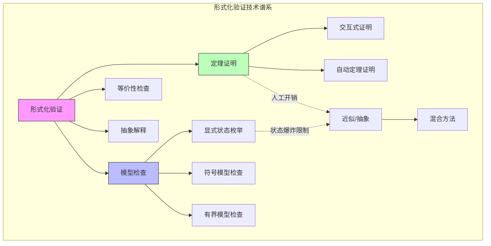
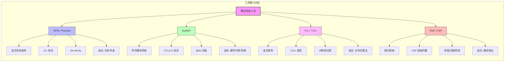
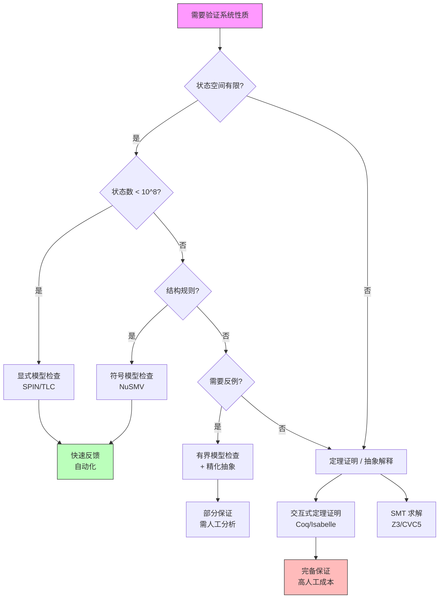
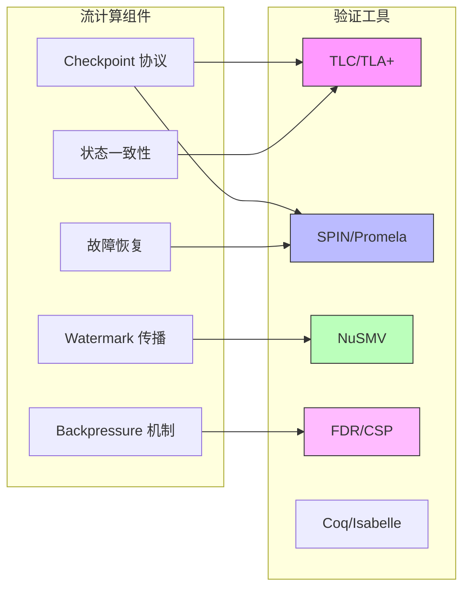

# 模型检查在流计算验证中的应用

> 所属阶段: Struct | 前置依赖: [00-INDEX.md](../00-INDEX.md) | 形式化等级: L4

## 1. 概念定义 (Definitions)

### Def-S-07-10: 模型检查 (Model Checking)

**定义**: 模型检查是一种自动化的形式化验证技术，用于检验有限状态系统是否满足给定的时序逻辑规范。给定一个系统模型 $M = (S, S_0, R, L)$，其中：

- $S$ 是有限状态集合
- $S_0 \subseteq S$ 是初始状态集合
- $R \subseteq S \times S$ 是状态转移关系
- $L: S \rightarrow 2^{AP}$ 是标记函数，$AP$ 为原子命题集合

模型检查验证 $M \models \phi$，其中 $\phi$ 是时序逻辑公式。若 $M \not\models \phi$，模型检查器产生**反例路径**（counterexample），展示导致规范违反的具体执行序列。

**直观解释**: 模型检查将系统视为状态机，通过穷举或符号化遍历所有可能的状态空间，自动验证系统行为是否满足期望属性。与测试不同，它提供的是数学上的完备保证——如果模型检查通过，则在模型抽象层级上不存在违反规范的漏洞。

### Def-S-07-11: LTL/CTL时序逻辑

**定义**: 时序逻辑是描述系统随时间演化的形式化语言。

**LTL (Linear Temporal Logic)** 沿单一时间线描述属性：

$$\phi ::= p \mid \neg\phi \mid \phi \lor \phi \mid \bigcirc\phi \mid \phi \, \mathcal{U} \, \phi$$

其中：

- $\bigcirc\phi$: "下一个状态满足 $\phi$" (Next)
- $\phi \, \mathcal{U} \, \psi$: "$\phi$ 持续成立直到 $\psi$ 成立" (Until)
- $\Diamond\phi \equiv \top \, \mathcal{U} \, \phi$: "最终 $\phi$ 成立" (Eventually)
- $\Box\phi \equiv \neg\Diamond\neg\phi$: "始终 $\phi$ 成立" (Globally)

**CTL (Computation Tree Logic)** 在分支时间上量化：

$$\phi ::= p \mid \neg\phi \mid \phi \lor \phi \mid \mathbf{A}\psi \mid \mathbf{E}\psi$$

其中路径公式 $\psi$ 包含：

- $\mathbf{X}\phi$: 所有/存在路径的下一状态满足 $\phi$
- $\mathbf{F}\phi$: 所有/存在路径最终满足 $\phi$
- $\mathbf{G}\phi$: 所有/存在路径始终满足 $\phi$
- $\phi \, \mathbf{U} \, \psi$: 所有/存在路径上 $\phi$ 直到 $\psi$

**表达能力**: LTL 适合描述单一执行路径上的属性（如"请求最终总会被响应"），CTL 适合描述分支选择（如"存在一条路径使系统能恢复"）。二者表达能力不可比较。

### Def-S-07-12: 状态爆炸问题 (State Space Explosion)

**定义**: 状态爆炸是指待验证系统的状态空间大小随系统组件数量呈指数级增长的现象。对于由 $n$ 个并发组件构成的系统，若每个组件有 $k$ 个状态，则最坏情况下组合状态空间大小为 $k^n$。

形式化地，设系统为 $n$ 个有限状态机的并行组合 $M = M_1 \parallel M_2 \parallel \cdots \parallel M_n$，则：

$$|S_M| = \prod_{i=1}^{n} |S_{M_i}|$$

**后果**: 状态爆炸是模型检查应用于大规模系统的根本性障碍。对于流计算系统（如 Flink 作业含数百个算子），朴素的状态空间构造将导致内存耗尽或验证不可终止。

---

## 2. 属性推导 (Properties)

### Lemma-S-07-01: 模型检查的完备性

**引理**: 对于有限状态系统 $M$ 和 LTL/CTL 公式 $\phi$，模型检查算法是**可判定的**（decidable）。

**证明概要**:

1. 有限状态系统只有有限条路径（在 Büchi 自动机意义上）
2. LTL 公式可转换为等价的 Büchi 自动机 $A_{\neg\phi}$
3. 检验 $M \models \phi$ 等价于检验 $L(M) \cap L(A_{\neg\phi}) = \emptyset$
4. 该交集非空性可通过图算法在 $O(|M| \times |A_{\neg\phi}|)$ 时间内判定 $\square$

### Lemma-S-07-02: 符号模型检查的空间复杂度

**引理**: 使用 BDD (Binary Decision Diagram) 的符号模型检查可将空间复杂度从显式状态的 $O(|S|)$ 降低到 $O(\log |S|)$ 的 BDD 节点数。

**说明**: 虽然最坏情况下 BDD 大小仍与状态数呈指数关系，但对于具有规则结构的系统（如对称性、局部性），BDD 可提供指数级压缩。

### Prop-S-07-01: 流计算系统的可验证属性分类

**命题**: 流计算系统的关键属性可归类为以下可验证模式：

| 属性类别 | LTL/CTL 表达 | 验证目标 |
|---------|-------------|---------|
| 安全性 (Safety) | $\Box \neg \text{Error}$ | 坏状态永不可达 |
| 活性 (Liveness) | $\Box(\text{Request} \rightarrow \Diamond \text{Response})$ | 请求终被响应 |
| 公平性 (Fairness) | $\Box\Diamond \text{Enabled} \rightarrow \Box\Diamond \text{Executed}$ | 无限次机会蕴含无限次执行 |
| 一致性 (Consistency) | $\mathbf{AG}(\text{Committed} \rightarrow \mathbf{AX} \text{Visible})$ | 提交后立即可见 |
| 终止性 (Termination) | $\mathbf{AF} \text{Terminated}$ | 所有路径最终终止 |

---

## 3. 关系建立 (Relations)

### 模型检查 vs 其他验证方法



### 流计算验证中的方法映射

| 验证目标 | 推荐工具 | 方法类别 | 适用场景 |
|---------|---------|---------|---------|
| Checkpoint 协议正确性 | TLC / TLA+ | 模型检查 | 分布式协调逻辑 |
| 算子状态一致性 | SPIN / Promela | 模型检查 | 并发状态机 |
| Exactly-Once 语义 | NuSMV | 符号检查 | 状态空间压缩 |
| Backpressure 无死锁 | FDR / CSP | 精化检查 | 进程代数建模 |
| Watermark 传播性质 | 定理证明 (Coq/Isabelle) | 交互式证明 | 复杂数学性质 |
| 类型安全 | 类型系统 / Liquid Types | 静态分析 | 编译时保证 |

---

## 4. 论证过程 (Argumentation)

### 4.1 模型检查的优势与局限

**优势**:

- **全自动**: 验证过程无需人工干预，产生反例指导调试
- **精确**: 在模型层面上提供数学完备性保证
- **增量**: 可逐步精化模型，验证早期设计决策

**局限**:

- **状态爆炸**: 并发组件导致状态空间指数增长
- **抽象开销**: 从代码到形式模型的转换需要专业知识
- **性质局限**: 难以验证涉及无限域或复杂算术的性质

### 4.2 流计算系统的建模挑战

流计算系统（如 Flink、Spark Streaming）具有以下特征，增加了建模复杂度：

1. **无限数据流**: 需建模为带 watermark 的有限近似或参数化系统
2. **动态并行度**: 算子实例数运行时变化，需参数化建模
3. **故障恢复**: Checkpoint 和 restore 引入额外的非确定性
4. **时间语义**: Event time vs processing time 需要显式时钟建模

### 4.3 反例分析与调试价值

模型检查的核心价值之一是产生**可执行反例**。当验证失败时，反例路径展示了从初始状态到违规状态的完整执行序列。这在流计算调试中尤为重要：

- **死锁反例**: 展示导致循环等待的算子交互序列
- **数据丢失反例**: 展示在特定故障模式下未完成的 checkpoint 序列
- **一致性违反反例**: 展示读取到未提交状态的时序条件

---

## 5. 形式证明 / 工程论证 (Proof / Engineering Argument)

### 5.1 工具技术原理

#### SPIN (Promela)

SPIN 使用 **on-the-fly** 验证策略，在状态生成的同时进行性质检验，避免构造完整状态图。

**核心算法**: 嵌套深度优先搜索 (Nested DFS) 用于检测接受循环（LTL 满足性）。

```
时间复杂度: O(|S| + |R|) 对于显式枚举
空间复杂度: O(|S|) 最坏情况
```

**Promela 建模示例** (简化 Checkpoint 协调):

```promela
// 简化模型: Checkpoint 协调器与 Task 的交互
mtype = { CP_REQUEST, CP_ACK, CP_COMPLETE };

chan coord_to_task = [1] of { mtype };
chan task_to_coord = [1] of { mtype };

proctype Coordinator() {
    do
    :: coord_to_task!CP_REQUEST;
       task_to_coord?CP_ACK;
       task_to_coord?CP_COMPLETE;
    od
}

proctype Task() {
    do
    :: coord_to_task?CP_REQUEST;
       task_to_coord!CP_ACK;
       // 模拟 checkpoint 执行
       task_to_coord!CP_COMPLETE;
    od
}

init {
    run Coordinator();
    run Task();
}

// LTL 性质: 请求终被完成
// ltl p0 { [](cp_requested -> <>cp_completed) }
```

#### NuSMV (符号模型检查)

NuSMV 使用 **有序二叉决策图 (OBDD)** 符号化表示状态集合和转移关系。

**核心优势**: 通过布尔函数的规范形式实现状态空间压缩。对于具有规则结构的系统，BDD 大小可与状态数对数相关。

**关键操作**:

- **像计算 (Image computation)**: $\text{Img}(R, S) = \{ s' \mid \exists s \in S: (s, s') \in R \}$
- **不动点迭代**: 计算 $\mu Z . f(Z)$ 或 $\nu Z . f(Z)$ 用于 CTL 模型检查

#### TLC (TLA+ 模型检查器)

TLC 验证 TLA+ 规范，支持：

- **显式状态枚举**: 适合中等规模系统
- **对称性约简**: 自动识别并合并对称状态
- **分布式模型检查**: 支持多机并行验证

**TLA+ 风格建模**:

```tla
\* 简化: Flink Checkpoint 协议的状态机
MODULE CheckpointProtocol

VARIABLES phase, acks

Phases == { "IN_PROGRESS", "COMPLETED", "ABORTED" }

Init ==
    /\ phase = "IN_PROGRESS"
    /\ acks = 0

ReceiveAck ==
    /\ phase = "IN_PROGRESS"
    /\ acks' = acks + 1
    /\ UNCHANGED phase

Complete ==
    /\ phase = "IN_PROGRESS"
    /\ acks = N_TASKS  \* 假设常量
    /\ phase' = "COMPLETED"
    /\ UNCHANGED acks

Abort ==
    /\ phase = "IN_PROGRESS"
    /\ phase' = "ABORTED"
    /\ UNCHANGED acks

Next == ReceiveAck \/ Complete \/ Abort

\* 不变式: 完成时所有 ack 已收到
Inv == phase = "COMPLETED" => acks = N_TASKS

================================================================
```

#### FDR (CSP 精化检查)

FDR 验证 CSP 进程的**精化关系**:

- **迹精化 (Trace refinement)**: $P \sqsubseteq_T Q$ —— $Q$ 的所有可见行为被 $P$ 允许
- **失败精化 (Failures refinement)**: $P \sqsubseteq_F Q$ —— 增加死锁检测
- **失败-发散精化**: 增加发散（livelock）检测

**CSP 建模优势**: 进程代数天然适合描述流计算中算子间的通信模式（同步、缓冲、选择）。

### 5.2 Flink Checkpoint 协议验证实例

**协议描述**:
Flink Checkpoint 是分布式快照算法（Chandy-Lamport 变体）的实现：

1. Checkpoint Coordinator 向所有 Source 注入 barrier
2. barrier 沿数据流向下游传播
3. 算子在接收到所有输入流的 barrier 后快照状态
4. 快照完成后向 Coordinator 发送 ACK
5. 所有 ACK 收到后，Checkpoint 标记为 COMPLETED

**关键性质** (用 LTL 表达):

**P1 (一致性)**: 一旦 Checkpoint 完成，所有算子状态来自同一逻辑时间点：

```
□(completed → ∀op. state(op) ∈ snapshot(cp_id))
```

**P2 (活性)**: 若 Coordinator 发起 Checkpoint，则最终完成或显式失败：

```
□(triggered → ◇(completed ∨ failed))
```

**P3 (无重复完成)**: 每个 Checkpoint ID 最多完成一次：

```
□(completed(cp) → □¬completed(cp))
```

**验证方法**:

1. 使用 TLA+ 建模 Checkpoint 协调协议
2. 使用 TLC 验证上述性质
3. 引入非确定性故障（Task 失败、网络分区）扩展模型

### 5.3 死锁检测案例

**场景**: 两个算子 A 和 B 通过缓冲通道通信，存在资源竞争。

**CSP 建模**:

```csp
channel a_to_b, b_to_a : Data

A = a_to_b?x -> B
    [] timeout -> SKIP

B = b_to_a?y -> A
    [] timeout -> SKIP

System = A [| {a_to_b, b_to_a} |] B
```

**FDR 验证**:

- 检查死锁自由: `assert System :[deadlock free]`
- 若失败，FDR 产生迹展示死锁状态

**流计算中的常见死锁模式**:

1. **循环依赖**: 算子间形成带缓冲区的循环等待
2. **Barrier 对齐死锁**: 某输入流停滞导致 barrier 无法对齐
3. **资源耗尽**: 网络缓冲区耗尽导致反向压力循环

---

## 6. 实例验证 (Examples)

### 6.1 TLA+ 验证 Flink Checkpoint 一致性

完整可运行的 TLA+ 规范：

```tla
------------------------------ MODULE FlinkCheckpoint ------------------------------
EXTENDS Naturals, Sequences, FiniteSets

CONSTANTS Tasks,    \* 任务集合
          MaxClock  \* 时钟上界(用于有限状态模型检查)

VARIABLES taskStates,     \* 每个任务的本地状态
          barriers,       \* 通道中的 barrier 位置
          cpStatus,       \* Checkpoint 状态
          globalClock     \* 全局逻辑时钟

vars == <<taskStates, barriers, cpStatus, globalClock>>

\* 任务状态
TaskState == [phase: {"RUNNING", "BARRIER_ARRIVED", "SNAPSHOT_TAKEN"}]

\* Checkpoint 状态
CpState == { "NONE", "PENDING", "COMPLETED", "ABORTED" }

Init ==
    /\ taskStates = [t \in Tasks |-> [phase |-> "RUNNING"]]
    /\ barriers = [t \in Tasks |-> FALSE]  \* 尚未收到 barrier
    /\ cpStatus = "NONE"
    /\ globalClock = 0

\* 触发 Checkpoint
TriggerCp ==
    /\ cpStatus = "NONE"
    /\ cpStatus' = "PENDING"
    /\ barriers' = [t \in Tasks |-> TRUE]  \* 向所有任务发送 barrier
    /\ UNCHANGED <<taskStates, globalClock>>

\* 任务接收 barrier
ReceiveBarrier(t) ==
    /\ barriers[t] = TRUE
    /\ taskStates[t].phase = "RUNNING"
    /\ taskStates' = [taskStates EXCEPT ![t].phase = "BARRIER_ARRIVED"]
    /\ barriers' = [barriers EXCEPT ![t] = FALSE]
    /\ UNCHANGED <<cpStatus, globalClock>>

\* 任务执行快照
TakeSnapshot(t) ==
    /\ taskStates[t].phase = "BARRIER_ARRIVED"
    /\ taskStates' = [taskStates EXCEPT ![t].phase = "SNAPSHOT_TAKEN"]
    /\ UNCHANGED <<barriers, cpStatus, globalClock>>

\* 完成 Checkpoint
CompleteCp ==
    /\ cpStatus = "PENDING"
    /\ \A t \in Tasks : taskStates[t].phase = "SNAPSHOT_TAKEN"
    /\ cpStatus' = "COMPLETED"
    /\ globalClock' = globalClock + 1
    /\ UNCHANGED <<taskStates, barriers>>

\* 时间推进(用于活性验证)
Tick ==
    /\ globalClock < MaxClock
    /\ globalClock' = globalClock + 1
    /\ UNCHANGED <<taskStates, barriers, cpStatus>>

Next ==
    \/ TriggerCp
    \/ \E t \in Tasks : ReceiveBarrier(t) \/ TakeSnapshot(t)
    \/ CompleteCp
    \/ Tick

\* ==== 验证性质 ====

\* 类型不变式
TypeInv ==
    /\ \A t \in Tasks : taskStates[t].phase \in {"RUNNING", "BARRIER_ARRIVED", "SNAPSHOT_TAKEN"}
    /\ cpStatus \in CpState

\* 安全性: 完成时所有任务必须已快照
Safety ==
    cpStatus = "COMPLETED" =>
        \A t \in Tasks : taskStates[t].phase = "SNAPSHOT_TAKEN"

\* 活性: 若 Pending,则最终完成(在有限时钟内)
Liveness ==
    cpStatus = "PENDING" ~> cpStatus = "COMPLETED"

================================================================================
```

**TLC 验证命令**:

```bash
tlc -config Checkpoint.cfg FlinkCheckpoint.tla
```

### 6.2 SPIN 验证死锁自由

验证流处理算子链的死锁自由性：

```promela
#define N 3  // 算子数量

// 算子状态
mtype = { IDLE, PROCESSING, WAITING, DONE };
mtype state[N];

// 消息通道
chan ch[N] = [2] of { int };

// 算子进程
proctype Operator(int id) {
    do
    :: state[id] == IDLE ->
        ch[id]?_;  // 接收输入
        state[id] = PROCESSING;
    :: state[id] == PROCESSING ->
        if
        :: (id < N-1) ->
            ch[id+1]!1;  // 发送到下游
            state[id] = IDLE;
        :: (id == N-1) ->
            state[id] = DONE;
        fi
    :: state[id] == DONE ->
        break;
    od
}

// 源算子(持续产生数据)
proctype Source() {
    do
    :: ch[0]!1;
    od
}

init {
    atomic {
        int i;
        for (i : 0 .. N-1) {
            state[i] = IDLE;
        }
        run Source();
        for (i : 0 .. N-1) {
            run Operator(i);
        }
    }
}

// LTL: 无全局死锁(至少一个进程可执行)
// ltl deadlock_free { [](<>(state[0] != DONE || state[1] != DONE || state[2] != DONE)) }
```

**SPIN 验证**:

```bash
spin -a deadlock_check.pml
gcc -o pan pan.c
./pan -a  # 验证接受条件
```

---

## 7. 可视化 (Visualizations)

### 7.1 模型检查工具对比矩阵



### 7.2 何时使用模型检查 vs 定理证明——决策树



### 7.3 流计算系统验证方法映射



---

## 8. 实践指南: 模型检查 vs 定理证明

### 8.1 选择模型检查的场景

| 特征 | 说明 |
|-----|------|
| 状态空间有限 | 系统可抽象为有限状态机，状态数可控（<10^8） |
| 并发主导 | 核心复杂度来自进程/线程交互而非复杂计算 |
| 协议验证 | 需验证通信协议、协调算法的正确性 |
| 快速反馈 | 需要自动化工具快速发现反例 |
| 死锁/活性检测 | 需验证系统无死锁、请求终被响应等时序性质 |

**流计算典型用例**:

- Checkpoint 协调协议的活性与安全性
- 算子间数据交换的死锁自由性
- Barrier 对齐算法的正确性
- 任务调度策略的公平性

### 8.2 选择定理证明的场景

| 特征 | 说明 |
|-----|------|
| 无限状态系统 | 涉及无界数据结构、实时参数、连续值 |
| 复杂不变式 | 需要归纳证明的不变式涉及复杂数学 |
| 精化正确性 | 需证明高层规约到低层实现的精化关系 |
| 完备性要求 | 需要最高级别的数学确定性 |
| 算法正确性 | 流计算核心算法（如窗口计算、状态后端）的数学性质 |

**流计算典型用例**:

- Watermark 与 Event Time 的数学关系
- 窗口聚合算法的正确性证明
- Exactly-Once 语义的端到端证明
- 分布式快照算法的完备性

### 8.3 混合方法最佳实践

**推荐工作流**:

1. **早期设计阶段**: 使用 TLA+ / PlusCal 建模核心协议，用 TLC 验证关键性质
2. **实现阶段**: 对核心算法模块使用 Isabelle/HOL 进行函数级正确性证明
3. **集成测试**: 对并发交互使用 SPIN 验证死锁自由性
4. **回归验证**: 将模型检查纳入 CI，验证设计变更不破坏已验证性质

**工具链集成示例**:

```
设计文档 (TLA+)
    ↓ TLC 验证
抽象模型验证通过
    ↓ 精化到
实现代码
    ↓ 提取
验证条件 (VCC/Frama-C)
    ↓ SMT 求解
代码级属性验证
```

---

## 9. 引用参考 (References)
