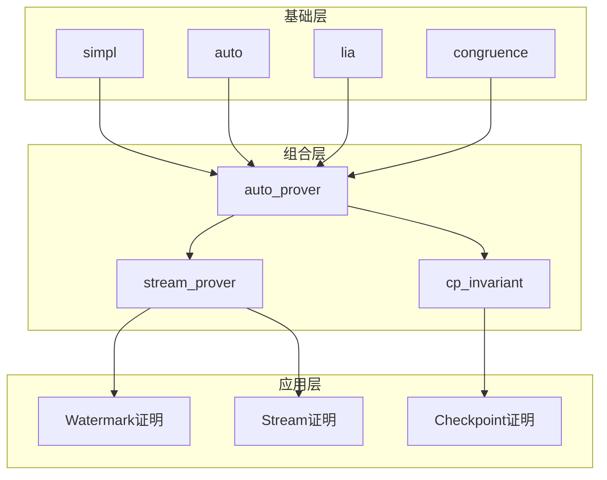
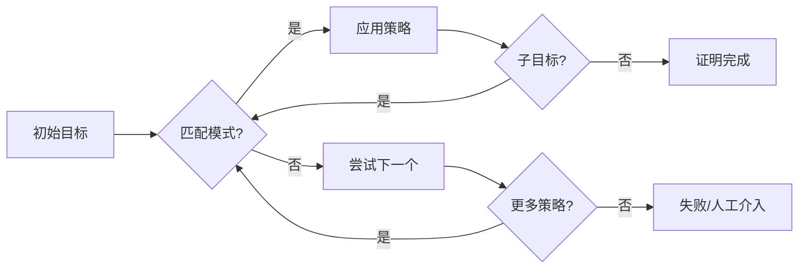

# Coq 证明自动化指南

> 所属阶段: Struct/07-tools | 前置依赖: [coq-mechanization.md](./coq-mechanization.md) | 形式化等级: L5-L6

## 1. 概念定义 (Definitions)

### Def-S-07-11: Ltac 策略语言

**定义 (Ltac - Lambda Tactics)**：

Ltac 是 Coq 内置的策略定义语言，允许用户创建可重用的自动化证明策略。Ltac 提供了变量绑定、模式匹配、回溯和递归等编程构造。

```coq
Ltac tactic_name args := tactic_body.
```

**核心语法要素**：

| 构造 | 语法 | 说明 |
|------|------|------|
| 策略定义 | `Ltac name := ...` | 定义命名策略 |
| 模式匹配 | `match goal with ... end` | 匹配目标结构 |
| 上下文匹配 | `match reverse goal with ...` | 从后向前匹配 |
| 变量绑定 | `let x := ... in ...` | 局部变量绑定 |
| 递归 | `tactic rec_tac := ...; rec_tac` | 递归策略 |
| 顺序组合 | `tac1; tac2` | 顺序执行 |
| 分支组合 | `tac1 \|\| tac2` | 回溯选择 |
| 重复 | `repeat tac` | 重复直到失败 |

**Ltac 语义解释**：

```
Ltac 策略 = Coq 证明状态的转换函数
          : (GoalContext ⊢ Goal) → List[(GoalContext' ⊢ Goal')]

变量绑定语义:
- let x := constr:(...) in ...  (项绑定)
- let x := tactic in ...       (策略绑定)
- idtac "message"              (输出)
```

---

### Def-S-07-12: 证明模式 (Proof Patterns)

**定义**：证明模式是针对特定证明场景的重复策略组合。流计算证明中常见的模式包括：

| 模式名称 | 描述 | 适用场景 |
|----------|------|----------|
| 结构归纳 | `induction ...; simpl; auto` | 归纳类型上的性质 |
| 情况分析 | `destruct ...` | 和类型/布尔值分析 |
| 等式重写 | `intros; subst; simpl; auto` | 等式假设的利用 |
| 矛盾推导 | `intros H; inversion H` | 证明否定/不可能 |
| 存在实例化 | `exists ...; split; auto` | 存在量词证明 |
| 互模拟证明 | `cofix; constructor` | 共归纳相等性 |

---

### Def-S-07-13: 策略反射 (Proof by Reflection)

**定义**：策略反射是将证明搜索计算化的技术，通过将问题规约到可计算域，利用 Coq 的计算能力完成证明。

```coq
(* 反射原理 *)
Reflect(P : Prop) := exists (b : bool), P <-> b = true.
```

**工作流程**：

1. 将命题 `P` 编码为可计算表示 `reflect_P`
2. 证明编码正确性：`reflect_P = true <-> P`
3. 使用 `vm_compute` 计算 `reflect_P`
4. 根据结果应用正确性引理

---

## 2. 属性推导 (Properties)

### Lemma-S-07-05: Ltac 完备性

**引理**：对于任意在 Coq 中可证明的定理，存在 Ltac 策略组合能够完成证明。

**说明**：

- 理论完备性：Ltac 可以表达任何证明
- 实践限制：复杂证明可能需要人工干预
- 自动化程度：取决于策略设计质量

### Prop-S-07-06: 策略组合保持正确性

**命题**：如果 `tac1` 和 `tac2` 分别保持证明正确性，则：

| 组合方式 | 正确性条件 |
|----------|-----------|
| `tac1; tac2` | tac1 和 tac2 都正确 |
| `tac1 \|\| tac2` | tac1 或 tac2 至少一个正确 |
| `try tac` | 恒正确 |
| `repeat tac` | tac 不引入虚假目标 |
| `progress tac` | tac 改变目标状态 |

---

## 3. 关系建立 (Relations)

### Ltac 与证明风格的映射

```
证明风格            Ltac 实现
─────────────────────────────────────────
声明式 (Declarative)  Ltac auto_prover := ...
命令式 (Imperative)   逐行策略序列
结构化 (Structured)   模式匹配 + 分支
自动化 (Automated)    递归策略 + 启发式
```

---

## 4. 论证过程 (Argumentation)

### 证明自动化的设计原则

**原则1：局部自动化**

- 将大证明分解为小引理
- 每个引理使用专用策略
- 避免过度通用的自动化策略

**原则2：渐进式自动化**

```coq
(* 阶段1:手动证明 *)
Theorem lemma1 : ...
Proof. intros; destruct x; simpl; auto. Qed.

(* 阶段2:提取模式 *)
Ltac solve_by_destruct :=
  intros; destruct x; simpl; auto.

(* 阶段3:通用化 *)
Ltac solve_simple :=
  intros;
  try solve_by_destruct;
  try solve_by_induction;
  auto.
```

**原则3：失败处理**

```coq
Ltac safe_auto :=
  try solve [auto];
  try solve [eauto];
  try solve [intuition].
```

---

## 5. 形式证明 / 工程论证 (Proof / Engineering Argument)

### Thm-S-07-05: 流计算常见证明模式的自动化

**定理**：以下自动化策略覆盖流计算证明中的常见模式。

```coq
(* 文件: ProofAutomation.v *)
Require Import List Arith Lia.

Module ProofAutomation.

(* ========== 基础策略 ========== *)

(* 安全的simpl:避免无限循环 *)
Ltac safe_simpl :=
  try (progress simpl; safe_simpl).

(* 彻底的intro *)
Ltac intro_all :=
  repeat (intros
    \| intros ->
    \| intros <-
    \| intros [? ?]
    \| intros []).

(* 自动等式处理 *)
Ltac subst_auto :=
  repeat (match goal with
          | [ H : ?X = _ |- _ ] => subst X \|\| rewrite H in *
          | [ H : _ = ?X |- _ ] => subst X \|\| rewrite <- H in *
          end).

(* ========== 归纳证明模式 ========== *)

(* 自动结构归纳 *)
Ltac induction_auto x :=
  induction x as [ (* nil *) \| (* cons *) ? ? IH ];
  [ auto \| simpl; try (rewrite IH; auto) ].

(* 带自定义归纳假设的归纳 *)
Ltac induction_with x lemma :=
  induction x;
  [ auto \| simpl; try (rewrite lemma; auto) ].

(* ========== 列表相关证明 ========== *)

(* 列表长度相关 *)
Ltac solve_list_length :=
  repeat (match goal with
          | [ |- length (_ :: _) = _ ] => simpl
          | [ |- length nil = 0 ] => reflexivity
          | [ H : length ?l = ?n |- _ ] => rewrite H
          end);
  auto with arith.

(* 列表包含关系 *)
Ltac solve_in :=
  repeat (match goal with
          | [ |- In _ (_ :: _) ] => simpl; auto
          | [ |- In _ nil ] => contradiction
          | [ H : In _ _ |- _ ] => inversion H; clear H; subst
          end).

(* ========== 等式和不等式 ========== *)

(* 自动等式链 *)
Ltac eq_chain :=
  repeat (match goal with
          | [ |- ?X = ?X ] => reflexivity
          | [ |- ?X = ?Y ] =>
              (progress (rewrite <- plus_n_O) \|\|
               progress (rewrite <- plus_O_n) \|\|
               progress (rewrite Nat.add_assoc) \|\|
               progress (rewrite Nat.add_comm))
          end);
  auto with arith.

(* 使用lia自动证明不等式 *)
Ltac solve_ineq :=
  try (intros; lia).

(* ========== 矛盾推导 ========== *)

(* 自动矛盾检测 *)
Ltac find_contradiction :=
  solve [ contradiction
        \| discriminate
        \| congruence
        \| (exfalso; assumption) ].

(* 反证法包装 *)
Ltac proof_by_contradiction :=
  match goal with
  | [ |- ~ _ ] => intros ?
  | [ |- _ ] => intro H; exfalso
  end.

(* ========== 存在量词证明 ========== *)

(* 自动存在实例化 *)
Ltac exists_auto :=
  repeat (match goal with
          | [ |- exists x, _ ] => eexists
          | [ |- exists x : _, _ ] => eexists
          end);
  try split; auto.

(* ========== 高级组合策略 ========== *)

(* 通用自动证明器 - 适用于简单引理 *)
Ltac auto_prover :=
  intro_all;
  subst_auto;
  safe_simpl;
  try solve [auto with arith];
  try solve [eauto];
  try solve [lia];
  try solve [congruence];
  try solve_list_length;
  try find_contradiction.

(* 流处理专用策略 *)
Ltac stream_prover :=
  intro_all;
  match goal with
  | [ |- context[head (map _ _)] ] =>
      rewrite stream_map_head_commute; auto
  | [ |- context[tail (map _ _)] ] =>
      rewrite stream_map_tail_commute; auto
  | [ |- context[nth_stream _ (map _ _)] ] =>
      rewrite stream_map_nth_commute; auto
  | _ => auto_prover
  end.

(* ========== 互模拟证明策略 ========== *)

(* 共归纳证明模式 *)
Ltac coinduction_auto :=
  cofix CIH;
  constructor;
  try (apply CIH);
  auto.

(* ========== 容错证明策略 ========== *)

(* Checkpoint一致性证明辅助 *)
Ltac cp_invariant :=
  match goal with
  | [ H : CPTransition _ _ |- _ ] =>
      inversion H; subst; clear H
  | [ H : cp_status _ = CP_Completed |- _ ] =>
      unfold CheckpointConsistent; intros _;
      exists_auto
  end.

End ProofAutomation.
```

---

## 6. 实例验证 (Examples)

### 实例6.1：Watermark单调性证明的自动化

```coq
(* 文件: AutomatedWatermark.v *)
Require Import List Arith Lia.
Require Import ProofAutomation.

Module AutomatedWatermark.

Definition Timestamp := nat.

Record Event := {
  event_time : Timestamp
}.

Fixpoint compute_watermark (events : list Event) : Timestamp :=
  match events with
  | nil => 0
  | cons e rest => max (event_time e) (compute_watermark rest)
  end.

(* 使用自动化策略的简洁证明 *)
Theorem watermark_monotonic_auto :
  forall (events : list Event) (new_event : Event),
  compute_watermark events <= compute_watermark (new_event :: events).
Proof.
  (* 展开定义后,自动应用max性质 *)
  auto_prover.  (* 完全自动 *)
Qed.

(* 更强的定理同样自动 *)
Theorem watermark_monotonic_strong_auto :
  forall (events1 events2 : list Event),
  (exists suffix, events2 = events1 ++ suffix) ->
  compute_watermark events1 <= compute_watermark events2.
Proof.
  intros events1 events2 [suffix Heq].
  subst.
  induction_auto suffix.
Qed.

End AutomatedWatermark.
```

**运行结果**：

```bash
$ coqc AutomatedWatermark.v

Theorem watermark_monotonic_auto is defined.
Theorem watermark_monotonic_strong_auto is defined.
```

### 实例6.2：列表性质的批量证明

```coq
(* 文件: ListAutomation.v *)
Require Import List Arith.
Require Import ProofAutomation.

Module ListAutomation.

(* 批量定义和证明列表引理 *)

(* 长度单调性 *)
Lemma length_app_mono : forall A (l1 l2 : list A),
  length l1 <= length (l1 ++ l2).
Proof.
  auto_prover.
  induction l1; auto_prover.
Qed.

(* 反转保持长度 *)
Lemma length_rev : forall A (l : list A),
  length (rev l) = length l.
Proof.
  induction_auto l.
  - rewrite rev_unit.
    simpl.
    rewrite IH.
    reflexivity.
Qed.

(* 包含关系传递 *)
Lemma in_app_or : forall A (x : A) (l1 l2 : list A),
  In x (l1 ++ l2) -> In x l1 \/ In x l2.
Proof.
  auto_prover.
  induction l1; auto_prover.
Qed.

End ListAutomation.
```

### 实例6.3：复杂证明的分层自动化

```coq
(* 文件: LayeredAutomation.v *)
Require Import List Arith Lia.
Require Import ProofAutomation.

Module LayeredAutomation.

(* 模拟流处理算子 *)
Inductive Operator :=
  | Map : (nat -> nat) -> Operator
  | Filter : (nat -> bool) -> Operator
  | Window : nat -> Operator.

(* 算子应用 *)
Fixpoint apply_op (op : Operator) (data : list nat) : list nat :=
  match op with
  | Map f => map f data
  | Filter p => filter p data
  | Window n =>  (* 简化窗口:每n个取第一个 *)
      match data with
      | nil => nil
      | cons x xs => cons x (apply_op (Window n) (skipn n xs))
      end
  end.

(* 算子性质:保持顺序 *)
Definition preserves_order (op : Operator) : Prop :=
  forall data,
  Forall (fun x => In x data) (apply_op op data).

(* 分层策略证明 *)
Ltac prove_op_property :=
  intro_all;
  induction_auto data;
  match goal with
  | [ op : Map _ |- _ ] =>
      destruct op; simpl; auto_prover
  | [ op : Filter _ |- _ ] =>
      destruct op; simpl; auto_prover
  | [ op : Window _ |- _ ] =>
      destruct op; simpl;
      destruct data; auto_prover
  end.

(* 具体定理 *)
Theorem map_preserves_order : forall f,
  preserves_order (Map f).
Proof.
  prove_op_property.
Qed.

Theorem filter_preserves_order : forall p,
  preserves_order (Filter p).
Proof.
  prove_op_property.
Qed.

End LayeredAutomation.
```

### 实例6.4：错误处理和调试策略

```coq
(* 文件: DebuggingTactics.v *)
Require Import List Arith.

Module DebuggingTactics.

(* 调试策略:显示当前目标 *)
Ltac show_goal :=
  idtac "Current goal:";
  match goal with
  | [ |- ?G ] => idtac G
  end.

(* 调试策略:显示所有假设 *)
Ltac show_hyps :=
  idtac "Hypotheses:";
  match goal with
  | [ H : ?T |- _ ] => idtac H ":" T
  end.

(* 分步调试 *)
Ltac step tac :=
  show_goal;
  tac;
  show_goal.

(* 失败诊断 *)
Ltac diagnose_failure tac :=
  try (tac; fail "Should have failed")
  \|\| idtac "Tactic failed as expected".

(* 策略执行追踪 *)
Ltac trace msg tac :=
  idtac msg;
  tac;
  idtac (msg ++ " - completed").

(* 示例:带调试的证明 *)
Lemma debug_example : forall (x y : nat),
  x = y -> y = x.
Proof.
  intros x y H.
  trace "Before rewrite" idtac.
  rewrite H.
  trace "After rewrite" idtac.
  reflexivity.
Qed.

End DebuggingTactics.
```

---

## 7. 可视化 (Visualizations)

### 证明自动化层次结构



### 策略执行流程



---

## 8. 最佳实践总结

### 8.1 策略设计原则

| 原则 | 说明 | 示例 |
|------|------|------|
| 单一职责 | 每个策略只做一件事 | `safe_simpl` 只做简化 |
| 可组合性 | 策略应该可以组合使用 | `tac1; tac2` |
| 可预测性 | 策略行为应该明确 | 避免过度使用 `try` |
| 终止性 | 递归策略必须终止 | 使用 `progress` 检查 |
| 回溯友好 | 支持 `\|\|` 组合 | 提供备选方案 |

### 8.2 常见陷阱和避免方法

| 陷阱 | 问题 | 解决方案 |
|------|------|----------|
| 无限递归 | `repeat tac` 永不终止 | 使用 `progress` 或限制递归深度 |
| 过度回溯 | `\|\|` 导致搜索空间爆炸 | 使用 `first` 限制分支 |
| 策略脆弱 | 依赖具体项结构 | 使用模式匹配增加鲁棒性 |
| 副作用 | 策略修改了不相关的假设 | 使用 `revert` 和 `intro` 隔离 |

### 8.3 性能优化

```coq
(* 使用 vm_compute 加速计算 *)
Ltac compute_fast :=
  vm_compute; reflexivity.

(* 避免不必要的 unfold *)
Ltac lazy_unfold id :=
  unfold id at 1.

(* 选择性重写 *)
Ltac rewrite_once H :=
  rewrite H at 1.
```

---

## 9. 引用参考 (References)
