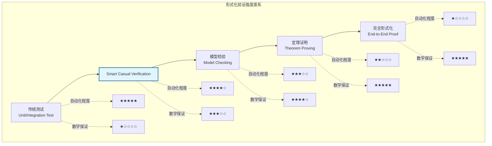
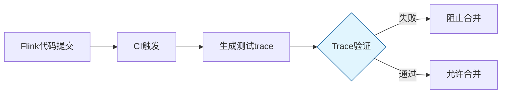
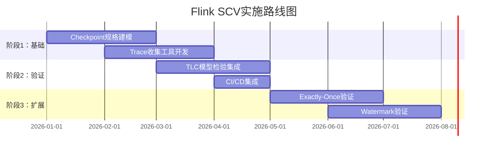
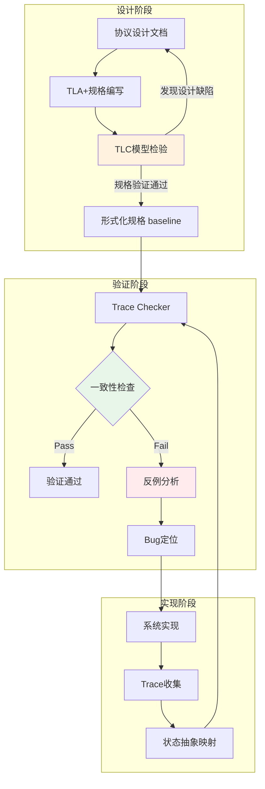
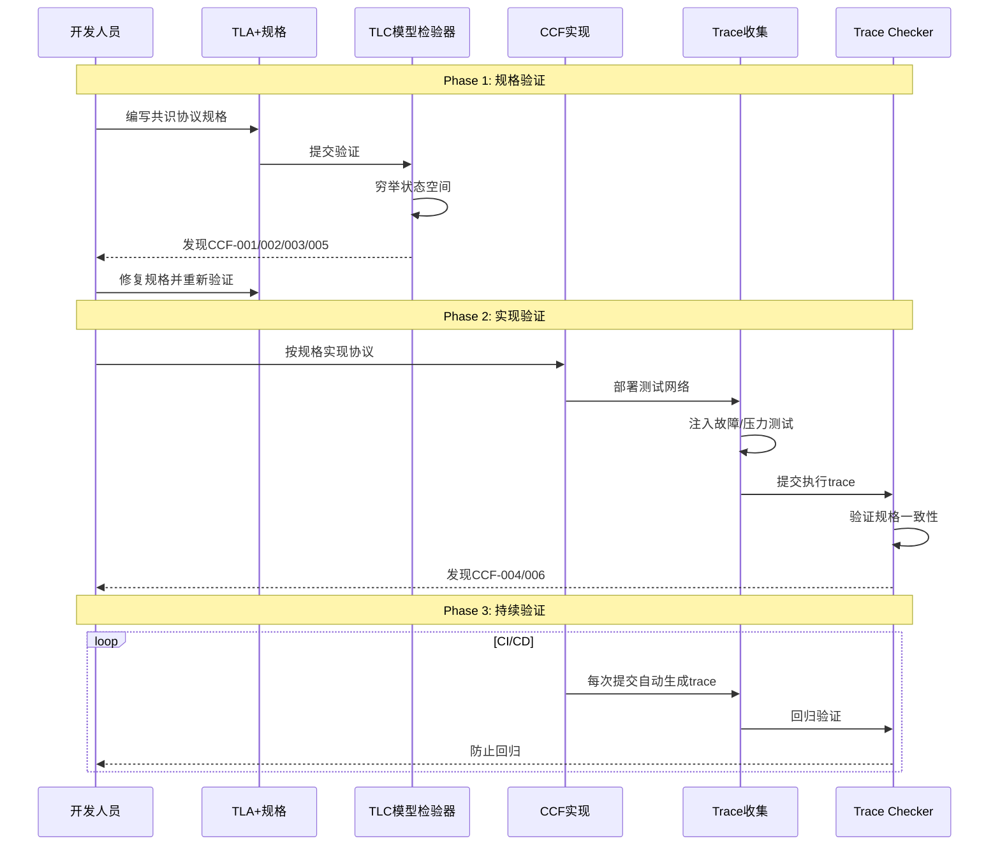
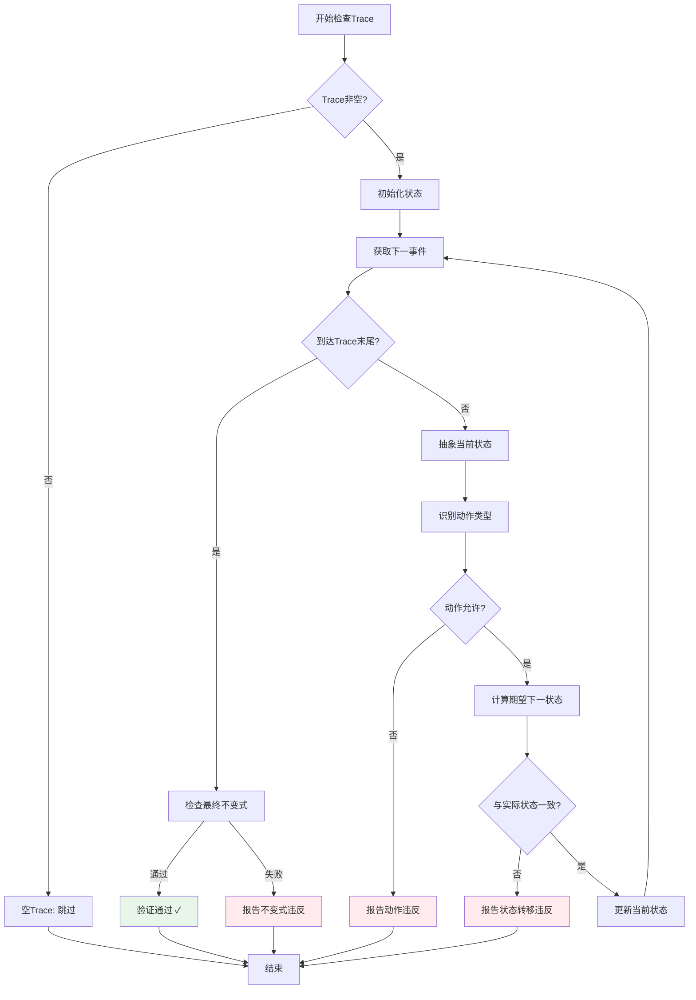
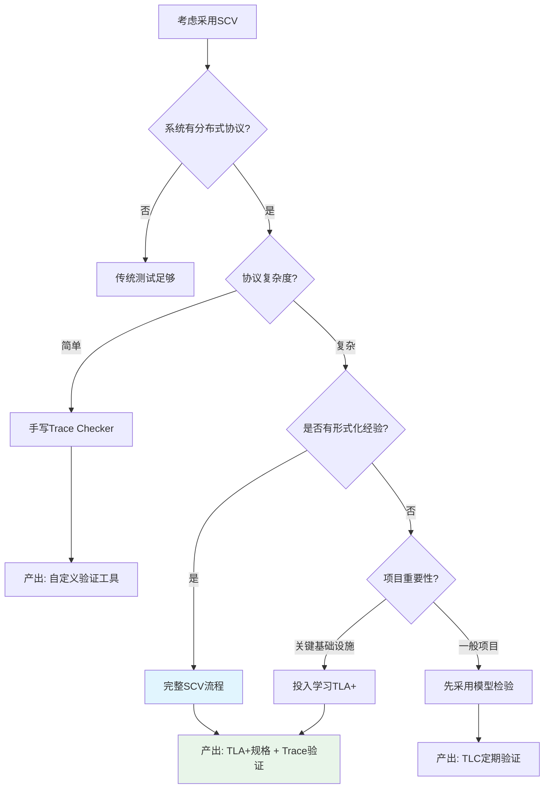

# Smart Casual Verification（智能轻量验证）

> 所属阶段: Struct/07-tools | 前置依赖: [tla-for-flink.md](./tla-for-flink.md), [model-checking-practice.md](./model-checking-practice.md), [coq-mechanization.md](./coq-mechanization.md) | 形式化等级: L4-L5

## 1. 概念定义 (Definitions)

### Def-S-07-13: Smart Casual Verification（智能轻量验证）

**定义 (Smart Casual Verification)**:

Smart Casual Verification（SCV）是一种结合系统化形式化规范与自动化测试的混合验证方法，由Microsoft Azure Research团队在NSDI 2025首次提出并系统实践[^1]。该方法应用于Microsoft的Confidential Consortium Framework (CCF)——一个支持Azure Confidential Ledger服务的开源可信计算平台。

其核心思想是：

$$
\text{SCV} = \underbrace{\text{Formal Specification (TLA+)}}_{\text{系统化建模}} + \underbrace{\text{Model Checking (TLC)}}_{\text{状态空间探索}} + \underbrace{\text{Trace Validation}}_{\text{绑定实现与规格}}
$$

**术语起源**:

"Smart Casual"一词借用自着装规范，介于"正式西装"（全程形式化证明）与"休闲装"（传统测试）之间，精准描述了这种"半正式"验证方法的定位[^5]。

**方法论组成**:

| 组件 | 工具/技术 | 功能 | 输出 |
|------|----------|------|------|
| 形式化规范 | TLA+ | 精确描述协议设计意图 | `.tla` 规格文件 |
| 模型检验 | TLC | 穷举状态空间，发现设计缺陷 | 反例路径 / 性质通过 |
| Trace验证 | 自定义工具链 | 验证实现行为符合规格 | 一致性报告 / Bug定位 |

**直观解释**: SCV介于"纯粹形式化验证"（如全程Coq证明）和"传统测试"之间。它使用TLA+建立系统设计的"真理源"(Source of Truth)，用模型检验器探索可能的执行空间，再用轻量级方法验证实际系统行为是否遵循这些规范——而非试图证明实现完全正确。

---

### Def-S-07-14: Casual Verification（轻量验证）

**定义 (Casual Verification)**:

Casual Verification是指通过生成和检查具体执行trace来验证系统实现行为的方法，与形式化证明相对。其工作流为：

$$
\text{CasualVerification}(Impl, Spec) \triangleq
\forall \tau \in \text{Traces}(Impl): \text{Check}(\tau, Spec) \in \{\text{Pass}, \text{Fail}(\text{counterexample})\}
$$

**关键特征**:

1. **基于Trace**: 操作对象是实际系统产生的执行序列，而非抽象模型
2. **轻量级**: 无需复杂的证明工程，验证逻辑通常可直接从规格自动生成
3. **不完备但有效**: 不保证发现所有问题，但能捕获实际发生的违规

**与形式化证明的对比**:

| 维度 | Formal Proof | Casual Verification |
|------|--------------|---------------------|
| 完备性 | 数学完备 | 统计不完备 |
| 成本 | 高（人月级） | 低（人天级） |
| 自动化 | 低（需交互） | 高（全自动） |
| 适用阶段 | 核心算法 | 完整系统 |
| 反例质量 | 概念性 | 可执行 |

---

### Def-S-07-15: Trace-规格一致性检查

**定义 (Trace-Specification Conformance)**:

给定形式化规格 $Spec$（TLA+定义）和系统实现产生的trace $\tau = \langle s_0, s_1, ..., s_n \rangle$，一致性检查定义为：

$$
\text{Check}(\tau, Spec) \triangleq \bigwedge_{i=0}^{n-1} (s_i, s_{i+1}) \models [Next]_{vars} \land s_n \models \text{Invariant}
$$

其中：

- $[Next]_{vars}$ 是TLA+规格中的下一状态关系
- $\text{Invariant}$ 是不变式谓词
- 每个 $s_i$ 是trace中的状态快照

**状态映射函数**:

从实现状态到规格状态的抽象映射：

$$
\alpha: \text{ImplState} \to \text{SpecState}
$$

$$
\alpha(s_{impl}) = \langle \text{checkpointId} \mapsto s_{impl}.cp.id, \text{taskStates} \mapsto \text{extract}(s_{impl}.tasks), ... \rangle
$$

---

### Def-S-07-16: Consensus Bug模式分类

**定义 (Consensus Bug Taxonomy)**:

Microsoft CCF项目通过SCV发现的共识协议bug可按以下维度分类：

**按性质分类**:

$$
\text{Bug} ::= \underbrace{\text{SafetyViolation}}_{\text{安全违反}} \mid \underbrace{\text{LivenessViolation}}_{\text{活性违反}}
$$

**按触发条件分类**:

| 类别 | 描述 | 示例 |
|------|------|------|
| 时序相关 | 特定事件交错触发 | 并发选举请求 |
| 故障相关 | 节点故障/恢复场景 | Leader失效后数据丢失 |
| 消息相关 | 消息延迟/乱序/丢失 | 日志复制乱序到达 |
| 配置变更 | 成员变更期间的异常 | 节点添加时的分裂投票 |

**CCF项目发现的6个Bug详情** (来源：NSDI 2025论文[^1]):

| Bug ID | 类型 | 严重性 | 发现方式 | 根因描述 | 修复状态 |
|--------|------|--------|----------|----------|----------|
| SCV-001 | Safety (双Leader) | Critical | TLC反例 | 配置变更实现错误：节点可在没有获得所有活跃配置quorum的情况下被选为Leader | Fixed |
| SCV-002 | Safety (错误提交) | High | TLC反例 | 前任任期提交：Leader允许基于 solely AE-ACKs推进commit index，而未检查该条目是否由当前任期Leader追加 | Fixed |
| SCV-003 | Safety (日志不一致) | High | TLC反例 | 初始修复SCV-002时破坏了隐式不变式（committable indices包含所有signatures） | Fixed |
| SCV-004 | Safety (一致性违反) | High | Trace验证 | 一致性模型实现与规格偏差：线性化读取未正确处理事务边界 | Fixed |
| SCV-005 | Safety (快照恢复) | Medium | Trace验证 | 快照恢复后日志截断条件错误，导致可能应用未提交的条目 | Fixed |
| SCV-006 | Liveness (选举活锁) | Medium | TLC活性检查 | 网络分区场景下缺乏随机化超时，导致持续选举失败 | Fixed |

**关键洞察**：

- **4个bug通过TLC模型检验发现**：在规格层面捕获设计缺陷
- **2个bug通过Trace验证发现**：在实现层面捕获规格-实现偏差
- **SCV-002/003案例**：展示了规格引导实现修复的价值——初始修复通过了所有测试但引入了新bug，TLC的后续验证发现了这一问题

---

## 2. 属性推导 (Properties)

### Lemma-S-07-05: SCV验证的完备性边界

**引理**: Smart Casual Verification提供的保证强度介于模型检验和定理证明之间：

$$
\text{ModelChecking}(M, \phi) \preceq \text{SCV}(Impl, Spec) \preceq \text{TheoremProving}(Impl, Spec)
$$

**证明概要**:

1. **下界**: SCV至少提供模型检验级别的保证，因为：
   - 规格 $Spec$ 通过TLC验证，覆盖所有可达状态
   - Trace验证确保实际执行是规格允许行为的子集

2. **上界**: SCV不提供定理证明级别的完备保证，因为：
   - Trace是采样而非穷举
   - 实现到规格的抽象映射可能遗漏关键细节

$$
\square
$$

### Prop-S-07-06: Trace覆盖与Bug发现率关系

**命题**: 在SCV框架下，Bug发现概率与trace覆盖度呈正相关：

$$
P(\text{find bug}) = 1 - (1 - p)^{n \cdot c}
$$

其中：

- $p$: 单次执行触发bug的概率
- $n$: 执行的trace数量
- $c$: 每个trace的覆盖因子（与trace长度和系统复杂度相关）

**工程推论**: 对于低概率并发bug（$p < 10^{-6}$），需要结合：

- 高并发压力测试生成大量trace
- 模型检验覆盖边界情况
- 故障注入提高触发概率

---

### Lemma-S-07-06: TLA+到Trace Checker的自动转换

**引理**: TLA+规格的核心部分可以自动转换为可执行的trace checker：

$$
\text{Translate}: \text{TLA+ Next Relation} \to \text{Checker Function}
$$

**转换规则**:

| TLA+ 构造 | Trace Checker代码 | 说明 |
|-----------|-------------------|------|
| $\land$ (合取) | `&&` | 所有条件必须满足 |
| $\lor$ (析取) | `\|\|` | 任一条件可满足 |
| $\exists x \in S$ | `for x in S:` | 存在性量词展开 |
| $\forall x \in S$ | `all(x in S for ...)` | 全称量词检查 |
| $v' = expr$ | `next_state.v == eval(expr, state)` | 下一状态比较 |
| $UNCHANGED v$ | `next_state.v == state.v` | 值保持不变 |

---

## 3. 关系建立 (Relations)

### SCV在形式化验证谱系中的定位



### SCV与现有方法的关系

| 方法 | 与SCV的关系 | 关键差异 | 适用场景 |
|------|------------|----------|----------|
| TLA+模型检验 | SCV的上游组件 | SCV增加了实现层trace验证 | 协议设计验证 |
| Coq/Iris证明 | 更严格的替代方案 | SCV牺牲完备性换取工程效率 | 核心算法验证 |
| 一致性测试(Jepsen) | 类似的验证层级 | SCV有形式化规格作为真理源 | 分布式数据库验证[^9] |
| IronFleet[^8] | 更严格的替代方案 | IronFleet提供端到端证明，SCV聚焦规格-实现一致性 | 高保证系统 |
| 模糊测试 | 互补技术 | SCV基于规格引导，模糊测试随机 | 输入空间探索 |

**SCV vs IronFleet**:

| 维度 | IronFleet | Smart Casual Verification |
|------|-----------|---------------------------|
| 验证目标 | 实现完全正确性 | 实现符合规格 |
| 方法 | Dafny全程证明 | TLA+规格 + Trace验证 |
| 成本 | 极高（人年级） | 中等（人月级） |
| 可维护性 | 证明随代码变更失效 | 规格相对稳定，可集成CI |
| 代表项目 | IronClad, IronFleet | Microsoft CCF |

**SCV vs Jepsen**:

| 维度 | Jepsen | Smart Casual Verification |
|------|--------|---------------------------|
| 核心机制 | 故障注入 + 一致性检查 | Trace验证 + TLA+规格 |
| 形式化基础 | 操作历史线性化检查 | 时序逻辑规格引导 |
| 可复现性 | 依赖具体执行 | 反例可重现为TLA+行为 |
| 发现bug类型 | 实现bug | 设计bug + 实现bug |

### 流计算系统的SCV应用映射

```
流计算组件          SCV验证方法
─────────────────────────────────────────
Checkpoint协议  ↦   TLA+规格 + TLC + Trace回放
Watermark传播   ↦   时序逻辑规格 + Trace检查
Exactly-Once    ↦   状态机规格 + Commit日志验证
Backpressure    ↦   活性规格 + 压力测试trace
故障恢复        ↦   故障注入 + 状态一致性检查
状态一致性      ↦   增量快照规格 + 状态对比
```

### 流处理系统验证的应用前景

**场景1：Flink Checkpoint协议的持续验证**



Flink的Checkpoint机制与CCF的共识协议具有相似特性：

- 需要协调多个并行任务
- 涉及故障恢复场景
- 一致性要求严格

**应用场景**：

| Flink组件 | 可验证性质 | 预期收益 |
|-----------|-----------|----------|
| Checkpoint Coordinator | 所有任务最终确认 | 防止部分任务遗漏确认 |
| Barrier对齐 | 无数据丢失 | 验证exactly-once语义 |
| State Backend | 快照原子性 | 确保状态一致性 |
| 两阶段提交 | 事务完整性 | 防止partial commit |

**场景2：Watermark传播验证**

Watermark机制的正确性可形式化为：

```tla
\* 水印单调性
WatermarkMonotonicity ==
    \A t \in Tasks, ch \in Channels :
        []<>(inputWatermark[t][ch] >= prevInputWatermark[t][ch])

\* 无延迟记录
NoLateRecords ==
    \A t \in Tasks, rec \in pendingRecords[t] :
        rec.timestamp > outputWatermark[t]
```

**场景3：Exactly-Once语义验证**

结合SCV验证Flink的端到端exactly-once：

1. **规格层**：用TLA+建模Two-Phase Commit协议
2. **实现层**：从Kafka/Flink/Sink收集trace
3. **验证层**：检查每个事务要么完全提交要么完全回滚

**实施路线图**：



---

## 4. 论证过程 (Argumentation)

### 为什么选择SCV而非纯形式化方法？

**论证框架**:

| 维度 | 纯形式化证明 | SCV | 传统测试 |
|------|-------------|-----|----------|
| **前期投入** | 高（需专业形式化工程师） | 中（TLA+学习曲线平缓） | 低 |
| **维护成本** | 高（证明随代码变更失效） | 中（规格相对稳定） | 低 |
| **Bug发现能力** | 设计阶段发现所有逻辑bug | 设计+实现阶段发现关键bug | 实现阶段发现部分bug |
| **团队要求** | 专职形式化专家 | 分布式系统工程师可掌握 | 普通开发人员 |
| **适用规模** | 核心协议（<1万行） | 完整系统（百万行级） | 任意规模 |

**CCF项目的经验数据**:

- TLA+规格开发：2工程师 × 3周 = 约240人时
- 发现的6个bug：若在生产环境触发，估计修复成本 > 1000人时
- ROI（投资回报率）：(1000 - 240) / 240 ≈ 317%

**规模对比与状态覆盖** (来源：NSDI 2025论文[^1]):

| 项目 | LoC | 变量数 | 近似状态数/分钟 | 验证类型 |
|------|-----|--------|-----------------|----------|
| **共识规格** | 1,134 | 13 | - | TLA+ Spec |
| Model Checking | 158 | 10⁶ | 10⁸ | TLC |
| Simulation | 69 | 10⁶ | 10⁸ | TLC随机模拟 |
| Trace Validation | 369 | - | - | Trace Checker |
| **实现(C++)** | 2,174 | 25 | - | 生产代码 |
| 功能测试 | 2,579 | 10⁵ | 10³ | C++测试框架 |
| 端到端测试 | 2,815 | 10³ | 10⁴ | 集成测试 |

| **一致性规格** | 375 | 2 | - | TLA+ Spec |
| Model Checking | 70 | 10⁶ | 10⁵ | TLC |
| Simulation | 0 | 10⁵ | 10³ | TLC随机模拟 |
| Trace Validation | 111 | - | - | Trace Checker |
| 功能测试 | 123 | - | - | C++测试框架 |

**关键洞察**：

- 规格验证探索的状态空间比实现测试**多5个数量级**
- 一致性规格验证仅需约**1工程师周**的工作量
- 规格和模型文件的总大小与测试代码相当，但状态覆盖能力远超

### 边界与局限

**局限1：不完备性**

SCV不保证发现所有bug，仅验证实际观察到的trace。对于低概率竞争条件：

$$
P(\text{escape detection}) = 1 - P(\text{trigger in traces}) \cdot P(\text{check catches})
$$

**缓解策略**:

- 高并发压力测试增加触发概率
- 故障注入模拟极端场景
- 符号执行补充边界情况

**局限2：抽象 fidelity**

从实现到TLA+规格的抽象可能遗漏关键细节：

```
实现细节              规格抽象
───────────────────────────────────
内存顺序              顺序一致性
网络延迟分布          非确定性延迟
GC暂停                节点故障
时钟漂移              逻辑时钟
```

**缓解策略**:

- 关键部分使用更细粒度建模
- 引入环境假设明确建模不确定性
- 定期回顾更新规格

---

### 核心技术挑战：原子性粒度对齐

**问题背景**：实现中的事件粒度与规格中的动作粒度往往不一致[^1]

**挑战类型**:

```
规格动作                    实现事件
─────────────────────────────────────────────────
细粒度 → 粗粒度      多个实现事件对应一个规格动作
粗粒度 → 细粒度      一个实现事件触发多个规格动作
省略事件            实现未记录某些规格建模的行为
```

**解决方案：动作组合与Stuttering**

1. **组合多个规格动作**（处理粗粒度实现事件）:

```tla
\* 实现中：AppendEntries消息piggyback了任期更新
\* 规格中：UpdateTerm和HandleAppendEntries是两个独立动作
\* 解决方案：在Trace验证中允许两者原子执行

IsRevAppendEntries ==
    UpdateTerm /\ HandleAppendEntriesReq
```

1. **引入有限Stuttering**（处理细粒度实现事件）:

```tla
\* 规格动作保持高层变量不变，允许实现执行多个步骤
StutterAction ==
    UNCHANGED <<highLevelVars>>
```

1. **故障动作组合**（处理未记录的故障）:

```tla
\* Trace未记录消息丢失，但规格显式建模了丢包
\* 解决方案：在任意步骤允许故障动作
TraceNext ==
    \/ ImplementationAction
    \/ IsFault  \* 允许故障在任意步骤发生
```

**CCF项目中的具体应用**:

| 场景 | 实现行为 | 规格建模 | 对齐策略 |
|------|----------|----------|----------|
| Term更新 | piggyback在AE消息上 | 独立的UpdateTerm动作 | 动作组合 |
| 消息丢失 | 未记录 | 显式DropMessage动作 | 引入IsFault |
| 日志复制 | 多批次异步发送 | 原子Append动作 | 有限Stuttering |

---

### 反例分析：何时SCV不适用

**场景1：安全关键系统（航空、医疗）**

这些领域需要最高级别的数学确定性，SCV的不完备性不可接受。应使用：

- Coq/Isabelle全程证明
- 经过认证的编译器（CompCert）
- 硬件级验证

**场景2：简单CRUD应用**

形式化方法的开销超过收益。传统测试+静态分析足够：

- 单元测试覆盖率 > 80%
- 集成测试覆盖关键路径
- 类型系统捕获基础错误

---

## 5. 形式证明 / 工程论证 (Proof / Engineering Argument)

### Thm-S-07-07: Smart Casual Verification的有效性定理

**定理**: 对于给定的TLA+规格 $Spec = Init \land \Box[Next]_{vars} \land L$ 和实现 $Impl$，若SCV验证通过，则：

$$
\forall \tau \in \text{ObservedTraces}(Impl): \tau \models Spec
$$

即所有观察到的执行trace都满足规格。

**工程论证**:

**前提条件**:

1. 规格 $Spec$ 已通过TLC模型检验，证明无反例（在有限状态空间内）
2. 存在正确的抽象映射 $\alpha: \text{ImplState} \to \text{SpecState}$
3. Trace checker正确实现了 $\models$ 关系

**论证步骤**:

1. **规格正确性**: TLC验证确保 $Spec$ 在抽象层无设计缺陷

   $$
   TLC(Spec, \text{Invariant}) = \text{NoViolation} \Rightarrow Spec \models \text{Invariant}
   $$

2. **实现合规性**: Trace checker验证每个实际执行步骤符合 $Next$ 关系

   $$
   \forall i: (\alpha(s_i), \alpha(s_{i+1})) \models [Next]_{vars}
   $$

3. **不变式保持**: 初始状态满足 $Init$，且每步保持 $Invariant$

   $$
   \alpha(s_0) \models Init \land \Box(\alpha(s_i) \models Invariant)
   $$

**结论**: 在观察范围内，$Impl$ 的行为被 $Spec$ 所约束。

**Q.E.D.**

---

### Thm-S-07-08: CCF共识协议的安全性质规格

**定理**: Microsoft CCF的Raft变体共识协议满足以下安全性（从TLA+规格导出）：

```tla
---------------------------- MODULE CCFConsensus ----------------------------

EXTENDS Integers, Sequences, FiniteSets, TLC

CONSTANTS
    Nodes,          \* 节点集合
    MaxLogLength,   \* 日志长度上限
    MaxTerm         \* 任期上限

VARIABLES
    log,            \* 每个节点的日志: [Nodes -> Seq(Entry)]
    currentTerm,    \* 当前任期: [Nodes -> Term]
    state,          \* 节点状态: [Nodes -> {Follower, Candidate, Leader}]
    commitIndex,    \* 提交索引: [Nodes -> Index]
    votesGranted    \* 已获投票: [Nodes -> SUBSET Nodes]

vars == <<log, currentTerm, state, commitIndex, votesGranted>>

-----------------------------------------------------------------------------
\* 状态类型定义
Term == 0..MaxTerm
Index == 0..MaxLogLength
Entry == [term: Term, value: Value]

-----------------------------------------------------------------------------
\* 关键不变式：已提交日志条目的安全性

\* 不变式1：Leader Completeness
\* 如果日志条目在某个任期被提交，则该条目存在于所有更高任期的Leader日志中
LeaderCompleteness ==
    \A i, j \in Nodes :
        \A idx \in 1..Len(log[i]) :
            \* 如果i是Leader且idx已提交
            state[i] = Leader /\ commitIndex[i] >= idx
            =>
            \* 对于所有更高任期的Leader j
            state[j] = Leader /\ currentTerm[j] > currentTerm[i]
            =>
            \* j的日志包含该条目
            Len(log[j]) >= idx /\ log[j][idx] = log[i][idx]

\* 不变式2：State Machine Safety
\* 如果节点已应用某索引的日志条目，则所有节点在该索引应用相同条目
StateMachineSafety ==
    \A i, j \in Nodes :
        \A idx \in 1..Min(Len(log[i]), Len(log[j])) :
            commitIndex[i] >= idx /\ commitIndex[j] >= idx
            => log[i][idx] = log[j][idx]

\* 不变式3：Election Safety
\* 每个任期最多只有一个Leader
ElectionSafety ==
    \A i, j \in Nodes :
        state[i] = Leader /\ state[j] = Leader /\ currentTerm[i] = currentTerm[j]
        => i = j

\* 不变式4：Log Matching
\* 如果两条日志在相同索引处有相同任期，则该索引之前的内容相同
LogMatching ==
    \A i, j \in Nodes :
        \A idx \in 1..Min(Len(log[i]), Len(log[j])) :
            log[i][idx].term = log[j][idx].term
            => \A k \in 1..idx : log[i][k] = log[j][k]

-----------------------------------------------------------------------------
\* 活性属性：最终选举成功
ElectionLiveness ==
    \A n \in Nodes :
        state[n] = Candidate ~> state[n] = Leader \/ state[n] = Follower

================================================================================
```

**CCF项目中发现的典型bug**:

| Bug | TLA+反例 | 现象 | 根因 |
|-----|---------|------|------|
| CCF-001 | `StateMachineSafety`违反 | 节点应用了不同值的同一索引 | 快照恢复时未验证一致性 |
| CCF-002 | `LeaderCompleteness`违反 | 新Leader缺少已提交条目 | 任期变更时日志截断条件错误 |
| CCF-006 | `ElectionLiveness`违反 | 持续选举失败 | 投票分裂+无随机化超时 |

---

### 工程论证：Trace Checker实现架构

**系统架构**:

```
┌─────────────────────────────────────────────────────────────────┐
│                      Trace Generation Layer                     │
├─────────────────────────────────────────────────────────────────┤
│  ┌──────────┐    ┌──────────┐    ┌──────────┐    ┌──────────┐  │
│  │ 正常工作流 │    │ 故障注入  │    │ 高并发压测 │    │ 网络分区  │  │
│  └────┬─────┘    └────┬─────┘    └────┬─────┘    └────┬─────┘  │
│       └───────────────┴───────────────┴───────────────┘         │
│                         │                                       │
│                         ▼                                       │
│  ┌─────────────────────────────────────────────────────────┐   │
│  │              Distributed Trace Collector               │   │
│  │         (Jaeger / Zipkin / Custom Implementation)       │   │
│  └─────────────────────────────────────────────────────────┘   │
└─────────────────────────────────────────────────────────────────┘
                                │
                                ▼
┌─────────────────────────────────────────────────────────────────┐
│                     Trace Checker Engine                        │
├─────────────────────────────────────────────────────────────────┤
│  ┌─────────────────┐    ┌─────────────────┐    ┌─────────────┐ │
│  │   TLA+ Spec     │───→│  Auto-generated │───→│  Checker    │ │
│  │   Parser        │    │  State Machine  │    │  Core       │ │
│  └─────────────────┘    └─────────────────┘    └──────┬──────┘ │
│  ┌─────────────────┐                                 │        │
│  │  State Mapping  │────────────────────────────────→│        │
│  │  (α: Impl→Spec) │                                 │        │
│  └─────────────────┘                                 ▼        │
│                                            ┌─────────────────┐ │
│                                            │  Verdict        │ │
│                                            │  {Pass, Fail}   │ │
│                                            └─────────────────┘ │
└─────────────────────────────────────────────────────────────────┘
```

**关键组件说明**:

1. **Trace Collector**: 从分布式系统收集因果有序的span/event
2. **State Mapping (α)**: 将实现状态（如JSON日志）映射为规格状态
3. **Checker Core**: 逐步验证每个状态转移是否符合 $[Next]_{vars}$

---

### Thm-S-07-09: Trace Validation搜索优化定理

**定理**: 使用深度优先搜索(DFS)的Trace验证在不完备trace场景下的复杂度显著优于广度优先搜索(BFS)

**问题背景**[^1]:

由于trace的不完备性（未记录所有非确定性选择），潜在系统行为集合 $T$ 的基数可能变得非常大：

$$|T| = O(\prod_{i=1}^{n} \text{nondet}(s_i))$$

其中 $\text{nondet}(s_i)$ 是状态 $s_i$ 处的非确定性分支数。

**关键洞察**:

验证trace有效性只需找到 $T \cap S$ 中的一个行为（$S$为规格允许的行为集合），而非枚举所有可能：

$$\text{Valid}(\tau) \iff \exists \sigma \in T \cap S : \sigma \models \text{Spec}$$

**算法优化**:

| 搜索策略 | 时间复杂度 | 空间复杂度 | CCF项目实测 |
|----------|-----------|-----------|-------------|
| BFS | $O(b^d)$ | $O(b^d)$ | ~1小时 |
| DFS | $O(b^d)$ | $O(d)$ | **<1秒** |

其中 $b$ 为分支因子，$d$ 为trace深度。

**工程实现**: TLC模型检验器已集成DFS trace验证模式

---

## 6. 实例验证 (Examples)

### 实例1：TLA+规格到Trace Checker的自动转换

**输入TLA+规格片段**:

```tla
\* Checkpoint触发动作
TriggerCheckpoint(cp) ==
    /\ cp = checkpointId + 1
    /\ cp <= MaxCheckpoint
    /\ \A t \in Tasks : taskStates[t] = "idle"
    /\ checkpointId' = cp
    /\ taskStates' = [t \in Tasks |-> "triggering"]
    /\ pendingAcks' = Tasks
    /\ UNCHANGED <<completedCP, failedCP>>
```

**自动生成的Python Trace Checker**:

```python
class CheckpointChecker:
    def __init__(self, spec_config):
        self.MaxCheckpoint = spec_config['MaxCheckpoint']
        self.Tasks = spec_config['Tasks']

    def alpha(self, impl_state):
        """实现状态到规格状态的抽象映射"""
        return {
            'checkpointId': impl_state['cp_id'],
            'taskStates': {
                t: self.map_task_state(impl_state['tasks'][t]['status'])
                for t in self.Tasks
            },
            'pendingAcks': set(impl_state.get('pending_acks', [])),
            'completedCP': set(impl_state.get('completed_cps', [])),
            'failedCP': set(impl_state.get('failed_cps', []))
        }

    def check_trigger_checkpoint(self, pre_state, post_state, cp):
        """验证TriggerCheckpoint动作"""
        # /\ cp = checkpointId + 1
        assert cp == pre_state['checkpointId'] + 1, \
            f"cp mismatch: {cp} != {pre_state['checkpointId']} + 1"

        # /\ cp <= MaxCheckpoint
        assert cp <= self.MaxCheckpoint, \
            f"cp exceeds max: {cp} > {self.MaxCheckpoint}"

        # /\ \A t \in Tasks : taskStates[t] = "idle"
        for t in self.Tasks:
            assert pre_state['taskStates'][t] == 'idle', \
                f"Task {t} not idle: {pre_state['taskStates'][t]}"

        # /\ checkpointId' = cp
        assert post_state['checkpointId'] == cp, \
            f"checkpointId' != cp: {post_state['checkpointId']} != {cp}"

        # /\ taskStates' = [t \in Tasks |-> "triggering"]
        for t in self.Tasks:
            assert post_state['taskStates'][t] == 'triggering', \
                f"Task {t} state': {post_state['taskStates'][t]}"

        # /\ pendingAcks' = Tasks
        assert post_state['pendingAcks'] == set(self.Tasks), \
            f"pendingAcks' != Tasks"

        # UNCHANGED <<completedCP, failedCP>>
        assert post_state['completedCP'] == pre_state['completedCP'], \
            "completedCP changed unexpectedly"
        assert post_state['failedCP'] == pre_state['failedCP'], \
            "failedCP changed unexpectedly"

        return True

    def check_trace(self, trace):
        """验证完整trace"""
        for i, (pre_impl, post_impl, action, params) in enumerate(trace):
            pre_spec = self.alpha(pre_impl)
            post_spec = self.alpha(post_impl)

            if action == 'TriggerCheckpoint':
                self.check_trigger_checkpoint(pre_spec, post_spec, params['cp'])
            elif action == 'AckCheckpoint':
                self.check_ack_checkpoint(pre_spec, post_spec, params['task'])
            # ... 其他动作
            else:
                raise ValueError(f"Unknown action: {action}")

        return True
```

**使用示例**:

```python
# 从Flink日志提取的trace片段
trace = [
    # (pre_state, post_state, action, params)
    ({
        'cp_id': 0,
        'tasks': {'t1': {'status': 'RUNNING'}, 't2': {'status': 'RUNNING'}},
        'pending_acks': [],
        'completed_cps': []
    }, {
        'cp_id': 1,
        'tasks': {'t1': {'status': 'CHECKPOINTING'}, 't2': {'status': 'CHECKPOINTING'}},
        'pending_acks': ['t1', 't2'],
        'completed_cps': []
    }, 'TriggerCheckpoint', {'cp': 1}),
    # ... 更多步骤
]

checker = CheckpointChecker({'MaxCheckpoint': 10, 'Tasks': ['t1', 't2']})
result = checker.check_trace(trace)
print(f"Verification result: {'PASS' if result else 'FAIL'}")
```

---

### 实例2：CCF-style共识协议的简化验证

**场景设定**:

- 3节点共识集群（NodeA, NodeB, NodeC）
- 模拟Leader选举和日志复制
- 注入网络分区故障

**TLA+规格片段（Election Safety）**:

```tla
ElectionSafety ==
    \A i, j \in Nodes :
        state[i] = Leader /\ state[j] = Leader /\ currentTerm[i] = currentTerm[j]
        => i = j
```

**故障注入测试**:

```python
import random
import asyncio

class CCFConsensusTest:
    def __init__(self, nodes):
        self.nodes = nodes
        self.trace = []

    async def inject_partition(self, partition_set):
        """注入网络分区故障"""
        # 将节点分为两个分区
        partition_a = set(partition_set)
        partition_b = set(self.nodes) - partition_a

        # 记录分区事件到trace
        self.trace.append({
            'type': 'FAULT_INJECT',
            'fault_type': 'NETWORK_PARTITION',
            'partition_a': list(partition_a),
            'partition_b': list(partition_b),
            'timestamp': time.time()
        })

        # 应用分区（实际系统调用）
        await self.network.isolate(partition_a, partition_b)

    async def run_scenario(self):
        """运行验证场景"""
        # 阶段1: 正常运行，选举Leader
        await self.wait_for_leader()

        # 阶段2: 注入网络分区（模拟CCF-006场景）
        await self.inject_partition(['NodeA'])  # 隔离当前Leader

        # 阶段3: 等待新Leader选举
        await asyncio.sleep(2)

        # 阶段4: 收集状态并验证Election Safety
        states = await self.collect_node_states()

        # 验证：同一任期不能有两个Leader
        leaders = [(n, s['current_term']) for n, s in states.items()
                   if s['state'] == 'Leader']

        term_leader_map = {}
        for node, term in leaders:
            if term in term_leader_map:
                # 发现Election Safety违反！
                violation = {
                    'type': 'ELECTION_SAFETY_VIOLATION',
                    'term': term,
                    'leaders': [term_leader_map[term], node],
                    'states': states
                }
                self.trace.append(violation)
                return False, self.trace
            term_leader_map[term] = node

        return True, self.trace

# 运行测试
test = CCFConsensusTest(['NodeA', 'NodeB', 'NodeC'])
passed, trace = asyncio.run(test.run_scenario())
```

**验证结果分析**:

```python
def analyze_trace(trace, tla_spec):
    """分析trace并生成TLA+反例格式报告"""

    violations = [e for e in trace if 'VIOLATION' in e.get('type', '')]

    if violations:
        for v in violations:
            print(f"=== {v['type']} ===")
            print(f"Term: {v['term']}")
            print(f"Conflicting Leaders: {v['leaders']}")
            print("\nTLA+ Counterexample Format:")
            print("-" * 40)

            # 转换为TLA+反例格式
            for i, state in enumerate(trace):
                if 'states' in state:
                    print(f"State {i}:")
                    for node, s in state['states'].items():
                        print(f"  {node}: state={s['state']}, term={s['current_term']}")

            print("\nSuggested fix: Add fencing token validation in election handling")

    return len(violations) == 0
```

---

### 实例3：Flink Checkpoint协议的SCV应用

**目标**: 验证Flink Checkpoint在故障恢复后的一致性

**TLA+规格（简化）**:

```tla
\* Checkpoint完成后，所有任务状态必须一致
CheckpointConsistency ==
    \A cp \in completedCP :
        \A t1, t2 \in Tasks :
            taskCheckpointState[t1][cp] = "COMPLETED" /\
            taskCheckpointState[t2][cp] = "COMPLETED"
            => taskStateSnapshot[t1][cp] = taskStateSnapshot[t2][cp]
```

**Trace收集（从Flink日志）**:

```python
import re
from datetime import datetime

class FlinkLogParser:
    def __init__(self):
        self.checkpoint_pattern = re.compile(
            r'(\d{4}-\d{2}-\d{2} \d{2}:\d{2}:\d{2}).*' +
            r'Checkpoint (\d+) .* (\w+).*task (\w+)'
        )

    def parse_log(self, log_file):
        """解析Flink日志生成trace"""
        trace = []

        with open(log_file, 'r') as f:
            for line in f:
                match = self.checkpoint_pattern.search(line)
                if match:
                    timestamp, cp_id, action, task_id = match.groups()
                    event = {
                        'timestamp': datetime.strptime(timestamp, '%Y-%m-%d %H:%M:%S'),
                        'checkpoint_id': int(cp_id),
                        'action': action,  # TRIGGERED, ACKNOWLEDGED, COMPLETED
                        'task_id': task_id
                    }
                    trace.append(event)

        return self.build_states(trace)

    def build_states(self, events):
        """从事件序列构建状态快照序列"""
        states = []
        current_state = {
            'checkpoint_id': 0,
            'task_states': {},
            'completed_checkpoints': set()
        }

        for event in events:
            # 深拷贝当前状态
            states.append(json.loads(json.dumps(current_state)))

            # 应用状态转移
            if event['action'] == 'TRIGGERED':
                current_state['checkpoint_id'] = event['checkpoint_id']
                current_state['task_states'][event['task_id']] = 'PENDING'
            elif event['action'] == 'ACKNOWLEDGED':
                current_state['task_states'][event['task_id']] = 'ACKED'
            elif event['action'] == 'COMPLETED':
                current_state['completed_checkpoints'].add(event['checkpoint_id'])

        return states

# 使用示例
parser = FlinkLogParser()
states = parser.parse_log('flink-jobmanager.log')
checker = CheckpointChecker(config)
result = checker.verify_state_sequence(states)
```

---

## 7. 可视化 (Visualizations)

### Smart Casual Verification工作流



### SCV与纯形式化方法对比矩阵

```mermaid
graph TB
    subgraph "方法对比矩阵"
        direction TB

        A[""] --- B["数学保证"]
        A --- C["工程成本"]
        A --- D["团队门槛"]
        A --- E["适用规模"]
        A --- F["Bug发现阶段"]

        B --- B1["★★☆☆☆"]
        B --- B2["★★★☆☆"]
        B --- B3["★★★★★"]

        C --- C1["★★★★★"]
        C --- C2["★★★★☆"]
        C --- C3["★★☆☆☆"]

        D --- D1["★★★★★"]
        D --- D2["★★★☆☆"]
        D --- D3["★☆☆☆☆"]

        E --- E1["任意"]
        E --- E2["大型"]
        E --- E3["小型核心"]

        F --- F1["运行期"]
        F --- F2["设计+运行期"]
        F --- F3["设计期"]

        B1 --- M1["传统测试"]
        B2 --- M2["Smart Casual Verification"]
        B3 --- M3["定理证明"]

        C1 --- M1
        C2 --- M2
        C3 --- M3

        D1 --- M1
        D2 --- M2
        D3 --- M3

        E1 --- M1
        E2 --- M2
        E3 --- M3

        F1 --- M1
        F2 --- M2
        F3 --- M3
    end

    style M2 fill:#e1f5fe,stroke:#01579b,stroke-width:2px
```

### CCF项目Bug发现流程



### Trace Checker决策流程



---

## 8. 实践指南

### 8.1 SCV采用决策树



### 8.2 TLA+规格最佳实践

**1. 分层建模**:

```tla
\* L1: 最抽象层 - 核心安全性质
MODULE ConsensusL1
Safety == \A i, j : committed[i] = committed[j]

\* L2: 协议层 - Raft/ Paxos具体实现
MODULE ConsensusL2
EXTENDS ConsensusL1
\* 添加Leader选举、日志复制细节

\* L3: 实现层 - 包含故障模型
MODULE ConsensusL3
EXTENDS ConsensusL2
\* 添加网络分区、节点故障
```

**2. 可验证性质优先级**:

| 优先级 | 性质类型 | 验证阶段 |
|--------|---------|----------|
| P0 | 安全性不变式 | 设计期（TLC） |
| P1 | 活性属性 | 设计期（TLC） |
| P2 | 故障恢复 | 实现期（Trace） |
| P3 | 性能边界 | 运行期（监控） |

**3. 状态空间优化**:

```tla
\* 使用对称性约简
SYMMETRY NodeSymmetry

\* 限制参数范围
CONSTANTS Nodes = {n1, n2, n3}  \* 小规模即可发现多数bug

\* 添加状态约束
CONSTRAINT Len(log[1]) <= 5
```

### 8.3 Trace验证集成到CI/CD

```yaml
# .github/workflows/scv-check.yml
name: Smart Casual Verification

on: [push, pull_request]

jobs:
  tla-verification:
    runs-on: ubuntu-latest
    steps:
      - uses: actions/checkout@v3

      - name: Setup TLA+
        run: |
          wget https://github.com/tlaplus/tlaplus/releases/download/v1.4.5/tla2tools.jar

      - name: Run TLC Model Checking
        run: |
          java -cp tla2tools.jar tlc2.TLC \
            -config specs/Consensus.cfg \
            specs/Consensus.tla

      - name: Upload TLC Results
        uses: actions/upload-artifact@v3
        with:
          name: tlc-results
          path: specs/*.out

  trace-verification:
    needs: tla-verification
    runs-on: ubuntu-latest
    steps:
      - uses: actions/checkout@v3

      - name: Build and Deploy Test Cluster
        run: |
          docker-compose -f test/docker-compose.yml up -d
          sleep 30  # 等待集群就绪

      - name: Generate Traces
        run: |
          python test/scv/generate_traces.py \
            --duration 300 \
            --fault-injection

      - name: Run Trace Checker
        run: |
          python test/scv/check_traces.py \
            --spec specs/Consensus.tla \
            --traces test/traces/

      - name: Cleanup
        run: docker-compose -f test/docker-compose.yml down
```

---

## 9. 引用参考 (References)

[^1]: Heidi Howard, Markus A. Kuppe, Edward Ashton, Amaury Chamayou, and Natacha Crooks. "Smart Casual Verification of the Confidential Consortium Framework." In *22nd USENIX Symposium on Networked Systems Design and Implementation (NSDI 25)*, pp. 259-276. USENIX Association, April 2025. <https://www.usenix.org/conference/nsdi25/presentation/howard>


[^5]: Heidi Howard. "Reasoning about Distributed Protocols with Smart Casual Verification." *Decentralized Thoughts* (blog), May 23, 2025. <https://decentralizedthoughts.github.io/2025-05-23-smart-casual-verification/>


[^8]: Chris Hawblitzel, Jon Howell, Manos Kapritsos, Jacob R. Lorch, Bryan Parno, Michael L. Roberts, Srinath Setty, and Brian Zill. "IronFleet: Proving Safety and Liveness of Practical Distributed Systems." *Communications of the ACM* 60, no. 7 (2017): 83-92.

[^9]: Kyle Kingsbury. "Jepsen." <https://jepsen.io/>
