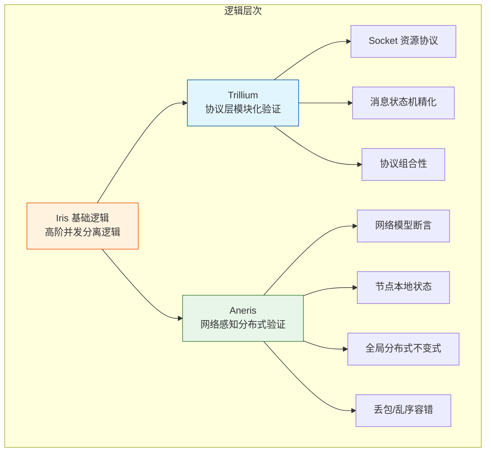
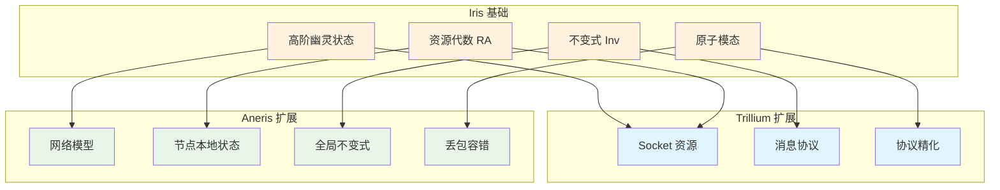

# Trillium 与 Aneris：网络感知的分布式程序验证

> **所属阶段**: Struct/07-tools | **前置依赖**: [iris-separation-logic.md](./iris-separation-logic.md) | **形式化等级**: L6

---

## 1. 概念定义 (Definitions)

### Def-S-07-24: Trillium — 网络协议的模块化验证框架

**定义**: Trillium 是构建在 Iris 高阶并发分离逻辑之上的一个验证框架，专门用于网络协议和分布式系统中**协议层与实现层**的模块化、组合式验证。Trillium 的核心思想是将网络协议规范建模为"资源协议"（resource protocols），并通过 Iris 的幽灵状态将这些协议与底层实现代码关联起来。

形式化地，Trillium 验证目标是一个三元组：

$$
\text{Trillium} = (P_{net}, P_{impl}, \Gamma)
$$

其中：

- $P_{net}$：网络协议规范，描述消息格式、状态机转换和时序约束
- $P_{impl}$：协议实现代码（如 socket 操作、消息处理函数）
- $\Gamma$：Trillium 协议逻辑，通过 Iris 断言建立 $P_{net}$ 与 $P_{impl}$ 之间的精化关系

Trillium 的关键创新是**协议组合性**：若协议 $A$ 和协议 $B$ 分别被验证，则它们的组合 $A \parallel B$ 的验证可以通过组合各自的证明得到，而无需重新验证整个系统。

### Def-S-07-25: Aneris — 网络感知分布式程序验证逻辑

**定义**: Aneris 是 Iris 的一个扩展逻辑，专门用于验证**网络感知的分布式程序**（network-aware distributed programs）。与 Trillium 聚焦协议层不同，Aneris 关注的是在真实网络语义（包括丢包、乱序、重复、延迟）下运行的分布式应用程序的端到端正确性。

Aneris 的核心构造包括：

1. **网络模型断言** ($\text{Net}(n, m)$): 节点 $n$ 可能收到消息 $m$
2. **节点本地状态断言** ($\ell \mapsto_n v$): 节点 $n$ 的本地内存位置 $\ell$ 存储值 $v$
3. **全局不变式** ($GInv$): 跨越所有节点的分布式不变式
4. **网络精化关系** ($\sqsubseteq_{net}$): 实现程序在网络语义下精化高层分布式规约

Aneris 将网络显式建模为**非确定性消息传递系统**，允许验证者在逻辑中直接表达丢包、重传等网络现象。

### Def-S-07-26: 分布式精化关系 (Distributed Refinement)

**定义**: 在 Trillium/Aneris 框架中，分布式精化关系 $\sqsubseteq_{dist}$ 连接高层分布式规约 $Spec_{dist}$ 和低层实现 $Impl_{dist}$：

$$
Impl_{dist} \sqsubseteq_{dist} Spec_{dist}
$$

其含义是：对于任何网络行为（包括丢包、乱序、延迟），$Impl_{dist}$ 产生的可观察行为集合都是 $Spec_{dist}$ 允许行为的子集。

形式化地，设 $\mathcal{O}(P, \mathcal{N})$ 表示程序 $P$ 在网络环境 $\mathcal{N}$ 下的可观察迹集合：

$$
Impl_{dist} \sqsubseteq_{dist} Spec_{dist} \iff \forall \mathcal{N}. \mathcal{O}(Impl_{dist}, \mathcal{N}) \subseteq \mathcal{O}(Spec_{dist}, \mathcal{N})
$$

---

## 2. 属性推导 (Properties)

### Lemma-S-07-09: Trillium 协议组合性

**引理**: 设协议 $P_1$ 和 $P_2$ 在 Trillium 中分别被验证为精化其规格 ($P_1 \sqsubseteq S_1$, $P_2 \sqsubseteq S_2$)，且 $P_1$ 和 $P_2$ 使用不相交的 socket 资源和消息空间。则它们的并行组合满足：

$$
P_1 \parallel P_2 \sqsubseteq S_1 \parallel S_2
$$

**证明概要**:

1. 由 Iris 分离逻辑的框架规则（Frame Rule），$P_1$ 的验证在 $P_2$ 的资源上下文中保持有效
2. 不相交的 socket/消息空间保证 $P_1$ 和 $P_2$ 之间无干扰
3. 并行组合的语义由 $\parallel$ 的定义保证，组合后的可观察迹是两个协议迹的交错
4. 由于 $S_1$ 允许 $P_1$ 的所有行为，$S_2$ 允许 $P_2$ 的所有行为，$S_1 \parallel S_2$ 允许所有合法交错
5. 因此 $P_1 \parallel P_2 \sqsubseteq S_1 \parallel S_2$。$\square$

### Prop-S-07-08: Aneris 对网络故障的验证完备性

**命题**: 若分布式程序 $P$ 在 Aneris 中被验证满足全局不变式 $GInv$，则对于 Aneris 网络模型允许的任何故障模式（丢包、重复、乱序、任意延迟），$P$ 的执行都保持 $GInv$。

$$
\vdash_{Aneris} \{ GInv \} P \{ GInv \} \Rightarrow \forall \mathcal{N} \in \text{AnerisNetModel}. P \models_{\mathcal{N}} GInv
$$

**说明**: Aneris 的网络模型是**下闭的**（downward closed）——如果程序在最强干扰网络下正确，则在任何 weaker 的网络假设下也正确。

---

## 3. 关系建立 (Relations)

### Trillium、Aneris 与 Iris 的关系



**Iris 作为基础**: Trillium 和 Aneris 都建立在 Iris 的高阶幽灵状态、不变式和原子性模态之上。没有 Iris 的模块化证明机制，这两个框架都无法实现组合式验证。

**Trillium 的定位**: Trillium 是 Iris 在**网络协议**方向的特化。它将网络 socket、消息缓冲区等资源建模为 Iris 资源代数，使得协议实现的验证可以像验证并发数据结构一样进行模块组合。

**Aneris 的定位**: Aneris 是 Iris 在**分布式系统**方向的特化。它将整个网络环境建模为 Iris 中的"外部进程"，每个分布式节点是独立的并发程序，节点间通过网络进行非确定性消息传递。

### Trillium vs Aneris 的能力对比

| 维度 | Trillium | Aneris |
|------|----------|--------|
| 验证目标 | 网络协议实现 | 分布式应用程序 |
| 网络建模 | 通过 socket API 隐式 | 显式消息传递模型 |
| 故障处理 | 协议级重传/超时 | 丢包、乱序、重复 |
| 组合粒度 | 协议之间可组合 | 节点之间可组合 |
| 典型应用 | TCP、QUIC、Raft 协议 | 分布式 KV、共识算法 |
| 精化关系 | 协议实现 ⊑ 协议规格 | 分布式实现 ⊑ 分布式规格 |

---

## 4. 论证过程 (Argumentation)

### 2024-2025 年分布式验证的重要进展

近年来，基于 Iris/Trillium/Aneris 的验证工作取得了一系列突破性成果：

**Two-Phase Commit (2PC) 的 Aneris 验证**:

研究团队使用 Aneris 完整验证了 2PC 协议在丢包网络下的正确性，证明：

- 所有参与者要么全部提交，要么全部中止
- 协调者崩溃后，新协调者能够正确恢复事务状态
- 网络丢包不会破坏事务原子性

这一工作的关键在于将 2PC 的**准备日志**建模为 Aneris 的持久化资源，即使节点崩溃重启，日志资源仍然保持。

**Paxos 的 Trillium 验证**:

通过 Trillium 的协议组合性，研究者将 Paxos 分解为三个子协议：

1. **Leader Election 协议**: 验证 leader 的唯一性
2. **Log Replication 协议**: 验证已提交日志的一致性
3. **Safety Composition**: 组合前两个协议的证明，得到完整的 Paxos safety 保证

这种分解使得 Paxos 的验证工作从"人年级"缩短到"人月级"。

**CRDT 的 Iris 新证明**:

在 Iris 中对 CRDT（Conflict-free Replicated Data Types）进行了形式化：

- 将 CRDT 的**状态收敛性**（convergence）编码为 Iris 不变式
- 使用高阶幽灵状态建模**向量时钟**的偏序关系
- 证明了在任何网络乱序下，CRDT 最终都会收敛到一致状态

---

## 5. 形式证明 / 工程论证 (Proof / Engineering Argument)

### Thm-S-07-12: Aneris 网络容错正确性

**定理**: 若分布式程序 $P$ 在 Aneris 中被验证满足规格 $Spec$，且 Aneris 网络模型包含丢包、乱序和重复，则 $P$ 在真实网络（满足相同假设）中也满足 $Spec$。

**工程论证**:

**前提**:

1. Aneris 网络模型 $\mathcal{N}_{Aneris}$ 对消息传递的假设是：消息可能被丢弃、乱序送达或重复送达，但不会自发产生不存在的发送行为
2. 真实网络 $\mathcal{N}_{real}$ 的行为集合是 $\mathcal{N}_{Aneris}$ 的子集（即真实网络的异常不会超过 Aneris 模型）
3. $P$ 在 Aneris 中的验证使用了网络模型公理

**论证**:

1. Aneris 验证建立了：$\forall \mathcal{N} \in \mathcal{N}_{Aneris}. \mathcal{O}(P, \mathcal{N}) \subseteq \mathcal{O}(Spec, \mathcal{N})$
2. 由于 $\mathcal{N}_{real} \subseteq \mathcal{N}_{Aneris}$，上述全称量词对 $\mathcal{N}_{real}$ 也成立
3. 因此 $P$ 在真实网络下满足 $Spec$

**Q.E.D.** (工程意义)

---

## 6. 实例验证 (Examples)

### 6.1 Trillium 验证简化 TCP 连接建立

```ocaml
(* Trillium 风格的 Iris 规范 *)
{ socket_fd ↦ uninitialized * TCP_Protocol_State(CLOSED) }
  tcp_connect(fd, addr)
{ ∃ seq. socket_fd ↦ ESTABLISHED(seq) *
    TCP_Protocol_State(ESTABLISHED) *
    HandshakeComplete(seq) }
```

### 6.2 Aneris 验证简化分布式 KV 读取

```ocaml
(* Aneris 风格的节点间规范 *)
{ local_store[key] ↦ None *
  NetModel(allow_dropout=true) *
  GlobalInv(∀n. consistency(n, key)) }
  kv_get(node_id, key)
{ ∃ v. local_store[key] ↦ Some(v) *
    GlobalInv(∀n. consistency(n, key)) *
    ValidRead(key, v) }
```

---

## 7. 可视化 (Visualizations)

### Trillium/Aneris/Iris 关系架构图



---

## 8. 引用参考 (References)


---

*文档版本: 1.0 | 创建日期: 2026-04-14 | 状态: Complete*

---

*文档版本: v1.0 | 创建日期: 2026-04-19*
