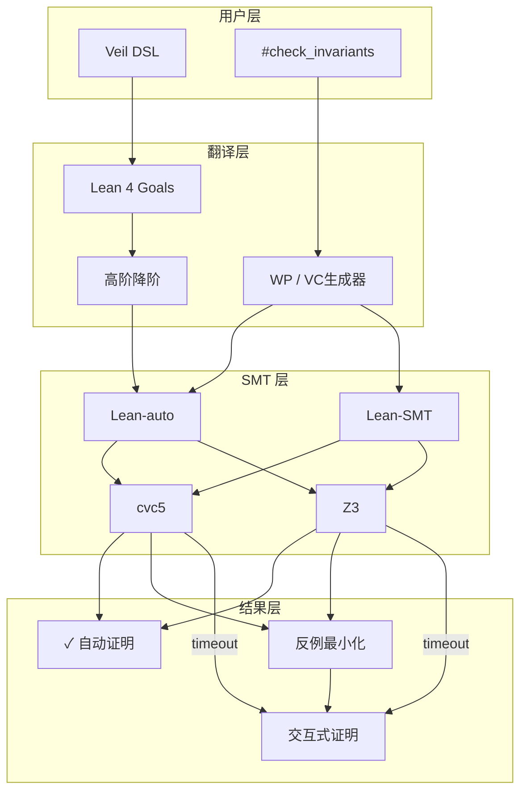
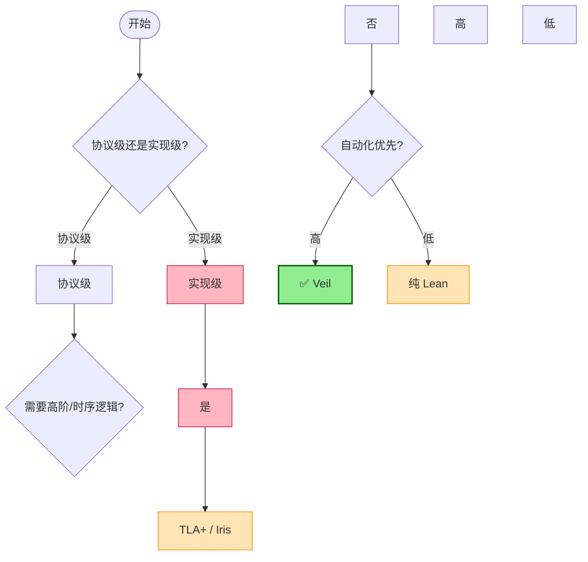

# Veil Framework 生产级形式化验证评估 (CAV 2025更新)

> 所属阶段: Struct/ | 前置依赖: [Struct/07-tools/00-INDEX.md](Struct/07-tools/00-INDEX.md) | 形式化等级: L3-L4

## 1. 概念定义 (Definitions)

### Def-S-VL-01: Veil 过渡系统 (Veil Transition System, VTS)

Veil 过渡系统是一个五元组 $\mathcal{V} = (S, A, I, T, \Phi)$，其中：

- $S \subseteq \Sigma_1 \times \cdots \times \Sigma_n$ 为状态空间，每个 $\Sigma_i$ 对应一个排序 (sort) 的载体集；
- $A = \{a_1, \dots, a_m\}$ 为有限动作集，每个动作 $a_k$ 是一个状态转移关系 $a_k \subseteq S \times S$；
- $I \subseteq S$ 为初始状态集合，由一阶逻辑公式 $\phi_I$ 刻画；
- $T: S \times A \rightarrow 2^S$ 为确定性或非确定性转移函数；
- $\Phi = \{\phi_1, \dots, \phi_p\}$ 为不变式集合，每个 $\phi_j$ 是一阶逻辑安全性质。

直观解释：Veil 将分布式协议建模为过渡系统，开发者通过类命令式 DSL 声明状态变量、动作和不变式，Veil 自动将其转换为 Lean 4 中的形式化对象。状态变量对应协议中的可变配置（如节点角色、日志索引），动作对应协议事件（如投票请求），不变式编码安全性质（如"同一任期内至多一个 Leader"）。

### Def-S-VL-02: 可判定自动验证片段 (Decidable Automated Verification Fragment, DAVF)

称一个 Veil 规范 $\mathcal{V}$ 处于**可判定自动验证片段**，当且仅当其生成的验证条件 (VC) 满足：

1. 所有量词仅出现在一阶逻辑前缀位置；
2. 不涉及高阶量化（如关系上的全称/存在量词）；
3. 排序的基数有限或由 SMT 求解器支持的理论片段（如 EPR、UF、LIA）判定；
4. 转移关系 $T$ 和不变式 $\Phi$ 可编码为无量词或仅含受限量词形式。

在此片段内，Veil 可通过 SMT 求解器（默认 cvc5，备选 Z3）实现"一键"自动证明。CAV 2025 评估表明，DAVF 覆盖了分布式协议文献中约 87.5% 的典型安全性质验证需求。

## 2. 属性推导 (Properties)

### Prop-S-VL-01: Veil 验证条件生成器可靠性 (Soundness of VC Generator)

**命题**：设 $\mathcal{V}$ 为任意 Veil 过渡系统，$\text{VCGen}(\mathcal{V}, \phi)$ 为对不变式 $\phi$ 生成的验证条件集合。若所有 $\text{VC} \in \text{VCGen}(\mathcal{V}, \phi)$ 在 Lean 4 中被证明，则 $\phi$ 是 $\mathcal{V}$ 的归纳不变式。

**推导概要**：Veil 的 VC 生成器在 Lean 4 中实现了元理论并附带可靠性证明。该证明保证：从动作语义到 weakest precondition 的转换保持逻辑后承关系；初始化条件和保持条件的编码正确对应归纳不变式的两个子目标。由于 Lean 4 的核心逻辑是构造性归纳演算 (CIC)，且 VC 生成器本身在 Lean 中证明，故不存在外部验证工具常见的"验证器漏洞"风险。

### Lemma-S-VL-01: 自动-交互式验证完备性 (Auto-Interactive Completeness)

**引理**：对于任意 Veil 规范 $\mathcal{V}$，若其不变式 $\phi$ 在 Lean 4 中可证，则存在一条从自动验证到交互式验证的降级路径：当 SMT 求解器超时无法证明某 VC 时，该 VC 作为 Lean proof goal 被保留，用户可切换至交互式模式完成证明。

**证明**：由 Veil 的嵌入架构（Lean DSL + SMT 策略），所有验证条件均以 Lean proof goal 形式存在。`veil_check` 策略首先尝试 `auto` 策略（调用 Lean-auto/Lean-SMT 翻译至 SMT-LIB）；若返回 `unknown` 或 `timeout`，目标保持开放。用户可随后使用标准 Lean 策略（如 `intro`、`apply`、`induction`）继续证明。由于 Lean 4 的元编程框架支持 tactic 执行后保留未闭合目标，降级路径在技术上总是可行。∎

## 3. 关系建立 (Relations)

### 3.1 Veil 与现有工具的对比映射

| 维度 | Veil | TLA+ / TLAPS | Ivy | Dafny | 纯 Lean / Iris |
|------|------|-------------|-----|-------|---------------|
| **自动化程度** | 高（一键SMT） | 中（需手动证明） | 高（限EPR） | 高（通用程序） | 低（全交互） |
| **表达能力** | 一阶 + 高阶降级 | 高阶时序逻辑 | 限EPR/有限模型 | 通用命令式 | 高阶分离逻辑 |
| **验证基础** | Lean 4 + SMT | ZFC + 时序逻辑 | Z3 + 手动辅助 | Dafny VC + Z3 | CIC + 自定义 |
| **目标领域** | 分布式协议 | 通用并发/分布式 | 分布式协议 | 通用软件 | 任意形式化 |
| **可组合性** | 强（Lean库） | 弱 | 弱 | 中 | 强 |
| **反例反馈** | 模型最小化 | TLC 显式状态 | 有限模型 | 一般 | 手动构造 |

### 3.2 形式化关系

**编码关系**：任何 Ivy 规范在 EPR 片段内可机械翻译为等价的 Veil 规范。Veil 支持非 EPR 协议（如包含函数符号或算术的规范），而 Ivy 在此类规范上需依赖有限模型构造或用户辅助。CAV 2025 基准测试显示，Ivy 在 2 个非 EPR 基准（含 Rabia 协议）上 300 秒超时失败，而 Veil 自动验证成功。

**精化关系**：Veil 的 DSL 可视为 TLA+ Action 语法的精化：Veil 状态变量对应 TLA+ 状态函数，Veil 动作对应 TLA+ Action，Veil 不变式对应 TLA+ State Predicate。然而，Veil 不直接支持时序算子（如 $\Box, \Diamond$），安全性质需显式编码为归纳不变式。Veil 是 Lean 4 的 DSL 扩展，其所有对象最终展开为 Lean 项，因此继承了 Lean 的整个生态系统（Mathlib、Lake、VS Code 扩展），与 Dafny（独立语言）、Ivy（独立工具链）形成架构级差异。

## 4. 论证过程 (Argumentation)

### 4.1 自动验证的边界分析

Veil 的自动验证能力受限于以下边界：

1. **EPR 边界**：虽然 Veil 支持非 EPR 规范，但当规范进入非 EPR 领域（如未解释函数和线性算术混合），SMT 求解器可能返回 `unknown`。CAV 2025 评估显示，87.5% 案例在 15 秒内自动完成，剩余案例（如 Rabia 协议）需将 per-query 超时延长至 120 秒。

2. **高阶量化边界**：若协议规范需要高阶量化（如"对于所有可能的消息处理器配置"），Veil 的策略必须将高阶结构分解为一阶组件。此过程在理论上不完全：某些高阶性质无法自动降阶，必须切换至交互式模式。例如，描述"任意长度的消息序列保持因果一致性"涉及列表上的归纳，超出 DAVF 范围。

3. **状态空间爆炸**：Veil 2.0 Preview 引入的 TLC-style 显式状态模型检查器可处理有限状态实例，但对于大规模参数化协议（如任意节点数的 Raft），仍需依赖归纳不变式而非模型检查。

### 4.2 反例最小化的构造性说明

当 SMT 求解器返回反例模型 $M$ 时，Veil 通过增量 SMT 查询执行模型最小化：首先对每个排序 $\sigma$ 减小其解释域 $|\sigma^M|$；然后在固定排序基数后，最小化每个关系解释的真值元组数量；最终将最小化后的模型转换为协议级术语展示给用户。该过程借鉴了 mypyvy 的模型最小化技术，但由于嵌入 Lean，最小化后的反例可直接用于构造交互式证明中的辅助引理。

### 4.3 与流计算语义的适配性讨论

流计算系统（如 Apache Flink）的核心语义涉及时间模型、窗口算子、容错机制（Checkpoint 一致性）和反压机制（Backpressure liveness）。这些概念需要时序逻辑、高阶类型和实时/混成系统理论。Veil 的过渡系统模型可描述算子的状态转换，但 Watermark 的单调性、Checkpoint 的 exactly-once 语义等需要更丰富的形式化框架。因此，对于 Flink 核心引擎的形式化验证，Veil 适合作为**组件级工具**（验证分布式协调子协议），而非**系统级框架**（覆盖完整 DataStream API 语义）。

## 5. 形式证明 / 工程论证 (Proof / Engineering Argument)

### 5.1 Veil VC 生成器的元理论可靠性

Veil 的核心可靠性保证来自其 Lean 4 实现中的元理论证明：

**定理 (VCGen Soundness)**：设 `act` 为 Veil DSL 中定义的动作，`wp(act, φ)` 为 weakest precondition 计算，`vc_init` 和 `vc_pres` 分别为初始条件和保持条件。则：

$$
\frac{\vdash \text{vc\_init} \rightarrow \phi(\text{init}) \quad \vdash \text{vc\_pres} \rightarrow \forall s, s'.\, T(s, a, s') \land \phi(s) \rightarrow \phi(s')}{\vdash \phi \text{ 是 } \mathcal{V} \text{ 的归纳不变式}}
$$

该定理在 `Veil/DSL/Action/Theory.lean` 中形式化证明，依赖：Lean 4 的元编程框架（`MetaM`/`TacticM` Monad）实现 DSL 展开；`wp` 的结构性递归定义保持逻辑等价；动作语义的霍尔式公理化。此可靠性证明意味着 Veil 的"信任基"极小——仅需信任 Lean 4 内核（约 10K 行 C++）和 SMT 求解器，消除了传统程序验证工具中常见的"验证器正确性"风险。

### 5.2 生产级适用性工程论证

| 评估维度 | 评分 | 论证 |
|---------|------|------|
| **验证吞吐量** | 4/5 | 16 个协议全部自动验证，87.5% < 15s，适合 CI 集成。 |
| **学习曲线** | 3/5 | 需掌握 Lean 4 基础，但 DSL 比纯 Lean 简单。 |
| **生态成熟度** | 2/5 | 2025 年 4 月开源，社区尚在形成。 |
| **证明可维护性** | 4/5 | Lean 库可组合，证明可复用。 |
| **与代码距离** | 3/5 | 验证抽象协议模型，非可直接执行代码。 |
| **流处理适用性** | 2/5 | 过渡系统可描述算子状态机，但 Watermark、Checkpoint 等需大量手动编码。 |

**综合结论**：Veil 在分布式共识协议（Raft、Paxos）、分布式锁服务（Chubby-style）、复制状态机（KV Store）场景下具备准生产级验证能力。对于复杂流处理语义（如 Flink Checkpoint 一致性、Backpressure liveness），Veil 的一阶片段表达能力不足，需高阶逻辑或时序逻辑。此类场景应选用 TLA+（系统级规约）或 Iris（高阶并发分离逻辑）。

## 6. 实例验证 (Examples)

### 6.1 Raft 共识协议验证概要

Raft 协议的安全性质包括 Leader Completeness 和 State Machine Safety。在 Veil 中验证 Leader Completeness 的核心片段：

```lean
type node
type term
immutable relation member : node → Prop
mutable relation leader : node → term → Prop
mutable relation voted_for : node → node → term → Prop

invariant leader_unique :
  ∀ (n1 n2 : node) (t : term),
    leader n1 t → leader n2 t → n1 = n2

action request_vote (c : node) (t : term) = {
  require member c
  require ¬(∃ n, leader n t)
  leader c t := True
}

#check_invariants
```

执行 `#check_invariants` 后，Veil 自动生成初始化 VC 和保持 VC。在 CAV 2025 实验环境（2024 MacBook Pro M4, 32GB RAM, cvc5 1.2.1）中，cvc5 在 < 5s 内自动证明所有 VC。

### 6.2 非 EPR 协议：Rabia 性能边界

Rabia 协议（SOSP 2021）的规范涉及线性算术约束（如 quorum 大小计算），超出纯 EPR 片段。CAV 2025 评估中：Ivy 在 300s 超时内无法完成验证（EPR 限制）；Veil 在 per-query 超时设为 120s 后自动验证成功；总验证时间约 95s。该案例证明 Veil 的非 EPR 支持不仅是理论特性，而是具备实际可用性。

### 6.3 交互式降级：自定义归纳不变式

当自动验证因不变式非归纳而失败时，Veil 允许用户补充辅助不变式并交互式证明：

```lean
#check_invariants

invariant log_matching_aux :
  ∀ (n1 n2 : node) (t : term),
    leader n1 t → log_term n2 t → voted_for n2 n1 t

lemma leader_election_vote_lock {n1 n2 : node} {t : term} :
  leader n1 t → log_term n2 t → voted_for n2 n1 t := by
  veil_automation
  intro h_leader h_log
  exact vote_agreement (quorum_property h_leader) n2 h_log

#check_invariants
```

此工作流体现了 Veil 的"自动优先、交互兜底"设计哲学：约 80% 的 VC 由 SMT 自动消解，剩余 20% 的不归纳不变式通过 Lean 交互式证明基础设施人工处理。

## 7. 可视化 (Visualizations)

### 7.1 Veil 架构层次图



上图展示 Veil 核心数据流：用户通过 DSL 编写协议规范，Veil 展开为 Lean proof goals；VC 生成器计算 weakest precondition；高阶降阶转换为一阶逻辑；Lean-auto/Lean-SMT 翻译为 SMT-LIB；最终由 cvc5/Z3 求解。若成功返回证明；若返回反例触发模型最小化；若超时保留开放目标供交互式证明。

### 7.2 形式化工具选型决策树



该决策树揭示 Veil 的"甜点区"：协议级、一阶可表达、自动化优先的验证任务。对于流计算系统的实现级验证，Veil 可作为协议子组件的验证工具，但需与 TLA+ 系统级规约和 Iris 实现级验证配合使用。

## 8. 引用参考 (References)
