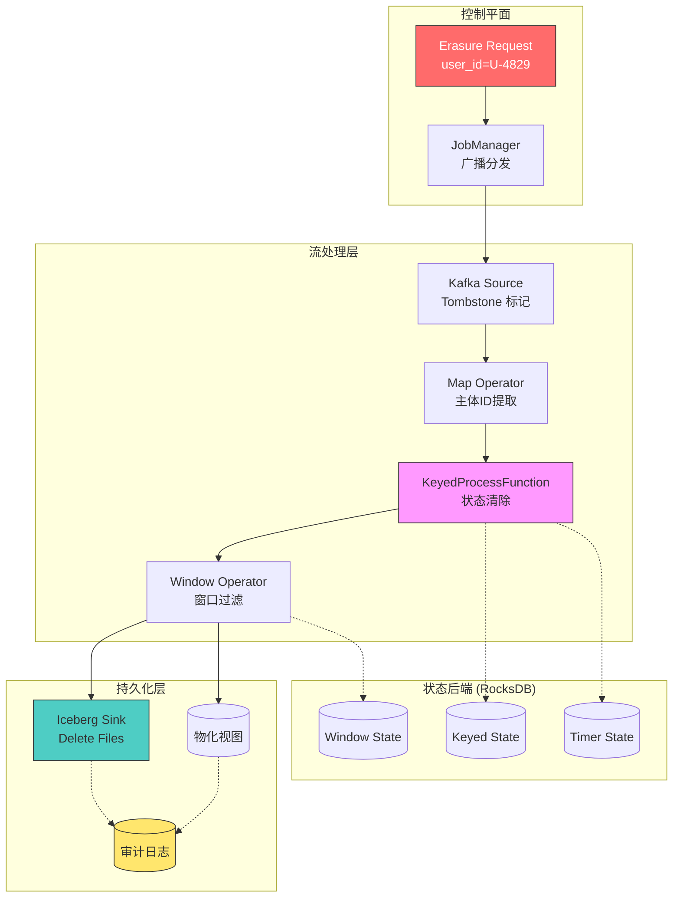
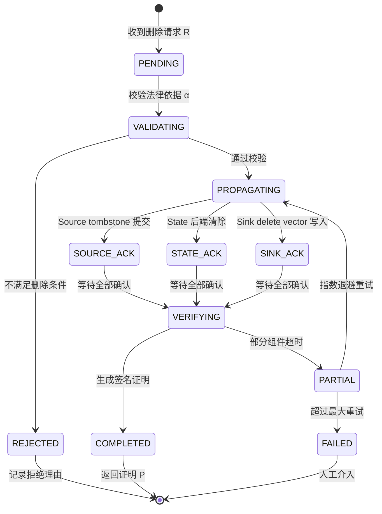

# RegTech: GDPR删除权在流系统中的形式化建模

> 所属阶段: Struct/ | 前置依赖: [Struct/02-properties/02.02-consistency-hierarchy.md](../../Struct/02-properties/02.02-consistency-hierarchy.md), [Knowledge/08-standards/streaming-data-governance.md](../../Knowledge/08-standards/streaming-data-governance.md) | 形式化等级: L4

## 1. 概念定义 (Definitions)

**Def-S-08-01** (流数据主体身份标识, Streaming Data Subject Identity). 给定流系统 $\mathcal{S} = (V, E, \Sigma, \mathcal{T})$，其中 $V$ 为算子集合，$E \subseteq V \times V$ 为有向数据流边，$\Sigma$ 为状态后端集合，$\mathcal{T}$ 为时间域。设事件全域为 $\mathcal{E}$，主体标识域为 $\mathcal{I}$。映射 $\phi: \mathcal{E} \rightarrow \mathcal{I} \cup \{\bot\}$ 称为**主体身份提取函数**。若 $\phi(e) = i \in \mathcal{I}$，则称 $e$ 属于主体 $i$；若 $\phi(e) = \bot$，则 $e$ 为匿名事件，不受删除权约束。

**Def-S-08-02** (删除请求, Erasure Request). 删除请求是一个五元组 $R = (i, t_{req}, \tau, \rho, \alpha)$，其中：

- $i \in \mathcal{I}$：目标主体标识；
- $t_{req} \in \mathcal{T}$：请求时间戳；
- $\tau \in \{\text{HARD}, \text{SOFT}\}$：删除模式（`HARD` 为物理删除，`SOFT` 为逻辑删除）；
- $\rho \subseteq V \cup \Sigma \cup \{\text{Sink}\}$：删除作用范围；
- $\alpha \in \{\text{GDPR-Art17}, \text{CCPA-1798.105}, \text{Custom}\}$：法律依据。

**Def-S-08-03** (流删除完备性, Streaming Erasure Completeness). 对于删除请求 $R$，若流系统 $\mathcal{S}$ 在时刻 $t \geq t_{req} + \Delta_{max}$ 满足：

1. **算子输出清除**：$\forall v \in \rho \cap V: \nexists e \in \text{Out}(v, t) : \phi(e) = i$；
2. **状态后端清除**：$\forall \sigma \in \rho \cap \Sigma: \text{KeyState}(\sigma, i, t) = \emptyset$；
3. **Sink 持久化清除**：$\forall s \in \rho \cap \{\text{Sink}\}: \text{Read}(s, t) \cap \{e \mid \phi(e) = i\} = \emptyset$；

则称 $\mathcal{S}$ 对 $R$ 实现了**删除完备性**，其中 $\Delta_{max}$ 为系统承诺的最大删除传播时延。

**Def-S-08-04** (不可抵赖删除证明, Non-repudiable Erasure Proof). 不可抵赖删除证明是密码学签名元组 $P = (H(R), t_{complete}, \pi_{audit}, \text{Sig}_{system})$，其中 $H(R)$ 为请求哈希，$t_{complete}$ 为完成时间戳，$\pi_{audit}$ 为各组件删除确认证据集合，$\text{Sig}_{system}$ 为系统私钥签名。

## 2. 属性推导 (Properties)

**Lemma-S-08-01** (删除日志单调性). 设 $\mathcal{L}$ 为审计日志，对于同一主体 $i$ 的删除请求序列 $R_1, \ldots, R_n$，若 $t_{req}^{(1)} < \cdots < t_{req}^{(n)}$，则：

$$\mathcal{L}(i, t_{req}^{(k)}) \subseteq \mathcal{L}(i, t_{req}^{(k+1)}), \quad \forall k \in [1, n-1]$$

*Proof sketch.* 审计日志为 append-only 不可变结构，新请求仅追加条目，历史条目不可变，故单调性成立。$\square$

**Prop-S-08-01** (最终删除一致性). 在无环流拓扑 $G = (V, E)$ 中，若每个算子满足本地删除 ACK 语义，且通道采用 at-least-once 投递保证，则对于任意删除请求 $R$，系统在有限时间内以概率 1 达到删除完备性。

*Proof sketch.* 将算子删除确认视为标记(token)，沿 DAG 正向边传播。图有限无环，标记必在有限步内到达所有可达节点。at-least-once 语义下单次投递失败概率 $p < 1$，无限重试失败概率为 $\lim_{n \to \infty} p^n = 0$。由 Borel-Cantelli 引理，有限时间内完成全部投递的概率为 1。$\square$

## 3. 关系建立 (Relations)

### 3.1 与 Resettable Streaming Model 的映射

Resettable Streaming Model 将流系统抽象为 $\text{snapshot}$、$\text{reset}$、$\text{replay}$ 三个操作。删除请求 $R$ 可嵌入为**带作用域约束的部分复位** $\text{reset}_{|i}$，仅回退与主体 $i$ 相关的状态与输出，而非全局复位。该映射表明，删除权实现可复用现有 checkpoint/restore 基础设施，但需引入细粒度的 subject-keyed 索引。

### 3.2 与 GDPR Article 17 及 CCPA §1798.105 的对齐

GDPR Article 17 要求控制者"毫不迟延地"(without undue delay)删除个人数据，法定期限通常为 **30 个自然日**（可延长至 60 日）。CCPA §1798.105 要求企业在 **45 个自然日** 内完成删除（可一次性延长 45 日）。形式化框架中，系统承诺时延 $\Delta_{max}$ 必须满足：

$$\Delta_{max} \leq \begin{cases} 30 \text{ 日} & \alpha = \text{GDPR-Art17} \\ 45 \text{ 日} & \alpha = \text{CCPA-1798.105} \end{cases}$$

流处理场景下，工程实践通常将 $\Delta_{max}$ 压缩至分钟级甚至秒级。

### 3.3 与湖仓一体删除向量的关系

Apache Iceberg Delete Files 与 Delta Lake Deletion Vectors 为 SOFT 删除提供物理层实现。delete vector $D = \{(p_k, i_k)\}$ 中 $p_k$ 为数据文件路径，$i_k$ 为待删除主体标识。查询执行时扫描算子应用 $D$ 过滤，在读路径上实现不可观测性，与 Def-S-08-03 的 Sink 清除条件直接对应。

## 4. 论证过程 (Argumentation)

### 4.1 反例：环状拓扑中的删除传播

若流系统存在反馈环（如迭代流处理），Prop-S-08-01 的收敛性不再成立。考虑两算子环 $v_1 \leftrightarrow v_2$，其中 $v_2$ 将聚合结果回传至 $v_1$。若主体 $i$ 的数据已进入该环，则删除标记可能无限循环传播，因为回传结果可能"重新生成"与 $i$ 相关的新事件。**结论**：一般环状拓扑中删除完备性不可判定；工程上需限制 $\rho$ 不包含环内算子，或要求环内算子支持**可逆聚合**。

### 4.2 边界讨论：派生数据与不可识别性

GDPR Article 17(1) 要求删除"个人数据"，但 Article 17(3)(b) 豁免了已采取适当保障措施的统计数据。若算子 $v$ 的函数 $f: \mathcal{E}^* \rightarrow \mathcal{X}$ 满足输出仅依赖于主体存在性/数量，而不依赖其具体内容，则 $f$ 的输出为**匿名化的**，不在删除权约束范围内。

### 4.3 跨地域复制的时延边界

若 Sink 部署于多地域，删除传播需跨网络边界。工程上采用**异步复制 + 源端 tombstone** 策略：源地域写入 tombstone 后即向监管者返回 ACK，后台异步复制 delete vector 至其他地域。该策略将法定合规时延与物理复制时延解耦。

## 5. 形式证明 / 工程论证 (Proof / Engineering Argument)

**Thm-S-08-01** (无环拓扑删除完备性). 设流系统 $\mathcal{S}$ 的算子拓扑为 DAG $G = (V, E)$。若删除请求 $R = (i, t_{req}, \text{HARD}, \rho, \alpha)$ 在源算子 $v_{src} \in \rho$ 被受理，且满足：

1. 每个算子 $v \in V$ 收到删除标记后于 $\delta_v$ 内清除主体 $i$ 的所有状态与输出；
2. 算子间通道满足 FIFO 保序投递；
3. 状态后端支持按 key $i$ 的原子清除，耗时 $\delta_\sigma$；

则系统于时刻 $t_{complete}$ 达到删除完备性，且：

$$t_{complete} \leq t_{req} + \sum_{v \in \text{TopoSort}(G[\rho])} \delta_v + |E[\rho]| \cdot \delta_{net} + \max_{\sigma \in \rho \cap \Sigma} \delta_\sigma$$

其中 $G[\rho]$ 为限制在 $\rho$ 内的诱导子图，$\delta_{net}$ 为网络传输上界。

*Proof.* 对拓扑排序后的算子序列归纳。**基例**：源算子 $v_{src}$ 于 $t_{req}$ 受理，由假设 1 于 $t_{req} + \delta_{v_{src}}$ 完成清除。**归纳步**：设前 $k$ 个算子均按时完成。对第 $k+1$ 个算子 $v_{k+1}$，其所有前驱均已完成并发出删除标记。由 DAG 性质，入边均来自前 $k$ 个算子；由假设 2，标记不会晚于后续数据到达；由假设 1，$v_{k+1}$ 于收到标记后 $\delta_{v_{k+1}}$ 内完成清除。状态后端清除与算子并行执行，由最慢后端决定。综合得证。$\square$

### 5.1 工程论证：数据标记 vs 物理删除

| 维度 | Tombstone (SOFT) | Physical Deletion (HARD) |
|------|------------------|--------------------------|
| 合规证据 | 天然保留审计记录 | 需额外写入审计日志 |
| 读路径开销 | 需应用 delete vector | 无额外过滤 |
| 写路径开销 | 低，仅追加元数据 | 高，需重写数据文件 |
| 可恢复性 | 可撤销误删 | 不可逆 |
| 存储增长 | 累积，需 compaction | 无增长 |

**工程建议**：流处理层采用 tombstone 传播（Flink keyed state TTL + side-output），Sink 层根据引擎能力选型。Iceberg/Delta 优先采用 SOFT 删除并配置周期性 compaction；传统数据库 Sink 通过 DELETE SQL 实现 HARD 删除。

### 5.2 状态后端的删除传播机制

以 Flink RocksDB State Backend 为例，删除传播流程为：(1) 控制流接入请求 $R$；(2) JobManager 广播至 TaskManager；(3) 各实例执行 RocksDB prefix scan 定位 key；(4) `DeleteRange` 或单 key `delete` 清除；(5) Checkpoint 持久化清除操作；(6) 通过 side-output 同步下游 Sink。若维护倒排索引 $I: \mathcal{I} \rightarrow 2^{\text{KeySpace}}$，scan 复杂度可由 $O(|\text{State}|)$ 降至 $O(|\text{Keys}(i)|)$，显著压缩 $\delta_\sigma$。

## 6. 实例验证 (Examples)

### 6.1 Flink 作业中的 GDPR 删除

实时用户行为分析拓扑：`Kafka Source -> Map -> KeyedProcessFunction -> Window -> Iceberg Sink`。收到 `user_id = U-4829` 的删除请求：

```java
DataStream<ErasureRequest> erasureStream = env
    .addSource(new ErasureRequestSource())
    .broadcast(ERASURE_STATE_DESCRIPTOR);

mainStream
    .keyBy(event -> event.userId)
    .connect(erasureStream)
    .process(new KeyedErasureCoProcessFunction() {
        @Override
        public void processElement2(ErasureRequest req, Context ctx, Collector<Aggregate> out) {
            if (req.getSubjectId().equals(ctx.getCurrentKey())) {
                valueState.clear();
                timerState.clear();
                out.collect(new TombstoneRecord(req.getSubjectId(), req.getTimestamp()));
                auditLog.append(AuditEntry.deleted(ctx.getCurrentKey()));
            }
        }
    })
    .addSink(new IcebergSink<>());
```

`KeyedErasureCoProcessFunction` 确保单 key 上下文中的状态清除与 tombstone 发射。Iceberg Sink 将 `TombstoneRecord` 转化为 equality delete 条目。

### 6.2 Iceberg Delete Vector 的合规读路径

Iceberg 表 `user_events` 包含数据文件 `data-001.orc` 与删除文件 `delete-001.avro`（记录 `equality_deletes: user_id = 'U-4829'`）。合规查询时 Iceberg 自动应用 delete vector：

```sql
SELECT * FROM user_events WHERE event_time > '2026-01-01';
-- 结果集中不包含 user_id = 'U-4829' 的记录
```

此时 $\text{Read}(s, t)$ 满足 Def-S-08-03 的 Sink 清除条件。查询优化器通过 metadata 层跳过标记删除的文件，兼顾合规性与性能。

### 6.3 不可抵赖删除证明

删除完成后系统生成审计证明：

```json
{
  "proof_id": "erp-20260423-7a3f9e",
  "request_hash": "SHA256:9f86d08...",
  "completed_at": "2026-04-23T08:48:05Z",
  "components": [
    {"component": "kafka-source", "ack": "tombstone_committed"},
    {"component": "keyed-process", "ack": "state_cleared"},
    {"component": "rocksdb", "ack": "keys_deleted:47"},
    {"component": "iceberg-sink", "ack": "delete_file_written"}
  ],
  "signature": "RSA-SHA256:MEUCIQ..."
}
```

该证明允许审计者验证各组件状态完整性，无需暴露原始业务数据。

## 7. 可视化 (Visualizations)

### 图 1：流系统中 GDPR 删除传播拓扑



### 图 2：删除请求生命周期状态机



## 8. 引用参考 (References)
