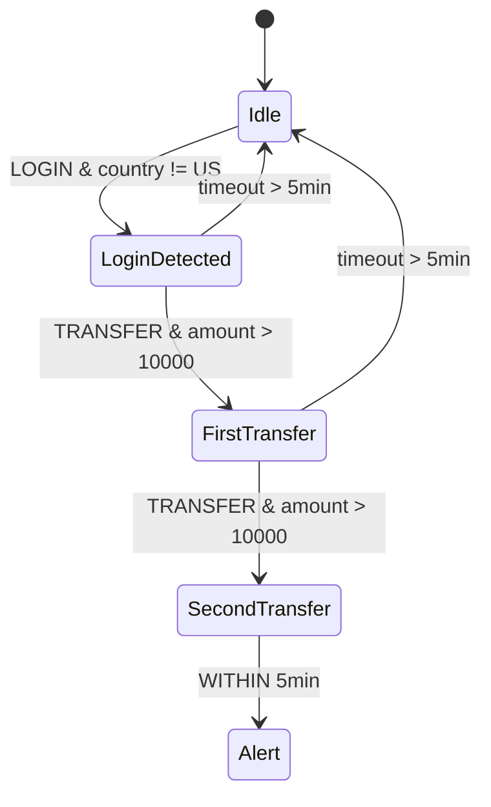

# 流式复杂事件处理 (CEP) 标准规范

> 所属阶段: Struct | 前置依赖: [streaming-sql-standard.md](./streaming-sql-standard.md) | 形式化等级: L4

## 1. 概念定义 (Definitions)

### Def-S-08-02-01: 复杂事件模式 (CEP Pattern)

复杂事件模式 $\mathcal{P}$ 是一个五元组：

$$
\mathcal{P} = (\mathcal{E}, \prec, \tau, \phi, \kappa)
$$

其中：

- $\mathcal{E} = \{E_1, E_2, \ldots, E_n\}$: 基本事件类型集合
- $\prec \subseteq \mathcal{E} \times \mathcal{E}$: 事件间偏序关系
- $\tau: \mathcal{E} \to \mathbb{R}_{\geq 0}$: 事件时间戳函数
- $\phi: \mathcal{E}^* \to \{\text{true}, \text{false}\}$: 模式匹配谓词
- $\kappa \in \mathbb{R}_{\geq 0} \cup \{\infty\}$: 模式匹配时间窗口

### Def-S-08-02-02: 模式匹配语义

对于输入事件流 $S = \langle e_1, e_2, \ldots \rangle$，模式 $\mathcal{P}$ 的匹配结果 $Match(\mathcal{P}, S)$ 定义为：

$$
Match(\mathcal{P}, S) = \{ \langle e_{i_1}, e_{i_2}, \ldots, e_{i_k} \rangle \mid i_1 < i_2 < \ldots < i_k \land \phi(e_{i_1}, \ldots, e_{i_k}) = \text{true} \land \tau(e_{i_k}) - \tau(e_{i_1}) \leq \kappa \}
$$

## 2. 属性推导 (Properties)

### Lemma-S-08-02-01: 模式匹配的单调性

若 $\langle e_1, \ldots, e_k \rangle \in Match(\mathcal{P}, S)$，则对于任意前缀 $S' = \langle e_1, \ldots, e_j \rangle$（$j \geq i_k$），有 $\langle e_1, \ldots, e_k \rangle \in Match(\mathcal{P}, S')$。

### Lemma-S-08-02-02: 时间窗口的完备性

在有限时间窗口 $\kappa < \infty$ 下，$Match(\mathcal{P}, S)$ 的计算空间复杂度为 $O(|S| \cdot \kappa \cdot |\mathcal{E}|)$。

## 3. 关系建立 (Relations)

### CEP 与正则表达式的对应

| CEP 操作符 | 正则表达式类比 | 语义 |
|-----------|--------------|------|
| 顺序 (Next) | $AB$ | $A$ 后紧跟 $B$ |
| 跟随 (FollowedBy) | $A.*B$ | $A$ 后任意事件再 $B$ |
| 或 (Or) | $A \| B$ | $A$ 或 $B$ |
| 重复 (Times) | $A\{n\}$ | $A$ 重复 $n$ 次 |
| 可选 (Optional) | $A?$ | $A$ 出现 0 或 1 次 |
| 否定 (Not) | $[^A]$ | 非 $A$ |

## 4. 论证过程 (Argumentation)

### CEP 语义的形式化挑战

1. **非确定性匹配**: 同一事件序列可能匹配多个模式实例
2. **时间窗口边界**: 窗口到期时部分匹配的处理策略（严格 vs 宽松）
3. **事件等价性**: 语义等价但结构不同的事件如何统一识别

## 5. 形式证明 / 工程论证 (Proof)

### Thm-S-08-02-01: CEP 模式完备性定理

对于任意正则语言 $L$ 定义在字母表 $\Sigma = \mathcal{E}$ 上，存在 CEP 模式 $\mathcal{P}_L$ 使得 $Match(\mathcal{P}_L, S)$ 精确识别 $L$ 在流 $S$ 中的所有实例。

**证明框架**:

- 将正则表达式转换为 NFA
- 将 NFA 状态映射为 CEP 模式状态
- 利用时间窗口 $\kappa$ 处理 Kleene 星号的无限展开
- 每个 NFA 转移对应 CEP 顺序或跟随操作符

## 6. 实例验证 (Examples)

### 示例: 欺诈检测模式

```sql
-- Flink CEP 模式示例
PATTERN (START_EVENT FOLLOWED_BY SUSPICIOUS_EVENT{2,})
  WITHIN 5 MINUTES
DEFINE
  START_EVENT AS type = 'LOGIN' AND country != 'US',
  SUSPICIOUS_EVENT AS type = 'TRANSFER' AND amount > 10000
```

对应形式化模式：

- $\mathcal{E} = \{LOGIN, TRANSFER\}$
- $\prec = \{(LOGIN, TRANSFER)\}$
- $\kappa = 5\text{min}$
- $\phi(e_1, e_2, e_3) = (e_1.\text{country} \neq \text{US}) \land (e_2.\text{amount} > 10000) \land (e_3.\text{amount} > 10000)$

## 7. 可视化 (Visualizations)

### CEP 模式匹配状态机



## 8. 引用参考 (References)
