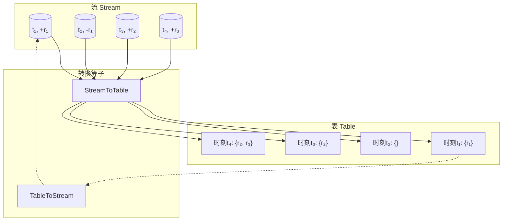
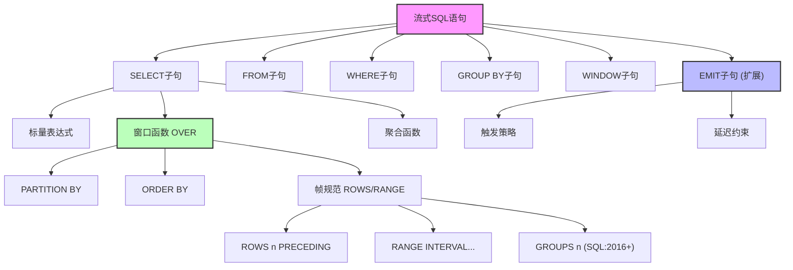
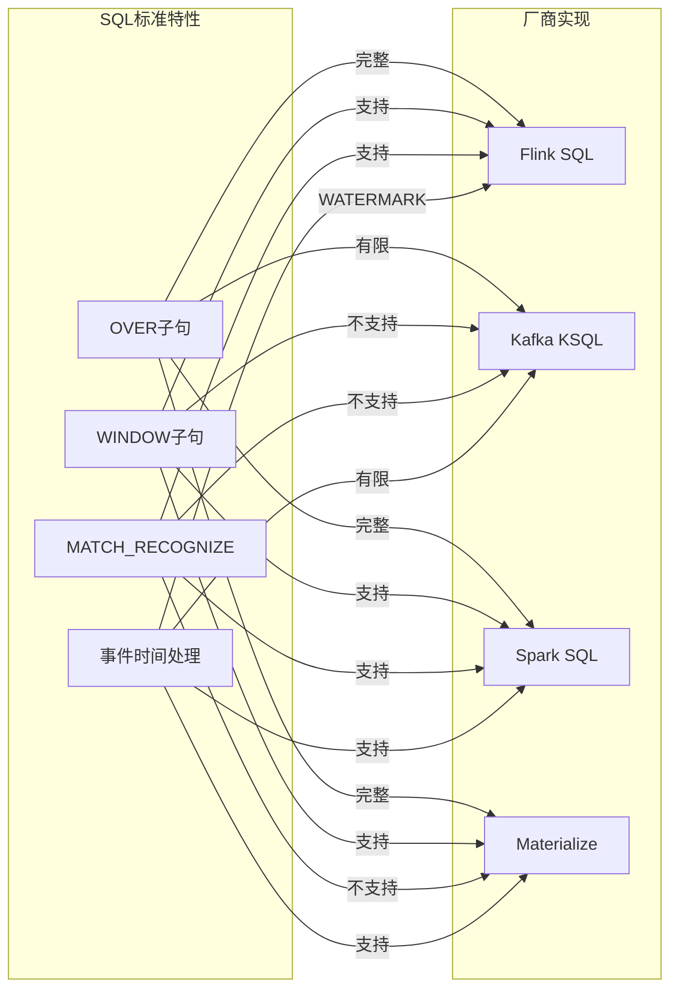

# 流式SQL标准 - SQL:2011/2023与扩展

> 所属阶段: Struct/ | 前置依赖: [01-basics/stream-processing-foundation.md](../01-basics/stream-processing-foundation.md) | 形式化等级: L4

## 1. 概念定义 (Definitions)

### Def-S-08-01: SQL:2011流扩展 (SQL:2011 Stream Extensions)

**形式化定义：**

SQL:2011标准引入了**窗口函数 (Window Functions)** 和**时间周期支持 (Temporal Period Support)**，为流数据处理奠定了语法基础。设关系 $R$ 为时态关系，定义其时间属性为：

$$
R^T = \{ (t, r) \mid t \in \mathbb{T}, r \in R \}
$$

其中 $\mathbb{T}$ 为时间域，SQL:2011定义了两种时间周期：

- **应用时间周期 (Application-Time Period)**: 由用户管理的业务时间区间 $[start, end)$
- **系统时间周期 (System-Time Period)**: 由DBMS自动管理的事务时间戳

**窗口函数核心语法：**

$$
\text{window_function}(args) \text{ OVER } (\text{PARTITION BY } p_1, ..., p_n \text{ ORDER BY } o_1, ..., o_m \text{ frame_spec})
$$

其中 `frame_spec` 定义行窗口边界：

$$
\text{frame_spec} ::= \text{ROWS } | \text{RANGE } | \text{GROUPS } \{ \text{frame_extent} \}
$$

---

### Def-S-08-02: 窗口函数标准语法 (Standard Window Function Syntax)

**形式化定义：**

设流 $S$ 为时序事件序列 $S = \langle e_1, e_2, ..., e_n \rangle$，每个事件 $e_i$ 携带时间戳 $t_i$。窗口函数在窗口 $W$ 上定义：

$$
W = \{ e_i \in S \mid t_{start} \leq t_i \leq t_{end} \}
$$

SQL:2011 定义的**窗口帧类型**：

| 帧类型 | 语法 | 语义 |
|--------|------|------|
| 行帧 | `ROWS n PRECEDING` | 基于物理行前 $n$ 行 |
| 范围帧 | `RANGE INTERVAL '1' HOUR PRECEDING` | 基于时间值范围 |
| 组帧 | `GROUPS n PRECEDING` | 基于对等组 (SQL:2016+) |

**窗口边界定义：**

$$
\text{frame_start} ::= \text{UNBOUNDED PRECEDING} \mid n \text{ PRECEDING} \mid \text{CURRENT ROW}
$$

$$
\text{frame_end} ::= \text{UNBOUNDED FOLLOWING} \mid n \text{ FOLLOWING} \mid \text{CURRENT ROW}
$$

---

### Def-S-08-03: 流表对偶性 (Stream-Table Duality)

**形式化定义：**

流表对偶性描述了流与表之间的**同构关系**。设：

- 表 $T$ 为某一时刻的快照：$T = \{ r_1, r_2, ..., r_m \}$
- 流 $S$ 为带时间戳的变化序列：$S = \langle (t_1, \Delta_1), (t_2, \Delta_2), ... \rangle$

**定义转换算子：**

$$
\text{TableToStream}(T) = \{ (t, +r) \mid r \in T, t = \text{NOW}() \}
$$

$$
\text{StreamToTable}(S, t) = \{ r \mid \exists (t_i, +r) \in S, t_i \leq t \} \setminus \{ r \mid \exists (t_j, -r) \in S, t_j \leq t \}
$$

**对偶性定理：** 对于任意表 $T$ 和流 $S$，满足：

$$
\text{StreamToTable}(\text{TableToStream}(T), t) = T, \quad \forall t \geq \text{NOW}()
$$

**SQL语义等价：**

| 流操作 | 表操作等价形式 |
|--------|----------------|
| `SELECT * FROM S [RANGE 1 HOUR]` | `SELECT * FROM T WHERE t >= NOW() - INTERVAL '1' HOUR` |
| `INSERT INTO S` | `INSERT INTO T` |
| `SELECT ... EMIT WITH DELAY` | 物化视图刷新 |

---

## 2. 属性推导 (Properties)

### Lemma-S-08-01: 窗口函数闭包性

对于任意窗口函数 $f$ 和流 $S$，窗口化操作保持关系代数闭包：

$$
\forall f, S: \quad f(S[W]) \subseteq S[W]
$$

**证明概要：** 窗口函数仅对已有行进行计算，不引入新元组，仅可能过滤或聚合。

---

### Lemma-S-08-02: 流表转换的幂等性

流表转换操作满足**幂等性**条件：

$$
\text{TableToStream}(\text{StreamToTable}(S, t)) = S_t
$$

其中 $S_t$ 表示流 $S$ 在时刻 $t$ 的切片。

---

### Prop-S-08-01: SQL:2011 窗口函数完备性

SQL:2011 标准定义的窗口函数类别包括：

1. **排名函数**: `ROW_NUMBER()`, `RANK()`, `DENSE_RANK()`, `NTILE(n)`
2. **分布函数**: `PERCENT_RANK()`, `CUME_DIST()`
3. **前后函数**: `LAG()`, `LEAD()`
4. **首尾函数**: `FIRST_VALUE()`, `LAST_VALUE()`, `NTH_VALUE()`
5. **聚合函数扩展**: `SUM()`, `AVG()`, `COUNT()`, `MIN()`, `MAX()` (窗口版本)

对于流式场景，这些函数在**有序窗口**上保持语义一致性。

---

### Prop-S-08-02: 时间语义一致性

设 $S$ 为事件时间戳流，$W$ 为基于事件时间的窗口，则：

$$
\forall e_i, e_j \in S: \quad t_i < t_j \implies e_i \in W_k \Rightarrow e_j \in W_{k'} \text{ 且 } k \leq k'
$$

即事件时间顺序与窗口顺序保持一致。

---

## 3. 关系建立 (Relations)

### 3.1 标准演进关系

```
SQL:2003 ──→ SQL:2011 ──→ SQL:2016 ──→ SQL:2023
    │            │            │            │
    │            ▼            │            ▼
    │      窗口函数         JSON支持     更多流特性
    │      时间周期          GROUPS帧    行模式识别
    │                                 (MATCH_RECOGNIZE)
    ▼
 基础聚合
 子查询
```

**关键演进节点：**

| 标准版本 | 核心特性 | 对流计算的意义 |
|----------|----------|----------------|
| SQL:2003 | 分析函数初稿 | 基础聚合框架 |
| SQL:2011 | 窗口函数标准化、时间周期 | **流处理语法基础** |
| SQL:2016 | JSON、多态表、组帧 | 半结构化流处理 |
| SQL:2023 | `MATCH_RECOGNIZE`、行模式 | **CEP标准化** |

---

### 3.2 厂商扩展与标准映射

| 标准特性 | Apache Flink | Kafka KSQL | Spark SQL | Materialize |
|----------|--------------|------------|-----------|-------------|
| `OVER` 子句 | ✅ 完整 | ✅ 有限 | ✅ 完整 | ✅ 完整 |
| `WINDOW` 子句 | ✅ | ❌ | ✅ | ✅ |
| `MATCH_RECOGNIZE` | ✅ | ❌ | ✅ | ❌ |
| 事件时间处理 | ✅ `WATERMARK` | ⚠️ 有限 | ✅ | ✅ |
| `EMIT` 策略 | ✅ `EMIT WITH DELAY` | ⚠️ 隐式 | ⚠️ 触发器 | ✅ `TAIL` |

---

### 3.3 语法结构层次

```
流式SQL语句
    ├── SELECT 子句
    │       ├── 标量表达式
    │       ├── 窗口函数 (OVER)
    │       └── 聚合函数
    ├── FROM 子句
    │       ├── 流源
    │       ├── 表源
    │       └── 子查询
    ├── WINDOW 子句 (命名窗口)
    ├── WHERE 子句 (过滤)
    ├── GROUP BY 子句
    ├── HAVING 子句
    └── EMIT 子句 (流扩展)
            ├── 触发策略
            └── 延迟约束
```

---

## 4. 论证过程 (Argumentation)

### 4.1 窗口帧选择的边界分析

**问题：** 在流处理中选择 `ROWS` vs `RANGE` 帧的权衡。

**分析：**

| 维度 | ROWS 帧 | RANGE 帧 |
|------|---------|----------|
| 语义 | 物理行计数 | 逻辑时间值 |
| 确定性 | 依赖摄入顺序 | 依赖事件时间戳 |
| 无序处理 | 需排序缓冲 | 天然支持乱序 |
| 资源消耗 | 固定窗口大小 | 动态窗口大小 |
| 适用场景 | 计数限制场景 | 时间窗口场景 |

**论证：** 流处理优先选择 `RANGE` 帧，因为事件时间语义比处理顺序更稳定。

---

### 4.2 流表对偶的工程意义

**核心论证：**

流表对偶性使得同一套SQL引擎可以同时处理：

1. **批处理查询**（表语义）
2. **流处理查询**（流语义）

通过统一语法降低学习成本，但实现层面需要不同的执行策略：

- 表查询：全量扫描 + 物化结果
- 流查询：增量计算 + 持续更新

---

### 4.3 标准与扩展的兼容性挑战

**反例分析：**

Apache Flink 的 `EMIT WITH DELAY` 语法：

```sql
SELECT TUMBLE_START(event_time, INTERVAL '1' HOUR) as window_start,
       COUNT(*) as cnt
FROM events
GROUP BY TUMBLE(event_time, INTERVAL '1' HOUR)
EMIT WITH DELAY '5' MINUTE
```

此扩展**非标准SQL**，但解决了迟到数据处理的实际问题。标准演进需考虑：

- 语法兼容性
- 语义一致性
- 实现可行性

---

## 5. 形式证明 / 工程论证 (Proof / Engineering Argument)

### 5.1 SQL:2011 窗口函数在流上的正确性

**定理 (Thm-S-08-01):** SQL:2011 窗口函数在有限窗口的流上保持结果正确性。

**证明：**

设流 $S$ 的事件序列为 $\langle e_1, e_2, ..., e_n \rangle$，窗口 $W$ 定义时间区间 $[t_s, t_e]$。

**定义窗口切片：**

$$
S[W] = \{ e_i \in S \mid t_s \leq t_i \leq t_e \}
$$

**窗口函数性质：**

对于聚合窗口函数 $f \in \{SUM, AVG, COUNT, MIN, MAX\}$：

$$
f(S[W]) = f(\{ v_i \mid e_i \in S[W] \})
$$

由于 $S[W]$ 为有限集合，且聚合函数在有限集上良定义，故结果正确。

**增量更新论证：**

设新事件 $e_{new}$ 到达，若 $t_{new} \in [t_s, t_e]$：

$$
f(S[W] \cup \{e_{new}\}) = f(S[W]) \oplus v_{new}
$$

其中 $\oplus$ 为增量聚合操作（如 $SUM$ 的 $\oplus$ 为加法）。

**结论：** SQL:2011 窗口函数语义可无损迁移至流处理场景。

∎

---

### 5.2 流表对偶性实现论证

**工程论证：** Materialize 和 Flink 均采用流表对偶作为核心设计原则。

**Materialize 实现：**

```
数据源 (Kafka) ──→ 流 (Differential Dataflow) ──→ 物化视图 (表)
                         │
                         └──→ 增量更新通知
```

**Flink 实现：**

```
批处理 (DataSet API) ←──── 统一关系代数 ────→ 流处理 (DataStream API)
                              │
                              └── SQL Table API (流表统一)
```

**论证要点：**

1. **语义等价：** 同一SQL语句在批模式和流模式下产生逻辑等价结果
2. **性能差异：** 流模式通过增量计算避免全量重算
3. **状态管理：** 流模式需维护状态，批模式可全量处理

---

## 6. 实例验证 (Examples)

### 6.1 标准 SQL:2011 窗口函数

```sql
-- 计算每小时内，每个用户的累计访问次数（滚动窗口）
SELECT
    user_id,
    event_time,
    COUNT(*) OVER (
        PARTITION BY user_id
        ORDER BY event_time
        RANGE BETWEEN INTERVAL '1' HOUR PRECEDING AND CURRENT ROW
    ) as hourly_count
FROM user_events;
```

### 6.2 Flink SQL 扩展语法

```sql
-- 使用 WATERMARK 和 EMIT 策略
CREATE TABLE user_events (
    user_id STRING,
    event_time TIMESTAMP(3),
    WATERMARK FOR event_time AS event_time - INTERVAL '5' SECOND
) WITH (
    'connector' = 'kafka',
    'topic' = 'user-events',
    'format' = 'json'
);

-- TUMBLE 窗口与延迟发射
SELECT
    TUMBLE_START(event_time, INTERVAL '1' HOUR) as window_start,
    user_id,
    COUNT(*) as event_count
FROM user_events
GROUP BY
    TUMBLE(event_time, INTERVAL '1' HOUR),
    user_id
EMIT WITH DELAY '1' MINUTE;
```

### 6.3 SQL:2023 MATCH_RECOGNIZE (CEP)

```sql
-- 检测用户行为模式：登录 -> 浏览 -> 购买
SELECT *
FROM user_events
MATCH_RECOGNIZE (
    PARTITION BY user_id
    ORDER BY event_time
    MEASURES
        A.event_time as login_time,
        B.event_time as browse_time,
        C.event_time as purchase_time
    PATTERN (A B+ C)
    DEFINE
        A AS event_type = 'LOGIN',
        B AS event_type = 'BROWSE',
        C AS event_type = 'PURCHASE'
);
```

### 6.4 Kafka KSQL 语法

```sql
-- KSQL 窗口聚合（简化版）
CREATE TABLE pageviews_per_region AS
SELECT
    regionid,
    COUNT(*) AS numusers
FROM pageviews
WINDOW TUMBLING (SIZE 30 SECONDS)
GROUP BY regionid;
```

---

## 7. 可视化 (Visualizations)

### 7.1 SQL 标准演进时间线

```mermaid
gantt
    title SQL 标准演进与流处理特性
    dateFormat  YYYY
    section SQL标准
    SQL:2003           :done, sql2003, 2003-01-01, 2003-12-31
    SQL:2011           :done, sql2011, 2011-01-01, 2011-12-31
    SQL:2016           :done, sql2016, 2016-01-01, 2016-12-31
    SQL:2023           :done, sql2023, 2023-01-01, 2023-12-31

    section 流特性
    窗口函数            :active, wf, after sql2003, 2011-12-31
    时间周期            :active, tp, after sql2003, 2011-12-31
    组帧支持            :active, gf, 2011-12-31, 2016-12-31
    JSON支持            :active, json, 2011-12-31, 2016-12-31
    MATCH_RECOGNIZE     :active, mr, 2016-12-31, 2023-12-31
```

### 7.2 流表对偶性概念图



### 7.3 流式SQL语法结构层次图



### 7.4 厂商实现对比矩阵



---

## 8. 引用参考 (References)
