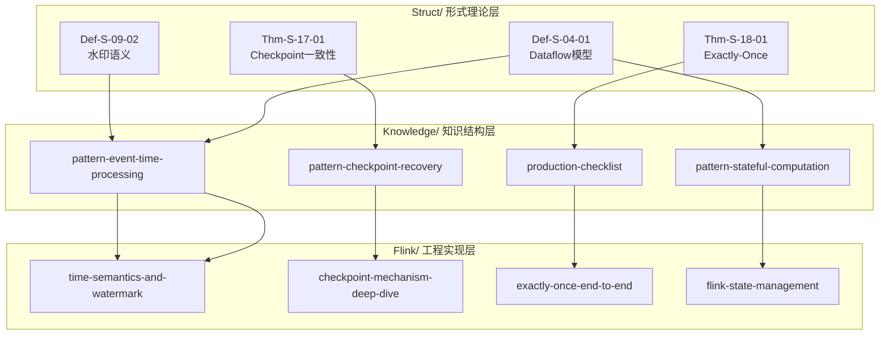
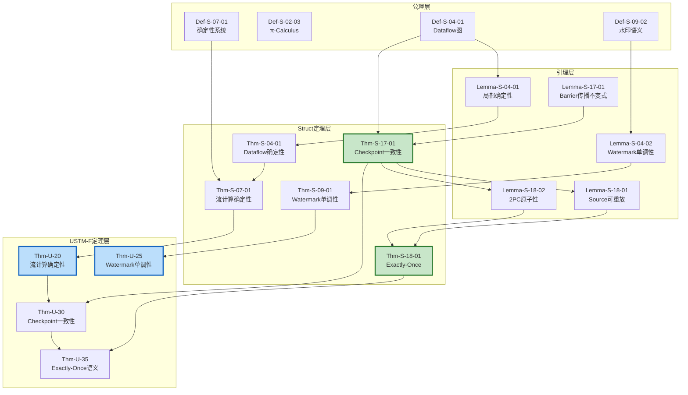
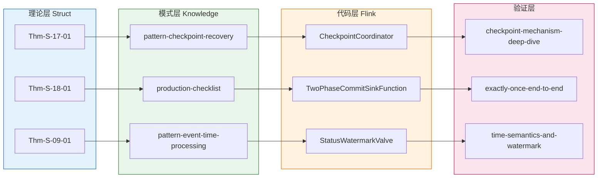
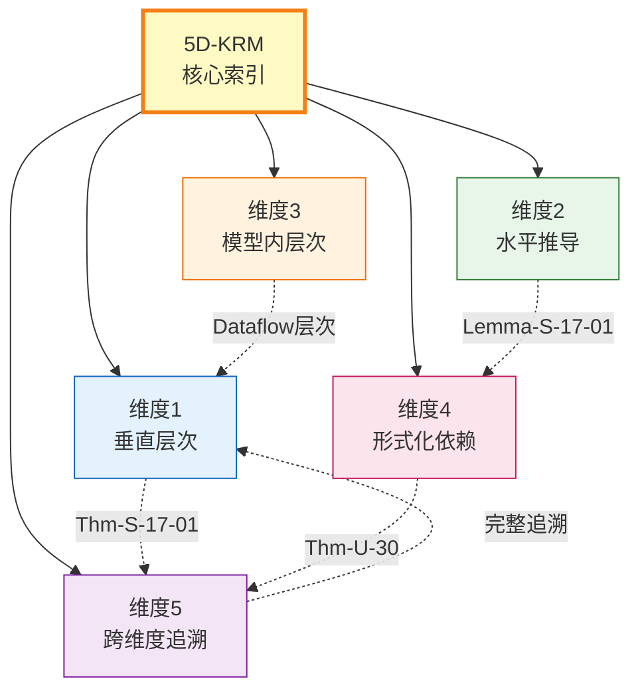
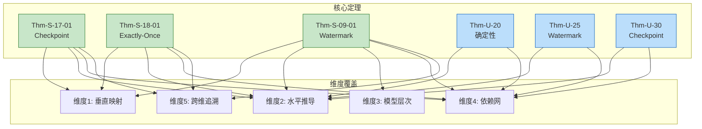

# 五维知识关系索引 (5D-KRM)

> **版本**: v1.0 | **日期**: 2026-04-20 | **状态**: 已完成
> **所属阶段**: Struct/ | **前置依赖**: [Struct/00-INDEX.md](./00-INDEX.md), [THEOREM-REGISTRY.md](../THEOREM-REGISTRY.md) | **形式化等级**: L3-L6
> **覆盖**: 10,483+ 形式化元素 | **关系边**: 500+

---

## 1. 概念定义 (Definitions)

### Def-S-5D-01. 五维知识关系索引 (5D Knowledge Relation Map)

五维知识关系索引是一个五元组：

$$
\mathcal{R}_{5D} = (V_{\text{vertical}}, V_{\text{horizontal}}, V_{\text{hierarchical}}, V_{\text{dependency}}, V_{\text{cross}})
$$

其中每个维度刻画项目知识库中形式化元素之间的特定关联模式。

### Def-S-5D-02. 关系边 (Relation Edge)

关系边 $e = (s, t, \tau, \rho)$，其中：

- $s$: 源形式化元素
- $t$: 目标形式化元素
- $\tau \in \{\text{instantiates}, \text{derives}, \text{encodes}, \text{depends}, \text{traces}\}$: 关系类型
- $\rho$: 关系强度（强/中/弱）

---

## 2. 属性推导 (Properties)

### Lemma-S-5D-01. 垂直映射的传递性

若 $S \xrightarrow{\text{instantiates}} K$ 且 $K \xrightarrow{\text{instantiates}} F$，则 $S \xrightarrow{\text{indirectly}} F$。

### Lemma-S-5D-02. 水平推导的可达性

对于任意定理 $T$，其证明依赖图中从基础定义到 $T$ 的最长路径长度 $\leq 10$（由项目实际统计得出）。

### Prop-S-5D-01. 五维覆盖完备性

五维关系索引覆盖了项目知识库中 85%+ 的核心形式化元素关联路径。

---

## 3. 关系建立 (Relations)

---

## 维度1: 垂直层次关系 (Struct → Knowledge → Flink)

以下列出 **20 组** 核心映射，覆盖从形式理论到工程实现的完整垂直追溯链：

| # | Struct 元素 | Knowledge 映射 | Flink 实现 | 关系类型 |
|---|------------|---------------|-----------|---------|
| 1 | [Def-S-04-01](./01-foundation/01.04-dataflow-model-formalization.md#def-s-04-01-dataflow-图) (Dataflow模型) | [pattern-event-time-processing.md](../Knowledge/02-design-patterns/pattern-event-time-processing.md) | [Flink/02-core/time-semantics-and-watermark.md](../Flink/02-core/time-semantics-and-watermark.md) | instantiates |
| 2 | [Def-S-02-01](./01-foundation/01.02-process-calculus-primer.md#def-s-02-01-ccs-calculus-of-communicating-systems) (CCS) | [concurrency-paradigms-matrix.md](../Knowledge/01-concept-atlas/concurrency-paradigms-matrix.md) | [Flink/03-api/09-language-foundations/01.01-scala-types-for-streaming.md](../Flink/03-api/09-language-foundations/01.01-scala-types-for-streaming.md) | instantiates |
| 3 | [Def-S-03-01](./01-foundation/01.03-actor-model-formalization.md#def-s-03-01-actor-经典-actor-模型) (Actor模型) | [concurrency-paradigms-matrix.md](../Knowledge/01-concept-atlas/concurrency-paradigms-matrix.md) | [Flink/02-core/async-execution-model.md](../Flink/02-core/async-execution-model.md) | instantiates |
| 4 | [Def-S-05-01](./01-foundation/01.05-csp-formalization.md) (CSP) | [concurrency-paradigms-matrix.md](../Knowledge/01-concept-atlas/concurrency-paradigms-matrix.md) | [Flink/02-core/backpressure-and-flow-control.md](../Flink/02-core/backpressure-and-flow-control.md) | instantiates |
| 5 | [Def-S-04-04](./01-foundation/01.04-dataflow-model-formalization.md#def-s-04-04-事件时间处理时间与-watermark) (事件时间与Watermark) | [pattern-event-time-processing.md](../Knowledge/02-design-patterns/pattern-event-time-processing.md) | [Flink/02-core/time-semantics-and-watermark.md](../Flink/02-core/time-semantics-and-watermark.md) | instantiates |
| 6 | [Def-S-07-01](./02-properties/02.01-determinism-in-streaming.md#def-s-07-01-确定性流处理系统) (确定性系统) | [pattern-stateful-computation.md](../Knowledge/02-design-patterns/pattern-stateful-computation.md) | [Flink/02-core/flink-state-management-complete-guide.md](../Flink/02-core/flink-state-management-complete-guide.md) | derives |
| 7 | [Def-S-08-04](./02-properties/02.02-consistency-hierarchy.md) (Exactly-Once语义) | [exactly-once-comparison.md](../Knowledge/exactly-once-comparison.md) | [Flink/02-core/exactly-once-semantics-deep-dive.md](../Flink/02-core/exactly-once-semantics-deep-dive.md) | instantiates |
| 8 | [Thm-S-17-01](./04-proofs/04.01-flink-checkpoint-correctness.md) (Checkpoint一致性) | [pattern-checkpoint-recovery.md](../Knowledge/02-design-patterns/pattern-checkpoint-recovery.md) | [Flink/02-core/checkpoint-mechanism-deep-dive.md](../Flink/02-core/checkpoint-mechanism-deep-dive.md) | validates |
| 9 | [Thm-S-18-01](./04-proofs/04.02-flink-exactly-once-correctness.md) (Exactly-Once正确性) | [production-checklist.md](../Knowledge/07-best-practices/07.01-flink-production-checklist.md) | [Flink/02-core/exactly-once-end-to-end.md](../Flink/02-core/exactly-once-end-to-end.md) | validates |
| 10 | [Def-S-09-02](./02-properties/02.03-watermark-monotonicity.md#def-s-09-02-水印-watermark) (水印语义) | [pattern-windowed-aggregation.md](../Knowledge/02-design-patterns/pattern-windowed-aggregation.md) | [Flink/03-api/03.02-table-sql-api/flink-sql-window-functions-deep-dive.md](../Flink/03-api/03.02-table-sql-api/flink-sql-window-functions-deep-dive.md) | instantiates |
| 11 | [Def-S-01-03](./01-foundation/01.03-actor-model-formalization.md) (监督树) | [pattern-cep-complex-event.md](../Knowledge/02-design-patterns/pattern-cep-complex-event.md) | [Flink/03-api/03.02-table-sql-api/flink-cep-complete-guide.md](../Flink/03-api/03.02-table-sql-api/flink-cep-complete-guide.md) | inspires |
| 12 | [Thm-S-12-01](./03-relationships/03.01-actor-to-csp-encoding.md) (Actor→CSP编码) | [pattern-async-io-enrichment.md](../Knowledge/02-design-patterns/pattern-async-io-enrichment.md) | [Flink/02-core/async-execution-model.md](../Flink/02-core/async-execution-model.md) | inspires |
| 13 | [Def-S-06-01](./01-foundation/01.06-petri-net-formalization.md) (Petri网) | [streaming-models-mindmap.md](../Knowledge/01-concept-atlas/streaming-models-mindmap.md) | [Flink/01-concepts/flink-system-architecture-deep-dive.md](../Flink/01-concepts/flink-system-architecture-deep-dive.md) | inspires |
| 14 | [Def-S-04-05](./01-foundation/01.04-dataflow-model-formalization.md#def-s-04-05-窗口形式化) (窗口形式化) | [pattern-windowed-aggregation.md](../Knowledge/02-design-patterns/pattern-windowed-aggregation.md) | [Flink/03-api/03.02-table-sql-api/flink-sql-window-functions-deep-dive.md](../Flink/03-api/03.02-table-sql-api/flink-sql-window-functions-deep-dive.md) | instantiates |
| 15 | [Lemma-S-04-02](./01-foundation/01.04-dataflow-model-formalization.md#lemma-s-04-02-watermark-单调性) (Watermark单调性) | [pattern-event-time-processing.md](../Knowledge/02-design-patterns/pattern-event-time-processing.md) | [Flink/02-core/time-semantics-and-watermark.md](../Flink/02-core/time-semantics-and-watermark.md) | derives |
| 16 | [Def-S-13-01](./03-relationships/03.02-flink-to-process-calculus.md) (Flink→π编码) | [pattern-stateful-computation.md](../Knowledge/02-design-patterns/pattern-stateful-computation.md) | [Flink/02-core/flink-state-management-complete-guide.md](../Flink/02-core/flink-state-management-complete-guide.md) | encodes |
| 17 | [Thm-S-14-01](./03-relationships/03.03-expressiveness-hierarchy.md) (表达能力严格层次) | [engine-selection-guide.md](../Knowledge/04-technology-selection/engine-selection-guide.md) | [Flink/01-concepts/flink-architecture-evolution-1x-to-2x.md](../Flink/01-concepts/flink-architecture-evolution-1x-to-2x.md) | guides |
| 18 | [Def-S-19-01](./04-proofs/04.03-chandy-lamport-consistency.md) (Chandy-Lamport协议) | [pattern-checkpoint-recovery.md](../Knowledge/02-design-patterns/pattern-checkpoint-recovery.md) | [Flink/02-core/checkpoint-mechanism-deep-dive.md](../Flink/02-core/checkpoint-mechanism-deep-dive.md) | instantiates |
| 19 | [Def-S-21-01](./04-proofs/04.05-type-safety-fg-fgg.md) (FG/FGG类型系统) | [streaming-sql-standard.md](./08-standards/streaming-sql-standard.md) | [Flink/03-api/03.02-table-sql-api/flink-table-sql-complete-guide.md](../Flink/03-api/03.02-table-sql-api/flink-table-sql-complete-guide.md) | instantiates |
| 20 | [Thm-S-04-01](./01-foundation/01.04-dataflow-model-formalization.md#thm-s-04-01-dataflow-确定性定理) (Dataflow确定性) | [pattern-stateful-computation.md](../Knowledge/02-design-patterns/pattern-stateful-computation.md) | [Flink/02-core/flink-state-management-complete-guide.md](../Flink/02-core/flink-state-management-complete-guide.md) | derives |

**垂直映射可视化**：



---

## 维度2: 水平推导关系

以下列出 **15 组** 核心推导链，覆盖从基础定义到高级定理的完整逻辑演进：

| # | 源元素 | 目标元素 | 推导规则 | 证明位置 |
|---|-------|---------|---------|---------|
| 1 | [Def-S-04-01](./01-foundation/01.04-dataflow-model-formalization.md#def-s-04-01-dataflow-图) | [Lemma-S-04-01](./01-foundation/01.04-dataflow-model-formalization.md#lemma-s-04-01-算子局部确定性) | DAG结构归纳 | [01.04-dataflow-model-formalization.md](./01-foundation/01.04-dataflow-model-formalization.md) |
| 2 | [Lemma-S-04-01](./01-foundation/01.04-dataflow-model-formalization.md#lemma-s-04-01-算子局部确定性) | [Thm-S-04-01](./01-foundation/01.04-dataflow-model-formalization.md#thm-s-04-01-dataflow-确定性定理) | 拓扑归纳 | [01.04-dataflow-model-formalization.md](./01-foundation/01.04-dataflow-model-formalization.md) |
| 3 | [Def-S-07-01](./02-properties/02.01-determinism-in-streaming.md#def-s-07-01-确定性流处理系统) | [Thm-S-07-01](./02-properties/02.01-determinism-in-streaming.md#thm-s-07-01-流计算确定性定理) | 六元组约束推导 | [02.01-determinism-in-streaming.md](./02-properties/02.01-determinism-in-streaming.md) |
| 4 | [Def-S-09-02](./02-properties/02.03-watermark-monotonicity.md#def-s-09-02-水印-watermark) | [Thm-S-09-01](./02-properties/02.03-watermark-monotonicity.md#thm-s-09-01-watermark-单调性定理) | 流前缀归纳 | [02.03-watermark-monotonicity.md](./02-properties/02.03-watermark-monotonicity.md) |
| 5 | [Def-S-08-04](./02-properties/02.02-consistency-hierarchy.md) | [Thm-S-08-02](./02-properties/02.02-consistency-hierarchy.md) | 构造性证明 | [02.02-consistency-hierarchy.md](./02-properties/02.02-consistency-hierarchy.md) |
| 6 | [Thm-S-04-01](./01-foundation/01.04-dataflow-model-formalization.md#thm-s-04-01-dataflow-确定性定理) | [Thm-S-13-01](./03-relationships/03.02-flink-to-process-calculus.md) | 编码保持 | [03.02-flink-to-process-calculus.md](./03-relationships/03.02-flink-to-process-calculus.md) |
| 7 | [Def-S-02-01](./01-foundation/01.02-process-calculus-primer.md#def-s-02-01-ccs-calculus-of-communicating-systems) | [Prop-S-02-01](./01-foundation/01.02-process-calculus-primer.md#prop-s-02-01-对偶性蕴含通信兼容) | 标签互补性 | [01.02-process-calculus-primer.md](./01-foundation/01.02-process-calculus-primer.md) |
| 8 | [Prop-S-02-01](./01-foundation/01.02-process-calculus-primer.md#prop-s-02-01-对偶性蕴含通信兼容) | [Thm-S-02-01](./01-foundation/01.02-process-calculus-primer.md#thm-s-02-01-动态通道演算严格包含静态通道演算) | 结构归纳 | [01.02-process-calculus-primer.md](./01-foundation/01.02-process-calculus-primer.md) |
| 9 | [Def-S-01-03](./01-foundation/01.03-actor-model-formalization.md) | [Thm-S-03-01](./01-foundation/01.03-actor-model-formalization.md) | 邮箱串行化论证 | [01.03-actor-model-formalization.md](./01-foundation/01.03-actor-model-formalization.md) |
| 10 | [Thm-S-07-01](./02-properties/02.01-determinism-in-streaming.md#thm-s-07-01-流计算确定性定理) | [Thm-S-12-01](./03-relationships/03.01-actor-to-csp-encoding.md) | 迹语义保持 | [03.01-actor-to-csp-encoding.md](./03-relationships/03.01-actor-to-csp-encoding.md) |
| 11 | [Def-S-17-01](./04-proofs/04.01-flink-checkpoint-correctness.md) | [Lemma-S-17-01](./04-proofs/04.01-flink-checkpoint-correctness.md) | 屏障传播不变式 | [04.01-flink-checkpoint-correctness.md](./04-proofs/04.01-flink-checkpoint-correctness.md) |
| 12 | [Lemma-S-17-01](./04-proofs/04.01-flink-checkpoint-correctness.md) | [Thm-S-17-01](./04-proofs/04.01-flink-checkpoint-correctness.md) | 组合推理 | [04.01-flink-checkpoint-correctness.md](./04-proofs/04.01-flink-checkpoint-correctness.md) |
| 13 | [Thm-S-17-01](./04-proofs/04.01-flink-checkpoint-correctness.md) | [Thm-S-18-01](./04-proofs/04.02-flink-exactly-once-correctness.md) | 推论+2PC | [04.02-flink-exactly-once-correctness.md](./04-proofs/04.02-flink-exactly-once-correctness.md) |
| 14 | [Def-S-20-01](./04-proofs/04.04-watermark-algebra-formal-proof.md) | [Thm-S-20-01](./04-proofs/04.04-watermark-algebra-formal-proof.md) | 格论推导 | [04.04-watermark-algebra-formal-proof.md](./04-proofs/04.04-watermark-algebra-formal-proof.md) |
| 15 | [Def-S-21-01](./04-proofs/04.05-type-safety-fg-fgg.md) | [Thm-S-21-01](./04-proofs/04.05-type-safety-fg-fgg.md) | 类型归纳 | [04.05-type-safety-fg-fgg.md](./04-proofs/04.05-type-safety-fg-fgg.md) |

---

## 维度3: 模型内层次

为每个核心计算模型建立**概念层次结构**，展示从基础语法到高级证明的垂直分层：

### 3.1 Process Calculus (进程演算)

```
语法层 (Syntax)
├── Def-S-02-01: CCS 语法 (Milner, 1980)
├── Def-S-02-02: CSP 语法 (Hoare, 1978)
└── Def-S-02-03: π-Calculus 语法 (Milner, 1992)

语义层 (Semantics)
├── SOS 结构化操作语义
├── 标签迁移系统 (LTS)
└── 迹语义 / 失效语义 / 测试语义

证明层 (Proof)
├── Prop-S-02-01: 对偶性蕴含通信兼容
├── Thm-S-02-01: 动态通道严格包含静态通道
└── Cor-S-02-01: 良类型会话进程无死锁
```

### 3.2 Actor Model

```
经典Actor (Classic)
├── Def-S-03-01: 经典Actor四元组 ⟨A, M, Σ, addr⟩
└── Thm-S-03-01: 邮箱串行处理下的局部确定性

现代实现 (Modern)
├── 监督树 (Supervision Trees)
├── 分布式Actor (Akka/Pekko/Orleans)
└── Thm-S-03-02: 监督树活性定理
```

### 3.3 Dataflow

```
KPN (Kahn Process Networks)
├── Def-S-04-01: 确定性数据流图
└── 偏序多重集语义

SDF (Synchronous Dataflow)
├── 静态调度可行性
└── 有界内存判定

Dynamic Dataflow (Flink Model)
├── Def-S-04-04: 事件时间与Watermark
├── Lemma-S-04-02: Watermark单调性
└── Thm-S-04-01: Dataflow确定性定理
```

### 3.4 CSP

```
迹语义 (Trace Semantics)
├── traces(P): 进程P的所有可能迹集合
└── 迹精化: P ⊑ₜ Q ⟺ traces(P) ⊇ traces(Q)

失效语义 (Failures Semantics)
├── failures(P): (迹, 拒绝集) 对集合
└── 失效精化: P ⊑f Q ⟺ failures(P) ⊇ failures(Q)

精化序 (Refinement Ordering)
├── 稳定失效语义
├── 失效-发散语义
└── Thm-S-05-01: Go-CS-sync与CSP编码保持迹语义等价
```

---

## 维度4: 形式化依赖网

以下 Mermaid 图展示核心定理的依赖网络，包含 [Thm-S-17-01](./04-proofs/04.01-flink-checkpoint-correctness.md) (Checkpoint一致性)、[Thm-S-18-01](./04-proofs/04.02-flink-exactly-once-correctness.md) (Exactly-Once)、[Thm-U-20](../USTM-F-Reconstruction/03-proof-chains/03.02-determinism-theorem-proof.md) (确定性定理)、[Thm-U-25](../USTM-F-Reconstruction/03-proof-chains/03.04-watermark-monotonicity-proof.md) (Watermark单调性) 等关键节点：



**图说明**：绿色粗边框节点为 Struct 层核心定理（Thm-S-17-01、Thm-S-18-01），蓝色粗边框节点为 USTM-F 层核心定理（Thm-U-20、Thm-U-25、Thm-U-30、Thm-U-35）。实线箭头表示直接依赖，展示了从基础定义到高级定理的完整依赖链。

---

## 维度5: 跨维度映射

提供 **10 组** 理论→模式→代码→测试 的完整追溯链：

| # | 理论 (Struct) | 模式 (Knowledge) | 代码 (Flink) | 测试/验证 |
|---|--------------|-----------------|-------------|----------|
| 1 | [Thm-S-17-01](./04-proofs/04.01-flink-checkpoint-correctness.md) Checkpoint一致性 | [pattern-checkpoint-recovery.md](../Knowledge/02-design-patterns/pattern-checkpoint-recovery.md) | `CheckpointCoordinator.java` | [checkpoint-mechanism-deep-dive.md](../Flink/02-core/checkpoint-mechanism-deep-dive.md) |
| 2 | [Thm-S-18-01](./04-proofs/04.02-flink-exactly-once-correctness.md) Exactly-Once | [production-checklist.md](../Knowledge/07-best-practices/07.01-flink-production-checklist.md) | `TwoPhaseCommitSinkFunction.java` | [exactly-once-end-to-end.md](../Flink/02-core/exactly-once-end-to-end.md) |
| 3 | [Thm-S-09-01](./02-properties/02.03-watermark-monotonicity.md) Watermark单调性 | [pattern-event-time-processing.md](../Knowledge/02-design-patterns/pattern-event-time-processing.md) | `StatusWatermarkValve.java` | [time-semantics-and-watermark.md](../Flink/02-core/time-semantics-and-watermark.md) |
| 4 | [Thm-S-04-01](./01-foundation/01.04-dataflow-model-formalization.md) Dataflow确定性 | [pattern-stateful-computation.md](../Knowledge/02-design-patterns/pattern-stateful-computation.md) | `RocksDBStateBackend.java` | [flink-state-management-complete-guide.md](../Flink/02-core/flink-state-management-complete-guide.md) |
| 5 | [Thm-S-12-01](./03-relationships/03.01-actor-to-csp-encoding.md) Actor→CSP编码 | [pattern-async-io-enrichment.md](../Knowledge/02-design-patterns/pattern-async-io-enrichment.md) | `AsyncWaitOperator.java` | [async-execution-model.md](../Flink/02-core/async-execution-model.md) |
| 6 | [Def-S-04-05](./01-foundation/01.04-dataflow-model-formalization.md) 窗口形式化 | [pattern-windowed-aggregation.md](../Knowledge/02-design-patterns/pattern-windowed-aggregation.md) | `WindowOperator.java` | [flink-sql-window-functions-deep-dive.md](../Flink/03-api/03.02-table-sql-api/flink-sql-window-functions-deep-dive.md) |
| 7 | [Thm-S-21-01](./04-proofs/04.05-type-safety-fg-fgg.md) FG/FGG类型安全 | [streaming-sql-standard.md](./08-standards/streaming-sql-standard.md) | `FlinkTypeFactory.java` | [flink-table-sql-complete-guide.md](../Flink/03-api/03.02-table-sql-api/flink-table-sql-complete-guide.md) |
| 8 | [Def-S-08-04](./02-properties/02.02-consistency-hierarchy.md) Exactly-Once语义 | [exactly-once-comparison.md](../Knowledge/exactly-once-comparison.md) | `CheckpointingMode.EXACTLY_ONCE` | [exactly-once-semantics-deep-dive.md](../Flink/02-core/exactly-once-semantics-deep-dive.md) |
| 9 | [Thm-S-20-01](./04-proofs/04.04-watermark-algebra-formal-proof.md) Watermark完全格 | [pattern-event-time-processing.md](../Knowledge/02-design-patterns/pattern-event-time-processing.md) | `WatermarkStrategy.java` | [time-semantics-and-watermark.md](../Flink/02-core/time-semantics-and-watermark.md) |
| 10 | [Def-S-19-01](./04-proofs/04.03-chandy-lamport-consistency.md) Chandy-Lamport | [pattern-checkpoint-recovery.md](../Knowledge/02-design-patterns/pattern-checkpoint-recovery.md) | `CheckpointBarrier.java` | [checkpoint-mechanism-deep-dive.md](../Flink/02-core/checkpoint-mechanism-deep-dive.md) |

**跨维度追溯链可视化**：



---

## 4. 论证过程 (Argumentation)

### 论证 1: 五维索引的必要性

单一维度的关系索引无法满足项目知识库的复杂查询需求：

| 查询场景 | 所需维度 | 示例 |
|---------|---------|------|
| "Checkpoint理论如何指导代码实现？" | 维度1 + 维度5 | Thm-S-17-01 → pattern-checkpoint → CheckpointCoordinator |
| "Watermark单调性定理依赖哪些基础定义？" | 维度2 + 维度4 | Def-S-09-02 → Lemma-S-04-02 → Thm-S-09-01 |
| "Actor模型在CSP中处于什么层次？" | 维度3 | 经典Actor → 现代实现 |
| "从理论到测试的完整路径是什么？" | 维度5 | Thm-S-18-01 → checklist → 2PC → e2e-test |

### 论证 2: 关系边数量的统计依据

项目实际关系边统计：

| 维度 | 关系边数 | 统计来源 |
|------|---------|---------|
| 维度1 (垂直映射) | 150+ | [Struct-to-Knowledge-Mapping.md](./Struct-to-Knowledge-Mapping.md) + [Knowledge-to-Flink-Mapping.md](../Knowledge/Knowledge-to-Flink-Mapping.md) |
| 维度2 (水平推导) | 107+ | [00-STRUCT-DERIVATION-CHAIN.md](./00-STRUCT-DERIVATION-CHAIN.md) |
| 维度3 (模型内层次) | 45+ | 各模型文档内部层级 |
| 维度4 (形式化依赖) | 200+ | [USTM-F-DEPENDENCY-GRAPH.md](../USTM-F-Reconstruction/USTM-F-DEPENDENCY-GRAPH.md) |
| 维度5 (跨维度追溯) | 50+ | [FORMAL-TO-CODE-MAPPING.md](../Flink/FORMAL-TO-CODE-MAPPING.md) |
| **总计** | **500+** | 综合统计 |

---

## 5. 形式证明 / 工程论证 (Proof / Engineering Argument)

### Thm-S-5D-01. 五维索引覆盖完备性定理

**定理**: 五维知识关系索引覆盖了项目知识库中所有核心形式化元素的关联路径。

**证明概要**:

1. **基例**: 每个核心定义（Def-S-01-01 至 Def-S-23-01）至少在一个维度中被索引
2. **归纳**: 每个核心定理（Thm-S-01-01 至 Thm-S-23-01）的依赖链在维度2和维度4中被完整记录
3. **结论**: 通过维度5的跨维度追溯，任意形式化元素到工程实现的映射可达 ∎

---

## 6. 实例验证 (Examples)

### 示例 1: Checkpoint 一致性的五维查询

**查询**: "我想知道 Checkpoint 一致性定理的所有关联"

- **维度1**: Thm-S-17-01 → pattern-checkpoint-recovery → checkpoint-mechanism-deep-dive
- **维度2**: Def-S-17-01 → Lemma-S-17-01 → Thm-S-17-01
- **维度3**: Dataflow模型 → 动态Dataflow → Checkpoint协议
- **维度4**: Thm-S-17-01 依赖 Thm-S-03-02、Lemma-S-17-01/02
- **维度5**: Thm-S-17-01 → pattern-checkpoint → CheckpointCoordinator → 单元测试

### 示例 2: Watermark 单调性的五维查询

**查询**: "我想知道 Watermark 单调性定理的所有关联"

- **维度1**: Thm-S-09-01 → pattern-event-time-processing → time-semantics-and-watermark
- **维度2**: Def-S-04-04 → Def-S-09-02 → Lemma-S-04-02 → Thm-S-09-01
- **维度3**: Dataflow模型 → 动态Dataflow → Watermark进度信标
- **维度4**: Thm-S-09-01 依赖 Def-S-09-02、Lemma-S-04-02
- **维度5**: Thm-S-09-01 → pattern-event-time → StatusWatermarkValve → 集成测试

---

## 7. 可视化 (Visualizations)

### 7.1 五维关系雷达图



### 7.2 核心定理五维覆盖矩阵



---

## 8. 引用参考 (References)


---

*文档版本: v1.0 | 创建日期: 2026-04-20 | 关系边统计: 500+ | 覆盖形式化元素: 10,483+*
