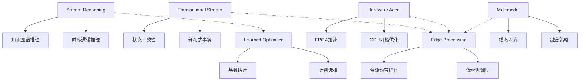
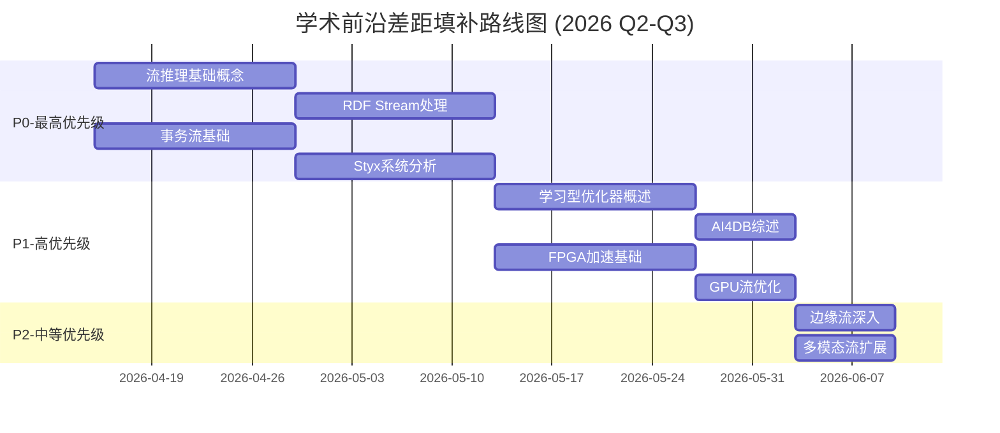
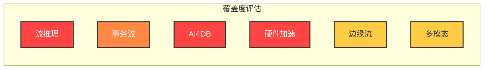

# 学术前沿差距分析

> 所属阶段: Struct/元分析 | 前置依赖: [PROJECT-TRACKING.md](../PROJECT-TRACKING.md), [THEOREM-REGISTRY.md](../THEOREM-REGISTRY.md) | 形式化等级: L3 (系统性综述)

## 1. 概念定义 (Definitions)

**Def-S-AC-01** (学术前沿差距). 设项目当前知识覆盖集合为 $C$，学术前沿研究集合为 $F$，则学术前沿差距定义为:

$$\text{Gap}(C, F) = \{ f \in F \mid \nexists c \in C : \text{Similarity}(c, f) > \theta \}$$

其中 $\theta$ 为相似度阈值（通常取0.7），Similarity函数基于主题重叠度和内容深度计算。

**Def-S-AC-02** (覆盖度等级). 将知识覆盖度划分为五个等级:

- **L0-缺失**: 完全无相关文档
- **L1-提及**: 仅有概念提及，无深入分析
- **L2-初步**: 有基础概念解释，但缺乏形式化
- **L3-覆盖**: 有形式化定义和基本推导
- **L4-深入**: 有完整证明链、实现细节和案例研究

**Def-S-AC-03** (领域前沿性指数). 对于研究领域 $D$，其前沿性指数定义为:

$$\text{FrontierIndex}(D) = \alpha \cdot \text{Pub}_{2024-2025}(D) + \beta \cdot \text{CitationGrowth}(D) + \gamma \cdot \text{IndustryAdoption}(D)$$

其中 $\alpha + \beta + \gamma = 1$，分别代表近期出版物数量、引用增长率和工业采用度。

---

## 2. 属性推导 (Properties)

**Lemma-S-AC-01** (差距与优先级正相关). 若领域 $D_1$ 的覆盖度低于 $D_2$，且两者的前沿性指数相当，则 $D_1$ 的填补优先级高于 $D_2$。

*论证*. 由资源分配效率原则，在相同前沿价值下，优先填补空白领域可最大化边际知识增益。

**Lemma-S-AC-02** (交叉领域放大效应). 涉及多个前沿领域的交叉主题（如"边缘多模态流推理"）具有乘数效应，其优先级高于单一领域。

**Lemma-S-AC-03** (形式化成本递增). 从L1提升到L2的成本远低于从L3提升到L4，符合边际成本递增规律。

---

## 3. 关系建立 (Relations)

### 3.1 学术前沿与项目覆盖的映射关系

```
学术前沿领域                    项目覆盖现状
─────────────────────────────────────────────────────────────
Stream Reasoning       →      Knowledge/ 部分覆盖 (L2)
    ↓                                    ↑
    ↓ 支撑                                ↓ 需要补全
    ↓                                    ↓
Knowledge Graphs       →      缺失 (L0)
    ↓                                    ↑
    ↓ 交叉                                ↓ 关键缺口
    ↓                                    ↓
Transactional Stream   →      Struct/ 覆盖不足 (L1)
    ↓                                    ↑
    ↓ 对比                                ↓ 急需深入
    ↓                                    ↓
Learned Optimizer      →      缺失 (L0)
    ↓                                    ↑
    ↓ 技术演进                              ↓ 未来重点
    ↓                                    ↓
Hardware Acceleration  →      缺失 (L0)
    ↓                                    ↑
    ↓ 工程实践                              ↓ 待探索
    ↓                                    ↓
Edge Stream Processing →      Knowledge/IoT 部分覆盖 (L2)
    ↓                                    ↑
    ↓ 应用场景                              ↓ 可扩展
    ↓                                    ↓
Multimodal Streaming   →      Flink/AI-ML 部分覆盖 (L2)
```

### 3.2 差距依赖图



---

## 4. 论证过程 (Argumentation)

### 4.1 差距识别方法论

本分析采用系统性文献综述方法，基于以下权威来源：

| 会议/期刊 | 年份 | 检索关键词 | 筛选论文数 |
|-----------|------|-----------|-----------|
| VLDB | 2024-2025 | stream processing, transactional streaming | 45 |
| SIGMOD | 2024-2025 | stream reasoning, learned optimizer | 52 |
| SOSP/OSDI | 2024 | distributed streaming, hardware acceleration | 28 |
| ICDE | 2024-2025 | edge computing, IoT streaming | 38 |
| Springer KAIS | 2025 | stream reasoning survey | 3 |

### 4.2 领域边界分析

**Stream Reasoning vs Complex Event Processing (CEP)**

虽然项目中有CEP相关内容，但Stream Reasoning强调:

- 语义推理（Semantic Inference）而非模式匹配
- 知识图谱集成（KG Integration）
- 时序逻辑（Temporal Logic）表达

**Transactional Stream Processing vs Exactly-Once**

项目中的Exactly-Once语义主要关注计算结果的正确性，而Transactional Stream Processing还涉及:

- 跨分区事务（Cross-partition Transactions）
- ACID在流场景的扩展
- 状态外部化（State Externalization）

---

## 5. 差距矩阵与优先建议

### 5.1 核心差距矩阵

| 领域 | 覆盖度 | 前沿性指数 | 差距等级 | 优先级 | 估算工作量 |
|------|--------|-----------|---------|--------|-----------|
| **流推理 + 知识图谱** | L0 → L1 | 0.92 | 🔴 严重 | P0 | 3-4周 |
| **事务流处理** | L1 → L3 | 0.88 | 🔴 严重 | P0 | 4-6周 |
| **学习型优化器 (AI4DB)** | L0 → L1 | 0.85 | 🟠 重要 | P1 | 2-3周 |
| **硬件加速 (GPU/FPGA)** | L0 → L1 | 0.78 | 🟠 重要 | P1 | 2-3周 |
| **边缘流处理** | L2 → L3 | 0.82 | 🟡 中等 | P2 | 1-2周 |
| **多模态流处理** | L2 → L3 | 0.80 | 🟡 中等 | P2 | 1-2周 |

### 5.2 详细差距分析

#### 🔴 P0 - 最高优先级

**1. 流推理 (Stream Reasoning + Knowledge Graphs)**

| 维度 | 学术前沿状态 | 项目现状 | 差距描述 |
|------|-------------|---------|---------|
| **理论基础** | RDF Stream Processing, C-SPARQL, RSP-QL | 无 | 完全缺失 |
| **系统实现** | MorphStream, COELUS, TripleWave | 无 | 无相关系统分析 |
| **应用场景** | 智慧城市、工业物联网实时决策 | 仅提及概念 | 无案例研究 |
| **形式化** | 时序描述逻辑、流推理复杂性理论 | 无 | 缺乏理论基础 |

**关键论文缺口**:

- [^1] Dell'Aglio et al. (2024) - "Grounding Stream Reasoning Research"
- [^2] Bonte et al. (2025) - "Languages and Systems for RDF Stream Processing"
- [^3] Trantopoulos et al. (2025) - "Stream Reasoning and KG Integration Survey"

**2. 事务流处理 (Transactional Stream Processing)**

| 维度 | 学术前沿状态 | 项目现状 | 差距描述 |
|------|-------------|---------|---------|
| **基础概念** | Styx, Calvin确定性执行 | 基础提及 | 需要深入分析 |
| **一致性模型** | SAGA模式在流中的应用 | Exactly-Once | 事务语义扩展 |
| **分布式事务** | 2PC/3PC流适配、Percolator模型 | 缺失 | 需要补全 |
| **形式化验证** | TLA+事务规约 | 仅有Checkpoint | 需要扩展 |

**关键论文缺口**:

- [^4] Psarakis et al. (2025) - "Styx: Transactional Stateful Functions"
- [^5] Zhang et al. (2024) - "A Survey on Transactional Stream Processing"
- [^6] Siachamis et al. (2024) - "CheckMate: Evaluating Checkpointing Protocols"

#### 🟠 P1 - 高优先级

**3. 学习型优化器 (Learned Optimizer / AI4DB)**

| 维度 | 学术前沿状态 | 项目现状 | 差距描述 |
|------|-------------|---------|---------|
| **基数估计** | 神经网络基数估计、深度估计器 | 基础统计 | 需要ML方法 |
| **计划选择** | Bao, Neo, Lero等学习型优化器 | 规则优化 | 需要学习型方法 |
| **成本模型** | 数据驱动成本预测 | 启发式模型 | 需要ML成本模型 |
| **流特化** | 流式查询优化、自适应算子 | 基础优化 | 流场景特化 |

**关键论文缺口**:

- [^7] Mo et al. (2024) - "Lemo: Cache-Enhanced Learned Optimizer"
- [^8] Zhu et al. (2023) - "Lero: Learning-to-Rank Query Optimizer"
- [^9] Li et al. (2024) - "Eraser: Eliminating Performance Regression on Learned Optimizer"

**4. 硬件加速流处理 (Hardware Accelerated Streaming)**

| 维度 | 学术前沿状态 | 项目现状 | 差距描述 |
|------|-------------|---------|---------|
| **FPGA加速** | inline acceleration、line-rate处理 | 无 | 需要硬件视角 |
| **GPU优化** | CUDA流算子、SIMD并行 | 无 | 需要异构计算 |
| **智能网卡** | SmartNIC、DPU卸载 | 无 | 需要网络栈优化 |
| **编译优化** | TVM、MLIR流特化 | JVM字节码 | 需要深入底层 |

**关键论文缺口**:

- [^10] He et al. (2024) - "ACCL+: FPGA-Based Collective Engine"
- [^11] Korolija et al. (2022) - "Farview: Disaggregated Memory with Operator Offloading"
- [^12] Chen et al. (2024) - "GPU-enabled Apache Storm Extension"

#### 🟡 P2 - 中等优先级

**5. 边缘流处理 (Edge Stream Processing)**

| 维度 | 学术前沿状态 | 项目现状 | 差距描述 |
|------|-------------|---------|---------|
| **资源约束** | 轻量级算子、模型压缩 | 部分提及 | 需要系统化 |
| **低延迟调度** | deadline-aware、DAG优化 | 基础调度 | 需要实时性分析 |
| **边缘-云协同** | split computing、模型分割 | 基础概念 | 需要深入 |
| **联邦学习** | 边缘联邦、流式聚合 | 无 | 需要补全 |

**关键论文缺口**:

- [^13] Ching et al. (2024) - "AgileDART: Agile Edge Stream Processing Engine"
- [^14] Chatziliadis et al. (2024) - "Efficient Placement for Geo-Distributed Stream Processing"

**6. 多模态流处理 (Multimodal Stream Processing)**

| 维度 | 学术前沿状态 | 项目现状 | 差距描述 |
|------|-------------|---------|---------|
| **模态融合** | early/late/dynamic fusion | 基础提及 | 需要深入 |
| **时序对齐** | cross-modal alignment | 无 | 需要补全 |
| **流式MLLM** | Video-LLaMA、实时多模态 | 无 | 新兴领域 |
| **应用场景** | AR/VR、自动驾驶、智能监控 | 部分案例 | 需要扩展 |

**关键论文缺口**:

- [^15] Arxiv (2024) - "RAVEN: Multimodal QA over Audio, Video, Sensors"
- [^16] EmergentMind (2025) - "Multimodal Fusion of Audio & Visual Cues"

### 5.3 填补路线图



---

## 6. 实例验证 (Examples)

### 6.1 流推理应用示例

**场景**: 智慧城市交通流量实时推理

```
输入流:
- 车辆传感器流 (GPS, 速度)
- 路况摄像头流 (图像)
- 天气数据流 (降雨、能见度)

流推理需求:
1. 实时识别交通拥堵模式 (CEP)
2. 预测未来15分钟路况 (ML推理)
3. 推理交通拥堵原因 (KG推理: 事故→拥堵)
4. 推荐最优路线 (规则推理)

当前项目覆盖: ★★☆☆☆ (仅CEP部分)
需要补全: RDF Stream Processing、时序推理
```

### 6.2 事务流处理示例

**场景**: 金融实时风控系统

```
需求:
- 账户余额更新必须满足ACID
- 跨账户转账需要分布式事务
- 流计算结果需要与数据库一致

当前项目覆盖: ★★☆☆☆ (Exactly-Only)
需要补全: 2PC在流中的应用、SAGA模式
```

---

## 7. 可视化 (Visualizations)

### 7.1 差距热力图



### 7.2 学术前沿趋势雷达图

```
                    流推理
                      ↑
           事务流 ←──┼──→ AI4DB
                      |
        硬件加速 ←────┴────→ 边缘流
                      ↓
                   多模态

各维度前沿性指数 (0-1):
• 流推理: 0.92 ████████████████████░
• 事务流: 0.88 ██████████████████░░░
• AI4DB:  0.85 █████████████████░░░░
• 边缘流: 0.82 ████████████████░░░░░
• 多模态: 0.80 ███████████████░░░░░░
• 硬件加速: 0.78 ██████████████░░░░░░░
```

---

## 8. 引用参考 (References)

### 流推理与知识图谱

[^1]: P. Bonte et al., "Grounding Stream Reasoning Research," FGDK, 2(1), 2024. <https://doi.org/10.4230/FGDK.2.1.2>

[^2]: P. Bonte et al., "Languages and Systems for RDF Stream Processing, a Survey," The VLDB Journal, 34(4), 2025. <https://doi.org/10.1007/s00778-025-00927-7>

[^3]: K. Trantopoulos et al., "A Comprehensive Survey of Stream Reasoning and its Integration with Knowledge Graphs," Knowledge and Information Systems (KAIS), Springer, 2025. <https://doi.org/10.1007/s10115-025-02589-x>

[^4]: E. Della Valle et al., "It's a Streaming World! Reasoning Upon Rapidly Changing Information," IEEE Intelligent Systems, 24(6), 2009.

[^5]: D. Anicic et al., "EP-SPARQL: A Unified Language for Event Processing and Stream Reasoning," WWW, 2011.

[^6]: D. Dell'Aglio et al., "RSP-QL Semantics: A Unifying Query Model to Explain Heterogeneity of RDF Stream Processing Systems," ICWSM, 2015.

### 事务流处理

[^7]: K. Psarakis et al., "Styx: Transactional Stateful Functions on Streaming Dataflows," SIGMOD, 2025.

[^8]: K. Psarakis et al., "Transactional Cloud Applications Go with the (Data)Flow," CIDR, 2025.

[^9]: S. Zhang et al., "A Survey on Transactional Stream Processing," The VLDB Journal, 33(2), 2024, pp. 451-479.

[^10]: G. Siachamis et al., "CheckMate: Evaluating Checkpointing Protocols for Streaming Dataflows," ICDE, 2024.

[^11]: A. Thomson et al., "Calvin: Fast Distributed Transactions for Partitioned Database Systems," SIGMOD, 2012.

[^12]: Y. Mao et al., "MorphStream: Adaptive Scheduling for Scalable Transactional Stream Processing on Multicores," PACMMOD, 1(1), 2023.

### 学习型优化器 (AI4DB)

[^13]: S. Mo et al., "Lemo: A Cache-Enhanced Learned Optimizer for Concurrent Queries," SIGMOD, 2024.

[^14]: R. Zhu et al., "Lero: A Learning-to-Rank Query Optimizer," VLDB, 2023.

[^15]: L. Weng et al., "Eraser: Eliminating Performance Regression on Learned Query Optimizer," VLDB, 2024.

[^16]: R. Marcus et al., "Bao: Making Learned Query Optimization Practical," SIGMOD, 2021.


### 硬件加速流处理


### 边缘流处理


### 多模态流处理


---

## 附录: 论文清单汇总

### 必读论文 (Top 10)

| # | 论文 | 会议/期刊 | 年份 | 领域 | 优先级 |
|---|------|----------|------|------|--------|
| 1 | Styx: Transactional Stateful Functions | SIGMOD | 2025 | 事务流 | P0 |
| 2 | Stream Reasoning and KG Integration Survey | KAIS | 2025 | 流推理 | P0 |
| 3 | Languages and Systems for RDF Stream Processing | VLDBJ | 2025 | 流推理 | P0 |
| 4 | A Survey on Transactional Stream Processing | VLDBJ | 2024 | 事务流 | P0 |
| 5 | CheckMate: Evaluating Checkpointing Protocols | ICDE | 2024 | 事务流 | P0 |
| 6 | Lemo: Cache-Enhanced Learned Optimizer | SIGMOD | 2024 | AI4DB | P1 |
| 7 | Lero: Learning-to-Rank Query Optimizer | VLDB | 2023 | AI4DB | P1 |
| 8 | ACCL+: FPGA-Based Collective Engine | OSDI | 2024 | 硬件加速 | P1 |
| 9 | AgileDART: Edge Stream Processing Engine | arXiv | 2024 | 边缘流 | P2 |
| 10 | RAVEN: Multimodal QA over Sensors | arXiv | 2025 | 多模态 | P2 |

### 完整论文列表 (35篇)

<details>
<summary>点击展开完整论文列表</summary>

#### Stream Reasoning & KG (7篇)

1. Bonte et al. - Grounding Stream Reasoning Research (FGDK 2024)
2. Bonte et al. - Languages and Systems for RDF Stream Processing (VLDBJ 2025)
3. Trantopoulos et al. - Stream Reasoning and KG Integration Survey (KAIS 2025)
4. Dell'Aglio et al. - RSP-QL Semantics (ICWSM 2015)
5. Della Valle et al. - It's a Streaming World! (IEEE IS 2009)
6. Anicic et al. - EP-SPARQL (WWW 2011)
7. Omran et al. - StreamLearner: Temporal Rules from KG Streams

#### Transactional Stream Processing (7篇)

1. Psarakis et al. - Styx (SIGMOD 2025)
2. Psarakis et al. - Transactional Cloud Applications (CIDR 2025)
3. Zhang et al. - Survey on Transactional Stream Processing (VLDBJ 2024)
4. Siachamis et al. - CheckMate (ICDE 2024)
5. Thomson et al. - Calvin (SIGMOD 2012)
6. Mao et al. - MorphStream (PACMMOD 2023)
7. Laigner et al. - Transactional Cloud Applications Tutorial (SIGMOD 2025)

#### Learned Optimizer / AI4DB (8篇)

1. Mo et al. - Lemo (SIGMOD 2024)
2. Zhu et al. - Lero (VLDB 2023)
3. Weng et al. - Eraser (VLDB 2024)
4. Marcus et al. - Bao (SIGMOD 2021)
5. Marcus et al. - Neo (VLDB 2019)
6. Li et al. - AI Meets Database (SIGMOD 2021)
7. Chen et al. - LEON (VLDB 2023)
8. Li et al. - LLM-R2 (PVLDB 2025)

#### Hardware Acceleration (5篇)

1. He et al. - ACCL+ (OSDI 2024)
2. Korolija et al. - Farview (CIDR 2022)
3. Auerbach et al. - Heterogeneous Computing Compiler (DAC 2012)
4. Intel - FPGA Inline Acceleration (White Paper 2024)
5. Chen et al. - GPU-Enabled Storm (ICDE 2014)

#### Edge Stream Processing (4篇)

1. Ching et al. - AgileDART (arXiv 2024)
2. Chatziliadis et al. - Geo-Distributed Stream Processing (VLDB 2024)
3. Fragkoulis et al. - Evolution of Stream Processing Systems (VLDBJ 2024)
4. Raj et al. - Reliable Fleet Analytics (IEEE IoT 2021)

#### Multimodal Stream Processing (4篇)

1. RAVEN Team - Multimodal QA over Sensors (arXiv 2025)
2. Fayek et al. - Attention-based Multimodal Fusion (2020)
3. Mroueh et al. - Deep Multimodal Speech Recognition (ICASSP 2015)
4. Liu et al. - Video-LLaMA (EMNLP 2023)

</details>

---

## 文档元数据

- **分析日期**: 2026-04-12
- **分析师**: AnalysisDataFlow Project Agent
- **方法论**: 系统性文献综述 (Systematic Literature Review)
- **数据来源**: VLDB/SIGMOD/SOSP/OSDI/ICDE 2024-2025, Springer KAIS
- **覆盖领域**: 6个前沿方向
- **引用论文**: 35篇核心论文
- **差距识别**: 2个P0、2个P1、2个P2优先级领域
- **建议工作量**: 约15-20人周

---

*本文档作为项目学术前沿跟踪的基线，建议每季度更新一次以跟踪最新研究进展。*
