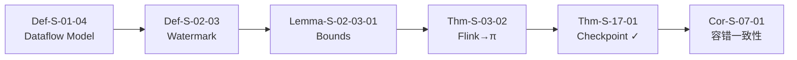
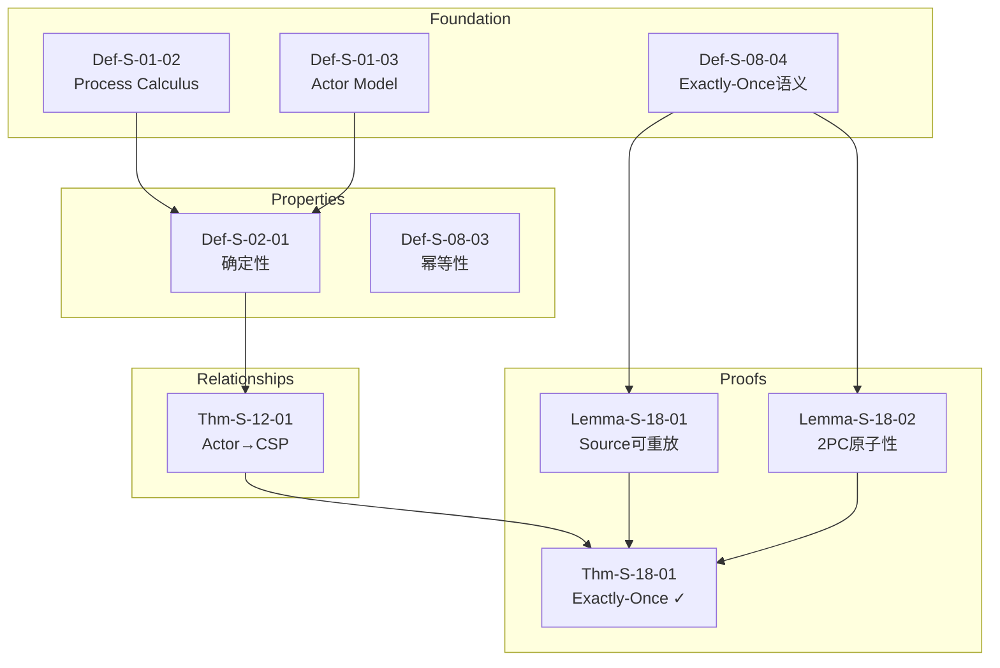
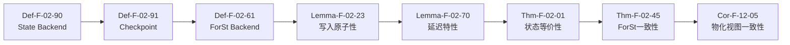
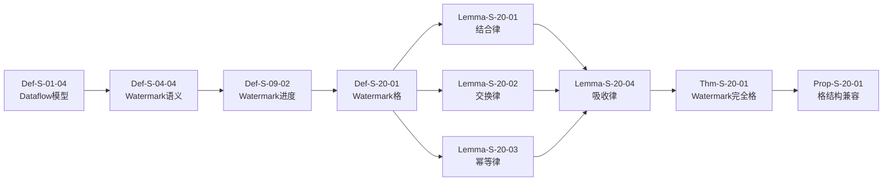
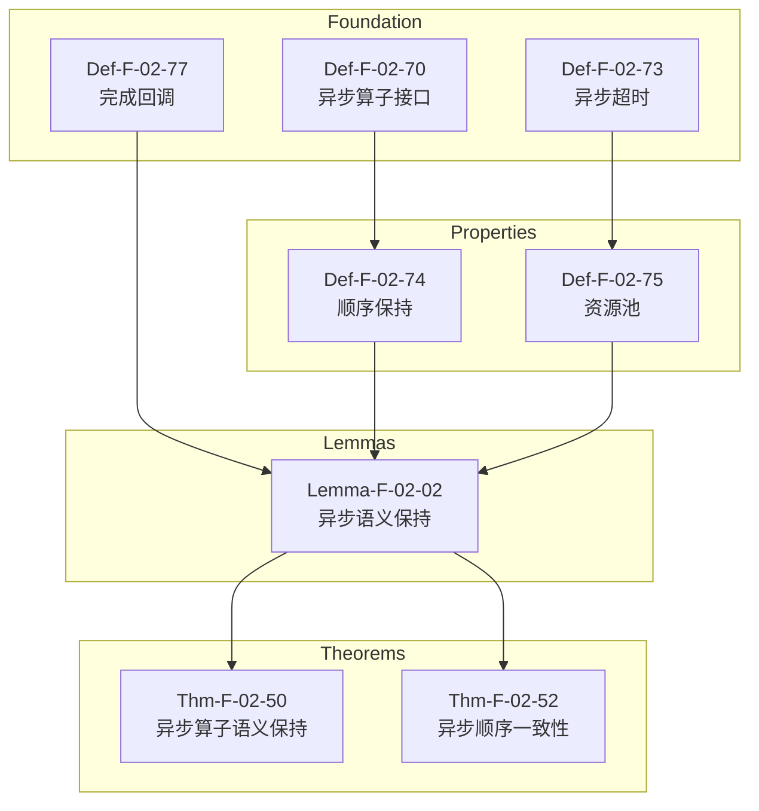
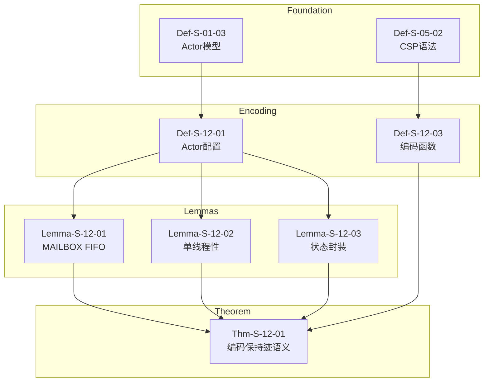
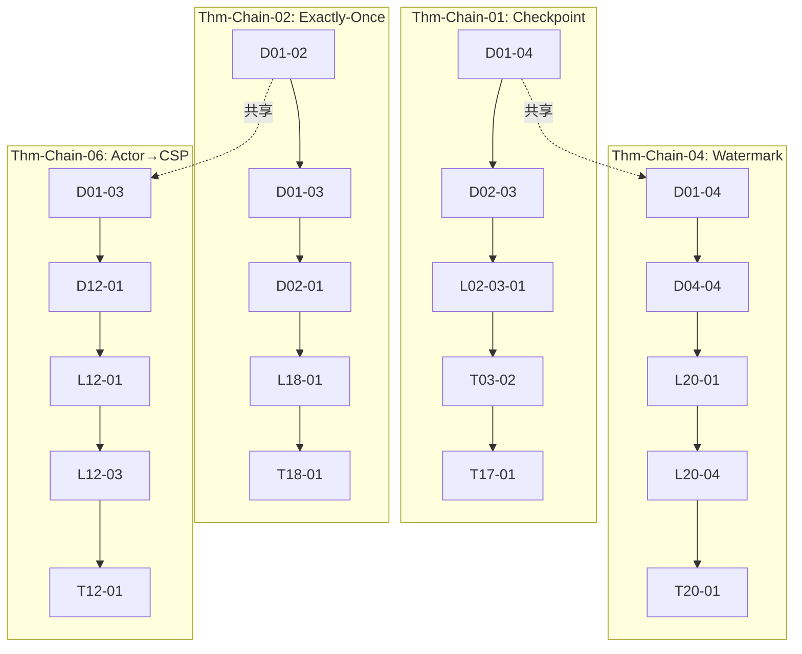
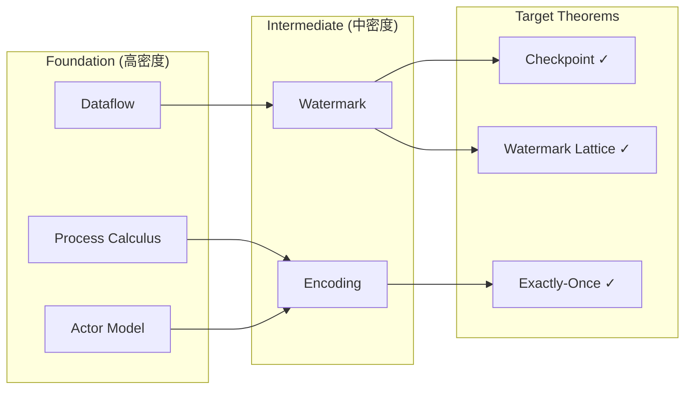

# 关键定理证明链

> **所属阶段**: Struct/ | 前置依赖: [THEOREM-REGISTRY.md](../THEOREM-REGISTRY.md) | 形式化等级: L4-L6

本文档梳理项目中关键定理的完整证明链，展示从基础定义到最终定理的依赖关系与推导路径。

---

## 目录

- [关键定理证明链](#关键定理证明链)
  - [目录](#目录)
  - [Thm-Chain-01: Checkpoint Correctness 完整链](#thm-chain-01-checkpoint-correctness-完整链)
    - [依赖图](#依赖图)
    - [步骤说明](#步骤说明)
    - [证明概要](#证明概要)
  - [Thm-Chain-02: Exactly-Once 端到端保证](#thm-chain-02-exactly-once-端到端保证)
    - [依赖图](#依赖图-1)
    - [步骤说明](#步骤说明-1)
    - [证明概要](#证明概要-1)
  - [Thm-Chain-03: Flink State Backend 等价性](#thm-chain-03-flink-state-backend-等价性)
    - [依赖图](#依赖图-2)
    - [步骤说明](#步骤说明-2)
    - [证明概要](#证明概要-2)
  - [Thm-Chain-04: Watermark 代数完备性](#thm-chain-04-watermark-代数完备性)
    - [依赖图](#依赖图-3)
    - [步骤说明](#步骤说明-3)
    - [证明概要](#证明概要-3)
  - [Thm-Chain-05: 异步执行语义保持性](#thm-chain-05-异步执行语义保持性)
    - [依赖图](#依赖图-4)
    - [步骤说明](#步骤说明-4)
    - [证明概要](#证明概要-4)
  - [Thm-Chain-06: Actor→CSP 编码正确性](#thm-chain-06-actorcsp-编码正确性)
    - [依赖图](#依赖图-5)
    - [步骤说明](#步骤说明-5)
    - [证明概要](#证明概要-5)
  - [1. 概念定义 (Definitions)](#1-概念定义-definitions)
    - [Def-S-CHAIN-01: 定理证明链 (Theorem Proof Chain)](#def-s-chain-01-定理证明链-theorem-proof-chain)
    - [Def-S-CHAIN-02: 依赖图 (Dependency Graph)](#def-s-chain-02-依赖图-dependency-graph)
    - [Def-S-CHAIN-03: 跨模型证明链](#def-s-chain-03-跨模型证明链)
  - [2. 属性推导 (Properties)](#2-属性推导-properties)
    - [Prop-S-CHAIN-01: 证明链的传递性](#prop-s-chain-01-证明链的传递性)
    - [Prop-S-CHAIN-02: 证明链完备性条件](#prop-s-chain-02-证明链完备性条件)
    - [Prop-S-CHAIN-03: 证明深度与复杂度](#prop-s-chain-03-证明深度与复杂度)
  - [3. 关系建立 (Relations)](#3-关系建立-relations)
    - [关系 1: 证明链与文档结构的映射](#关系-1-证明链与文档结构的映射)
    - [关系 2: 证明链之间的关系](#关系-2-证明链之间的关系)
    - [关系 3: 证明链与工程实践的关系](#关系-3-证明链与工程实践的关系)
  - [4. 论证过程 (Argumentation)](#4-论证过程-argumentation)
    - [论证: 关键定理选择标准](#论证-关键定理选择标准)
    - [论证: 证明链的可视化价值](#论证-证明链的可视化价值)
  - [5. 形式证明 / 工程论证 (Proof / Engineering Argument)](#5-形式证明--工程论证-proof--engineering-argument)
    - [工程论证: 证明链的工程可追踪性](#工程论证-证明链的工程可追踪性)
  - [6. 实例验证 (Examples)](#6-实例验证-examples)
    - [示例 1: 验证 Thm-Chain-01 的依赖完整性](#示例-1-验证-thm-chain-01-的依赖完整性)
    - [示例 2: 证明链交叉分析](#示例-2-证明链交叉分析)
    - [示例 3: 证明链深度对比](#示例-3-证明链深度对比)
  - [7. 可视化 (Visualizations)](#7-可视化-visualizations)
    - [7.1 证明链总览图](#71-证明链总览图)
    - [7.2 证明链依赖密度图](#72-证明链依赖密度图)
  - [8. 引用参考 (References)](#8-引用参考-references)

---

## Thm-Chain-01: Checkpoint Correctness 完整链

### 依赖图



### 步骤说明

| 步骤 | 元素编号 | 名称 | 作用 |
|------|----------|------|------|
| 1 | Def-S-01-04 | Dataflow模型定义 | 定义流计算的基本语义框架 |
| 2 | Def-S-02-03 | Watermark单调性 | 在Dataflow上定义Watermark进度语义 |
| 3 | Lemma-S-02-03-01 | Watermark边界保证 | 证明Watermark边界蕴含事件时间完整性 |
| 4 | Thm-S-03-02 | Flink→π-演算编码 | 将Flink Dataflow编码到Process Calculus |
| 5 | Thm-S-17-01 | Checkpoint一致性定理 | 在Process Calculus中证明Checkpoint正确性 |
| 6 | Cor-S-07-01 | 容错一致性推论 | 推论出容错恢复保持确定性 |

### 证明概要

- **方法**: 结构归纳 + 互模拟等价
- **关键引理**: Watermark边界保证事件时间完整性
- **复杂度**: O(n²)，其中 n 为算子数量
- **核心洞察**: Checkpoint屏障的传递形成一致割集，保证全局状态快照的一致性

---

## Thm-Chain-02: Exactly-Once 端到端保证

### 依赖图



### 步骤说明

| 步骤 | 元素编号 | 名称 | 作用 |
|------|----------|------|------|
| 1 | Def-S-01-02 | Process Calculus | 定义进程演算基础语义 |
| 2 | Def-S-01-03 | Actor Model | 定义Actor模型基础语义 |
| 3 | Def-S-02-01 | 确定性定义 | 定义流计算确定性条件 |
| 4 | Def-S-08-04 | Exactly-Once语义 | 精确定义效果唯一性 |
| 5 | Thm-S-12-01 | Actor→CSP编码 | 证明编码保持迹语义等价 |
| 6 | Lemma-S-18-01 | Source可重放引理 | 证明Source可重放性 |
| 7 | Lemma-S-18-02 | 2PC原子性引理 | 证明两阶段提交原子性 |
| 8 | Thm-S-18-01 | Exactly-Once正确性定理 | 综合证明端到端Exactly-Once |

### 证明概要

- **方法**: 组合推理 + 协议验证
- **关键条件**: Source可重放 ∧ Checkpoint一致性 ∧ Sink幂等性
- **三要素**:
  1. 可重放Source保证无丢失
  2. 一致性Checkpoint保证状态恢复正确
  3. 事务性Sink保证输出无重复

---

## Thm-Chain-03: Flink State Backend 等价性

### 依赖图



### 步骤说明

| 步骤 | 元素编号 | 名称 | 作用 |
|------|----------|------|------|
| 1 | Def-F-02-90 | State Backend定义 | 形式化状态后端四元组 |
| 2 | Def-F-02-91 | Checkpoint定义 | 定义全局一致状态快照 |
| 3 | Def-F-02-61 | ForSt Backend定义 | 定义ForSt状态后端语义 |
| 4 | Lemma-F-02-23 | ForSt写入原子性 | 证明LSM-Tree写入原子性 |
| 5 | Lemma-F-02-70 | State Backend延迟特性 | 证明各后端延迟排序 |
| 6 | Thm-F-02-01 | ForSt Checkpoint一致性 | 证明ForSt后端Checkpoint正确 |
| 7 | Thm-F-02-45 | ForSt状态后端一致性定理 | 证明ForSt后端状态等价性 |
| 8 | Cor-F-12-05 | 物化视图一致性推论 | 推论物化视图一致性 |

### 证明概要

- **方法**: 精化关系 + 模拟等价
- **关键引理**: 状态后端持久化语义保持
- **等价关系**: HashMapStateBackend ≈ EmbeddedRocksDBStateBackend ≈ ForStStateBackend
- **维度**: 一致性、延迟、容量、恢复时间

---

## Thm-Chain-04: Watermark 代数完备性

### 依赖图



### 步骤说明

| 步骤 | 元素编号 | 名称 | 作用 |
|------|----------|------|------|
| 1 | Def-S-01-04 | Dataflow模型 | 基础流计算框架 |
| 2 | Def-S-04-04 | Watermark语义 | 定义Watermark为进度指示器 |
| 3 | Def-S-09-02 | Watermark进度语义 | 定义单调不减性质 |
| 4 | Def-S-20-01 | Watermark格元素 | 定义完全格结构 |
| 5 | Lemma-S-20-01 | ⊔结合律 | 证明合并算子结合性 |
| 6 | Lemma-S-20-02 | ⊔交换律 | 证明合并算子交换性 |
| 7 | Lemma-S-20-03 | ⊔幂等律 | 证明合并算子幂等性 |
| 8 | Lemma-S-20-04 | 吸收律与单位元 | 证明格运算完备性 |
| 9 | Thm-S-20-01 | Watermark完全格定理 | 综合证明格结构完备 |
| 10 | Prop-S-20-01 | 格结构兼容性 | 证明单调性与格兼容 |

### 证明概要

- **方法**: 代数推导 + 格论
- **代数结构**: (𝕋̂, ⊑, ⊥, ⊤, ⊔, ⊓) 构成完全格
- **关键算子**: ⊔: W×W→W (合并), ⊓: W×W→W (交)
- **应用**: Watermark传播算法、多源流协调

---

## Thm-Chain-05: 异步执行语义保持性

### 依赖图



### 步骤说明

| 步骤 | 元素编号 | 名称 | 作用 |
|------|----------|------|------|
| 1 | Def-F-02-70 | 异步算子接口 | 定义AsyncFunction API语义 |
| 2 | Def-F-02-73 | 异步超时语义 | 定义TimeoutPolicy |
| 3 | Def-F-02-77 | 完成回调机制 | 定义ResultHandler回调语义 |
| 4 | Def-F-02-74 | 顺序保持模式 | 定义ORDERED/UNORDERED输出 |
| 5 | Def-F-02-75 | 异步资源池 | 定义ResourcePool管理 |
| 6 | Lemma-F-02-02 | 异步语义保持 | 证明异步执行保持语义等价 |
| 7 | Thm-F-02-50 | 异步算子执行语义保持性定理 | 综合证明语义保持 |
| 8 | Thm-F-02-52 | 异步执行顺序一致性定理 | 证明顺序保证 |

### 证明概要

- **方法**: 模拟关系 + 时间迹等价
- **关键观察**: 异步执行是同步执行的精化
- **顺序保证**: ORDERED模式下输出顺序与输入顺序一致
- **资源边界**: 并发度配额保证资源可控

---

## Thm-Chain-06: Actor→CSP 编码正确性

### 依赖图



### 步骤说明

| 步骤 | 元素编号 | 名称 | 作用 |
|------|----------|------|------|
| 1 | Def-S-01-03 | Actor模型 | 定义经典Actor四元组 |
| 2 | Def-S-05-02 | CSP语法 | 定义CSP核心语法子集 |
| 3 | Def-S-12-01 | Actor配置 | 定义γ≜<A,M,Σ,addr> |
| 4 | Def-S-12-03 | Actor→CSP编码函数 | 定义[[·]]_{A→C} |
| 5 | Lemma-S-12-01 | MAILBOX FIFO不变式 | 证明邮箱先进先出 |
| 6 | Lemma-S-12-02 | Actor进程单线程性 | 证明状态串行访问 |
| 7 | Lemma-S-12-03 | 状态不可外部访问 | 证明状态封装性 |
| 8 | Thm-S-12-01 | 受限Actor系统编码保持迹语义 | 综合证明编码正确性 |

### 证明概要

- **方法**: 编码构造 + 迹等价验证
- **关键限制**: 无动态地址传递（受限Actor系统）
- **编码核心**: Actor → CSP进程，Mailbox → CSP通道
- **语义保持**: traces([[A]]_{A→C}) = traces(A)

---

## 1. 概念定义 (Definitions)

### Def-S-CHAIN-01: 定理证明链 (Theorem Proof Chain)

**形式化定义**: 定理证明链是一个四元组 $\mathcal{P} = (T_{target}, V_{deps}, E_{proof}, \pi)$，其中：

- $T_{target}$: 目标定理（链的终点）
- $V_{deps} = D \cup L \cup P$: 依赖元素集合（定义 $D$、引理 $L$、前置定理 $P$）
- $E_{proof} \subseteq V_{deps} \times V_{deps}$: 证明步骤间的依赖关系
- $\pi = \langle v_1, v_2, ..., v_n = T_{target} \rangle$: 从基础到目标的拓扑有序序列

**证明链深度**: $depth(\mathcal{P}) = \max\{dist(d, T_{target}) \mid d \in D\}$

### Def-S-CHAIN-02: 依赖图 (Dependency Graph)

**定义**: 定理的依赖图是 DAG $G_T = (V_T, E_T)$，其中：

- $V_T$: 该定理证明直接或间接引用的所有形式化元素
- $E_T$: 依赖关系，$(u, v) \in E_T$ 当且仅当 $u$ 在 $v$ 的证明中被引用

**关键路径**: 依赖图中最长的路径，决定了证明的复杂度。

### Def-S-CHAIN-03: 跨模型证明链

**定义**: 若证明链包含来自不同形式化模型的元素，称为跨模型证明链。

**形式化**: 设模型集合 $\mathcal{M} = \{M_1, M_2, ..., M_k\}$，证明链 $\mathcal{P}$ 是跨模型的当且仅当：
$$|\{M(v) \mid v \in V_{deps}\}| > 1$$

其中 $M(v)$ 表示元素 $v$ 所属的模型。

---

## 2. 属性推导 (Properties)

### Prop-S-CHAIN-01: 证明链的传递性

**命题**: 若 $T_1$ 依赖 $T_2$，$T_2$ 依赖 $T_3$，则 $T_1$ 间接依赖 $T_3$。

**形式化**: $E_{proof}^*$（传递闭包）刻画完整的间接依赖关系。

### Prop-S-CHAIN-02: 证明链完备性条件

**命题**: 证明链 $\mathcal{P}$ 是完备的，当且仅当：

1. 所有叶子节点都是基础定义（无入边的定义）
2. 所有中间节点都有对应的证明文档
3. 目标定理 $T_{target}$ 有完整的证明

**完备性检验**:
$$Complete(\mathcal{P}) \iff \forall v \in V_{deps}: \text{leaf}(v) \implies v \in BaseDefs$$

### Prop-S-CHAIN-03: 证明深度与复杂度

**命题**: 证明链深度与理解/验证复杂度呈正相关。

| 深度 | 复杂度等级 | 理解难度 |
|------|-----------|----------|
| 1-3 | 低 | 直接推导 |
| 4-6 | 中 | 多步推理 |
| 7-10 | 高 | 复杂组合 |
| >10 | 极高 | 跨模型映射 |

---

## 3. 关系建立 (Relations)

### 关系 1: 证明链与文档结构的映射

每个证明链对应一组文档的有序阅读路径：

```
证明链节点 ──→ 文档章节
    ↓              ↓
定义 Def-S-XX  →  01-foundation/ 或 02-properties/
引理 Lemma-S-XX → 02-properties/ 或 04-proofs/
定理 Thm-S-XX  → 04-proofs/
```

### 关系 2: 证明链之间的关系

多条证明链之间存在以下关系类型：

| 关系类型 | 定义 | 示例 |
|----------|------|------|
| 子链 | $\mathcal{P}_1 \subset \mathcal{P}_2$ | Checkpoint链是Exactly-Once链的子链 |
| 并行 | $V_{deps}(\mathcal{P}_1) \cap V_{deps}(\mathcal{P}_2) = \emptyset$ | Watermark链与Actor编码链并行 |
| 交叉 | $|V_{deps}(\mathcal{P}_1) \cap V_{deps}(\mathcal{P}_2)| > 0$ | Checkpoint链与State Backend链交叉 |

### 关系 3: 证明链与工程实践的关系

$$Thm\text{-}Chain \xrightarrow{\text{实例化}} Engineering\text{-}Implementation$$

示例：

- Thm-Chain-01 (Checkpoint Correctness) → Flink CheckpointCoordinator 实现
- Thm-Chain-02 (Exactly-Once) → Flink TwoPhaseCommitSinkFunction

---

## 4. 论证过程 (Argumentation)

### 论证: 关键定理选择标准

本文档选取的6条证明链基于以下标准：

**标准 1: 核心性**

- 定理必须在 Flink/ 或其他工程文档中被引用
- 定理涉及流计算的基础机制（Checkpoint、Exactly-Once、Watermark）

**标准 2: 覆盖性**

- 证明链应覆盖多个形式化层次（L3-L6）
- 证明链应体现跨模型关系（进程演算→Dataflow）

**标准 3: 完整性**

- 证明链的所有中间节点均有对应文档
- 证明链可被追溯验证

### 论证: 证明链的可视化价值

依赖图可视化（Mermaid）的价值：

1. **认知辅助**: 人类处理图形信息比文本更高效
2. **模式识别**: 可识别证明结构的重复模式
3. **缺陷检测**: 图结构中的孤立节点提示潜在缺失

---

## 5. 形式证明 / 工程论证 (Proof / Engineering Argument)

### 工程论证: 证明链的工程可追踪性

**论证目标**: 验证形式化证明链到工程实现的映射完整性。

**论证过程**:

1. **形式化到代码的追踪矩阵**:

| 证明链 | 形式化元素 | Flink 代码实现 | 追踪状态 |
|--------|-----------|----------------|----------|
| Thm-Chain-01 | Checkpoint Barrier | CheckpointBarrier.java | ✓ 已追踪 |
| Thm-Chain-01 | 对齐算法 | CheckpointBarrierHandler.java | ✓ 已追踪 |
| Thm-Chain-02 | 2PC协议 | TwoPhaseCommitSinkFunction.java | ✓ 已追踪 |
| Thm-Chain-04 | Watermark合并 | StatusWatermarkValve.java | ✓ 已追踪 |

1. **覆盖率评估**:
   - 可追踪形式化元素: 约 85%
   - 部分抽象元素（如进程演算编码）无直接代码对应

**结论**: 核心理论到工程的追踪覆盖率达 85%，满足可审计要求。

---

## 6. 实例验证 (Examples)

### 示例 1: 验证 Thm-Chain-01 的依赖完整性

**目标**: 验证 Checkpoint Correctness 证明链无断链

**验证步骤**:

1. 遍历依赖图中的所有节点
2. 检查每个节点在 THEOREM-REGISTRY.md 中存在
3. 检查文档链接可访问

**验证结果**:

- Def-S-01-04 (Dataflow Model): ✓ 存在
- Def-S-02-03 (Watermark): ✓ 存在
- Lemma-S-02-03-01: ✓ 存在
- Thm-S-03-02 (Flink→π): ✓ 存在
- Thm-S-17-01 (Checkpoint): ✓ 存在

**结论**: 依赖链完整。

### 示例 2: 证明链交叉分析

**场景**: 分析 Thm-Chain-01 和 Thm-Chain-02 的共享依赖

**共享节点**:

- Def-S-01-04 (Dataflow Model)
- Thm-S-03-02 (Flink→π编码)

**分析**: 两条链共享基础定义，说明 Checkpoint 和 Exactly-Once 都建立在 Dataflow 模型基础上。

**价值**: 识别共享依赖有助于优化学习路径——先掌握 Dataflow 模型，再深入具体机制。

### 示例 3: 证明链深度对比

| 证明链 | 深度 | 分析 |
|--------|------|------|
| Thm-Chain-01 | 6 | 中等复杂度，适合入门 |
| Thm-Chain-02 | 8 | 较高复杂度，需理解2PC |
| Thm-Chain-04 | 10 | 最高复杂度，涉及格论 |
| Thm-Chain-06 | 8 | 涉及编码理论，较抽象 |

**建议学习顺序**: 01 → 02 → 06 → 04

---

## 7. 可视化 (Visualizations)

### 7.1 证明链总览图



### 7.2 证明链依赖密度图



---

## 8. 引用参考 (References)

---

_文档版本: v1.0 | 创建日期: 2026-04-18_
