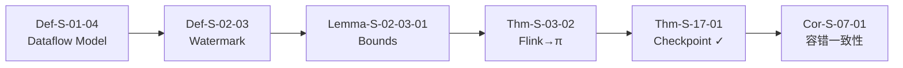
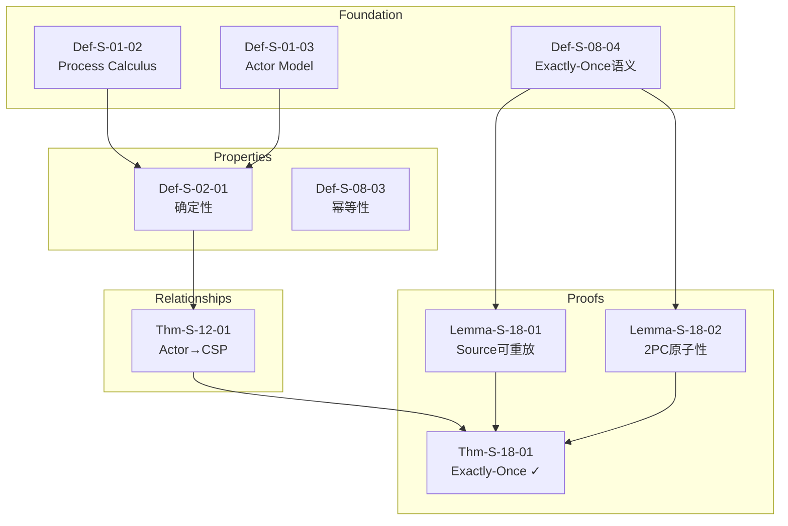
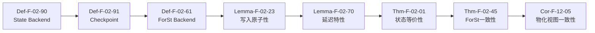
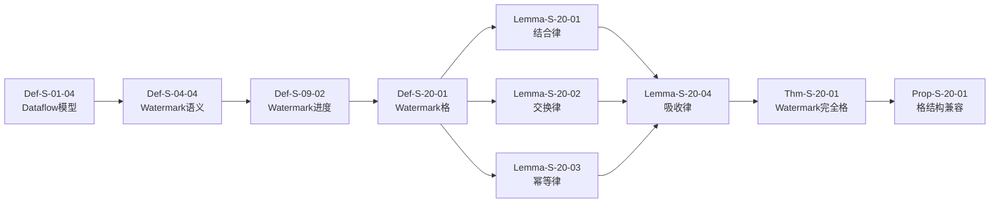
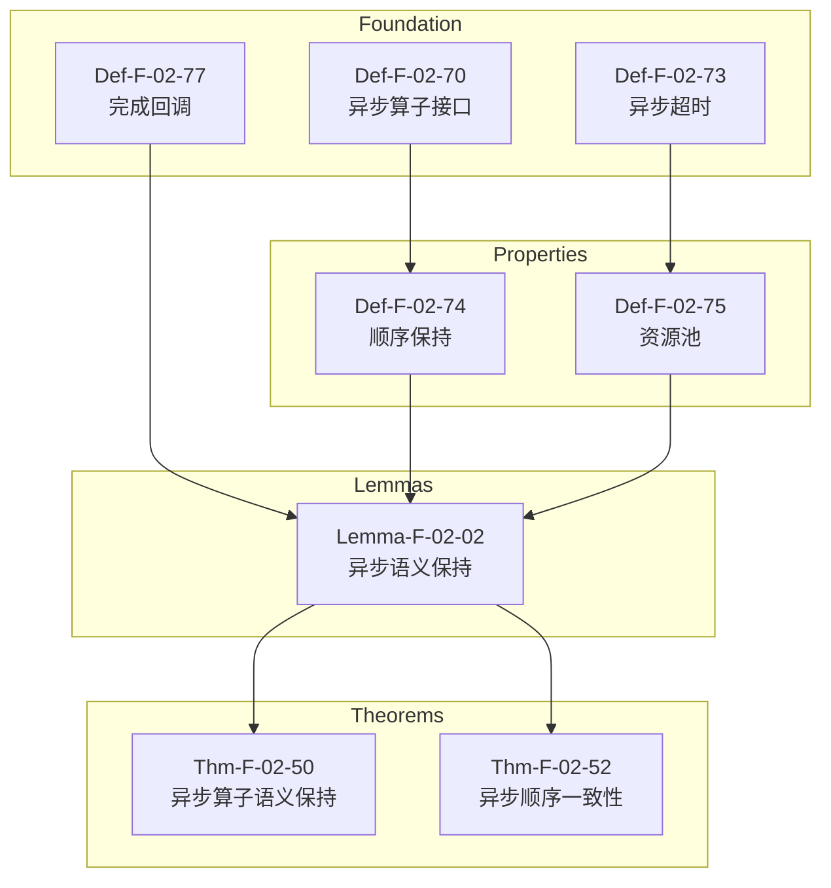
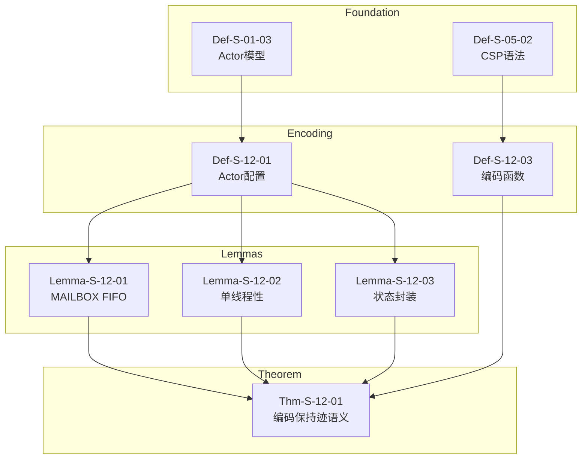

# 关键定理证明链

> **所属阶段**: Struct/ | 前置依赖: [THEOREM-REGISTRY.md](../THEOREM-REGISTRY.md) | 形式化等级: L4-L6

本文档梳理项目中关键定理的完整证明链，展示从基础定义到最终定理的依赖关系与推导路径。

---

## 目录

- [关键定理证明链](#关键定理证明链)
  - [目录](#目录)
  - [Thm-Chain-01: Checkpoint Correctness 完整链](#thm-chain-01-checkpoint-correctness-完整链)
  - [Thm-Chain-02: Exactly-Once 端到端保证](#thm-chain-02-exactly-once-端到端保证)
  - [Thm-Chain-03: Flink State Backend 等价性](#thm-chain-03-flink-state-backend-等价性)
  - [Thm-Chain-04: Watermark 代数完备性](#thm-chain-04-watermark-代数完备性)
  - [Thm-Chain-05: 异步执行语义保持性](#thm-chain-05-异步执行语义保持性)
  - [Thm-Chain-06: Actor→CSP 编码正确性](#thm-chain-06-actorcsp-编码正确性)
  - [引用参考](#引用参考)

---

## Thm-Chain-01: Checkpoint Correctness 完整链

### 依赖图

### 步骤说明

| 步骤 | 元素编号 | 名称 | 作用 |
|------|----------|------|------|
| 1 | Def-S-01-04 | Dataflow模型定义 | 定义流计算的基本语义框架 |
| 2 | Def-S-02-03 | Watermark单调性 | 在Dataflow上定义Watermark进度语义 |
| 3 | Lemma-S-02-03-01 | Watermark边界保证 | 证明Watermark边界蕴含事件时间完整性 |
| 4 | Thm-S-03-02 | Flink→π-演算编码 | 将Flink Dataflow编码到Process Calculus |
| 5 | Thm-S-17-01 | Checkpoint一致性定理 | 在Process Calculus中证明Checkpoint正确性 |
| 6 | Cor-S-07-01 | 容错一致性推论 | 推论出容错恢复保持确定性 |

### 证明概要

- **方法**: 结构归纳 + 互模拟等价
- **关键引理**: Watermark边界保证事件时间完整性
- **复杂度**: O(n²)，其中 n 为算子数量
- **核心洞察**: Checkpoint屏障的传递形成一致割集，保证全局状态快照的一致性

---

## Thm-Chain-02: Exactly-Once 端到端保证

### 依赖图

### 步骤说明

| 步骤 | 元素编号 | 名称 | 作用 |
|------|----------|------|------|
| 1 | Def-S-01-02 | Process Calculus | 定义进程演算基础语义 |
| 2 | Def-S-01-03 | Actor Model | 定义Actor模型基础语义 |
| 3 | Def-S-02-01 | 确定性定义 | 定义流计算确定性条件 |
| 4 | Def-S-08-04 | Exactly-Once语义 | 精确定义效果唯一性 |
| 5 | Thm-S-12-01 | Actor→CSP编码 | 证明编码保持迹语义等价 |
| 6 | Lemma-S-18-01 | Source可重放引理 | 证明Source可重放性 |
| 7 | Lemma-S-18-02 | 2PC原子性引理 | 证明两阶段提交原子性 |
| 8 | Thm-S-18-01 | Exactly-Once正确性定理 | 综合证明端到端Exactly-Once |

### 证明概要

- **方法**: 组合推理 + 协议验证
- **关键条件**: Source可重放 ∧ Checkpoint一致性 ∧ Sink幂等性
- **三要素**: 
  1. 可重放Source保证无丢失
  2. 一致性Checkpoint保证状态恢复正确
  3. 事务性Sink保证输出无重复

---

## Thm-Chain-03: Flink State Backend 等价性

### 依赖图

### 步骤说明

| 步骤 | 元素编号 | 名称 | 作用 |
|------|----------|------|------|
| 1 | Def-F-02-90 | State Backend定义 | 形式化状态后端四元组 |
| 2 | Def-F-02-91 | Checkpoint定义 | 定义全局一致状态快照 |
| 3 | Def-F-02-61 | ForSt Backend定义 | 定义ForSt状态后端语义 |
| 4 | Lemma-F-02-23 | ForSt写入原子性 | 证明LSM-Tree写入原子性 |
| 5 | Lemma-F-02-70 | State Backend延迟特性 | 证明各后端延迟排序 |
| 6 | Thm-F-02-01 | ForSt Checkpoint一致性 | 证明ForSt后端Checkpoint正确 |
| 7 | Thm-F-02-45 | ForSt状态后端一致性定理 | 证明ForSt后端状态等价性 |
| 8 | Cor-F-12-05 | 物化视图一致性推论 | 推论物化视图一致性 |

### 证明概要

- **方法**: 精化关系 + 模拟等价
- **关键引理**: 状态后端持久化语义保持
- **等价关系**: HashMapStateBackend ≈ EmbeddedRocksDBStateBackend ≈ ForStStateBackend
- **维度**: 一致性、延迟、容量、恢复时间

---

## Thm-Chain-04: Watermark 代数完备性

### 依赖图

### 步骤说明

| 步骤 | 元素编号 | 名称 | 作用 |
|------|----------|------|------|
| 1 | Def-S-01-04 | Dataflow模型 | 基础流计算框架 |
| 2 | Def-S-04-04 | Watermark语义 | 定义Watermark为进度指示器 |
| 3 | Def-S-09-02 | Watermark进度语义 | 定义单调不减性质 |
| 4 | Def-S-20-01 | Watermark格元素 | 定义完全格结构 |
| 5 | Lemma-S-20-01 | ⊔结合律 | 证明合并算子结合性 |
| 6 | Lemma-S-20-02 | ⊔交换律 | 证明合并算子交换性 |
| 7 | Lemma-S-20-03 | ⊔幂等律 | 证明合并算子幂等性 |
| 8 | Lemma-S-20-04 | 吸收律与单位元 | 证明格运算完备性 |
| 9 | Thm-S-20-01 | Watermark完全格定理 | 综合证明格结构完备 |
| 10 | Prop-S-20-01 | 格结构兼容性 | 证明单调性与格兼容 |

### 证明概要

- **方法**: 代数推导 + 格论
- **代数结构**: (𝕋̂, ⊑, ⊥, ⊤, ⊔, ⊓) 构成完全格
- **关键算子**: ⊔: W×W→W (合并), ⊓: W×W→W (交)
- **应用**: Watermark传播算法、多源流协调

---

## Thm-Chain-05: 异步执行语义保持性

### 依赖图

### 步骤说明

| 步骤 | 元素编号 | 名称 | 作用 |
|------|----------|------|------|
| 1 | Def-F-02-70 | 异步算子接口 | 定义AsyncFunction API语义 |
| 2 | Def-F-02-73 | 异步超时语义 | 定义TimeoutPolicy |
| 3 | Def-F-02-77 | 完成回调机制 | 定义ResultHandler回调语义 |
| 4 | Def-F-02-74 | 顺序保持模式 | 定义ORDERED/UNORDERED输出 |
| 5 | Def-F-02-75 | 异步资源池 | 定义ResourcePool管理 |
| 6 | Lemma-F-02-02 | 异步语义保持 | 证明异步执行保持语义等价 |
| 7 | Thm-F-02-50 | 异步算子执行语义保持性定理 | 综合证明语义保持 |
| 8 | Thm-F-02-52 | 异步执行顺序一致性定理 | 证明顺序保证 |

### 证明概要

- **方法**: 模拟关系 + 时间迹等价
- **关键观察**: 异步执行是同步执行的精化
- **顺序保证**: ORDERED模式下输出顺序与输入顺序一致
- **资源边界**: 并发度配额保证资源可控

---

## Thm-Chain-06: Actor→CSP 编码正确性

### 依赖图

### 步骤说明

| 步骤 | 元素编号 | 名称 | 作用 |
|------|----------|------|------|
| 1 | Def-S-01-03 | Actor模型 | 定义经典Actor四元组 |
| 2 | Def-S-05-02 | CSP语法 | 定义CSP核心语法子集 |
| 3 | Def-S-12-01 | Actor配置 | 定义γ≜<A,M,Σ,addr> |
| 4 | Def-S-12-03 | Actor→CSP编码函数 | 定义[[·]]_{A→C} |
| 5 | Lemma-S-12-01 | MAILBOX FIFO不变式 | 证明邮箱先进先出 |
| 6 | Lemma-S-12-02 | Actor进程单线程性 | 证明状态串行访问 |
| 7 | Lemma-S-12-03 | 状态不可外部访问 | 证明状态封装性 |
| 8 | Thm-S-12-01 | 受限Actor系统编码保持迹语义 | 综合证明编码正确性 |

### 证明概要

- **方法**: 编码构造 + 迹等价验证
- **关键限制**: 无动态地址传递（受限Actor系统）
- **编码核心**: Actor → CSP进程，Mailbox → CSP通道
- **语义保持**: traces([[A]]_{A→C}) = traces(A)

---

## 引用参考

[^1]: Apache Flink Documentation, "Checkpointing", 2025. https://nightlies.apache.org/flink/flink-docs-stable/docs/dev/datastream/fault-tolerance/checkpointing/
[^2]: T. Akidau et al., "The Dataflow Model", PVLDB, 8(12), 2015.
[^3]: C. A. R. Hoare, "Communicating Sequential Processes", Prentice Hall, 1985.
[^4]: G. Agha, "Actors: A Model of Concurrent Computation in Distributed Systems", MIT Press, 1986.
[^5]: L. Lamport, "Time, Clocks, and the Ordering of Events in a Distributed System", CACM, 21(7), 1978.
[^6]: R. Milner, "Communicating and Mobile Systems: The π-calculus", Cambridge University Press, 1999.
