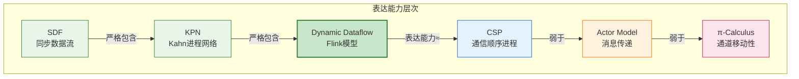
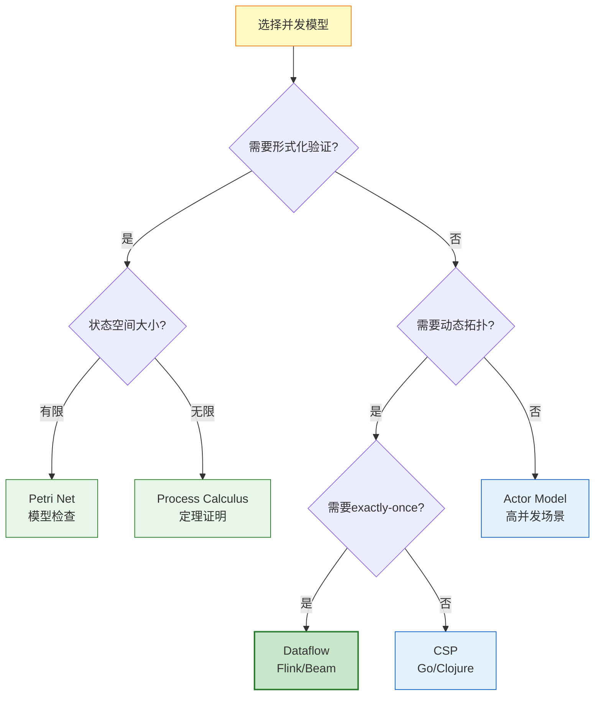

# 并发计算模型多维对比矩阵

> **版本**: v1.0 | **日期**: 2026-04-20 | **状态**: 已完成
> **所属阶段**: Struct/ | **前置依赖**: [01.02-process-calculus-primer.md](./01-foundation/01.02-process-calculus-primer.md), [01.03-actor-model-formalization.md](./01-foundation/01.03-actor-model-formalization.md), [01.04-dataflow-model-formalization.md](./01-foundation/01.04-dataflow-model-formalization.md), [01.05-csp-formalization.md](./01-foundation/01.05-csp-formalization.md), [01.06-petri-net-formalization.md](./01-foundation/01.06-petri-net-formalization.md) | **形式化等级**: L3-L5

---

## 1. 概念定义 (Definitions)

### Def-S-MCM-01. 并发计算模型对比框架

并发计算模型对比框架是一个十元组：

$$
\mathcal{M}_{compare} = (\mathcal{F}, \mathcal{A}, \mathcal{E}, \mathcal{D}, \mathcal{Det}, \mathcal{U}, \mathcal{T}, \mathcal{Time}, \mathcal{Fault}, \mathcal{L})
$$

其中每个维度对应一个对比属性。

### Def-S-MCM-02. 模型表达能力偏序

模型 $M_1$ 的表达能力严格强于 $M_2$，记为 $M_1 \succ M_2$，当且仅当：

$$
\exists P \in \mathcal{L}(M_1): P \not\in \mathcal{L}(M_2) \land \forall Q \in \mathcal{L}(M_2): Q \in \mathcal{L}(M_1)
$$

其中 $\mathcal{L}(M)$ 表示模型 $M$ 可描述的行为语言集合。

---

## 2. 属性推导 (Properties)

### Lemma-S-MCM-01. 表达能力严格层次

由 [Thm-S-14-01](./03-relationships/03.03-expressiveness-hierarchy.md) 可知：

$$
SDF \prec KPN \prec Dataflow \prec \pi\text{-Calculus}
$$

### Lemma-S-MCM-02. 确定性保证的模型差异

- KPN: 天然确定性（纯函数 + FIFO）
- SDF: 天然确定性（静态调度）
- Actor: 非确定性（消息到达顺序不确定）
- Dataflow (Flink): 条件确定性（纯函数 + 事件时间 + Watermark）

### Prop-S-MCM-01. 形式化基础与工具支持的负相关

形式化基础越严格的模型（如 Petri Net），工业工具支持越丰富；形式化基础越抽象的模型（如 π-Calculus），工业实现越困难。

---

## 3. 关系建立 (Relations)

### 关系 1: 模型间的编码关系

| 编码关系 | 源模型 | 目标模型 | 保持性质 | 参考文档 |
|---------|--------|---------|---------|---------|
| Actor→CSP | Actor (受限) | CSP | 迹语义 | [03.01-actor-to-csp-encoding.md](./03-relationships/03.01-actor-to-csp-encoding.md) |
| Dataflow→CSP | Dataflow | CSP | 确定性 | [03.03-expressiveness-hierarchy.md](./03-relationships/03.03-expressiveness-hierarchy.md) |
| Flink→π | Flink Dataflow | π-Calculus | Exactly-Once | [03.02-flink-to-process-calculus.md](./03-relationships/03.02-flink-to-process-calculus.md) |
| KPN→Dataflow | KPN | Dynamic Dataflow | 确定性 | [01.04-dataflow-model-formalization.md](./01-foundation/01.04-dataflow-model-formalization.md) |

### 关系 2: 模型到实现的映射

| 模型 | 主要工业实现 | 关系类型 |
|------|------------|---------|
| Actor Model | Akka, Pekko, Orleans, Erlang/OTP | instantiates |
| CSP | Go channels, Clojure core.async | instantiates |
| Dataflow | Apache Flink, Apache Beam, Google Dataflow | instantiates |
| Petri Net | YAWL, ProM, 工作流引擎 | instantiates |
| π-Calculus | 无直接工业实现（理论指导） | inspires |

---

## 4. 论证过程 (Argumentation)

### 论证 1: 为什么需要多维对比矩阵

单一维度的对比（如"哪个模型更好"）无法指导技术选型。多维矩阵显式化各模型的权衡空间，使选型决策有据可依。

### 论证 2: 形式化基础与工程实践的鸿沟

| 维度 | 理论视角 | 工程视角 | 鸿沟描述 |
|------|---------|---------|---------|
| 时间语义 | 偏序事件集 | Watermark + 窗口触发器 | 理论抽象到工程启发式的转化 |
| 容错机制 | 形式化恢复语义 | Checkpoint + 状态后端 | 理论正确性到工程可实现的近似 |
| 动态拓扑 | 通道移动性 | 动态扩缩容 | π-Calculus移动性远超工程需求 |

---

## 5. 形式证明 / 工程论证 (Proof / Engineering Argument)

### Thm-S-MCM-01. 流处理模型选型充分条件

**定理**: 对于流处理场景，若需求满足以下条件，则 Dataflow 模型（Flink 实现）是最优选择：

1. 需要事件时间语义（非仅处理时间）
2. 需要 exactly-once 一致性保证
3. 需要动态扩缩容能力
4. 状态规模超出单机内存容量

**证明概要**:

| 条件 | 排除模型 | 原因 |
|------|---------|------|
| 条件1 | KPN/SDF | 不支持乱序数据 |
| 条件2 | Actor | 无内置 exactly-once 机制 |
| 条件3 | SDF | 静态调度不支持动态拓扑 |
| 条件4 | 纯内存Actor | 状态超出单机容量 |

Dataflow 模型同时满足所有条件 ∎

---

## 6. 实例验证 (Examples)

### 示例 1: 金融实时风控系统的模型选型

**需求**: 低延迟、exactly-once、复杂事件模式检测、高可用

**分析**:

| 维度 | 需求值 | 匹配模型 | 理由 |
|------|--------|---------|------|
| 形式化基础 | L4-L5 | Dataflow + CEP | 需要精确语义保证 |
| 核心抽象 | 流 + 模式 | Dataflow | CEP算子原生支持 |
| 表达能力 | 高 | Dataflow/π-Calculus | 支持复杂窗口和Join |
| 动态拓扑 | 需要 | Dataflow/Actor | 支持运行时扩缩 |
| 确定性保证 | exactly-once | Dataflow | 内置checkpoint机制 |
| 主要用途 | 实时风控 | Dataflow | 业界标准方案 |
| 工具支持 | 丰富 | Flink/Dataflow | 成熟生态 |
| 时间语义 | 事件时间 | Dataflow | 乱序数据支持 |
| 容错机制 | 自动恢复 | Dataflow | Checkpoint + 状态后端 |
| 学习曲线 | 中等 | Dataflow | 文档丰富，社区活跃 |

**结论**: Apache Flink (Dataflow 模型实现) 是最优选择。

### 示例 2: IoT 边缘设备协议验证的模型选型

**需求**: 资源受限、协议验证、低代码复杂度

**结论**: CSP (Go channels) 或受限 Actor 模型更合适，因为：

- 资源受限排除重型 Dataflow 运行时
- 协议验证受益于 CSP 的迹语义
- 低代码复杂度受益于 Go 的 channel 原语

---

## 7. 可视化 (Visualizations)

### 7.1 并发模型表达能力层次图

### 7.2 模型选型决策树

---

## 8. 多维对比矩阵

### 8.1 核心对比矩阵

| 对比维度 | Process Calculus (CCS/CSP/π) | Actor Model | Dataflow (KPN/SDF/Dynamic) | Petri Net |
|---------|------------------------------|-------------|---------------------------|-----------|
| **形式化基础** | 进程代数，结构化操作语义 (SOS) [^1] | 消息传递演算，邮箱语义 [^2] | 偏序多重集，DAG拓扑 [^3] | 图论，可达性分析 [^4] |
| **核心抽象** | 进程、通道、同步/异步通信 | Actor、消息、邮箱、监督树 | 算子、流、窗口、Watermark | 库所、变迁、令牌、弧 |
| **表达能力** | 高 (π-Calculus 图灵完备) [^5] | 高 (动态地址传递) | 中高 (受限动态拓扑) | 中 (有界性限制) |
| **动态拓扑** | π-Calculus: 原生支持 [^5] | 原生支持 (动态创建Actor) | 有限支持 (Flink扩缩容) | 有限支持 (动态网) |
| **确定性保证** | CSP: 条件确定；CCS: 非确定 | 非确定 (消息顺序不确定) | KPN/SDF: 天然确定；Dynamic: 条件确定 [^6] | 确定 (触发规则固定) |
| **主要用途** | 协议验证、语义基础 | 高并发服务、分布式系统 | 流处理、批流一体 | 工作流、制造系统、验证 |
| **工具支持** | FDR4, PAT, mCRL2 | Akka, Pekko, Orleans | Flink, Beam, Spark Streaming | ProM, YAWL, Tina |
| **时间语义** | 无内置时间 (需扩展) | 无内置时间 | 事件时间/处理时间/Watermark [^7] | 时间 Petri 网扩展 |
| **容错机制** | 形式化恢复语义 | 监督树、let-it-crash | Checkpoint、状态后端、Exactly-Once [^8] | 冗余库所、恢复网 |
| **学习曲线** | 陡峭 (数学基础要求高) | 中等 (概念直观) | 中等 (工程文档丰富) | 中等 (图形化直观) |

### 8.2 文档引用矩阵

| 对比维度 | Process Calculus | Actor Model | Dataflow | Petri Net |
|---------|------------------|-------------|----------|-----------|
| 形式化基础 | [01.02-process-calculus-primer.md](./01-foundation/01.02-process-calculus-primer.md) | [01.03-actor-model-formalization.md](./01-foundation/01.03-actor-model-formalization.md) | [01.04-dataflow-model-formalization.md](./01-foundation/01.04-dataflow-model-formalization.md) | [01.06-petri-net-formalization.md](./01-foundation/01.06-petri-net-formalization.md) |
| 核心抽象 | [01.02](./01-foundation/01.02-process-calculus-primer.md) §1-2 | [01.03](./01-foundation/01.03-actor-model-formalization.md) §1 | [01.04](./01-foundation/01.04-dataflow-model-formalization.md) §1 | [01.06](./01-foundation/01.06-petri-net-formalization.md) §1 |
| 表达能力 | [03.03-expressiveness-hierarchy.md](./03-relationships/03.03-expressiveness-hierarchy.md) | [03.03-expressiveness-hierarchy.md](./03-relationships/03.03-expressiveness-hierarchy.md) | [03.03-expressiveness-hierarchy.md](./03-relationships/03.03-expressiveness-hierarchy.md) | [01.06](./01-foundation/01.06-petri-net-formalization.md) §5 |
| 确定性保证 | [01.05-csp-formalization.md](./01-foundation/01.05-csp-formalization.md) | [01.03](./01-foundation/01.03-actor-model-formalization.md) §4 | [02.01-determinism-in-streaming.md](./02-properties/02.01-determinism-in-streaming.md) | [01.06](./01-foundation/01.06-petri-net-formalization.md) §3 |
| 时间语义 | [01.07-session-types.md](./01-foundation/01.07-session-types.md) | - | [02.03-watermark-monotonicity.md](./02-properties/02.03-watermark-monotonicity.md) | [01.06](./01-foundation/01.06-petri-net-formalization.md) §6 |
| 容错机制 | - | [01.03](./01-foundation/01.03-actor-model-formalization.md) §5 | [04.01-flink-checkpoint-correctness.md](./04-proofs/04.01-flink-checkpoint-correctness.md) | [01.06](./01-foundation/01.06-petri-net-formalization.md) §7 |

### 8.3 形式化等级与适用场景矩阵

| 模型 | L1 (概念) | L2 (半形式化) | L3 (操作语义) | L4 (指称语义) | L5 (定理证明) | L6 (机械化证明) | 典型应用场景 |
|------|-----------|---------------|---------------|---------------|---------------|-----------------|-------------|
| Process Calculus | ✓ | ✓ | ✓ | ✓ | ✓ | ✓ | 协议验证、语言设计 |
| Actor Model | ✓ | ✓ | ✓ | ✓ | ○ | - | 高并发服务、游戏后端 |
| Dataflow | ✓ | ✓ | ✓ | ✓ | ✓ | ○ | 流处理、实时分析 |
| Petri Net | ✓ | ✓ | ✓ | ○ | ○ | - | 工作流、制造系统 |

*✓ = 项目中有完整文档覆盖, ○ = 部分覆盖, - = 未覆盖*

---

## 9. 引用参考 (References)

[^1]: R. Milner, "Communication and Concurrency", Prentice Hall, 1989.

[^2]: G. A. Agha, "Actors: A Model of Concurrent Computation in Distributed Systems", MIT Press, 1986.

[^3]: T. Akidau et al., "The Dataflow Model", PVLDB, 8(12), 2015.

[^4]: J. Desel and W. Reisig, "Place/Transition Petri Nets", Lectures on Petri Nets I, 1998.

[^5]: R. Milner, "Communicating and Mobile Systems: The π-Calculus", Cambridge University Press, 1999.

[^6]: G. Kahn, "The Semantics of a Simple Language for Parallel Programming", IFIP Congress, 1974.

[^7]: L. Lamport, "Time, Clocks, and the Ordering of Events in a Distributed System", CACM, 21(7), 1978.

[^8]: K. M. Chandy and L. Lamport, "Distributed Snapshots", ACM TOCS, 3(1), 1985.

---

*文档版本: v1.0 | 创建日期: 2026-04-20 | 对比模型: 4个 | 对比维度: 10个 | 引用文档: 15+*
