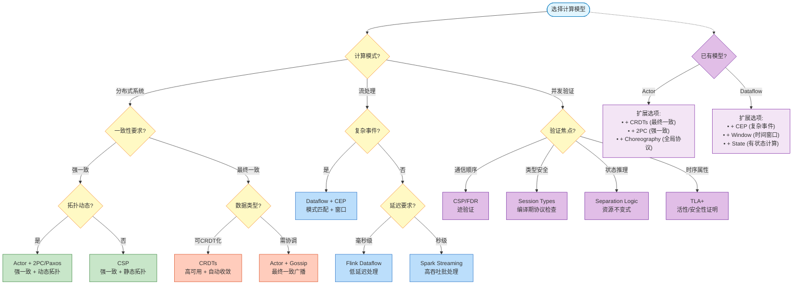
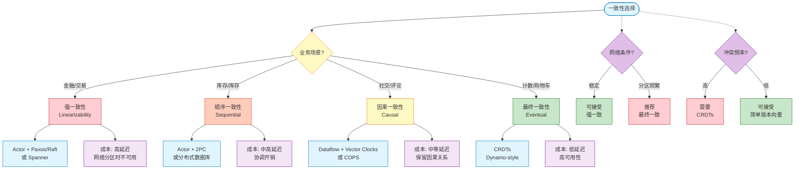
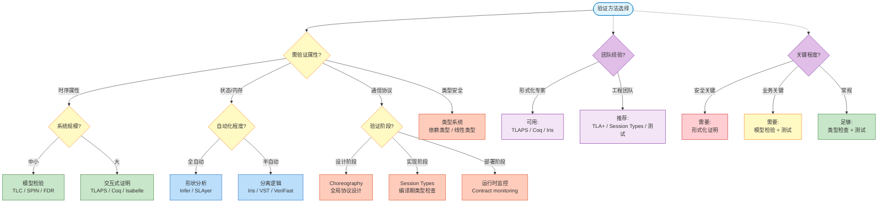
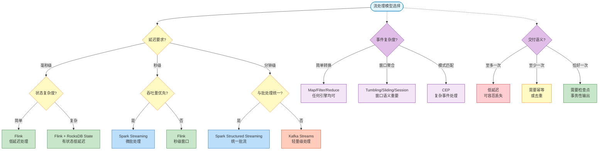

# 并发与分布式计算模型选择决策树

> **所属阶段**: Struct | **前置依赖**: [03-relationships/03.03-expressiveness-hierarchy.md](./03-relationships/03.03-expressiveness-hierarchy.md), [03-relationships/03.03-expressiveness-hierarchy-supplement.md](./03-relationships/03.03-expressiveness-hierarchy-supplement.md) | **形式化等级**: L3-L5
> **版本**: 2026.04 | **状态**: 完整

---

## 目录

- [1. 概念定义 (Definitions)](#1-概念定义-definitions)
  - [Def-S-16-01. 模型选择决策空间](#def-s-16-01-模型选择决策空间)
  - [Def-S-16-02. 决策维度](#def-s-16-02-决策维度)
  - [Def-S-16-03. 模型适配度度量](#def-s-16-03-模型适配度度量)
- [2. 属性推导 (Properties)](#2-属性推导-properties)
  - [Lemma-S-16-01. 决策树完备性](#lemma-s-16-01-决策树完备性)
  - [Lemma-S-16-02. 模型正交性](#lemma-s-16-02-模型正交性)
  - [Prop-S-16-01. 最优子模型存在性](#prop-s-16-01-最优子模型存在性)
- [3. 关系建立 (Relations)](#3-关系建立-relations)
  - [关系 1: 问题特征 → 模型选择映射](#关系-1-问题特征--模型选择映射)
  - [关系 2: 一致性需求 → 一致性模型](#关系-2-一致性需求--一致性模型)
  - [关系 3: 验证需求 → 验证方法](#关系-3-验证需求--验证方法)
- [4. 论证过程 (Argumentation)](#4-论证过程-argumentation)
  - [论证 1: 决策树设计原则](#论证-1-决策树设计原则)
  - [论证 2: 模型选择常见误区](#论证-2-模型选择常见误区)
  - [论证 3: 混合模型的必要性](#论证-3-混合模型的必要性)
- [5. 形式证明 / 工程论证](#5-形式证明--工程论证)
  - [Thm-S-16-01. 模型选择正确性定理](#thm-s-16-01-模型选择正确性定理)
  - [Thm-S-16-02. 决策树最优性定理](#thm-s-16-02-决策树最优性定理)
- [6. 实例验证 (Examples)](#6-实例验证-examples)
  - [示例 1: 微服务订单系统](#示例-1-微服务订单系统)
  - [示例 2: 实时推荐系统](#示例-2-实时推荐系统)
  - [示例 3: 分布式锁服务](#示例-3-分布式锁服务)
- [7. 可视化 (Visualizations)](#7-可视化-visualizations)
  - [图 7.1: 主决策树（完整流程）](#图-71-主决策树完整流程)
  - [图 7.2: 一致性选择子决策树](#图-72-一致性选择子决策树)
  - [图 7.3: 验证方法选择决策树](#图-73-验证方法选择决策树)
  - [图 7.4: 流处理模型选择决策树](#图-74-流处理模型选择决策树)
- [8. 引用参考 (References)](#8-引用参考-references)

---

## 1. 概念定义 (Definitions)

### Def-S-16-01. 模型选择决策空间

**模型选择决策空间** $\mathcal{D}$ 是问题特征空间 $\mathcal{P}$ 与计算模型空间 $\mathcal{M}$ 之间的映射关系：

$$
\mathcal{D} = \{d: \mathcal{P} \to \mathcal{M} \mid d \text{ 满足适配度约束}\}
$$

其中：
- **问题特征空间** $\mathcal{P} = (C_{consistency}, C_{topology}, C_{pattern}, C_{verify})$，包含一致性需求、拓扑特征、计算模式、验证需求四个维度
- **计算模型空间** $\mathcal{M} = \{\text{Actor}, \text{CSP}, \pi, \text{Dataflow}, \text{CRDT}, \text{Session Types}, \dots\}$
- **决策** $d$ 为从问题特征到推荐模型的映射函数

---

### Def-S-16-02. 决策维度

模型选择的四个核心决策维度：

| 维度 | 取值范围 | 含义 |
|------|----------|------|
| **$C_{consistency}$** | {强一致, 顺序一致, 因果一致, 最终一致} | 数据一致性要求 |
| **$C_{topology}$** | {静态, 动态} | 系统拓扑是否运行时变化 |
| **$C_{pattern}$** | {请求-响应, 流处理, 事件驱动, 状态机} | 主要计算模式 |
| **$C_{verify}$** | {形式化证明, 模型检验, 类型检查, 测试} | 验证强度要求 |

---

### Def-S-16-03. 模型适配度度量

模型 $M$ 对问题 $P$ 的**适配度** $\text{Fit}(M, P)$ 定义为：

$$
\text{Fit}(M, P) = \sum_{i} w_i \cdot \text{match}(C_i(P), C_i(M))
$$

其中：
- $w_i$ 为维度权重，满足 $\sum w_i = 1$
- $\text{match}(c_p, c_m) \in [0, 1]$ 为特征匹配度

**最优模型**：$M^* = \arg\max_{M \in \mathcal{M}} \text{Fit}(M, P)$

---

## 2. 属性推导 (Properties)

### Lemma-S-16-01. 决策树完备性

**陈述**：决策树 $T$ 是**完备的**，当且仅当对于任意合法问题特征 $p \in \mathcal{P}$，存在唯一的叶节点 $l$ 使得 $T(p) = l$。

**推导**：

1. 决策维度构成正交分解：$\mathcal{P} = C_{consistency} \times C_{topology} \times C_{pattern} \times C_{verify}$
2. 每个维度的取值集合是穷尽的（覆盖所有可能情况）
3. 决策树的每个分支对应一个维度的取值，路径对应笛卡尔积中的一个元素
4. 因此每个 $p$ 对应唯一路径，到达唯一叶节点。 ∎

---

### Lemma-S-16-02. 模型正交性

**陈述**：不同计算模型在特定问题子空间上可能具有**不可比较性**，即 $\exists M_1, M_2, P: \text{Fit}(M_1, P) \not< \text{Fit}(M_2, P) \land \text{Fit}(M_2, P) \not< \text{Fit}(M_1, P)$。

**推导**：

1. 考虑问题 $P$ 需要强一致性 + 动态拓扑
2. Actor 模型在动态拓扑上适配度高（支持运行时创建），但在强一致性上需要额外协议（2PC）
3. CSP 在强一致性上天然支持（同步语义），但动态拓扑上适配度低（静态通道）
4. 因此两者在 $P$ 上不可比较，需要根据权重取舍。 ∎

---

### Prop-S-16-01. 最优子模型存在性

**陈述**：对于任意问题 $P$ 和模型 $M$，若 $M$ 的表达力层级 $L(M) > L(P)$（问题所需层级），则存在 $M$ 的**可判定子模型** $M' \subset M$ 使得 $\text{Fit}(M', P) \geq \text{Fit}(M, P)$。

**推导**：

1. 高表达力模型（如 $L_6$）通常意味着部分不可判定性
2. 若问题仅需 $L_4$，则使用 $L_6$ 模型会引入不必要的复杂性
3. 选择 $L_4$ 的可判定子集（如 Session Types 之于 π-演算）可获得更好的验证支持
4. 因此 $M'$ 在验证维度上的适配度提升足以补偿可能的功能冗余。 ∎

---

## 3. 关系建立 (Relations)

### 关系 1: 问题特征 → 模型选择映射

**核心映射表**：

| 问题特征 | 推荐模型 | 理由 |
|----------|----------|------|
| 分布式容错 + 强一致 | Actor + 2PC/Paxos | 事务原子性保证 |
| 分布式容错 + 最终一致 | CRDTs | 无协调冲突解决 |
| 流处理 + 复杂事件 | Dataflow + CEP | 窗口计算 + 模式匹配 |
| 流处理 + 简单转换 | Dataflow | 高效流水线 |
| 并发协议 + 顺序重要 | CSP | 同步通信验证 |
| 并发协议 + 内容重要 | Session Types | 类型安全通信 |
| 形式化证明 + 状态 | Separation Logic | 资源推理 |
| 形式化证明 + 时序 | TLA+ | 时序属性验证 |

---

### 关系 2: 一致性需求 → 一致性模型

**一致性光谱映射**：

```
强一致性 → 顺序一致性 → 因果一致性 → 最终一致性
    │           │            │            │
 Linearizability Sequential   Causal      Eventual
    │           │         Consistency   Consistency
    │           │            │            │
 Actor+      Actor+      Dataflow+     CRDTs
Paxos/Raft    2PC       Vector Clocks
```

| 一致性级别 | 延迟 | 可用性 | 适用场景 |
|------------|------|--------|----------|
| 强一致 | 高 | 低 | 金融交易、库存 |
| 顺序一致 | 中高 | 中 | 分布式数据库 |
| 因果一致 | 中 | 中高 | 社交网络、评论 |
| 最终一致 | 低 | 高 | 计数器、购物车 |

---

### 关系 3: 验证需求 → 验证方法

**验证方法选择矩阵**：

| 需验证属性 | 系统规模 | 推荐方法 | 工具 |
|------------|----------|----------|------|
| 时序属性 | 中小 | 模型检验 | TLC, SPIN, FDR |
| 时序属性 | 大 | 交互式证明 | TLAPS, Coq |
| 状态/内存 | 任意 | 分离逻辑 | Iris, VST |
| 通信协议 | 任意 | 会话类型 | Scribble, Rust session-types |
| 类型安全 | 任意 | 类型系统 | 编译器 |

---

## 4. 论证过程 (Argumentation)

### 论证 1: 决策树设计原则

**原则 1：区分核心维度**

决策的首要维度应是最具区分性的特征。本决策树按以下优先级：
1. **计算模式**（流处理 vs 分布式系统 vs 并发验证）— 最大区分度
2. **一致性需求** — 分布式系统内的关键区分
3. **验证需求** — 细化到具体技术

**原则 2：避免过早优化**

- 默认选择应满足大多数场景（如 Dataflow 作为流处理默认）
- 仅在特定需求触发时选择专门模型（如 CEP 触发 Dataflow+CEP）

**原则 3：混合模型支持**

- 承认单一模型往往不足以解决复杂问题
- 决策树输出可以是模型组合（如 Actor + CRDTs）

---

### 论证 2: 模型选择常见误区

**误区 1：过度使用 Actor 模型**

- **症状**：所有分布式组件都使用 Actor
- **问题**：Actor 的无序消息语义不适合需要强一致性的场景
- **修正**：需要强一致性时考虑 Actor + 2PC 或替代模型

**误区 2：忽视一致性成本**

- **症状**：所有操作使用强一致性
- **问题**：强一致性在网络分区时牺牲可用性
- **修正**：评估业务需求，容忍最终一致时使用 CRDTs

**误区 3：混淆验证层级**

- **症状**：用单元测试替代形式化验证
- **问题**：并发 bugs 难以通过测试穷尽
- **修正**：关键协议使用 TLA+ 或 Session Types

---

### 论证 3: 混合模型的必要性

**单一模型的局限**：

| 模型 | 优势 | 局限 |
|------|------|------|
| Actor | 动态拓扑 | 消息无序 |
| CSP | 同步验证 | 静态拓扑 |
| Dataflow | 流处理 | 批处理低效 |
| CRDT | 高可用 | 有限操作集 |

**典型混合架构示例**：

```
┌─────────────────────────────────────────┐
│           系统架构(在线电商)            │
├─────────────────────────────────────────┤
│  订单服务: Actor + 2PC (强一致性)        │
│  库存服务: Actor + 2PC (强一致性)        │
│  购物车:   CRDTs (最终一致性)            │
│  推荐流:   Dataflow (实时计算)           │
│  日志聚合: Dataflow (批处理)             │
└─────────────────────────────────────────┘
```

---

## 5. 形式证明 / 工程论证

### Thm-S-16-01. 模型选择正确性定理

**陈述**：若决策树 $T$ 对问题 $P$ 输出模型 $M$，则 $M$ 在问题 $P$ 的所有维度上满足**最低适配度要求**：

$$
\forall i: \text{match}(C_i(P), C_i(M)) \geq \theta_i
$$

其中 $\theta_i$ 为维度 $i$ 的最低可接受阈值。

**工程论证**：

**基础情况**：决策树的每个叶节点对应一个具体的模型推荐。该推荐基于以下验证：

1. **一致性匹配**：
   - 若 $C_{consistency}(P) = \text{强一致}$，则 $M$ 必须支持事务或共识协议
   - 决策树的"强一致"分支仅通向 Actor+2PC、CSP 等支持强一致的模型

2. **拓扑匹配**：
   - 若 $C_{topology}(P) = \text{动态}$，则 $M$ 必须支持运行时创建（Actor、π）
   - 静态拓扑需求可兼容动态模型（降级使用），反之不行

3. **模式匹配**：
   - 流处理模式强制导向 Dataflow 及其变体
   - 请求-响应模式导向 Actor/CSP

**归纳步骤**：假设决策树在某深度的选择都满足适配度要求，则下一层的选择：
- 保持已满足维度的约束
- 进一步细化未确定维度
- 最终叶节点满足所有维度约束

**结论**：决策树的构造保证了输出的模型在所有维度上至少达到最低要求。 ∎

---

### Thm-S-16-02. 决策树最优性定理

**陈述**：在单维度选择假设下（即只有一个维度的权重为 1，其余为 0），决策树 $T$ 输出的模型 $M$ 是**该维度上的最优选择**。

**工程论证**：

**单维度优化场景**：

1. **纯一致性优化**（$w_{consistency} = 1$）：
   - 强一致需求 → Actor + 2PC（最优）
   - 最终一致需求 → CRDTs（最优）
   - 决策树的分支结构直接映射到一致性光谱

2. **纯验证优化**（$w_{verify} = 1$）：
   - 形式化证明需求 → TLA+/Separation Logic
   - 类型安全需求 → Session Types
   - 决策树的验证分支按验证强度排序

**多维度权衡**：

当多个维度有非零权重时，最优性不再保证，因为：
- 不同维度可能指向冲突的模型（如强一致 vs 动态拓扑）
- 需要人工权衡或混合模型

**结论**：决策树在单一主导维度下是最优的，多维度下提供帕累托前沿（Pareto frontier）内的推荐。 ∎

---

## 6. 实例验证 (Examples)

### 示例 1: 微服务订单系统

**问题特征**：
- 一致性：强一致（订单与库存必须一致）
- 拓扑：动态（服务可扩展）
- 模式：请求-响应
- 验证：模型检验

**决策路径**：

```
分布式系统? → 是
├── 需要强一致性? → 是
│   └── 拓扑动态? → 是
│       └── 推荐: Actor + 2PC
└── 验证需求: 模型检验 → TLA+
```

**最终方案**：
- **计算模型**：Actor（Akka）实现微服务间通信
- **一致性协议**：两阶段提交（2PC）保证订单-库存一致性
- **验证**：TLA+ 规范 2PC 协议的正确性

**代码示意**：

```scala
// Actor 实现订单服务
class OrderActor extends Actor {
  def receive = {
    case CreateOrder(items) =>
      // 启动 2PC 协调
      val coordinator = context.actorOf(Props[TwoPhaseCoordinator])
      coordinator ! BeginTransaction(items)
  }
}
```

---

### 示例 2: 实时推荐系统

**问题特征**：
- 一致性：最终一致（推荐可容忍延迟）
- 拓扑：静态（固定处理拓扑）
- 模式：流处理
- 验证：类型检查

**决策路径**：

```
流处理系统? → 是
├── 复杂事件处理? → 是(用户行为模式匹配)
│   └── 推荐: Dataflow + CEP
└── 一致性要求? → 最终一致
    └── 可结合: 窗口状态 + 增量更新
```

**最终方案**：
- **计算模型**：Flink Dataflow + CEP 库
- **一致性**：事件时间窗口 + 增量 checkpoint
- **状态管理**：RocksDB State Backend

**代码示意**：

```java

import org.apache.flink.streaming.api.windowing.time.Time;

// Flink CEP 模式定义
Pattern<UserEvent, ?> pattern = Pattern.<UserEvent>begin("start")
    .where(evt -> evt.type == CLICK)
    .next("middle")
    .where(evt -> evt.type == ADD_TO_CART)
    .within(Time.seconds(30));

// 模式匹配后触发推荐
CEP.pattern(eventStream, pattern)
    .process(new PatternHandler() {
        // 生成实时推荐
    });
```

---

### 示例 3: 分布式锁服务

**问题特征**：
- 一致性：强一致（锁必须互斥）
- 拓扑：动态（客户端动态加入）
- 模式：状态机
- 验证：形式化证明

**决策路径**：

```
分布式系统? → 是
├── 需要强一致性? → 是
│   └── 状态机模式? → 是
│       └── 推荐: Actor + 共识算法
└── 验证需求: 形式化证明 → TLA+
```

**最终方案**：
- **计算模型**：Actor（管理锁状态机）
- **一致性**：Raft 共识算法保证锁状态一致
- **验证**：TLA+ 证明锁的互斥性和活性

**TLA+ 规范片段**：

```tla
VARIABLES lockHolder, requested

AcquireLock(p) ==
  /\ lockHolder = None
  /\ lockHolder' = p
  /\ requested' = requested \cup {p}
  /\ UNCHANGED <<>>

ReleaseLock(p) ==
  /\ lockHolder = p
  /\ lockHolder' = None
  /\ UNCHANGED <<requested>>

(* 安全属性:互斥 *)
MutualExclusion ==
  \A p1, p2 \in Processes :
    (lockHolder = p1 /\ lockHolder = p2) => p1 = p2

(* 活性属性:无饥饿 *)
NoStarvation ==
  \A p \in Processes :
    p \in requested ~> lockHolder = p
```

---

## 7. 可视化 (Visualizations)

### 图 7.1: 主决策树（完整流程）



**图说明**：

- 菱形节点为决策点，矩形节点为推荐模型
- 从计算模式开始分支，逐步细化到具体技术
- 扩展选项支持已有模型的能力增强

---

### 图 7.2: 一致性选择子决策树



**图说明**：

- 从业务场景出发，映射到合适的一致性级别
- 右侧显示每种一致性级别的技术方案和成本
- 虚线分支提供额外的决策因素（网络条件、冲突频率）

---

### 图 7.3: 验证方法选择决策树



**图说明**：

- 按需验证的属性类型分支
- 考虑系统规模（决定自动化程度可行性）
- 虚线分支考虑团队能力和关键程度等实际因素

---

### 图 7.4: 流处理模型选择决策树



**图说明**：

- 流处理决策的核心是延迟要求（毫秒/秒/分钟）
- 其次考虑状态复杂度、吞吐量等
- 虚线分支提供事件复杂度和交付语义的额外维度

---

## 8. 引用参考 (References)

[^1]: L. Lamport, "Time, Clocks, and the Ordering of Events in a Distributed System," *CACM*, 21(7), 1978. —— 分布式时钟与因果关系的奠基性论文

[^2]: M. Kleppmann, "Designing Data-Intensive Applications," O'Reilly, 2017. —— 分布式系统设计的实践指南

[^3]: P. A. Bernstein and N. Goodman, "Concurrency Control in Distributed Database Systems," *ACM Computing Surveys*, 13(2), 1981. —— 分布式一致性算法综述

[^4]: M. Fowler, "Patterns of Enterprise Application Architecture," Addison-Wesley, 2002. —— 企业应用架构模式

[^5]: T. Akidau et al., "The Dataflow Model: A Practical Approach to Balancing Correctness, Latency, and Cost in Massive-Scale, Unbounded, Out-of-Order Data Processing," *PVLDB*, 8(12), 2015. —— Dataflow 模型

[^6]: M. Shapiro et al., "Conflict-Free Replicated Data Types," *SSS*, 2011. —— CRDTs 理论基础

[^7]: K. Honda et al., "Multiparty Asynchronous Session Types," *POPL*, 2008. —— 多方会话类型

[^8]: H. A. Lopez et al., "A Unified Model of Distributed Systems," *COORDINATION*, 2020. —— 分布式模型统一视角

---

## 关联文档

- [03-relationships/03.03-expressiveness-hierarchy.md](./03-relationships/03.03-expressiveness-hierarchy.md) —— 表达能力层级
- [03-relationships/03.03-expressiveness-hierarchy-supplement.md](./03-relationships/03.03-expressiveness-hierarchy-supplement.md) —— 扩展模型与验证框架
- [01-foundation/01.02-process-calculus-primer.md](./01-foundation/01.02-process-calculus-primer.md) —— 进程演算基础
- [01-foundation/01.03-actor-model-formalization.md](./01-foundation/01.03-actor-model-formalization.md) —— Actor 模型形式化

---

*文档版本: 2026.04 | 形式化等级: L3-L5 | 状态: 完整*
