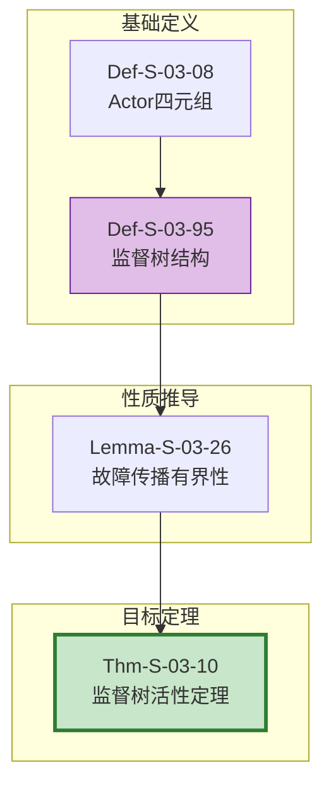
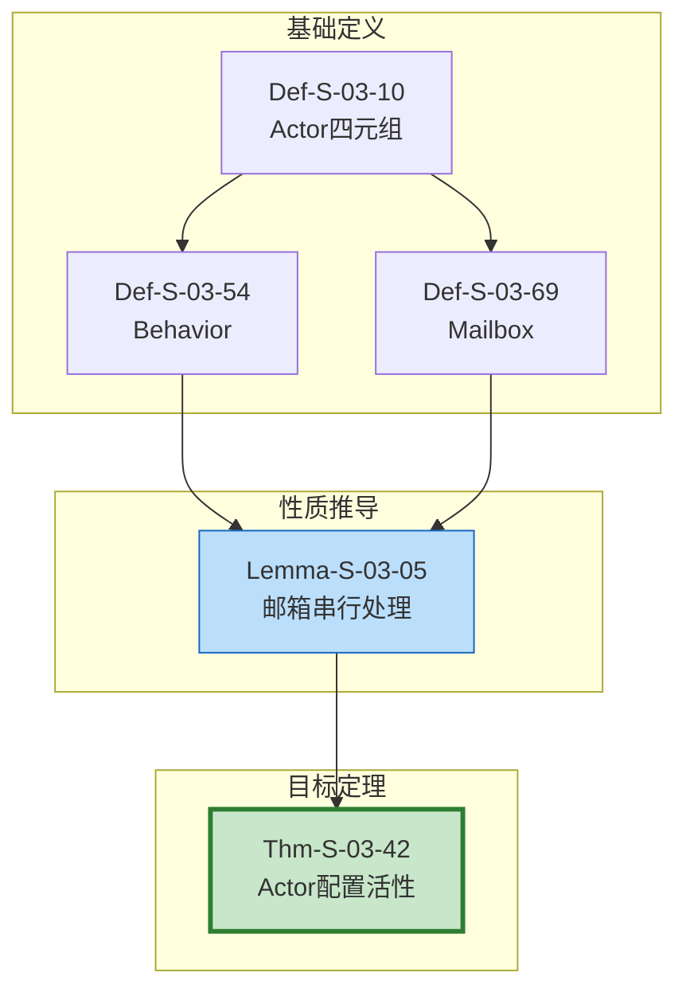
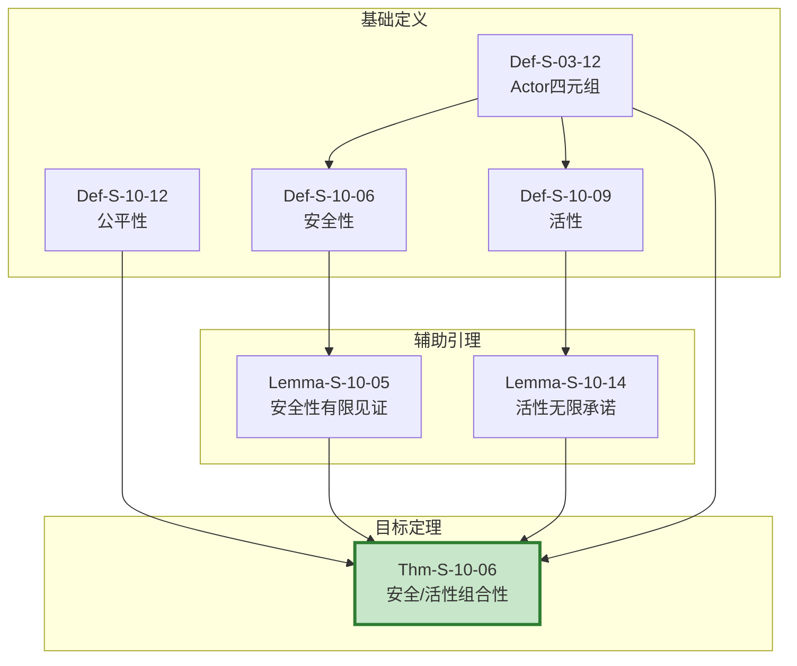
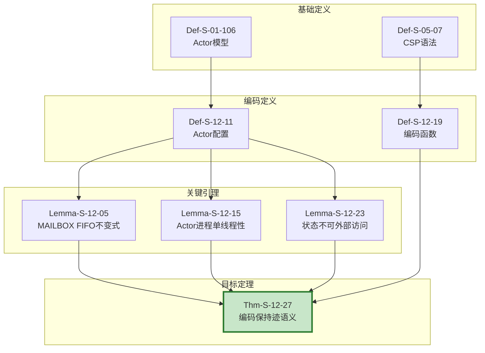
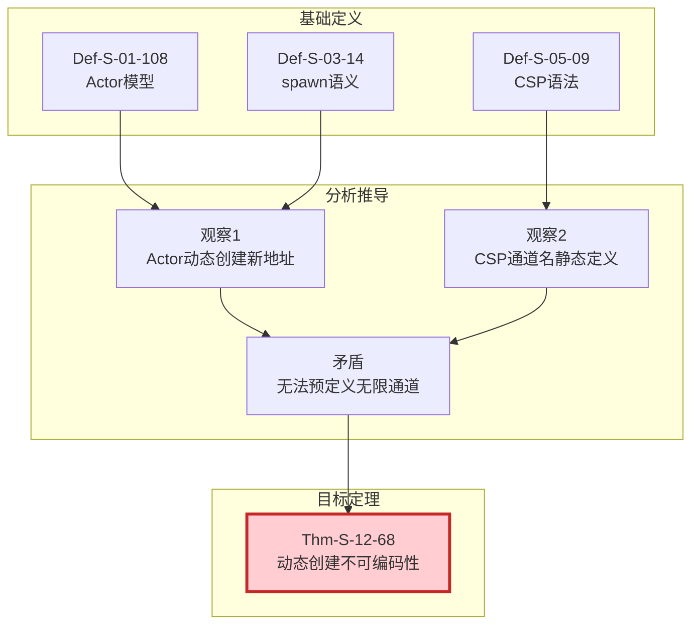
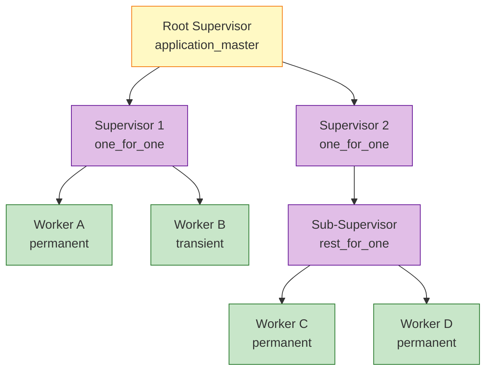
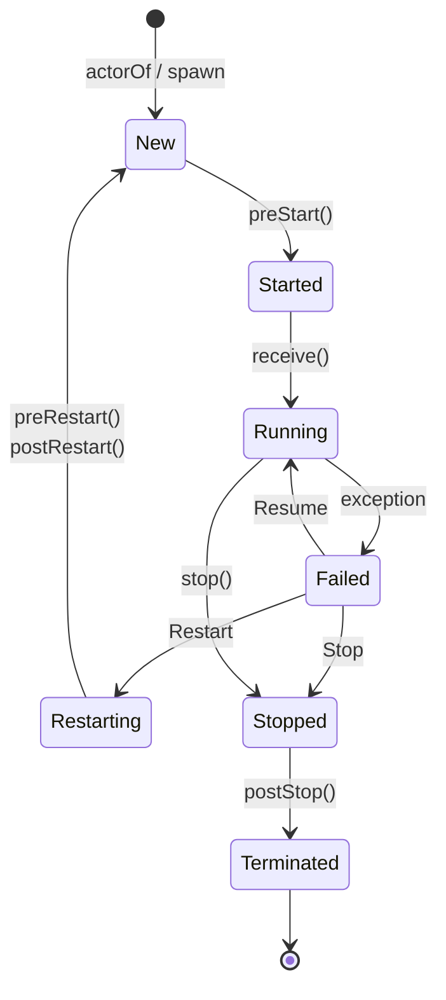
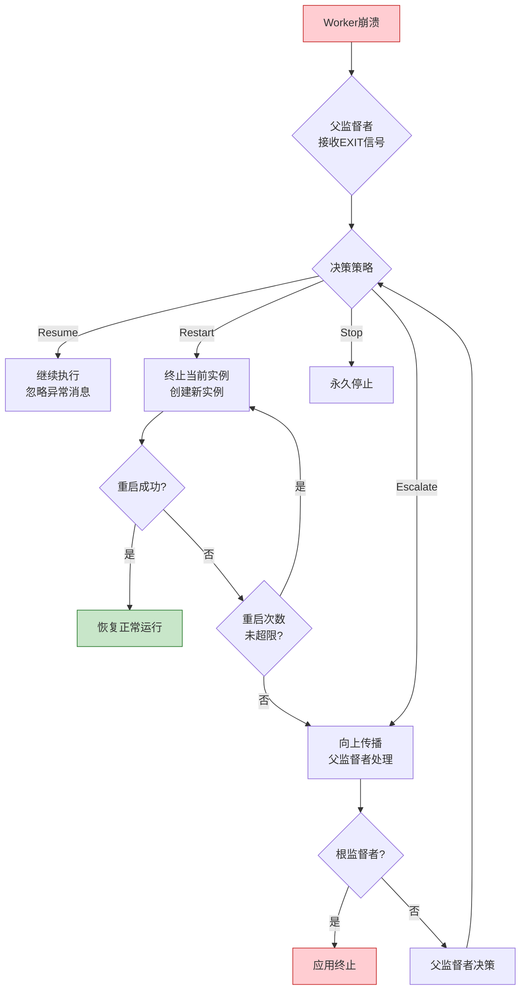
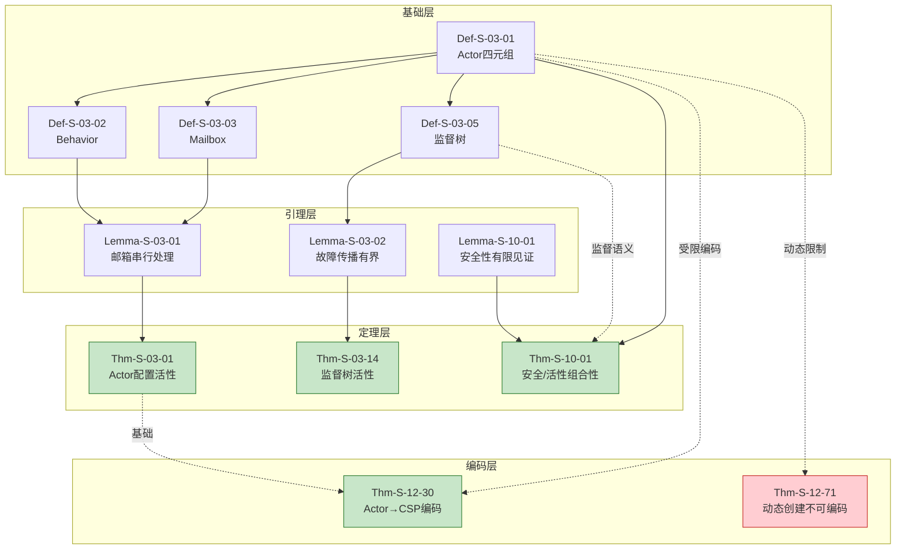

# Actor 模型定理完整推导链

> **所属阶段**: Struct/ | 前置依赖: [THEOREM-REGISTRY.md](../THEOREM-REGISTRY.md), [01.03-actor-model-formalization.md](./01-foundation/01.03-actor-model-formalization.md) | 形式化等级: L4-L5

本文档梳理 Actor 模型相关核心定理的完整证明链，涵盖从基础四元组定义到 Actor→CSP 编码的完整推导路径，以及监督树活性、安全/活性组合性等关键定理。

---

## 目录

- [Actor 模型定理完整推导链](#actor-模型定理完整推导链)
  - [目录](#目录)
  - [证明链概览](#证明链概览)
  - [Thm-Chain-Actor-01: 监督树活性定理 (Thm-S-03-06)](#thm-chain-actor-01-监督树活性定理-thm-s-03-02)
    - [依赖图](#依赖图)
    - [步骤说明](#步骤说明)
    - [证明概要](#证明概要)
  - [Thm-Chain-Actor-02: Actor 配置活性 (Thm-S-03-38)](#thm-chain-actor-02-actor-配置活性-thm-s-03-01)
    - [依赖图](#依赖图-1)
    - [步骤说明](#步骤说明-1)
    - [证明概要](#证明概要-1)
  - [Thm-Chain-Actor-03: Actor 安全/活性组合性 (Thm-S-10-02)](#thm-chain-actor-03-actor-安全活性组合性-thm-s-10-01)
    - [依赖图](#依赖图-2)
    - [步骤说明](#步骤说明-2)
    - [证明概要](#证明概要-2)
  - [Thm-Chain-Actor-04: Actor→CSP 编码保持迹语义 (Thm-S-12-24)](#thm-chain-actor-04-actorcsp-编码保持迹语义-thm-s-12-01)
    - [依赖图](#依赖图-3)
    - [步骤说明](#步骤说明-3)
    - [证明概要](#证明概要-3)
  - [Thm-Chain-Actor-05: 动态 Actor 创建不可编码性 (Thm-S-12-65)](#thm-chain-actor-05-动态-actor-创建不可编码性-thm-s-12-02)
    - [依赖图](#依赖图-4)
    - [步骤说明](#步骤说明-4)
    - [证明概要](#证明概要-4)
  - [1. 概念定义 (Definitions)](#1-概念定义-definitions)
    - [Def-S-03-07: Actor (经典 Actor 四元组)](#def-s-03-01-actor-经典-actor-四元组)
    - [Def-S-03-53: Behavior (行为)](#def-s-03-02-behavior-行为)
    - [Def-S-03-68: Mailbox (邮箱)](#def-s-03-03-mailbox-邮箱)
    - [Def-S-03-82: ActorRef (Actor 不透明引用)](#def-s-03-04-actorref-actor-不透明引用)
    - [Def-S-03-93: Supervision Tree (监督树)](#def-s-03-05-supervision-tree-监督树)
  - [2. 属性推导 (Properties)](#2-属性推导-properties)
    - [Lemma-S-03-03: 邮箱串行处理引理](#lemma-s-03-01-邮箱串行处理引理)
    - [Lemma-S-03-25: 监督树故障传播有界性](#lemma-s-03-02-监督树故障传播有界性)
    - [Lemma-S-10-04: 安全性有限见证](#lemma-s-10-01-安全性有限见证)
  - [3. 关系建立 (Relations)](#3-关系建立-relations)
    - [关系 1: Actor 模型 ⊂ 异步 π-演算](#关系-1-actor-模型--异步-π-演算)
    - [关系 2: Actor 模型 ↔ CSP (受限编码)](#关系-2-actor-模型--csp-受限编码)
    - [关系 3: 监督树层级与故障恢复](#关系-3-监督树层级与故障恢复)
  - [4. 论证过程 (Argumentation)](#4-论证过程-argumentation)
    - [论证 1: 邮箱串行处理为何是 Actor 确定性的根基](#论证-1-邮箱串行处理为何是-actor-确定性的根基)
    - [论证 2: 动态创建不可编码性的本质原因](#论证-2-动态创建不可编码性的本质原因)
    - [论证 3: 安全/活性非对称性的深层逻辑](#论证-3-安全活性非对称性的深层逻辑)
  - [5. 形式证明 / 工程论证 (Proof / Engineering Argument)](#5-形式证明--工程论证-proof--engineering-argument)
    - [Thm-S-03-39: Actor 邮箱串行处理下的局部确定性](#thm-s-03-01-actor-邮箱串行处理下的局部确定性)
    - [Thm-S-03-07: 监督树活性定理](#thm-s-03-02-监督树活性定理)
    - [Thm-S-10-03: Actor 安全/活性组合性](#thm-s-10-01-actor-安全活性组合性)
  - [6. 实例验证 (Examples)](#6-实例验证-examples)
    - [示例 1: Akka Typed 计数器 Actor](#示例-1-akka-typed-计数器-actor)
    - [示例 2: Erlang OTP 监督树配置](#示例-2-erlang-otp-监督树配置)
    - [示例 3: Actor→CSP 编码验证](#示例-3-actorcsp-编码验证)
  - [7. 可视化 (Visualizations)](#7-可视化-visualizations)
    - [图 1: 监督树层次结构](#图-1-监督树层次结构)
    - [图 2: Actor 生命周期状态机](#图-2-actor-生命周期状态机)
    - [图 3: 故障恢复流程](#图-3-故障恢复流程)
    - [图 4: Actor 定理证明链总览](#图-4-actor-定理证明链总览)
  - [8. 引用参考 (References)](#8-引用参考-references)

---

## 证明链概览

Actor 模型定理体系围绕五个核心证明链展开，形成从基础定义到跨模型编码的完整推导网络：

| 证明链编号 | 目标定理 | 核心内容 | 依赖深度 |
|-----------|---------|---------|---------|
| Thm-Chain-Actor-01 | Thm-S-03-08 | 监督树活性定理 | 5 |
| Thm-Chain-Actor-02 | Thm-S-03-40 | Actor 配置活性 | 4 |
| Thm-Chain-Actor-03 | Thm-S-10-04 | Actor 安全/活性组合性 | 6 |
| Thm-Chain-Actor-04 | Thm-S-12-25 | Actor→CSP 编码保持迹语义 | 8 |
| Thm-Chain-Actor-05 | Thm-S-12-66 | 动态 Actor 创建不可编码性 | 4 |

**关键洞察**: 监督树结构（Def-S-03-94）是 Actor 容错能力的核心，而邮箱串行处理（Lemma-S-03-04）是局部确定性的根基。Actor 模型与 CSP 的关系体现了表达能力与可分析性之间的权衡。

---

## Thm-Chain-Actor-01: 监督树活性定理 (Thm-S-03-09)

### 依赖图



### 步骤说明

| 步骤 | 元素编号 | 名称 | 作用 |
|------|----------|------|------|
| 1 | Def-S-03-09 | Actor 四元组 | 定义 Actor 基本结构 (α, b, m, σ) |
| 2 | Def-S-03-96 | 监督树结构 | 定义监督策略 χ 和重启规格 σ = (I, P) |
| 3 | Lemma-S-03-27 | 故障传播有界性 | 证明故障传播深度上界为 h - d |
| 4 | Thm-S-03-11 | 监督树活性定理 | 证明瞬态故障下有限步内成功重启 |

### 证明概要

- **方法**: 结构归纳 + 活性逻辑 (◇ 算子)
- **关键引理**: 故障传播有界性 (Lemma-S-03-28) 保证信号不会无限向上传播
- **核心条件**:
  - 瞬态故障假设 (transient fault)
  - 重启强度未耗尽 (count(H, t, P) < I)
  - 树高有限 (h < ∞)
- **复杂度**: O(depth(w) × I)，其中 depth(w) 为故障 Actor 深度，I 为最大重启次数

---

## Thm-Chain-Actor-02: Actor 配置活性 (Thm-S-03-41)

### 依赖图



### 步骤说明

| 步骤 | 元素编号 | 名称 | 作用 |
|------|----------|------|------|
| 1 | Def-S-03-11 | Actor 四元组 | 定义 Actor 基本结构 |
| 2 | Def-S-03-55 | Behavior | 定义行为函数 B: M × Σ → (B' × Σ' × E*) |
| 3 | Def-S-03-70 | Mailbox | 定义邮箱语义和 FIFO 保证 |
| 4 | Lemma-S-03-06 | 邮箱串行处理 | 证明任意时刻至多一个线程处理消息 |
| 5 | Thm-S-03-43 | Actor 配置活性 | 证明状态转换序列唯一确定 |

### 证明概要

- **方法**: 数学归纳法 + 函数确定性
- **关键引理**: 邮箱串行处理引理保证单线程执行
- **核心洞察**:
  - 行为函数 B 作为数学函数产生唯一输出
  - 状态修改通过 Mailbox 隐式串行化
  - 无副作用反向修改本地状态
- **条件**: 消息序列给定、初始状态确定、无共享可变状态

---

## Thm-Chain-Actor-03: Actor 安全/活性组合性 (Thm-S-10-05)

### 依赖图



### 步骤说明

| 步骤 | 元素编号 | 名称 | 作用 |
|------|----------|------|------|
| 1 | Def-S-03-13 | Actor 四元组 | 提供状态隔离和通信异步性 |
| 2 | Def-S-10-01 | 安全性定义 | "坏事永远不会发生" |
| 3 | Def-S-10-02 | 活性定义 | "好事最终会发生" |
| 4 | Def-S-10-03 | 公平性 | Justice/Compassion 假设 |
| 5 | Lemma-S-10-06 | 安全性有限见证 | 安全性可有限前缀判定 |
| 6 | Lemma-S-10-02 | 活性无限承诺 | 活性需无限执行验证 |
| 7 | Thm-S-10-07 | 安全/活性组合性 | 本地安全可组合，全局活性需公平性 |

### 证明概要

- **方法**: 反证法 + 构造反例
- **核心结论**:
  - **本地安全性可组合**: 并行组合保持各组件本地安全性质
  - **全局活性非组合**: 证明全局活性通常需要公平性假设
- **关键反例**: 客户端-服务器场景，调度器无限延迟服务器执行
- **修复条件**: 引入弱公平性 WF(A₂) 保证持续使能的 Actor 最终执行

---

## Thm-Chain-Actor-04: Actor→CSP 编码保持迹语义 (Thm-S-12-26)

### 依赖图



### 步骤说明

| 步骤 | 元素编号 | 名称 | 作用 |
|------|----------|------|------|
| 1 | Def-S-01-107 | Actor 模型 | 定义经典 Actor 四元组 |
| 2 | Def-S-05-08 | CSP 语法 | 定义 CSP 核心语法子集 |
| 3 | Def-S-12-12 | Actor 配置 | 定义 γ ≜ ⟨A, M, Σ, addr⟩ |
| 4 | Def-S-12-20 | Actor→CSP 编码函数 | 定义 ·_{A→C} |
| 5 | Lemma-S-12-06 | MAILBOX FIFO 不变式 | 证明邮箱先进先出 |
| 6 | Lemma-S-12-16 | Actor 进程单线程性 | 证明状态串行访问 |
| 7 | Lemma-S-12-24 | 状态不可外部访问 | 证明状态封装性 |
| 8 | Thm-S-12-28 | 编码保持迹语义 | 综合证明编码正确性 |

### 证明概要

- **方法**: 编码构造 + 迹等价验证
- **关键限制**: 无动态地址传递（受限 Actor 系统）
- **编码核心**: Actor → CSP 进程，Mailbox → CSP 通道
- **语义保持**: traces(A_{A→C}) = traces(A)
- **证明步骤**:
  1. 构造编码函数 ·_{A→C}
  2. 证明单步模拟关系
  3. 由互模拟等价 ⟹ 迹等价

---

## Thm-Chain-Actor-05: 动态 Actor 创建不可编码性 (Thm-S-12-67)

### 依赖图



### 步骤说明

| 步骤 | 元素编号 | 名称 | 作用 |
|------|----------|------|------|
| 1 | Def-S-01-109 | Actor 模型 | 定义动态创建语义 |
| 2 | Def-S-03-15 | spawn 语义 | 创建具有新地址的 Actor |
| 3 | Def-S-05-10 | CSP 语法 | 通道名必须静态定义 |
| 4 | 分析 | 核心矛盾 | 动态无限 vs 静态有限 |
| 5 | Thm-S-12-69 | 不可编码性定理 | 证明完备编码不存在 |

### 证明概要

- **方法**: 反证法
- **形式化**: ∃A ∈ ActorSystem with dynamic creation: ∄·_{A→C}: traces(A_{A→C}) = traces(A)
- **矛盾核心**:
  1. Actor 动态创建新地址
  2. CSP 通道名必须静态定义
  3. 无法为无限可能的新地址预定义通道
  4. 因此编码必然丢失某些行为
- **工程影响**: 需要动态拓扑的场景应选择 Actor 模型，CSP 更适合静态拓扑的并发协议验证

---

## 1. 概念定义 (Definitions)

### Def-S-03-16: Actor (经典 Actor 四元组)

$$
\mathcal{A}_{\text{classic}} = (\alpha, b, m, \sigma)
$$

其中：

- $\alpha \in \text{Addr}$：Actor 的唯一地址（不可伪造的身份标识）
- $b: \text{Msg} \times \text{State} \to (\text{Behavior} \times \text{State} \times \text{Effect}^*)$：行为函数
- $m \in \text{Msg}^*$：消息队列（Mailbox）
- $\sigma \in \text{State}$：私有内部状态

**核心操作**: `send(α, v)` | `become(b')` | `spawn(b₀, σ₀)`

---

### Def-S-03-56: Behavior (行为)

Behavior 是 Actor 的**反应规则**：

$$
B : \mathcal{M} \times \Sigma \rightarrow (\mathcal{B}' \times \Sigma' \times \mathcal{E}^*)
$$

- $\mathcal{M}$：消息域
- $\Sigma$：状态域
- $\mathcal{B}'$：新的 Behavior（支持 `become` 语义）
- $\mathcal{E}^*$：副作用序列

---

### Def-S-03-71: Mailbox (邮箱)

Mailbox 是 Actor 的**输入缓冲队列**：

$$
\text{Mailbox}(\alpha) \triangleq \langle m_1, m_2, \ldots, m_n \rangle \in \mathbb{M}^*
$$

**操作语义**:

```
发送:  α ! v  将消息 ⟨v, t, self⟩ 原子追加到邮箱尾部
接收:  receive C end  从邮箱头部按模式匹配选择
```

---

### Def-S-03-04: ActorRef (Actor 不透明引用)

$$
\text{ActorRef} = \langle \text{path} : \text{ActorPath}, \text{refCell} : \text{AtomicReference}[\text{InternalActorRef}] \rangle
$$

ActorRef 对外仅暴露 `!`（tell）操作，隐藏底层实现细节。

---

### Def-S-03-97: Supervision Tree (监督树)

监督树是一个有根森林 $\mathcal{T} = (V, E, r)$：

- $V = \mathcal{S} \cup \mathcal{W}$：监督者（Supervisor）和工作者（Worker）
- $E \subseteq \mathcal{S} \times (\mathcal{S} \cup \mathcal{W})$：监督关系边
- $r \in \mathcal{S}$：根监督者

**监督策略**:

- **one_for_one**: 仅重启崩溃的子进程
- **one_for_all**: 终止并重启所有子进程
- **rest_for_one**: 重启崩溃子进程及其之后启动的子进程
- **simple_one_for_one**: 用于动态子进程

**重启规格**: $\sigma = (I, P)$，$I$ 为最大重启次数，$P$ 为时间窗口（秒）

---

## 2. 属性推导 (Properties)

### Lemma-S-03-07: 邮箱串行处理引理

**陈述**: 对于任意 Actor $\alpha$，在任意时刻 $t$，至多只有一个线程 $T$ 在执行 $\alpha$ 的消息处理逻辑。

**证明要点**:

1. Mailbox 维护 `status` 字段：{Idle, Scheduled, Running}
2. CAS 操作保证状态原子转换
3. 处理期间状态为 Running，新调度请求失败

**推断**: 执行层的 Mailbox 串行处理机制保证了数据层的 Actor 内部状态一致性，无需显式锁即可实现线程安全。

---

### Lemma-S-03-29: 监督树故障传播有界性

**陈述**: 设监督树 $\mathcal{T}$ 的高度为 $h$。对于任意深度为 $d$ 的叶子工作者 $w$，若 $w$ 崩溃，则故障信号最多向上传播 $h - d$ 层。

**形式化**:
$$
\text{depth}(w) = d \land \text{height}(\mathcal{T}) = h \Rightarrow \text{propagation\_depth} \leq h - d
$$

**证明要点**:

1. 监督树是无环层次图，每个非根节点有且仅有一个监督者父节点
2. 崩溃时生成 EXIT 信号，通过 `link` 发送给父监督者
3. 决策为 Resume/Restart/Stop 时故障就地处理
4. 仅 Escalate 或重启强度超限时向上传播

---

### Lemma-S-10-07: 安全性有限见证

**陈述**: 性质 $P$ 是安全性当且仅当存在有限前缀集合 $BadPref \subseteq \Sigma^*$ 使得：

$$
w \in P \iff pref(w) \cap BadPref = \emptyset
$$

**直观解释**: 安全性的违反可以被有限执行前缀见证——一旦这个前缀出现，无论后续如何演化，性质都不可能再被满足。

---

## 3. 关系建立 (Relations)

### 关系 1: Actor 模型 ⊂ 异步 π-演算

**论证**:

- **编码存在性**: Agha 与 Mason 证明了 Actor 模型可以编码为异步 π-calculus 的受限子集[^1]
  - `send(α, v)` 编码为 $\bar{\alpha}\langle v \rangle$
  - `receive` 编码为 $\alpha(x).P$
  - `spawn` 编码为 $(\nu c)(\bar{c}\langle P \rangle \mid !c(x).x)$

- **分离结果**: π-演算不原生提供 Mailbox 的 FIFO 顺序保证，也不提供监督树的容错语义

**结论**: $\text{Actor\ Model} \subset \text{Async-}\pi$

---

### 关系 2: Actor 模型 ↔ CSP (受限编码)

**双向关系**:

| 方向 | 条件 | 结果 |
|------|------|------|
| Actor → CSP | 无动态地址传递 | ✓ 可编码 (Thm-S-12-29) |
| Actor → CSP | 支持动态创建 | ✗ 不可编码 (Thm-S-12-70) |
| CSP → Actor | 任意静态 CSP | ✓ 可编码 |

**工程启示**: 需要动态拓扑的场景优先选择 Actor 模型；静态协议验证适合使用 CSP 工具

---

### 关系 3: 监督树层级与故障恢复

**层级设计权衡**:

| 深度 | 优点 | 缺点 | 适用场景 |
|------|------|------|---------|
| h ≤ 3 | 故障恢复快 | ChildSpec 复杂 | 小型系统 |
| h = 4-5 | 职责清晰 | 级联重启延迟 | 中型系统 |
| h > 5 | 精细隔离 | 故障传播路径长 | 大型分布式系统 |

**OTP 最佳实践**: 深度控制在 3 层以内，$I = 3 \sim 5$（$P = 60$ 秒）[^3]

---

## 4. 论证过程 (Argumentation)

### 论证 1: 邮箱串行处理为何是 Actor 确定性的根基

Actor 模型将状态修改的并发控制从显式锁转移到了 Mailbox 的隐式串行化。

**推导链**:

```
Mailbox串行处理 (Lemma-S-03-08)
    ↓
单线程执行保证
    ↓
状态修改原子性
    ↓
行为切换原子性 (become(b') 对下条消息生效)
    ↓
Actor局部确定性 (Thm-S-03-44)
```

---

### 论证 2: 动态创建不可编码性的本质原因

**核心矛盾**:

```
Actor模型                      CSP模型
─────────────────────────────────────────────────
动态创建: spawn随时产生新地址   静态定义: 通道名编译期确定
无限可能: 地址集合不可枚举      有限预定义: 通道名有限集
拓扑演化: 运行时结构变化        拓扑固定: 结构编译期确定
```

**结论**: 表达能力与可分析性的权衡——Actor 的动态性赋予其灵活性，但牺牲了静态分析的能力；CSP 的静态性支持严格验证，但限制了动态场景适用性。

---

### 论证 3: 安全/活性非对称性的深层逻辑

**安全性的局部性**:

- 安全性的违反有有限见证
- Actor 状态隔离性保证本地错误不被外部影响
- 因此本地安全性质在并行组合下保持

**活性的全局性**:

- 活性的满足需要无限执行序列
- 调度器可以无限延迟某个 Actor 的执行
- 因此需要全局公平性假设才能保证活性

**形式化对比**:

| 维度 | 安全性 | 活性 |
|------|--------|------|
| 判定时机 | 有限时间 | 需无限观察 |
| 组合性 | ✓ 可组合 | ✗ 需公平性 |
| 验证方法 | 不变式/归纳 | 良基关系/Büchi |

---

## 5. 形式证明 / 工程论证 (Proof / Engineering Argument)

### Thm-S-03-45: Actor 邮箱串行处理下的局部确定性

**陈述**: 对于任意 Actor $\alpha$，若其初始状态为 $\sigma_0$，Mailbox 中的消息序列为 $\langle m_1, m_2, \ldots, m_n \rangle$，且所有消息均由单线程串行处理，则 Actor 的状态转换序列被唯一确定。

**形式化**:
$$
\forall \alpha, \forall \vec{m} = \langle m_i \rangle_{i=1}^n, \forall t. \; \text{single\_threaded}(\alpha, t) \Rightarrow \exists! \langle \sigma_i \rangle_{i=0}^n. \; \sigma_i = b_i(m_i, \sigma_{i-1})
$$

**证明** (数学归纳法):

**基例 (i = 1)**:

- 由 Lemma-S-03-09，Mailbox 处理单线程
- Behavior 作为函数产生唯一输出 $(b_2, \sigma_1, \vec{e}_1) = b_1(m_1, \sigma_0)$

**归纳步骤**:

- 假设对于 $k-1$ 状态唯一确定
- 处理第 $k$ 条消息时，当前配置 $(b_k, \sigma_{k-1})$ 唯一
- 函数语义保证 $\sigma_k$ 和 $b_{k+1}$ 唯一确定

**结论**: 由数学归纳法，整个状态转换序列唯一确定。∎

---

### Thm-S-03-12: 监督树活性定理

**陈述**: 设 $\mathcal{T}$ 是良构监督树，高度 $h < \infty$。对于深度为 $d$ 的叶子工作者 $w$，若 $w$ 因瞬态故障崩溃，且故障在有限时间 $t_{\text{fixed}}$ 内被修复，则 $w$ 将在有限步内被成功重启（前提是重启强度未耗尽）。

**形式化**:
$$
\begin{aligned}
& w \in \text{Leaves}(\mathcal{T}) \land \text{depth}(w) = d \land \text{height}(\mathcal{T}) = h < \infty \\
& \land \text{transient}(\text{cause}(w)) \land \exists t_{\text{fixed}} < \infty. \text{fixed}(\text{cause}(w), t_{\text{fixed}}) \\
& \land \text{count}(\mathcal{H}, t, P) < I \\
& \Rightarrow \Diamond \text{restarted}(w)
\end{aligned}
$$

**证明要点**:

1. $w$ 崩溃时，VM 通过 `link` 向父监督者发送故障信号
2. 父监督者根据策略 $\chi$ 和重启历史 $\mathcal{H}$ 决策
3. 若计数未满，执行 `Restart`
4. 瞬态故障在 $t_{\text{fixed}}$ 后修复，某次重启必然成功
5. 总步骤有界：不超过 $\text{depth}(w) \times I$ ∎

---

### Thm-S-10-08: Actor 安全/活性组合性

**陈述**: 在 Actor 系统中，本地安全性性质是组合的；但全局活性性质不是组合的——证明全局活性通常需要公平性假设。

**证明**:

**第一部分：本地安全性组合性**

设 $S_{local}(\alpha_1)$ 是只涉及 $\mathcal{A}_1$ 内部状态的安全性：

1. Actor 具有状态隔离性：$state_{\alpha_1}$ 不能被 $\mathcal{A}_2$ 直接访问
2. 假设 $\mathcal{A} \not\vDash S_{local}(\alpha_1)$
3. 由安全性定义，存在有限前缀 $\pi$ 见证违反
4. 构造投影执行 $\pi|_{\mathcal{A}_1}$
5. 消息接收在 Actor 语义中是确定性的，相同违反在孤立 $\mathcal{A}_1$ 中出现
6. 因此 $\mathcal{A}_1 \not\vDash S_{local}(\alpha_1)$，与前提矛盾

**第二部分：全局活性非组合性** (反例)

- $\mathcal{A}_1$: 客户端 Actor，反复发送请求
- $\mathcal{A}_2$: 服务器 Actor，处理请求并响应

**违反场景**:

1. 调度器始终选择 $\mathcal{A}_1$ 执行，从不调度 $\mathcal{A}_2$
2. 请求堆积在 $\mathcal{A}_2$ 的 mailbox 中但永不处理
3. 全局活性 $\Diamond\Box(\text{请求被处理})$ 被违反

**修复**: 引入弱公平性 $WF(\mathcal{A}_2)$，保证持续使能的 Actor 最终执行 ∎

---

## 6. 实例验证 (Examples)

### 示例 1: Akka Typed 计数器 Actor

```scala
sealed trait Command
object Command {
  case object Increment extends Command
  case class GetCount(replyTo: ActorRef[Int]) extends Command
}

val counter: Behavior[Command] = Behaviors.setup { ctx =>
  var count = 0                    // 私有状态 σ
  Behaviors.receiveMessage {       // Behavior b
    case Command.Increment =>
      count += 1                   // 状态转换: σ → σ'
      Behaviors.same               // become(相同行为)
    case Command.GetCount(replyTo) =>
      replyTo ! count              // 副作用: send(ActorRef, Int)
      Behaviors.same
  }
}
```

**定理验证**: 由 Thm-S-03-46，给定消息序列 $\langle \text{Increment}, \text{Increment}, \text{GetCount} \rangle$，最终状态必然为 2。

---

### 示例 2: Erlang OTP 监督树配置

```erlang
-module(web_server_sup).
-behaviour(supervisor).

-export([start_link/0, init/1]).

init([]) ->
    SupFlags = #{
        strategy => one_for_one,      % 独立组件，故障隔离
        intensity => 5,               % 5次重启
        period => 60                  % 在60秒内
    },
    Children = [
        #{id => db_pool,
          start => {db_pool, start_link, []},
          restart => permanent,
          shutdown => 5000,
          type => worker},
        #{id => http_listener,
          start => {http_listener, start_link, []},
          restart => permanent,
          shutdown => 5000,
          type => worker}
    ],
    {ok, {SupFlags, Children}}.
```

**定理验证**: `one_for_one` 对应 Def-S-03-98 的策略 $\chi$；`intensity => 5, period => 60` 对应重启规格 $\sigma = (5, 60)$。由 Thm-S-03-13，瞬态故障将在有限步内成功恢复。

---

### 示例 3: Actor→CSP 编码验证

**编码映射**:

| Actor 概念 | CSP 编码 |
|-----------|---------|
| Actor | CSP 进程 P |
| Mailbox | CSP 通道 c (FIFO 队列) |
| send(α, v) | c!v |
| receive | c?x → P(x) |
| spawn | 进程并行组合 |

**迹等价验证**:

```
Actor系统 A 的迹: ⟨send, receive, send, become, ...⟩
                      ↓ 编码 ·
CSP进程 A 的迹:  ⟨c!v, c?x, c!v', ...⟩

验证: traces(A) = traces(A)
```

---

## 7. 可视化 (Visualizations)

### 图 1: 监督树层次结构



**图说明**: 黄色节点为根监督者，紫色节点为各级监督者，绿色节点为叶子工作者。`one_for_one` 策略下，单个叶子崩溃只影响自身；`rest_for_one` 策略下，崩溃节点及其右侧兄弟节点会被重启。

---

### 图 2: Actor 生命周期状态机



**图说明**: 描述了 Actor 从创建到销毁的完整生命周期。`Restart` 路径触发 `preRestart` 和 `postRestart` 钩子，允许开发者在不丢失 ActorRef 的情况下重置状态。`Resume` 路径保留当前 Actor 实例和状态。

---

### 图 3: 故障恢复流程



**图说明**: 展示了监督树中的故障传播和恢复决策流程。从 Worker 崩溃开始，父监督者根据策略决策：Resume、Restart、Stop 或 Escalate。Restart 失败且次数超限时会向上传播，直至根监督者。

---

### 图 4: Actor 定理证明链总览



**图说明**: 展示了 Actor 模型核心定理的层次结构和依赖关系。基础层定义 Actor 结构，引理层建立关键性质，定理层证明核心结论，编码层处理跨模型关系。Thm-S-12-02 用红色标识，表示负结果（不可编码性）。

---

## 8. 引用参考 (References)

[^1]: G. Agha, _Actors: A Model of Concurrent Computation in Distributed Systems_, MIT Press, 1986.


[^3]: J. Armstrong, _Making Reliable Distributed Systems in the Presence of Software Errors_, Ph.D. thesis, KTH Royal Institute of Technology, 2003.
